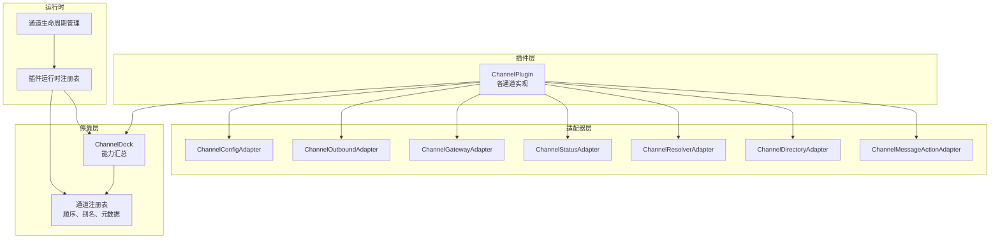
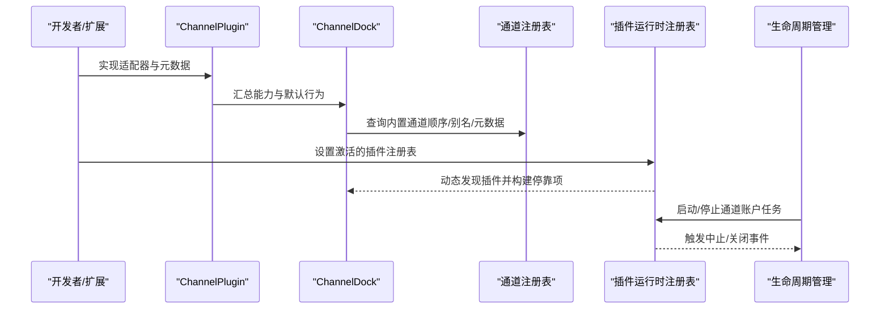
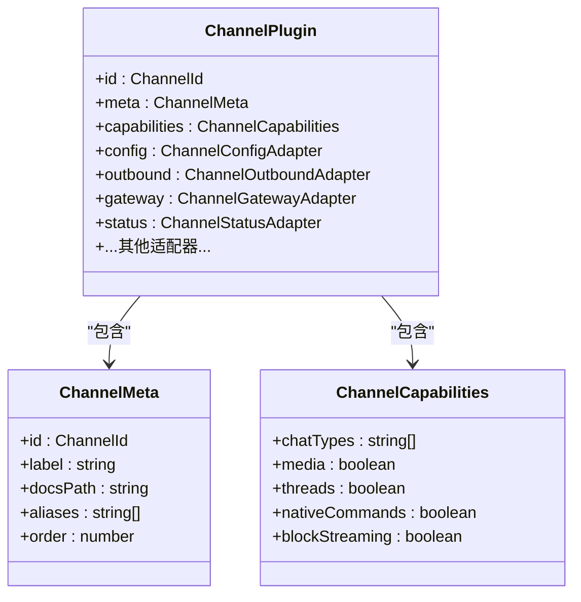
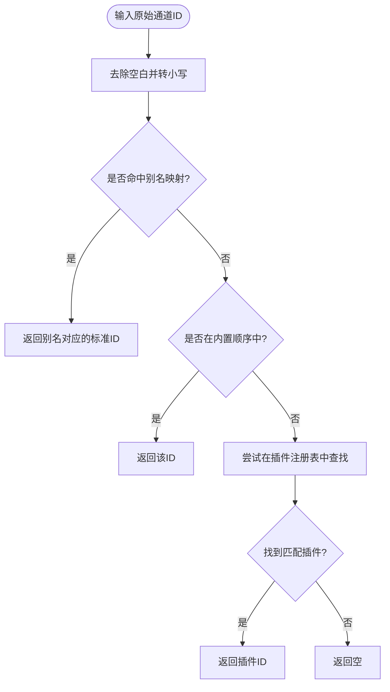
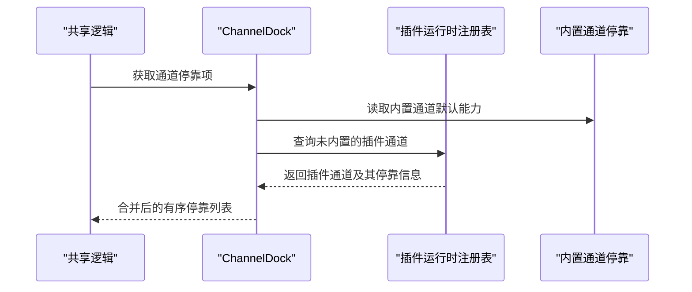
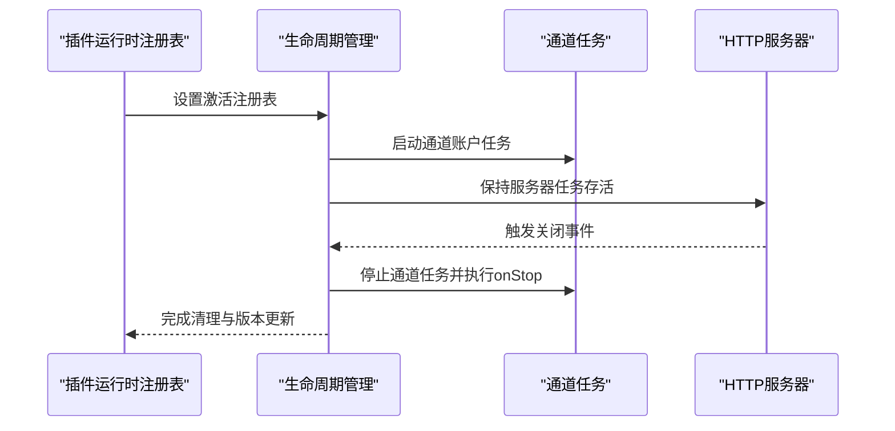
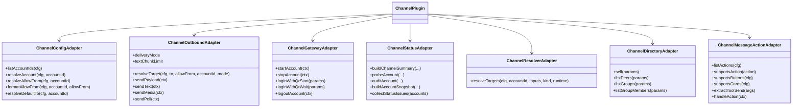
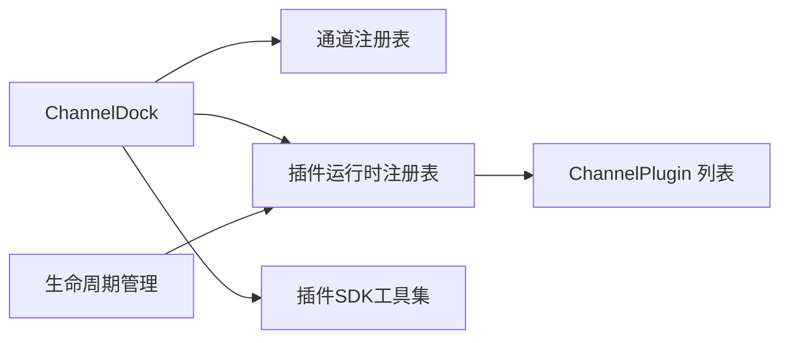

# 通道架构设计

<cite>
**本文引用的文件**
- [src/plugin-sdk/index.ts](file://src/plugin-sdk/index.ts)
- [src/channels/plugins/types.ts](file://src/channels/plugins/types.ts)
- [src/channels/registry.ts](file://src/channels/registry.ts)
- [src/channels/dock.ts](file://src/channels/dock.ts)
- [src/plugin-sdk/channel-lifecycle.ts](file://src/plugin-sdk/channel-lifecycle.ts)
- [src/plugins/runtime.ts](file://src/plugins/runtime.ts)
- [src/channels/plugins/types.adapters.ts](file://src/channels/plugins/types.adapters.ts)
- [src/channels/plugins/types.core.ts](file://src/channels/plugins/types.core.ts)
- [src/channels/plugins/types.plugin.ts](file://src/channels/plugins/types.plugin.ts)
</cite>

## 目录

1. [引言](#引言)
2. [项目结构](#项目结构)
3. [核心组件](#核心组件)
4. [架构总览](#架构总览)
5. [详细组件分析](#详细组件分析)
6. [依赖关系分析](#依赖关系分析)
7. [性能考量](#性能考量)
8. [故障排查指南](#故障排查指南)
9. [结论](#结论)
10. [附录：最佳实践与扩展指南](#附录最佳实践与扩展指南)

## 引言

本文件面向OpenClaw的通道（Channel）架构设计，系统阐述通道适配器的核心原理与实现方式，覆盖以下主题：

- 通道注册机制与插件化设计模式
- 统一接口抽象与能力模型
- 通道元数据管理、别名解析与排序策略
- 通道生命周期管理、动态加载与运行时注册
- 性能优化策略与最佳实践
- 扩展指南与外部插件接入要点

目标是帮助开发者在不深入底层实现细节的前提下，理解并高效扩展OpenClaw的多通道支持体系。

## 项目结构

OpenClaw的通道架构围绕“插件化 + 统一适配器 + 轻量停靠（Dock）”三层设计展开：

- 插件层：每个通道以ChannelPlugin形式实现，定义配置、认证、网关、消息发送、状态检查等能力。
- 适配器层：通过统一的适配器类型（如ChannelOutboundAdapter、ChannelGatewayAdapter等）抽象不同通道的差异化行为。
- 停靠层：ChannelDock提供轻量级能力汇总与默认行为，供共享代码路径使用；同时负责通道排序与别名解析。

图表来源

- [src/channels/plugins/types.plugin.ts:49-85](file://src/channels/plugins/types.plugin.ts#L49-L85)
- [src/channels/plugins/types.adapters.ts:24-384](file://src/channels/plugins/types.adapters.ts#L24-L384)
- [src/channels/dock.ts:65-82](file://src/channels/dock.ts#L65-L82)
- [src/channels/registry.ts:5-21](file://src/channels/registry.ts#L5-L21)
- [src/plugins/runtime.ts:25-41](file://src/plugins/runtime.ts#L25-L41)
- [src/plugin-sdk/channel-lifecycle.ts:51-62](file://src/plugin-sdk/channel-lifecycle.ts#L51-L62)

章节来源

- [src/channels/plugins/types.plugin.ts:32-85](file://src/channels/plugins/types.plugin.ts#L32-L85)
- [src/channels/plugins/types.adapters.ts:24-384](file://src/channels/plugins/types.adapters.ts#L24-L384)
- [src/channels/dock.ts:65-82](file://src/channels/dock.ts#L65-L82)
- [src/channels/registry.ts:5-21](file://src/channels/registry.ts#L5-L21)
- [src/plugins/runtime.ts:25-41](file://src/plugins/runtime.ts#L25-L41)
- [src/plugin-sdk/channel-lifecycle.ts:51-62](file://src/plugin-sdk/channel-lifecycle.ts#L51-L62)

## 核心组件

- 通道插件（ChannelPlugin）
  - 定义通道的唯一标识、元数据、能力清单以及所有适配器实现。
  - 支持可选的配置Schema、网关方法声明、代理工具等。
- 适配器集合（Adapters）
  - 配置与安全：ChannelConfigAdapter、ChannelSecurityAdapter
  - 网关与认证：ChannelGatewayAdapter、ChannelAuthAdapter、ChannelPairingAdapter
  - 消息与目录：ChannelOutboundAdapter、ChannelResolverAdapter、ChannelDirectoryAdapter
  - 行为与策略：ChannelGroupAdapter、ChannelThreadingAdapter、ChannelMentionAdapter、ChannelMessageActionAdapter
- 通道停靠（ChannelDock）
  - 轻量汇总各通道的能力、默认行为与格式化规则，供共享逻辑调用。
  - 提供默认的文本分片限制、流式合并参数、提及清理模式等。
- 通道注册表（Registry）
  - 维护内置通道顺序、别名映射与元数据，提供标准化的ID归一化与查询。
- 插件运行时注册表（Plugin Runtime Registry）
  - 全局持有当前激活的插件注册表，支持动态设置与版本追踪。
- 生命周期管理（Channel Lifecycle）
  - 提供被动账户生命周期、HTTP服务器任务保活、中止信号处理等通用能力。

章节来源

- [src/channels/plugins/types.plugin.ts:49-85](file://src/channels/plugins/types.plugin.ts#L49-L85)
- [src/channels/plugins/types.adapters.ts:24-384](file://src/channels/plugins/types.adapters.ts#L24-L384)
- [src/channels/dock.ts:65-82](file://src/channels/dock.ts#L65-L82)
- [src/channels/registry.ts:5-21](file://src/channels/registry.ts#L5-L21)
- [src/plugins/runtime.ts:25-41](file://src/plugins/runtime.ts#L25-L41)
- [src/plugin-sdk/channel-lifecycle.ts:14-107](file://src/plugin-sdk/channel-lifecycle.ts#L14-L107)

## 架构总览

下图展示从“通道插件到停靠层再到注册表与运行时”的整体交互：

图表来源

- [src/channels/dock.ts:558-582](file://src/channels/dock.ts#L558-L582)
- [src/channels/registry.ts:135-160](file://src/channels/registry.ts#L135-L160)
- [src/plugins/runtime.ts:25-41](file://src/plugins/runtime.ts#L25-L41)
- [src/plugin-sdk/channel-lifecycle.ts:51-62](file://src/plugin-sdk/channel-lifecycle.ts#L51-L62)

## 详细组件分析

### 通道插件与统一接口抽象

- ChannelPlugin作为统一契约，要求实现配置、安全、网关、消息、状态、目录、动作、心跳等适配器。
- 通过ChannelMeta与ChannelCapabilities，通道可以声明自身特性（如是否支持媒体、线程、原生命令等），便于上层策略与UI选择。

图表来源

- [src/channels/plugins/types.plugin.ts:49-85](file://src/channels/plugins/types.plugin.ts#L49-L85)
- [src/channels/plugins/types.core.ts:76-95](file://src/channels/plugins/types.core.ts#L76-L95)
- [src/channels/plugins/types.core.ts:181-194](file://src/channels/plugins/types.core.ts#L181-L194)

章节来源

- [src/channels/plugins/types.plugin.ts:49-85](file://src/channels/plugins/types.plugin.ts#L49-L85)
- [src/channels/plugins/types.core.ts:76-95](file://src/channels/plugins/types.core.ts#L76-L95)
- [src/channels/plugins/types.core.ts:181-194](file://src/channels/plugins/types.core.ts#L181-L194)

### 通道注册机制与别名解析

- 内置通道顺序与元数据集中维护，确保一致性与可发现性。
- 别名映射支持用户以多种名称引用同一通道，提升易用性。
- 归一化函数对输入进行大小写与空白处理，并优先匹配别名再回退到标准ID。

图表来源

- [src/channels/registry.ts:147-160](file://src/channels/registry.ts#L147-L160)
- [src/channels/registry.ts:166-183](file://src/channels/registry.ts#L166-L183)

章节来源

- [src/channels/registry.ts:5-21](file://src/channels/registry.ts#L5-L21)
- [src/channels/registry.ts:123-160](file://src/channels/registry.ts#L123-L160)
- [src/channels/registry.ts:166-183](file://src/channels/registry.ts#L166-L183)

### 通道停靠（Dock）与默认行为

- ChannelDock以轻量方式汇总各通道的能力与默认行为，避免共享代码直接依赖重型插件模块。
- 对于每种内置通道，提供默认的文本分片限制、提及清理正则、线程上下文构建等。
- 外部插件可通过插件运行时注册表动态注入，停靠层自动合并内置与插件项，并按顺序与ID排序。

图表来源

- [src/channels/dock.ts:604-623](file://src/channels/dock.ts#L604-L623)
- [src/channels/dock.ts:625-636](file://src/channels/dock.ts#L625-L636)
- [src/channels/dock.ts:584-602](file://src/channels/dock.ts#L584-L602)

章节来源

- [src/channels/dock.ts:65-82](file://src/channels/dock.ts#L65-L82)
- [src/channels/dock.ts:238-556](file://src/channels/dock.ts#L238-L556)
- [src/channels/dock.ts:558-582](file://src/channels/dock.ts#L558-L582)
- [src/channels/dock.ts:584-636](file://src/channels/dock.ts#L584-L636)

### 生命周期管理与动态加载

- 被动账户生命周期：启动后等待中止信号，随后执行清理与收尾。
- HTTP服务器保活：监听服务器关闭事件，并在中止信号触发时优雅退出。
- 插件运行时注册表：全局持有当前激活的插件注册表，支持版本号递增与键值缓存，便于动态切换与热更新。

图表来源

- [src/plugins/runtime.ts:25-41](file://src/plugins/runtime.ts#L25-L41)
- [src/plugin-sdk/channel-lifecycle.ts:51-62](file://src/plugin-sdk/channel-lifecycle.ts#L51-L62)
- [src/plugin-sdk/channel-lifecycle.ts:70-107](file://src/plugin-sdk/channel-lifecycle.ts#L70-L107)

章节来源

- [src/plugin-sdk/channel-lifecycle.ts:14-107](file://src/plugin-sdk/channel-lifecycle.ts#L14-L107)
- [src/plugins/runtime.ts:25-41](file://src/plugins/runtime.ts#L25-L41)

### 适配器职责与协作

- 配置与安全：解析允许来源、格式化显示、默认目标解析、DM策略与警告收集。
- 网关与认证：账户启动/停止、二维码登录、登出流程。
- 消息与目录：消息发送、目标解析、目录查询、消息动作处理。
- 策略与行为：群组策略、提及清理、线程上下文、流式合并策略。

图表来源

- [src/channels/plugins/types.adapters.ts:52-384](file://src/channels/plugins/types.adapters.ts#L52-L384)
- [src/channels/plugins/types.plugin.ts:49-85](file://src/channels/plugins/types.plugin.ts#L49-L85)

章节来源

- [src/channels/plugins/types.adapters.ts:52-384](file://src/channels/plugins/types.adapters.ts#L52-L384)
- [src/channels/plugins/types.core.ts:286-372](file://src/channels/plugins/types.core.ts#L286-L372)

## 依赖关系分析

- 低耦合高内聚
  - 停靠层仅依赖轻量配置与默认行为，避免引入重型监控或登录模块。
  - 注册表与运行时注册表解耦，前者专注元数据与别名，后者专注动态发现与版本控制。
- 关键依赖链
  - ChannelDock依赖内置停靠表与插件运行时注册表，用于合并与排序。
  - 适配器依赖共享SDK中的工具（如允许来源格式化、线程上下文构建等）。
  - 生命周期管理依赖运行时注册表提供的活跃实例与中止信号。

图表来源

- [src/channels/dock.ts:604-623](file://src/channels/dock.ts#L604-L623)
- [src/channels/registry.ts:135-160](file://src/channels/registry.ts#L135-L160)
- [src/plugins/runtime.ts:25-41](file://src/plugins/runtime.ts#L25-L41)
- [src/plugin-sdk/index.ts:1-826](file://src/plugin-sdk/index.ts#L1-L826)

章节来源

- [src/channels/dock.ts:604-623](file://src/channels/dock.ts#L604-L623)
- [src/channels/registry.ts:135-160](file://src/channels/registry.ts#L135-L160)
- [src/plugins/runtime.ts:25-41](file://src/plugins/runtime.ts#L25-L41)
- [src/plugin-sdk/index.ts:1-826](file://src/plugin-sdk/index.ts#L1-L826)

## 性能考量

- 文本分片与流式合并
  - 不同通道采用不同的文本分片上限与流式合并策略，避免超限与抖动。
  - 可通过停靠层默认配置与通道特定设置平衡吞吐与兼容性。
- 轻量停靠与延迟加载
  - 停靠层避免导入重型模块，注册表与运行时注册表仅在需要时访问，降低冷启动成本。
- 并发与队列
  - 插件可声明重载前缀与去抖配置，配合SDK的键控异步队列，减少重复请求与资源竞争。
- 状态与审计
  - 通过状态适配器的探测与审计，提前发现连接问题，减少失败重试带来的开销。

章节来源

- [src/channels/dock.ts:91-95](file://src/channels/dock.ts#L91-L95)
- [src/channels/dock.ts:367-370](file://src/channels/dock.ts#L367-L370)
- [src/channels/plugins/types.plugin.ts:53-58](file://src/channels/plugins/types.plugin.ts#L53-L58)
- [src/plugin-sdk/index.ts:146-147](file://src/plugin-sdk/index.ts#L146-L147)

## 故障排查指南

- 通道不可识别
  - 检查通道ID是否在内置顺序或插件注册表中存在；确认别名映射是否正确。
- 运行时未加载插件
  - 确认已调用设置激活插件注册表；核对版本号是否递增。
- 生命周期异常
  - 确认中止信号传递与事件监听是否正确；检查HTTP服务器关闭回调是否触发。
- 状态与审计
  - 使用状态适配器的探测与审计能力，定位鉴权、权限与配置问题；结合状态问题收集器输出进行诊断。

章节来源

- [src/channels/registry.ts:147-183](file://src/channels/registry.ts#L147-L183)
- [src/plugins/runtime.ts:25-41](file://src/plugins/runtime.ts#L25-L41)
- [src/plugin-sdk/channel-lifecycle.ts:70-107](file://src/plugin-sdk/channel-lifecycle.ts#L70-L107)
- [src/channels/plugins/types.adapters.ts:127-166](file://src/channels/plugins/types.adapters.ts#L127-L166)

## 结论

OpenClaw的通道架构通过“插件化 + 统一适配器 + 轻量停靠”的设计，在保证扩展性的同时实现了跨通道的一致体验。内置通道与插件通道共享同一套抽象与工具集，借助停靠层与运行时注册表完成动态发现与排序，辅以生命周期管理与状态审计，形成完整、可演进的通道生态。

## 附录：最佳实践与扩展指南

- 插件开发
  - 明确声明ChannelMeta与ChannelCapabilities，确保UI与策略层正确识别。
  - 优先使用插件SDK中的工具（如允许来源格式化、线程上下文构建、文本分片等）。
  - 在适配器中提供最小可行实现，避免在插件入口处引入重型依赖。
- 注册与排序
  - 若为内置通道，将其加入内置顺序与元数据表；若为外部插件，通过运行时注册表动态注入。
  - 使用别名映射提升用户输入的容错性。
- 生命周期
  - 使用被动账户生命周期与HTTP服务器保活工具，确保优雅启停与资源回收。
- 性能优化
  - 合理设置文本分片与流式合并参数；利用重载前缀与去抖配置减少无效调用。
- 安全与合规
  - 通过安全适配器与状态适配器收集警告与问题，及时修复鉴权与权限配置。

章节来源

- [src/channels/plugins/types.plugin.ts:49-85](file://src/channels/plugins/types.plugin.ts#L49-L85)
- [src/channels/plugins/types.adapters.ts:52-384](file://src/channels/plugins/types.adapters.ts#L52-L384)
- [src/channels/dock.ts:91-95](file://src/channels/dock.ts#L91-L95)
- [src/channels/registry.ts:5-21](file://src/channels/registry.ts#L5-L21)
- [src/plugins/runtime.ts:25-41](file://src/plugins/runtime.ts#L25-L41)
- [src/plugin-sdk/channel-lifecycle.ts:51-62](file://src/plugin-sdk/channel-lifecycle.ts#L51-L62)
