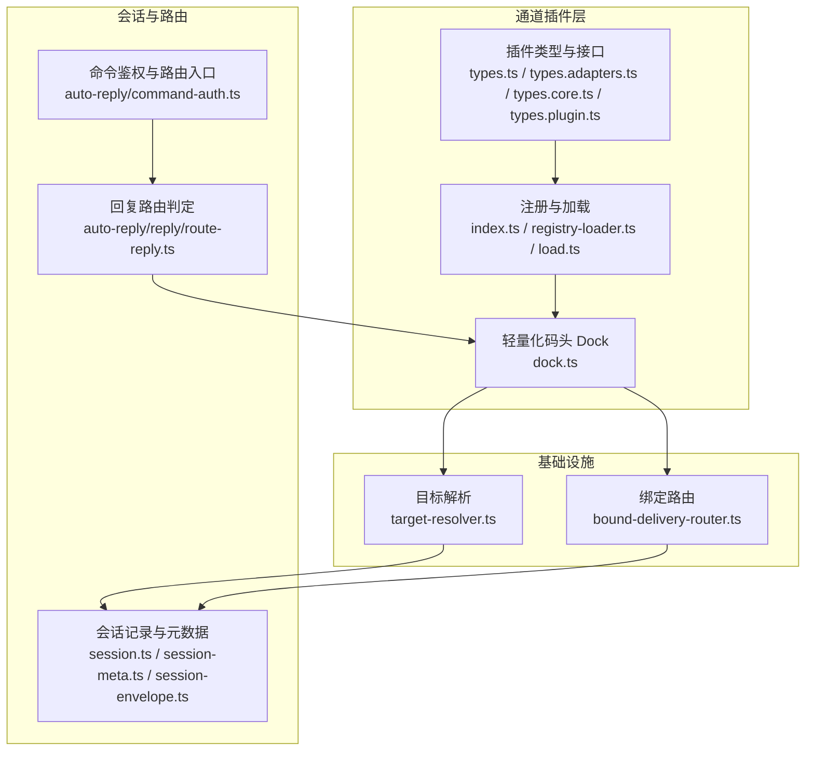
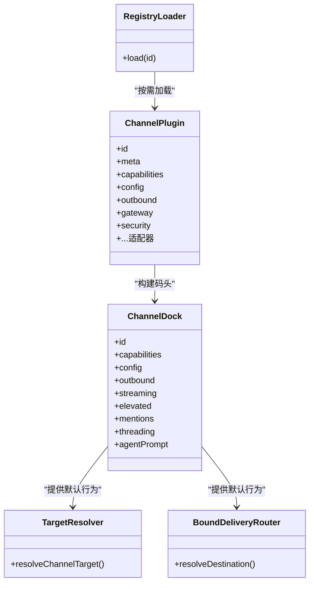
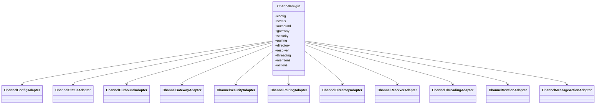
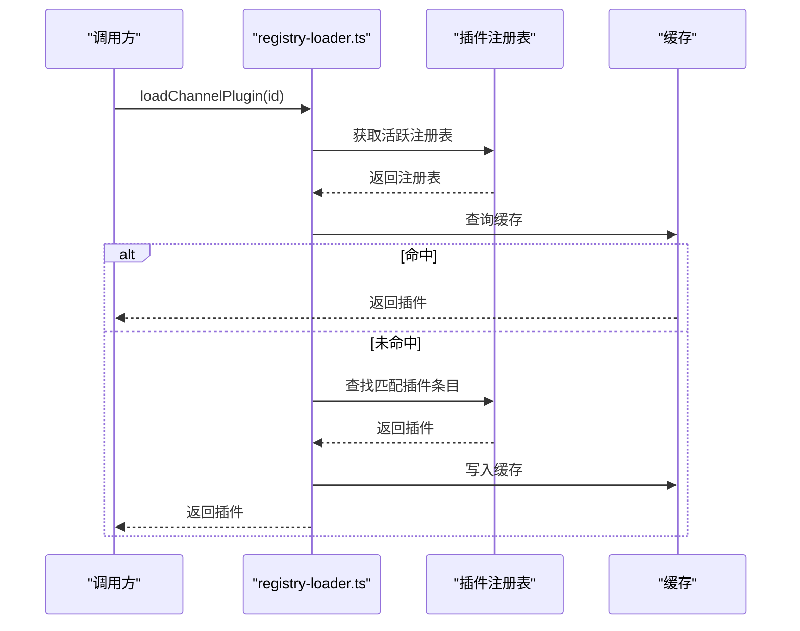
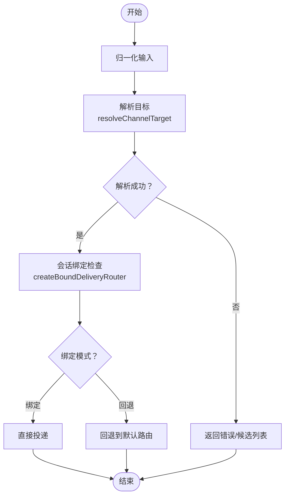
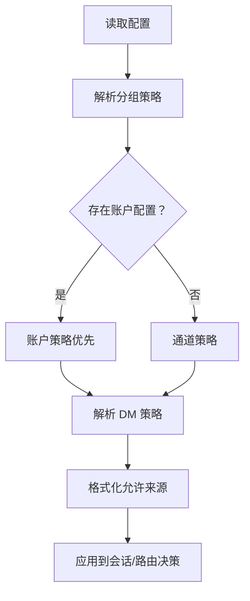
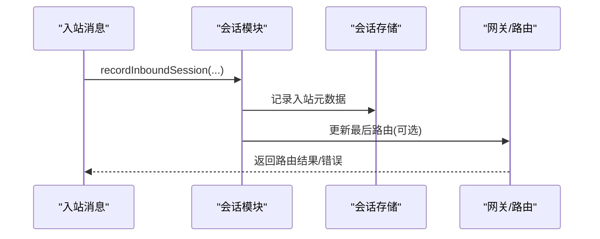
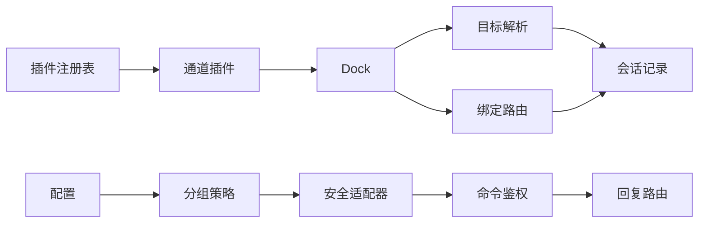

# 通道适配器

<cite>
**本文引用的文件**
- [src/channels/plugins/types.ts](file://src/channels/plugins/types.ts)
- [src/channels/plugins/index.ts](file://src/channels/plugins/index.ts)
- [src/channels/plugins/registry-loader.ts](file://src/channels/plugins/registry-loader.ts)
- [src/channels/plugins/load.ts](file://src/channels/plugins/load.ts)
- [src/channels/plugins/types.adapters.ts](file://src/channels/plugins/types.adapters.ts)
- [src/channels/plugins/types.core.ts](file://src/channels/plugins/types.core.ts)
- [src/channels/plugins/types.plugin.ts](file://src/channels/plugins/types.plugin.ts)
- [src/channels/dock.ts](file://src/channels/dock.ts)
- [src/channels/session.ts](file://src/channels/session.ts)
- [src/channels/session-envelope.ts](file://src/channels/session-envelope.ts)
- [src/channels/session-meta.ts](file://src/channels/session-meta.ts)
- [src/infra/outbound/target-resolver.ts](file://src/infra/outbound/target-resolver.ts)
- [src/infra/outbound/bound-delivery-router.ts](file://src/infra/outbound/bound-delivery-router.ts)
- [src/commands/agent/delivery.ts](file://src/commands/agent/delivery.ts)
- [src/auto-reply/command-auth.ts](file://src/auto-reply/command-auth.ts)
- [src/auto-reply/reply/route-reply.ts](file://src/auto-reply/reply/route-reply.ts)
- [src/config/group-policy.ts](file://src/config/group-policy.ts)
- [src/channels/plugins/helpers.ts](file://src/channels/plugins/helpers.ts)
- [src/gateway/sessions-resolve.ts](file://src/gateway/sessions-resolve.ts)
- [src/sessions/session-label.ts](file://src/sessions/session-label.ts)
- [src/sessions/session-id.ts](file://src/sessions/session-id.ts)
- [src/acp/session-mapper.ts](file://src/acp/session-mapper.ts)
</cite>

## 目录

1. [引言](#引言)
2. [项目结构](#项目结构)
3. [核心组件](#核心组件)
4. [架构总览](#架构总览)
5. [详细组件分析](#详细组件分析)
6. [依赖关系分析](#依赖关系分析)
7. [性能考量](#性能考量)
8. [故障排查指南](#故障排查指南)
9. [结论](#结论)
10. [附录：开发指南与最佳实践](#附录开发指南与最佳实践)

## 引言

本文件系统性阐述 OpenClaw 的通道适配器体系，覆盖适配器注册机制、消息路由策略、统一接口设计、通道配置与权限安全、消息标准化、会话管理以及错误处理等关键主题。目标是帮助开发者快速理解并扩展新的通道适配器，同时为运维与安全人员提供可操作的参考。

## 项目结构

通道适配器位于 src/channels/plugins 下，围绕“插件化 + 轻量化码头(Dock)”的设计组织代码：

- 插件类型与统一接口：types.ts/types.adapters.ts/types.core.ts/types.plugin.ts
- 注册与加载：index.ts、registry-loader.ts、load.ts
- 轻量化码头 Dock：dock.ts（聚合各通道能力与默认行为）
- 消息路由与目标解析：infra/outbound 下的目标解析与绑定路由
- 会话管理：channels/session\*.ts 与 sessions 配置交互
- 权限与安全：分组策略、允许来源、DM 策略等

图表来源

- [src/channels/plugins/types.ts:1-66](file://src/channels/plugins/types.ts#L1-L66)
- [src/channels/plugins/index.ts:1-118](file://src/channels/plugins/index.ts#L1-L118)
- [src/channels/plugins/registry-loader.ts:1-36](file://src/channels/plugins/registry-loader.ts#L1-L36)
- [src/channels/plugins/load.ts:1-9](file://src/channels/plugins/load.ts#L1-L9)
- [src/channels/dock.ts:1-637](file://src/channels/dock.ts#L1-L637)
- [src/infra/outbound/target-resolver.ts:1-41](file://src/infra/outbound/target-resolver.ts#L1-L41)
- [src/infra/outbound/bound-delivery-router.ts:49-91](file://src/infra/outbound/bound-delivery-router.ts#L49-L91)
- [src/channels/session.ts:1-82](file://src/channels/session.ts#L1-L82)
- [src/channels/session-meta.ts:1-25](file://src/channels/session-meta.ts#L1-L25)
- [src/channels/session-envelope.ts:1-22](file://src/channels/session-envelope.ts#L1-L22)
- [src/auto-reply/command-auth.ts:24-61](file://src/auto-reply/command-auth.ts#L24-L61)
- [src/auto-reply/reply/route-reply.ts:178-191](file://src/auto-reply/reply/route-reply.ts#L178-L191)

章节来源

- [src/channels/plugins/types.ts:1-66](file://src/channels/plugins/types.ts#L1-L66)
- [src/channels/plugins/index.ts:1-118](file://src/channels/plugins/index.ts#L1-L118)
- [src/channels/plugins/registry-loader.ts:1-36](file://src/channels/plugins/registry-loader.ts#L1-L36)
- [src/channels/plugins/load.ts:1-9](file://src/channels/plugins/load.ts#L1-L9)
- [src/channels/dock.ts:1-637](file://src/channels/dock.ts#L1-L637)

## 核心组件

- 通道插件接口契约：定义统一的适配器集合（配置、网关、出站、目录、解析、安全、心跳、消息动作等），确保不同通道以一致方式接入系统。
- 插件注册与加载：通过运行时插件注册表获取已安装通道，并提供缓存与去重逻辑，避免重复初始化。
- 轻量化码头 Dock：对各通道的能力、默认行为、允许来源格式化、线程策略等进行集中配置，供共享路径使用。
- 目标解析与绑定路由：在发送前解析收件人、选择账户与会话绑定，保证消息按预期路由。
- 会话管理：记录入站元数据、更新最近路由、维护会话标签与键值映射，支撑跨通道一致性体验。
- 权限与安全：基于分组策略、DM 策略、允许来源白名单与配额/审计结果，统一控制访问与执行范围。

章节来源

- [src/channels/plugins/types.adapters.ts:24-384](file://src/channels/plugins/types.adapters.ts#L24-L384)
- [src/channels/plugins/types.core.ts:1-403](file://src/channels/plugins/types.core.ts#L1-L403)
- [src/channels/plugins/types.plugin.ts:49-86](file://src/channels/plugins/types.plugin.ts#L49-L86)
- [src/channels/plugins/index.ts:74-90](file://src/channels/plugins/index.ts#L74-L90)
- [src/channels/dock.ts:65-82](file://src/channels/dock.ts#L65-L82)
- [src/infra/outbound/target-resolver.ts:32-41](file://src/infra/outbound/target-resolver.ts#L32-L41)
- [src/infra/outbound/bound-delivery-router.ts:55-91](file://src/infra/outbound/bound-delivity-router.ts#L55-L91)
- [src/channels/session.ts:41-82](file://src/channels/session.ts#L41-L82)
- [src/channels/session-meta.ts:5-25](file://src/channels/session-meta.ts#L5-L25)
- [src/channels/session-envelope.ts:5-22](file://src/channels/session-envelope.ts#L5-L22)

## 架构总览

通道适配器采用“插件 + 码头 + 基础设施”的分层架构：

- 插件层：每个通道实现一组适配器接口，暴露能力与行为。
- 码头层：对插件能力进行汇总与默认配置，形成统一的 Dock 接口，供共享路径调用。
- 基础设施层：目标解析、绑定路由、会话记录、权限校验等横切关注点。
- 上层应用：命令鉴权、回复路由、网关交互等。

图表来源

- [src/channels/plugins/types.plugin.ts:49-86](file://src/channels/plugins/types.plugin.ts#L49-L86)
- [src/channels/dock.ts:558-582](file://src/channels/dock.ts#L558-L582)
- [src/channels/plugins/registry-loader.ts:9-35](file://src/channels/plugins/registry-loader.ts#L9-L35)
- [src/infra/outbound/target-resolver.ts:32-41](file://src/infra/outbound/target-resolver.ts#L32-L41)
- [src/infra/outbound/bound-delivery-router.ts:55-91](file://src/infra/outbound/bound-delivery-router.ts#L55-L91)

## 详细组件分析

### 组件A：通道插件接口与统一契约

- 类型分层清晰：核心类型、适配器接口、插件契约三者分离，便于扩展与测试。
- 关键接口族：
  - 配置与状态：ChannelConfigAdapter、ChannelStatusAdapter
  - 出站与网关：ChannelOutboundAdapter、ChannelGatewayAdapter
  - 安全与权限：ChannelSecurityAdapter、ChannelPairingAdapter
  - 目录与解析：ChannelDirectoryAdapter、ChannelResolverAdapter
  - 线程与提及：ChannelThreadingAdapter、ChannelMentionAdapter
  - 消息动作：ChannelMessageActionAdapter
- 插件契约 ChannelPlugin 将上述适配器组合，形成完整通道能力集。

图表来源

- [src/channels/plugins/types.adapters.ts:52-384](file://src/channels/plugins/types.adapters.ts#L52-L384)
- [src/channels/plugins/types.plugin.ts:49-86](file://src/channels/plugins/types.plugin.ts#L49-L86)

章节来源

- [src/channels/plugins/types.adapters.ts:24-384](file://src/channels/plugins/types.adapters.ts#L24-L384)
- [src/channels/plugins/types.core.ts:11-403](file://src/channels/plugins/types.core.ts#L11-L403)
- [src/channels/plugins/types.plugin.ts:49-86](file://src/channels/plugins/types.plugin.ts#L49-L86)

### 组件B：适配器注册与加载机制

- 运行时插件注册表：通过 requireActivePluginRegistry 获取当前已激活的插件集合。
- 缓存与去重：listChannelPlugins/getChannelPlugin 提供缓存与去重，避免重复扫描与实例化。
- 加载器：createChannelRegistryLoader 支持按通道 ID 解析并缓存特定值（如 ChannelPlugin）。
- 规范化：normalizeChannelId 委托至通道注册表进行 ID 归一化。

图表来源

- [src/channels/plugins/registry-loader.ts:15-35](file://src/channels/plugins/registry-loader.ts#L15-L35)
- [src/channels/plugins/load.ts:6-8](file://src/channels/plugins/load.ts#L6-L8)
- [src/channels/plugins/index.ts:74-90](file://src/channels/plugins/index.ts#L74-L90)

章节来源

- [src/channels/plugins/index.ts:42-90](file://src/channels/plugins/index.ts#L42-L90)
- [src/channels/plugins/registry-loader.ts:9-35](file://src/channels/plugins/registry-loader.ts#L9-L35)
- [src/channels/plugins/load.ts:1-9](file://src/channels/plugins/load.ts#L1-L9)

### 组件C：消息路由策略与目标解析

- 目标解析：resolveChannelTarget 负责将用户输入归一化并解析为具体收件人 ID、类型与显示名，支持目录查询与规范化。
- 绑定路由：createBoundDeliveryRouter 基于会话绑定与请求者身份，决定“绑定直发”或“回退”模式，避免歧义。
- 出站适配器：ChannelOutboundAdapter 定义文本/媒体/poll 发送与分片策略，支持显式/隐式目标模式。

图表来源

- [src/infra/outbound/target-resolver.ts:32-41](file://src/infra/outbound/target-resolver.ts#L32-L41)
- [src/infra/outbound/bound-delivery-router.ts:55-91](file://src/infra/outbound/bound-delivery-router.ts#L55-L91)

章节来源

- [src/infra/outbound/target-resolver.ts:21-41](file://src/infra/outbound/target-resolver.ts#L21-L41)
- [src/infra/outbound/bound-delivery-router.ts:55-91](file://src/infra/outbound/bound-delivery-router.ts#L55-L91)
- [src/channels/plugins/types.adapters.ts:108-125](file://src/channels/plugins/types.adapters.ts#L108-L125)

### 组件D：统一接口设计与消息标准化

- 统一上下文：ChannelOutboundContext/ChannelOutboundPayloadContext 为出站发送提供一致参数模型。
- 消息动作：ChannelMessageActionAdapter 支持声明动作、按钮、卡片能力，提取工具发送目标，保障跨通道一致性。
- 提及与线程：ChannelMentionAdapter/ChannelThreadingAdapter 提供提及剥离与线程上下文构建，减少通道差异。

章节来源

- [src/channels/plugins/types.adapters.ts:89-125](file://src/channels/plugins/types.adapters.ts#L89-L125)
- [src/channels/plugins/types.core.ts:286-372](file://src/channels/plugins/types.core.ts#L286-L372)

### 组件E：通道配置系统与权限管理

- 分组策略：resolveChannelGroupPolicyMode/resolveChannelGroups 从全局与账户维度解析分组策略与成员集合。
- DM 策略：buildAccountScopedDmSecurityPolicy 生成账户级 DM 策略，包含策略路径、允许来源路径与批准提示。
- 允许来源：各通道通过 Dock 的 resolveAllowFrom/formatAllowFrom 实现格式化与归一化，确保跨通道一致。
- 配置 Schema：ChannelConfigSchema 支持 UI 提示与敏感字段标记，提升配置体验与安全性。

图表来源

- [src/config/group-policy.ts:282-323](file://src/config/group-policy.ts#L282-L323)
- [src/channels/plugins/helpers.ts:23-58](file://src/channels/plugins/helpers.ts#L23-L58)

章节来源

- [src/config/group-policy.ts:282-323](file://src/config/group-policy.ts#L282-L323)
- [src/channels/plugins/helpers.ts:23-58](file://src/channels/plugins/helpers.ts#L23-L58)
- [src/channels/dock.ts:238-556](file://src/channels/dock.ts#L238-L556)

### 组件F：会话管理与错误处理

- 会话记录：recordInboundSession 记录入站元数据并可选更新最后路由，支持主 DM 钉住场景的跳过逻辑。
- 会话元数据：recordInboundSessionMetaSafe 包装安全记录，捕获异常并回调。
- 会话封套：resolveInboundSessionEnvelopeContext 提供封套格式选项与上次时间戳，辅助消息包装。
- 错误处理：会话解析与路由过程中对缺失/重复会话进行明确错误响应；命令鉴权与回复路由对不可路由通道进行保护。

图表来源

- [src/channels/session.ts:41-82](file://src/channels/session.ts#L41-L82)
- [src/channels/session-meta.ts:5-25](file://src/channels/session-meta.ts#L5-L25)
- [src/channels/session-envelope.ts:5-22](file://src/channels/session-envelope.ts#L5-L22)

章节来源

- [src/channels/session.ts:1-82](file://src/channels/session.ts#L1-L82)
- [src/channels/session-meta.ts:1-25](file://src/channels/session-meta.ts#L1-L25)
- [src/channels/session-envelope.ts:1-22](file://src/channels/session-envelope.ts#L1-L22)
- [src/auto-reply/reply/route-reply.ts:178-191](file://src/auto-reply/reply/route-reply.ts#L178-L191)

## 依赖关系分析

- 低耦合高内聚：插件仅暴露适配器接口，Dock 聚合默认行为，避免上层直接依赖具体通道实现。
- 关键依赖链：
  - 插件注册表 → 插件实例 → Dock → 目标解析/绑定路由 → 会话记录
  - 配置解析 → 分组策略/DM 策略 → 安全适配器 → 权限决策
  - 命令鉴权 → 回复路由判定 → 出站适配器

图表来源

- [src/channels/plugins/index.ts:42-90](file://src/channels/plugins/index.ts#L42-L90)
- [src/channels/dock.ts:558-637](file://src/channels/dock.ts#L558-L637)
- [src/infra/outbound/target-resolver.ts:32-41](file://src/infra/outbound/target-resolver.ts#L32-L41)
- [src/infra/outbound/bound-delivery-router.ts:55-91](file://src/infra/outbound/bound-delivery-router.ts#L55-L91)
- [src/channels/session.ts:41-82](file://src/channels/session.ts#L41-L82)
- [src/config/group-policy.ts:282-323](file://src/config/group-policy.ts#L282-L323)
- [src/channels/plugins/types.adapters.ts:378-383](file://src/channels/plugins/types.adapters.ts#L378-L383)
- [src/auto-reply/command-auth.ts:24-61](file://src/auto-reply/command-auth.ts#L24-L61)
- [src/auto-reply/reply/route-reply.ts:178-191](file://src/auto-reply/reply/route-reply.ts#L178-L191)

章节来源

- [src/channels/plugins/index.ts:42-90](file://src/channels/plugins/index.ts#L42-L90)
- [src/channels/dock.ts:558-637](file://src/channels/dock.ts#L558-L637)
- [src/infra/outbound/target-resolver.ts:32-41](file://src/infra/outbound/target-resolver.ts#L32-L41)
- [src/infra/outbound/bound-delivery-router.ts:55-91](file://src/infra/outbound/bound-delivery-router.ts#L55-L91)
- [src/channels/session.ts:41-82](file://src/channels/session.ts#L41-L82)
- [src/config/group-policy.ts:282-323](file://src/config/group-policy.ts#L282-L323)
- [src/channels/plugins/types.adapters.ts:378-383](file://src/channels/plugins/types.adapters.ts#L378-L383)
- [src/auto-reply/command-auth.ts:24-61](file://src/auto-reply/command-auth.ts#L24-L61)
- [src/auto-reply/reply/route-reply.ts:178-191](file://src/auto-reply/reply/route-reply.ts#L178-L191)

## 性能考量

- 缓存与去重：插件列表与 Dock 构建均采用缓存，降低重复扫描成本。
- 文本分片：出站适配器支持 textChunkLimit 与分片模式，避免平台限制导致失败重试。
- 流式合并：部分通道支持流式输出合并阈值，平衡实时性与网络开销。
- 会话存储：会话更新与封套计算尽量最小化 IO，必要时异步处理。

## 故障排查指南

- 会话解析错误
  - 现象：根据 sessionId/label 无法解析或存在多个匹配。
  - 处理：检查会话键是否唯一，确认标签长度与格式；必要时清理重复会话。
  - 参考
    - [src/gateway/sessions-resolve.ts:72-115](file://src/gateway/sessions-resolve.ts#L72-L115)
    - [src/sessions/session-label.ts:1-20](file://src/sessions/session-label.ts#L1-L20)
    - [src/sessions/session-id.ts:1-5](file://src/sessions/session-id.ts#L1-L5)
- 路由不可达
  - 现象：目标解析失败或绑定路由歧义。
  - 处理：确认输入是否符合通道规范；为多账户场景提供 requester 信息；检查 allowFrom 与 DM 策略。
  - 参考
    - [src/infra/outbound/target-resolver.ts:32-41](file://src/infra/outbound/target-resolver.ts#L32-L41)
    - [src/infra/outbound/bound-delivery-router.ts:55-91](file://src/infra/outbound/bound-delivery-router.ts#L55-L91)
- 命令路由保护
  - 现象：内部通道或不可路由通道被拒绝。
  - 处理：确认通道 ID 正确且非内部通道；必要时通过选择器切换。
  - 参考
    - [src/auto-reply/reply/route-reply.ts:178-191](file://src/auto-reply/reply/route-reply.ts#L178-L191)
- 会话映射问题
  - 现象：ACP 会话标签/键解析失败。
  - 处理：确认网关 sessions.resolve 是否可用；检查 meta.sessionLabel/meta.sessionKey。
  - 参考
    - [src/acp/session-mapper.ts:38-98](file://src/acp/session-mapper.ts#L38-L98)

章节来源

- [src/gateway/sessions-resolve.ts:72-115](file://src/gateway/sessions-resolve.ts#L72-L115)
- [src/sessions/session-label.ts:1-20](file://src/sessions/session-label.ts#L1-L20)
- [src/sessions/session-id.ts:1-5](file://src/sessions/session-id.ts#L1-L5)
- [src/infra/outbound/target-resolver.ts:32-41](file://src/infra/outbound/target-resolver.ts#L32-L41)
- [src/infra/outbound/bound-delivery-router.ts:55-91](file://src/infra/outbound/bound-delivery-router.ts#L55-L91)
- [src/auto-reply/reply/route-reply.ts:178-191](file://src/auto-reply/reply/route-reply.ts#L178-L191)
- [src/acp/session-mapper.ts:38-98](file://src/acp/session-mapper.ts#L38-L98)

## 结论

OpenClaw 的通道适配器体系通过“插件 + 码头 + 基础设施”的分层设计，实现了跨通道的一致性与可扩展性。统一接口、缓存加载、目标解析与绑定路由、会话管理与权限安全共同构成了稳定可靠的通信基础。遵循本文档的开发指南与最佳实践，可高效扩展新通道并保障生产环境的稳定性与安全性。

## 附录：开发指南与最佳实践

- 自定义通道实现步骤
  - 定义适配器：至少实现 ChannelConfigAdapter、ChannelOutboundAdapter、ChannelSecurityAdapter 等关键适配器。
  - 插件契约：在 ChannelPlugin 中装配适配器与元数据，设置 capabilities 与默认行为。
  - Dock 集成：若需要默认行为或格式化规则，可在 dock.ts 中补充对应 Dock 条目。
  - 目标解析：在 ChannelMessagingAdapter 中提供 normalizeTarget 与 targetResolver，确保输入兼容。
  - 出站策略：合理设置 textChunkLimit、chunkerMode 与分片策略，避免平台限制。
  - 权限与安全：实现 resolveDmPolicy/collectWarnings，结合 allowFrom 与分组策略。
  - 会话集成：在入站/出站路径中正确记录会话元数据，确保跨通道一致性。
- 最佳实践
  - 使用 createChannelRegistryLoader 构建按需加载器，避免启动时重负载。
  - 在 Dock 中集中处理格式化与默认值，保持通道实现简洁。
  - 对外暴露的 UI 配置使用 ChannelConfigSchema，标注敏感字段与高级选项。
  - 严格区分内部通道与外部通道，避免内部通道被错误路由。
  - 在命令鉴权与回复路由中加入不可路由通道保护，防止异常传播。

章节来源

- [src/channels/plugins/types.adapters.ts:24-384](file://src/channels/plugins/types.adapters.ts#L24-L384)
- [src/channels/plugins/types.plugin.ts:49-86](file://src/channels/plugins/types.plugin.ts#L49-L86)
- [src/channels/dock.ts:238-556](file://src/channels/dock.ts#L238-L556)
- [src/channels/plugins/registry-loader.ts:9-35](file://src/channels/plugins/registry-loader.ts#L9-L35)
- [src/auto-reply/command-auth.ts:24-61](file://src/auto-reply/command-auth.ts#L24-L61)
- [src/auto-reply/reply/route-reply.ts:178-191](file://src/auto-reply/reply/route-reply.ts#L178-L191)
