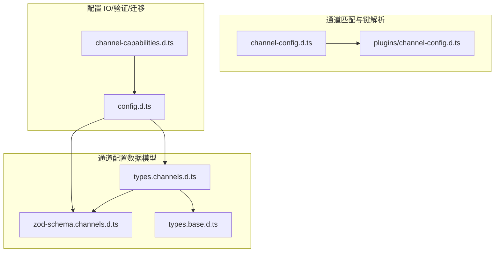
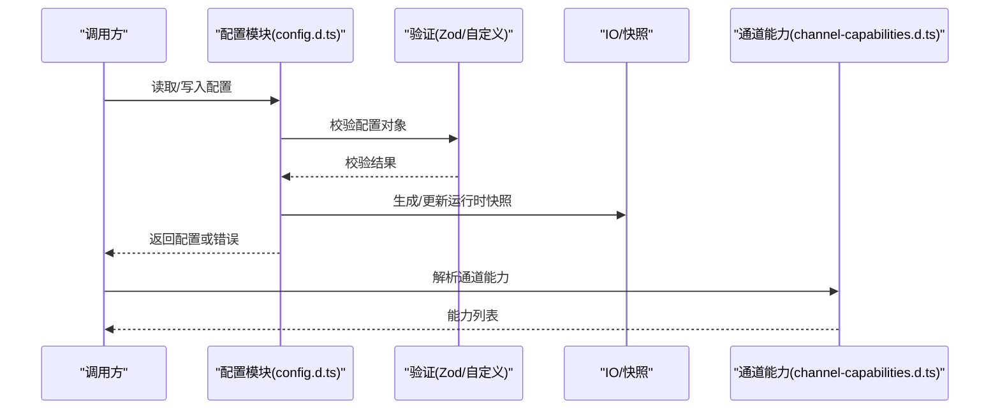
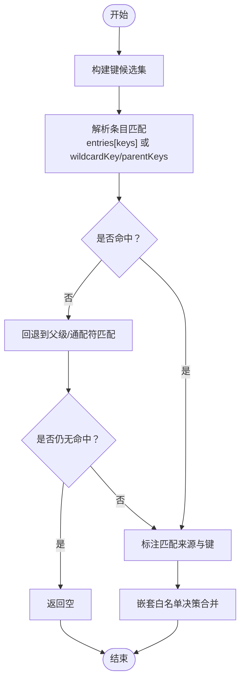
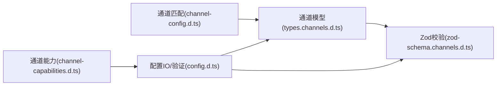

# 通道配置管理

<cite>
**本文引用的文件**
- [channel-config.d.ts](file://dist/plugin-sdk/channels/channel-config.d.ts)
- [channel-config.d.ts（插件）](file://dist/plugin-sdk/channels/plugins/channel-config.d.ts)
- [types.channels.d.ts](file://dist/plugin-sdk/config/types.channels.d.ts)
- [zod-schema.channels.d.ts](file://dist/plugin-sdk/config/zod-schema.channels.d.ts)
- [types.base.d.ts](file://dist/plugin-sdk/config/types.base.d.ts)
- [config.d.ts](file://dist/plugin-sdk/config/config.d.ts)
- [channel-capabilities.d.ts](file://dist/plugin-sdk/config/channel-capabilities.d.ts)
</cite>

## 目录

1. [简介](#简介)
2. [项目结构](#项目结构)
3. [核心组件](#核心组件)
4. [架构总览](#架构总览)
5. [详细组件分析](#详细组件分析)
6. [依赖关系分析](#依赖关系分析)
7. [性能考量](#性能考量)
8. [故障排除指南](#故障排除指南)
9. [结论](#结论)
10. [附录](#附录)

## 简介

本文件系统性梳理 OpenClaw 的“通道配置管理”能力，覆盖通道匹配与键解析、通道配置数据模型、验证与序列化、账户快照字段管理、会话配置与权限策略、配置文件格式与动态更新、以及配置迁移机制。目标是帮助开发者与运维人员在不深入源码的前提下，理解并正确使用通道配置体系。

## 项目结构

通道配置管理主要由以下三类文件构成：

- 通道匹配与键解析：负责将输入的键映射到具体通道条目，并附加匹配来源元信息。
- 通道配置数据模型：定义默认通道行为、各平台通道配置、模型按通道覆盖等。
- 配置 IO、验证与迁移：提供配置加载、校验、写入、缓存与迁移能力。

图表来源

- [channel-config.d.ts:1-40](file://dist/plugin-sdk/channels/channel-config.d.ts#L1-L40)
- [channel-config.d.ts（插件）:1-3](file://dist/plugin-sdk/channels/plugins/channel-config.d.ts#L1-L3)
- [types.channels.d.ts:1-56](file://dist/plugin-sdk/config/types.channels.d.ts#L1-L56)
- [zod-schema.channels.d.ts:1-7](file://dist/plugin-sdk/config/zod-schema.channels.d.ts#L1-L7)
- [types.base.d.ts:1-217](file://dist/plugin-sdk/config/types.base.d.ts#L1-L217)
- [config.d.ts:1-7](file://dist/plugin-sdk/config/config.d.ts#L1-L7)
- [channel-capabilities.d.ts:1-7](file://dist/plugin-sdk/config/channel-capabilities.d.ts#L1-L7)

章节来源

- [channel-config.d.ts:1-40](file://dist/plugin-sdk/channels/channel-config.d.ts#L1-L40)
- [channel-config.d.ts（插件）:1-3](file://dist/plugin-sdk/channels/plugins/channel-config.d.ts#L1-L3)
- [types.channels.d.ts:1-56](file://dist/plugin-sdk/config/types.channels.d.ts#L1-L56)
- [zod-schema.channels.d.ts:1-7](file://dist/plugin-sdk/config/zod-schema.channels.d.ts#L1-L7)
- [types.base.d.ts:1-217](file://dist/plugin-sdk/config/types.base.d.ts#L1-L217)
- [config.d.ts:1-7](file://dist/plugin-sdk/config/config.d.ts#L1-L7)
- [channel-capabilities.d.ts:1-7](file://dist/plugin-sdk/config/channel-capabilities.d.ts#L1-L7)

## 核心组件

- 通道匹配与键解析
  - 提供键候选构建、通配符/父级/直接匹配、匹配来源标注、嵌套白名单决策合并等工具函数。
  - 关键导出：applyChannelMatchMeta、resolveChannelEntryMatch、resolveChannelEntryMatchWithFallback、normalizeChannelSlug、buildChannelKeyCandidates、resolveNestedAllowlistDecision。
- 通道配置数据模型
  - 定义 ChannelDefaultsConfig、ChannelHeartbeatVisibilityConfig、ChannelsConfig 及各平台通道配置类型别名。
  - 支持按通道覆盖模型映射、默认账号与默认投递目标、分组/私聊策略、允许来源等。
- 配置 IO、验证与迁移
  - 暴露配置读写、运行时快照、校验、迁移、路径与运行时覆盖等接口。
  - 提供通道能力解析函数，用于根据当前配置与上下文推断可用通道能力集合。

章节来源

- [channel-config.d.ts:12-39](file://dist/plugin-sdk/channels/channel-config.d.ts#L12-L39)
- [types.channels.d.ts:11-55](file://dist/plugin-sdk/config/types.channels.d.ts#L11-L55)
- [config.d.ts:1-7](file://dist/plugin-sdk/config/config.d.ts#L1-L7)
- [channel-capabilities.d.ts:2-6](file://dist/plugin-sdk/config/channel-capabilities.d.ts#L2-L6)

## 架构总览

通道配置管理的运行时交互如下：

图表来源

- [config.d.ts:1-7](file://dist/plugin-sdk/config/config.d.ts#L1-L7)
- [channel-capabilities.d.ts:2-6](file://dist/plugin-sdk/config/channel-capabilities.d.ts#L2-L6)

## 详细组件分析

### 组件一：通道匹配与键解析

- 功能要点
  - 键规范化与候选构建：支持多候选键组合、通配符键与父级键的优先级判定。
  - 匹配来源标注：区分 direct、parent、wildcard 三种来源，便于后续策略与日志追踪。
  - 嵌套白名单决策：基于外层/内层是否已配置与命中，决定最终允许与否。
- 数据结构
  - ChannelEntryMatch：包含 entry、key、wildcardEntry、parentEntry、matchKey、matchSource 等字段。
  - ChannelMatchSource：枚举值 direct/parent/wildcard。
- 处理流程（键解析）

图表来源

- [channel-config.d.ts:22-39](file://dist/plugin-sdk/channels/channel-config.d.ts#L22-L39)

章节来源

- [channel-config.d.ts:1-40](file://dist/plugin-sdk/channels/channel-config.d.ts#L1-L40)
- [channel-config.d.ts（插件）:1-3](file://dist/plugin-sdk/channels/plugins/channel-config.d.ts#L1-L3)

### 组件二：通道配置数据模型

- 默认通道行为
  - ChannelDefaultsConfig：包含 groupPolicy 与 heartbeat 可见性配置。
  - ChannelHeartbeatVisibilityConfig：控制心跳 OK、告警与指示器展示。
- 通道配置聚合
  - ChannelsConfig：聚合各平台通道配置，并支持 modelByChannel 的按通道模型覆盖。
  - ExtensionChannelConfig：扩展通道配置的基类型，支持 enabled、allowFrom、defaultTo、defaultAccount、dmPolicy、groupPolicy、accounts 等。
- 会话与权限策略
  - SessionConfig：会话作用域、重置策略、线程绑定、发送策略等。
  - GroupPolicy/DmPolicy：分组/私聊策略枚举，配合 allowFrom 控制来源。
- 平台通道类型
  - 各平台类型别名（如 WhatsAppConfig、TelegramConfig、DiscordConfig 等）在 types.channels.d.ts 中声明，作为扩展点存在。

章节来源

- [types.channels.d.ts:11-55](file://dist/plugin-sdk/config/types.channels.d.ts#L11-L55)
- [types.base.d.ts:42-125](file://dist/plugin-sdk/config/types.base.d.ts#L42-L125)

### 组件三：配置 IO、验证与迁移

- 配置读写与快照
  - 导出 createConfigIO、loadConfig、writeConfigFile、getRuntimeConfigSnapshot、setRuntimeConfigSnapshot、clearRuntimeConfigSnapshot、projectConfigOntoRuntimeSourceSnapshot、resolveConfigSnapshotHash、setRuntimeConfigSnapshotRefreshHandler 等。
  - 支持读取最佳努力配置 readBestEffortConfig、解析 JSON5 parseConfigJson5、读写配置文件快照 readConfigFileSnapshot/readConfigFileSnapshotForWrite。
- 验证
  - validateConfigObject、validateConfigObjectRaw、validateConfigObjectWithPlugins、validateConfigObjectRawWithPlugins。
  - Zod Schema：ChannelHeartbeatVisibilitySchema 提供心跳可见性字段的可选对象校验。
- 迁移
  - migrateLegacyConfig：处理旧版配置迁移。
- 通道能力解析
  - resolveChannelCapabilities：根据配置与上下文（channel、accountId）解析可用通道能力集合。

章节来源

- [config.d.ts:1-7](file://dist/plugin-sdk/config/config.d.ts#L1-L7)
- [zod-schema.channels.d.ts:1-7](file://dist/plugin-sdk/config/zod-schema.channels.d.ts#L1-L7)
- [channel-capabilities.d.ts:2-6](file://dist/plugin-sdk/config/channel-capabilities.d.ts#L2-L6)

## 依赖关系分析

- 通道匹配依赖于通道配置数据模型中的键空间与策略（如 allowFrom、groupPolicy、dmPolicy）。
- 配置 IO 与验证共同保证配置对象的合法性与一致性。
- 通道能力解析依赖于运行时配置快照与上下文参数。

图表来源

- [channel-config.d.ts:1-40](file://dist/plugin-sdk/channels/channel-config.d.ts#L1-L40)
- [types.channels.d.ts:1-56](file://dist/plugin-sdk/config/types.channels.d.ts#L1-L56)
- [zod-schema.channels.d.ts:1-7](file://dist/plugin-sdk/config/zod-schema.channels.d.ts#L1-L7)
- [config.d.ts:1-7](file://dist/plugin-sdk/config/config.d.ts#L1-L7)
- [channel-capabilities.d.ts:1-7](file://dist/plugin-sdk/config/channel-capabilities.d.ts#L1-L7)

章节来源

- [channel-config.d.ts:1-40](file://dist/plugin-sdk/channels/channel-config.d.ts#L1-L40)
- [types.channels.d.ts:1-56](file://dist/plugin-sdk/config/types.channels.d.ts#L1-L56)
- [zod-schema.channels.d.ts:1-7](file://dist/plugin-sdk/config/zod-schema.channels.d.ts#L1-L7)
- [config.d.ts:1-7](file://dist/plugin-sdk/config/config.d.ts#L1-L7)
- [channel-capabilities.d.ts:1-7](file://dist/plugin-sdk/config/channel-capabilities.d.ts#L1-L7)

## 性能考量

- 键解析复杂度
  - 键候选构建与匹配过程与候选数量成线性关系；通配符与父级回退会增加一次额外查找。
  - 建议：尽量减少冗余候选键，避免深层父级链路。
- 配置校验
  - Zod 校验在大型配置上可能带来开销；建议在变更时增量校验，或在 CI 中集中执行。
- 快照与缓存
  - 使用运行时配置快照可显著降低重复解析成本；在热更新场景中，注意刷新处理器的触发频率与并发安全。

## 故障排除指南

- 配置加载失败
  - 现象：无法读取或解析配置文件。
  - 排查：检查 readBestEffortConfig 与 parseConfigJson5 的返回；确认文件路径与权限。
  - 参考：[config.d.ts:1-7](file://dist/plugin-sdk/config/config.d.ts#L1-L7)
- 配置校验失败
  - 现象：validateConfigObject/WithPlugins 报错。
  - 排查：对照 Zod Schema（如 ChannelHeartbeatVisibilitySchema）逐项核对字段类型与默认值；检查各平台通道配置是否完整。
  - 参考：[zod-schema.channels.d.ts:1-7](file://dist/plugin-sdk/config/zod-schema.channels.d.ts#L1-L7)
- 通道未生效或权限受限
  - 现象：消息未投递或被拒绝。
  - 排查：确认 allowFrom、groupPolicy、dmPolicy 设置；通过 resolveChannelCapabilities 获取当前能力集合进行比对。
  - 参考：[types.channels.d.ts:29-40](file://dist/plugin-sdk/config/types.channels.d.ts#L29-L40), [channel-capabilities.d.ts:2-6](file://dist/plugin-sdk/config/channel-capabilities.d.ts#L2-L6)
- 会话策略导致消息阻断
  - 现象：消息在会话策略下被拒绝。
  - 排查：检查 SessionSendPolicyConfig 的 action 与 match 条件；必要时调整 default 与 rules。
  - 参考：[types.base.d.ts:42-61](file://dist/plugin-sdk/config/types.base.d.ts#L42-L61)
- 配置迁移后异常
  - 现象：新旧字段冲突或缺失。
  - 排查：调用 migrateLegacyConfig 并重新校验；确保迁移后的配置符合最新 Schema。
  - 参考：[config.d.ts:2-2](file://dist/plugin-sdk/config/config.d.ts#L2-L2)

## 结论

OpenClaw 的通道配置管理以“键解析 + 数据模型 + IO/验证/迁移”为核心，既保证了跨平台通道的一致性，又提供了灵活的策略与可观测性。通过规范的配置文件格式、严格的验证与迁移机制、以及运行时快照与能力解析，用户可以安全地维护复杂的通道配置并实现动态更新。

## 附录

- 实用示例（步骤说明）
  - 定义通道默认行为：在 ChannelsConfig.defaults 下设置 heartbeat 与 groupPolicy。
    - 参考：[types.channels.d.ts:19-23](file://dist/plugin-sdk/config/types.channels.d.ts#L19-L23)
  - 为特定通道覆盖模型：在 modelByChannel 中添加 provider->channel->model 映射。
    - 参考：[types.channels.d.ts:44-44](file://dist/plugin-sdk/config/types.channels.d.ts#L44-L44)
  - 设置允许来源与默认账号：在 ExtensionChannelConfig 中配置 allowFrom、defaultAccount、defaultTo。
    - 参考：[types.channels.d.ts:29-39](file://dist/plugin-sdk/config/types.channels.d.ts#L29-L39)
  - 校验配置：使用 validateConfigObject/WithPlugins 与 Zod Schema。
    - 参考：[config.d.ts:6-6](file://dist/plugin-sdk/config/config.d.ts#L6-L6), [zod-schema.channels.d.ts:1-7](file://dist/plugin-sdk/config/zod-schema.channels.d.ts#L1-L7)
  - 动态更新配置：通过 createConfigIO、setRuntimeConfigSnapshot、setRuntimeConfigSnapshotRefreshHandler 更新快照。
    - 参考：[config.d.ts:1-1](file://dist/plugin-sdk/config/config.d.ts#L1-L1)
  - 查询通道能力：resolveChannelCapabilities(cfg, channel, accountId)。
    - 参考：[channel-capabilities.d.ts:2-6](file://dist/plugin-sdk/config/channel-capabilities.d.ts#L2-L6)
