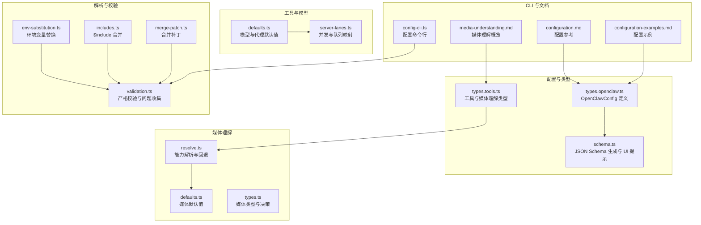
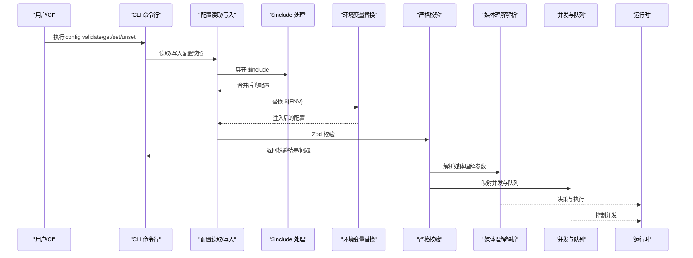
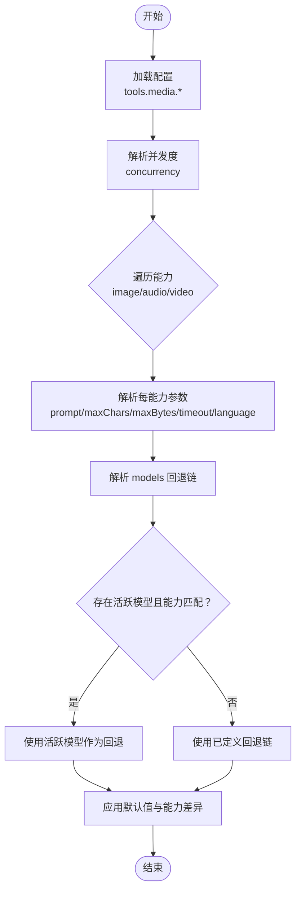
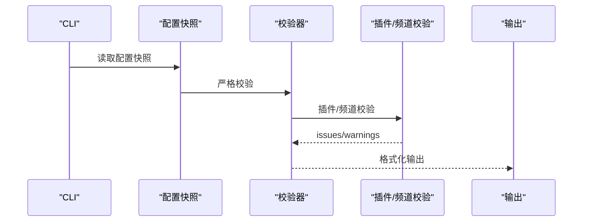
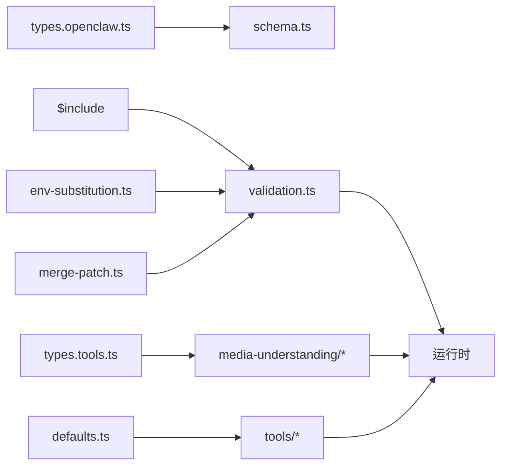

# 高级配置

<cite>
**本文引用的文件**
- [src/config/types.openclaw.ts](file://src/config/types.openclaw.ts)
- [src/config/types.tools.ts](file://src/config/types.tools.ts)
- [src/config/defaults.ts](file://src/config/defaults.ts)
- [src/config/validation.ts](file://src/config/validation.ts)
- [src/config/env-substitution.ts](file://src/config/env-substitution.ts)
- [src/config/includes.ts](file://src/config/includes.ts)
- [src/config/merge-patch.ts](file://src/config/merge-patch.ts)
- [src/media-understanding/resolve.ts](file://src/media-understanding/resolve.ts)
- [src/media-understanding/defaults.ts](file://src/media-understanding/defaults.ts)
- [src/media-understanding/types.ts](file://src/media-understanding/types.ts)
- [src/gateway/server-lanes.ts](file://src/gateway/server-lanes.ts)
- [src/cli/config-cli.ts](file://src/cli/config-cli.ts)
- [docs/gateway/configuration.md](file://docs/gateway/configuration.md)
- [docs/gateway/configuration-examples.md](file://docs/gateway/configuration-examples.md)
- [docs/nodes/media-understanding.md](file://docs/nodes/media-understanding.md)
</cite>

## 目录

1. [简介](#简介)
2. [项目结构](#项目结构)
3. [核心组件](#核心组件)
4. [架构总览](#架构总览)
5. [详细组件分析](#详细组件分析)
6. [依赖关系分析](#依赖关系分析)
7. [性能考量](#性能考量)
8. [故障排除指南](#故障排除指南)
9. [结论](#结论)
10. [附录](#附录)

## 简介

本文件面向需要进行高级配置与调优的用户，系统性阐述 OpenClaw 的平台特定高级配置参数，覆盖媒体处理、消息限制、模型选择与性能优化等主题。内容基于仓库中的类型定义、解析与校验逻辑、媒体理解实现以及官方文档，帮助您：

- 理解配置文件结构与语法规则；
- 正确设置媒体理解（图像/音频/视频）参数；
- 合理配置消息限制与会话策略；
- 选择与优化模型与工具策略；
- 进行配置验证、故障排除与性能调优；
- 在多平台场景下保持配置一致性与最佳实践。

## 项目结构

围绕“高级配置”的关键代码与文档分布如下：

- 类型与模式：OpenClaw 配置的完整类型定义与 JSON Schema 生成、UI 提示与标签；
- 解析与校验：配置加载、环境变量替换、$include 合并与合并补丁；
- 媒体理解：媒体能力（图像/音频/视频）的默认值、并发度、回退策略与能力解析；
- 工具与模型：工具策略、Web 搜索、链接抓取、内存检索、执行与文件系统限制；
- CLI：配置读取、设置、删除、校验与写入；
- 文档：官方配置参考与示例，含多平台与安全实践。

图表来源

- [src/config/types.openclaw.ts:31-123](file://src/config/types.openclaw.ts#L31-L123)
- [src/config/types.tools.ts:132-609](file://src/config/types.tools.ts#L132-L609)
- [src/config/schema.ts:429-484](file://src/config/schema.ts#L429-L484)
- [src/config/env-substitution.ts:197-204](file://src/config/env-substitution.ts#L197-L204)
- [src/config/includes.ts:340-347](file://src/config/includes.ts#L340-L347)
- [src/config/merge-patch.ts:62-98](file://src/config/merge-patch.ts#L62-L98)
- [src/config/validation.ts:229-286](file://src/config/validation.ts#L229-L286)
- [src/media-understanding/resolve.ts:36-187](file://src/media-understanding/resolve.ts#L36-L187)
- [src/media-understanding/defaults.ts:1-35](file://src/media-understanding/defaults.ts#L1-L35)
- [src/media-understanding/types.ts:1-116](file://src/media-understanding/types.ts#L1-L116)
- [src/config/defaults.ts:213-347](file://src/config/defaults.ts#L213-L347)
- [src/gateway/server-lanes.ts:6-10](file://src/gateway/server-lanes.ts#L6-L10)
- [src/cli/config-cli.ts:344-393](file://src/cli/config-cli.ts#L344-L393)
- [docs/gateway/configuration.md:12-73](file://docs/gateway/configuration.md#L12-L73)
- [docs/gateway/configuration-examples.md:14-638](file://docs/gateway/configuration-examples.md#L14-L638)
- [docs/nodes/media-understanding.md:34-89](file://docs/nodes/media-understanding.md#L34-L89)

章节来源

- [src/config/types.openclaw.ts:31-123](file://src/config/types.openclaw.ts#L31-L123)
- [src/config/types.tools.ts:132-609](file://src/config/types.tools.ts#L132-L609)
- [src/config/schema.ts:429-484](file://src/config/schema.ts#L429-L484)
- [src/config/env-substitution.ts:197-204](file://src/config/env-substitution.ts#L197-L204)
- [src/config/includes.ts:340-347](file://src/config/includes.ts#L340-L347)
- [src/config/merge-patch.ts:62-98](file://src/config/merge-patch.ts#L62-L98)
- [src/config/validation.ts:229-286](file://src/config/validation.ts#L229-L286)
- [src/media-understanding/resolve.ts:36-187](file://src/media-understanding/resolve.ts#L36-L187)
- [src/media-understanding/defaults.ts:1-35](file://src/media-understanding/defaults.ts#L1-L35)
- [src/media-understanding/types.ts:1-116](file://src/media-understanding/types.ts#L1-L116)
- [src/config/defaults.ts:213-347](file://src/config/defaults.ts#L213-L347)
- [src/gateway/server-lanes.ts:6-10](file://src/gateway/server-lanes.ts#L6-L10)
- [src/cli/config-cli.ts:344-393](file://src/cli/config-cli.ts#L344-L393)
- [docs/gateway/configuration.md:12-73](file://docs/gateway/configuration.md#L12-L73)
- [docs/gateway/configuration-examples.md:14-638](file://docs/gateway/configuration-examples.md#L14-L638)
- [docs/nodes/media-understanding.md:34-89](file://docs/nodes/media-understanding.md#L34-L89)

## 核心组件

- 配置类型与模式
  - OpenClawConfig：顶层配置对象，包含 auth、models、agents、tools、media、messages、channels、gateway、memory 等子系统字段。
  - JSON Schema 生成与 UI 提示：通过 schema.ts 构建 schema 与 UI 提示，支持插件与频道扩展。
- 解析与校验
  - 环境变量替换：支持 ${VAR_NAME} 语法，缺失时抛出错误或回调警告。
  - $include 合并：支持单文件或数组合并，深度限制与路径安全检查。
  - 合并补丁：JSON Merge Patch 语义，数组按 id 合并对象数组。
  - 严格校验：Zod Schema 校验，收集问题与警告，支持插件与频道校验。
- 媒体理解
  - 能力解析：按 capability（image/audio/video）解析 maxChars/maxBytes/prompt/超时等参数，支持回退链。
  - 默认值：不同能力的默认 maxBytes、timeout、prompt、音频默认模型等。
  - 并发控制：全局并发度限制与能力维度并发控制。
- 工具与模型
  - 工具策略：允许/拒绝/配置文件选择、分组策略、循环检测、执行与文件系统限制。
  - 模型默认值：成本、输入类型、上下文窗口、最大输出令牌、默认 API 等。
  - 并发与队列：根据配置映射到命令队列的并发通道。
- CLI
  - 配置命令：get/set/unset/file/validate，支持 JSON5 与路径定位，写入时避免泄漏运行时默认值。

章节来源

- [src/config/types.openclaw.ts:31-123](file://src/config/types.openclaw.ts#L31-L123)
- [src/config/schema.ts:429-484](file://src/config/schema.ts#L429-L484)
- [src/config/env-substitution.ts:197-204](file://src/config/env-substitution.ts#L197-L204)
- [src/config/includes.ts:340-347](file://src/config/includes.ts#L340-L347)
- [src/config/merge-patch.ts:62-98](file://src/config/merge-patch.ts#L62-L98)
- [src/config/validation.ts:229-286](file://src/config/validation.ts#L229-L286)
- [src/media-understanding/resolve.ts:36-187](file://src/media-understanding/resolve.ts#L36-L187)
- [src/media-understanding/defaults.ts:1-35](file://src/media-understanding/defaults.ts#L1-L35)
- [src/config/defaults.ts:213-347](file://src/config/defaults.ts#L213-L347)
- [src/gateway/server-lanes.ts:6-10](file://src/gateway/server-lanes.ts#L6-L10)
- [src/cli/config-cli.ts:344-393](file://src/cli/config-cli.ts#L344-L393)

## 架构总览

OpenClaw 的高级配置由“类型定义—解析—校验—应用—执行”构成闭环。媒体理解与工具策略在配置解析后被具体实现模块消费，最终影响运行时行为。

图表来源

- [src/cli/config-cli.ts:344-393](file://src/cli/config-cli.ts#L344-L393)
- [src/config/includes.ts:340-347](file://src/config/includes.ts#L340-L347)
- [src/config/env-substitution.ts:197-204](file://src/config/env-substitution.ts#L197-L204)
- [src/config/validation.ts:229-286](file://src/config/validation.ts#L229-L286)
- [src/media-understanding/resolve.ts:36-187](file://src/media-understanding/resolve.ts#L36-L187)
- [src/gateway/server-lanes.ts:6-10](file://src/gateway/server-lanes.ts#L6-L10)

## 详细组件分析

### 媒体理解高级配置

- 结构与语法
  - tools.media 支持共享模型列表与按能力覆盖；每能力可独立设置 prompt、maxChars、maxBytes、timeoutSeconds、language、attachments 策略、scope 门控与 models 回退链。
  - concurrency 全局并发度（默认 2）；每能力可单独覆盖。
  - 每个 models[] 条目支持 provider 或 CLI 两种类型，支持 capabilities 能力标记与 profile 选择。
- 参数解析与回退
  - resolveMaxChars/resolveMaxBytes/resolveConcurrency 等函数从多层配置源解析最终数值，优先级：条目覆盖 > 能力覆盖 > 全局覆盖 > 默认值。
  - 当未显式启用且存在 activeModel 时，可基于注册表能力动态回退到当前活跃模型。
- 默认值与能力差异
  - 不同能力的默认 maxBytes、timeout、prompt 与音频默认模型集来自 defaults.ts。
- 示例与参考
  - 官方媒体理解概览与示例见文档。

图表来源

- [src/media-understanding/resolve.ts:36-187](file://src/media-understanding/resolve.ts#L36-L187)
- [src/media-understanding/defaults.ts:1-35](file://src/media-understanding/defaults.ts#L1-L35)
- [docs/nodes/media-understanding.md:34-89](file://docs/nodes/media-understanding.md#L34-L89)

章节来源

- [src/config/types.tools.ts:132-140](file://src/config/types.tools.ts#L132-L140)
- [src/media-understanding/resolve.ts:36-187](file://src/media-understanding/resolve.ts#L36-L187)
- [src/media-understanding/defaults.ts:1-35](file://src/media-understanding/defaults.ts#L1-L35)
- [docs/nodes/media-understanding.md:34-89](file://docs/nodes/media-understanding.md#L34-L89)

### 消息限制与会话策略

- 消息限制
  - messages.ackReactionScope 等字段可控制 ACK 行为范围；默认策略在 applyMessageDefaults 中应用。
- 会话策略
  - session.mainKey 被规范化为主会话键；其他会话作用域与重置策略在 applySessionDefaults 中处理。
  - 发送策略 sendPolicy 支持默认动作与规则匹配（按 channel/chatType/keyPrefix）。
- 并发与队列
  - 代理与子代理最大并发在 defaults.ts 中设定默认值，并在 server-lanes.ts 中映射到命令队列通道。

章节来源

- [src/config/defaults.ts:131-170](file://src/config/defaults.ts#L131-L170)
- [src/config/defaults.ts:349-388](file://src/config/defaults.ts#L349-L388)
- [src/gateway/server-lanes.ts:6-10](file://src/gateway/server-lanes.ts#L6-L10)

### 模型选择与性能优化

- 模型默认值
  - 模型定义的 cost、input、contextWindow、maxTokens、api 等字段在 applyModelDefaults 中补齐默认值与约束。
  - 默认模型别名映射与主模型解析在 defaults.ts 中完成。
- 性能优化建议
  - 合理设置 agents.defaults.maxConcurrent 与 subagents.maxConcurrent；
  - 使用 tools.media.concurrency 控制媒体理解并发；
  - 通过 tools.web.search.fetch.timeoutSeconds 与 maxChars 控制网络请求与输出规模；
  - 使用 tools.memorySearch.query.hybrid.\* 与 chunking 优化向量检索性能。

章节来源

- [src/config/defaults.ts:213-347](file://src/config/defaults.ts#L213-L347)
- [src/config/types.tools.ts:431-609](file://src/config/types.tools.ts#L431-L609)

### 工具策略与安全边界

- 工具策略
  - tools.profile、allow/alsoAllow/deny、byProvider 精细化控制；
  - tools.exec、tools.fs、tools.loopDetection 等安全与性能控制项。
- 安全边界
  - tools.exec.safeBins 与 safeBinProfiles 限制可执行二进制；
  - tools.fs.workspaceOnly 将文件操作限制在工作区；
  - tools.elevated 与 allowFrom 控制提升权限的来源。

章节来源

- [src/config/types.tools.ts:170-313](file://src/config/types.tools.ts#L170-L313)

### 配置验证与故障排除

- 严格校验
  - validateConfigObjectRaw/validateConfigObject 对配置进行 Zod 校验，收集 issues/warnings；
  - 插件与频道校验：未知插件/频道、schema 缺失、禁用但仍有配置等问题。
- 环境变量与 $include
  - 环境变量替换：缺失时抛错或回调警告；
  - $include：路径安全检查、最大深度限制、文件大小限制与循环包含检测。
- CLI 验证
  - config validate 输出 JSON 或人类可读格式，配合 doctor 建议修复。

图表来源

- [src/cli/config-cli.ts:344-393](file://src/cli/config-cli.ts#L344-L393)
- [src/config/validation.ts:229-286](file://src/config/validation.ts#L229-L286)
- [src/config/env-substitution.ts:197-204](file://src/config/env-substitution.ts#L197-L204)
- [src/config/includes.ts:340-347](file://src/config/includes.ts#L340-L347)

章节来源

- [src/config/validation.ts:229-286](file://src/config/validation.ts#L229-L286)
- [src/config/env-substitution.ts:197-204](file://src/config/env-substitution.ts#L197-L204)
- [src/config/includes.ts:340-347](file://src/config/includes.ts#L340-L347)
- [src/cli/config-cli.ts:344-393](file://src/cli/config-cli.ts#L344-L393)

### 多平台配置一致性管理与最佳实践

- 分层与模块化
  - 使用 $include 将大型配置拆分为多个文件，按需合并，避免重复与冲突。
- 环境变量注入
  - 通过 ${ENV_VAR} 注入密钥与端点，减少硬编码风险。
- 平台差异
  - 不同渠道的 DM/群组策略、提及要求、绑定与路由策略存在差异，应分别配置并在配置中明确区分。
- 最佳实践
  - 为敏感字段使用 SecretRef 或环境变量；
  - 为多平台部署准备独立的 include 文件，统一入口；
  - 使用 CLI 的 validate 与 doctor 辅助持续集成与自动化部署。

章节来源

- [src/config/includes.ts:340-347](file://src/config/includes.ts#L340-L347)
- [src/config/env-substitution.ts:197-204](file://src/config/env-substitution.ts#L197-L204)
- [docs/gateway/configuration-examples.md:448-638](file://docs/gateway/configuration-examples.md#L448-L638)

## 依赖关系分析

- 组件耦合
  - 配置类型定义与 JSON Schema 生成强耦合，UI 提示与敏感信息标注在 schema.ts 中集中处理。
  - 媒体理解解析依赖工具类型定义与默认值，同时受并发与回退策略影响。
  - 工具策略与模型默认值共同决定运行时行为与资源消耗。
- 外部依赖
  - JSON5 解析与合并补丁；
  - 环境变量与文件系统访问的安全边界；
  - 插件与频道清单驱动的 schema 扩展。

图表来源

- [src/config/types.openclaw.ts:31-123](file://src/config/types.openclaw.ts#L31-L123)
- [src/config/types.tools.ts:132-609](file://src/config/types.tools.ts#L132-L609)
- [src/config/defaults.ts:213-347](file://src/config/defaults.ts#L213-L347)
- [src/config/validation.ts:229-286](file://src/config/validation.ts#L229-L286)
- [src/config/env-substitution.ts:197-204](file://src/config/env-substitution.ts#L197-L204)
- [src/config/includes.ts:340-347](file://src/config/includes.ts#L340-L347)
- [src/config/merge-patch.ts:62-98](file://src/config/merge-patch.ts#L62-L98)
- [src/media-understanding/resolve.ts:36-187](file://src/media-understanding/resolve.ts#L36-L187)

章节来源

- [src/config/types.openclaw.ts:31-123](file://src/config/types.openclaw.ts#L31-L123)
- [src/config/types.tools.ts:132-609](file://src/config/types.tools.ts#L132-L609)
- [src/config/defaults.ts:213-347](file://src/config/defaults.ts#L213-L347)
- [src/config/validation.ts:229-286](file://src/config/validation.ts#L229-L286)
- [src/config/env-substitution.ts:197-204](file://src/config/env-substitution.ts#L197-L204)
- [src/config/includes.ts:340-347](file://src/config/includes.ts#L340-L347)
- [src/config/merge-patch.ts:62-98](file://src/config/merge-patch.ts#L62-L98)
- [src/media-understanding/resolve.ts:36-187](file://src/media-understanding/resolve.ts#L36-L187)

## 性能考量

- 并发控制
  - tools.media.concurrency 控制媒体理解并发，避免资源争用；
  - agents.defaults.maxConcurrent/subagents.maxConcurrent 控制代理并发；
  - cron.maxConcurrentRuns 控制定时任务并发。
- I/O 与缓存
  - tools.web.search.fetch.cacheTtlMinutes 与 tools.memorySearch.store.cache.\* 控制缓存命中率；
  - tools.memorySearch.chunking.tokens/overlap 影响索引与查询性能。
- 网络与超时
  - tools.web.search.timeoutSeconds、tools.web.fetch.timeoutSeconds、媒体理解 timeoutSeconds 影响响应时间与资源占用。
- 模型与成本
  - 通过模型默认值与别名映射，合理选择上下文窗口与最大输出令牌，平衡性能与质量。

章节来源

- [src/config/types.tools.ts:431-609](file://src/config/types.tools.ts#L431-L609)
- [src/config/defaults.ts:213-347](file://src/config/defaults.ts#L213-L347)
- [src/gateway/server-lanes.ts:6-10](file://src/gateway/server-lanes.ts#L6-L10)

## 故障排除指南

- 配置无效
  - 使用 config validate 获取 JSON 或人类可读输出，结合 doctor 建议修复；
  - 关注 issues 中的 allowedValues 提示，修正枚举值。
- 环境变量缺失
  - 环境变量替换在加载阶段进行，缺失会抛错；可通过 onMissing 回调收集警告。
- $include 错误
  - 路径越界、循环包含、深度超限、文件过大等均会抛出明确错误。
- 插件/频道问题
  - 未知插件/频道、schema 缺失、禁用但仍有配置等会被记录为 issues/warnings。

章节来源

- [src/cli/config-cli.ts:344-393](file://src/cli/config-cli.ts#L344-L393)
- [src/config/validation.ts:229-286](file://src/config/validation.ts#L229-L286)
- [src/config/env-substitution.ts:197-204](file://src/config/env-substitution.ts#L197-L204)
- [src/config/includes.ts:340-347](file://src/config/includes.ts#L340-L347)

## 结论

通过类型驱动的配置体系、严格的解析与校验流程、以及对媒体理解与工具策略的细粒度控制，OpenClaw 能够在多平台环境下实现一致、可维护且高性能的高级配置。建议在生产环境中：

- 使用 $include 组织配置，配合环境变量注入；
- 以 CLI 与 doctor 保障配置质量；
- 基于能力与并发策略优化媒体理解与代理执行；
- 采用工具策略与安全边界限制提升整体安全性。

## 附录

- 配置文件结构与语法要点
  - JSON5 支持注释与尾随逗号；严格模式下仅接受完全符合 schema 的配置。
  - $include 支持单文件与数组合并，支持嵌套与深度限制。
  - 环境变量替换仅匹配大写命名，支持转义与缺失回调。
- 常用配置示例与参考
  - 官方配置参考与示例覆盖多平台、安全模式与本地模型等场景。

章节来源

- [docs/gateway/configuration.md:12-73](file://docs/gateway/configuration.md#L12-L73)
- [docs/gateway/configuration-examples.md:14-638](file://docs/gateway/configuration-examples.md#L14-L638)
