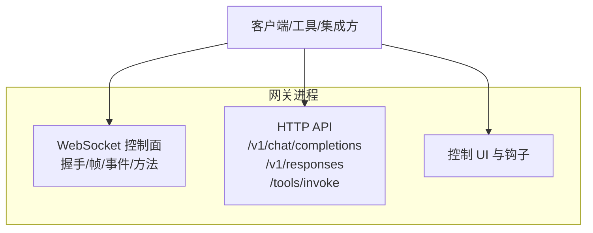
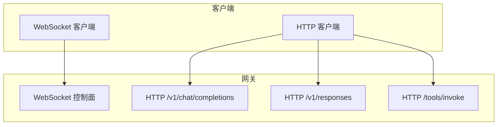
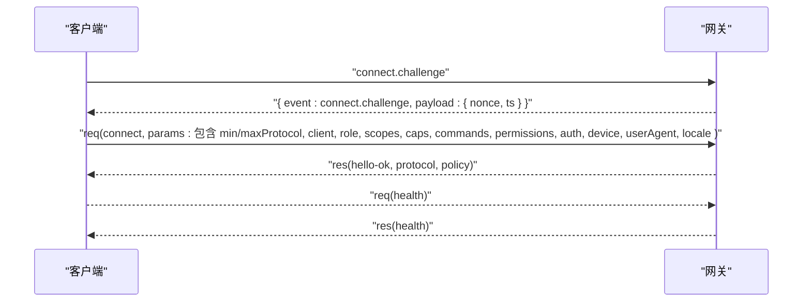
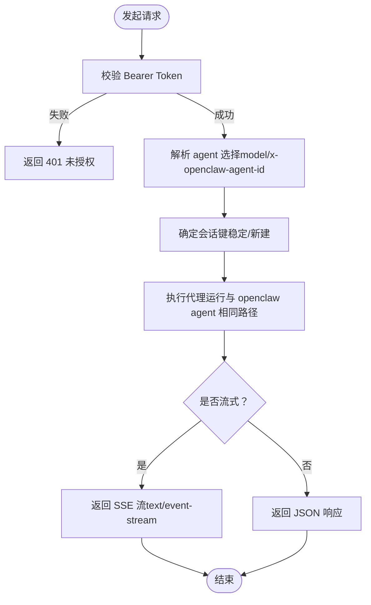
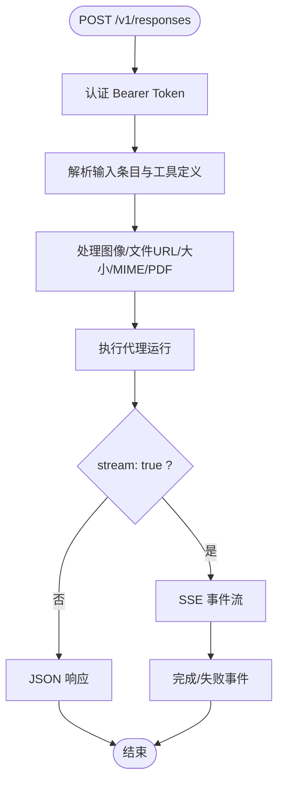
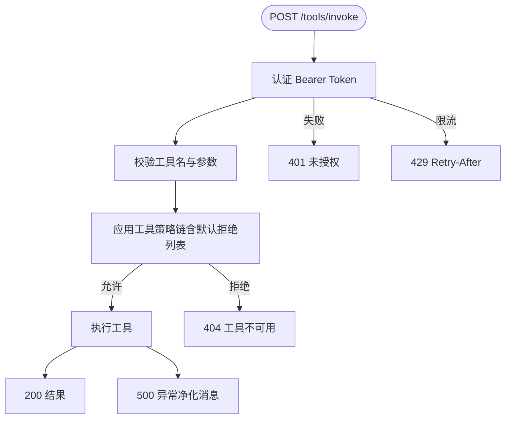
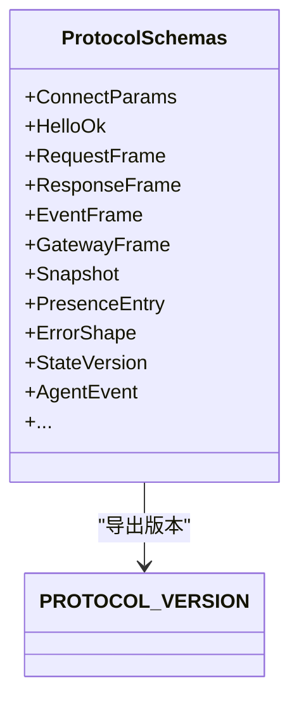
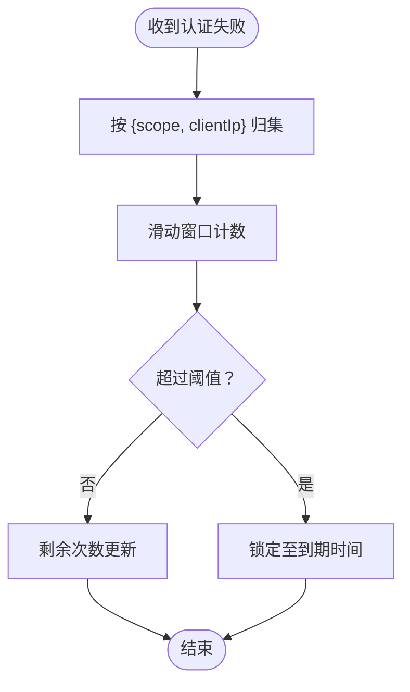
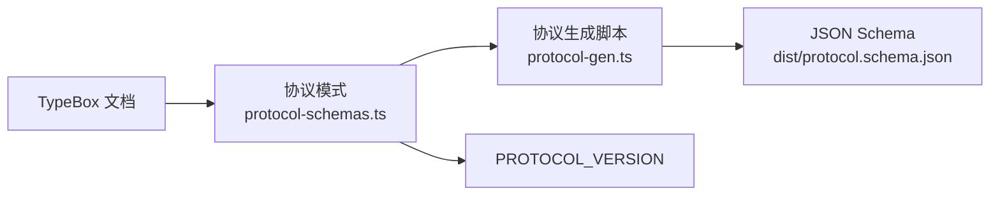

# API参考

<cite>
**本文引用的文件**
- [docs/gateway/index.md](file://docs/gateway/index.md)
- [docs/gateway/protocol.md](file://docs/gateway/protocol.md)
- [docs/gateway/authentication.md](file://docs/gateway/authentication.md)
- [docs/gateway/configuration-reference.md](file://docs/gateway/configuration-reference.md)
- [docs/gateway/openai-http-api.md](file://docs/gateway/openai-http-api.md)
- [docs/gateway/openresponses-http-api.md](file://docs/gateway/openresponses-http-api.md)
- [docs/gateway/tools-invoke-http-api.md](file://docs/gateway/tools-invoke-http-api.md)
- [docs/concepts/typebox.md](file://docs/concepts/typebox.md)
- [src/gateway/protocol/schema.ts](file://src/gateway/protocol/schema.ts)
- [src/gateway/protocol/schema/protocol-schemas.ts](file://src/gateway/protocol/schema/protocol-schemas.ts)
- [scripts/protocol-gen.ts](file://scripts/protocol-gen.ts)
- [src/gateway/auth-rate-limit.ts](file://src/gateway/auth-rate-limit.ts)
- [src/gateway/auth-rate-limit.test.ts](file://src/gateway/auth-rate-limit.test.ts)
</cite>

## 目录

1. [简介](#简介)
2. [项目结构](#项目结构)
3. [核心组件](#核心组件)
4. [架构总览](#架构总览)
5. [详细组件分析](#详细组件分析)
6. [依赖关系分析](#依赖关系分析)
7. [性能考量](#性能考量)
8. [故障排查指南](#故障排查指南)
9. [结论](#结论)
10. [附录](#附录)

## 简介

本文件为 OpenClaw 网关服务器的完整 API 参考，覆盖以下内容：

- WebSocket 协议：握手、帧格式、角色与作用域、事件与方法、版本与迁移
- HTTP API：OpenAI 兼容 /v1/chat/completions、OpenResponses 兼容 /v1/responses、/tools/invoke 工具直调
- 认证与授权：Token/密码认证、设备令牌、配对与权限、安全边界
- 类型系统与契约：基于 TypeBox 的协议模式、JSON Schema 导出、客户端生成物
- 版本兼容与弃用策略：协议版本、迁移指引、弃用流程
- 客户端 SDK 使用示例：最小连接流程、事件订阅、方法调用
- 速率限制：认证失败的滑动窗口限流策略
- 测试与调试：协议生成脚本、单元测试、常见问题诊断

## 项目结构

网关服务以“单端口多协议”方式运行：同一端口同时承载 WebSocket 控制面与 HTTP API（OpenAI、OpenResponses、工具直调），并内建控制 UI 与钩子入口。

图示来源

- [docs/gateway/index.md:70-76](file://docs/gateway/index.md#L70-L76)

章节来源

- [docs/gateway/index.md:27-124](file://docs/gateway/index.md#L27-L124)

## 核心组件

- WebSocket 协议层：统一的请求/响应/事件帧模型，首帧必须为 connect；支持角色（operator/node）、作用域与能力声明；内置版本协商与迁移指引。
- HTTP 层：三类端点
  - OpenAI 兼容聊天补全：/v1/chat/completions
  - OpenResponses 兼容响应：/v1/responses
  - 工具直调：/tools/invoke
- 认证与授权：共享网关令牌/密码；设备令牌按设备+角色发放；配对审批与本地自动放行；安全边界提示。
- 类型系统：TypeBox 模式作为单一真实来源，导出 JSON Schema 并驱动 Swift 代码生成。
- 速率限制：认证失败的滑动窗口限流器，支持按作用域与来源 IP 分组计数。

章节来源

- [docs/gateway/protocol.md:12-268](file://docs/gateway/protocol.md#L12-L268)
- [docs/gateway/openai-http-api.md:8-133](file://docs/gateway/openai-http-api.md#L8-L133)
- [docs/gateway/openresponses-http-api.md:9-355](file://docs/gateway/openresponses-http-api.md#L9-L355)
- [docs/gateway/tools-invoke-http-api.md:9-111](file://docs/gateway/tools-invoke-http-api.md#L9-L111)
- [docs/concepts/typebox.md:1-220](file://docs/concepts/typebox.md#L1-L220)
- [src/gateway/protocol/schema.ts:1-19](file://src/gateway/protocol/schema.ts#L1-L19)
- [src/gateway/protocol/schema/protocol-schemas.ts:162-302](file://src/gateway/protocol/schema/protocol-schemas.ts#L162-L302)
- [src/gateway/auth-rate-limit.ts:1-117](file://src/gateway/auth-rate-limit.ts#L1-L117)

## 架构总览

下图展示网关对外暴露的协议与端点，以及与客户端的关系。

图示来源

- [docs/gateway/index.md:70-76](file://docs/gateway/index.md#L70-L76)
- [docs/gateway/openai-http-api.md:14-17](file://docs/gateway/openai-http-api.md#L14-L17)
- [docs/gateway/openresponses-http-api.md:15-19](file://docs/gateway/openresponses-http-api.md#L15-L19)
- [docs/gateway/tools-invoke-http-api.md:13-16](file://docs/gateway/tools-invoke-http-api.md#L13-L16)

## 详细组件分析

### WebSocket 协议（Gateway Protocol）

- 传输与握手
  - 文本帧 JSON；首帧必须为 connect
  - 握手前：Gateway 发送 connect.challenge（含随机 nonce 与时间戳）
  - 客户端签名挑战 nonce 后发送 connect，携带 min/maxProtocol、client、role、scopes、caps、commands、permissions、auth、locale、userAgent、device 等
  - 成功后返回 hello-ok，包含协议版本与策略（如 tickIntervalMs）
- 帧格式
  - 请求：req(id, method, params)
  - 响应：res(id, ok, payload|error)
  - 事件：event(event, payload, seq?, stateVersion?)
- 角色与作用域
  - operator：控制面客户端（CLI/UI/自动化）
  - node：能力宿主（摄像头/屏幕/画布/系统执行等）
  - operator 作用域：operator.read、operator.write、operator.admin、operator.approvals、operator.pairing 等
  - node 能力：caps（能力类别）、commands（命令白名单）、permissions（细粒度开关）
- 设备身份与配对
  - 客户端需提供稳定的 device.id（来自密钥对指纹）
  - 首次连接需完成配对审批；本地连接（loopback/tailnet）可自动放行
  - 成功后 Gateway 返回 deviceToken，建议持久化以便后续连接
- 版本与迁移
  - PROTOCOL_VERSION 由协议模式导出
  - 客户端需声明 min/maxProtocol；服务端拒绝不匹配
  - 旧版签名行为已弃用，需遵循 v2/v3 签名与 nonce 传递规则

图示来源

- [docs/gateway/protocol.md:22-90](file://docs/gateway/protocol.md#L22-L90)
- [docs/gateway/protocol.md:127-134](file://docs/gateway/protocol.md#L127-L134)
- [docs/gateway/protocol.md:191-209](file://docs/gateway/protocol.md#L191-L209)

章节来源

- [docs/gateway/protocol.md:12-268](file://docs/gateway/protocol.md#L12-L268)

### HTTP API：OpenAI 兼容 /v1/chat/completions

- 端点
  - POST /v1/chat/completions
  - 与网关端口复用（WS+HTTP 复用端口）
- 认证
  - Bearer Token；使用网关配置的 token/password
  - 支持速率限制：过多认证失败会返回 429 与 Retry-After
- 安全边界
  - 该端点等同于网关 operator 权限；通过认证即视为受信任 operator
  - 不建议直接暴露到公网，建议仅限 loopback/tailnet
- 代理选择
  - model 字段或 x-openclaw-agent-id 指定 agent
  - x-openclaw-session-key 可完全控制会话路由
- 会话行为
  - 默认无状态（每次请求生成新会话键）
  - 若请求包含 OpenAI user 字段，将派生稳定会话键以复用会话
- 流式输出（SSE）
  - stream: true 时返回 text/event-stream，以 data: 行分隔，结束以 [DONE]

图示来源

- [docs/gateway/openai-http-api.md:19-58](file://docs/gateway/openai-http-api.md#L19-L58)
- [docs/gateway/openai-http-api.md:91-104](file://docs/gateway/openai-http-api.md#L91-L104)

章节来源

- [docs/gateway/openai-http-api.md:8-133](file://docs/gateway/openai-http-api.md#L8-L133)

### HTTP API：OpenResponses 兼容 /v1/responses

- 端点
  - POST /v1/responses
  - 与网关端口复用
- 认证与安全边界
  - 同上，等同 operator 权限，谨慎暴露
- 代理选择与会话
  - model 或 x-openclaw-agent-id 指定 agent
  - x-openclaw-session-key 控制会话
  - user 字段派生稳定会话键
- 请求形态（当前支持）
  - input：字符串或条目对象数组
  - instructions：合并入系统提示
  - tools：客户端函数工具定义
  - tool_choice：过滤或强制客户端工具
  - stream：启用 SSE
  - max_output_tokens：尽力而为的输出限制
  - user：稳定会话路由
  - 已接受但忽略：max_tool_calls、reasoning、metadata、store、previous_response_id、truncation
- 输入条目
  - message：roles 支持 system/developer/user/assistant
  - function_call_output：回传工具结果以继续回合
  - reasoning/item_reference：兼容忽略
- 图像与文件
  - 支持 base64 或 URL；MIME 与大小限制可配置
  - 文件内容注入系统提示（非持久化历史）
  - PDF 解析与图像提取策略
- SSE 事件类型
  - response.created、response.in_progress、response.output_item.added、response.content_part.added、response.output_text.delta、response.output_text.done、response.content_part.done、response.output_item.done、response.completed、response.failed
- 错误
  - JSON 对象：{ error: { message, type } }
  - 常见：401 缺失/无效认证、400 请求体无效、405 方法错误

图示来源

- [docs/gateway/openresponses-http-api.md:100-120](file://docs/gateway/openresponses-http-api.md#L100-L120)
- [docs/gateway/openresponses-http-api.md:147-153](file://docs/gateway/openresponses-http-api.md#L147-L153)
- [docs/gateway/openresponses-http-api.md:154-188](file://docs/gateway/openresponses-http-api.md#L154-L188)
- [docs/gateway/openresponses-http-api.md:288-308](file://docs/gateway/openresponses-http-api.md#L288-L308)

章节来源

- [docs/gateway/openresponses-http-api.md:9-355](file://docs/gateway/openresponses-http-api.md#L9-L355)

### HTTP API：工具直调 /tools/invoke

- 端点
  - POST /tools/invoke
  - 总是启用，但受网关认证与工具策略约束
- 请求体字段
  - tool（必填）：工具名称
  - action（可选）：映射到 args 的动作
  - args（可选）：工具特定参数
  - sessionKey（可选）：目标会话键，默认 main
  - dryRun（可选）：保留字段，当前忽略
- 策略与路由
  - 通过与代理相同的策略链：tools.profile/byProvider/profile、allow、agents.<id>.tools.allow、群组策略、子代理策略
  - 默认硬性拒绝列表：sessions_spawn、sessions_send、gateway、whatsapp_login；可通过 gateway.tools 自定义
  - 可选头：x-openclaw-message-channel、x-openclaw-account-id 以帮助群组策略解析上下文
- 响应
  - 200：{ ok: true, result }
  - 400：{ ok: false, error: { type, message } }（请求或工具输入错误）
  - 401：未授权
  - 429：认证限流（带 Retry-After）
  - 404：工具不可用（未找到或未允许）
  - 405：方法不允许
  - 500：工具执行异常（消息经净化）

图示来源

- [docs/gateway/tools-invoke-http-api.md:30-88](file://docs/gateway/tools-invoke-http-api.md#L30-L88)
- [docs/gateway/tools-invoke-http-api.md:89-98](file://docs/gateway/tools-invoke-http-api.md#L89-L98)

章节来源

- [docs/gateway/tools-invoke-http-api.md:9-111](file://docs/gateway/tools-invoke-http-api.md#L9-L111)

### 认证与授权

- 网关认证
  - 支持 token/password 两种模式；可通过环境变量或配置项设置
  - 认证失败可触发速率限制（见下节）
- 设备令牌与配对
  - 首次连接成功后返回 deviceToken，包含 role 与 scopes
  - 可轮换/撤销 deviceToken（需要 operator.pairing）
- 安全边界
  - HTTP bearer 在该端点不是细粒度用户边界，而是 operator 级别
  - 建议仅在 loopback/tailnet 私有入口使用，避免公网暴露
- OAuth 与模型凭据
  - 支持 OAuth 与 API Key；提供凭据检查与轮换策略

章节来源

- [docs/gateway/authentication.md:9-180](file://docs/gateway/authentication.md#L9-L180)
- [docs/gateway/protocol.md:200-215](file://docs/gateway/protocol.md#L200-L215)

### 类型系统与接口契约

- 单一真实来源：TypeBox 模式定义请求/响应/事件帧与各方法参数/结果
- 生成物
  - JSON Schema：dist/protocol.schema.json
  - Swift 模型：通过协议生成脚本生成
- 关键类型
  - ConnectParams、HelloOk、RequestFrame、ResponseFrame、EventFrame、GatewayFrame、Snapshot、PresenceEntry、ErrorShape、StateVersion、AgentEvent 等
  - PROTOCOL_VERSION 由协议模式导出

图示来源

- [src/gateway/protocol/schema/protocol-schemas.ts:162-302](file://src/gateway/protocol/schema/protocol-schemas.ts#L162-L302)
- [src/gateway/protocol/schema.ts:1-19](file://src/gateway/protocol/schema.ts#L1-L19)

章节来源

- [docs/concepts/typebox.md:1-220](file://docs/concepts/typebox.md#L1-L220)
- [scripts/protocol-gen.ts:1-51](file://scripts/protocol-gen.ts#L1-L51)
- [src/gateway/protocol/schema/protocol-schemas.ts:162-302](file://src/gateway/protocol/schema/protocol-schemas.ts#L162-L302)

### 版本兼容与弃用策略

- 协议版本
  - PROTOCOL_VERSION 由协议模式导出；客户端需声明 min/maxProtocol
  - 服务端拒绝不匹配
- 设备签名迁移
  - 必须等待 connect.challenge 并签名 v2/v3 载荷
  - 旧版签名行为已弃用，需遵循 nonce 与签名规范
- 弃用 API
  - registerHttpHandler 已弃用，请改用 registerHttpRoute

章节来源

- [docs/gateway/protocol.md:191-209](file://docs/gateway/protocol.md#L191-L209)
- [docs/gateway/protocol.md:231-256](file://docs/gateway/protocol.md#L231-L256)
- [docs/tools/plugin.md:139-144](file://docs/tools/plugin.md#L139-L144)

### 客户端 SDK 使用示例

- 最小连接流程（Node.js）
  - 建立 WS 连接
  - 发送 connect 请求（含 min/maxProtocol、client、role、scopes、auth、device 等）
  - 接收 hello-ok 后，发送 health 请求验证连通性
- 事件订阅
  - 订阅 tick、agent、presence、health 等事件以驱动 UI 或后台任务
- 方法调用
  - 使用 req(frame) 调用方法（如 health、chat.send、sessions.list 等）
  - 严格按协议版本与参数 schema 组装请求

章节来源

- [docs/concepts/typebox.md:146-186](file://docs/concepts/typebox.md#L146-L186)
- [docs/gateway/protocol.md:202-209](file://docs/gateway/protocol.md#L202-L209)

### 速率限制

- 适用范围
  - 认证失败尝试（共享密钥与设备令牌两类作用域）
- 策略
  - 滑动窗口计数，超过阈值进入锁定期
  - 默认：每分钟最多 10 次失败，锁定 5 分钟；本地回环地址默认豁免
- 使用
  - 服务端在认证失败时记录并检查；达到阈值返回 429 与 Retry-After

图示来源

- [src/gateway/auth-rate-limit.ts:25-72](file://src/gateway/auth-rate-limit.ts#L25-L72)
- [src/gateway/auth-rate-limit.test.ts:1-32](file://src/gateway/auth-rate-limit.test.ts#L1-L32)

章节来源

- [src/gateway/auth-rate-limit.ts:1-117](file://src/gateway/auth-rate-limit.ts#L1-L117)
- [src/gateway/auth-rate-limit.test.ts:1-32](file://src/gateway/auth-rate-limit.test.ts#L1-L32)

## 依赖关系分析

- 协议模式与生成
  - 协议模式集中于 src/gateway/protocol/schema/protocol-schemas.ts，并导出 PROTOCOL_VERSION
  - 通过 scripts/protocol-gen.ts 将模式导出为 JSON Schema
- 客户端与服务端一致性
  - 客户端需根据 JSON Schema 与 TypeBox 模式进行编解码与校验
- HTTP 路由与插件
  - 插件注册 HTTP 路由需显式声明 auth；exact/prefix 冲突与不同 auth 级别的重定向规则已在文档中明确

图示来源

- [src/gateway/protocol/schema/protocol-schemas.ts:162-302](file://src/gateway/protocol/schema/protocol-schemas.ts#L162-L302)
- [scripts/protocol-gen.ts:9-42](file://scripts/protocol-gen.ts#L9-L42)
- [docs/concepts/typebox.md:1-220](file://docs/concepts/typebox.md#L1-L220)

章节来源

- [src/gateway/protocol/schema/protocol-schemas.ts:162-302](file://src/gateway/protocol/schema/protocol-schemas.ts#L162-L302)
- [scripts/protocol-gen.ts:1-51](file://scripts/protocol-gen.ts#L1-L51)
- [docs/tools/plugin.md:139-144](file://docs/tools/plugin.md#L139-L144)

## 性能考量

- 端口复用与连接池
  - WS+HTTP 复用同一端口，减少网络复杂度
- 事件驱动与流式输出
  - SSE 流式输出降低大文本传输延迟
- 速率限制
  - 认证失败限流避免暴力破解与资源消耗
- 配置热重载
  - hybrid 模式优先热应用安全变更，必要时重启以确保一致性

## 故障排查指南

- 连接失败
  - 非 loopback 绑定且未配置 token/password 会被拒绝
  - 端口冲突（EADDRINUSE）
  - 配置为 remote 模式导致启动被阻断
  - 连接阶段认证不匹配
- 运行时健康
  - 使用 openclaw gateway status、channels status --probe、health 检查
- 设备签名迁移
  - 旧签名行为不再支持，需遵循 v2/v3 签名与 nonce 传递
- 速率限制
  - 认证失败过多触发 429，检查 Retry-After 并调整重试策略

章节来源

- [docs/gateway/index.md:235-244](file://docs/gateway/index.md#L235-L244)
- [docs/gateway/protocol.md:231-256](file://docs/gateway/protocol.md#L231-L256)
- [src/gateway/auth-rate-limit.ts:1-117](file://src/gateway/auth-rate-limit.ts#L1-L117)

## 结论

本参考文档梳理了网关的 WebSocket 协议与三大 HTTP API，明确了认证边界、类型契约、版本兼容与迁移策略，并提供了速率限制与故障排查要点。建议在生产环境中仅将 HTTP 端点置于受控网络内，配合设备令牌与严格的工具策略，确保安全与稳定性。

## 附录

- 配置参考
  - 通道与模型覆盖、心跳、多账户、命令与访问控制等详参见配置参考文档
- 安全与合规
  - 模型凭据管理、OAuth 流程与凭据检查详见认证文档

章节来源

- [docs/gateway/configuration-reference.md:1-800](file://docs/gateway/configuration-reference.md#L1-L800)
- [docs/gateway/authentication.md:9-180](file://docs/gateway/authentication.md#L9-L180)
