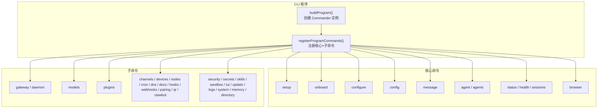
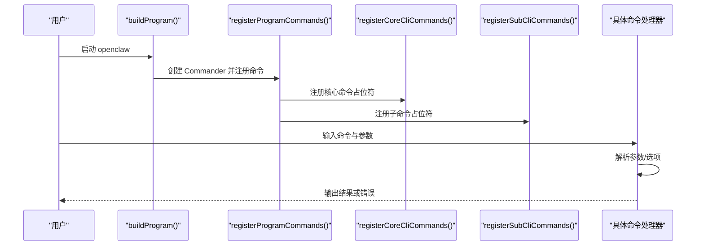
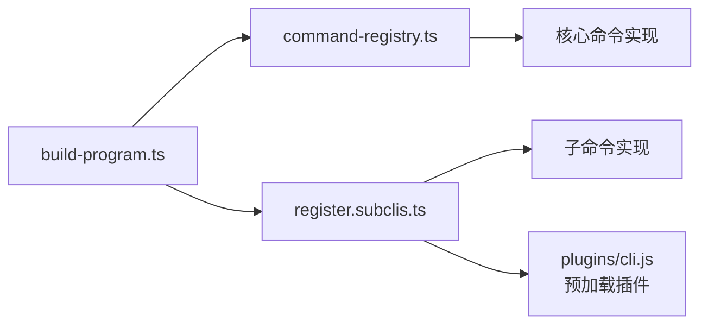

# CLI API

<cite>
**本文引用的文件**
- [docs/cli/index.md](file://docs/cli/index.md)
- [src/cli/program.ts](file://src/cli/program.ts)
- [src/cli/program/build-program.ts](file://src/cli/program/build-program.ts)
- [src/cli/program/command-registry.ts](file://src/cli/program/command-registry.ts)
- [src/cli/program/register.subclis.ts](file://src/cli/program/register.subclis.ts)
- [src/cli/config-cli.ts](file://src/cli/config-cli.ts)
- [src/cli/completion-cli.ts](file://src/cli/completion-cli.ts)
- [src/cli/models-cli.ts](file://src/cli/models-cli.ts)
- [src/cli/plugins-cli.ts](file://src/cli/plugins-cli.ts)
- [src/cli/daemon-cli.ts](file://src/cli/daemon-cli.ts)
- [src/cli/gateway-cli.ts](file://src/cli/gateway-cli.ts)
</cite>

## 目录

1. [简介](#简介)
2. [项目结构](#项目结构)
3. [核心组件](#核心组件)
4. [架构总览](#架构总览)
5. [详细组件分析](#详细组件分析)
6. [依赖关系分析](#依赖关系分析)
7. [性能考量](#性能考量)
8. [故障排除指南](#故障排除指南)
9. [结论](#结论)
10. [附录](#附录)

## 简介

本文件为 OpenClaw 的 CLI API 参考与使用指南，覆盖命令语法、参数选项、输出格式、配置与认证、补全与别名、以及常见用法与自动化工作流。CLI 基于 Commander 构建，采用“核心命令 + 子命令”的分层设计，并支持按需延迟加载子命令以优化启动性能。

## 项目结构

- CLI 入口程序在 program 模块中构建，注册核心命令与子命令。
- 核心命令（如 setup、onboard、configure、config、message、agent、status、health、sessions、browser 等）由核心注册器统一管理。
- 子命令（如 gateway、daemon、models、plugins、channels、devices、nodes、cron、dns、docs、hooks、webhooks、pairing、qr、clawbot、security、secrets、skills、sandbox、tui、update、logs、system、memory、directory 等）通过延迟注册机制按需加载。
- 补全命令支持 zsh、bash、fish、PowerShell，可生成缓存脚本并写入用户 shell 配置文件。

图表来源

- [src/cli/program/build-program.ts:8-20](file://src/cli/program/build-program.ts#L8-L20)
- [src/cli/program/command-registry.ts:310-317](file://src/cli/program/command-registry.ts#L310-L317)
- [src/cli/program/register.subclis.ts:341-359](file://src/cli/program/register.subclis.ts#L341-L359)

章节来源

- [src/cli/program/build-program.ts:8-20](file://src/cli/program/build-program.ts#L8-L20)
- [src/cli/program/command-registry.ts:310-317](file://src/cli/program/command-registry.ts#L310-L317)
- [src/cli/program/register.subclis.ts:341-359](file://src/cli/program/register.subclis.ts#L341-L359)

## 核心组件

- 程序构建器：负责创建 Commander 实例、设置上下文、注册帮助与预动作钩子、并调用命令注册器。
- 核心命令注册器：集中定义核心命令及其描述，支持按需延迟注册。
- 子命令注册器：集中定义子命令及其描述，支持按需延迟注册；部分子命令在注册时会预先初始化插件以确保可用性。
- 补全命令：动态生成各 shell 的补全脚本，支持写入状态目录与安装到用户 shell 配置文件。

章节来源

- [src/cli/program.ts:1-3](file://src/cli/program.ts#L1-L3)
- [src/cli/program/build-program.ts:8-20](file://src/cli/program/build-program.ts#L8-L20)
- [src/cli/program/command-registry.ts:310-317](file://src/cli/program/command-registry.ts#L310-L317)
- [src/cli/program/register.subclis.ts:341-359](file://src/cli/program/register.subclis.ts#L341-L359)
- [src/cli/completion-cli.ts:231-301](file://src/cli/completion-cli.ts#L231-L301)

## 架构总览

CLI 启动流程概览如下：

图表来源

- [src/cli/program/build-program.ts:8-20](file://src/cli/program/build-program.ts#L8-L20)
- [src/cli/program/command-registry.ts:310-317](file://src/cli/program/command-registry.ts#L310-L317)
- [src/cli/program/register.subclis.ts:341-359](file://src/cli/program/register.subclis.ts#L341-L359)

## 详细组件分析

### 命令树与全局选项

- 全局选项
  - --dev：隔离状态至 ~/.openclaw-dev，切换默认端口。
  - --profile <name>：隔离状态至 ~/.openclaw-<name>。
  - --no-color：禁用 ANSI 颜色。
  - --update：等价于 openclaw update（仅源码安装生效）。
  - -V, --version, -v：打印版本后退出。
- 输出样式
  - TTY 下渲染 ANSI 颜色与进度指示；--json 或 --plain 禁用样式以便机器读取。
  - 支持 OSC-8 超链接渲染为可点击链接。
- 命令树（节选）
  - setup、onboard、configure、config、completion、doctor、dashboard、backup、reset、uninstall、update、message、agent、agents、acp、status、health、sessions、gateway、logs、system、models、memory、directory、nodes、devices、node、approvals、sandbox、tui、browser、cron、dns、docs、hooks、webhooks、pairing、qr、plugins、channels、security、secrets、skills、daemon（兼容）、clawbot（兼容）。

章节来源

- [docs/cli/index.md:62-91](file://docs/cli/index.md#L62-L91)
- [docs/cli/index.md:93-267](file://docs/cli/index.md#L93-L267)

### config 子命令族

- 功能：非交互式配置工具（get/set/unset/file/validate），无子命令时启动向导。
- 子命令
  - config get <path>：按点/方括号路径获取值，--json 输出 JSON。
  - config set <path> <value> [--strict-json]：设置值（JSON5 或原始字符串），--strict-json 严格解析。
  - config unset <path>：移除键值。
  - config file：打印当前配置文件路径。
  - config validate [--json]：验证配置是否符合模式，不启动网关。
- 路径解析规则
  - 支持点号与方括号混合路径，自动转义与校验。
  - 设置 Ollama 密钥时自动补齐默认 provider 结构。
- 错误处理
  - 非法路径、解析失败、写入失败均输出错误并退出非零。

章节来源

- [src/cli/config-cli.ts:279-308](file://src/cli/config-cli.ts#L279-L308)
- [src/cli/config-cli.ts:310-331](file://src/cli/config-cli.ts#L310-L331)
- [src/cli/config-cli.ts:333-342](file://src/cli/config-cli.ts#L333-L342)
- [src/cli/config-cli.ts:344-393](file://src/cli/config-cli.ts#L344-L393)
- [src/cli/config-cli.ts:395-476](file://src/cli/config-cli.ts#L395-L476)

### completion 子命令

- 功能：生成各 shell 的补全脚本，支持写入状态目录与安装到用户 shell 配置文件。
- 选项
  - -s, --shell <shell>：目标 shell（默认 zsh），支持 zsh/bash/fish/powershell。
  - -i, --install：安装补全脚本到 shell 配置文件。
  - --write-state：将补全脚本写入 $OPENCLAW_STATE_DIR/completions（不输出到 stdout）。
  - -y, --yes：非交互确认。
- 安装流程
  - 自动检测 shell 类型与配置文件路径。
  - 写入缓存文件后更新配置文件中的补全段落。
  - 提示重启 shell 或执行 source 生效。
- 注意
  - 若未先执行 --write-state，安装会提示先生成缓存脚本。

章节来源

- [src/cli/completion-cli.ts:231-301](file://src/cli/completion-cli.ts#L231-L301)
- [src/cli/completion-cli.ts:303-377](file://src/cli/completion-cli.ts#L303-L377)
- [src/cli/completion-cli.ts:186-229](file://src/cli/completion-cli.ts#L186-L229)

### models 子命令族

- 功能：模型发现、扫描与配置。
- 顶层选项
  - --status-json：等价于 models status --json。
  - --status-plain：等价于 models status --plain。
  - --agent <id>：指定代理检查（覆盖 OPENCLAW_AGENT_DIR/PI_CODING_AGENT_DIR）。
- 子命令
  - models list [--all|--local|--provider <name>|--json|--plain]：列出模型。
  - models status [--json|--plain|--check|--probe|--probe-provider|--probe-profile|--probe-timeout|--probe-concurrency|--probe-max-tokens|--agent]：显示模型状态与认证探活。
  - models set <model>：设置默认文本模型。
  - models set-image <model>：设置图像模型。
  - models aliases list/add/remove：管理模型别名。
  - models fallbacks list/add/remove/clear：管理回退模型列表。
  - models image-fallbacks list/add/remove/clear：管理图像回退模型列表。
  - models scan [--min-params|--max-age-days|--provider|--max-candidates|--timeout|--concurrency|--no-probe|--yes|--no-input|--set-default|--set-image|--json]：扫描免费模型并可直接设置默认模型。
  - models auth add/login/setup-token/paste-token/login-github-copilot/order get/set/clear：管理认证配置与优先级。
- 输出
  - 支持 --json 与 --plain，便于脚本化。

章节来源

- [src/cli/models-cli.ts:37-289](file://src/cli/models-cli.ts#L37-L289)
- [src/cli/models-cli.ts:291-443](file://src/cli/models-cli.ts#L291-L443)

### plugins 子命令族

- 功能：管理插件（安装、启用、禁用、卸载、更新、诊断）。
- 子命令
  - plugins list [--json|--enabled|--verbose]：列出插件。
  - plugins info <id> [--json]：显示插件详情。
  - plugins enable <id> / disable <id>：启用/禁用插件。
  - plugins uninstall <id> [--keep-files|--keep-config|--force|--dry-run]：卸载插件。
  - plugins install <path-or-spec> [-l|--link] [--pin]：安装插件（本地路径、归档或 npm 规范），支持链接与固定版本。
  - plugins update [--all|--dry-run]：更新 npm 已安装插件。
  - plugins doctor：报告插件加载问题。
- 安装细节
  - 支持 file: 规范与本地路径识别。
  - 自动应用插槽选择策略，必要时提示重启网关生效。
  - 失败时尝试内置插件回退方案。

章节来源

- [src/cli/plugins-cli.ts:364-800](file://src/cli/plugins-cli.ts#L364-L800)

### gateway 与 daemon 子命令族

- 功能：运行、查询与管理 WebSocket 网关服务。
- gateway
  - 选项：--port、--bind、--token、--auth、--password、--password-file、--tailscale、--tailscale-reset-on-exit、--allow-unconfigured、--dev、--reset、--force、--verbose、--claude-cli-logs、--ws-log、--compact、--raw-stream、--raw-stream-path。
- gateway service
  - status/start/stop/restart/install/uninstall：探测 RPC、支持 --no-probe、--deep、--json。
  - 在 Linux systemd 安装场景下，状态检查同时考虑 Environment 与 EnvironmentFile。
- daemon（兼容）
  - 与 gateway service 等价，保留历史别名。

章节来源

- [docs/cli/index.md:740-790](file://docs/cli/index.md#L740-L790)
- [src/cli/gateway-cli.ts:1-1](file://src/cli/gateway-cli.ts#L1-L1)
- [src/cli/daemon-cli.ts:1-16](file://src/cli/daemon-cli.ts#L1-L16)

### 补全与别名、帮助系统

- 补全
  - 支持 zsh、bash、fish、PowerShell；可生成缓存脚本并写入状态目录。
  - 支持安装到用户 shell 配置文件，自动更新补全段落。
- 别名
  - 文档中明确列出 daemon 与 clawbot 为历史别名空间。
- 帮助
  - 每个命令注册时附加文档链接，便于跳转到在线文档。

章节来源

- [src/cli/completion-cli.ts:231-301](file://src/cli/completion-cli.ts#L231-L301)
- [docs/cli/index.md:58-59](file://docs/cli/index.md#L58-L59)

## 依赖关系分析

- 组件耦合
  - program 模块是 CLI 的入口，依赖注册器模块完成命令装配。
  - 核心命令注册器与子命令注册器分别维护各自命令清单，避免相互耦合。
  - 子命令注册器在注册某些命令前会预加载插件，确保命令可用性。
- 外部依赖
  - Commander 用于命令解析与帮助生成。
  - 运行时环境与日志模块用于输出控制与错误处理。
- 循环依赖
  - 通过延迟注册与按需导入避免循环依赖。

图表来源

- [src/cli/program/build-program.ts:8-20](file://src/cli/program/build-program.ts#L8-L20)
- [src/cli/program/command-registry.ts:310-317](file://src/cli/program/command-registry.ts#L310-L317)
- [src/cli/program/register.subclis.ts:224-231](file://src/cli/program/register.subclis.ts#L224-L231)

章节来源

- [src/cli/program/build-program.ts:8-20](file://src/cli/program/build-program.ts#L8-L20)
- [src/cli/program/command-registry.ts:310-317](file://src/cli/program/command-registry.ts#L310-L317)
- [src/cli/program/register.subclis.ts:224-231](file://src/cli/program/register.subclis.ts#L224-L231)

## 性能考量

- 延迟注册
  - 默认仅注册命令占位符，首次执行时才真正加载对应模块，减少启动时间。
- 环境开关
  - 通过环境变量可强制提前注册全部子命令，适用于 CI 或需要完整命令树的场景。
- 输出样式
  - 非 TTY 环境自动降级为纯文本输出，避免不必要的样式开销。

章节来源

- [src/cli/program/register.subclis.ts:17-29](file://src/cli/program/register.subclis.ts#L17-L29)
- [src/cli/program/register.subclis.ts:341-359](file://src/cli/program/register.subclis.ts#L341-L359)

## 故障排除指南

- 配置无效
  - 使用 config validate 检查配置有效性；若无效，根据提示修复或运行 doctor。
- 补全未生效
  - 确认已执行 completion --write-state 生成缓存脚本；再执行 completion --install 安装到 shell 配置文件。
  - 若 shell 配置中仍使用慢速动态加载模式（source <(...)），建议改用缓存文件方式。
- 网关状态异常
  - 使用 gateway status --deep 探测额外服务；在 Linux 上注意 systemd 环境变量来源。
- 插件安装失败
  - 尝试内置插件回退方案；检查插槽冲突并按提示重启网关。

章节来源

- [src/cli/config-cli.ts:344-393](file://src/cli/config-cli.ts#L344-L393)
- [src/cli/completion-cli.ts:186-229](file://src/cli/completion-cli.ts#L186-L229)
- [src/cli/completion-cli.ts:303-377](file://src/cli/completion-cli.ts#L303-L377)
- [docs/cli/index.md:780-787](file://docs/cli/index.md#L780-L787)
- [src/cli/plugins-cli.ts:317-338](file://src/cli/plugins-cli.ts#L317-L338)

## 结论

本 CLI API 以模块化与延迟加载为核心设计，兼顾易用性与性能。通过统一的命令注册机制与完善的补全、诊断与文档链接，用户可以高效地完成从安装、配置、模型管理到插件扩展与网关运维的全流程任务。建议在自动化脚本中优先使用 --json 与 --plain 输出，并结合补全与别名提升交互效率。

## 附录

### 常用命令组合与自动化工作流

- 初始化与配置
  - openclaw setup [--wizard|--non-interactive]：初始化工作区与配置。
  - openclaw configure：交互式配置模型、通道、网关与代理默认值。
  - openclaw config set <path> <value>：非交互式设置配置项。
- 网关与健康
  - openclaw gateway [--port|--bind|--token|--tailscale]：启动网关。
  - openclaw status --deep：全面诊断通道与会话健康。
  - openclaw health [--timeout]：查询运行中网关健康状态。
- 模型与认证
  - openclaw models scan [--set-default|--set-image]：扫描免费模型并设置默认模型。
  - openclaw models auth setup-token|paste-token|login：配置提供商认证。
- 插件管理
  - openclaw plugins install <spec> [--link|--pin]：安装插件并启用。
  - openclaw plugins update [--all]：更新已跟踪的 npm 插件。
- 补全与别名
  - openclaw completion --write-state：生成缓存脚本。
  - openclaw completion --install：安装到 shell 配置文件。
  - 历史别名：openclaw daemon、openclaw clawbot。

章节来源

- [docs/cli/index.md:311-382](file://docs/cli/index.md#L311-L382)
- [docs/cli/index.md:401-411](file://docs/cli/index.md#L401-L411)
- [docs/cli/index.md:412-470](file://docs/cli/index.md#L412-L470)
- [docs/cli/index.md:471-487](file://docs/cli/index.md#L471-L487)
- [docs/cli/index.md:489-498](file://docs/cli/index.md#L489-L498)
- [docs/cli/index.md:499-512](file://docs/cli/index.md#L499-L512)
- [docs/cli/index.md:513-521](file://docs/cli/index.md#L513-L521)
- [docs/cli/index.md:522-530](file://docs/cli/index.md#L522-L530)
- [docs/cli/index.md:531-555](file://docs/cli/index.md#L531-L555)
- [docs/cli/index.md:556-641](file://docs/cli/index.md#L556-L641)
- [docs/cli/index.md:642-682](file://docs/cli/index.md#L642-L682)
- [docs/cli/index.md:683-692](file://docs/cli/index.md#L683-L692)
- [docs/cli/index.md:693-703](file://docs/cli/index.md#L693-L703)
- [docs/cli/index.md:704-740](file://docs/cli/index.md#L704-L740)
- [docs/cli/index.md:740-790](file://docs/cli/index.md#L740-L790)
- [docs/cli/index.md:791-800](file://docs/cli/index.md#L791-L800)
- [src/cli/models-cli.ts:257-276](file://src/cli/models-cli.ts#L257-L276)
- [src/cli/plugins-cli.ts:719-727](file://src/cli/plugins-cli.ts#L719-L727)
- [src/cli/completion-cli.ts:231-301](file://src/cli/completion-cli.ts#L231-L301)
- [docs/cli/index.md:58-59](file://docs/cli/index.md#L58-L59)
