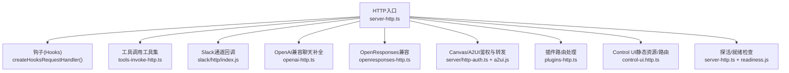
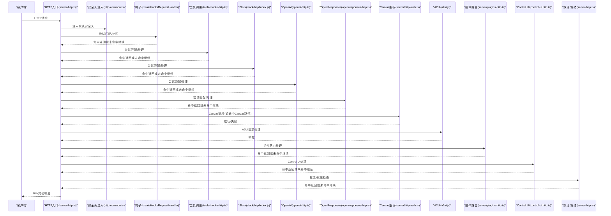
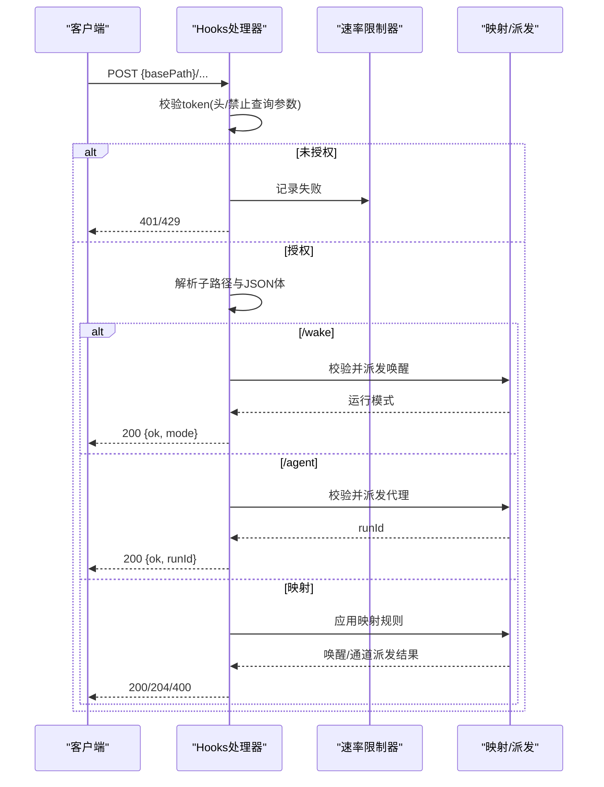
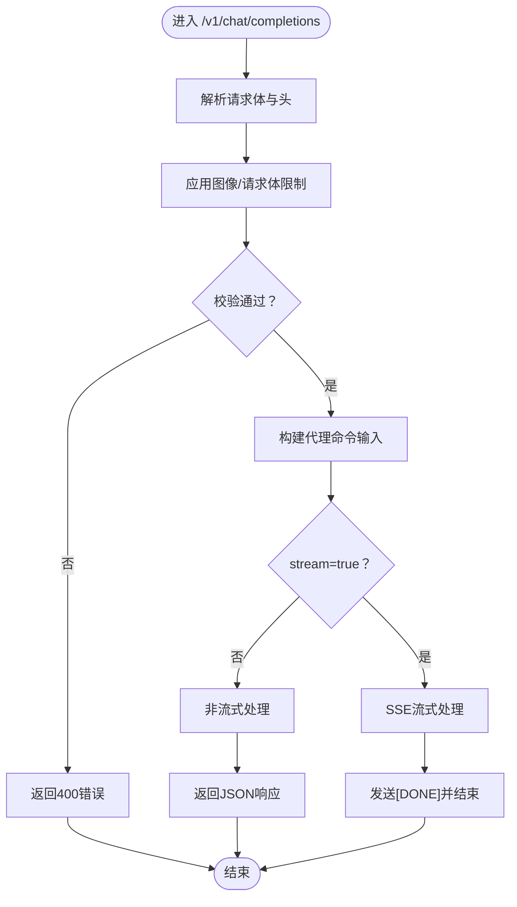
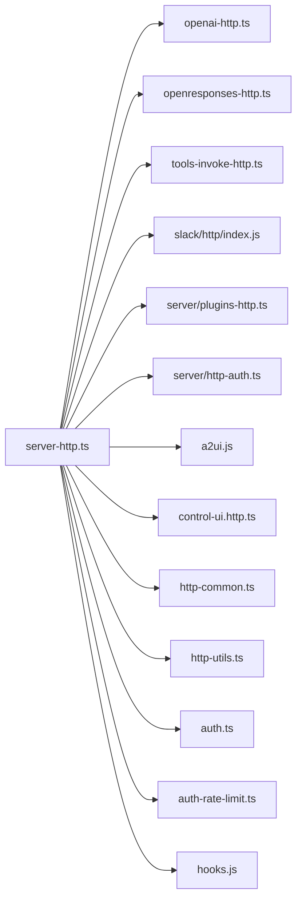

# HTTP API

<cite>
**本文引用的文件**
- [src/gateway/server-http.ts](file://src/gateway/server-http.ts)
- [src/gateway/http-common.ts](file://src/gateway/http-common.ts)
- [src/gateway/http-utils.ts](file://src/gateway/http-utils.ts)
- [src/gateway/openai-http.ts](file://src/gateway/openai-http.ts)
- [src/gateway/openresponses-http.ts](file://src/gateway/openresponses-http.ts)
- [src/gateway/tools-invoke-http.ts](file://src/gateway/tools-invoke-http.ts)
- [src/gateway/auth.ts](file://src/gateway/auth.ts)
- [src/gateway/auth-rate-limit.ts](file://src/gateway/auth-rate-limit.ts)
- [src/gateway/hooks.js](file://src/gateway/hooks.js)
- [src/gateway/control-ui.http.ts](file://src/gateway/control-ui.http.ts)
- [src/gateway/control-ui-auto-root.http.ts](file://src/gateway/control-ui-auto-root.http.ts)
- [src/gateway/control-ui-http-utils.ts](file://src/gateway/control-ui-http-utils.ts)
- [src/gateway/canvas-capability.ts](file://src/gateway/canvas-capability.ts)
- [src/gateway/server/plugins-http.ts](file://src/gateway/server/plugins-http.ts)
- [src/gateway/server/http-auth.ts](file://src/gateway/server/http-auth.ts)
- [src/gateway/server-channels.ts](file://src/gateway/server-channels.ts)
- [src/gateway/slack/http/index.js](file://src/gateway/slack/http/index.js)
- [src/gateway/a2ui.js](file://src/gateway/a2ui.js)
- [src/gateway/server/readiness.js](file://src/gateway/server/readiness.js)
- [src/gateway/server/constants.ts](file://src/gateway/server/constants.ts)
- [src/gateway/server/upgrade.ts](file://src/gateway/server/upgrade.ts)
- [src/gateway/server/ws-types.ts](file://src/gateway/server/ws-types.ts)
- [src/gateway/server/discovery.ts](file://src/gateway/server/discovery.ts)
- [src/gateway/server/discovery-runtime.ts](file://src/gateway/server/discovery-runtime.ts)
- [src/gateway/server-cron.ts](file://src/gateway/server-cron.ts)
- [src/gateway/server-maintenance.ts](file://src/gateway/server-maintenance.ts)
- [src/gateway/server-broadcast.ts](file://src/gateway/server-broadcast.ts)
- [src/gateway/server-lanes.ts](file://src/gateway/server-lanes.ts)
- [src/gateway/server-close.ts](file://src/gateway/server-close.ts)
- [src/gateway/server-chat.ts](file://src/gateway/server-chat.ts)
- [src/gateway/server-chat.agent-events.ts](file://src/gateway/server-chat.agent-events.ts)
- [src/gateway/call.ts](file://src/gateway/call.ts)
- [src/gateway/call.test.ts](file://src/gateway/call.test.ts)
- [src/gateway/agent-event-assistant-text.ts](file://src/gateway/agent-event-assistant-text.ts)
- [src/gateway/agent-prompt.ts](file://src/gateway/agent-prompt.ts)
- [src/gateway/agent-prompt.test.ts](file://src/gateway/agent-prompt.test.ts)
- [src/gateway/assistant-identity.ts](file://src/gateway/assistant-identity.ts)
- [src/gateway/assistant-identity.test.ts](file://src/gateway/assistant-identity.test.ts)
- [src/gateway/auth-config-utils.ts](file://src/gateway/auth-config-utils.ts)
- [src/gateway/auth-install-policy.ts](file://src/gateway/auth-install-policy.ts)
- [src/gateway/auth-mode-policy.ts](file://src/gateway/auth-mode-policy.ts)
- [src/gateway/auth-mode-policy.test.ts](file://src/gateway/auth-mode-policy.test.ts)
- [src/gateway/auth-rate-limit.test.ts](file://src/gateway/auth-rate-limit.test.ts)
- [src/gateway/auth.test.ts](file://src/gateway/auth.test.ts)
- [src/gateway/boot.ts](file://src/gateway/boot.ts)
- [src/gateway/boot.test.ts](file://src/gateway/boot.test.ts)
- [src/gateway/canvas-capability.ts](file://src/gateway/canvas-capability.ts)
- [src/gateway/canvas-capability.test.ts](file://src/gateway/canvas-capability.test.ts)
- [src/gateway/control-ui.http.test.ts](file://src/gateway/control-ui.http.test.ts)
- [src/gateway/control-ui.auto-root.http.test.ts](file://src/gateway/control-ui.auto-root.http.test.ts)
- [src/gateway/http-auth-helpers.ts](file://src/gateway/http-auth-helpers.ts)
- [src/gateway/http-auth-helpers.test.ts](file://src/gateway/http-auth-helpers.test.ts)
- [src/gateway/http-common.test.ts](file://src/gateway/http-common.test.ts)
- [src/gateway/http-endpoint-helpers.ts](file://src/gateway/http-endpoint-helpers.ts)
- [src/gateway/http-endpoint-helpers.test.ts](file://src/gateway/http-endpoint-helpers.test.ts)
- [src/gateway/http-utils.request-context.test.ts](file://src/gateway/http-utils.request-context.test.ts)
- [src/gateway/openai-http.message-channel.test.ts](file://src/gateway/openai-http.message-channel.test.ts)
- [src/gateway/openai-http.image-budget.test.ts](file://src/gateway/openai-http.image-budget.test.ts)
- [src/gateway/openai-http.test.ts](file://src/gateway/openai-http.test.ts)
- [src/gateway/openresponses-http.test.ts](file://src/gateway/openresponses-http.test.ts)
- [src/gateway/server-http.hooks-request-timeout.test.ts](file://src/gateway/server-http.hooks-request-timeout.test.ts)
- [src/gateway/server-http.probe.test.ts](file://src/gateway/server-http.probe.test.ts)
- [src/gateway/server-http.test-harness.ts](file://src/gateway/server-http.test-harness.ts)
- [src/gateway/server-channels.test.ts](file://src/gateway/server-channels.test.ts)
- [src/gateway/server-cron.test.ts](file://src/gateway/server-cron.test.ts)
- [src/gateway/server-maintenance.test.ts](file://src/gateway/server-maintenance.test.ts)
- [src/gateway/server-discovery.test.ts](file://src/gateway/server-discovery.test.ts)
- [src/gateway/server-discovery-runtime.test.ts](file://src/gateway/server-discovery-runtime.test.ts)
- [src/gateway/server-chat.agent-events.test.ts](file://src/gateway/server-chat.agent-events.test.ts)
- [src/gateway/server-chat.test.ts](file://src/gateway/server-chat.test.ts)
- [src/gateway/call.test.ts](file://src/gateway/call.test.ts)
- [src/gateway/call.ts](file://src/gateway/call.ts)
- [src/gateway/agent-event-assistant-text.test.ts](file://src/gateway/agent-event-assistant-text.test.ts)
- [src/gateway/agent-prompt.test.ts](file://src/gateway/agent-prompt.test.ts)
- [src/gateway/assistant-identity.test.ts](file://src/gateway/assistant-identity.test.ts)
- [src/gateway/auth-config-utils.test.ts](file://src/gateway/auth-config-utils.test.ts)
- [src/gateway/auth-install-policy.test.ts](file://src/gateway/auth-install-policy.test.ts)
- [src/gateway/auth-mode-policy.test.ts](file://src/gateway/auth-mode-policy.test.ts)
- [src/gateway/auth-rate-limit.test.ts](file://src/gateway/auth-rate-limit.test.ts)
- [src/gateway/auth.test.ts](file://src/gateway/auth.test.ts)
- [src/gateway/boot.test.ts](file://src/gateway/boot.test.ts)
- [src/gateway/canvas-capability.test.ts](file://src/gateway/canvas-capability.test.ts)
- [src/gateway/control-ui.http.test.ts](file://src/gateway/control-ui.http.test.ts)
- [src/gateway/control-ui.auto-root.http.test.ts](file://src/gateway/control-ui.auto-root.http.test.ts)
- [src/gateway/http-auth-helpers.test.ts](file://src/gateway/http-auth-helpers.test.ts)
- [src/gateway/http-common.test.ts](file://src/gateway/http-common.test.ts)
- [src/gateway/http-endpoint-helpers.test.ts](file://src/gateway/http-endpoint-helpers.test.ts)
- [src/gateway/http-utils.request-context.test.ts](file://src/gateway/http-utils.request-context.test.ts)
- [src/gateway/openai-http.message-channel.test.ts](file://src/gateway/openai-http.message-channel.test.ts)
- [src/gateway/openai-http.image-budget.test.ts](file://src/gateway/openai-http.image-budget.test.ts)
- [src/gateway/openai-http.test.ts](file://src/gateway/openai-http.test.ts)
- [src/gateway/openresponses-http.test.ts](file://src/gateway/openresponses-http.test.ts)
- [src/gateway/server-http.hooks-request-timeout.test.ts](file://src/gateway/server-http.hooks-request-timeout.test.ts)
- [src/gateway/server-http.probe.test.ts](file://src/gateway/server-http.probe.test.ts)
- [src/gateway/server-http.test-harness.ts](file://src/gateway/server-http.test-harness.ts)
- [src/gateway/server-channels.test.ts](file://src/gateway/server-channels.test.ts)
- [src/gateway/server-cron.test.ts](file://src/gateway/server-cron.test.ts)
- [src/gateway/server-maintenance.test.ts](file://src/gateway/server-maintenance.test.ts)
- [src/gateway/server-discovery.test.ts](file://src/gateway/server-discovery.test.ts)
- [src/gateway/server-discovery-runtime.test.ts](file://src/gateway/server-discovery-runtime.test.ts)
- [src/gateway/server-chat.agent-events.test.ts](file://src/gateway/server-chat.agent-events.test.ts)
- [src/gateway/server-chat.test.ts](file://src/gateway/server-chat.test.ts)
</cite>

## 目录

1. [简介](#简介)
2. [项目结构](#项目结构)
3. [核心组件](#核心组件)
4. [架构总览](#架构总览)
5. [详细组件分析](#详细组件分析)
6. [依赖关系分析](#依赖关系分析)
7. [性能考虑](#性能考虑)
8. [故障排查指南](#故障排查指南)
9. [结论](#结论)
10. [附录](#附录)

## 简介

本文件为网关服务器的HTTP API文档，覆盖RESTful端点、请求方法、URL模式、请求头规范、查询参数、请求体结构、响应格式、状态码与错误响应、认证机制、CORS与安全策略、速率限制、缓存策略、性能优化建议，并提供curl示例与SDK使用指引。文档基于源码实现进行梳理，确保与实际行为一致。

## 项目结构

网关HTTP服务由统一入口分发器负责路由到不同子处理器（OpenAI兼容、OpenResponses、插件路由、Canvas/A2UI、Control UI、探活/就绪检查等）。认证与速率限制在各处理器中复用，安全头统一注入。

图表来源

- [src/gateway/server-http.ts:612-786](file://src/gateway/server-http.ts#L612-L786)
- [src/gateway/openai-http.ts:408-612](file://src/gateway/openai-http.ts#L408-L612)
- [src/gateway/openresponses-http.ts](file://src/gateway/openresponses-http.ts)
- [src/gateway/tools-invoke-http.ts](file://src/gateway/tools-invoke-http.ts)
- [src/gateway/server/plugins-http.ts](file://src/gateway/server/plugins-http.ts)
- [src/gateway/server/http-auth.ts](file://src/gateway/server/http-auth.ts)
- [src/gateway/a2ui.js](file://src/gateway/a2ui.js)
- [src/gateway/control-ui.http.ts](file://src/gateway/control-ui.http.ts)
- [src/gateway/server/readiness.js](file://src/gateway/server/readiness.js)

章节来源

- [src/gateway/server-http.ts:612-786](file://src/gateway/server-http.ts#L612-L786)

## 核心组件

- 统一HTTP入口与路由分发：server-http.ts
- 安全头与通用响应：http-common.ts
- 请求上下文解析（模型/会话/消息通道）：http-utils.ts
- OpenAI兼容聊天补全：openai-http.ts
- OpenResponses兼容：openresponses-http.ts
- 钩子(Hooks)：hooks.js + server-http.ts中的createHooksRequestHandler
- 工具调用：tools-invoke-http.ts
- 插件路由：server/plugins-http.ts
- Canvas/A2UI：server/http-auth.ts + a2ui.js
- Control UI：control-ui.http.ts + control-ui.auto-root.http.ts + control-ui-http-utils.ts
- 探活/就绪：server-http.ts + server/readiness.js

章节来源

- [src/gateway/server-http.ts:612-786](file://src/gateway/server-http.ts#L612-L786)
- [src/gateway/http-common.ts:11-28](file://src/gateway/http-common.ts#L11-L28)
- [src/gateway/http-utils.ts:66-104](file://src/gateway/http-utils.ts#L66-L104)
- [src/gateway/openai-http.ts:408-612](file://src/gateway/openai-http.ts#L408-L612)
- [src/gateway/openresponses-http.ts](file://src/gateway/openresponses-http.ts)
- [src/gateway/tools-invoke-http.ts](file://src/gateway/tools-invoke-http.ts)
- [src/gateway/server/plugins-http.ts](file://src/gateway/server/plugins-http.ts)
- [src/gateway/server/http-auth.ts](file://src/gateway/server/http-auth.ts)
- [src/gateway/a2ui.js](file://src/gateway/a2ui.js)
- [src/gateway/control-ui.http.ts](file://src/gateway/control-ui.http.ts)
- [src/gateway/control-ui.auto-root.http.ts](file://src/gateway/control-ui.auto-root.http.ts)
- [src/gateway/control-ui-http-utils.ts:1-15](file://src/gateway/control-ui-http-utils.ts#L1-L15)
- [src/gateway/server/readiness.js](file://src/gateway/server/readiness.js)

## 架构总览

下图展示HTTP请求从入口到各处理器的执行顺序与鉴权/速率限制的插入点。

图表来源

- [src/gateway/server-http.ts:612-786](file://src/gateway/server-http.ts#L612-L786)
- [src/gateway/http-common.ts:11-22](file://src/gateway/http-common.ts#L11-L22)
- [src/gateway/openai-http.ts:408-612](file://src/gateway/openai-http.ts#L408-L612)
- [src/gateway/openresponses-http.ts](file://src/gateway/openresponses-http.ts)
- [src/gateway/tools-invoke-http.ts](file://src/gateway/tools-invoke-http.ts)
- [src/gateway/server/plugins-http.ts](file://src/gateway/server/plugins-http.ts)
- [src/gateway/server/http-auth.ts](file://src/gateway/server/http-auth.ts)
- [src/gateway/a2ui.js](file://src/gateway/a2ui.js)
- [src/gateway/control-ui.http.ts](file://src/gateway/control-ui.http.ts)
- [src/gateway/server/readiness.js](file://src/gateway/server/readiness.js)

## 详细组件分析

### 认证与安全策略

- 默认安全头：X-Content-Type-Options、Referrer-Policy、Permissions-Policy；可选HSTS。
- Bearer令牌提取：Authorization: Bearer <token>。
- Canvas作用域URL规范化与鉴权：Canvas路径识别、能力校验、速率限制。
- 代理信任与真实IP回退：支持受信代理列表与可选真实IP回退。
- 钩子(Hooks)鉴权：基于配置的token，禁止通过查询参数传递，支持速率限制。
- 插件路由鉴权：根据路径上下文决定是否强制网关鉴权。

章节来源

- [src/gateway/http-common.ts:11-22](file://src/gateway/http-common.ts#L11-L22)
- [src/gateway/http-utils.ts:17-24](file://src/gateway/http-utils.ts#L17-L24)
- [src/gateway/server-http.ts:612-635](file://src/gateway/server-http.ts#L612-L635)
- [src/gateway/server/http-auth.ts](file://src/gateway/server/http-auth.ts)
- [src/gateway/canvas-capability.ts](file://src/gateway/canvas-capability.ts)
- [src/gateway/auth.ts](file://src/gateway/auth.ts)
- [src/gateway/auth-rate-limit.ts](file://src/gateway/auth-rate-limit.ts)
- [src/gateway/hooks.js](file://src/gateway/hooks.js)

### 钩子(Hooks) HTTP API

- 基础路径：由配置决定，仅接受POST。
- 认证方式：Authorization: Bearer <token> 或 X-OpenClaw-Token 头；禁止查询参数携带token。
- 速率限制：针对失败尝试的限流，超限返回429。
- 子路径：
  - /wake：触发唤醒，参数校验后返回运行模式。
  - /agent：派发给指定代理，支持会话键与目标代理ID策略。
  - 映射：若配置了映射规则，将请求映射为唤醒或通道消息并派发。
- 错误与状态码：
  - 400：无效请求体/参数校验失败。
  - 401：未授权。
  - 404：未找到子路径。
  - 405：方法不允许。
  - 413：请求体过大。
  - 429：速率限制。
  - 500：内部错误（映射失败时）。

图表来源

- [src/gateway/server-http.ts:348-564](file://src/gateway/server-http.ts#L348-L564)
- [src/gateway/hooks.js](file://src/gateway/hooks.js)

章节来源

- [src/gateway/server-http.ts:348-564](file://src/gateway/server-http.ts#L348-L564)
- [src/gateway/hooks.js](file://src/gateway/hooks.js)

### 工具调用 HTTP API

- 路径：工具集专用入口（具体路径由工具集实现定义）。
- 认证：遵循网关鉴权策略，支持代理信任与速率限制。
- 响应：按工具集约定返回JSON或流式数据。

章节来源

- [src/gateway/tools-invoke-http.ts](file://src/gateway/tools-invoke-http.ts)
- [src/gateway/server-http.ts:645-653](file://src/gateway/server-http.ts#L645-L653)

### OpenAI 兼容聊天补全

- 路径：/v1/chat/completions
- 方法：POST
- 请求体字段：
  - model：模型标识，默认openclaw。
  - stream：是否流式返回。
  - messages：消息数组，支持text与image_url两种内容类型。
  - user：用户标识（可选）。
- 请求头：
  - Authorization: Bearer <token>
  - 可选：X-OpenClaw-Agent-Id、X-OpenClaw-Session-Key、X-OpenClaw-Message-Channel
- 图像输入限制：
  - 最大图像部分数、总图像字节上限、允许的MIME类型、URL白名单、最大重定向次数、超时等。
- 流式输出：SSE，对象类型chat.completion.chunk。
- 非流式输出：chat.completion，包含choices与usage占位。
- 错误与状态码：
  - 400：缺少消息、图像URL非法、图像过多/过大。
  - 500：内部错误。

图表来源

- [src/gateway/openai-http.ts:408-612](file://src/gateway/openai-http.ts#L408-L612)
- [src/gateway/http-utils.ts:66-104](file://src/gateway/http-utils.ts#L66-L104)

章节来源

- [src/gateway/openai-http.ts:408-612](file://src/gateway/openai-http.ts#L408-L612)
- [src/gateway/http-utils.ts:66-104](file://src/gateway/http-utils.ts#L66-L104)

### OpenResponses 兼容

- 功能：提供与OpenResponses兼容的HTTP端点（具体路径与行为由实现定义）。
- 认证与速率限制：遵循网关策略。

章节来源

- [src/gateway/openresponses-http.ts](file://src/gateway/openresponses-http.ts)
- [src/gateway/server-http.ts:660-671](file://src/gateway/server-http.ts#L660-L671)

### Canvas/A2UI

- Canvas路径识别与鉴权：对Canvas相关路径进行能力校验与网关鉴权。
- A2UI：Canvas Host的HTTP请求处理。

章节来源

- [src/gateway/server/http-auth.ts](file://src/gateway/server/http-auth.ts)
- [src/gateway/a2ui.js](file://src/gateway/a2ui.js)
- [src/gateway/server-http.ts:685-717](file://src/gateway/server-http.ts#L685-L717)

### 插件路由

- 路由优先级：插件路由在Control UI之前注册，避免与内置路由冲突。
- 鉴权策略：根据路径上下文与保护策略决定是否强制网关鉴权。
- 回调路径：特定通道（如Mattermost）的斜杠命令回调路径动态解析。

章节来源

- [src/gateway/server/plugins-http.ts](file://src/gateway/server/plugins-http.ts)
- [src/gateway/server-http.ts:718-735](file://src/gateway/server-http.ts#L718-L735)
- [src/gateway/server-http.ts:96-150](file://src/gateway/server-http.ts#L96-L150)

### Control UI

- 提供头像与SPA路由处理，支持基础路径前缀。
- 本地直连与受信代理访问可显示更详细的就绪信息。

章节来源

- [src/gateway/control-ui.http.ts](file://src/gateway/control-ui.http.ts)
- [src/gateway/control-ui.auto-root.http.ts](file://src/gateway/control-ui.auto-root.http.ts)
- [src/gateway/control-ui-http-utils.ts:1-15](file://src/gateway/control-ui-http-utils.ts#L1-L15)
- [src/gateway/server-http.ts:737-755](file://src/gateway/server-http.ts#L737-L755)

### 探活与就绪检查

- 支持路径：/health、/healthz（存活）、/ready、/readyz（就绪）。
- 方法：GET/HEAD。
- 就绪详情：本地直连或具备有效Bearer令牌时可返回详细信息。

章节来源

- [src/gateway/server-http.ts:184-236](file://src/gateway/server-http.ts#L184-L236)
- [src/gateway/server/readiness.js](file://src/gateway/server/readiness.js)

## 依赖关系分析

- 组件耦合：
  - server-http.ts作为总控，依赖各子处理器模块与通用工具。
  - 认证与速率限制在多处复用，降低重复逻辑。
  - Canvas/A2UI与插件路由在路径层面相互独立，避免冲突。
- 外部依赖：
  - WebSocket升级事件由server/upgrade.ts处理，HTTP入口不直接处理升级。
  - Slack通道回调由独立模块处理。

图表来源

- [src/gateway/server-http.ts:612-786](file://src/gateway/server-http.ts#L612-L786)
- [src/gateway/openai-http.ts:408-612](file://src/gateway/openai-http.ts#L408-L612)
- [src/gateway/openresponses-http.ts](file://src/gateway/openresponses-http.ts)
- [src/gateway/tools-invoke-http.ts](file://src/gateway/tools-invoke-http.ts)
- [src/gateway/server/plugins-http.ts](file://src/gateway/server/plugins-http.ts)
- [src/gateway/server/http-auth.ts](file://src/gateway/server/http-auth.ts)
- [src/gateway/a2ui.js](file://src/gateway/a2ui.js)
- [src/gateway/control-ui.http.ts](file://src/gateway/control-ui.http.ts)
- [src/gateway/http-common.ts:11-22](file://src/gateway/http-common.ts#L11-L22)
- [src/gateway/http-utils.ts:66-104](file://src/gateway/http-utils.ts#L66-L104)
- [src/gateway/auth.ts](file://src/gateway/auth.ts)
- [src/gateway/auth-rate-limit.ts](file://src/gateway/auth-rate-limit.ts)
- [src/gateway/hooks.js](file://src/gateway/hooks.js)

## 性能考虑

- 流式输出：OpenAI兼容端点支持SSE流式传输，减少首字节延迟。
- 速率限制：针对认证失败与Canvas鉴权失败实施限速，防止暴力破解。
- 请求体大小限制：OpenAI兼容端点默认最大请求体大小可配置。
- 图像输入限制：限制图像数量与总字节数，避免资源滥用。
- 缓存控制：探活/就绪端点设置no-store，避免代理缓存。
- 代理信任：通过受信代理列表与真实IP回退策略，保证客户端IP准确性。

章节来源

- [src/gateway/openai-http.ts:55-97](file://src/gateway/openai-http.ts#L55-L97)
- [src/gateway/openai-http.ts:509-510](file://src/gateway/openai-http.ts#L509-L510)
- [src/gateway/http-common.ts:102-108](file://src/gateway/http-common.ts#L102-L108)
- [src/gateway/server-http.ts:184-236](file://src/gateway/server-http.ts#L184-L236)

## 故障排查指南

- 401/403未授权：
  - 检查Authorization头是否为Bearer <token>，且token正确。
  - 确认Canvas路径与能力匹配。
- 429速率限制：
  - 观察Retry-After头，等待冷却时间。
- 404未找到：
  - 确认路径与子路径是否正确（如/Hooks的子路径）。
- 413请求体过大：
  - 减少请求体大小或调整配置。
- 5xx内部错误：
  - 查看服务日志，定位具体处理器异常。

章节来源

- [src/gateway/http-common.ts:47-65](file://src/gateway/http-common.ts#L47-L65)
- [src/gateway/server-http.ts:348-564](file://src/gateway/server-http.ts#L348-L564)

## 结论

该HTTP API以server-http.ts为核心入口，围绕OpenAI兼容、OpenResponses、钩子、工具调用、Canvas/A2UI、插件路由与Control UI等模块构建。通过统一的安全头注入、可配置的速率限制与严格的认证策略，保障安全性与稳定性。OpenAI兼容端点提供流式与非流式两种响应模式，满足多样化场景需求。

## 附录

### 端点清单与规范

- 钩子(Hooks)
  - 方法：POST
  - 路径：{basePath}/wake | {basePath}/agent | {basePath}/映射子路径
  - 认证：Authorization: Bearer <token> 或 X-OpenClaw-Token；禁止查询参数携带token
  - 请求体：JSON；/wake需包含文本与模式；/agent需包含代理ID与会话键等
  - 响应：JSON；/wake返回运行模式；/agent返回runId；映射成功返回runId或204
  - 状态码：200/204/400/401/404/405/413/429/500

- 工具调用
  - 方法：POST（视具体工具而定）
  - 路径：工具集定义
  - 认证：Bearer令牌
  - 响应：工具集定义

- OpenAI 兼容聊天补全
  - 方法：POST
  - 路径：/v1/chat/completions
  - 请求体字段：model、stream、messages、user
  - 请求头：Authorization: Bearer <token>；可选X-OpenClaw-Agent-Id、X-OpenClaw-Session-Key、X-OpenClaw-Message-Channel
  - 图像限制：最大图像部分数、总字节数、MIME白名单、URL白名单等
  - 响应：JSON或SSE流式
  - 状态码：200/400/500

- OpenResponses 兼容
  - 方法：按实现定义
  - 路径：按实现定义
  - 认证：Bearer令牌
  - 响应：按实现定义

- Canvas/A2UI
  - 方法：按实现定义
  - 路径：Canvas相关路径
  - 认证：Canvas鉴权
  - 响应：Canvas/A2UI内容

- 插件路由
  - 方法：按插件定义
  - 路径：插件注册路径
  - 认证：根据路径上下文强制网关鉴权
  - 响应：插件定义

- Control UI
  - 方法：GET/HEAD
  - 路径：/avatar/{agentId}（头像）、SPA路由（基础路径前缀）
  - 认证：本地直连或Bearer令牌可见详细就绪信息
  - 响应：静态资源/SPA

- 探活/就绪
  - 方法：GET/HEAD
  - 路径：/health、/healthz、/ready、/readyz
  - 响应：JSON；就绪详情需满足本地直连或Bearer令牌条件

章节来源

- [src/gateway/server-http.ts:348-564](file://src/gateway/server-http.ts#L348-L564)
- [src/gateway/tools-invoke-http.ts](file://src/gateway/tools-invoke-http.ts)
- [src/gateway/openai-http.ts:408-612](file://src/gateway/openai-http.ts#L408-L612)
- [src/gateway/openresponses-http.ts](file://src/gateway/openresponses-http.ts)
- [src/gateway/server/http-auth.ts](file://src/gateway/server/http-auth.ts)
- [src/gateway/a2ui.js](file://src/gateway/a2ui.js)
- [src/gateway/server/plugins-http.ts](file://src/gateway/server/plugins-http.ts)
- [src/gateway/control-ui.http.ts](file://src/gateway/control-ui.http.ts)
- [src/gateway/server-http.ts:184-236](file://src/gateway/server-http.ts#L184-L236)

### 请求头规范

- Authorization: Bearer <token>
- X-OpenClaw-Agent-Id 或 X-OpenClaw-Agent：代理ID
- X-OpenClaw-Session-Key：会话键
- X-OpenClaw-Message-Channel：消息通道（用于OpenAI兼容端点）

章节来源

- [src/gateway/http-utils.ts:17-35](file://src/gateway/http-utils.ts#L17-L35)
- [src/gateway/http-utils.ts:66-104](file://src/gateway/http-utils.ts#L66-L104)

### 查询参数与请求体结构

- 钩子(Hooks)：禁止查询参数携带token；请求体为JSON对象。
- OpenAI兼容：messages支持text与image_url；user为可选字符串。
- OpenResponses：按实现定义。

章节来源

- [src/gateway/server-http.ts:383-390](file://src/gateway/server-http.ts#L383-L390)
- [src/gateway/openai-http.ts:429-439](file://src/gateway/openai-http.ts#L429-L439)

### 响应格式与状态码

- 统一JSON响应：错误对象包含message与type字段。
- SSE流式：chat.completion.chunk对象，结尾[DONE]。
- 状态码：400/401/404/405/413/429/500等。

章节来源

- [src/gateway/http-common.ts:24-71](file://src/gateway/http-common.ts#L24-L71)
- [src/gateway/openai-http.ts:123-150](file://src/gateway/openai-http.ts#L123-L150)
- [src/gateway/openai-http.ts:509-510](file://src/gateway/openai-http.ts#L509-L510)

### 认证机制

- Bearer令牌：Authorization头或X-OpenClaw-Token头。
- Canvas鉴权：Canvas路径识别与能力校验。
- 插件路由鉴权：根据路径上下文强制网关鉴权。
- 代理信任：受信代理列表与真实IP回退。

章节来源

- [src/gateway/http-utils.ts:17-24](file://src/gateway/http-utils.ts#L17-L24)
- [src/gateway/server/http-auth.ts](file://src/gateway/server/http-auth.ts)
- [src/gateway/server/plugins-http.ts](file://src/gateway/server/plugins-http.ts)
- [src/gateway/server-http.ts:624-625](file://src/gateway/server-http.ts#L624-L625)

### CORS与安全策略

- 默认安全头：X-Content-Type-Options、Referrer-Policy、Permissions-Policy。
- 可选HSTS：通过Strict-Transport-Security头配置。
- Canvas/A2UI：可能在frame内加载，因此不设置frame限制与CSP。

章节来源

- [src/gateway/http-common.ts:11-22](file://src/gateway/http-common.ts#L11-L22)

### 速率限制

- 钩子(Hooks)：失败尝试限流，超限返回429。
- Canvas鉴权：失败尝试限流。
- 速率限制器：可配置窗口与锁定时长。

章节来源

- [src/gateway/server-http.ts:357-364](file://src/gateway/server-http.ts#L357-L364)
- [src/gateway/auth-rate-limit.ts](file://src/gateway/auth-rate-limit.ts)

### 缓存策略

- 探活/就绪：Cache-Control: no-store。
- SSE：Cache-Control: no-cache，Connection: keep-alive。

章节来源

- [src/gateway/server-http.ts:208-209](file://src/gateway/server-http.ts#L208-L209)
- [src/gateway/http-common.ts:102-108](file://src/gateway/http-common.ts#L102-L108)

### API版本控制

- 当前实现未显式提供版本前缀路径；OpenAI兼容端点使用/v1前缀。

章节来源

- [src/gateway/openai-http.ts:414-416](file://src/gateway/openai-http.ts#L414-L416)

### curl 示例与SDK使用

- curl示例（OpenAI兼容）：
  - 非流式：使用POST /v1/chat/completions，Authorization头携带Bearer token，请求体包含messages与model。
  - 流式：同上，设置stream=true，接收SSE流式响应。
- SDK使用：
  - 使用OpenAI兼容SDK，将baseURL指向网关HTTP服务根地址，即可复用标准OpenAI客户端库。

章节来源

- [src/gateway/openai-http.ts:408-612](file://src/gateway/openai-http.ts#L408-L612)

### API测试工具

- 探活/就绪：GET /health、/ready。
- 钩子(Hooks)：POST /hooks/{子路径}，Authorization头携带token。
- OpenAI兼容：POST /v1/chat/completions，携带Authorization与请求体。

章节来源

- [src/gateway/server-http.ts:184-236](file://src/gateway/server-http.ts#L184-L236)
- [src/gateway/server-http.ts:348-564](file://src/gateway/server-http.ts#L348-L564)
- [src/gateway/openai-http.ts:408-612](file://src/gateway/openai-http.ts#L408-L612)
