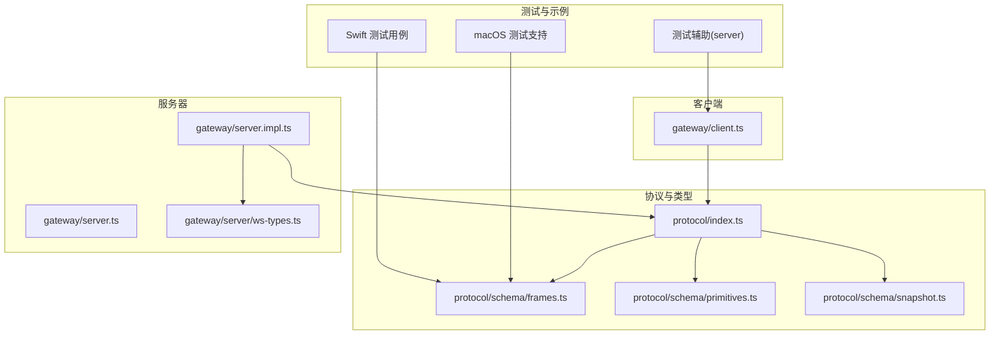
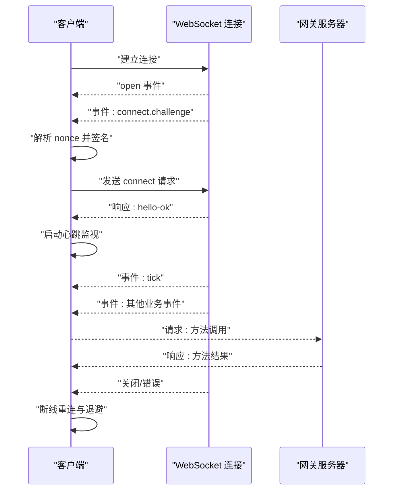
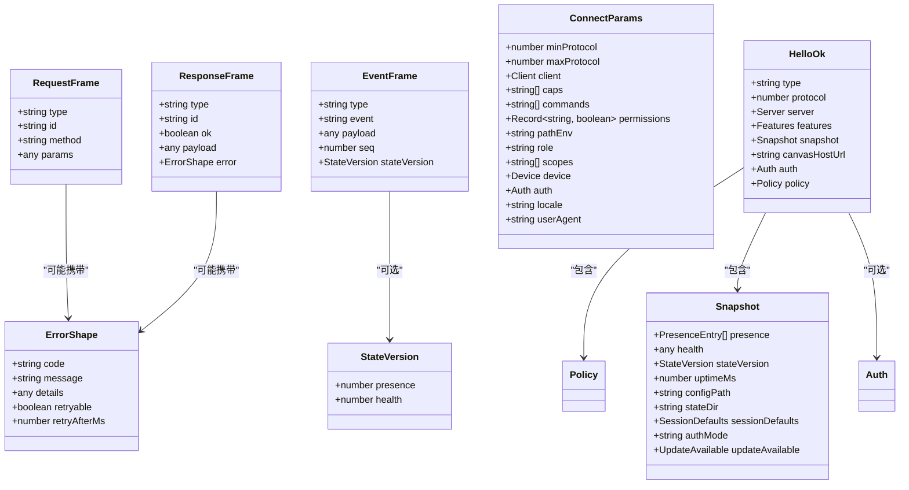
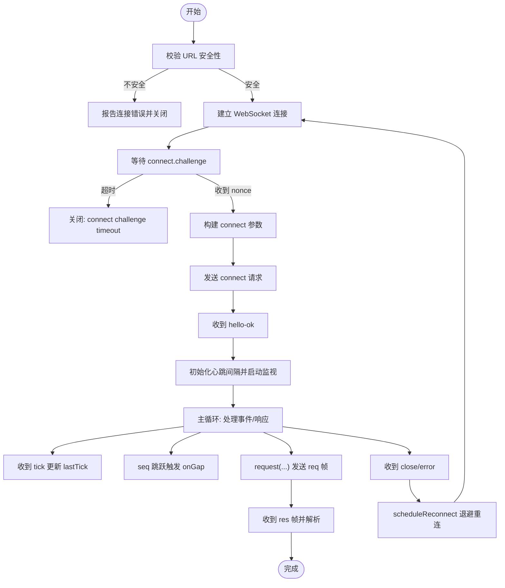
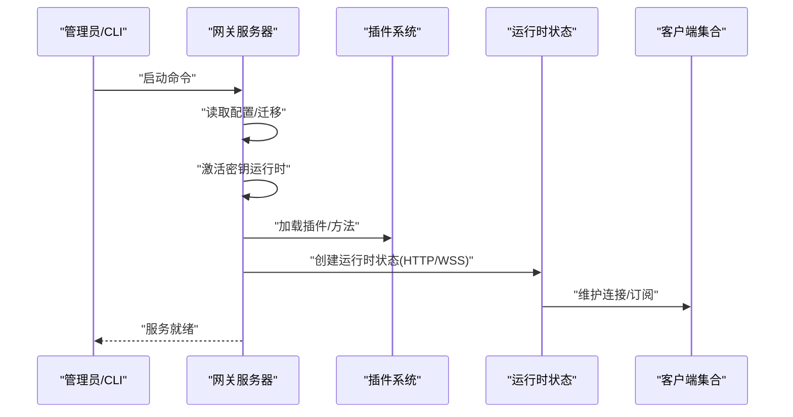
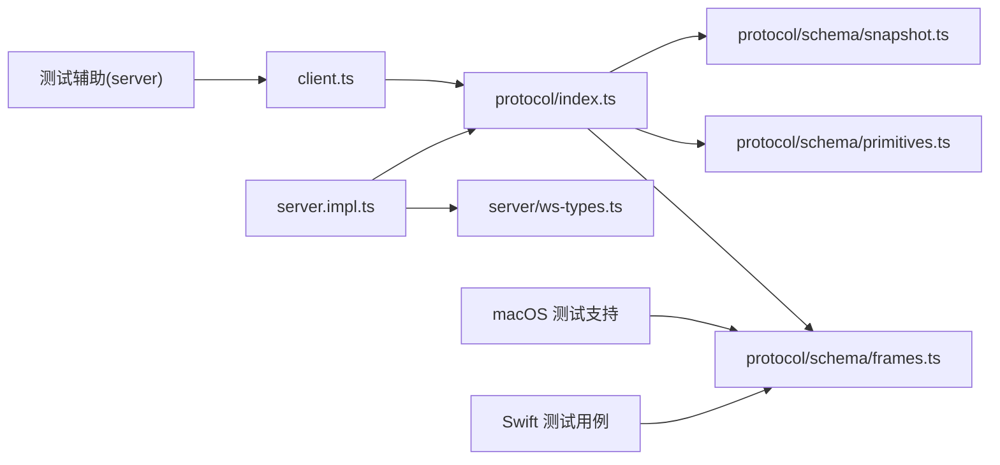

# WebSocket API

<cite>
**本文引用的文件**
- [src/gateway/client.ts](file://src/gateway/client.ts)
- [src/gateway/server.impl.ts](file://src/gateway/server.impl.ts)
- [src/gateway/server.ts](file://src/gateway/server.ts)
- [src/gateway/server/ws-types.ts](file://src/gateway/server/ws-types.ts)
- [src/gateway/protocol/index.ts](file://src/gateway/protocol/index.ts)
- [src/gateway/protocol/schema/frames.ts](file://src/gateway/protocol/schema/frames.ts)
- [src/gateway/protocol/schema/primitives.ts](file://src/gateway/protocol/schema/primitives.ts)
- [src/gateway/protocol/schema/snapshot.ts](file://src/gateway/protocol/schema/snapshot.ts)
- [apps/macos/Tests/OpenClawIPCTests/GatewayWebSocketTestSupport.swift](file://apps/macos/Tests/OpenClawIPCTests/GatewayWebSocketTestSupport.swift)
- [apps/shared/OpenClawKit/Tests/OpenClawKitTests/GatewayNodeSessionTests.swift](file://apps/shared/OpenClawKit/Tests/OpenClawKitTests/GatewayNodeSessionTests.swift)
- [src/gateway/test-helpers.server.ts](file://src/gateway/test-helpers.server.ts)
</cite>

## 目录

1. [简介](#简介)
2. [项目结构](#项目结构)
3. [核心组件](#核心组件)
4. [架构总览](#架构总览)
5. [详细组件分析](#详细组件分析)
6. [依赖关系分析](#依赖关系分析)
7. [性能考量](#性能考量)
8. [故障排查指南](#故障排查指南)
9. [结论](#结论)
10. [附录](#附录)

## 简介

本文件系统化梳理并记录网关服务器的 WebSocket 协议实现，覆盖连接建立、消息格式、事件类型、实时通信机制、服务器方法调用规范、参数与返回值、错误处理、认证流程、心跳与重连策略、连接状态管理、客户端 SDK 使用示例、消息路由与订阅机制、协议版本兼容性以及调试工具使用指南。内容以仓库中实际实现为依据，确保可追溯与可验证。

## 项目结构

围绕 WebSocket 的关键文件组织如下：

- 客户端实现：src/gateway/client.ts
- 服务器实现：src/gateway/server.impl.ts（入口导出见 src/gateway/server.ts）
- 协议与类型：src/gateway/protocol/index.ts 及其 schema 子模块
- WebSocket 运行时类型：src/gateway/server/ws-types.ts
- 测试辅助与示例帧：apps/macos/Tests/OpenClawIPCTests/GatewayWebSocketTestSupport.swift、apps/shared/OpenClawKit/Tests/OpenClawKitTests/GatewayNodeSessionTests.swift、src/gateway/test-helpers.server.ts

**图表来源**

- [src/gateway/protocol/index.ts:1-673](file://src/gateway/protocol/index.ts#L1-L673)
- [src/gateway/protocol/schema/frames.ts:1-164](file://src/gateway/protocol/schema/frames.ts#L1-L164)
- [src/gateway/protocol/schema/primitives.ts:1-74](file://src/gateway/protocol/schema/primitives.ts#L1-L74)
- [src/gateway/protocol/schema/snapshot.ts:1-73](file://src/gateway/protocol/schema/snapshot.ts#L1-L73)
- [src/gateway/client.ts:1-674](file://src/gateway/client.ts#L1-L674)
- [src/gateway/server.impl.ts:1-1066](file://src/gateway/server.impl.ts#L1-L1066)
- [src/gateway/server.ts:1-4](file://src/gateway/server.ts#L1-L4)
- [src/gateway/server/ws-types.ts:1-14](file://src/gateway/server/ws-types.ts#L1-L14)
- [apps/macos/Tests/OpenClawIPCTests/GatewayWebSocketTestSupport.swift:31-71](file://apps/macos/Tests/OpenClawIPCTests/GatewayWebSocketTestSupport.swift#L31-L71)
- [apps/shared/OpenClawKit/Tests/OpenClawKitTests/GatewayNodeSessionTests.swift:104-152](file://apps/shared/OpenClawKit/Tests/OpenClawKitTests/GatewayNodeSessionTests.swift#L104-L152)
- [src/gateway/test-helpers.server.ts:320-367](file://src/gateway/test-helpers.server.ts#L320-L367)

**章节来源**

- [src/gateway/server.ts:1-4](file://src/gateway/server.ts#L1-L4)
- [src/gateway/server.impl.ts:1-1066](file://src/gateway/server.impl.ts#L1-L1066)
- [src/gateway/client.ts:1-674](file://src/gateway/client.ts#L1-L674)
- [src/gateway/protocol/index.ts:1-673](file://src/gateway/protocol/index.ts#L1-L673)

## 核心组件

- 协议与消息模型
  - 请求帧、响应帧、事件帧的 TypeBox 类型定义与校验器
  - 连接参数、握手确认、错误形状等核心数据结构
- 客户端
  - 建立安全连接、挑战-响应认证、请求-响应交互、事件监听、心跳检测、断线重连与退避
- 服务器
  - 启动与配置装载、认证与速率限制、运行时状态、广播与订阅、维护任务、插件与方法注册
- WebSocket 运行时类型
  - 客户端会话、连接参数、能力与策略等类型

**章节来源**

- [src/gateway/protocol/schema/frames.ts:125-163](file://src/gateway/protocol/schema/frames.ts#L125-L163)
- [src/gateway/protocol/index.ts:253-458](file://src/gateway/protocol/index.ts#L253-L458)
- [src/gateway/client.ts:67-126](file://src/gateway/client.ts#L67-L126)
- [src/gateway/server.impl.ts:266-800](file://src/gateway/server.impl.ts#L266-L800)
- [src/gateway/server/ws-types.ts:4-13](file://src/gateway/server/ws-types.ts#L4-L13)

## 架构总览

下图展示从客户端到服务器的典型交互路径，包括握手、认证、心跳与事件广播。

**图表来源**

- [src/gateway/client.ts:199-251](file://src/gateway/client.ts#L199-L251)
- [src/gateway/client.ts:497-554](file://src/gateway/client.ts#L497-L554)
- [src/gateway/client.ts:596-618](file://src/gateway/client.ts#L596-L618)
- [src/gateway/server.impl.ts:580-630](file://src/gateway/server.impl.ts#L580-L630)

## 详细组件分析

### 消息与协议模型（TypeBox 定义）

- 帧类型
  - 请求帧：包含 type、id、method、params
  - 响应帧：包含 type、id、ok、payload 或 error
  - 事件帧：包含 type、event、payload、可选 seq 与 stateVersion
- 核心对象
  - 连接参数 ConnectParams：最小/最大协议版本、客户端信息、权限、设备签名、认证信息等
  - 握手确认 HelloOk：协议版本、服务端信息、特性列表、快照、策略（最大负载、缓冲、心跳间隔）等
  - 错误形状 ErrorShape：包含 code、message、details、retryable、retryAfterMs
  - 快照 Snapshot 与状态版本 StateVersion：用于事件去重与一致性
- 校验器
  - 使用 Ajv 编译各 Schema，提供 validateXxx 函数进行运行时校验

**图表来源**

- [src/gateway/protocol/schema/frames.ts:125-163](file://src/gateway/protocol/schema/frames.ts#L125-L163)
- [src/gateway/protocol/schema/frames.ts:20-112](file://src/gateway/protocol/schema/frames.ts#L20-L112)
- [src/gateway/protocol/schema/snapshot.ts:38-72](file://src/gateway/protocol/schema/snapshot.ts#L38-L72)
- [src/gateway/protocol/index.ts:253-458](file://src/gateway/protocol/index.ts#L253-L458)

**章节来源**

- [src/gateway/protocol/schema/frames.ts:1-164](file://src/gateway/protocol/schema/frames.ts#L1-L164)
- [src/gateway/protocol/schema/primitives.ts:1-74](file://src/gateway/protocol/schema/primitives.ts#L1-L74)
- [src/gateway/protocol/schema/snapshot.ts:1-73](file://src/gateway/protocol/schema/snapshot.ts#L1-L73)
- [src/gateway/protocol/index.ts:253-458](file://src/gateway/protocol/index.ts#L253-L458)

### 客户端实现（连接、认证、心跳、重连）

- 连接建立
  - URL 安全校验：禁止非回环主机的明文 ws；wss 需 TLS 指纹校验
  - 打开后触发 connect 挑战等待定时器，超时则关闭
- 认证流程
  - 接收事件 "connect.challenge"，提取 nonce，构造 connect 请求（含设备签名、角色、作用域、可选令牌）
  - 成功后持久化设备令牌（若返回），设置心跳间隔并启动心跳监视
- 请求-响应
  - request(method, params, { expectFinal? }) 发送 req 帧，等待 res 帧；对“已受理”状态的中间 ack 不视为最终完成
- 事件处理
  - 事件帧支持 seq 与 stateVersion；当 seq 缺失或跳跃时触发 onGap 回调
  - "tick" 事件更新最近心跳时间
- 心跳与保活
  - startTickWatch 周期检查 lastTick 与 policy.tickIntervalMs，超过两倍阈值则主动关闭
- 断线与重连
  - flushPendingErrors 统一拒绝未决请求
  - scheduleReconnect 指数退避，上限 30 秒
  - 对特定认证错误暂停重连，直到用户干预或可信端点允许重试
- 关闭码提示
  - 提供常见关闭码的描述映射

**图表来源**

- [src/gateway/client.ts:134-251](file://src/gateway/client.ts#L134-L251)
- [src/gateway/client.ts:267-415](file://src/gateway/client.ts#L267-L415)
- [src/gateway/client.ts:497-554](file://src/gateway/client.ts#L497-L554)
- [src/gateway/client.ts:596-618](file://src/gateway/client.ts#L596-L618)
- [src/gateway/client.ts:576-587](file://src/gateway/client.ts#L576-L587)

**章节来源**

- [src/gateway/client.ts:67-126](file://src/gateway/client.ts#L67-L126)
- [src/gateway/client.ts:134-251](file://src/gateway/client.ts#L134-L251)
- [src/gateway/client.ts:267-415](file://src/gateway/client.ts#L267-L415)
- [src/gateway/client.ts:497-554](file://src/gateway/client.ts#L497-L554)
- [src/gateway/client.ts:596-618](file://src/gateway/client.ts#L596-L618)
- [src/gateway/client.ts:576-587](file://src/gateway/client.ts#L576-L587)

### 服务器实现（启动、认证、广播、订阅）

- 启动流程
  - 读取配置与迁移、激活密钥运行时、启动诊断心跳、准备插件与方法集
  - 创建运行时状态（HTTP/WebSocket 服务器、客户端集合、广播接口等）
- 认证与速率限制
  - 为不同来源（浏览器、其他）配置独立速率限制器
  - 启动时生成/加载网关认证令牌，必要时持久化
- 运行时状态与广播
  - 维护节点注册、订阅管理、聊天运行时、去重与健康状态
  - 提供 broadcast、broadcastToConnIds 等广播接口
- 维护任务
  - 定时心跳、健康刷新、去重清理、媒体清理等
- 插件与方法
  - 加载插件并合并方法集，统一对外暴露

**图表来源**

- [src/gateway/server.impl.ts:266-800](file://src/gateway/server.impl.ts#L266-L800)

**章节来源**

- [src/gateway/server.impl.ts:266-800](file://src/gateway/server.impl.ts#L266-L800)
- [src/gateway/server.ts:1-4](file://src/gateway/server.ts#L1-L4)

### WebSocket 运行时类型

- GatewayWsClient：封装单个 WebSocket 客户端，包含 socket、连接参数、会话标识、可选设备能力与 IP 等

**章节来源**

- [src/gateway/server/ws-types.ts:4-13](file://src/gateway/server/ws-types.ts#L4-L13)

### 服务器方法与事件

- 方法列表与事件
  - 服务器通过 listGatewayMethods 与插件方法集合并，统一暴露给客户端
  - 事件包括心跳、节点事件、系统事件等，通过广播接口分发
- 订阅机制
  - 节点订阅管理器负责按会话/节点维度分发事件

**章节来源**

- [src/gateway/server.impl.ts:468-486](file://src/gateway/server.impl.ts#L468-L486)
- [src/gateway/server.impl.ts:628-641](file://src/gateway/server.impl.ts#L628-L641)

## 依赖关系分析

- 客户端依赖协议层的校验器与类型，确保消息格式正确
- 服务器依赖协议层的类型与校验，同时依赖插件系统扩展方法
- 测试辅助与示例帧用于验证握手与帧结构

**图表来源**

- [src/gateway/client.ts:1-674](file://src/gateway/client.ts#L1-L674)
- [src/gateway/server.impl.ts:1-1066](file://src/gateway/server.impl.ts#L1-L1066)
- [src/gateway/server/ws-types.ts:1-14](file://src/gateway/server/ws-types.ts#L1-L14)
- [src/gateway/protocol/index.ts:1-673](file://src/gateway/protocol/index.ts#L1-L673)
- [src/gateway/protocol/schema/frames.ts:1-164](file://src/gateway/protocol/schema/frames.ts#L1-L164)
- [src/gateway/protocol/schema/primitives.ts:1-74](file://src/gateway/protocol/schema/primitives.ts#L1-L74)
- [src/gateway/protocol/schema/snapshot.ts:1-73](file://src/gateway/protocol/schema/snapshot.ts#L1-L73)
- [apps/macos/Tests/OpenClawIPCTests/GatewayWebSocketTestSupport.swift:31-71](file://apps/macos/Tests/OpenClawIPCTests/GatewayWebSocketTestSupport.swift#L31-L71)
- [apps/shared/OpenClawKit/Tests/OpenClawKitTests/GatewayNodeSessionTests.swift:104-152](file://apps/shared/OpenClawKit/Tests/OpenClawKitTests/GatewayNodeSessionTests.swift#L104-L152)
- [src/gateway/test-helpers.server.ts:320-367](file://src/gateway/test-helpers.server.ts#L320-L367)

**章节来源**

- [src/gateway/client.ts:1-674](file://src/gateway/client.ts#L1-L674)
- [src/gateway/server.impl.ts:1-1066](file://src/gateway/server.impl.ts#L1-L1066)
- [src/gateway/protocol/index.ts:1-673](file://src/gateway/protocol/index.ts#L1-L673)

## 性能考量

- 心跳与保活
  - 服务器周期性广播心跳事件，客户端基于策略与最小间隔计算心跳窗口，避免过载
- 广播策略
  - 提供丢弃过慢广播的选项，降低拥塞风险
- 负载与缓冲
  - 客户端默认放宽最大载荷，满足屏幕快照等大响应场景
- 维护任务
  - 健康、去重、媒体清理等定时任务在后台执行，避免阻塞主通路

[本节为通用指导，无需列出具体文件来源]

## 故障排查指南

- 连接失败
  - 明文 ws 非回环主机被阻止；请改用 wss 或本地回环隧道
  - TLS 指纹不匹配导致握手失败；请核对指纹或使用受信端点
- 认证问题
  - 设备令牌不匹配：服务器端可能清除过期令牌；检查设备配对与令牌轮换
  - 密码/令牌缺失或错误：根据错误详情码暂停自动重连，需人工干预
- 心跳异常
  - 客户端检测到心跳超时（超过两倍策略间隔）会主动关闭，检查网络稳定性与服务器负载
- 断线重连
  - 客户端采用指数退避，上限 30 秒；若出现认证错误，将暂停重连直至问题解决
- 测试与验证
  - 使用测试辅助函数等待 WebSocket 打开、构造握手响应帧、解析请求帧 ID，便于端到端验证

**章节来源**

- [src/gateway/client.ts:134-168](file://src/gateway/client.ts#L134-L168)
- [src/gateway/client.ts:200-244](file://src/gateway/client.ts#L200-L244)
- [src/gateway/client.ts:417-444](file://src/gateway/client.ts#L417-L444)
- [src/gateway/client.ts:614-617](file://src/gateway/client.ts#L614-L617)
- [src/gateway/test-helpers.server.ts:320-367](file://src/gateway/test-helpers.server.ts#L320-L367)
- [apps/macos/Tests/OpenClawIPCTests/GatewayWebSocketTestSupport.swift:31-71](file://apps/macos/Tests/OpenClawIPCTests/GatewayWebSocketTestSupport.swift#L31-L71)
- [apps/shared/OpenClawKit/Tests/OpenClawKitTests/GatewayNodeSessionTests.swift:104-152](file://apps/shared/OpenClawKit/Tests/OpenClawKitTests/GatewayNodeSessionTests.swift#L104-L152)

## 结论

该 WebSocket API 以清晰的消息模型与严格的校验为基础，结合安全连接、挑战-响应认证、心跳保活与智能重连策略，提供了稳定可靠的实时通信通道。服务器侧通过插件化扩展与广播/订阅机制支撑丰富的业务事件与方法调用。配合测试辅助与示例帧，便于客户端 SDK 开发与集成验证。

[本节为总结性内容，无需列出具体文件来源]

## 附录

### 协议版本与兼容性

- 协议版本字段存在于连接参数与握手确认中，客户端与服务器通过 min/maxProtocol 达成一致
- 服务器策略包含心跳间隔，客户端据此调整心跳监视

**章节来源**

- [src/gateway/protocol/schema/frames.ts:20-69](file://src/gateway/protocol/schema/frames.ts#L20-L69)
- [src/gateway/protocol/schema/frames.ts:71-112](file://src/gateway/protocol/schema/frames.ts#L71-L112)
- [src/gateway/client.ts:384-389](file://src/gateway/client.ts#L384-L389)

### 客户端 SDK 使用要点

- 初始化
  - 设置 URL、TLS 指纹、认证参数（令牌/设备令牌/密码）、客户端元信息与模式
- 连接
  - 监听 onHelloOk 获取握手确认与策略；在 onEvent 中处理业务事件
- 请求
  - 使用 request(method, params, { expectFinal? }) 发起方法调用
- 心跳与重连
  - 心跳由客户端自动监视；断线时遵循退避策略

**章节来源**

- [src/gateway/client.ts:67-96](file://src/gateway/client.ts#L67-L96)
- [src/gateway/client.ts:369-415](file://src/gateway/client.ts#L369-L415)
- [src/gateway/client.ts:596-618](file://src/gateway/client.ts#L596-L618)
- [src/gateway/client.ts:576-587](file://src/gateway/client.ts#L576-L587)

### 消息序列化与反序列化

- 客户端发送 JSON 字符串化请求帧，接收 JSON 字符串化事件/响应帧
- 服务器侧使用 Ajv 校验器对帧进行严格校验，格式化错误信息

**章节来源**

- [src/gateway/client.ts:647-672](file://src/gateway/client.ts#L647-L672)
- [src/gateway/protocol/index.ts:253-458](file://src/gateway/protocol/index.ts#L253-L458)

### 事件类型与订阅机制

- 事件类型
  - 包括心跳、节点事件、系统事件等；事件帧支持 seq 与 stateVersion
- 订阅
  - 服务器维护节点订阅管理器，按会话/节点维度分发事件

**章节来源**

- [src/gateway/protocol/schema/frames.ts:5-18](file://src/gateway/protocol/schema/frames.ts#L5-L18)
- [src/gateway/server.impl.ts:628-641](file://src/gateway/server.impl.ts#L628-L641)

### 调试工具与示例

- 测试辅助
  - 等待 WebSocket 打开、构造握手响应帧、解析请求帧 ID
- 示例帧
  - macOS 与 Swift 测试用例中包含标准握手响应帧结构，便于对照验证

**章节来源**

- [src/gateway/test-helpers.server.ts:320-367](file://src/gateway/test-helpers.server.ts#L320-L367)
- [apps/macos/Tests/OpenClawIPCTests/GatewayWebSocketTestSupport.swift:31-71](file://apps/macos/Tests/OpenClawIPCTests/GatewayWebSocketTestSupport.swift#L31-L71)
- [apps/shared/OpenClawKit/Tests/OpenClawKitTests/GatewayNodeSessionTests.swift:104-152](file://apps/shared/OpenClawKit/Tests/OpenClawKitTests/GatewayNodeSessionTests.swift#L104-L152)
