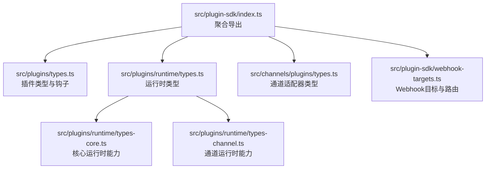
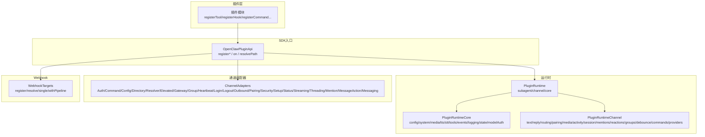
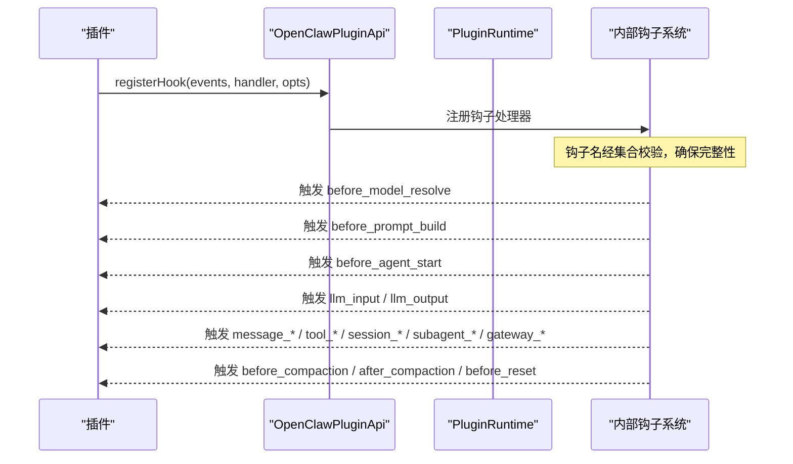
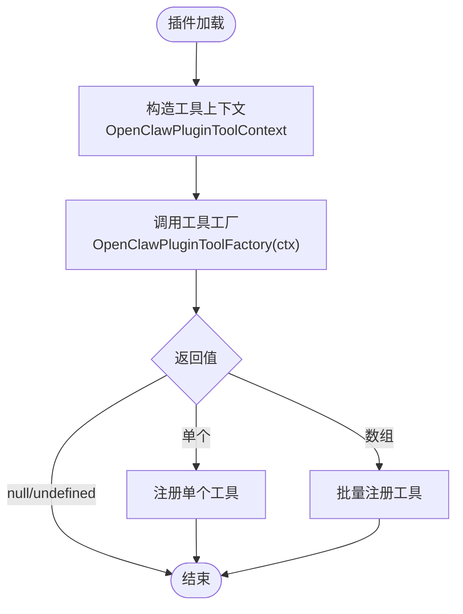
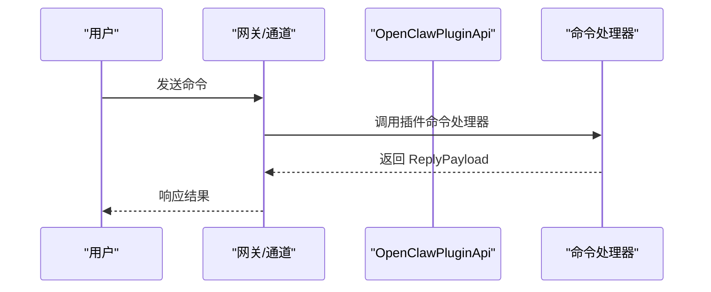
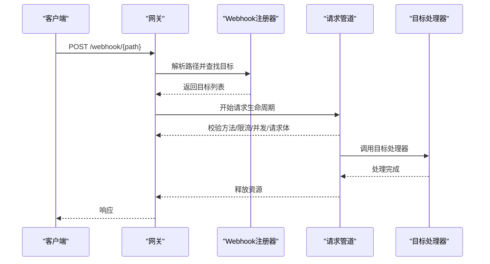
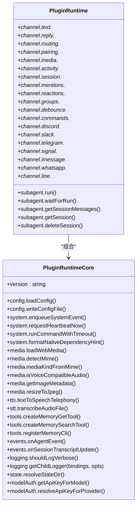
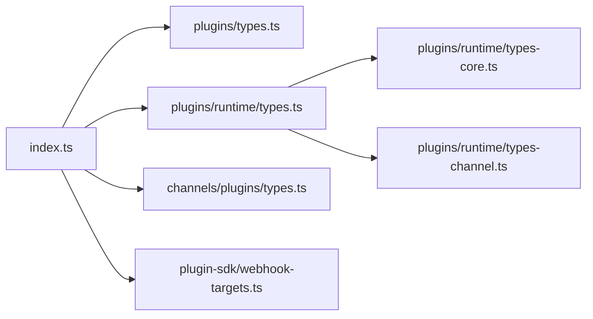

# 插件SDK

<cite>
**本文引用的文件**
- [src/plugin-sdk/index.ts](file://src/plugin-sdk/index.ts)
- [src/plugin-sdk/runtime.ts](file://src/plugin-sdk/runtime.ts)
- [src/plugins/types.ts](file://src/plugins/types.ts)
- [src/plugins/runtime/types.ts](file://src/plugins/runtime/types.ts)
- [src/plugins/runtime/types-core.ts](file://src/plugins/runtime/types-core.ts)
- [src/plugins/runtime/types-channel.ts](file://src/plugins/runtime/types-channel.ts)
- [src/channels/plugins/types.ts](file://src/channels/plugins/types.ts)
- [src/plugin-sdk/webhook-targets.ts](file://src/plugin-sdk/webhook-targets.ts)
</cite>

## 目录

1. [简介](#简介)
2. [项目结构](#项目结构)
3. [核心组件](#核心组件)
4. [架构总览](#架构总览)
5. [详细组件分析](#详细组件分析)
6. [依赖关系分析](#依赖关系分析)
7. [性能考量](#性能考量)
8. [故障排查指南](#故障排查指南)
9. [结论](#结论)
10. [附录](#附录)

## 简介

本文件为 OpenClaw 插件SDK的权威文档，面向插件开发者与维护者，系统性阐述插件生命周期、事件钩子、工具注册、HTTP/Webhook路由、通道适配器、运行时能力、配置与认证、打包与分发、版本管理、开发与调试、测试框架、安全沙箱与权限控制等主题。文档以TypeScript接口定义为核心，辅以流程图与时序图，帮助读者快速理解并高效构建稳定、可扩展、可维护的插件。

## 项目结构

插件SDK位于 src/plugin-sdk 与 src/plugins 下，围绕“API入口导出”“插件类型与钩子”“运行时能力”“通道适配器类型”“Webhook路由与安全”五大维度组织。核心入口导出文件负责聚合类型与工具函数，便于插件在统一命名空间下访问。

**图表来源**

- [src/plugin-sdk/index.ts:1-826](file://src/plugin-sdk/index.ts#L1-L826)
- [src/plugins/types.ts:1-893](file://src/plugins/types.ts#L1-L893)
- [src/plugins/runtime/types.ts:1-64](file://src/plugins/runtime/types.ts#L1-L64)
- [src/plugins/runtime/types-core.ts:1-68](file://src/plugins/runtime/types-core.ts#L1-L68)
- [src/plugins/runtime/types-channel.ts:1-166](file://src/plugins/runtime/types-channel.ts#L1-L166)
- [src/channels/plugins/types.ts:1-66](file://src/channels/plugins/types.ts#L1-L66)
- [src/plugin-sdk/webhook-targets.ts:1-282](file://src/plugin-sdk/webhook-targets.ts#L1-L282)

**章节来源**

- [src/plugin-sdk/index.ts:1-826](file://src/plugin-sdk/index.ts#L1-L826)
- [src/plugins/types.ts:1-893](file://src/plugins/types.ts#L1-L893)
- [src/plugins/runtime/types.ts:1-64](file://src/plugins/runtime/types.ts#L1-L64)
- [src/plugins/runtime/types-core.ts:1-68](file://src/plugins/runtime/types-core.ts#L1-L68)
- [src/plugins/runtime/types-channel.ts:1-166](file://src/plugins/runtime/types-channel.ts#L1-L166)
- [src/channels/plugins/types.ts:1-66](file://src/channels/plugins/types.ts#L1-L66)
- [src/plugin-sdk/webhook-targets.ts:1-282](file://src/plugin-sdk/webhook-targets.ts#L1-L282)

## 核心组件

- 插件API与入口导出：通过统一入口导出插件所需类型、运行时、通道适配器、Webhook工具、配置Schema、安全与网络策略等，便于插件按需引入。
- 插件类型与钩子：定义插件生命周期钩子、事件上下文、结果类型、工具注册、命令注册、服务注册、网关方法注册等。
- 运行时能力：提供系统命令执行、媒体处理、TTS/STT、内存工具、事件订阅、日志、状态目录解析、模型鉴权等能力。
- 通道适配器类型：抽象各渠道（Discord、Slack、Telegram、Signal、WhatsApp、iMessage、LINE）的认证、消息、群组、心跳、安全等适配器类型。
- Webhook路由与安全：提供Webhook目标注册、路径匹配、并发/速率限制、请求体限制、鉴权判定、单目标解析等能力。

**章节来源**

- [src/plugin-sdk/index.ts:1-826](file://src/plugin-sdk/index.ts#L1-L826)
- [src/plugins/types.ts:1-893](file://src/plugins/types.ts#L1-L893)
- [src/plugins/runtime/types.ts:1-64](file://src/plugins/runtime/types.ts#L1-L64)
- [src/plugins/runtime/types-core.ts:1-68](file://src/plugins/runtime/types-core.ts#L1-L68)
- [src/plugins/runtime/types-channel.ts:1-166](file://src/plugins/runtime/types-channel.ts#L1-L166)
- [src/channels/plugins/types.ts:1-66](file://src/channels/plugins/types.ts#L1-L66)
- [src/plugin-sdk/webhook-targets.ts:1-282](file://src/plugin-sdk/webhook-targets.ts#L1-L282)

## 架构总览

下图展示插件SDK在系统中的位置与交互：插件通过API入口注册工具、钩子、命令、服务、HTTP路由与通道适配器；运行时提供系统、媒体、TTS/STT、工具、事件、日志、状态、模型鉴权等能力；通道适配器抽象多渠道能力；Webhook路由模块负责HTTP入站请求的匹配与安全处理。

**图表来源**

- [src/plugin-sdk/index.ts:1-826](file://src/plugin-sdk/index.ts#L1-L826)
- [src/plugins/types.ts:1-893](file://src/plugins/types.ts#L1-L893)
- [src/plugins/runtime/types.ts:1-64](file://src/plugins/runtime/types.ts#L1-L64)
- [src/plugins/runtime/types-core.ts:1-68](file://src/plugins/runtime/types-core.ts#L1-L68)
- [src/plugins/runtime/types-channel.ts:1-166](file://src/plugins/runtime/types-channel.ts#L1-L166)
- [src/channels/plugins/types.ts:1-66](file://src/channels/plugins/types.ts#L1-L66)
- [src/plugin-sdk/webhook-targets.ts:1-282](file://src/plugin-sdk/webhook-targets.ts#L1-L282)

## 详细组件分析

### 插件生命周期与事件钩子

- 生命周期钩子名称集合与校验：提供只读的钩子名数组、集合与类型守卫，确保钩子名在编译期被覆盖完整。
- 钩子分类与事件上下文：
  - 模型与提示阶段：before_model_resolve、before_prompt_build、before_agent_start、llm_input、llm_output、agent_end
  - 会话阶段：session_start、session_end
  - 消息阶段：message_received、message_sending、message_sent
  - 工具阶段：before_tool_call、after_tool_call、tool_result_persist、before_message_write
  - 压缩与重置：before_compaction、after_compaction、before_reset
  - 子代理阶段：subagent_spawning、subagent_delivery_target、subagent_spawned、subagent_ended
  - 网关阶段：gateway_start、gateway_stop
- 钩子事件与结果类型：每个钩子均定义事件对象与可选结果对象，支持修改或阻断行为（如修改消息内容、阻断工具调用、阻断消息写入等）。
- 提示注入专用钩子：before_prompt_build、before_agent_start（兼容旧版），支持静态提示注入字段（prependSystemContext、appendSystemContext）以降低令牌成本。

**图表来源**

- [src/plugins/types.ts:321-394](file://src/plugins/types.ts#L321-L394)
- [src/plugins/types.ts:396-893](file://src/plugins/types.ts#L396-L893)

**章节来源**

- [src/plugins/types.ts:321-394](file://src/plugins/types.ts#L321-L394)
- [src/plugins/types.ts:396-893](file://src/plugins/types.ts#L396-L893)

### 工具注册与上下文

- 工具工厂与上下文：OpenClawPluginToolFactory 接受 OpenClawPluginToolContext，提供会话、消息通道、请求者身份、沙箱标记等上下文信息。
- 工具选项：支持命名、别名、可选等元数据，便于在不同渠道/界面中暴露一致的工具集。
- 工具注册：通过 OpenClawPluginApi.registerTool 完成注册，支持单个或多个工具返回。

**图表来源**

- [src/plugins/types.ts:58-83](file://src/plugins/types.ts#L58-L83)
- [src/plugins/types.ts:273-276](file://src/plugins/types.ts#L273-L276)

**章节来源**

- [src/plugins/types.ts:58-83](file://src/plugins/types.ts#L58-L83)
- [src/plugins/types.ts:273-276](file://src/plugins/types.ts#L273-L276)

### 命令注册与处理

- 命令定义：OpenClawPluginCommandDefinition 支持命令名、描述、是否接受参数、是否需要授权、原生命令映射（默认与特定渠道覆盖）、处理器。
- 命令上下文：PluginCommandContext 提供发送者标识、渠道、授权状态、原始参数、命令体、配置、账户、线程ID等。
- 处理流程：插件命令在LLM代理之前处理，适合状态切换、查询类简单命令。

**图表来源**

- [src/plugins/types.ts:146-203](file://src/plugins/types.ts#L146-L203)
- [src/plugins/types.ts:179-181](file://src/plugins/types.ts#L179-L181)

**章节来源**

- [src/plugins/types.ts:146-203](file://src/plugins/types.ts#L146-L203)
- [src/plugins/types.ts:179-181](file://src/plugins/types.ts#L179-L181)

### 服务与生命周期钩子

- 服务注册：OpenClawPluginService 定义 id/start/stop，通过 registerService 注册。
- 生命周期钩子：on(hookName, handler, opts) 提供优先级控制，用于在插件生命周期关键节点插入逻辑。

**章节来源**

- [src/plugins/types.ts:237-241](file://src/plugins/types.ts#L237-L241)
- [src/plugins/types.ts:300-305](file://src/plugins/types.ts#L300-L305)

### 网关方法与HTTP路由

- 网关方法注册：registerGatewayMethod(method, handler) 将自定义方法挂载到网关。
- HTTP路由注册：registerHttpRoute(params) 注册HTTP路由，支持认证模式（gateway/plugin）、匹配方式（exact/prefix）、替换策略。
- Webhook目标注册：registerWebhookTargetWithPluginRoute 与 registerWebhookTarget 将目标按路径聚合，并在首个目标出现时自动注册HTTP路由，在最后目标移除时清理路由。
- 请求管道：withResolvedWebhookRequestPipeline 统一处理方法允许、速率限制、并发限制、JSON请求体限制、鉴权与单目标解析。

**图表来源**

- [src/plugin-sdk/webhook-targets.ts:27-42](file://src/plugin-sdk/webhook-targets.ts#L27-L42)
- [src/plugin-sdk/webhook-targets.ts:102-162](file://src/plugin-sdk/webhook-targets.ts#L102-L162)
- [src/plugin-sdk/webhook-targets.ts:222-271](file://src/plugin-sdk/webhook-targets.ts#L222-L271)

**章节来源**

- [src/plugin-sdk/webhook-targets.ts:27-42](file://src/plugin-sdk/webhook-targets.ts#L27-L42)
- [src/plugin-sdk/webhook-targets.ts:102-162](file://src/plugin-sdk/webhook-targets.ts#L102-L162)
- [src/plugin-sdk/webhook-targets.ts:222-271](file://src/plugin-sdk/webhook-targets.ts#L222-L271)

### 通道适配器类型

- 适配器族：认证、命令、配置、目录、解析器、提升、网关、群组、心跳、登录/登出、消息、对外、配对、安全、设置、状态、流式、线程、提及、消息动作、消息、工具发送等。
- 核心类型：账户快照、状态、代理工具、能力、消息动作名、消息动作上下文、消息动作适配器、消息动作名枚举等。

**章节来源**

- [src/channels/plugins/types.ts:1-66](file://src/channels/plugins/types.ts#L1-L66)

### 运行时能力

- 核心运行时（PluginRuntimeCore）：提供配置读写、系统事件、心跳唤醒、命令执行、原生依赖提示、媒体加载与检测、语音/音频、图像元数据与压缩、STT转录、内存工具与CLI注册、代理事件与会话更新事件、日志级别与子日志器、状态目录解析、模型鉴权（按模型或提供商）。
- 子代理运行时（PluginRuntime.subagent）：run/waitForRun/getSessionMessages/getSession/deleteSession，支持幂等键、超时、会话隔离。
- 通道运行时（PluginRuntime.channel）：文本分块、Markdown表格、控制命令检测、回复派发、路由、配对、媒体下载与保存、活动记录、会话元数据、提及正则、反应确认、群组策略、去抖、命令授权、各渠道特有能力（Discord/Slack/Telegram/Signal/iMessage/WhatsApp/LINE）。

**图表来源**

- [src/plugins/runtime/types-core.ts:1-68](file://src/plugins/runtime/types-core.ts#L1-L68)
- [src/plugins/runtime/types.ts:51-63](file://src/plugins/runtime/types.ts#L51-L63)
- [src/plugins/runtime/types-channel.ts:16-166](file://src/plugins/runtime/types-channel.ts#L16-L166)

**章节来源**

- [src/plugins/runtime/types-core.ts:1-68](file://src/plugins/runtime/types-core.ts#L1-L68)
- [src/plugins/runtime/types.ts:51-63](file://src/plugins/runtime/types.ts#L51-L63)
- [src/plugins/runtime/types-channel.ts:16-166](file://src/plugins/runtime/types-channel.ts#L16-L166)

### 配置与认证

- 插件配置Schema：OpenClawPluginConfigSchema 支持 safeParse/parse/validate/uiHints/jsonSchema，便于插件提供配置校验与UI提示。
- Provider认证：ProviderAuthMethod 定义认证ID、标签、说明、种类（oauth/api_key/token/device_code/custom）、上下文（含配置、工作区、向导、运行时、远程、打开URL、OAuth处理器）与结果（凭据、配置补丁、默认模型、备注）。
- Provider插件：ProviderPlugin 包含ID、标签、文档路径、别名、环境变量、模型、认证方法、格式化API Key、刷新OAuth等。

**章节来源**

- [src/plugins/types.ts:44-56](file://src/plugins/types.ts#L44-L56)
- [src/plugins/types.ts:114-132](file://src/plugins/types.ts#L114-L132)
- [src/plugins/types.ts:122-132](file://src/plugins/types.ts#L122-L132)

### CLI与服务

- CLI注册：OpenClawPluginCliRegistrar 接收 Command、配置、工作区、日志器，用于注册插件命令。
- 服务：OpenClawPluginService 定义启动/停止，通过 registerService 注册。

**章节来源**

- [src/plugins/types.ts:221-228](file://src/plugins/types.ts#L221-L228)
- [src/plugins/types.ts:237-241](file://src/plugins/types.ts#L237-L241)

### 入口导出与工具

- 入口导出：index.ts 聚合导出插件类型、运行时、通道适配器、Webhook工具、配置Schema、安全与网络策略、SSRF策略、OAuth工具、临时路径、持久化去重、时间格式化、HTTP请求体限制、Webhook内存守卫等。
- 运行时包装：createLoggerBackedRuntime/resolveRuntimeEnv/resolveRuntimeEnvWithUnavailableExit 提供日志与退出封装。

**章节来源**

- [src/plugin-sdk/index.ts:1-826](file://src/plugin-sdk/index.ts#L1-L826)
- [src/plugin-sdk/runtime.ts:9-44](file://src/plugin-sdk/runtime.ts#L9-L44)

## 依赖关系分析

- 聚合导出：index.ts 作为唯一入口，集中导出类型与工具，避免插件分散导入。
- 类型耦合：插件类型与钩子强依赖于运行时类型；通道适配器类型独立于运行时，但通过运行时的 channel.\* 能力间接使用。
- Webhook模块：与HTTP注册器、速率限制器、并发限制器、请求体限制器、SSRF策略等存在直接依赖。

**图表来源**

- [src/plugin-sdk/index.ts:1-826](file://src/plugin-sdk/index.ts#L1-L826)
- [src/plugins/types.ts:1-893](file://src/plugins/types.ts#L1-L893)
- [src/plugins/runtime/types.ts:1-64](file://src/plugins/runtime/types.ts#L1-L64)
- [src/plugins/runtime/types-core.ts:1-68](file://src/plugins/runtime/types-core.ts#L1-L68)
- [src/plugins/runtime/types-channel.ts:1-166](file://src/plugins/runtime/types-channel.ts#L1-L166)
- [src/channels/plugins/types.ts:1-66](file://src/channels/plugins/types.ts#L1-L66)
- [src/plugin-sdk/webhook-targets.ts:1-282](file://src/plugin-sdk/webhook-targets.ts#L1-L282)

**章节来源**

- [src/plugin-sdk/index.ts:1-826](file://src/plugin-sdk/index.ts#L1-L826)
- [src/plugins/types.ts:1-893](file://src/plugins/types.ts#L1-L893)
- [src/plugins/runtime/types.ts:1-64](file://src/plugins/runtime/types.ts#L1-L64)
- [src/plugins/runtime/types-core.ts:1-68](file://src/plugins/runtime/types-core.ts#L1-L68)
- [src/plugins/runtime/types-channel.ts:1-166](file://src/plugins/runtime/types-channel.ts#L1-L166)
- [src/channels/plugins/types.ts:1-66](file://src/channels/plugins/types.ts#L1-L66)
- [src/plugin-sdk/webhook-targets.ts:1-282](file://src/plugin-sdk/webhook-targets.ts#L1-L282)

## 性能考量

- 钩子结果字段白名单：before_prompt_build 的提示注入字段（prependSystemContext、appendSystemContext）建议用于静态引导，避免每轮对话重复注入，降低令牌成本。
- 子代理会话隔离：通过 sessionId/sessionKey 实现会话隔离，结合幂等键与超时控制，减少重复计算与资源占用。
- 媒体与语音处理：优先使用媒体缓存与检测，避免重复下载与格式转换；图像压缩与语音兼容性检查可减少传输与播放开销。
- 并发与速率限制：Webhook请求的并发限制与速率限制器配合使用，防止突发流量导致资源耗尽。
- 日志与诊断：getChildLogger 支持结构化日志与级别控制，有助于定位性能瓶颈。

[本节为通用指导，无需列出具体文件来源]

## 故障排查指南

- Webhook鉴权失败：使用 resolveWebhookTargetWithAuthOrReject 或 resolveWebhookTargetWithAuthOrRejectSync 判定目标唯一性与鉴权，根据返回状态码与消息定位问题。
- 单目标歧义：当多个目标匹配同一路径时返回歧义错误，需检查目标唯一性与匹配条件。
- 方法不被允许：rejectNonPostWebhookRequest 会在非POST方法时返回405，需调整请求方法。
- 请求体过大或类型不符：利用请求体限制与JSON解析工具进行校验，避免异常输入导致崩溃。
- 运行时退出不可用：resolveRuntimeEnvWithUnavailableExit 可在运行时退出不可用时抛出带不可用提示的错误，便于上层捕获与降级。

**章节来源**

- [src/plugin-sdk/webhook-targets.ts:222-271](file://src/plugin-sdk/webhook-targets.ts#L222-L271)
- [src/plugin-sdk/webhook-targets.ts:273-281](file://src/plugin-sdk/webhook-targets.ts#L273-L281)
- [src/plugin-sdk/runtime.ts:34-44](file://src/plugin-sdk/runtime.ts#L34-L44)

## 结论

OpenClaw 插件SDK以清晰的类型体系与完备的运行时能力为基础，提供了从生命周期钩子、工具与命令注册、HTTP/Webhook路由、通道适配器到安全与网络策略的全栈支持。遵循本文档的接口定义、开发规范与最佳实践，可显著提升插件的稳定性、可维护性与性能表现。

[本节为总结性内容，无需列出具体文件来源]

## 附录

### 开发环境与调试

- 使用 OpenClawPluginApi.resolvePath 获取插件内资源路径，确保跨平台一致性。
- 通过 RuntimeEnv 的日志与退出封装，实现可控的调试输出与错误传播。
- 使用 getChildLogger 构建结构化日志，便于问题追踪与性能分析。

**章节来源**

- [src/plugins/types.ts:299](file://src/plugins/types.ts#L299)
- [src/plugin-sdk/runtime.ts:9-44](file://src/plugin-sdk/runtime.ts#L9-L44)
- [src/plugins/runtime/types-core.ts:47-50](file://src/plugins/runtime/types-core.ts#L47-L50)

### 测试框架与模板

- 建议基于插件的工具、命令、钩子与Webhook处理器编写单元与集成测试，覆盖正常路径与边界条件。
- 使用插件运行时提供的媒体、TTS/STT、命令执行等能力进行端到端验证。
- 对通道适配器的鉴权、消息发送、群组策略等关键路径进行模拟与断言。

[本节为通用指导，无需列出具体文件来源]

### 打包、分发与版本管理

- 插件定义中的 id/name/version/kind 字段用于标识与版本管理，建议遵循语义化版本。
- 通过 registerService/registerCommand/registerGatewayMethod/registerHttpRoute/registerHook/registerTool 等API完成插件功能注册，确保发布前的功能完备性与兼容性。

**章节来源**

- [src/plugins/types.ts:248-257](file://src/plugins/types.ts#L248-L257)
- [src/plugins/types.ts:273-293](file://src/plugins/types.ts#L273-L293)

### 安全沙箱、权限控制与资源限制

- Webhook请求的速率限制、并发限制、请求体大小限制与方法校验，防止滥用与资源耗尽。
- SSRF防护与HTTPS允许列表策略，限制对外部主机的访问范围。
- 通道侧的群组策略、DM策略、提及要求与命令授权，确保仅授权用户可触发敏感操作。
- 运行时退出不可用时的错误封装，便于上层进行降级与恢复。

**章节来源**

- [src/plugin-sdk/webhook-targets.ts:115-162](file://src/plugin-sdk/webhook-targets.ts#L115-L162)
- [src/plugin-sdk/index.ts:440-471](file://src/plugin-sdk/index.ts#L440-L471)
- [src/plugin-sdk/index.ts:236-248](file://src/plugin-sdk/index.ts#L236-L248)
