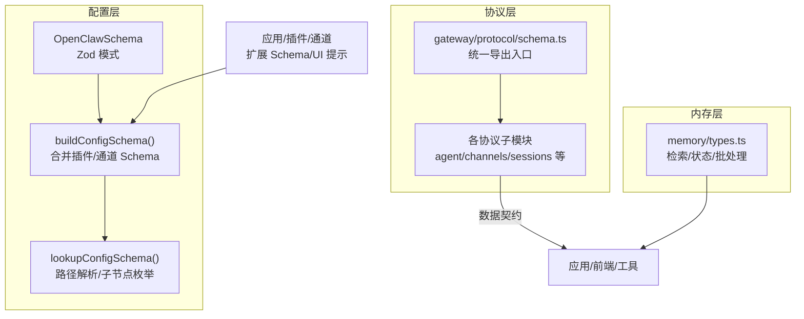
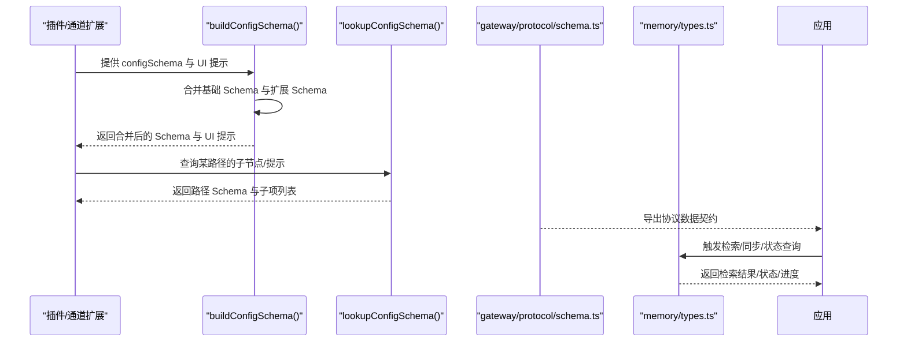
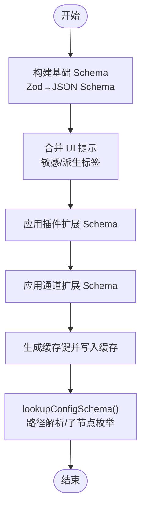
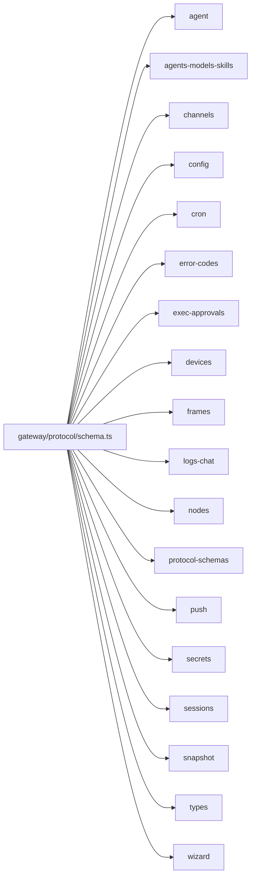
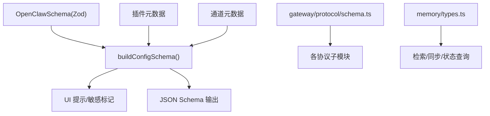

# 数据模型

<cite>
**本文引用的文件**
- [src/config/schema.ts](file://src/config/schema.ts)
- [src/gateway/protocol/schema.ts](file://src/gateway/protocol/schema.ts)
- [src/memory/types.ts](file://src/memory/types.ts)
</cite>

## 目录

1. [引言](#引言)
2. [项目结构](#项目结构)
3. [核心组件](#核心组件)
4. [架构总览](#架构总览)
5. [详细组件分析](#详细组件分析)
6. [依赖分析](#依赖分析)
7. [性能考虑](#性能考虑)
8. [故障排查指南](#故障排查指南)
9. [结论](#结论)
10. [附录](#附录)

## 引言

本文件面向数据建模与工程实践，系统梳理 OpenClaw 项目中的数据结构、实体关系、字段定义与约束，并结合 TypeScript 接口、Zod 验证模式以及协议 Schema 的组织方式，给出数据字典、流转与转换规则、序列化格式、配置模式、模板结构、枚举定义、验证示例、错误处理与迁移策略，同时覆盖数据安全、隐私保护与访问控制要点。内容以仓库现有实现为依据，避免臆测。

## 项目结构

围绕“配置 Schema 生成”“网关协议 Schema 导出”“内存与检索类型”三大维度，形成数据模型的主干：

- 配置层：通过 Zod 模式构建基础 JSON Schema，并动态合并插件与通道的扩展 Schema 与 UI 提示，支持路径查找、子节点枚举与敏感信息标记。
- 协议层：集中导出多类协议 Schema（如代理、会话、设备、日志等），作为跨进程/跨模块通信的数据契约。
- 内存层：定义检索结果、同步进度、向量/全文索引状态、批处理参数等运行时数据结构。



图表来源

- [src/config/schema.ts:449-484](file://src/config/schema.ts#L449-L484)
- [src/gateway/protocol/schema.ts:1-19](file://src/gateway/protocol/schema.ts#L1-L19)
- [src/memory/types.ts:1-81](file://src/memory/types.ts#L1-L81)

章节来源

- [src/config/schema.ts:1-712](file://src/config/schema.ts#L1-L712)
- [src/gateway/protocol/schema.ts:1-19](file://src/gateway/protocol/schema.ts#L1-L19)
- [src/memory/types.ts:1-81](file://src/memory/types.ts#L1-L81)

## 核心组件

- 配置 Schema 生成器：负责将 Zod 模式转为 JSON Schema，注入 UI 提示、敏感标记、派生标签；支持按插件与通道扩展 Schema 并缓存合并结果；提供路径查找与子节点枚举能力。
- 协议 Schema 统一导出：集中导出代理、会话、设备、日志、节点、技能、设备帧等协议数据结构，作为跨模块通信契约。
- 内存与检索类型：定义检索结果、同步进度、向量/全文索引状态、批处理参数等，支撑知识检索与内存管理。

章节来源

- [src/config/schema.ts:449-484](file://src/config/schema.ts#L449-L484)
- [src/gateway/protocol/schema.ts:1-19](file://src/gateway/protocol/schema.ts#L1-L19)
- [src/memory/types.ts:1-81](file://src/memory/types.ts#L1-L81)

## 架构总览

下图展示“配置 Schema 合并—路径解析—协议 Schema 使用—内存类型交互”的整体数据流。



图表来源

- [src/config/schema.ts:449-484](file://src/config/schema.ts#L449-L484)
- [src/config/schema.ts:678-711](file://src/config/schema.ts#L678-L711)
- [src/gateway/protocol/schema.ts:1-19](file://src/gateway/protocol/schema.ts#L1-L19)
- [src/memory/types.ts:1-81](file://src/memory/types.ts#L1-L81)

## 详细组件分析

### 配置 Schema 生成器（Zod → JSON Schema）

- 基础能力
  - 将 Zod 模式转换为 JSON Schema Draft-07，附加标题与版本信息。
  - 支持对敏感路径进行标记与派生标签增强，便于 UI 层隐藏或特殊处理。
  - 提供路径规范化、分段解析、通配符匹配、子节点枚举等能力。
- 扩展机制
  - 插件扩展：在 plugins.entries 下为每个插件生成条目 Schema，并与基础 config 合并。
  - 通道扩展：在 channels 下为每个通道合并其 configSchema。
  - UI 提示：支持为插件/通道注入 label/help/tags/advanced/sensitive 等提示。
- 缓存策略
  - 对插件与通道集合构建哈希键，限制缓存数量，避免内存膨胀。
- 路径查找
  - 支持数组索引与通配符路径，返回当前节点 Schema 的精简投影（仅保留可表示的关键元数据）及子节点列表。



图表来源

- [src/config/schema.ts:429-447](file://src/config/schema.ts#L429-L447)
- [src/config/schema.ts:449-484](file://src/config/schema.ts#L449-L484)
- [src/config/schema.ts:678-711](file://src/config/schema.ts#L678-L711)

章节来源

- [src/config/schema.ts:1-712](file://src/config/schema.ts#L1-L712)

### 协议 Schema 统一导出（数据契约）

- 导出清单（按文件组织）
  - 代理：agent
  - 代理/模型/技能：agents-models-skills
  - 通道：channels
  - 配置：config
  - 定时任务：cron
  - 错误码：error-codes
  - 执行审批：exec-approvals
  - 设备：devices
  - 帧：frames
  - 日志聊天：logs-chat
  - 节点：nodes
  - 协议模式：protocol-schemas
  - 推送：push
  - 密钥：secrets
  - 会话：sessions
  - 快照：snapshot
  - 类型：types
  - 向导：wizard
- 作用
  - 作为跨模块/进程通信的数据契约，确保发送方与接收方对消息结构达成一致。
  - 便于生成类型定义、校验请求/响应、驱动 UI 表单与文档。



图表来源

- [src/gateway/protocol/schema.ts:1-19](file://src/gateway/protocol/schema.ts#L1-L19)

章节来源

- [src/gateway/protocol/schema.ts:1-19](file://src/gateway/protocol/schema.ts#L1-L19)

### 内存与检索类型（运行时数据）

- 检索结果
  - 字段：路径、起止行号、相似度分数、片段、来源、引用（可选）。
  - 来源：内存/会话。
- 嵌入探测结果
  - 字段：是否可用、错误原因（可选）。
- 同步进度更新
  - 字段：已完成、总数、标签（可选）。
- Provider 状态
  - 字段：后端类型、提供者名称、模型、请求提供者、文件数、块数、脏状态、工作区目录、数据库路径、额外路径、来源列表、来源计数、缓存、全文索引、向量、批处理、自定义扩展。
- 检索管理器接口
  - 方法：搜索、读取文件、状态查询、同步（可选）、嵌入/向量可用性探测、关闭（可选）。

```mermaid
classDiagram
class MemorySearchResult {
+string path
+number startLine
+number endLine
+number score
+string snippet
+string source
+string citation
}
class MemoryEmbeddingProbeResult {
+boolean ok
+string error
}
class MemorySyncProgressUpdate {
+number completed
+number total
+string label
}
class MemoryProviderStatus {
+string backend
+string provider
+string model
+string requestedProvider
+number files
+number chunks
+boolean dirty
+string workspaceDir
+string dbPath
+string[] extraPaths
+string[] sources
+object[] sourceCounts
+object cache
+object fts
+object fallback
+object vector
+object batch
+Record~string,unknown~ custom
}
class MemorySearchManager {
+search(query, opts) MemorySearchResult[]
+readFile(params) {text,path}
+status() MemoryProviderStatus
+sync(params) void
+probeEmbeddingAvailability() MemoryEmbeddingProbeResult
+probeVectorAvailability() boolean
+close() void
}
MemorySearchManager --> MemorySearchResult : "返回"
MemorySearchManager --> MemoryEmbeddingProbeResult : "返回"
MemorySearchManager --> MemorySyncProgressUpdate : "回调"
MemorySearchManager --> MemoryProviderStatus : "返回"
```

图表来源

- [src/memory/types.ts:3-11](file://src/memory/types.ts#L3-L11)
- [src/memory/types.ts:13-16](file://src/memory/types.ts#L13-L16)
- [src/memory/types.ts:18-22](file://src/memory/types.ts#L18-L22)
- [src/memory/types.ts:24-59](file://src/memory/types.ts#L24-L59)
- [src/memory/types.ts:61-80](file://src/memory/types.ts#L61-L80)

章节来源

- [src/memory/types.ts:1-81](file://src/memory/types.ts#L1-L81)

## 依赖分析

- 配置层
  - 依赖 Zod 模式（由 OpenClawSchema 提供）与 UI 提示映射工具，输出 JSON Schema 与 UI 提示。
  - 通过插件与通道元数据动态扩展 Schema，并缓存合并结果。
- 协议层
  - 作为统一出口，聚合多类协议子模块，供上层应用消费。
- 内存层
  - 与检索/同步/状态查询等运行时流程耦合，向上游提供稳定的数据结构契约。



图表来源

- [src/config/schema.ts:449-484](file://src/config/schema.ts#L449-L484)
- [src/gateway/protocol/schema.ts:1-19](file://src/gateway/protocol/schema.ts#L1-L19)
- [src/memory/types.ts:1-81](file://src/memory/types.ts#L1-L81)

章节来源

- [src/config/schema.ts:1-712](file://src/config/schema.ts#L1-L712)
- [src/gateway/protocol/schema.ts:1-19](file://src/gateway/protocol/schema.ts#L1-L19)
- [src/memory/types.ts:1-81](file://src/memory/types.ts#L1-L81)

## 性能考虑

- 配置 Schema 合并
  - 使用哈希键缓存合并结果，限制最大缓存条目，避免重复计算与内存占用。
  - 路径解析支持通配符与数组索引，但限制最大路径段数，防止过深解析导致性能问题。
- 内存检索
  - 批处理参数（并发、等待、轮询间隔、超时、失败计数）用于平衡吞吐与稳定性。
  - 向量/全文索引状态与可用性探测，有助于在不可用时降级或回退。

章节来源

- [src/config/schema.ts:352-406](file://src/config/schema.ts#L352-L406)
- [src/config/schema.ts:486-549](file://src/config/schema.ts#L486-L549)
- [src/memory/types.ts:47-57](file://src/memory/types.ts#L47-L57)

## 故障排查指南

- 配置 Schema 查找
  - 若路径不存在或非法（如超过最大段数、包含禁止段名），返回空结果。
  - 子节点枚举基于 properties/additionalProperties/items 判定，若无子节点则为空列表。
- 内存检索
  - 嵌入/向量探测失败时，检查向量化扩展加载错误与维度信息。
  - 全文索引状态包含可用性与错误信息，批处理状态包含最近一次错误与提供者。
- 协议一致性
  - 确保发送方与接收方使用同一版本的协议导出入口，避免字段缺失或类型不匹配。

章节来源

- [src/config/schema.ts:486-549](file://src/config/schema.ts#L486-L549)
- [src/config/schema.ts:538-586](file://src/config/schema.ts#L538-L586)
- [src/memory/types.ts:40-59](file://src/memory/types.ts#L40-L59)

## 结论

本数据模型文档基于仓库现有实现，明确了配置 Schema 的生成与扩展机制、协议数据契约的组织方式、以及内存检索的运行时数据结构。通过路径查找、子节点枚举与状态探测，系统在保证灵活性的同时提供了可观测性与可维护性。建议在后续迭代中持续完善字段约束、错误码与迁移策略，以进一步提升数据一致性与安全性。

## 附录

- 数据字典与字段类型
  - 配置 Schema
    - 基础：JSON Schema Draft-07，含标题与版本。
    - 扩展：插件 entries 与通道 channels 的对象属性合并。
    - UI 提示：label/help/tags/advanced/sensitive/placeholder 等。
  - 协议 Schema
    - 涵盖代理、会话、设备、日志、节点、技能、推送、密钥、快照、类型、向导等子模块。
  - 内存类型
    - 检索结果、嵌入探测、同步进度、Provider 状态、检索管理器接口。
- 验证与序列化
  - 配置层：Zod 模式到 JSON Schema 的转换，配合 UI 提示与敏感标记。
  - 协议层：统一导出，确保跨模块一致性。
  - 内存层：对象结构清晰，便于序列化与反序列化。
- 迁移策略
  - 配置 Schema 合并采用缓存键与增量哈希，避免全量重建。
  - 协议层保持导出入口稳定，新增字段以可选方式推进。
  - 内存层通过状态字段与探测方法，平滑过渡到新能力。
- 安全与隐私
  - 配置层对敏感路径进行标记与派生标签增强，便于 UI 层隐藏或特殊处理。
  - 协议层与内存层遵循最小暴露原则，仅传输必要字段。
