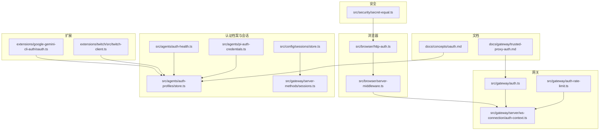
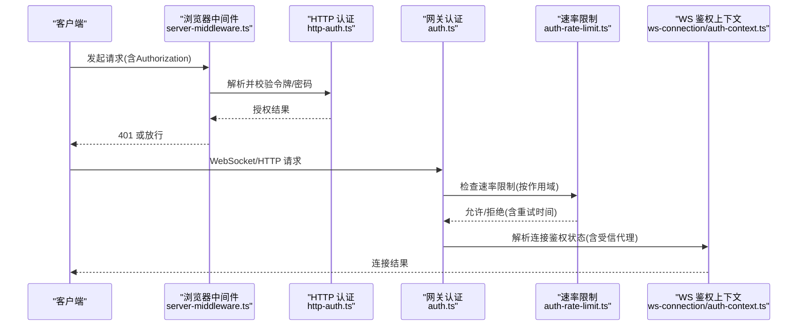
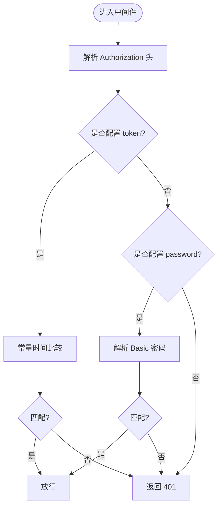
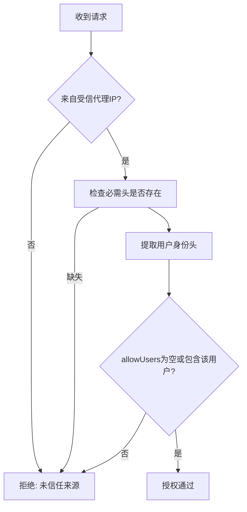
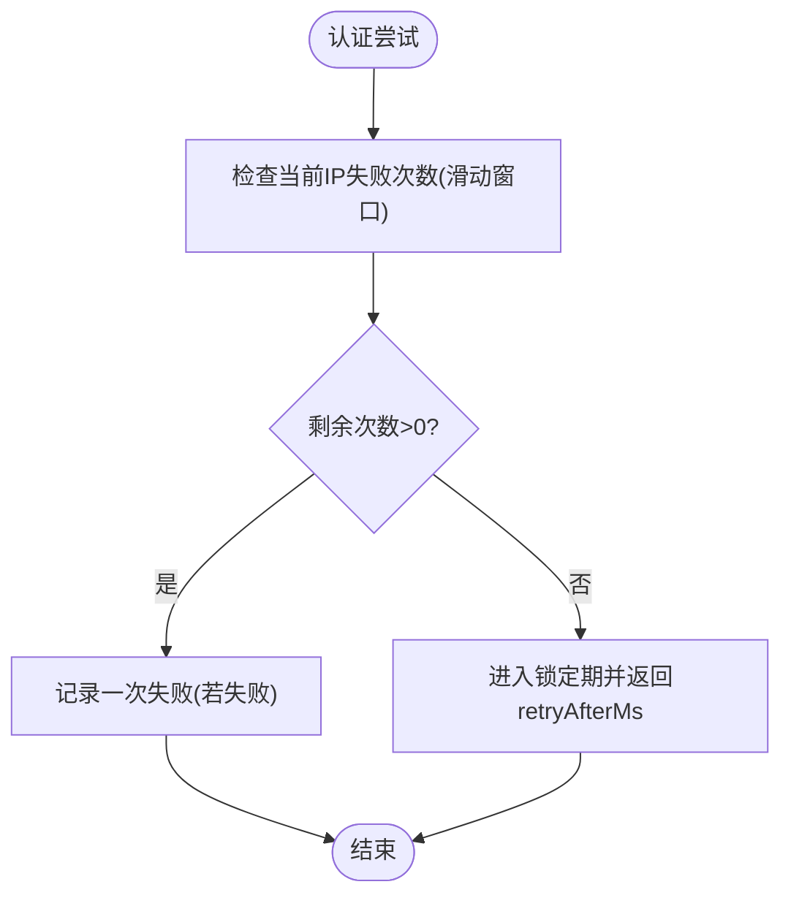
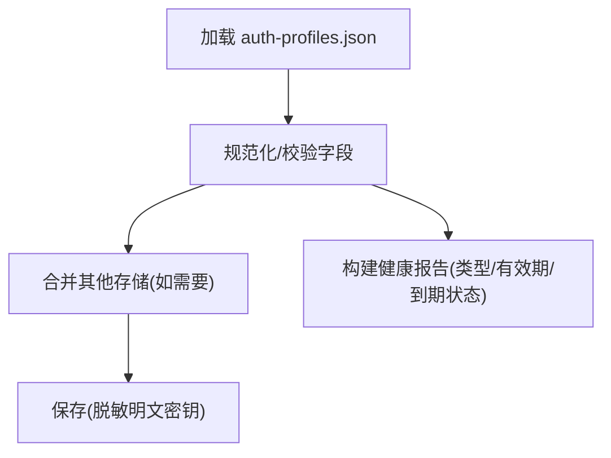
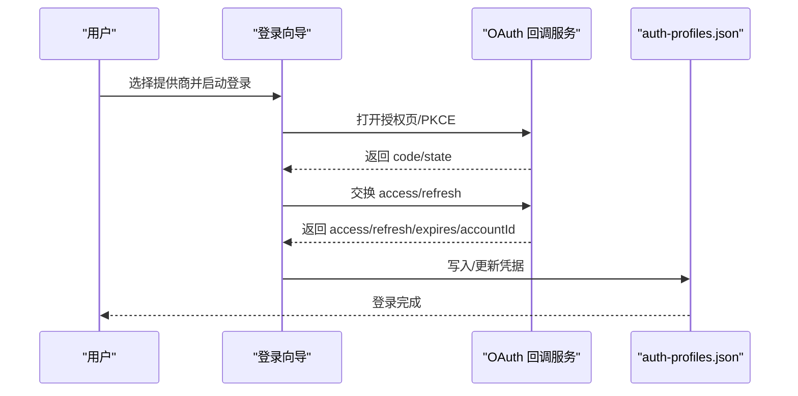
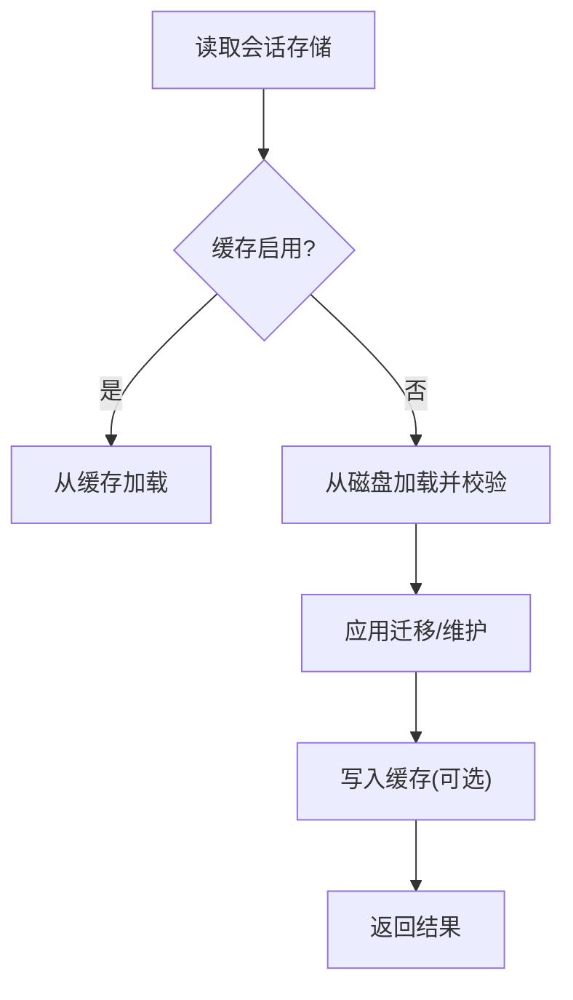
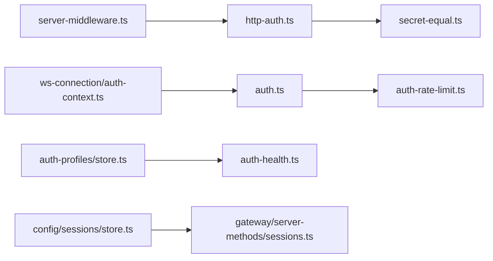

# 认证与授权

<cite>
**本文引用的文件**   
- [docs/concepts/oauth.md](file://docs/concepts/oauth.md)
- [src/browser/http-auth.ts](file://src/browser/http-auth.ts)
- [src/browser/server-middleware.ts](file://src/browser/server-middleware.ts)
- [src/security/secret-equal.ts](file://src/security/secret-equal.ts)
- [src/agents/auth-health.ts](file://src/agents/auth-health.ts)
- [src/agents/auth-profiles/store.ts](file://src/agents/auth-profiles/store.ts)
- [src/agents/pi-auth-credentials.ts](file://src/agents/pi-auth-credentials.ts)
- [src/gateway/auth.ts](file://src/gateway/auth.ts)
- [docs/gateway/trusted-proxy-auth.md](file://docs/gateway/trusted-proxy-auth.md)
- [src/gateway/auth-rate-limit.ts](file://src/gateway/auth-rate-limit.ts)
- [src/gateway/auth-rate-limit.test.ts](file://src/gateway/auth-rate-limit.test.ts)
- [src/gateway/server/ws-connection/auth-context.ts](file://src/gateway/server/ws-connection/auth-context.ts)
- [src/config/sessions/store.ts](file://src/config/sessions/store.ts)
- [src/gateway/server-methods/sessions.ts](file://src/gateway/server-methods/sessions.ts)
- [extensions/google-gemini-cli-auth/oauth.ts](file://extensions/google-gemini-cli-auth/oauth.ts)
- [extensions/twitch/src/twitch-client.ts](file://extensions/twitch/src/twitch-client.ts)
</cite>

## 目录

1. [简介](#简介)
2. [项目结构](#项目结构)
3. [核心组件](#核心组件)
4. [架构总览](#架构总览)
5. [详细组件分析](#详细组件分析)
6. [依赖关系分析](#依赖关系分析)
7. [性能考量](#性能考量)
8. [故障排查指南](#故障排查指南)
9. [结论](#结论)
10. [附录](#附录)

## 简介

本文件系统化梳理 OpenClaw 的认证与授权体系，覆盖身份验证机制、授权策略、令牌管理、会话与权限模型、OAuth 流程、API 密钥管理、双因素认证现状与替代方案、角色与权限矩阵、访问控制列表、安全最佳实践、漏洞防护、审计日志、认证失败处理与重试策略、账户锁定机制、跨域认证、代理认证与信任链管理等。内容以仓库现有实现与文档为准，并辅以可视化图示帮助理解。

## 项目结构

围绕认证与授权的关键目录与文件：

- 文档层：OAuth 概念、受信代理认证等文档
- 浏览器侧：HTTP 认证解析与中间件
- 安全工具：安全比较函数
- 凭据与会话：认证档案存储、健康检查、PI 凭据映射
- 网关层：受信代理认证、速率限制、WebSocket 连接鉴权上下文
- 扩展：OAuth 回调等待、令牌刷新

**图表来源**

- [docs/concepts/oauth.md:1-159](file://docs/concepts/oauth.md#L1-L159)
- [docs/gateway/trusted-proxy-auth.md:1-330](file://docs/gateway/trusted-proxy-auth.md#L1-L330)
- [src/browser/http-auth.ts:1-48](file://src/browser/http-auth.ts#L1-L48)
- [src/browser/server-middleware.ts:1-37](file://src/browser/server-middleware.ts#L1-L37)
- [src/security/secret-equal.ts:1-13](file://src/security/secret-equal.ts#L1-L13)
- [src/agents/auth-health.ts:98-163](file://src/agents/auth-health.ts#L98-L163)
- [src/agents/auth-profiles/store.ts:188-509](file://src/agents/auth-profiles/store.ts#L188-L509)
- [src/agents/pi-auth-credentials.ts:39-88](file://src/agents/pi-auth-credentials.ts#L39-L88)
- [src/config/sessions/store.ts:46-305](file://src/config/sessions/store.ts#L46-L305)
- [src/gateway/auth.ts:331-372](file://src/gateway/auth.ts#L331-L372)
- [src/gateway/auth-rate-limit.ts:1-23](file://src/gateway/auth-rate-limit.ts#L1-L23)
- [src/gateway/server/ws-connection/auth-context.ts:75-122](file://src/gateway/server/ws-connection/auth-context.ts#L75-L122)
- [extensions/google-gemini-cli-auth/oauth.ts:305-344](file://extensions/google-gemini-cli-auth/oauth.ts#L305-L344)
- [extensions/twitch/src/twitch-client.ts:34-72](file://extensions/twitch/src/twitch-client.ts#L34-L72)

**章节来源**

- [docs/concepts/oauth.md:1-159](file://docs/concepts/oauth.md#L1-L159)
- [docs/gateway/trusted-proxy-auth.md:1-330](file://docs/gateway/trusted-proxy-auth.md#L1-L330)
- [src/browser/http-auth.ts:1-48](file://src/browser/http-auth.ts#L1-L48)
- [src/browser/server-middleware.ts:1-37](file://src/browser/server-middleware.ts#L1-L37)
- [src/security/secret-equal.ts:1-13](file://src/security/secret-equal.ts#L1-L13)
- [src/agents/auth-health.ts:98-163](file://src/agents/auth-health.ts#L98-L163)
- [src/agents/auth-profiles/store.ts:188-509](file://src/agents/auth-profiles/store.ts#L188-L509)
- [src/agents/pi-auth-credentials.ts:39-88](file://src/agents/pi-auth-credentials.ts#L39-L88)
- [src/config/sessions/store.ts:46-305](file://src/config/sessions/store.ts#L46-L305)
- [src/gateway/auth.ts:331-372](file://src/gateway/auth.ts#L331-L372)
- [src/gateway/auth-rate-limit.ts:1-23](file://src/gateway/auth-rate-limit.ts#L1-L23)
- [src/gateway/server/ws-connection/auth-context.ts:75-122](file://src/gateway/server/ws-connection/auth-context.ts#L75-L122)
- [extensions/google-gemini-cli-auth/oauth.ts:305-344](file://extensions/google-gemini-cli-auth/oauth.ts#L305-L344)
- [extensions/twitch/src/twitch-client.ts:34-72](file://extensions/twitch/src/twitch-client.ts#L34-L72)

## 核心组件

- 浏览器请求认证：解析 Authorization 头（Bearer/Basic），进行安全常量时间比较
- 受信代理认证：基于反向代理传递的身份头进行授权，支持白名单用户与必需头校验
- 速率限制：滑动窗口计数，支持设备令牌与共享密钥两类作用域
- 认证档案存储：统一的 OAuth/API Key 存储与合并、序列化与脱敏保存
- 会话存储：带 TTL 缓存、维护与清理
- OAuth 流程：PKCE 令牌交换、回调接收、刷新与过期管理
- 健康检查：凭据类型识别、有效期评估、到期状态判定

**章节来源**

- [src/browser/http-auth.ts:1-48](file://src/browser/http-auth.ts#L1-L48)
- [src/gateway/auth.ts:331-372](file://src/gateway/auth.ts#L331-L372)
- [src/gateway/auth-rate-limit.ts:1-23](file://src/gateway/auth-rate-limit.ts#L1-L23)
- [src/agents/auth-profiles/store.ts:188-509](file://src/agents/auth-profiles/store.ts#L188-L509)
- [src/config/sessions/store.ts:46-305](file://src/config/sessions/store.ts#L46-L305)
- [docs/concepts/oauth.md:83-122](file://docs/concepts/oauth.md#L83-L122)
- [src/agents/auth-health.ts:98-163](file://src/agents/auth-health.ts#L98-L163)

## 架构总览

下图展示从浏览器到网关的认证路径，包括受信代理模式与速率限制协同工作。

**图表来源**

- [src/browser/server-middleware.ts:24-37](file://src/browser/server-middleware.ts#L24-L37)
- [src/browser/http-auth.ts:37-48](file://src/browser/http-auth.ts#L37-L48)
- [src/gateway/auth.ts:331-372](file://src/gateway/auth.ts#L331-L372)
- [src/gateway/auth-rate-limit.ts:1-23](file://src/gateway/auth-rate-limit.ts#L1-L23)
- [src/gateway/server/ws-connection/auth-context.ts:75-122](file://src/gateway/server/ws-connection/auth-context.ts#L75-L122)

## 详细组件分析

### 浏览器请求认证与中间件

- 中间件安装：统一 JSON 解析、CSRF 保护、请求中断信号注入
- 认证中间件：根据配置的 token/password 对 Authorization 头进行校验；不匹配返回 401
- 安全比较：使用常量时间哈希比较，避免时序攻击

**图表来源**

- [src/browser/server-middleware.ts:6-37](file://src/browser/server-middleware.ts#L6-L37)
- [src/browser/http-auth.ts:8-48](file://src/browser/http-auth.ts#L8-L48)
- [src/security/secret-equal.ts:3-12](file://src/security/secret-equal.ts#L3-L12)

**章节来源**

- [src/browser/server-middleware.ts:1-37](file://src/browser/server-middleware.ts#L1-L37)
- [src/browser/http-auth.ts:1-48](file://src/browser/http-auth.ts#L1-L48)
- [src/security/secret-equal.ts:1-13](file://src/security/secret-equal.ts#L1-L13)

### 受信代理认证与信任链

- 工作机理：仅接受来自 trustedProxies 列表的请求；从 userHeader 提取身份；可选 requiredHeaders 与 allowUsers 白名单
- 控制界面配对行为：启用后，控制 UI 的 WebSocket 可在满足受信代理条件时无需设备配对
- 安全检查清单：代理必须是唯一入口、仅配置实际代理 IP、代理需覆盖转发头、TLS 终结于代理、建议设置 allowUsers

**图表来源**

- [src/gateway/auth.ts:335-372](file://src/gateway/auth.ts#L335-L372)
- [docs/gateway/trusted-proxy-auth.md:30-76](file://docs/gateway/trusted-proxy-auth.md#L30-L76)

**章节来源**

- [src/gateway/auth.ts:331-372](file://src/gateway/auth.ts#L331-L372)
- [docs/gateway/trusted-proxy-auth.md:1-330](file://docs/gateway/trusted-proxy-auth.md#L1-L330)

### 速率限制与账户锁定

- 作用域：设备令牌与共享密钥两类独立计数
- 窗口：滑动窗口统计失败次数，超过阈值进入锁定期并返回重试时间
- 回环豁免：默认对 127.0.0.1/::1 豁免，避免本地 CLI 被锁
- 单元测试覆盖：允许/拒绝、锁定期、窗口过期、回环豁免、重置

**图表来源**

- [src/gateway/auth-rate-limit.ts:1-23](file://src/gateway/auth-rate-limit.ts#L1-L23)
- [src/gateway/auth-rate-limit.test.ts:18-146](file://src/gateway/auth-rate-limit.test.ts#L18-L146)

**章节来源**

- [src/gateway/auth-rate-limit.ts:1-23](file://src/gateway/auth-rate-limit.ts#L1-L23)
- [src/gateway/auth-rate-limit.test.ts:1-146](file://src/gateway/auth-rate-limit.test.ts#L1-L146)

### 认证档案存储与健康检查

- 存储结构：版本化 JSON，支持 profiles、order、lastGood、usageStats；保存时对明文密钥进行脱敏
- 合并与加载：支持合并多个存储，加载时进行字段校验与拒绝条目警告
- 健康检查：区分 api_key/token/oauth，评估有效期、到期状态，输出剩余毫秒与原因码

**图表来源**

- [src/agents/auth-profiles/store.ts:188-509](file://src/agents/auth-profiles/store.ts#L188-L509)
- [src/agents/auth-health.ts:98-163](file://src/agents/auth-health.ts#L98-L163)

**章节来源**

- [src/agents/auth-profiles/store.ts:188-509](file://src/agents/auth-profiles/store.ts#L188-L509)
- [src/agents/auth-health.ts:98-163](file://src/agents/auth-health.ts#L98-L163)

### OAuth 流程与令牌管理

- 令牌汇聚点：auth-profiles.json 作为统一存储，减少多处刷新导致的旧令牌失效
- 存储位置：按 Agent 分离，兼容历史文件导入
- 刷新与过期：运行时检查 expires，过期自动刷新并写回
- 多账户：支持多 profile 并通过全局排序与会话覆盖进行路由

**图表来源**

- [docs/concepts/oauth.md:28-122](file://docs/concepts/oauth.md#L28-L122)
- [extensions/google-gemini-cli-auth/oauth.ts:305-344](file://extensions/google-gemini-cli-auth/oauth.ts#L305-L344)

**章节来源**

- [docs/concepts/oauth.md:1-159](file://docs/concepts/oauth.md#L1-L159)
- [extensions/google-gemini-cli-auth/oauth.ts:305-344](file://extensions/google-gemini-cli-auth/oauth.ts#L305-L344)

### 会话管理与预览

- 会话存储：支持 TTL 缓存、迁移、维护（裁剪、清理、轮转）
- 会话预览：批量列出与预览，限制键数量与字符长度，避免过大响应

**图表来源**

- [src/config/sessions/store.ts:46-305](file://src/config/sessions/store.ts#L46-L305)
- [src/gateway/server-methods/sessions.ts:120-160](file://src/gateway/server-methods/sessions.ts#L120-L160)

**章节来源**

- [src/config/sessions/store.ts:46-305](file://src/config/sessions/store.ts#L46-L305)
- [src/gateway/server-methods/sessions.ts:120-160](file://src/gateway/server-methods/sessions.ts#L120-L160)

### WebSocket 连接鉴权上下文

- 共享鉴权解析：结合握手参数与设备身份候选
- 设备令牌候选：当存在设备令牌候选且速率限制可用时，对共享密钥作用域进行额外检查与重置

**章节来源**

- [src/gateway/server/ws-connection/auth-context.ts:75-122](file://src/gateway/server/ws-connection/auth-context.ts#L75-L122)

### 扩展中的认证实践

- Google Gemini CLI OAuth：本地回调等待、错误处理、状态校验
- Twitch 客户端：自动刷新与失败事件监听，记录刷新状态

**章节来源**

- [extensions/google-gemini-cli-auth/oauth.ts:305-344](file://extensions/google-gemini-cli-auth/oauth.ts#L305-L344)
- [extensions/twitch/src/twitch-client.ts:34-72](file://extensions/twitch/src/twitch-client.ts#L34-L72)

## 依赖关系分析

- 浏览器中间件依赖 HTTP 认证模块与 CSRF 保护
- HTTP 认证依赖安全比较函数
- 网关认证依赖受信代理配置与速率限制
- 速率限制为网关认证提供失败次数与锁定期控制
- 认证档案与会话存储为上层逻辑提供数据基础

**图表来源**

- [src/browser/http-auth.ts:1-48](file://src/browser/http-auth.ts#L1-L48)
- [src/security/secret-equal.ts:1-13](file://src/security/secret-equal.ts#L1-L13)
- [src/browser/server-middleware.ts:1-37](file://src/browser/server-middleware.ts#L1-L37)
- [src/gateway/auth.ts:331-372](file://src/gateway/auth.ts#L331-L372)
- [src/gateway/auth-rate-limit.ts:1-23](file://src/gateway/auth-rate-limit.ts#L1-L23)
- [src/gateway/server/ws-connection/auth-context.ts:75-122](file://src/gateway/server/ws-connection/auth-context.ts#L75-L122)
- [src/agents/auth-profiles/store.ts:188-509](file://src/agents/auth-profiles/store.ts#L188-L509)
- [src/agents/auth-health.ts:98-163](file://src/agents/auth-health.ts#L98-L163)
- [src/config/sessions/store.ts:46-305](file://src/config/sessions/store.ts#L46-L305)
- [src/gateway/server-methods/sessions.ts:120-160](file://src/gateway/server-methods/sessions.ts#L120-L160)

**章节来源**

- [src/browser/http-auth.ts:1-48](file://src/browser/http-auth.ts#L1-L48)
- [src/browser/server-middleware.ts:1-37](file://src/browser/server-middleware.ts#L1-L37)
- [src/gateway/auth.ts:331-372](file://src/gateway/auth.ts#L331-L372)
- [src/gateway/auth-rate-limit.ts:1-23](file://src/gateway/auth-rate-limit.ts#L1-L23)
- [src/gateway/server/ws-connection/auth-context.ts:75-122](file://src/gateway/server/ws-connection/auth-context.ts#L75-L122)
- [src/agents/auth-profiles/store.ts:188-509](file://src/agents/auth-profiles/store.ts#L188-L509)
- [src/agents/auth-health.ts:98-163](file://src/agents/auth-health.ts#L98-L163)
- [src/config/sessions/store.ts:46-305](file://src/config/sessions/store.ts#L46-L305)
- [src/gateway/server-methods/sessions.ts:120-160](file://src/gateway/server-methods/sessions.ts#L120-L160)

## 性能考量

- 浏览器中间件：JSON 解析限制与 CSRF 保护降低大包与恶意请求风险
- 会话存储：TTL 缓存减少磁盘 IO，维护策略避免无限增长
- 速率限制：纯内存 Map，定期修剪，避免外部依赖，适合单进程场景
- OAuth：令牌集中存储与自动刷新，减少重复登录与刷新冲突

[本节为通用指导，不直接分析具体文件]

## 故障排查指南

- 受信代理认证失败
  - 未信任来源：确认 trustedProxies 是否包含代理 IP，容器 IP 可能变化
  - 用户头缺失：检查代理是否正确传递 userHeader，大小写不敏感但拼写要一致
  - 必需头缺失：核对 requiredHeaders 是否被代理正确注入
  - 用户不在白名单：调整 allowUsers 或移除限制
  - WebSocket 仍失败：确保代理支持 WS 升级并在升级时传递身份头
- 速率限制触发
  - 查看返回的 retryAfterMs，等待后重试；回环地址默认豁免
  - 使用 reset 清理特定 IP 的追踪状态
- OAuth 登录异常
  - 本地回调端口占用或远程环境无法绑定时，采用粘贴回调 URL/Code 方式
  - 多处刷新导致旧令牌失效：使用统一的 auth-profiles.json 作为令牌汇聚点

**章节来源**

- [docs/gateway/trusted-proxy-auth.md:276-312](file://docs/gateway/trusted-proxy-auth.md#L276-L312)
- [src/gateway/auth-rate-limit.test.ts:18-146](file://src/gateway/auth-rate-limit.test.ts#L18-L146)
- [docs/concepts/oauth.md:83-122](file://docs/concepts/oauth.md#L83-L122)

## 结论

OpenClaw 的认证与授权体系以“统一令牌汇聚点”“受信代理委托”“速率限制”三大支柱为核心，结合浏览器中间件与安全比较函数，形成从入口到会话的完整安全闭环。OAuth 与 API Key 的并行支持满足多提供商与多账户需求；会话与认证档案的持久化与健康检查保障了长期可用性与可观测性。建议在生产环境中优先采用受信代理模式并严格遵循安全检查清单，配合速率限制与审计工具，持续加固访问控制。

[本节为总结性内容，不直接分析具体文件]

## 附录

### 认证方法与令牌格式

- Bearer 令牌：Authorization: Bearer <token>
- Basic 密码：Authorization: Basic <base64(user:password)>
- OAuth：PKCE 授权码流程，回调至本地端口或手动粘贴
- setup-token：Anthropic 订阅令牌，无刷新
- API Key：静态密钥，按提供商存储

**章节来源**

- [src/browser/http-auth.ts:8-48](file://src/browser/http-auth.ts#L8-L48)
- [docs/concepts/oauth.md:83-122](file://docs/concepts/oauth.md#L83-L122)

### 会话管理与权限模型

- 会话存储：TTL 缓存、维护与清理，支持批量预览
- 权限模型：ACP 插件提供非交互权限控制（approve-all/approve-reads/deny-all）与非交互降级策略

**章节来源**

- [src/config/sessions/store.ts:46-305](file://src/config/sessions/store.ts#L46-L305)
- [src/gateway/server-methods/sessions.ts:120-160](file://src/gateway/server-methods/sessions.ts#L120-L160)
- [docs/tools/acp-agents.md:566-603](file://docs/tools/acp-agents.md#L566-L603)

### 双因素认证

- 当前未发现内置的双因素认证实现；可通过受信代理层集成 OIDC/SAML 等实现二次认证

**章节来源**

- [docs/gateway/trusted-proxy-auth.md:14-28](file://docs/gateway/trusted-proxy-auth.md#L14-L28)

### 角色定义、权限矩阵与访问控制列表

- 角色与权限：由受信代理策略与 allowUsers 白名单决定；ACPRuntime 在非交互场景下的权限提示策略
- 访问控制：trustedProxies 限定入口，allowUsers 限定用户范围，HSTS/TLS 终结于代理

**章节来源**

- [docs/gateway/trusted-proxy-auth.md:50-90](file://docs/gateway/trusted-proxy-auth.md#L50-L90)
- [docs/tools/acp-agents.md:566-603](file://docs/tools/acp-agents.md#L566-L603)

### 安全最佳实践与漏洞防护

- 代理必须是唯一入口，仅配置实际代理 IP
- 代理需覆盖转发头，避免客户端伪造
- TLS 终结于代理，HSTS 在代理层设置
- 速率限制与回环豁免，防止本地 CLI 被锁
- OAuth 使用 PKCE，令牌集中存储，避免分散泄露

**章节来源**

- [docs/gateway/trusted-proxy-auth.md:256-275](file://docs/gateway/trusted-proxy-auth.md#L256-L275)
- [src/gateway/auth-rate-limit.ts:1-23](file://src/gateway/auth-rate-limit.ts#L1-L23)
- [docs/concepts/oauth.md:28-40](file://docs/concepts/oauth.md#L28-L40)

### 审计日志

- 受信代理认证模式会被安全审计标记为高风险，需在配置中明确风险与缓解措施

**章节来源**

- [docs/gateway/trusted-proxy-auth.md:266-275](file://docs/gateway/trusted-proxy-auth.md#L266-L275)
