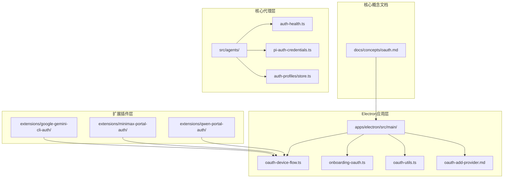
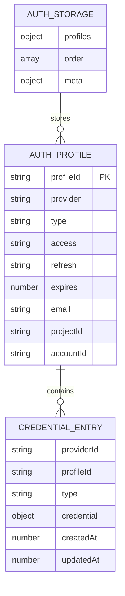
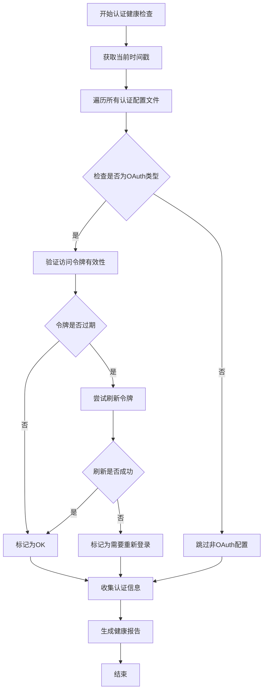
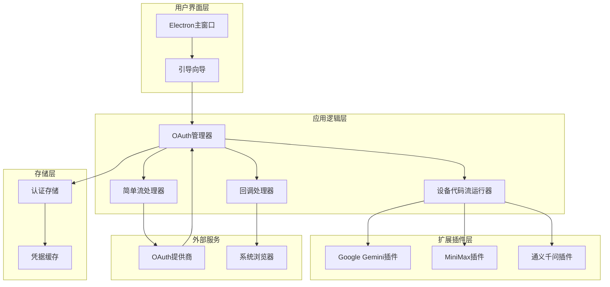
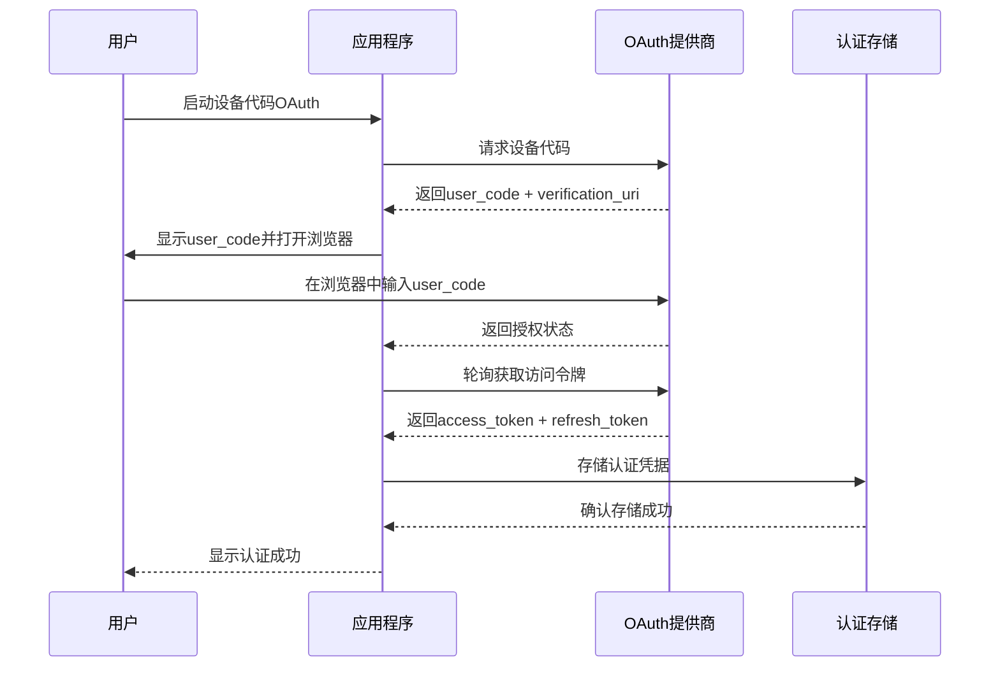
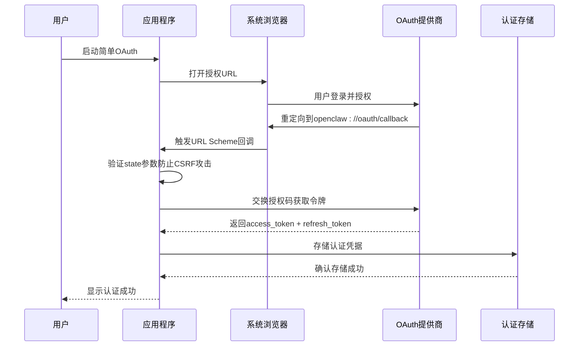
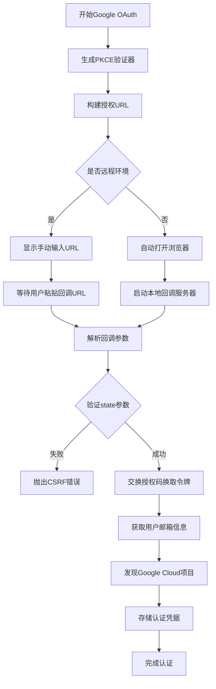
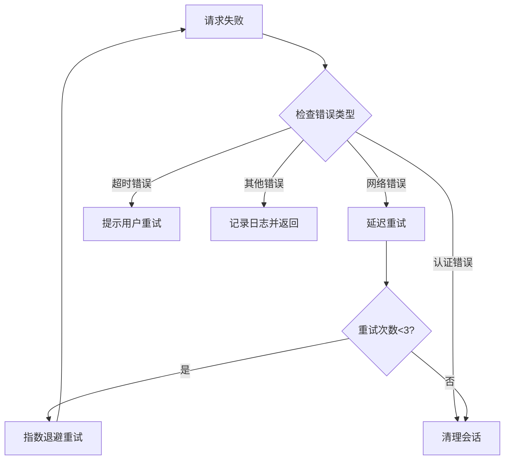

# OAuth平台集成指南

<cite>
**本文档引用的文件**
- [oauth.md](file://docs/concepts/oauth.md)
- [oauth-add-provider.md](file://apps/electron/docs/oauth-add-provider.md)
- [oauth-device-flow.ts](file://apps/electron/src/main/oauth-device-flow.ts)
- [onboarding-oauth.ts](file://apps/electron/src/main/onboarding-oauth.ts)
- [oauth-utils.ts](file://apps/electron/src/main/oauth-utils.ts)
- [oauth.ts](file://extensions/google-gemini-cli-auth/oauth.ts)
- [oauth.ts](file://extensions/minimax-portal-auth/oauth.ts)
- [oauth.ts](file://extensions/qwen-portal-auth/oauth.ts)
- [auth-health.ts](file://src/agents/auth-health.ts)
- [list.status-command.ts](file://src/commands/models/list.status-command.ts)
- [pi-auth-credentials.ts](file://src/agents/pi-auth-credentials.ts)
- [store.ts](file://src/agents/auth-profiles/store.ts)
</cite>

## 目录
1. [简介](#简介)
2. [项目结构](#项目结构)
3. [核心组件](#核心组件)
4. [架构概览](#架构概览)
5. [详细组件分析](#详细组件分析)
6. [依赖关系分析](#依赖关系分析)
7. [性能考虑](#性能考虑)
8. [故障排除指南](#故障排除指南)
9. [结论](#结论)

## 简介

OpenCLAW是一个强大的AI代理平台，支持多种OAuth认证方式来访问不同的AI模型提供商。本指南详细介绍了OpenCLAW的OAuth平台集成功能，包括认证流程、存储机制、多账户管理和扩展插件开发。

OpenCLAW支持两种主要的OAuth流程类型：
- **设备代码流（Device Code Flow）**：适用于需要用户在浏览器输入代码的场景
- **简单授权码流（Simple OAuth Flow）**：适用于标准的重定向回调流程

## 项目结构

OpenCLAW的OAuth系统采用模块化设计，主要分布在以下几个关键目录：



**图表来源**
- [oauth.md:1-159](file://docs/concepts/oauth.md#L1-L159)
- [oauth-device-flow.ts:1-329](file://apps/electron/src/main/oauth-device-flow.ts#L1-L329)
- [onboarding-oauth.ts:1-234](file://apps/electron/src/main/onboarding-oauth.ts#L1-L234)

## 核心组件

### OAuth存储系统

OpenCLAW采用"令牌水池"（token sink）设计理念，将所有认证凭据统一存储在一个中心化的auth-profiles.json文件中：



**图表来源**
- [store.ts:188-227](file://src/agents/auth-profiles/store.ts#L188-L227)
- [pi-auth-credentials.ts:39-88](file://src/agents/pi-auth-credentials.ts#L39-L88)

### 认证健康监控

系统提供了完整的认证状态监控机制，能够检测和报告各种认证问题：



**图表来源**
- [auth-health.ts:165-197](file://src/agents/auth-health.ts#L165-L197)

**章节来源**
- [auth-health.ts:165-197](file://src/agents/auth-health.ts#L165-L197)
- [store.ts:188-227](file://src/agents/auth-profiles/store.ts#L188-L227)

## 架构概览

OpenCLAW的OAuth架构采用分层设计，确保了系统的可扩展性和安全性：



**图表来源**
- [onboarding-oauth.ts:1-234](file://apps/electron/src/main/onboarding-oauth.ts#L1-L234)
- [oauth-device-flow.ts:1-329](file://apps/electron/src/main/oauth-device-flow.ts#L1-L329)

## 详细组件分析

### 设备代码流实现

设备代码流是OpenCLAW处理需要用户在浏览器输入代码的OAuth流程的核心组件：



**图表来源**
- [oauth-device-flow.ts:99-182](file://apps/electron/src/main/oauth-device-flow.ts#L99-L182)
- [oauth-device-flow.ts:190-258](file://apps/electron/src/main/oauth-device-flow.ts#L190-L258)

#### MiniMax设备代码流配置

MiniMax平台实现了完整的设备代码流，支持PKCE安全机制：

| 配置参数 | 值 | 说明 |
|---------|-----|------|
| codeEndpoint | https://api.minimax.io/oauth/code | 获取设备代码的端点 |
| tokenEndpoint | https://api.minimax.io/oauth/token | 获取访问令牌的端点 |
| clientId | 78257093-7e40-4613-99e0-527b14b39113 | 客户端ID |
| scope | group_id profile model.completion | 权限范围 |
| grantType | urn:ietf:params:oauth:grant-type:user_code | 授权类型 |
| usePKCE | true | 是否使用PKCE |

**章节来源**
- [oauth-device-flow.ts:266-329](file://apps/electron/src/main/oauth-device-flow.ts#L266-L329)
- [oauth.ts:1-245](file://extensions/minimax-portal-auth/oauth.ts#L1-L245)

### 简单授权码流实现

简单授权码流适用于标准的OAuth授权码流程，通过URL Scheme回调处理：



**图表来源**
- [onboarding-oauth.ts:141-183](file://apps/electron/src/main/onboarding-oauth.ts#L141-L183)
- [onboarding-oauth.ts:185-228](file://apps/electron/src/main/onboarding-oauth.ts#L185-L228)

#### Google Gemini CLI OAuth实现

Google Gemini CLI插件实现了完整的PKCE授权码流：



**图表来源**
- [oauth.ts:659-735](file://extensions/google-gemini-cli-auth/oauth.ts#L659-L735)

**章节来源**
- [oauth.ts:1-735](file://extensions/google-gemini-cli-auth/oauth.ts#L1-L735)
- [onboarding-oauth.ts:60-75](file://apps/electron/src/main/onboarding-oauth.ts#L60-L75)

### 扩展插件开发

OpenCLAW提供了完整的框架来开发新的OAuth平台插件：

#### 设备代码流插件模板

```typescript
// 设备代码流配置对象
export const NEW_PLATFORM_FLOW: DeviceCodeFlowConfig = {
  name: "新平台名称",
  codeEndpoint: "https://api.newplatform.com/oauth/code",
  tokenEndpoint: "https://api.newplatform.com/oauth/token",
  clientId: "YOUR_CLIENT_ID",
  scope: "required:scopes",
  grantType: "urn:ietf:params:oauth:grant-type:user_code",
  usePKCE: true,
  
  parseCodeResponse(raw) {
    // 解析设备代码响应
    return {
      userCode: p.user_code,
      verificationUri: p.verification_uri,
      expiredIn: Date.now() + (p.expires_in ?? 300) * 1000,
      intervalMs: (p.interval ?? 2) * 1000,
      state: p.state,
    };
  },
  
  parseTokenResponse(raw) {
    // 解析令牌响应
    if (p.status === "success") {
      return {
        status: "success",
        accessToken: p.access_token,
        refreshToken: p.refresh_token,
        expiresIn: p.expired_in,
      };
    }
    return { status: "pending" };
  },
};
```

#### 简单OAuth流插件模板

```typescript
// 简单OAuth流配置
const SIMPLE_OAUTH_URLS: Record<string, string> = {
  // 添加新平台的授权URL
  "new-platform-oauth": "https://api.newplatform.com/oauth/authorize",
};

const SIMPLE_AUTH_METHOD_TO_PROVIDER: Record<string, string> = {
  // 添加平台映射
  "new-platform-oauth": "newplatform",
};
```

**章节来源**
- [oauth-add-provider.md:1-374](file://apps/electron/docs/oauth-add-provider.md#L1-L374)

## 依赖关系分析

OpenCLAW的OAuth系统具有清晰的依赖层次结构：

```mermaid
graph TB
subgraph "外部依赖"
A[Electron框架]
B[Node.js Crypto模块]
C[系统浏览器]
D[OAuth提供商API]
end
subgraph "内部模块"
E[oauth-utils.ts]
F[oauth-device-flow.ts]
G[onboarding-oauth.ts]
H[oauth.ts (扩展插件)]
end
subgraph "核心服务"
I[认证存储]
J[凭据管理]
K[健康监控]
end
A --> E
B --> E
C --> G
D --> G
E --> F
E --> G
F --> H
G --> I
I --> J
J --> K
```

**图表来源**
- [oauth-utils.ts:1-34](file://apps/electron/src/main/oauth-utils.ts#L1-L34)
- [oauth-device-flow.ts:1-329](file://apps/electron/src/main/oauth-device-flow.ts#L1-L329)

### 关键依赖关系

1. **PKCE安全依赖**：所有OAuth流程都依赖于`oauth-utils.ts`提供的PKCE生成功能
2. **设备代码流依赖**：`oauth-device-flow.ts`为所有设备代码流提供通用实现
3. **扩展插件依赖**：各个OAuth平台插件依赖于通用的设备代码流框架
4. **存储依赖**：所有认证数据最终存储在`auth-profiles.json`中

**章节来源**
- [oauth-utils.ts:19-24](file://apps/electron/src/main/oauth-utils.ts#L19-L24)
- [oauth-device-flow.ts:20-58](file://apps/electron/src/main/oauth-device-flow.ts#L20-L58)

## 性能考虑

### 认证轮询优化

设备代码流采用了智能的轮询策略来平衡用户体验和服务器负载：

| 参数 | 默认值 | 说明 |
|------|--------|------|
| 初始轮询间隔 | 2秒 | 避免过于频繁的轮询请求 |
| 最大轮询间隔 | 10秒 | 防止长时间阻塞 |
| 轮询倍数增长 | 1.5倍 | 动态调整轮询频率 |
| 超时时间 | 5分钟 | 防止无限等待 |

### 缓存策略

OpenCLAW实现了多层次的缓存机制：

1. **内存缓存**：当前活跃的OAuth会话
2. **文件缓存**：持久化的认证凭据存储
3. **浏览器缓存**：系统浏览器的会话状态

### 错误处理优化

系统提供了完善的错误处理和重试机制：



## 故障排除指南

### 常见问题诊断

#### CSRF攻击防护

当遇到"state mismatch"错误时，通常是由于CSRF攻击防护触发：

**症状**：`OAuth state mismatch — possible CSRF`

**解决方案**：
1. 确保state参数在授权请求和回调中保持一致
2. 检查URL Scheme回调是否被正确处理
3. 验证浏览器重定向链路的安全性

#### 设备代码流超时

**症状**：`设备代码已过期`或`轮询超时`

**解决方案**：
1. 检查用户是否在浏览器中正确输入了user_code
2. 验证设备代码的有效期（通常为5-15分钟）
3. 确认网络连接稳定，能够正常访问提供商API

#### 令牌刷新失败

**症状**：认证凭据过期但无法自动刷新

**解决方案**：
1. 检查refresh_token是否有效
2. 验证提供商的令牌刷新接口
3. 确认应用具有必要的网络访问权限

### 调试工具

#### 认证健康检查命令

```bash
# 检查所有OAuth认证状态
openclaw models status

# 查看特定提供商的认证信息
openclaw models status --provider google
```

#### 日志分析

OpenCLAW在认证过程中会产生详细的日志信息：

```bash
# 查看OAuth相关日志
tail -f ~/.openclaw/electron-onboarding.log | grep -E "oauth|OAuth"

# 查看设备代码流日志
tail -f ~/.openclaw/electron-onboarding.log | grep -E "device.*code|Device Code"
```

**章节来源**
- [list.status-command.ts:259-278](file://src/commands/models/list.status-command.ts#L259-L278)
- [auth-health.ts:165-197](file://src/agents/auth-health.ts#L165-L197)

## 结论

OpenCLAW的OAuth平台集成功为开发者提供了一个强大而灵活的认证解决方案。通过标准化的设备代码流和简单授权码流，系统能够支持广泛的OAuth提供商，同时保持高度的安全性和可用性。

### 主要优势

1. **安全性**：完整的PKCE实现和CSRF防护
2. **可扩展性**：模块化的插件架构支持新平台快速集成
3. **可靠性**：智能的错误处理和重试机制
4. **易用性**：简化的用户界面和自动化流程

### 未来发展方向

1. **更多平台支持**：持续集成新的OAuth提供商
2. **性能优化**：进一步优化轮询策略和缓存机制
3. **用户体验改进**：简化复杂的认证流程
4. **安全增强**：引入更高级的安全特性

通过遵循本指南的架构原则和最佳实践，开发者可以轻松地为OpenCLAW添加新的OAuth平台支持，为用户提供无缝的AI模型访问体验。