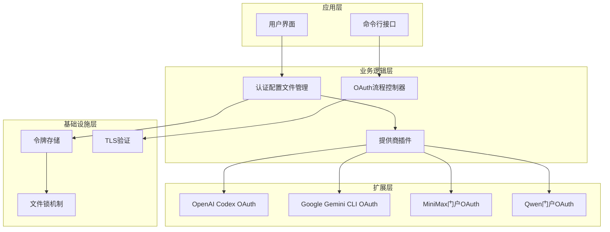
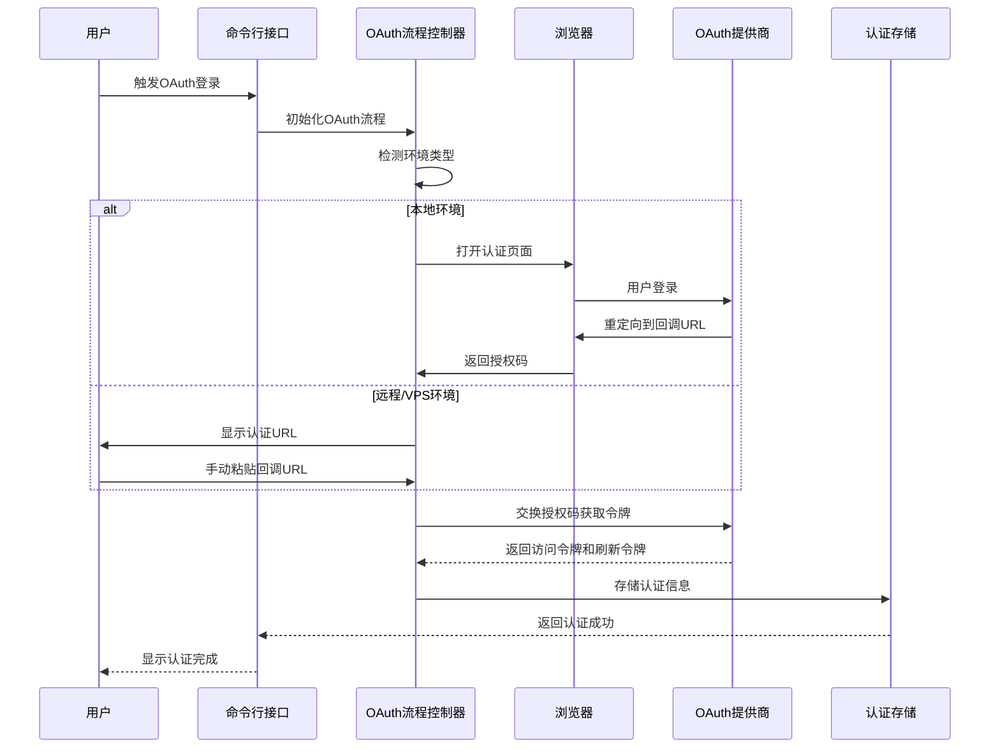
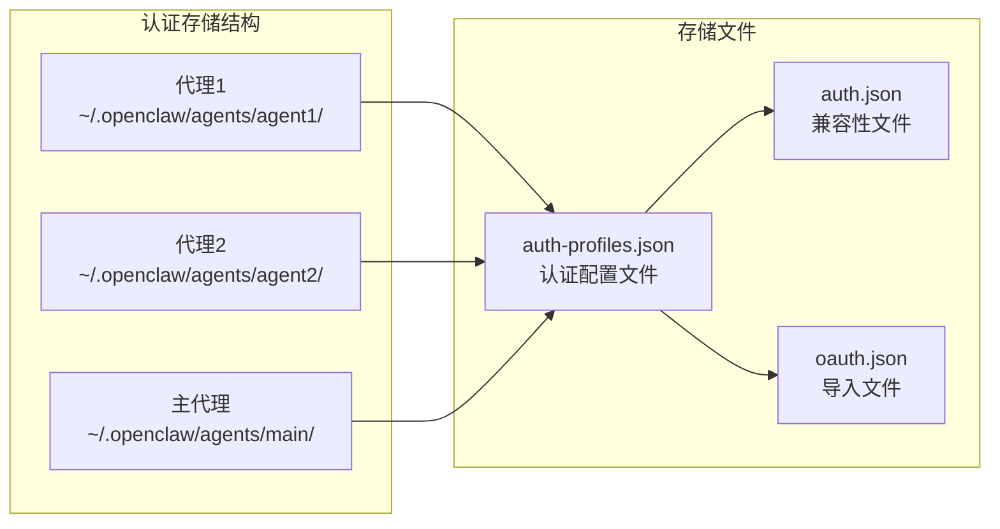
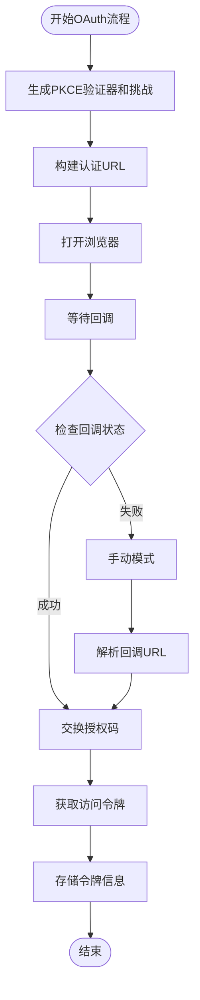
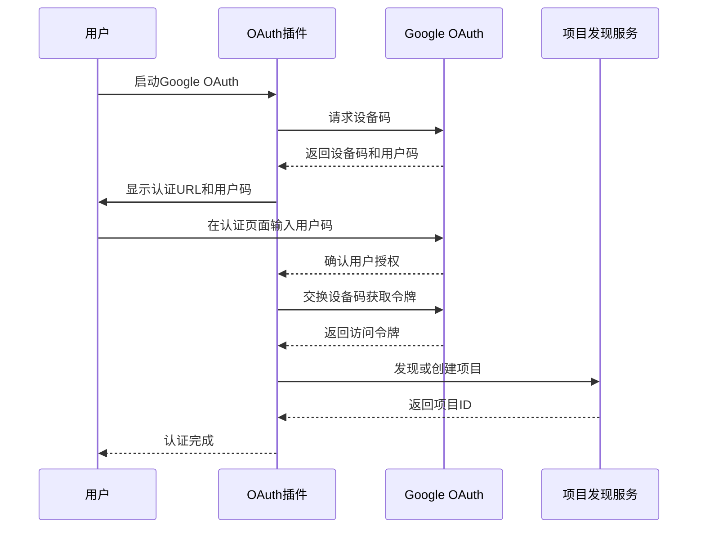
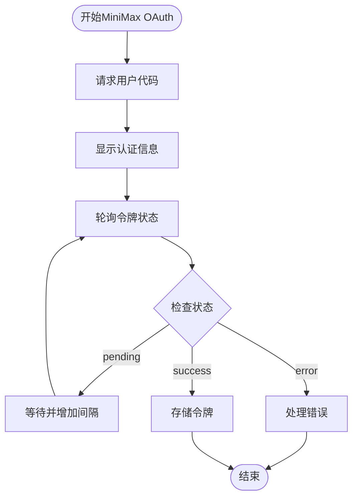
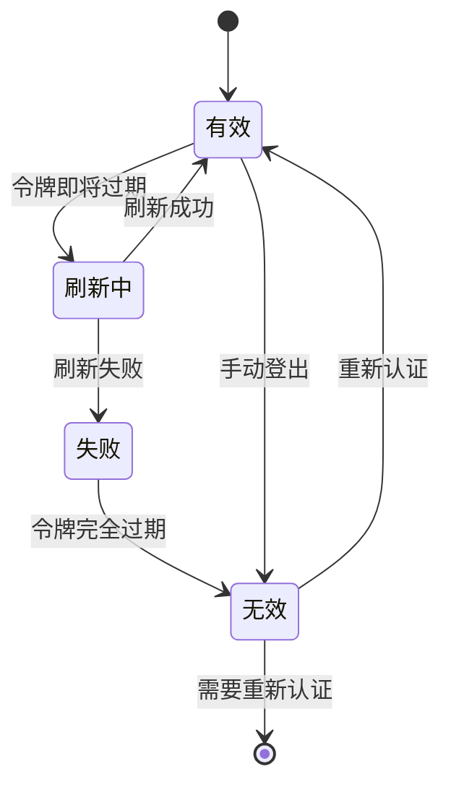

# OAuth流程架构文档

<cite>
**本文档引用的文件**
- [docs/concepts/oauth.md](file://docs/concepts/oauth.md)
- [extensions/google-gemini-cli-auth/oauth.ts](file://extensions/google-gemini-cli-auth/oauth.ts)
- [extensions/minimax-portal-auth/oauth.ts](file://extensions/minimax-portal-auth/oauth.ts)
- [extensions/qwen-portal-auth/oauth.ts](file://extensions/qwen-portal-auth/oauth.ts)
- [src/agents/auth-profiles/oauth.ts](file://src/agents/auth-profiles/oauth.ts)
- [src/commands/oauth-flow.ts](file://src/commands/oauth-flow.ts)
- [src/commands/openai-codex-oauth.ts](file://src/commands/openai-codex-oauth.ts)
- [src/plugin-sdk/oauth-utils.ts](file://src/plugin-sdk/oauth-utils.ts)
</cite>

## 目录
1. [简介](#简介)
2. [项目结构](#项目结构)
3. [核心组件](#核心组件)
4. [架构概览](#架构概览)
5. [详细组件分析](#详细组件分析)
6. [依赖关系分析](#依赖关系分析)
7. [性能考虑](#性能考虑)
8. [故障排除指南](#故障排除指南)
9. [结论](#结论)

## 简介

OpenClaw项目实现了完整的OAuth认证流程架构，支持多种AI服务提供商的OAuth认证。该架构采用插件化设计，通过统一的OAuth框架支持不同提供商的认证流程，包括OpenAI Codex、Google Gemini CLI、MiniMax门户和Qwen门户等。

系统的核心特性包括：
- 统一的OAuth令牌存储机制
- 多账户配置文件管理
- 自动令牌刷新和过期处理
- 远程环境的OAuth流程适配
- 插件化的提供商支持

## 项目结构

OpenClaw的OAuth架构采用分层组织结构：



**图表来源**
- [src/agents/auth-profiles/oauth.ts:1-488](file://src/agents/auth-profiles/oauth.ts#L1-L488)
- [src/commands/openai-codex-oauth.ts:1-67](file://src/commands/openai-codex-oauth.ts#L1-L67)

**章节来源**
- [docs/concepts/oauth.md:1-159](file://docs/concepts/oauth.md#L1-L159)

## 核心组件

### 认证配置文件管理器

认证配置文件管理器是OAuth架构的核心组件，负责管理多个提供商的认证配置文件。它提供了以下关键功能：

- **多提供商支持**：支持OpenAI Codex、Google Gemini CLI、MiniMax门户、Qwen门户等多种OAuth提供商
- **配置文件存储**：将认证信息存储在每个代理的独立目录中
- **自动令牌刷新**：在令牌过期时自动刷新访问令牌
- **多账户路由**：支持在同一代理内使用多个认证配置文件

### OAuth流程控制器

OAuth流程控制器负责协调整个OAuth认证过程，包括：

- **环境检测**：识别本地和远程/VPS环境
- **浏览器集成**：自动打开浏览器进行认证
- **回调处理**：处理OAuth回调URL和授权码
- **错误处理**：提供详细的错误诊断和修复建议

### 插件化提供商支持

系统采用插件化架构支持不同的OAuth提供商，每个提供商都有专门的实现模块：

- **OpenAI Codex OAuth**：支持PKCE认证流程
- **Google Gemini CLI OAuth**：支持设备码认证和项目发现
- **MiniMax门户OAuth**：支持用户代码认证流程
- **Qwen门户OAuth**：支持设备码认证流程

**章节来源**
- [src/agents/auth-profiles/oauth.ts:1-488](file://src/agents/auth-profiles/oauth.ts#L1-L488)
- [src/commands/oauth-flow.ts:1-54](file://src/commands/oauth-flow.ts#L1-L54)

## 架构概览

OpenClaw的OAuth架构采用分层设计，确保了良好的可扩展性和维护性：



**图表来源**
- [src/commands/openai-codex-oauth.ts:11-67](file://src/commands/openai-codex-oauth.ts#L11-L67)
- [src/commands/oauth-flow.ts:8-53](file://src/commands/oauth-flow.ts#L8-L53)

## 详细组件分析

### 认证配置文件存储架构

认证配置文件采用分布式存储架构，每个代理都有独立的认证存储：



**图表来源**
- [docs/concepts/oauth.md:41-55](file://docs/concepts/oauth.md#L41-L55)

### 多提供商OAuth实现

系统支持多种OAuth认证模式，每种提供商都有特定的实现策略：

#### OpenAI Codex OAuth实现

OpenAI Codex OAuth实现了标准的PKCE（Proof Key for Code Exchange）认证流程：



**图表来源**
- [extensions/google-gemini-cli-auth/oauth.ts:659-735](file://extensions/google-gemini-cli-auth/oauth.ts#L659-L735)

#### Google Gemini CLI OAuth实现

Google Gemini CLI OAuth支持设备码认证和项目发现功能：



**图表来源**
- [extensions/google-gemini-cli-auth/oauth.ts:467-604](file://extensions/google-gemini-cli-auth/oauth.ts#L467-L604)

#### MiniMax门户OAuth实现

MiniMax门户OAuth实现了用户代码认证流程：



**图表来源**
- [extensions/minimax-portal-auth/oauth.ts:103-182](file://extensions/minimax-portal-auth/oauth.ts#L103-L182)

**章节来源**
- [extensions/google-gemini-cli-auth/oauth.ts:1-735](file://extensions/google-gemini-cli-auth/oauth.ts#L1-L735)
- [extensions/minimax-portal-auth/oauth.ts:1-245](file://extensions/minimax-portal-auth/oauth.ts#L1-L245)
- [extensions/qwen-portal-auth/oauth.ts:1-183](file://extensions/qwen-portal-auth/oauth.ts#L1-L183)

### 认证令牌管理

认证令牌管理系统负责令牌的生命周期管理：



**图表来源**
- [src/agents/auth-profiles/oauth.ts:154-211](file://src/agents/auth-profiles/oauth.ts#L154-L211)

**章节来源**
- [src/agents/auth-profiles/oauth.ts:1-488](file://src/agents/auth-profiles/oauth.ts#L1-L488)

## 依赖关系分析

OpenClaw OAuth架构的依赖关系呈现清晰的层次结构：

```mermaid
graph TB
subgraph "外部依赖"
PI_AI[@mariozechner/pi-ai<br/>OAuth核心库]
NodeCrypto[node:crypto<br/>加密功能]
NodeHTTP[node:http<br/>HTTP服务器]
NodeFS[node:fs<br/>文件系统]
end
subgraph "内部模块"
OAuthUtils[oauth-utils.ts<br/>工具函数]
OAuthFlow[oauth-flow.ts<br/>流程控制]
OpenAICodex[openai-codex-oauth.ts<br/>OpenAI实现]
AuthProfiles[auth-profiles/oauth.ts<br/>配置管理]
end
subgraph "扩展模块"
GoogleOAuth[google-gemini-cli-auth/oauth.ts<br/>Google实现]
MiniMaxOAuth[minimax-portal-auth/oauth.ts<br/>MiniMax实现]
QwenOAuth[qwen-portal-auth/oauth.ts<br/>Qwen实现]
end
PI_AI --> OAuthFlow
PI_AI --> OpenAICodex
NodeCrypto --> OAuthUtils
NodeHTTP --> OAuthFlow
NodeFS --> AuthProfiles
OAuthUtils --> OpenAICodex
OAuthFlow --> OpenAICodex
AuthProfiles --> OpenAICodex
AuthProfiles --> GoogleOAuth
AuthProfiles --> MiniMaxOAuth
AuthProfiles --> QwenOAuth
```

**图表来源**
- [src/plugin-sdk/oauth-utils.ts:1-14](file://src/plugin-sdk/oauth-utils.ts#L1-L14)
- [src/commands/oauth-flow.ts:1-54](file://src/commands/oauth-flow.ts#L1-L54)
- [src/commands/openai-codex-oauth.ts:1-67](file://src/commands/openai-codex-oauth.ts#L1-L67)

**章节来源**
- [src/plugin-sdk/oauth-utils.ts:1-14](file://src/plugin-sdk/oauth-utils.ts#L1-L14)
- [src/commands/oauth-flow.ts:1-54](file://src/commands/oauth-flow.ts#L1-L54)

## 性能考虑

OpenClaw OAuth架构在设计时充分考虑了性能优化：

### 并发控制
- 使用文件锁机制防止并发写入冲突
- 令牌刷新操作采用原子性更新
- 支持多代理间的令牌继承机制

### 缓存策略
- 客户端凭据缓存减少重复提取
- 令牌状态缓存避免频繁网络请求
- 配置文件缓存提升启动速度

### 错误恢复
- 自动重试机制处理临时网络故障
- 回退策略确保认证流程的可靠性
- 超时控制防止长时间阻塞

## 故障排除指南

### 常见问题及解决方案

#### OAuth回调失败
**症状**：浏览器认证完成后无法返回到应用程序
**解决方案**：
1. 检查本地回调端口是否被占用
2. 确认防火墙设置允许回调连接
3. 在远程环境中使用手动模式

#### 令牌刷新失败
**症状**：认证后一段时间内出现401错误
**解决方案**：
1. 检查网络连接和代理设置
2. 验证提供商的API限制
3. 清除过期的认证缓存

#### 多账户切换问题
**症状**：在多个认证配置文件间切换时出现问题
**解决方案**：
1. 使用明确的配置文件标识符
2. 检查配置文件的兼容性设置
3. 重新初始化认证配置文件

**章节来源**
- [src/agents/auth-profiles/oauth.ts:455-487](file://src/agents/auth-profiles/oauth.ts#L455-L487)

## 结论

OpenClaw的OAuth架构通过模块化设计和插件化支持，为多种AI服务提供商提供了统一的认证解决方案。该架构具有以下优势：

1. **高度可扩展性**：新的OAuth提供商可以轻松集成
2. **强大的错误处理**：完善的错误诊断和恢复机制
3. **灵活的配置管理**：支持多账户和多代理场景
4. **优秀的用户体验**：自动化流程减少用户干预

未来的发展方向包括：
- 支持更多OAuth提供商
- 增强安全性和合规性
- 优化性能和资源使用
- 改进用户体验和易用性