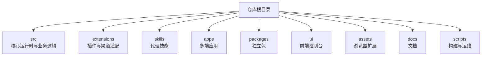
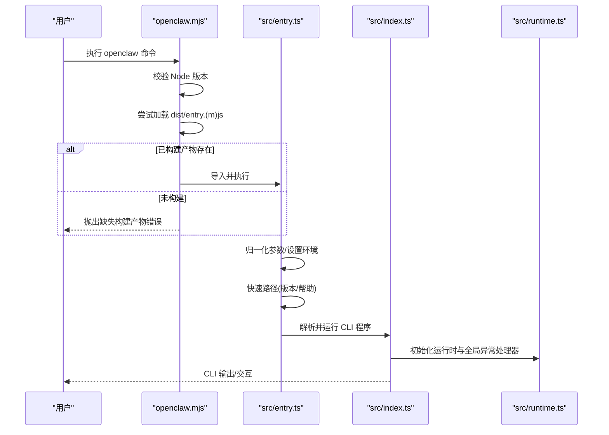
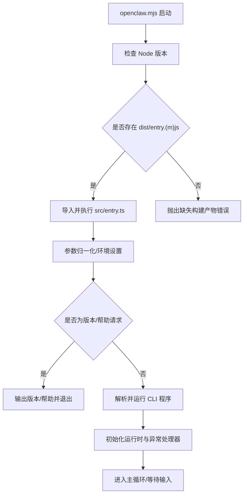
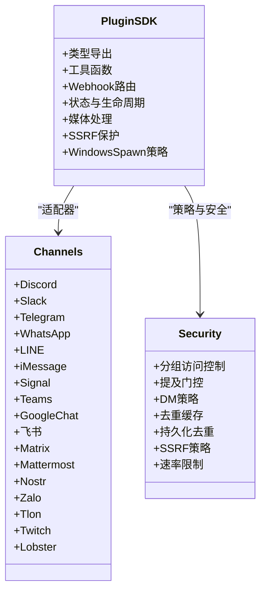
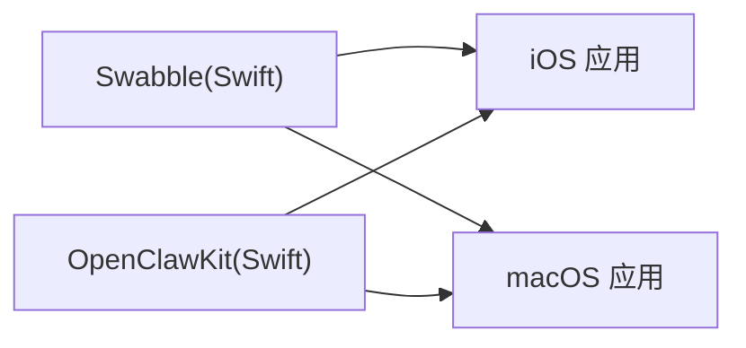
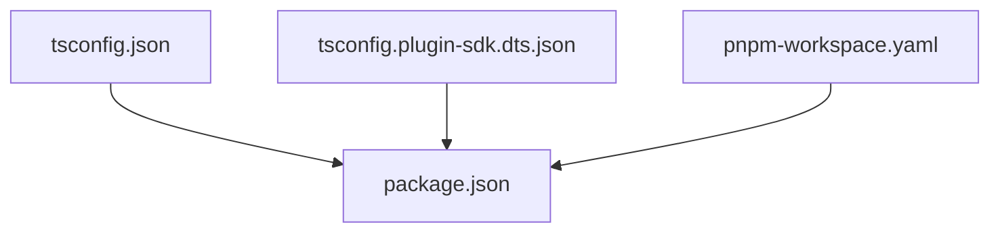

# 代码结构与架构

<cite>
**本文引用的文件**
- [package.json](file://package.json)
- [pnpm-workspace.yaml](file://pnpm-workspace.yaml)
- [tsconfig.json](file://tsconfig.json)
- [tsconfig.plugin-sdk.dts.json](file://tsconfig.plugin-sdk.dts.json)
- [src/index.ts](file://src/index.ts)
- [src/entry.ts](file://src/entry.ts)
- [openclaw.mjs](file://openclaw.mjs)
- [src/runtime.ts](file://src/runtime.ts)
- [src/plugin-sdk/index.ts](file://src/plugin-sdk/index.ts)
- [Swabble/Package.swift](file://Swabble/Package.swift)
</cite>

## 目录

1. [引言](#引言)
2. [项目结构](#项目结构)
3. [核心组件](#核心组件)
4. [架构总览](#架构总览)
5. [详细组件分析](#详细组件分析)
6. [依赖分析](#依赖分析)
7. [性能考虑](#性能考虑)
8. [故障排查指南](#故障排查指南)
9. [结论](#结论)
10. [附录](#附录)

## 引言

本文件系统性梳理 OpenClaw 的代码结构与架构设计，聚焦以下目标：

- 整体架构：多平台（桌面、移动、Web 扩展）与多通道（消息渠道）的统一网关与插件化扩展体系
- 模块组织：src、packages、extensions、skills、apps 等核心目录的职责与边界
- TypeScript 配置与 Monorepo 工作区管理：路径别名、类型导出、构建与发布策略
- 分层设计与命名约定：清晰的层次划分与文件组织原则
- 组件交互：从 CLI 启动到插件 SDK、再到各渠道适配器的调用链路
- 可视化图表：帮助开发者快速理解系统设计思路

## 项目结构

OpenClaw 采用 Monorepo 架构，根目录通过工作区配置聚合多个子包与应用。核心目录职责如下：

- src：核心运行时与业务逻辑，包含 CLI、网关、通道适配、插件框架、工具库等
- extensions：可插拔的第三方或官方扩展，按渠道/能力拆分
- skills：面向代理的技能集合，用于自动化任务与工具编排
- apps：多端应用（Electron、iOS、Android、macOS），共享 Kit 与通用逻辑
- packages：独立的 npm 包（如 clawdbot、moltbot）
- ui：前端控制台与可视化界面
- assets：浏览器扩展资源
- docs：项目文档与指引
- scripts：构建、测试、发布与运维脚本

**章节来源**

- [package.json:1-467](file://package.json#L1-L467)
- [pnpm-workspace.yaml:1-19](file://pnpm-workspace.yaml#L1-L19)

## 核心组件

本节聚焦启动流程、运行时环境与插件 SDK 的关键组件。

- CLI 入口与启动链路
  - openclaw.mjs：Node 版本校验与入口加载
  - src/entry.ts：命令行参数归一化、实验性警告抑制、版本/帮助快速路径、运行 CLI 主程序
  - src/index.ts：导出公共 API 与 CLI 程序构建入口
- 运行时环境
  - src/runtime.ts：统一日志输出、错误处理与进程退出策略
- 插件 SDK
  - src/plugin-sdk/index.ts：集中导出插件开发所需类型、工具函数与各渠道适配器

**图示来源**

- [openclaw.mjs:1-90](file://openclaw.mjs#L1-L90)
- [src/entry.ts:1-195](file://src/entry.ts#L1-L195)
- [src/index.ts:1-94](file://src/index.ts#L1-L94)
- [src/runtime.ts:1-54](file://src/runtime.ts#L1-L54)

**章节来源**

- [openclaw.mjs:1-90](file://openclaw.mjs#L1-L90)
- [src/entry.ts:1-195](file://src/entry.ts#L1-L195)
- [src/index.ts:1-94](file://src/index.ts#L1-L94)
- [src/runtime.ts:1-54](file://src/runtime.ts#L1-L54)

## 架构总览

OpenClaw 的整体架构围绕“统一网关 + 插件生态 + 多端应用”展开：

- 统一网关：负责会话、路由、自动回复、钩子、定时任务、安全策略等核心能力
- 插件生态：通过插件 SDK 提供渠道适配、HTTP/Webhook 路由、状态与生命周期管理等
- 多端应用：Electron、iOS、Android、macOS 应用共享 Kit 与通用逻辑，通过 IPC 或本地协议与网关交互
- 文档与工具：完善的文档体系与脚手架工具，支持快速上手与扩展开发

```mermaid
graph TB
subgraph "核心运行时(src)"
gw["网关与路由"]
ch["通道适配(各渠道)"]
plg["插件框架"]
sec["安全与策略"]
mem["内存与存储"]
cron["定时任务"]
hook["钩子系统"]
end
subgraph "插件生态(extensions)"
sdk["插件SDK"]
ext_discord["Discord 扩展"]
ext_slack["Slack 扩展"]
ext_telegram["Telegram 扩展"]
ext_whatsapp["WhatsApp 扩展"]
ext_line["LINE 扩展"]
ext_imessage["iMessage 扩展"]
ext_signal["Signal 扩展"]
ext_msteams["Teams 扩展"]
ext_googlechat["Google Chat 扩展"]
ext_feishu["飞书 扩展"]
ext_matrix["Matrix 扩展"]
ext_mattermost["Mattermost 扩展"]
ext_nostr["Nostr 扩展"]
ext_zalo["Zalo 扩展"]
ext_tlon["Tlon 扩展"]
ext_twitch["Twitch 扩展"]
ext_lobster["Lobster 扩展"]
ext_diagnostics["诊断与监控"]
ext_memory["内存与向量数据库"]
ext_voicecall["语音通话"]
ext_devicepair["设备配对"]
ext_threadownership["线程归属"]
ext_acp["ACPX/AI Control Plane"]
end
subgraph "多端应用(apps)"
electron["Electron 应用"]
ios["iOS 应用"]
android["Android 应用"]
macos["macOS 应用"]
sharedkit["OpenClawKit(Swift)"]
end
gw --> ch
gw --> plg
gw --> sec
gw --> mem
gw --> cron
gw --> hook
plg --> sdk
sdk --> ext_discord
sdk --> ext_slack
sdk --> ext_telegram
sdk --> ext_whatsapp
sdk --> ext_line
sdk --> ext_imessage
sdk --> ext_signal
sdk --> ext_msteams
sdk --> ext_googlechat
sdk --> ext_feishu
sdk --> ext_matrix
sdk --> ext_mattermost
sdk --> ext_nostr
sdk --> ext_zalo
sdk --> ext_tlon
sdk --> ext_twitch
sdk --> ext_lobster
sdk --> ext_diagnostics
sdk --> ext_memory
sdk --> ext_voicecall
sdk --> ext_devicepair
sdk --> ext_threadownership
sdk --> ext_acp
electron --> gw
ios --> gw
android --> gw
macos --> gw
sharedkit --> gw
```

**图示来源**

- [src/index.ts:1-94](file://src/index.ts#L1-L94)
- [src/plugin-sdk/index.ts:1-826](file://src/plugin-sdk/index.ts#L1-L826)
- [Swabble/Package.swift:1-56](file://Swabble/Package.swift#L1-L56)

## 详细组件分析

### CLI 启动与运行时

- openclaw.mjs：确保满足最低 Node 版本要求；尝试加载构建产物（优先 entry.js，其次 entry.mjs），缺失则报错
- src/entry.ts：参数归一化、实验性警告抑制、版本/帮助快速路径、Profile 环境注入、调用 CLI 主程序
- src/index.ts：构建 CLI 程序、导出公共 API、安装未捕获异常处理器
- src/runtime.ts：统一日志输出、错误处理、进程退出策略，支持非退出式运行时以方便测试

**图示来源**

- [openclaw.mjs:1-90](file://openclaw.mjs#L1-L90)
- [src/entry.ts:1-195](file://src/entry.ts#L1-L195)
- [src/index.ts:1-94](file://src/index.ts#L1-L94)
- [src/runtime.ts:1-54](file://src/runtime.ts#L1-L54)

**章节来源**

- [openclaw.mjs:1-90](file://openclaw.mjs#L1-L90)
- [src/entry.ts:1-195](file://src/entry.ts#L1-L195)
- [src/index.ts:1-94](file://src/index.ts#L1-L94)
- [src/runtime.ts:1-54](file://src/runtime.ts#L1-L54)

### 插件 SDK 设计

- 目标：为扩展开发者提供统一的类型、工具函数与渠道适配器，屏蔽底层差异
- 结构：集中导出类型、工具函数、Webhook 路由、状态与生命周期管理、媒体处理、SSRF 保护、Windows Spawn 策略等
- 渠道适配：Discord、Slack、Telegram、WhatsApp、LINE、iMessage、Signal、Teams、Google Chat、飞书、Matrix、Mattermost、Nostr、Zalo、Tlon、Twitch、Lobster 等
- 安全与策略：分组访问控制、提及门控、DM 策略、去重缓存、持久化去重、SSRF 策略、速率限制与异常追踪

**图示来源**

- [src/plugin-sdk/index.ts:1-826](file://src/plugin-sdk/index.ts#L1-L826)

**章节来源**

- [src/plugin-sdk/index.ts:1-826](file://src/plugin-sdk/index.ts#L1-L826)

### Swift 生态与共享 Kit

- Swabble：独立的 Swift 包，提供语音唤醒与语音处理能力，作为 iOS/macOS 的一部分
- OpenClawKit：多端共享的 Swift 模块，支撑跨平台功能与 UI 组件

**图示来源**

- [Swabble/Package.swift:1-56](file://Swabble/Package.swift#L1-L56)

**章节来源**

- [Swabble/Package.swift:1-56](file://Swabble/Package.swift#L1-L56)

## 依赖分析

- Monorepo 工作区
  - pnpm-workspace.yaml：声明根工作区与子包范围，仅构建指定依赖，减少无关二进制打包
- TypeScript 配置
  - tsconfig.json：启用 NodeNext 模块与解析、严格模式、路径别名映射 openclaw/plugin-sdk
  - tsconfig.plugin-sdk.dts.json：单独生成插件 SDK 类型声明，限定 include 与 exclude
- 根 package.json
  - exports 字段：为插件 SDK 提供多入口类型与默认导出，便于外部消费
  - scripts：涵盖构建、测试、格式化、Lint、文档、发布等完整流水线
  - dependencies/devDependencies：覆盖网关、通道、AI 模型、Web 框架、测试与工具链

**图示来源**

- [tsconfig.json:1-29](file://tsconfig.json#L1-L29)
- [tsconfig.plugin-sdk.dts.json:1-62](file://tsconfig.plugin-sdk.dts.json#L1-L62)
- [package.json:1-467](file://package.json#L1-L467)
- [pnpm-workspace.yaml:1-19](file://pnpm-workspace.yaml#L1-L19)

**章节来源**

- [tsconfig.json:1-29](file://tsconfig.json#L1-L29)
- [tsconfig.plugin-sdk.dts.json:1-62](file://tsconfig.plugin-sdk.dts.json#L1-L62)
- [package.json:1-467](file://package.json#L1-L467)
- [pnpm-workspace.yaml:1-19](file://pnpm-workspace.yaml#L1-L19)

## 性能考虑

- 启动性能
  - 实验性警告抑制与编译缓存启用，减少启动开销
  - 版本/帮助快速路径避免完整 CLI 解析
- 运行时性能
  - 统一日志与进度线清理，避免频繁 I/O 干扰
  - 插件 SDK 中的去重缓存与持久化去重，降低重复处理成本
- 构建与打包
  - 仅构建指定依赖，避免不必要的二进制打包
  - 插件 SDK 单独生成类型声明，缩短增量编译时间

[本节为通用指导，不直接分析具体文件]

## 故障排查指南

- CLI 启动失败
  - 检查 Node 版本是否满足要求
  - 确认已执行构建，dist/entry.(m)js 是否存在
- 参数与环境问题
  - 使用 Profile 注入环境变量，确认参数归一化与警告过滤生效
- 运行时异常
  - 关注未捕获异常与未处理拒绝的处理逻辑，确保错误被结构化记录并退出
- 插件开发
  - 使用插件 SDK 的类型与工具函数，遵循 Webhook 路由与状态生命周期规范
  - 利用 SSRF 保护、速率限制与异常追踪，提升稳定性

**章节来源**

- [openclaw.mjs:1-90](file://openclaw.mjs#L1-L90)
- [src/entry.ts:1-195](file://src/entry.ts#L1-L195)
- [src/index.ts:1-94](file://src/index.ts#L1-L94)
- [src/runtime.ts:1-54](file://src/runtime.ts#L1-L54)

## 结论

OpenClaw 通过清晰的 Monorepo 结构、严格的 TypeScript 配置与插件 SDK 设计，实现了“统一网关 + 开放生态 + 多端应用”的整体架构。其启动链路简洁可靠，运行时环境统一可控，插件体系覆盖主流消息渠道并内置安全与策略机制。该架构既适合大规模扩展，也便于多端协同与持续交付。

[本节为总结性内容，不直接分析具体文件]

## 附录

- 文件组织原则
  - 按功能域分层：CLI、网关、通道、插件、工具、配置、安全、媒体、会话等
  - 按平台分层：src（通用）、apps（多端）、extensions（扩展）、skills（技能）
  - 路径别名：使用 openclaw/plugin-sdk 与通配符映射，简化导入
- 命名约定
  - 类型与接口以大写开头，常量全大写，函数语义化
  - 渠道相关文件以渠道名命名，如 discord、slack、telegram 等
- 发布与导出
  - package.json 的 exports 字段为插件 SDK 提供多入口导出，便于外部消费
  - 构建脚本统一生成类型声明与构建产物，保证一致性

[本节为通用指导，不直接分析具体文件]
