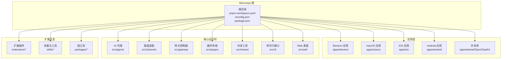
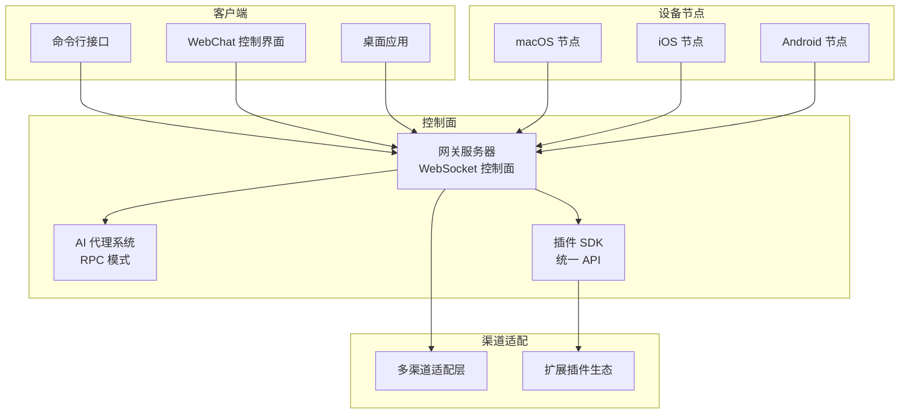
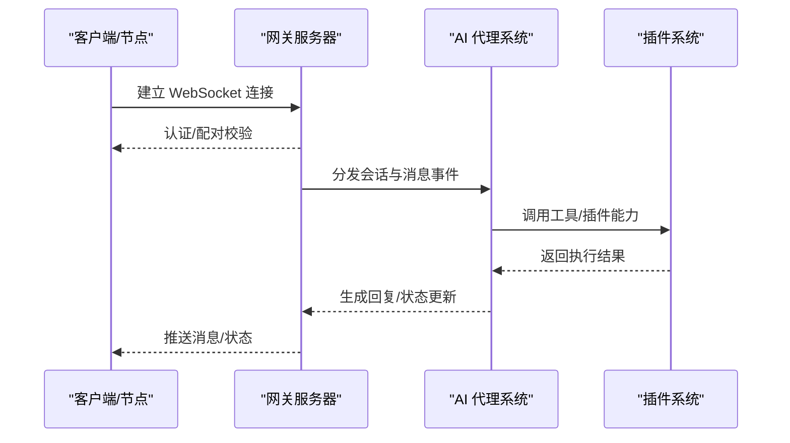
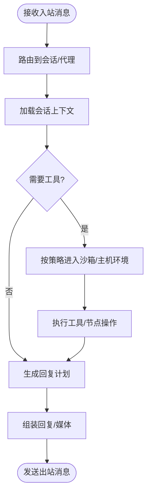
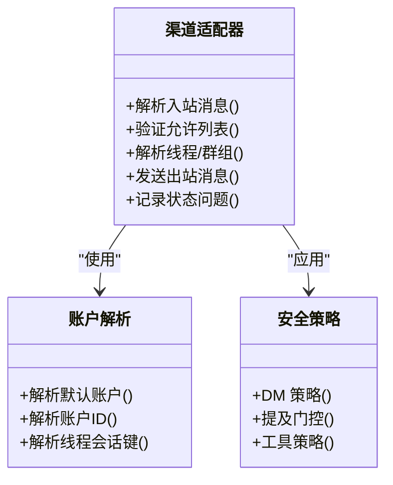
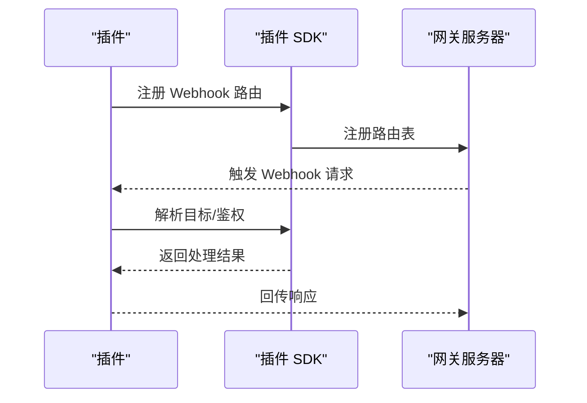
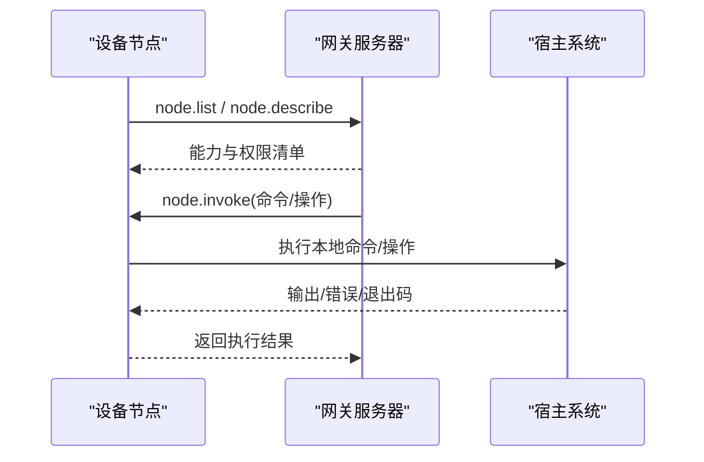
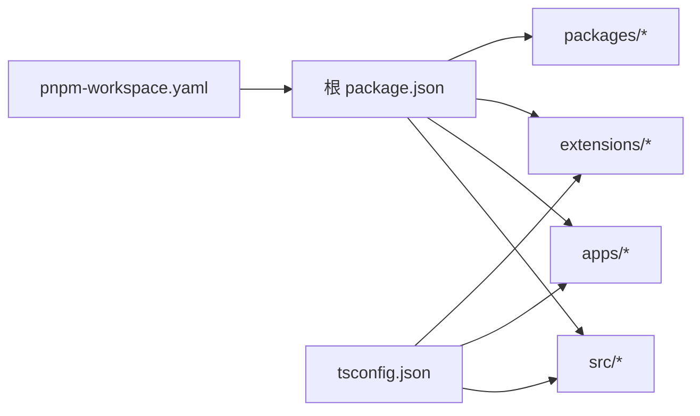

# 整体架构设计

<cite>
**本文档引用的文件**
- [pnpm-workspace.yaml](file://pnpm-workspace.yaml)
- [tsconfig.json](file://tsconfig.json)
- [package.json](file://package.json)
- [README.md](file://README.md)
- [src/plugin-sdk/index.ts](file://src/plugin-sdk/index.ts)
- [src/gateway/server.ts](file://src/gateway/server.ts)
- [src/gateway/server.impl.js](file://src/gateway/server.impl.js)
- [src/agents/index.ts](file://src/agents/index.ts)
- [src/channels/index.ts](file://src/channels/index.ts)
- [src/plugins/index.ts](file://src/plugins/index.ts)
- [src/shared/index.ts](file://src/shared/index.ts)
- [src/cli/index.ts](file://src/cli/index.ts)
- [src/web/index.ts](file://src/web/index.ts)
- [apps/electron/package.json](file://apps/electron/package.json)
- [apps/macos/package.json](file://apps/macos/package.json)
- [apps/ios/package.json](file://apps/ios/package.json)
- [apps/android/build.gradle.kts](file://apps/android/build.gradle.kts)
- [apps/shared/OpenClawKit/Package.swift](file://apps/shared/OpenClawKit/Package.swift)
- [extensions/*/index.ts](file://extensions/acpx/index.ts)
- [extensions/*/openclaw.plugin.json](file://extensions/acpx/openclaw.plugin.json)
</cite>

## 目录

1. [引言](#引言)
2. [项目结构](#项目结构)
3. [核心组件](#核心组件)
4. [架构总览](#架构总览)
5. [详细组件分析](#详细组件分析)
6. [依赖关系分析](#依赖关系分析)
7. [性能考虑](#性能考虑)
8. [故障排除指南](#故障排除指南)
9. [结论](#结论)

## 引言

OpenClaw 是一个个人 AI 助手平台，采用多通道消息网关为核心控制平面，结合事件驱动与插件化架构，支持跨平台客户端与设备节点。其目标是在用户自有设备上提供本地优先、快速且始终在线的智能助手体验。本文件聚焦于整体架构设计，阐述微服务化控制面、事件驱动与插件化扩展机制，并解析 Monorepo 工作区与 TypeScript 配置策略。

## 项目结构

OpenClaw 采用 Monorepo 管理多语言与多平台代码，核心通过 pnpm workspace 组织，TypeScript 编译器选项统一配置，构建脚本集中管理。项目主要目录与职责如下：

- apps：各平台应用与共享库
  - electron：桌面端渲染与打包配置
  - macos/ios/android：原生平台应用与节点
  - shared/OpenClawKit：跨平台共享 Swift 包
- extensions：可插拔渠道与功能扩展
- packages：独立包（如 clawdbot、moltbot）
- scripts：构建、测试、发布脚本
- skills：技能与工具集合
- src：核心运行时与协议实现
  - agents：AI 代理与会话管理
  - channels：多渠道适配层
  - gateway：WebSocket 控制面与协议
  - plugins：插件运行时与 SDK
  - shared/web/cli：通用工具与接口
- docs：官方文档与指引

**图示来源**

- [pnpm-workspace.yaml:1-19](file://pnpm-workspace.yaml#L1-L19)
- [package.json:1-467](file://package.json#L1-L467)

**章节来源**

- [pnpm-workspace.yaml:1-19](file://pnpm-workspace.yaml#L1-L19)
- [package.json:1-467](file://package.json#L1-L467)

## 核心组件

- 网关服务器（Gateway Server）
  - 提供 WebSocket 控制面，承载会话、存在性、配置、定时任务、Webhook、远程访问与安全策略等能力。
  - 支持 Tailscale Serve/Funnel 暴露与 SSH 隧道远程访问。
- AI 代理系统（Agents）
  - 基于 RPC 的 Pi agent 运行时，支持工具流式与块流式执行，具备会话模型、分组隔离与激活模式。
- 渠道适配层（Channels）
  - 多渠道适配（WhatsApp、Telegram、Slack、Discord、Google Chat、Signal、iMessage、BlueBubbles、IRC、Microsoft Teams、Matrix、Feishu、LINE、Mattermost、Nextcloud Talk、Nostr、Synology Chat、Tlon、Twitch、Zalo、Zalo Personal、WebChat），统一入站路由、出站投递与权限控制。
- 插件系统（Plugins）
  - 插件 SDK 暴露统一 API，支持 Webhook 注册、账户生命周期管理、消息动作、线程绑定、状态汇总与安全策略。
- 设备节点（Nodes）
  - macOS/iOS/Android 节点通过 WebSocket 与网关通信，支持 Canvas、相机、屏幕录制、位置、通知等本地能力调用。
- 扩展生态（Extensions）
  - 以插件形式提供渠道与工具扩展，遵循 openclaw.plugin.json 规范注册与版本同步。

**章节来源**

- [README.md:128-212](file://README.md#L128-L212)
- [src/gateway/server.ts:1-4](file://src/gateway/server.ts#L1-L4)
- [src/plugin-sdk/index.ts:1-826](file://src/plugin-sdk/index.ts#L1-L826)

## 架构总览

OpenClaw 采用“单网关控制面 + 多客户端/节点”的微服务化架构。网关作为控制平面，负责会话编排、渠道路由、工具调度与事件处理；客户端（CLI、Web、桌面应用）与设备节点通过 WebSocket 与其交互；插件与扩展提供渠道与工具能力的可插拔扩展。

**图示来源**

- [README.md:185-212](file://README.md#L185-L212)
- [src/gateway/server.ts:1-4](file://src/gateway/server.ts#L1-L4)
- [src/plugin-sdk/index.ts:1-826](file://src/plugin-sdk/index.ts#L1-L826)

## 详细组件分析

### 网关服务器（Gateway Server）

- 职责
  - WebSocket 控制面：会话、存在性、配置、定时任务、Webhook、远程访问与安全策略。
  - 协议与暴露：支持 Tailscale Serve/Funnel 或 SSH 隧道，提供受控远程访问。
- 关键流程
  - 启动与重置：通过导出的启动函数与重置函数管理生命周期。
  - 安全与认证：支持多种认证模式与速率限制策略。
  - 事件与健康：心跳、诊断事件与健康检查。

**图示来源**

- [src/gateway/server.ts:1-4](file://src/gateway/server.ts#L1-L4)
- [src/gateway/server.impl.js](file://src/gateway/server.impl.js)

**章节来源**

- [README.md:205-239](file://README.md#L205-L239)
- [src/gateway/server.ts:1-4](file://src/gateway/server.ts#L1-L4)

### AI 代理系统（Agents）

- 职责
  - 会话模型：主会话、群组隔离、激活模式、队列模式、回执策略。
  - 工具与流式：浏览器控制、Canvas、节点、定时任务、会话间协作工具。
  - 安全与沙箱：非主会话可置于 Docker 沙箱运行，按策略允许/拒绝工具。
- 关键特性
  - 多代理路由：按账户/频道/对话者路由到隔离的工作空间与会话。
  - 语音唤醒与通话：macOS/iOS 唤醒词与 Android 连续语音。
  - 画布与媒体：A2UI 主机、图像/音频/视频处理管线。

**图示来源**

- [README.md:143-177](file://README.md#L143-L177)
- [src/agents/index.ts](file://src/agents/index.ts)

**章节来源**

- [README.md:143-177](file://README.md#L143-L177)
- [src/agents/index.ts](file://src/agents/index.ts)

### 渠道适配层（Channels）

- 职责
  - 多渠道统一接入：消息收发、线程/群组处理、提及门控、Markdown 渲染与附件处理。
  - 安全与策略：DM 策略、允许列表、提及要求、工具策略与分组路由。
- 关键能力
  - 入站路由：根据账户、频道与发送者解析路由与权限。
  - 出站投递：文本分片、媒体上传、带链接附件格式化。
  - 状态与诊断：渠道健康检查、状态汇总与异常追踪。

**图示来源**

- [src/channels/index.ts](file://src/channels/index.ts)
- [src/plugin-sdk/index.ts:1-826](file://src/plugin-sdk/index.ts#L1-L826)

**章节来源**

- [src/channels/index.ts](file://src/channels/index.ts)
- [src/plugin-sdk/index.ts:1-826](file://src/plugin-sdk/index.ts#L1-L826)

### 插件系统（Plugins）

- 职责
  - 插件 SDK：统一 API 暴露，包括 Webhook 注册、账户生命周期、消息动作、线程绑定、状态汇总与安全策略。
  - 插件生态：扩展渠道与工具，遵循 openclaw.plugin.json 规范进行声明与版本同步。
- 关键能力
  - Webhook 管线：请求体读取、限流与异常追踪。
  - 账户生命周期：创建、保持活跃与终止。
  - 出站派发：标准化回复负载与媒体处理。

**图示来源**

- [src/plugin-sdk/index.ts:1-826](file://src/plugin-sdk/index.ts#L1-L826)
- [extensions/\*/index.ts](file://extensions/acpx/index.ts)
- [extensions/\*/openclaw.plugin.json](file://extensions/acpx/openclaw.plugin.json)

**章节来源**

- [src/plugin-sdk/index.ts:1-826](file://src/plugin-sdk/index.ts#L1-L826)
- [extensions/\*/index.ts](file://extensions/acpx/index.ts)
- [extensions/\*/openclaw.plugin.json](file://extensions/acpx/openclaw.plugin.json)

### 设备节点（Nodes）

- 职责
  - 本地能力：Canvas、相机、屏幕录制、位置、通知等。
  - 节点发现与配对：通过网关 WebSocket 广播能力与权限映射。
  - 远程执行：通过 node.invoke 在节点侧执行本地命令或操作。
- 关键流程
  - 能力广告：节点描述自身能力与权限。
  - 权限校验：基于 TCC 与会话开关决定执行范围。
  - 本地执行：在节点侧运行命令并返回结果。

**图示来源**

- [README.md:240-254](file://README.md#L240-L254)

**章节来源**

- [README.md:240-254](file://README.md#L240-L254)

## 依赖关系分析

- Monorepo 工作区
  - pnpm workspace 将根目录、UI、Electron 应用、packages 与 extensions 纳入统一管理，确保依赖一致性与构建顺序。
- TypeScript 配置
  - 使用 NodeNext 模块与解析策略，启用严格模式与 DOM/ES2023 类库，路径别名指向插件 SDK 根入口，便于跨包引用。
- 依赖与脚本
  - package.json 中定义了大量构建、测试与发布脚本，覆盖多平台打包、UI 构建、协议生成与插件版本同步。

**图示来源**

- [pnpm-workspace.yaml:1-19](file://pnpm-workspace.yaml#L1-L19)
- [tsconfig.json:1-29](file://tsconfig.json#L1-L29)
- [package.json:1-467](file://package.json#L1-L467)

**章节来源**

- [pnpm-workspace.yaml:1-19](file://pnpm-workspace.yaml#L1-L19)
- [tsconfig.json:1-29](file://tsconfig.json#L1-L29)
- [package.json:1-467](file://package.json#L1-L467)

## 性能考虑

- 编译与构建
  - 使用 NodeNext 模块与解析策略，避免隐式 any，提升类型安全与 Tree-shaking 效果。
  - 严格模式与跳过库检查在开发期平衡质量与性能。
- 运行时
  - 网关与代理采用事件驱动与异步处理，配合键控队列与去重缓存降低重复处理开销。
  - 媒体管线支持分片与临时文件生命周期管理，减少内存峰值。
- 可观测性
  - 诊断事件与异常追踪用于定位瓶颈与异常路径。

[本节为通用指导，无需特定文件引用]

## 故障排除指南

- 网关与远程访问
  - Tailscale Serve/Funnel 配置需与绑定地址一致，Funnel 需要密码认证。
- 渠道安全
  - DM 策略与允许列表配置不当可能导致消息被拒或未授权访问。
- 插件与 Webhook
  - Webhook 请求体大小限制、速率限制与异常追踪有助于定位问题。
- 节点权限
  - macOS TCC 权限缺失会导致系统命令或媒体操作失败。

**章节来源**

- [README.md:213-239](file://README.md#L213-L239)
- [README.md:332-339](file://README.md#L332-L339)
- [src/plugin-sdk/index.ts:430-470](file://src/plugin-sdk/index.ts#L430-L470)

## 结论

OpenClaw 通过“单网关控制面 + 多客户端/节点 + 插件化扩展”的架构，实现了跨平台、可扩展且安全可控的个人 AI 助手系统。Monorepo 与 TypeScript 统一配置确保了工程化与可维护性；事件驱动与插件化设计则提供了灵活的功能扩展与强大的生态能力。建议在生产部署中重视远程访问安全、渠道策略与插件治理，以获得稳定可靠的用户体验。
