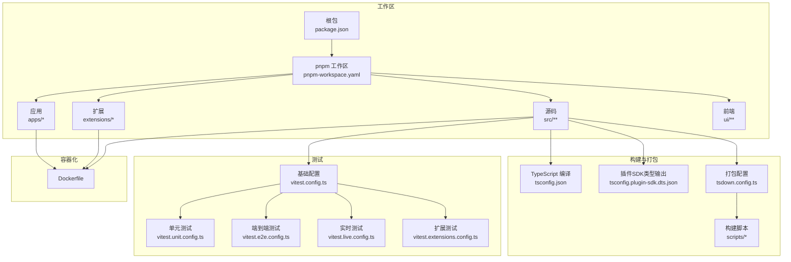
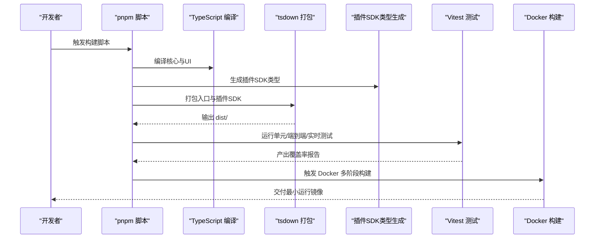
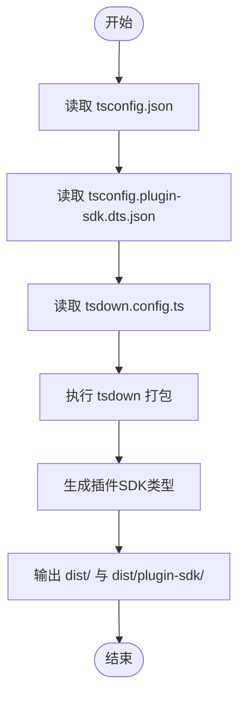
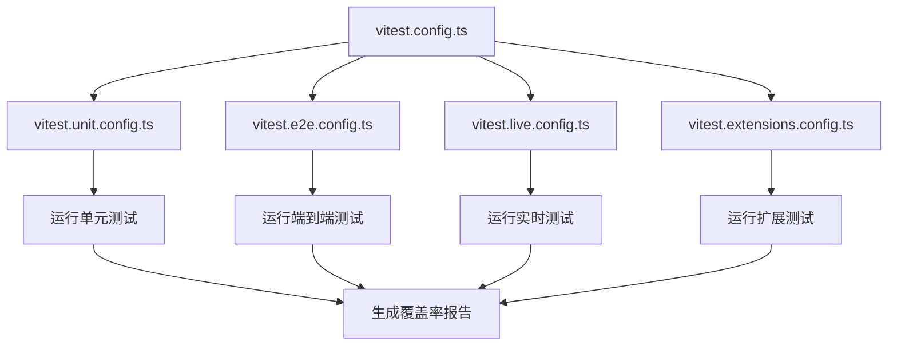
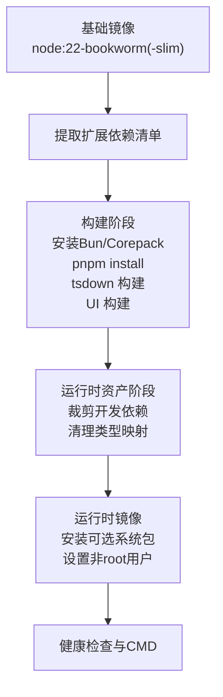
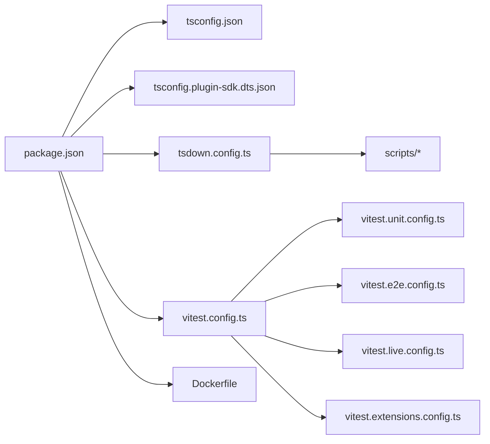

# 构建系统与工具链

<cite>
**本文引用的文件**
- [package.json](file://package.json)
- [tsconfig.json](file://tsconfig.json)
- [tsconfig.plugin-sdk.dts.json](file://tsconfig.plugin-sdk.dts.json)
- [tsdown.config.ts](file://tsdown.config.ts)
- [vitest.config.ts](file://vitest.config.ts)
- [vitest.unit.config.ts](file://vitest.unit.config.ts)
- [vitest.e2e.config.ts](file://vitest.e2e.config.ts)
- [vitest.live.config.ts](file://vitest.live.config.ts)
- [vitest.extensions.config.ts](file://vitest.extensions.config.ts)
- [Dockerfile](file://Dockerfile)
- [pnpm-workspace.yaml](file://pnpm-workspace.yaml)
- [scripts/tsdown-build.mjs](file://scripts/tsdown-build.mjs)
- [scripts/write-plugin-sdk-entry-dts.ts](file://scripts/write-plugin-sdk-entry-dts.ts)
- [scripts/copy-plugin-sdk-root-alias.mjs](file://scripts/copy-plugin-sdk-root-alias.mjs)
- [knip.config.ts](file://knip.config.ts)
</cite>

## 目录

1. [简介](#简介)
2. [项目结构](#项目结构)
3. [核心组件](#核心组件)
4. [架构总览](#架构总览)
5. [详细组件分析](#详细组件分析)
6. [依赖关系分析](#依赖关系分析)
7. [性能考量](#性能考量)
8. [故障排查指南](#故障排查指南)
9. [结论](#结论)
10. [附录](#附录)

## 简介

本文件系统性梳理本项目的构建系统与工具链，覆盖以下方面：

- 构建流程与自动化脚本：基于 package.json 的脚本命令、TypeScript 编译与打包、插件 SDK 类型生成与导出。
- 测试体系：基于 Vitest 的单元、端到端、实时测试配置与策略。
- 容器化与多平台构建：Docker 多阶段构建、变体选择、运行时优化与可选组件注入。
- 持续集成与持续部署：通过脚本与配置体现的 CI 友好实践与产物发布准备。
- 工具链可视化：构建流程图与工具链说明，帮助开发者快速理解自动化构建与发布机制。

## 项目结构

本项目采用 monorepo 结构，根目录通过 pnpm workspace 管理多个子包与应用，包括：

- 核心运行时与源码：src、extensions、apps、ui 等。
- 构建与打包：tsdown 配置、TypeScript 编译配置、Dockerfile。
- 测试：多套 Vitest 配置文件，分别覆盖单元、端到端、扩展测试等场景。
- 质量与维护：knip 死代码检测、oxlint/oxfmt、SwiftLint/SwiftFormat、文档检查脚本等。

图表来源

- [package.json:1-467](file://package.json#L1-L467)
- [pnpm-workspace.yaml:1-20](file://pnpm-workspace.yaml#L1-L20)
- [tsconfig.json:1-29](file://tsconfig.json#L1-L29)
- [tsconfig.plugin-sdk.dts.json:1-62](file://tsconfig.plugin-sdk.dts.json#L1-L62)
- [tsdown.config.ts:1-132](file://tsdown.config.ts#L1-L132)
- [vitest.config.ts:1-203](file://vitest.config.ts#L1-L203)
- [vitest.unit.config.ts:1-31](file://vitest.unit.config.ts#L1-L31)
- [vitest.e2e.config.ts:1-33](file://vitest.e2e.config.ts#L1-L33)
- [vitest.live.config.ts:1-17](file://vitest.live.config.ts#L1-L17)
- [vitest.extensions.config.ts:1-4](file://vitest.extensions.config.ts#L1-L4)
- [Dockerfile:1-231](file://Dockerfile#L1-L231)

章节来源

- [package.json:1-467](file://package.json#L1-L467)
- [pnpm-workspace.yaml:1-20](file://pnpm-workspace.yaml#L1-L20)

## 核心组件

- 包管理与工作区
  - 使用 pnpm workspace 管理根包与子包，统一安装与构建入口。
  - 仅构建依赖项在工作区层声明，减少不必要的二进制安装。
- TypeScript 编译与打包
  - 基础 tsconfig 提供严格类型检查与模块解析规则。
  - 插件 SDK 类型单独输出，配合导出映射实现按需类型加载。
  - tsdown 作为打包器，集中定义入口与输出目录，确保产物稳定。
- 测试框架
  - 基于 Vitest 的多配置矩阵：单元、端到端、实时、扩展测试，隔离不同测试面。
  - 覆盖率策略聚焦核心业务，排除大量集成与 UI 层以保证阈值稳定。
- 容器化与多平台
  - Docker 多阶段构建，支持 slim/base 变体与可选系统包注入。
  - 运行时非 root 用户、健康检查、CLI 快捷链接，便于生产部署。
- 质量与维护
  - knip 死代码检测，结合 ts-prune/ts-unused-exports 形成 CI 报告流水线。
  - 文档与代码格式化、SwiftLint/SwiftFormat、重复代码扫描等。

章节来源

- [package.json:1-467](file://package.json#L1-L467)
- [tsconfig.json:1-29](file://tsconfig.json#L1-L29)
- [tsconfig.plugin-sdk.dts.json:1-62](file://tsconfig.plugin-sdk.dts.json#L1-L62)
- [tsdown.config.ts:1-132](file://tsdown.config.ts#L1-L132)
- [vitest.config.ts:1-203](file://vitest.config.ts#L1-L203)
- [Dockerfile:1-231](file://Dockerfile#L1-L231)
- [knip.config.ts:1-106](file://knip.config.ts#L1-L106)

## 架构总览

下图展示从开发到发布的典型构建与测试路径，以及容器化部署的关键节点。

图表来源

- [package.json:217-341](file://package.json#L217-L341)
- [scripts/tsdown-build.mjs:1-20](file://scripts/tsdown-build.mjs#L1-L20)
- [scripts/write-plugin-sdk-entry-dts.ts:1-61](file://scripts/write-plugin-sdk-entry-dts.ts#L1-L61)
- [scripts/copy-plugin-sdk-root-alias.mjs:1-11](file://scripts/copy-plugin-sdk-root-alias.mjs#L1-L11)
- [Dockerfile:39-91](file://Dockerfile#L39-L91)

## 详细组件分析

### 构建脚本与自动化流程

- 根包脚本职责
  - Android/iOS 开发与测试：Gradle 与 Xcode 构建链路，模拟器启动与安装。
  - 构建主流程：A2UI 打包、tsdown 构建、插件SDK类型生成、拷贝元数据与构建信息。
  - UI 构建：独立 UI 工作区的构建与开发服务器。
  - 协议生成：跨语言协议生成与 Swift 同步校验。
  - 测试驱动：并行测试、覆盖率、端到端与实时测试。
  - 发布与校验：版本发布检查、NPM 发布检查。
- 关键构建步骤
  - A2UI 打包：Canvas A2UI 资源打包，失败时生成占位以支持交叉编译。
  - tsdown 构建：集中入口与输出目录，避免重复构建。
  - 插件SDK类型：为每个子路径生成稳定入口 d.ts，匹配导出映射。
  - 元数据写入：构建信息、CLI 启动元数据、兼容性标记等。
- CI 友好设计
  - 并行度自适应：根据 CPU 数量与平台动态设置 worker 数。
  - 日志控制：可通过环境变量控制 tsdown 日志冗余。
  - 产物裁剪：生产环境裁剪开发依赖与类型映射文件。

章节来源

- [package.json:217-341](file://package.json#L217-L341)
- [scripts/tsdown-build.mjs:1-20](file://scripts/tsdown-build.mjs#L1-L20)
- [scripts/write-plugin-sdk-entry-dts.ts:1-61](file://scripts/write-plugin-sdk-entry-dts.ts#L1-L61)
- [scripts/copy-plugin-sdk-root-alias.mjs:1-11](file://scripts/copy-plugin-sdk-root-alias.mjs#L1-L11)

### TypeScript 编译与打包配置

- 基础编译选项
  - NodeNext 模块与解析，严格模式，目标 ES2023，启用装饰器与 JSON 模块。
  - 路径别名指向 src/plugin-sdk 下的入口与子路径，便于插件 SDK 使用。
- 插件 SDK 类型输出
  - 单独 tsconfig 仅输出类型，指定 rootDir 与 outDir，避免测试文件参与。
  - 与导出映射一一对应，确保按需类型加载。
- 打包配置
  - tsdown 定义核心入口、通道动作模块、钩子、扩展 API、插件 SDK 子路径等。
  - 统一环境变量与日志过滤，提升 CI 可读性。

图表来源

- [tsconfig.json:1-29](file://tsconfig.json#L1-L29)
- [tsconfig.plugin-sdk.dts.json:1-62](file://tsconfig.plugin-sdk.dts.json#L1-L62)
- [tsdown.config.ts:1-132](file://tsdown.config.ts#L1-L132)

章节来源

- [tsconfig.json:1-29](file://tsconfig.json#L1-L29)
- [tsconfig.plugin-sdk.dts.json:1-62](file://tsconfig.plugin-sdk.dts.json#L1-L62)
- [tsdown.config.ts:1-132](file://tsdown.config.ts#L1-L132)

### 测试配置与策略

- 基础配置
  - 别名映射插件 SDK 子路径，确保测试中可直接导入。
  - 默认 fork 池，Windows 上延长 hook 超时，适配平台差异。
  - 覆盖率提供者为 v8，阈值面向核心代码，排除大量集成与 UI 层。
- 分类配置
  - 单元测试：排除网关、各渠道、Web、浏览器等集成面，聚焦纯逻辑。
  - 端到端测试：强制进程池，限制并发，默认单 worker 或按 CPU 百分比计算。
  - 实时测试：串行执行，适合外部服务联调。
  - 扩展测试：针对 extensions/\* 的测试集合。
- CI 行为
  - 自适应 worker 数，Windows 上更保守；支持通过环境变量覆盖。
  - 通过多套配置文件隔离不同测试面，降低相互干扰。

图表来源

- [vitest.config.ts:1-203](file://vitest.config.ts#L1-L203)
- [vitest.unit.config.ts:1-31](file://vitest.unit.config.ts#L1-L31)
- [vitest.e2e.config.ts:1-33](file://vitest.e2e.config.ts#L1-L33)
- [vitest.live.config.ts:1-17](file://vitest.live.config.ts#L1-L17)
- [vitest.extensions.config.ts:1-4](file://vitest.extensions.config.ts#L1-L4)

章节来源

- [vitest.config.ts:1-203](file://vitest.config.ts#L1-L203)
- [vitest.unit.config.ts:1-31](file://vitest.unit.config.ts#L1-L31)
- [vitest.e2e.config.ts:1-33](file://vitest.e2e.config.ts#L1-L33)
- [vitest.live.config.ts:1-17](file://vitest.live.config.ts#L1-L17)
- [vitest.extensions.config.ts:1-4](file://vitest.extensions.config.ts#L1-L4)

### Docker 容器化与多平台构建

- 多阶段构建
  - 提取扩展依赖清单，避免无关源变更导致缓存失效。
  - 构建阶段安装 Bun 与 Corepack，执行构建与 UI 打包。
  - 运行时资产阶段裁剪开发依赖与类型映射，减小镜像体积。
- 运行时变体
  - 支持默认与 slim 两种基础镜像，标签固定到 SHA256 以保证可复现。
  - 可选安装 Chromium/Xvfb、Docker CLI，满足沙箱与自动化需求。
- 安全与可用性
  - 非 root 用户运行，暴露健康检查端点，支持 loopback/lan 绑定。
  - 提供 CLI 快捷链接，便于容器内直接调用。

图表来源

- [Dockerfile:12-231](file://Dockerfile#L12-L231)

章节来源

- [Dockerfile:1-231](file://Dockerfile#L1-L231)

### 持续集成与持续部署

- CI 友好特性
  - 自适应 worker 数：根据 CI 平台与 CPU 动态调整，Windows 更保守。
  - 日志与超时：过滤冗余日志，延长 Windows 上的 hook 超时。
  - 覆盖率锚定：仅统计实际被测试覆盖的源码，避免随子包增长而漂移。
- 发布前检查
  - 版本发布检查与 NPM 发布检查脚本，保障发布一致性。
- 容器化发布
  - Docker 多阶段构建与变体选择，适配不同部署场景。
  - 运行时镜像包含 pnpm 与 Corepack，便于容器内本地工作流。

章节来源

- [vitest.config.ts:7-11](file://vitest.config.ts#L7-L11)
- [vitest.config.ts:71-81](file://vitest.config.ts#L71-L81)
- [package.json:297-298](file://package.json#L297-L298)
- [Dockerfile:138-146](file://Dockerfile#L138-L146)

## 依赖关系分析

- 工作区与包管理
  - pnpm workspace 将根包与子包统一管理，onlyBuiltDependencies 明确二进制依赖范围。
- 构建链路耦合
  - tsdown 依赖 tsconfig 与 tsconfig.plugin-sdk.dts.json 的输出约定。
  - 插件 SDK 类型生成脚本与导出映射强耦合，需同步维护。
- 测试隔离
  - 不同 Vitest 配置通过 include/exclude 与 pool 设置实现测试面隔离。
- 容器化依赖
  - Docker 构建阶段依赖 Bun 与 Corepack，运行时阶段依赖 apt 包与 Playwright 缓存。

图表来源

- [package.json:1-467](file://package.json#L1-L467)
- [tsconfig.json:1-29](file://tsconfig.json#L1-L29)
- [tsconfig.plugin-sdk.dts.json:1-62](file://tsconfig.plugin-sdk.dts.json#L1-L62)
- [tsdown.config.ts:1-132](file://tsdown.config.ts#L1-L132)
- [vitest.config.ts:1-203](file://vitest.config.ts#L1-L203)
- [Dockerfile:1-231](file://Dockerfile#L1-L231)

章节来源

- [package.json:1-467](file://package.json#L1-L467)
- [tsconfig.json:1-29](file://tsconfig.json#L1-L29)
- [tsdown.config.ts:1-132](file://tsdown.config.ts#L1-L132)
- [vitest.config.ts:1-203](file://vitest.config.ts#L1-L203)
- [Dockerfile:1-231](file://Dockerfile#L1-L231)

## 性能考量

- 并行与资源
  - Vitest 在 CI 上按 CPU 百分比或固定数限制 worker，Windows 上更保守。
  - Docker 构建阶段限制 Node 内存上限，降低低内存主机上的 OOM 风险。
- 构建优化
  - tsdown 过滤 PLUGIN_TIMINGS 日志，减少 CI 日志噪音。
  - 插件 SDK 类型与入口分离，避免重复编译与打包。
- 运行时优化
  - 运行时裁剪开发依赖与类型映射，显著减小镜像体积。
  - 可选安装 Playwright 与 Docker CLI，换取启动时间与功能覆盖。

章节来源

- [vitest.config.ts:7-11](file://vitest.config.ts#L7-L11)
- [Dockerfile:56-59](file://Dockerfile#L56-L59)
- [tsdown.config.ts:14-31](file://tsdown.config.ts#L14-L31)
- [Dockerfile:86-91](file://Dockerfile#L86-L91)

## 故障排查指南

- 构建失败（A2UI 打包）
  - 现象：交叉编译环境下 A2UI 打包失败。
  - 处理：脚本会创建占位文件，确保本地交叉编译仍可完成。
  - 参考：[Dockerfile:72-81](file://Dockerfile#L72-L81)
- tsdown 日志过多
  - 现象：CI 日志冗长。
  - 处理：通过环境变量控制日志级别，或在本地禁用详细日志。
  - 参考：[scripts/tsdown-build.mjs:5](file://scripts/tsdown-build.mjs#L5)
- 插件 SDK 类型不一致
  - 现象：导出映射与类型入口不匹配。
  - 处理：确认入口列表与导出映射一致，并重新生成类型入口。
  - 参考：[scripts/write-plugin-sdk-entry-dts.ts:54-60](file://scripts/write-plugin-sdk-entry-dts.ts#L54-L60)
- Docker 构建 OOM
  - 现象：依赖安装阶段被杀。
  - 处理：增大内存上限或使用缓存，参考 Dockerfile 中的内存参数。
  - 参考：[Dockerfile:56-59](file://Dockerfile#L56-L59)
- 测试超时或泄漏
  - 现象：Windows 上测试超时或环境泄漏。
  - 处理：使用 fork 池与 unstubEnvs/unstubGlobals，必要时降低并发。
  - 参考：[vitest.config.ts:71-81](file://vitest.config.ts#L71-L81)

章节来源

- [Dockerfile:72-81](file://Dockerfile#L72-L81)
- [scripts/tsdown-build.mjs:5](file://scripts/tsdown-build.mjs#L5)
- [scripts/write-plugin-sdk-entry-dts.ts:54-60](file://scripts/write-plugin-sdk-entry-dts.ts#L54-L60)
- [Dockerfile:56-59](file://Dockerfile#L56-L59)
- [vitest.config.ts:71-81](file://vitest.config.ts#L71-L81)

## 结论

本项目的构建系统与工具链围绕 monorepo 结构展开，通过 pnpm workspace、TypeScript 编译与 tsdown 打包、多维 Vitest 测试配置、Docker 多阶段构建与变体选择，形成了从开发到生产的完整自动化流水线。其关键优势在于：

- 清晰的职责划分与可维护的配置矩阵；
- CI 友好的自适应行为与严格的覆盖率策略；
- 生产就绪的容器化与安全加固；
- 与插件 SDK 的深度集成与类型稳定性。

建议在后续迭代中持续完善：

- 保持插件 SDK 入口与导出映射的同步；
- 在 CI 中引入死代码检测报告归档；
- 对 Docker 变体与可选组件进行版本化标注，便于追踪。

## 附录

- 常用脚本速览
  - 构建：根包构建、Docker 构建、UI 构建、插件 SDK 类型生成。
  - 测试：单元、端到端、实时、扩展测试，覆盖率收集。
  - 质量：格式化、lint、文档检查、重复代码扫描、死代码检测。
- 关键配置文件清单
  - TypeScript：tsconfig.json、tsconfig.plugin-sdk.dts.json、tsdown.config.ts
  - 测试：vitest.config.ts、vitest.unit.config.ts、vitest.e2e.config.ts、vitest.live.config.ts、vitest.extensions.config.ts
  - 容器化：Dockerfile
  - 工作区：pnpm-workspace.yaml
  - 质量：knip.config.ts
