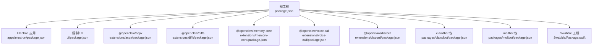
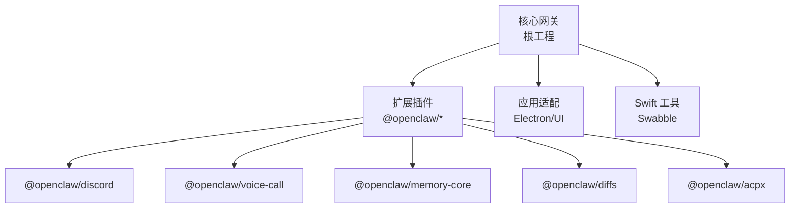
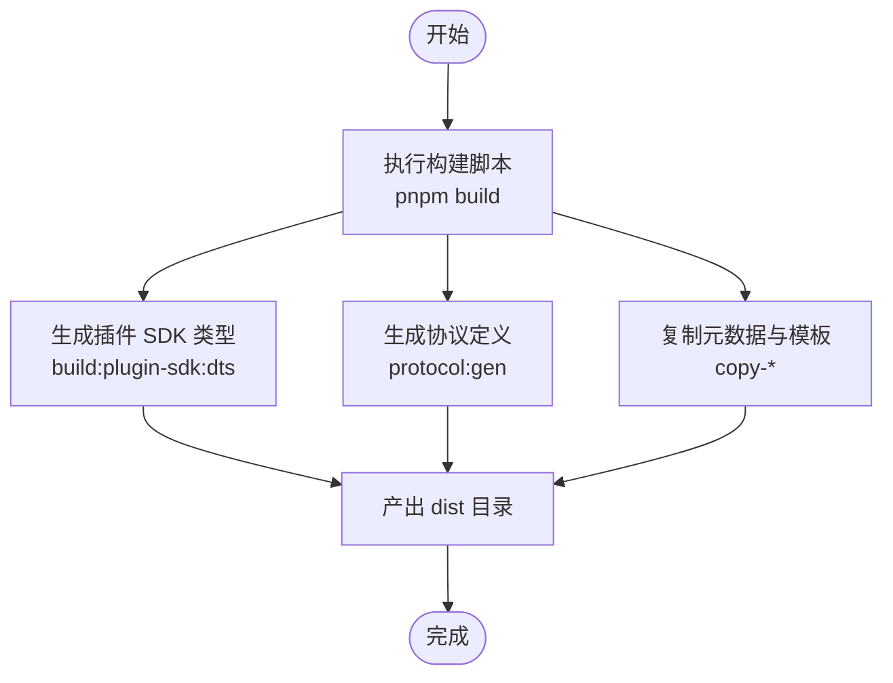
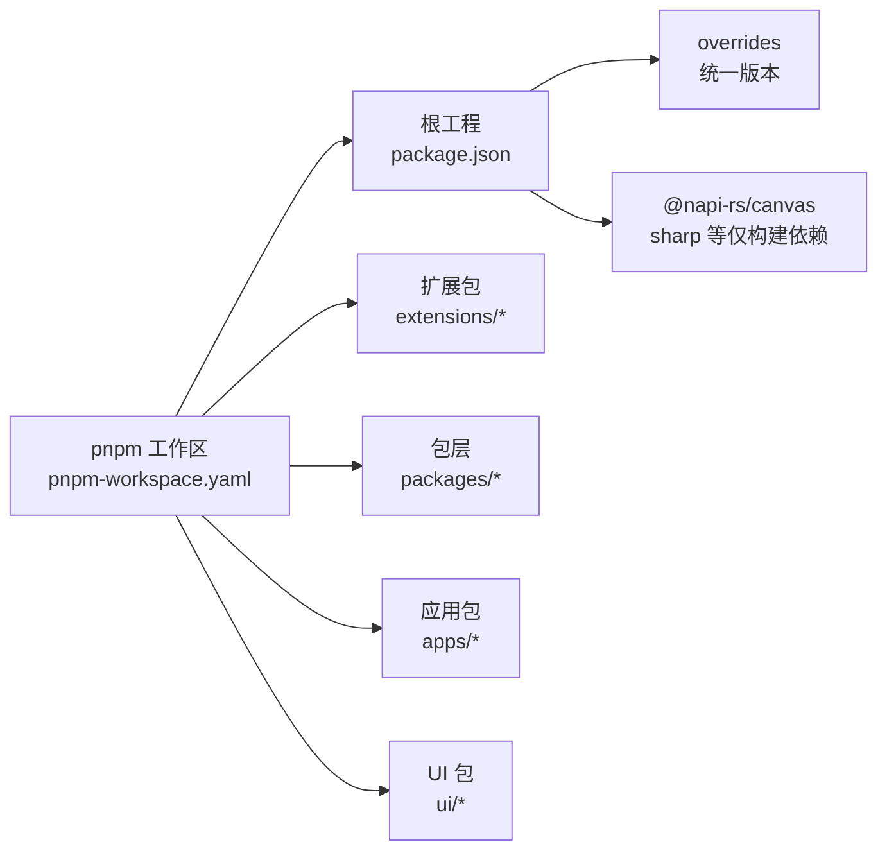
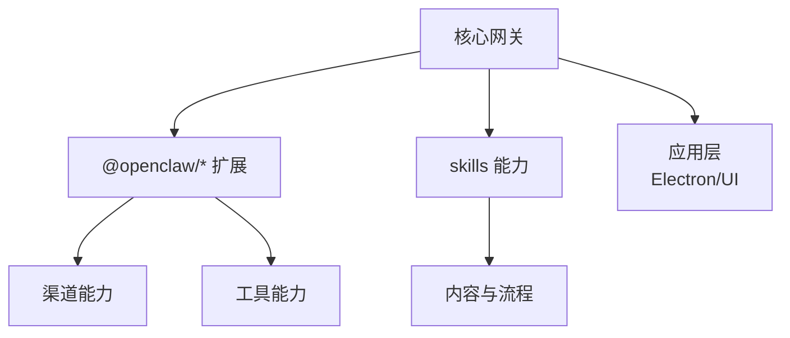

# 模块依赖关系

<cite>
**本文引用的文件**
- [package.json](file://package.json)
- [pnpm-workspace.yaml](file://pnpm-workspace.yaml)
- [apps/electron/package.json](file://apps/electron/package.json)
- [ui/package.json](file://ui/package.json)
- [Swabble/Package.swift](file://Swabble/Package.swift)
- [tsconfig.json](file://tsconfig.json)
- [tsconfig.plugin-sdk.dts.json](file://tsconfig.plugin-sdk.dts.json)
- [packages/clawdbot/package.json](file://packages/clawdbot/package.json)
- [packages/moltbot/package.json](file://packages/moltbot/package.json)
- [extensions/acpx/package.json](file://extensions/acpx/package.json)
- [extensions/diffs/package.json](file://extensions/diffs/package.json)
- [extensions/memory-core/package.json](file://extensions/memory-core/package.json)
- [extensions/voice-call/package.json](file://extensions/voice-call/package.json)
- [extensions/discord/package.json](file://extensions/discord/package.json)
</cite>

## 目录

1. [简介](#简介)
2. [项目结构](#项目结构)
3. [核心组件](#核心组件)
4. [架构总览](#架构总览)
5. [详细组件分析](#详细组件分析)
6. [依赖分析](#依赖分析)
7. [性能考量](#性能考量)
8. [故障排查指南](#故障排查指南)
9. [结论](#结论)
10. [附录](#附录)

## 简介

本文件聚焦于 OpenClaw 的模块依赖关系与工作区（workspace）管理策略，系统梳理以下方面：

- 根工程 package.json 中的依赖关系、版本约束与兼容性要求
- pnpm 工作区如何统一管理内部包的版本同步与依赖解析
- 外部依赖的选择标准与第三方库集成方式
- 模块间耦合度与内聚性设计：核心模块、扩展模块与技能模块的依赖层次
- 提供依赖关系图与模块交互说明，帮助开发者快速理解系统的模块化架构与扩展机制

## 项目结构

该项目采用 monorepo 架构，使用 pnpm workspace 统一管理多个子包与应用：

- 根工程：包含核心 CLI、构建脚本、测试与发布流程
- 应用层：Electron 桌面端、Web 控制 UI
- 扩展层：以插件形式提供的渠道与能力扩展（如 Discord、Telegram、Voice Call 等）
- 包层：兼容性包装器（clawdbot、moltbot）
- Swift 工程：Swabble（独立的 Swift 工具链与目标）

图表来源

- [package.json:1-467](file://package.json#L1-L467)
- [apps/electron/package.json:1-28](file://apps/electron/package.json#L1-L28)
- [ui/package.json:1-28](file://ui/package.json#L1-L28)
- [extensions/acpx/package.json:1-15](file://extensions/acpx/package.json#L1-L15)
- [extensions/diffs/package.json:1-21](file://extensions/diffs/package.json#L1-L21)
- [extensions/memory-core/package.json:1-24](file://extensions/memory-core/package.json#L1-L24)
- [extensions/voice-call/package.json:1-18](file://extensions/voice-call/package.json#L1-L18)
- [extensions/discord/package.json:1-12](file://extensions/discord/package.json#L1-L12)
- [packages/clawdbot/package.json:1-17](file://packages/clawdbot/package.json#L1-L17)
- [packages/moltbot/package.json:1-17](file://packages/moltbot/package.json#L1-L17)
- [Swabble/Package.swift:1-56](file://Swabble/Package.swift#L1-L56)

章节来源

- [package.json:1-467](file://package.json#L1-L467)
- [pnpm-workspace.yaml:1-20](file://pnpm-workspace.yaml#L1-L20)

## 核心组件

- 根工程与 CLI 入口
  - 根工程通过 exports 字段导出多套插件 SDK 子路径，便于扩展按需加载与类型提示
  - 脚本集中管理构建、测试、协议生成、UI 构建等流程
- 应用层
  - Electron 应用：独立的桌面客户端，依赖 tsup、electron-builder 进行打包
  - 控制 UI：基于 Vite 的前端应用，使用 Lit 与信号库构建交互界面
- 扩展层（插件）
  - 以 @openclaw 前缀命名的扩展包，通过 openclaw 字段声明入口文件，实现对核心网关的扩展
- 包层（兼容性包装）
  - clawdbot 与 moltbot 将自身作为 openclaw 的二进制别名，保持命令行兼容
- Swift 工程
  - Swabble 使用 Swift Package Manager 定义可复用库与 CLI 目标，并声明平台要求

章节来源

- [package.json:37-216](file://package.json#L37-L216)
- [apps/electron/package.json:1-28](file://apps/electron/package.json#L1-L28)
- [ui/package.json:1-28](file://ui/package.json#L1-L28)
- [packages/clawdbot/package.json:1-17](file://packages/clawdbot/package.json#L1-L17)
- [packages/moltbot/package.json:1-17](file://packages/moltbot/package.json#L1-L17)
- [Swabble/Package.swift:1-56](file://Swabble/Package.swift#L1-L56)

## 架构总览

OpenClaw 的模块化架构围绕“核心网关 + 插件生态 + 应用适配”展开：

- 核心网关：由根工程提供 CLI、协议生成、类型导出与构建脚本
- 插件生态：以扩展包形式提供渠道与能力，遵循 openclaw 扩展约定
- 应用适配：Electron 与 Web UI 分别面向桌面与浏览器场景
- 平台工具：Swabble 提供 Swift 工具链支持

图表来源

- [package.json:1-467](file://package.json#L1-L467)
- [extensions/discord/package.json:1-12](file://extensions/discord/package.json#L1-L12)
- [extensions/voice-call/package.json:1-18](file://extensions/voice-call/package.json#L1-L18)
- [extensions/memory-core/package.json:1-24](file://extensions/memory-core/package.json#L1-L24)
- [extensions/diffs/package.json:1-21](file://extensions/diffs/package.json#L1-L21)
- [extensions/acpx/package.json:1-15](file://extensions/acpx/package.json#L1-L15)
- [Swabble/Package.swift:1-56](file://Swabble/Package.swift#L1-L56)

## 详细组件分析

### 根工程与插件 SDK 导出

- 插件 SDK 导出
  - 通过 exports 字段为每个插件通道提供独立的类型与运行时入口，便于按需引入与类型推断
- 构建与类型
  - TypeScript 配置启用 NodeNext 模式与严格模式；插件 SDK 类型单独编译输出到 dist/plugin-sdk
- CLI 入口
  - bin 字段绑定 openclaw 可执行文件，脚本中大量任务围绕该入口组织

图表来源

- [package.json:226-229](file://package.json#L226-L229)
- [package.json:294-296](file://package.json#L294-L296)
- [tsconfig.plugin-sdk.dts.json:1-62](file://tsconfig.plugin-sdk.dts.json#L1-L62)

章节来源

- [package.json:37-216](file://package.json#L37-L216)
- [package.json:226-229](file://package.json#L226-L229)
- [package.json:294-296](file://package.json#L294-L296)
- [tsconfig.json:1-29](file://tsconfig.json#L1-L29)
- [tsconfig.plugin-sdk.dts.json:1-62](file://tsconfig.plugin-sdk.dts.json#L1-L62)

### Electron 应用

- 依赖与脚本
  - 通过 tsup 构建主进程，Vite 启动渲染器开发服务器，electron-builder 打包
- 工作区集成
  - 作为独立包存在于 workspace，与根工程共享 pnpm 配置与依赖解析策略

章节来源

- [apps/electron/package.json:1-28](file://apps/electron/package.json#L1-L28)
- [pnpm-workspace.yaml:1-20](file://pnpm-workspace.yaml#L1-L20)

### 控制 UI（Web）

- 技术栈
  - Vite + Lit + marked + DOMPurify + Playwright 测试
- 开发与测试
  - 提供 dev、build、preview、test 等脚本，与根工程测试体系协同

章节来源

- [ui/package.json:1-28](file://ui/package.json#L1-L28)

### 扩展插件（示例）

- acpx 扩展
  - 依赖 acpx 运行时，通过 openclaw.extensions 指定入口
- diffs 扩展
  - 内置构建脚本用于生成浏览器端查看器；依赖 playwright-core 与 @pierre/diffs
- memory-core 扩展
  - 作为可选 peer 依赖 openclaw，声明 optional=true，允许在不强制安装核心的情况下使用
- voice-call 扩展
  - 依赖 commander、ws、zod 等，提供语音通话能力
- discord 扩展
  - 最小化声明，仅指定入口文件

章节来源

- [extensions/acpx/package.json:1-15](file://extensions/acpx/package.json#L1-L15)
- [extensions/diffs/package.json:1-21](file://extensions/diffs/package.json#L1-L21)
- [extensions/memory-core/package.json:1-24](file://extensions/memory-core/package.json#L1-L24)
- [extensions/voice-call/package.json:1-18](file://extensions/voice-call/package.json#L1-L18)
- [extensions/discord/package.json:1-12](file://extensions/discord/package.json#L1-L12)

### 包层（兼容性包装）

- clawdbot 与 moltbot
  - 通过依赖 openclaw: workspace:\* 将自身作为 openclaw 的别名，确保命令行兼容

章节来源

- [packages/clawdbot/package.json:1-17](file://packages/clawdbot/package.json#L1-L17)
- [packages/moltbot/package.json:1-17](file://packages/moltbot/package.json#L1-L17)

### Swift 工具（Swabble）

- 目标与产品
  - 定义 Swabble、SwabbleKit 库与 swabble 可执行目标
- 依赖与平台
  - 依赖 Commander 与 swift-testing；声明 macOS/iOS 平台最低版本

章节来源

- [Swabble/Package.swift:1-56](file://Swabble/Package.swift#L1-L56)

## 依赖分析

### 根工程依赖关系与版本约束

- 生产依赖（节选）
  - @agentclientprotocol/sdk、@aws-sdk/client-bedrock、@clack/prompts、@discordjs/voice、grammy、hono、ws、yaml、zod 等
  - 版本约束多采用 carets（^）或固定版本；部分通过 overrides 在 workspace 层统一锁定
- 开发依赖
  - Vitest、oxlint、typescript、playwright 等，支撑测试与代码质量
- Peer 依赖
  - @napi-rs/canvas、node-llama-cpp 作为可选能力，避免强制安装
- 引擎与包管理器
  - Node >= 22.12.0；使用 pnpm@10.23.0

章节来源

- [package.json:342-397](file://package.json#L342-L397)
- [package.json:398-419](file://package.json#L398-L419)
- [package.json:420-427](file://package.json#L420-L427)
- [package.json:428-466](file://package.json#L428-L466)

### pnpm 工作区与版本同步

- 工作区范围
  - 根目录、ui、ui-react、apps/electron、packages/_、extensions/_
- 仅构建依赖
  - 对原生/二进制依赖（如 @napi-rs/canvas、node-llama-cpp、sharp 等）进行 onlyBuiltDependencies 管控，减少不必要的二进制下载与安装成本
- overrides
  - 在根工程 pnpm.overrides 中统一某些包版本，确保依赖树一致性与安全修复

图表来源

- [pnpm-workspace.yaml:1-20](file://pnpm-workspace.yaml#L1-L20)
- [package.json:428-466](file://package.json#L428-L466)

章节来源

- [pnpm-workspace.yaml:1-20](file://pnpm-workspace.yaml#L1-L20)
- [package.json:428-466](file://package.json#L428-L466)

### 外部依赖选择标准与集成方式

- 选择标准
  - 与业务场景契合（如 Discord/Telegram 渠道接入）、生态成熟度、社区活跃度、安全性与维护状态
- 集成方式
  - 通过 npm 包直接依赖；对原生能力使用 onlyBuiltDependencies 管控；对存在安全风险的包通过 overrides 替换
- 类型与协议
  - 通过 exports 与 tsconfig.paths 映射插件 SDK，确保类型与运行时一致

章节来源

- [package.json:342-397](file://package.json#L342-L397)
- [package.json:428-466](file://package.json#L428-L466)
- [tsconfig.json:20-24](file://tsconfig.json#L20-L24)

### 模块间耦合度与内聚性设计

- 核心模块
  - 根工程提供 CLI、协议生成、插件 SDK 导出与构建脚本，内聚于“网关核心”
- 扩展模块
  - 以 @openclaw/\* 形式提供渠道与能力，通过 openclaw.extensions 约定解耦核心与实现
  - memory-core 作为可选 peer 依赖，降低核心体积与安装负担
- 技能模块
  - 位于 skills 目录，与扩展插件互补，共同构成“能力与内容”的扩展层
- 应用模块
  - Electron 与 UI 作为适配层，与核心通过 CLI/协议交互，低耦合高内聚

图表来源

- [package.json:37-216](file://package.json#L37-L216)
- [extensions/memory-core/package.json:10-17](file://extensions/memory-core/package.json#L10-L17)

章节来源

- [package.json:37-216](file://package.json#L37-L216)
- [extensions/memory-core/package.json:10-17](file://extensions/memory-core/package.json#L10-L17)

## 性能考量

- 二进制依赖管控
  - 通过 onlyBuiltDependencies 限制原生依赖的安装范围，减少安装时间与磁盘占用
- 类型与构建分离
  - 插件 SDK 类型单独编译，避免全量重编译带来的开销
- 测试与检查并行化
  - 根工程脚本提供并行测试与检查任务，缩短反馈周期

章节来源

- [package.json:445-457](file://package.json#L445-L457)
- [tsconfig.plugin-sdk.dts.json:1-62](file://tsconfig.plugin-sdk.dts.json#L1-L62)
- [package.json:300-330](file://package.json#L300-L330)

## 故障排查指南

- 依赖冲突与版本漂移
  - 使用 overrides 在根工程统一关键包版本；定期执行 release:check 与 release:openclaw:npm:check
- 原生依赖安装失败
  - 确认 onlyBuiltDependencies 列表是否覆盖相关包；必要时清理缓存后重试
- 插件未被识别
  - 检查扩展包的 openclaw.extensions 字段与入口文件路径
- 类型缺失或不匹配
  - 确保已执行插件 SDK 类型生成脚本；核对 tsconfig.paths 与 exports 映射

章节来源

- [package.json:297-299](file://package.json#L297-L299)
- [package.json:428-466](file://package.json#L428-L466)
- [extensions/memory-core/package.json:18-22](file://extensions/memory-core/package.json#L18-L22)
- [tsconfig.json:20-24](file://tsconfig.json#L20-L24)

## 结论

本项目通过 pnpm workspace 实现了对多包与多语言（TypeScript/Swift）的统一管理，结合 exports 与插件 SDK 导出机制，形成了“核心网关 + 插件生态 + 应用适配”的清晰模块化架构。外部依赖通过 overrides 与 onlyBuiltDependencies 进行治理，既保证了功能完整性，又兼顾了性能与可维护性。扩展模块与技能模块的分层设计提升了内聚性与可演进性，为后续能力扩展提供了稳定基础。

## 附录

- 关键配置文件清单
  - 根工程：package.json、pnpm-workspace.yaml、tsconfig.json、tsconfig.plugin-sdk.dts.json
  - 应用层：apps/electron/package.json、ui/package.json
  - 扩展层：extensions/\*/package.json（示例：acpx、diffs、memory-core、voice-call、discord）
  - 包层：packages/clawdbot/package.json、packages/moltbot/package.json
  - Swift 工具：Swabble/Package.swift
