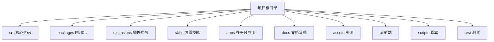
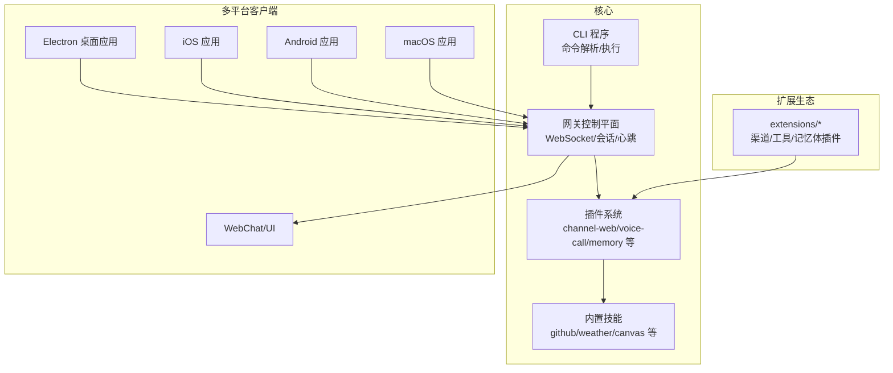
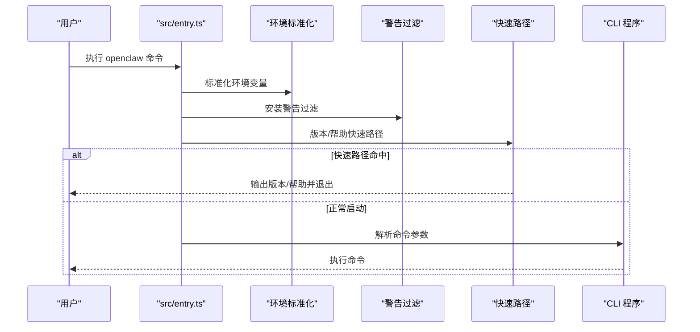
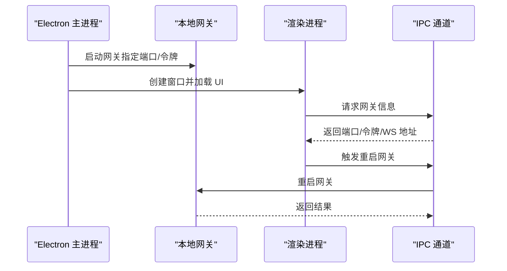
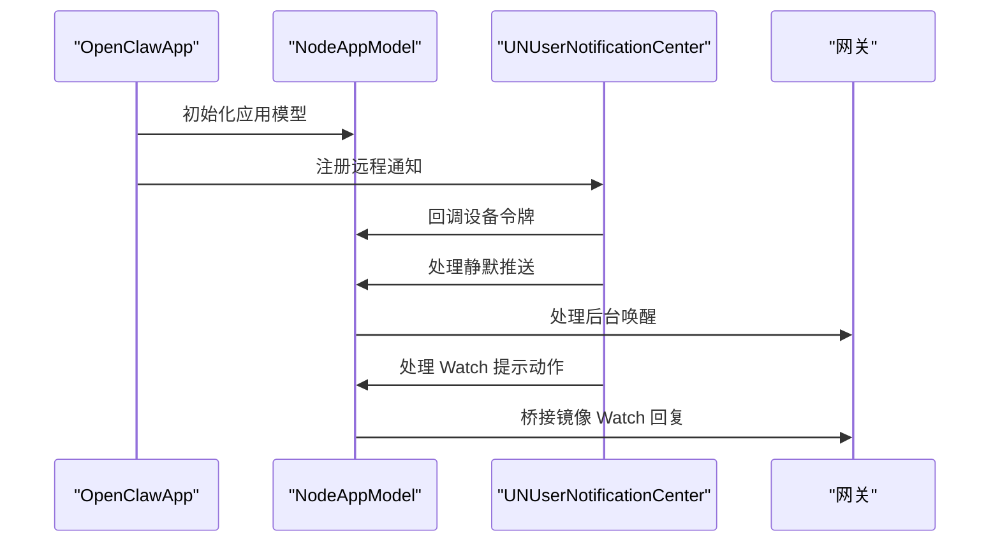
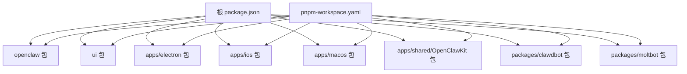

# 目录结构组织

<cite>
**本文档引用的文件**
- [README.md](file://README.md)
- [package.json](file://package.json)
- [pnpm-workspace.yaml](file://pnpm-workspace.yaml)
- [src/index.ts](file://src/index.ts)
- [src/entry.ts](file://src/entry.ts)
- [apps/electron/src/main/index.ts](file://apps/electron/src/main/index.ts)
- [apps/ios/Sources/OpenClawApp.swift](file://apps/ios/Sources/OpenClawApp.swift)
- [ui/src/main.ts](file://ui/src/main.ts)
- [packages/clawdbot/package.json](file://packages/clawdbot/package.json)
- [packages/moltbot/package.json](file://packages/moltbot/package.json)
</cite>

## 目录

1. [简介](#简介)
2. [项目结构概览](#项目结构概览)
3. [核心目录详解](#核心目录详解)
4. [架构总览](#架构总览)
5. [详细组件分析](#详细组件分析)
6. [依赖关系分析](#依赖关系分析)
7. [性能考虑](#性能考虑)
8. [故障排除指南](#故障排除指南)
9. [结论](#结论)

## 简介

OpenClaw 是一个在本地设备上运行的个人 AI 助手，支持多通道消息集成（如 WhatsApp、Telegram、Slack、Discord、Google Chat、Signal、iMessage、BlueBubbles、IRC、Microsoft Teams、Matrix、Feishu、LINE、Mattermost、Nextcloud Talk、Nostr、Synology Chat、Tlon、Twitch、Zalo、Zalo Personal、WebChat），并可在 macOS/iOS/Android 上进行语音唤醒和实时 Canvas 控制。其核心是一个网关控制平面，负责会话、渠道、工具和事件的统一管理。

本文件聚焦于项目根目录下顶级目录的职责、文件组织原则、命名约定、模块划分策略以及目录间的依赖关系与导入路径规范，帮助开发者快速定位和理解代码组织方式。

## 项目结构概览

项目采用 monorepo 结构，通过 pnpm workspace 管理多个包与子应用。顶层目录组织如下：

- **src**：核心 TypeScript 源码，包含 CLI、网关、通道、工具、内存、会话、安全、日志等子模块
- **packages**：内部兼容性包（clawdbot、moltbot），作为 openclaw 的别名或兼容层
- **extensions**：可插拔插件扩展，按渠道/功能拆分，每个插件有独立的 package.json 和 openclaw.plugin.json
- **skills**：内置技能集合，每个技能以目录形式存在，包含 SKILL.md 文档与脚本
- **apps**：多平台应用，包括 Android、Electron（桌面）、iOS、macOS、共享库 OpenClawKit
- **docs**：文档系统，涵盖概念、CLI、网关、平台、工具、提供商等文档
- **assets**：Chrome 扩展资源（manifest、脚本、图标）
- **ui**：前端 UI（Vite 构建），入口为 ui/src/main.ts
- **scripts**：构建、测试、发布、校验等自动化脚本
- **test / test-fixtures**：测试与夹具
- **其他**：根级配置文件（package.json、pnpm-workspace.yaml、各种 CI/配置文件）

**图表来源**

- [package.json:19-34](file://package.json#L19-L34)
- [pnpm-workspace.yaml:1-7](file://pnpm-workspace.yaml#L1-L7)

**章节来源**

- [README.md:1-50](file://README.md#L1-L50)
- [package.json:19-34](file://package.json#L19-L34)
- [pnpm-workspace.yaml:1-7](file://pnpm-workspace.yaml#L1-L7)

## 核心目录详解

### src 核心代码目录

职责与组织原则：

- **模块化分层**：按功能域划分子目录（agents、channels、cli、gateway、memory、plugins、tools 等），每个子目录内进一步细分具体能力
- **入口与导出**：通过 src/index.ts 暴露常用 API；src/entry.ts 作为 CLI 入口包装器，负责环境初始化、警告过滤、快速路径等
- **命名约定**：文件名使用小写加连字符（如 channel-web.ts），模块导出遵循清晰的命名空间（如 plugin-sdk/\*）
- **导入路径规范**：使用相对路径与工作区别名，避免硬编码绝对路径；monorepo 通过 pnpm workspace 解析依赖

关键文件与职责：

- src/index.ts：CLI 导出入口，集中导出常用函数与工具，便于外部使用
- src/entry.ts：CLI 启动流程包装，处理实验性警告抑制、版本/帮助快速路径、环境标准化等
- src/cli/：命令行程序构建与执行逻辑
- src/gateway/：网关控制平面（WebSocket、会话、心跳、远程访问等）
- src/channels/：各渠道适配器（Telegram、Discord、Slack、WhatsApp 等）
- src/plugins/ 与 src/plugin-sdk/：插件系统与 SDK，支持扩展开发
- src/memory/：内存与向量检索（lancedb 等）
- src/web/、src/browser/、src/canvas-host/：Web 控制界面、浏览器控制、Canvas 主机
- src/infra/：基础设施（二进制、环境、端口、错误处理等）
- src/shared/：跨模块共享类型与工具

导入路径示例（基于实际文件）：

- 从 src/index.ts 导入 CLI 依赖与会话工具
- 从 src/entry.ts 导入 CLI 参数解析、环境标准化、进程警告过滤等

**章节来源**

- [src/index.ts:1-94](file://src/index.ts#L1-L94)
- [src/entry.ts:1-195](file://src/entry.ts#L1-L195)

### packages 内部包

职责与组织原则：

- **兼容性与别名**：clawdbot 与 moltbot 作为 openclaw 的兼容层，提供二进制别名与导出映射，确保历史命令可用
- **工作区依赖**：通过 workspace:\* 引用 openclaw，实现 monorepo 内部共享

文件组织：

- packages/clawdbot/package.json：定义 clawdbot 二进制与导出，依赖 openclaw workspace
- packages/moltbot/package.json：定义 moltbot 二进制与导出，依赖 openclaw workspace

导入路径规范：

- 在其他包中通过 openclaw:workspace:\* 或相对路径引用内部包

**章节来源**

- [packages/clawdbot/package.json:1-17](file://packages/clawdbot/package.json#L1-L17)
- [packages/moltbot/package.json:1-17](file://packages/moltbot/package.json#L1-L17)

### extensions 插件扩展

职责与组织原则：

- **按渠道/功能拆分**：每个插件独立目录，包含 src/、index.ts、openclaw.plugin.json、package.json
- **插件清单**：openclaw.plugin.json 描述插件元数据与能力
- **SDK 导出**：package.json 的 exports 字段暴露 plugin-sdk/\* 子路径，供外部使用

文件组织与命名约定：

- 插件目录名与渠道/功能一致（如 discord、telegram、matrix、memory-lancedb 等）
- 每个插件独立的 package.json，声明依赖与导出
- index.ts 作为插件入口，通常导出插件初始化与能力注册

导入路径规范：

- 通过 openclaw:workspace:\* 或 monorepo 别名引用插件
- 使用 package.json 的 exports 映射访问特定 SDK 子模块

**章节来源**

- [package.json:37-216](file://package.json#L37-L216)

### skills 内置技能

职责与组织原则：

- **技能即目录**：每个技能以独立目录存在，包含 SKILL.md 文档与相关脚本
- **文档驱动**：SKILL.md 提供技能描述、使用方法与参考材料
- **脚本化工具**：部分技能包含 Python/Shell 脚本，用于增强功能

文件组织：

- 技能目录（如 github、weather、openai-whisper、canvas 等）
- 每个技能包含 SKILL.md 与必要的脚本目录（如 scripts/）

命名约定：

- 技能目录名简洁明确，与功能一一对应
- 文档文件统一命名为 SKILL.md

**章节来源**

- [README.md:458-478](file://README.md#L458-L478)

### apps 多平台应用

职责与组织原则：

- **平台专用**：Android、Electron（桌面）、iOS、macOS、共享库 OpenClawKit
- **独立构建**：每个平台拥有独立的构建脚本、配置与资源
- **共享组件**：OpenClawKit 提供跨平台共享的 Swift 组件

文件组织与命名约定：

- apps/android：Gradle 工程、基准测试、脚本
- apps/electron：主进程、预加载、渲染器、资源、打包配置
- apps/ios：SwiftUI 应用、组件、测试、快照、配置
- apps/macos：Swift 应用、测试、Package.swift
- apps/shared/OpenClawKit：共享 Swift 模块与工具

导入路径规范：

- 通过 pnpm workspace 将 apps/\* 与根包关联
- Electron 通过独立的 package.json 管理依赖
- iOS/macOS 通过 Xcodegen/Package.swift 管理 Swift 包

**章节来源**

- [apps/electron/src/main/index.ts:1-115](file://apps/electron/src/main/index.ts#L1-L115)
- [apps/ios/Sources/OpenClawApp.swift:1-542](file://apps/ios/Sources/OpenClawApp.swift#L1-L542)

### docs 文档系统

职责与组织原则：

- **内容分类**：概念、CLI、网关、平台、工具、提供商、诊断等
- **国际化**：.i18n 目录提供多语言术语表与翻译
- **资产与截图**：assets 目录存放展示图片、赞助商图标等

文件组织：

- docs/ 下按主题划分（concepts/、cli/、gateway/、platforms/、tools/、providers/ 等）
- docs/.i18n/ 存放多语言词典与翻译模板
- docs/assets/ 存放图片与资源

命名约定：

- 文件名使用小写加连字符，便于链接与搜索
- 目录按主题聚合，避免扁平化导致的维护困难

**章节来源**

- [README.md:415-432](file://README.md#L415-L432)

### assets 资源

职责与组织原则：

- **Chrome 扩展**：包含 manifest、后台脚本、选项页面与验证脚本
- **图标与静态资源**：icons/ 目录存放扩展图标

文件组织：

- assets/chrome-extension/：扩展相关文件（manifest.json、background.js、options.html 等）

命名约定：

- 文件名与扩展功能一一对应，便于识别与维护

**章节来源**

- [README.md:400-430](file://README.md#L400-L430)

### ui 前端

职责与组织原则：

- **Vite 构建**：ui 目录提供前端构建与开发脚本
- **入口文件**：ui/src/main.ts 作为前端入口，引入样式与应用组件

文件组织：

- ui/src/main.ts：前端入口
- ui/package.json：前端依赖与构建脚本
- ui/vite.config.ts：Vite 配置

导入路径规范：

- 通过 pnpm workspace 将 ui 与根包关联
- 前端通过 Vite 进行模块解析与打包

**章节来源**

- [ui/src/main.ts:1-3](file://ui/src/main.ts#L1-L3)

## 架构总览

OpenClaw 采用“网关控制平面 + 多平台客户端 + 可插拔扩展 + 内置技能”的架构。核心流程如下：

**图表来源**

- [src/index.ts:46-73](file://src/index.ts#L46-L73)
- [apps/electron/src/main/index.ts:1-115](file://apps/electron/src/main/index.ts#L1-L115)
- [apps/ios/Sources/OpenClawApp.swift:1-542](file://apps/ios/Sources/OpenClawApp.swift#L1-L542)

## 详细组件分析

### CLI 入口与启动流程

CLI 启动流程涉及环境标准化、警告过滤、快速路径与主程序解析。关键步骤如下：

**图表来源**

- [src/entry.ts:166-194](file://src/entry.ts#L166-L194)

**章节来源**

- [src/entry.ts:1-195](file://src/entry.ts#L1-L195)

### Electron 主进程与网关集成

Electron 主进程负责启动本地网关、创建窗口、IPC 通信与 Onboarding 流程。关键交互如下：

**图表来源**

- [apps/electron/src/main/index.ts:1-115](file://apps/electron/src/main/index.ts#L1-L115)

**章节来源**

- [apps/electron/src/main/index.ts:1-115](file://apps/electron/src/main/index.ts#L1-L115)

### iOS 应用模型与通知桥接

iOS 应用通过 OpenClawKit 与网关通信，处理 APNs 推送、后台刷新与 Watch 提示动作桥接。关键流程如下：

**图表来源**

- [apps/ios/Sources/OpenClawApp.swift:1-542](file://apps/ios/Sources/OpenClawApp.swift#L1-L542)

**章节来源**

- [apps/ios/Sources/OpenClawApp.swift:1-542](file://apps/ios/Sources/OpenClawApp.swift#L1-L542)

## 依赖关系分析

monorepo 通过 pnpm workspace 管理包间依赖，根 package.json 与 pnpm-workspace.yaml 定义了工作区范围与仅构建依赖列表。

**图表来源**

- [package.json:1-467](file://package.json#L1-L467)
- [pnpm-workspace.yaml:1-20](file://pnpm-workspace.yaml#L1-L20)

**章节来源**

- [package.json:1-467](file://package.json#L1-L467)
- [pnpm-workspace.yaml:1-20](file://pnpm-workspace.yaml#L1-L20)

## 性能考虑

- **启动优化**：CLI 入口通过快速路径（版本/帮助）减少不必要的初始化开销
- **编译缓存**：启用 Node.js 编译缓存以提升重复启动性能
- **仅构建依赖**：通过 onlyBuiltDependencies 减少不必要的原生依赖安装与构建
- **UI 构建**：前端通过 Vite 进行增量构建与热更新，提升开发体验

[本节为通用指导，无需特定文件分析]

## 故障排除指南

- **端口占用**：CLI 启动前检查端口可用性，必要时输出端口占用者信息
- **运行时版本**：启动前断言受支持的 Node.js 版本，避免不兼容问题
- **未捕获异常**：安装全局未处理异常与拒绝处理器，确保错误被记录并优雅退出
- **环境变量**：标准化环境变量，避免因路径或权限导致的运行时问题

**章节来源**

- [src/index.ts:24-34](file://src/index.ts#L24-L34)
- [src/entry.ts:48-54](file://src/entry.ts#L48-L54)

## 结论

OpenClaw 的目录结构体现了清晰的功能域划分与模块化设计：src 提供核心能力，packages 提供兼容层，extensions 支持生态扩展，skills 提供内置能力，apps 覆盖多平台客户端，docs 提供完善的文档体系，assets 与 ui 分别承载扩展与前端资源。通过 pnpm workspace 的 monorepo 管理，项目实现了高效的依赖共享与构建协同。开发者可依据本文档快速定位目标模块，遵循命名约定与导入规范，高效开展二次开发与扩展。
