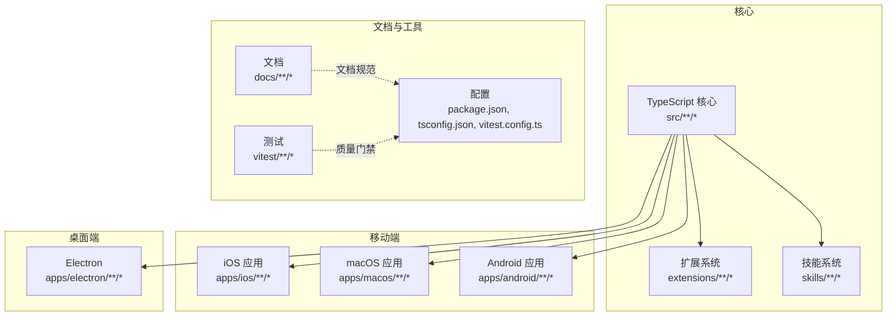
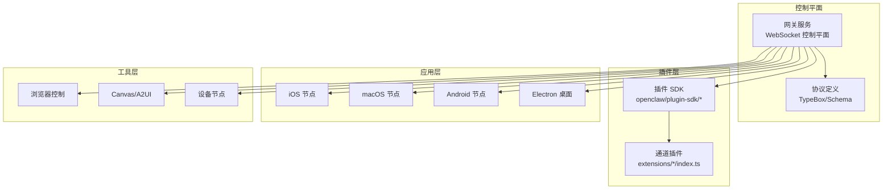
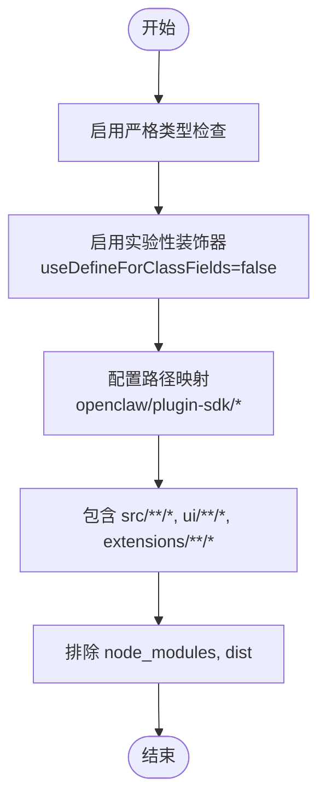
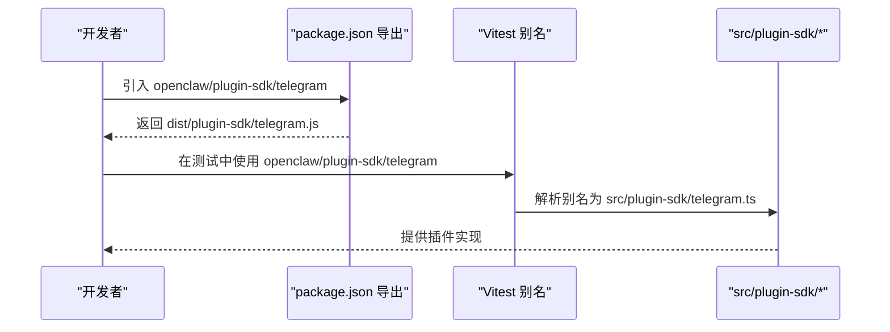
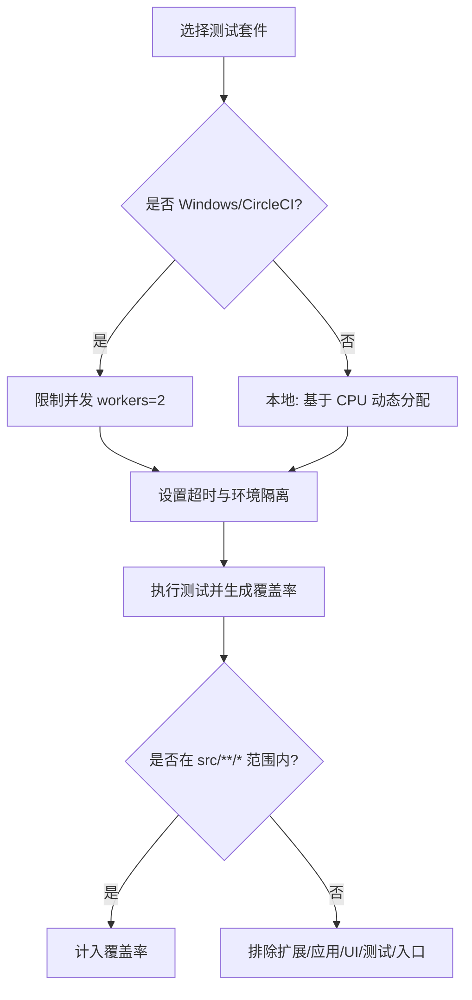
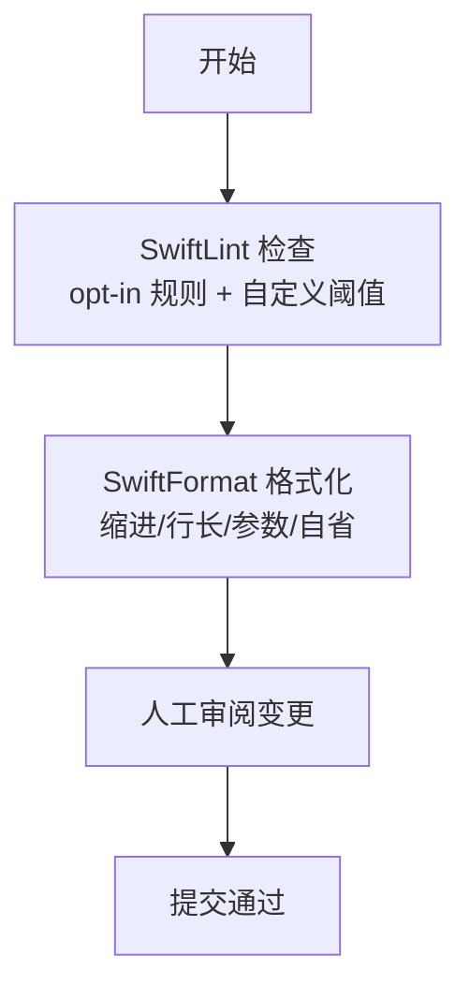
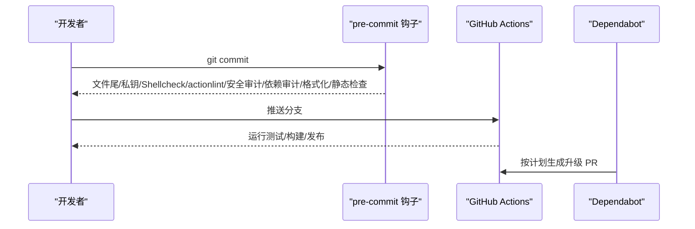
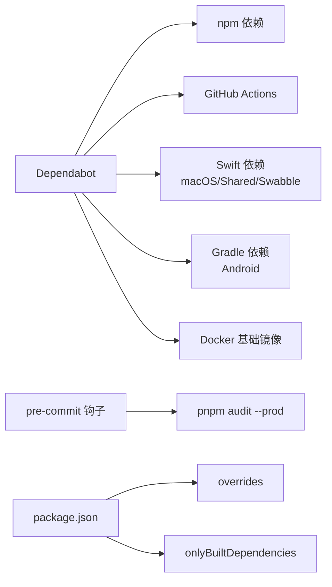

# 编码模式与约定

<cite>
**本文档引用的文件**
- [README.md](file://README.md)
- [CONTRIBUTING.md](file://CONTRIBUTING.md)
- [.github/dependabot.yml](file://.github/dependabot.yml)
- [.github/labeler.yml](file://.github/labeler.yml)
- [.github/pull_request_template.md](file://.github/pull_request_template.md)
- [package.json](file://package.json)
- [tsconfig.json](file://tsconfig.json)
- [vitest.config.ts](file://vitest.config.ts)
- [.pre-commit-config.yaml](file://.pre-commit-config.yaml)
- [.markdownlint-cli2.jsonc](file://.markdownlint-cli2.jsonc)
- [Swabble/.swiftlint.yml](file://Swabble/.swiftlint.yml)
- [Swabble/.swiftformat](file://Swabble/.swiftformat)
- [apps/android/style.md](file://apps/android/style.md)
- [.github/actionlint.yaml](file://.github/actionlint.yaml)
</cite>

## 目录

1. [简介](#简介)
2. [项目结构](#项目结构)
3. [核心组件](#核心组件)
4. [架构总览](#架构总览)
5. [详细组件分析](#详细组件分析)
6. [依赖关系分析](#依赖关系分析)
7. [性能考虑](#性能考虑)
8. [故障排查指南](#故障排查指南)
9. [结论](#结论)
10. [附录](#附录)

## 简介

本文件系统性梳理 OpenClaw 项目的编码模式与约定，覆盖以下方面：

- TypeScript 编码风格、命名约定与文件组织原则
- Swift 代码规范（iOS/macOS 应用）
- 架构模式：事件驱动、插件化、分层架构等
- 代码质量保障：静态检查、格式化、文档校验与预提交钩子
- 具体示例与最佳实践，帮助开发者遵循统一标准

## 项目结构

OpenClaw 是一个多平台、多语言的大型项目，包含：

- 核心网关与 CLI（TypeScript）
- 多个扩展与技能（TypeScript）
- iOS/macOS 应用（Swift）
- Android 应用（Jetpack Compose + Kotlin）
- Electron 桌面端（TypeScript + React/Vite）
- 文档与国际化（Markdown）

图示来源

- [package.json:217-340](file://package.json#L217-L340)
- [vitest.config.ts:57-202](file://vitest.config.ts#L57-L202)

章节来源

- [README.md:1-560](file://README.md#L1-L560)
- [package.json:1-467](file://package.json#L1-L467)

## 核心组件

- TypeScript 核心与插件 SDK：通过 tsconfig.json 与路径映射统一管理，支持装饰器与严格类型检查。
- 扩展系统：以插件形式提供通道集成与工具能力，遵循统一导出与别名约定。
- 测试框架：Vitest 配置覆盖单元、集成与覆盖率策略，排除大量外部与入口模块。
- 预提交与 CI：pre-commit 钩子与 GitHub Actions 行为校验，确保代码与工作流质量。

章节来源

- [tsconfig.json:1-29](file://tsconfig.json#L1-L29)
- [vitest.config.ts:57-202](file://vitest.config.ts#L57-L202)
- [package.json:217-340](file://package.json#L217-L340)

## 架构总览

项目采用“事件驱动 + 插件化 + 分层架构”的组合模式：

- 事件驱动：WebSocket 控制平面负责会话、通道、工具与事件的统一编排。
- 插件化：扩展系统以插件形式注入通道与工具能力，插件 SDK 提供统一接口。
- 分层架构：核心层（网关、协议）、应用层（iOS/macOS/Android/Electron）、工具层（浏览器、Canvas、节点）清晰分离。

图示来源

- [README.md:185-238](file://README.md#L185-L238)
- [package.json:37-216](file://package.json#L37-L216)

## 详细组件分析

### TypeScript 编码风格与命名约定

- 语言与目标：ES2023，NodeNext 模块解析，严格类型检查。
- 装饰器：启用实验性装饰器，使用 legacy 装饰器（Lit 组件）。
- 命名与路径映射：通过 tsconfig.json 的 paths 对插件 SDK 进行别名映射，便于统一导入。
- 文件组织：src/**/\*、ui/**/_、extensions/\*\*/_ 统一纳入编译范围；dist 与 node_modules 排除。

图示来源

- [tsconfig.json:2-28](file://tsconfig.json#L2-L28)

章节来源

- [tsconfig.json:1-29](file://tsconfig.json#L1-L29)
- [CONTRIBUTING.md:108-122](file://CONTRIBUTING.md#L108-L122)

### 插件 SDK 导出与别名

- 插件 SDK 通过 package.json 的 exports 字段提供多子路径导出，便于扩展按需引入。
- Vitest 通过 alias 将 openclaw/plugin-sdk 子路径映射到 src/plugin-sdk 下的具体文件，确保测试与构建一致性。

图示来源

- [package.json:37-216](file://package.json#L37-L216)
- [vitest.config.ts:57-70](file://vitest.config.ts#L57-L70)

章节来源

- [package.json:37-216](file://package.json#L37-L216)
- [vitest.config.ts:57-70](file://vitest.config.ts#L57-L70)

### 测试与覆盖率策略

- 测试运行：Vitest 使用 forks 池，Windows/CircleCI 上限制并发，支持环境变量隔离。
- 覆盖率：仅统计 src/\*_/_，排除扩展、应用、UI、测试与入口文件，阈值 70%/70%/55%/70%。
- 排除清单：大模块与集成面通过 e2e/手动验证，避免过度单元测试负担。

图示来源

- [vitest.config.ts:71-202](file://vitest.config.ts#L71-L202)

章节来源

- [vitest.config.ts:71-202](file://vitest.config.ts#L71-L202)

### Swift 代码规范（iOS/macOS 应用）

- 规范工具：SwiftLint 与 SwiftFormat，统一风格与可读性。
- SwiftLint 配置：启用多项 opt-in 规则，禁用若干规则（如缩进宽度、标识符命名），行宽警告/错误阈值明确。
- SwiftFormat 配置：Swift 版本、缩进、行长、参数换行策略、self 移除与头部注释处理。

图示来源

- [Swabble/.swiftlint.yml:1-44](file://Swabble/.swiftlint.yml#L1-L44)
- [Swabble/.swiftformat:1-9](file://Swabble/.swiftformat#L1-L9)

章节来源

- [Swabble/.swiftlint.yml:1-44](file://Swabble/.swiftlint.yml#L1-L44)
- [Swabble/.swiftformat:1-9](file://Swabble/.swiftformat#L1-L9)

### Android UI 风格指南

- 设计方向：简洁、高可读性、确定性流程。
- 样式基线：浅色背景、蓝色强调、边框层级、无细字。
- 设计令牌：颜色、字体、间距、按钮与表单、进度与多步流程、无障碍要求。
- 架构规则：UI 状态集中、可组合函数输入状态、输出回调、副作用显式化。

章节来源

- [apps/android/style.md:1-114](file://apps/android/style.md#L1-L114)

### 文档与 Markdown 规范

- MarkdownLint：对 docs/\*_/_.md 与 README.md 生效，允许部分元素标签，关闭若干规则以适配文档结构。
- 文档检查：提供 spellcheck、链接审计与列表生成脚本。

章节来源

- [.markdownlint-cli2.jsonc:1-53](file://.markdownlint-cli2.jsonc#L1-L53)
- [package.json:244-249](file://package.json#L244-L249)

### 预提交与 CI 工具链

- 预提交钩子：文件尾换行、私钥检测、Shellcheck、actionlint、zizmor 安全审计、pnpm audit、oxlint、oxfmt、swiftlint、swiftformat。
- GitHub Actions：Dependabot 自动更新策略，按生态与目录分组；labeler 基于变更自动打标签；actionlint 配置忽略已知问题。

图示来源

- [.pre-commit-config.yaml:1-158](file://.pre-commit-config.yaml#L1-L158)
- [.github/dependabot.yml:1-128](file://.github/dependabot.yml#L1-L128)
- [.github/actionlint.yaml:1-24](file://.github/actionlint.yaml#L1-L24)

章节来源

- [.pre-commit-config.yaml:1-158](file://.pre-commit-config.yaml#L1-L158)
- [.github/dependabot.yml:1-128](file://.github/dependabot.yml#L1-L128)
- [.github/labeler.yml:1-259](file://.github/labeler.yml#L1-L259)
- [.github/actionlint.yaml:1-24](file://.github/actionlint.yaml#L1-L24)

### 架构模式应用

- 事件驱动：通过 WebSocket 控制平面统一调度会话、通道与工具事件。
- 插件化：扩展系统以插件形式注入，插件 SDK 提供统一接口与导出。
- 分层架构：核心（网关/协议）、应用（iOS/macOS/Android/Electron）、工具（浏览器/Canvas/节点）分层清晰。

章节来源

- [README.md:185-238](file://README.md#L185-L238)
- [package.json:37-216](file://package.json#L37-L216)

## 依赖关系分析

- 依赖更新：Dependabot 按生态与目录分组，限制 PR 数量，分组策略覆盖 npm、GitHub Actions、Swift、Gradle 与 Docker。
- 依赖审计：pre-commit 钩子执行 pnpm audit --prod，降低生产依赖风险。
- 依赖覆盖：package.json overrides 与 onlyBuiltDependencies 管理二进制依赖与版本冲突。

图示来源

- [.github/dependabot.yml:13-128](file://.github/dependabot.yml#L13-L128)
- [.pre-commit-config.yaml:120-126](file://.pre-commit-config.yaml#L120-L126)
- [package.json:428-465](file://package.json#L428-L465)

章节来源

- [.github/dependabot.yml:1-128](file://.github/dependabot.yml#L1-L128)
- [.pre-commit-config.yaml:120-126](file://.pre-commit-config.yaml#L120-L126)
- [package.json:428-465](file://package.json#L428-L465)

## 性能考虑

- 并发与资源：Vitest 在 Windows/CircleCI 上限制并发，减少资源争用；本地基于 CPU 数动态分配。
- 覆盖率锚定：仅统计 src/\*_/_，避免大模块与集成面影响覆盖率稳定性。
- 静态检查与格式化：oxlint、oxfmt、swiftlint/swiftformat 在预提交阶段拦截低质量代码，降低运行期开销。
- 依赖最小化：onlyBuiltDependencies 仅保留必要二进制依赖，减少安装与打包体积。

章节来源

- [vitest.config.ts:71-202](file://vitest.config.ts#L71-L202)
- [.pre-commit-config.yaml:127-158](file://.pre-commit-config.yaml#L127-L158)
- [package.json:445-457](file://package.json#L445-L457)

## 故障排查指南

- 提交前检查失败
  - 预提交钩子：确认文件尾换行、私钥检测、Shellcheck、actionlint、zizmor、pnpm audit、oxlint、oxfmt、swiftlint/swiftformat 均通过。
  - 参考：[预提交配置:1-158](file://.pre-commit-config.yaml#L1-L158)
- CI 失败
  - Dependabot：检查自动升级 PR 是否导致依赖冲突或行为变化。
  - 参考：[Dependabot 配置:1-128](file://.github/dependabot.yml#L1-L128)
  - Actionlint：忽略项与自托管 Runner 标签需与实际环境一致。
  - 参考：[Actionlint 配置:1-24](file://.github/actionlint.yaml#L1-L24)
- 测试失败
  - Vitest：关注 Windows/CircleCI 平台差异与并发限制；检查覆盖率阈值与排除清单。
  - 参考：[Vitest 配置:71-202](file://vitest.config.ts#L71-L202)
- 文档问题
  - MarkdownLint：根据允许元素与关闭规则调整文档结构。
  - 参考：[MarkdownLint 配置:1-53](file://.markdownlint-cli2.jsonc#L1-L53)

章节来源

- [.pre-commit-config.yaml:1-158](file://.pre-commit-config.yaml#L1-L158)
- [.github/dependabot.yml:1-128](file://.github/dependabot.yml#L1-L128)
- [.github/actionlint.yaml:1-24](file://.github/actionlint.yaml#L1-L24)
- [vitest.config.ts:71-202](file://vitest.config.ts#L71-L202)
- [.markdownlint-cli2.jsonc:1-53](file://.markdownlint-cli2.jsonc#L1-L53)

## 结论

本项目通过严格的 TypeScript 与 Swift 规范、完善的插件化与分层架构、以及全面的静态检查与预提交工具链，实现了高质量、可维护与可扩展的多平台代码库。建议新贡献者：

- 遵循 tsconfig.json 与路径映射约定，统一导入与导出。
- 使用 SwiftLint/SwiftFormat 保持 Swift 代码一致性。
- 在扩展开发中遵循插件 SDK 导出规范，并通过 Vitest 覆盖关键逻辑。
- 严格遵守预提交与 CI 规则，确保提交质量与安全性。

## 附录

- 贡献流程与评审模板参考：[贡献指南:79-136](file://CONTRIBUTING.md#L79-L136)，[PR 模板:1-116](file://.github/pull_request_template.md#L1-L116)
- 项目总览与平台说明：[README:1-560](file://README.md#L1-L560)
