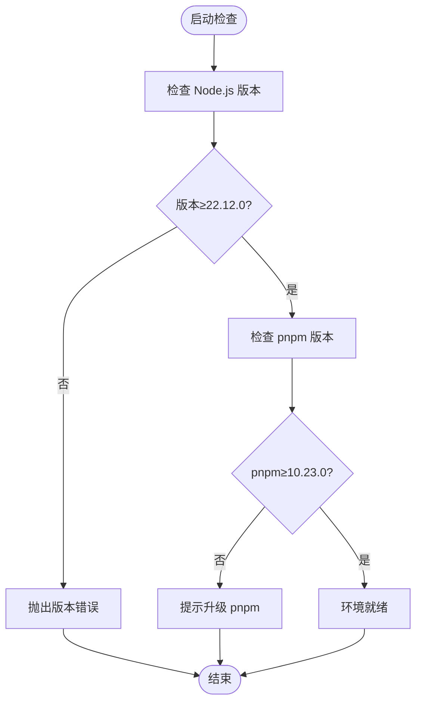
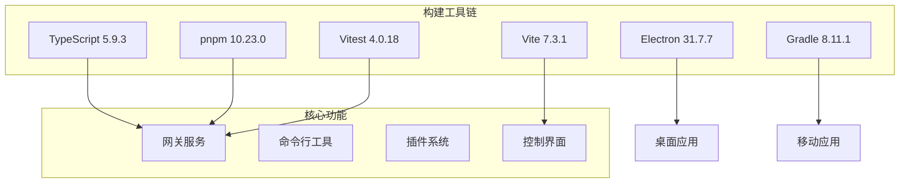
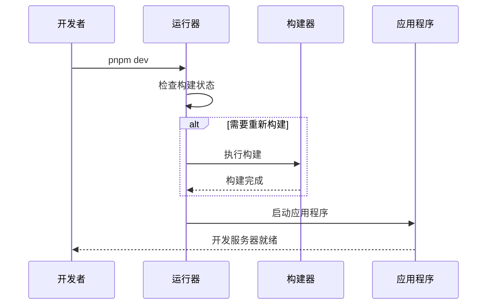
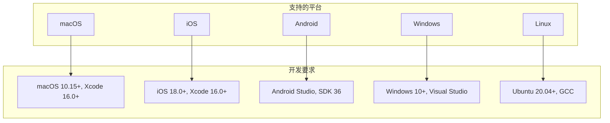
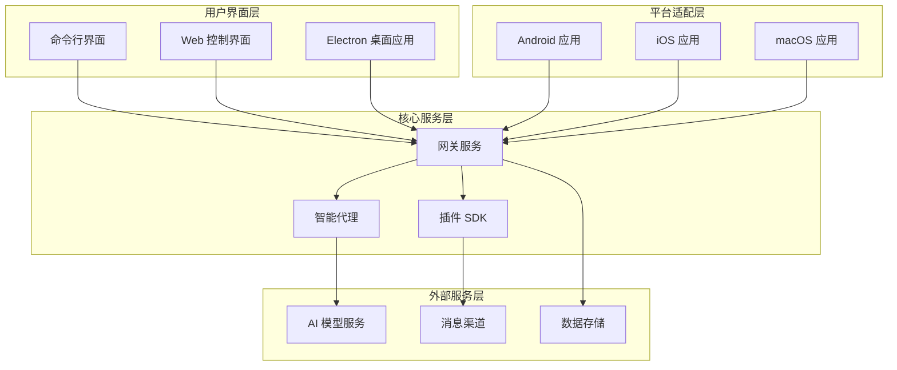
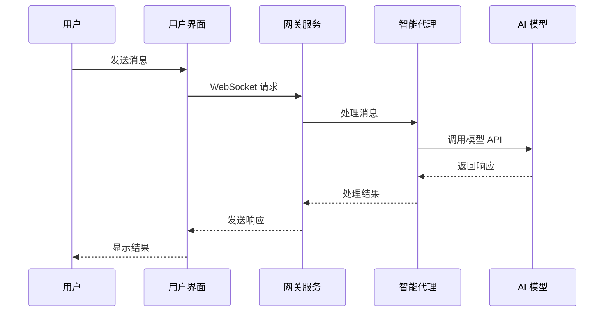
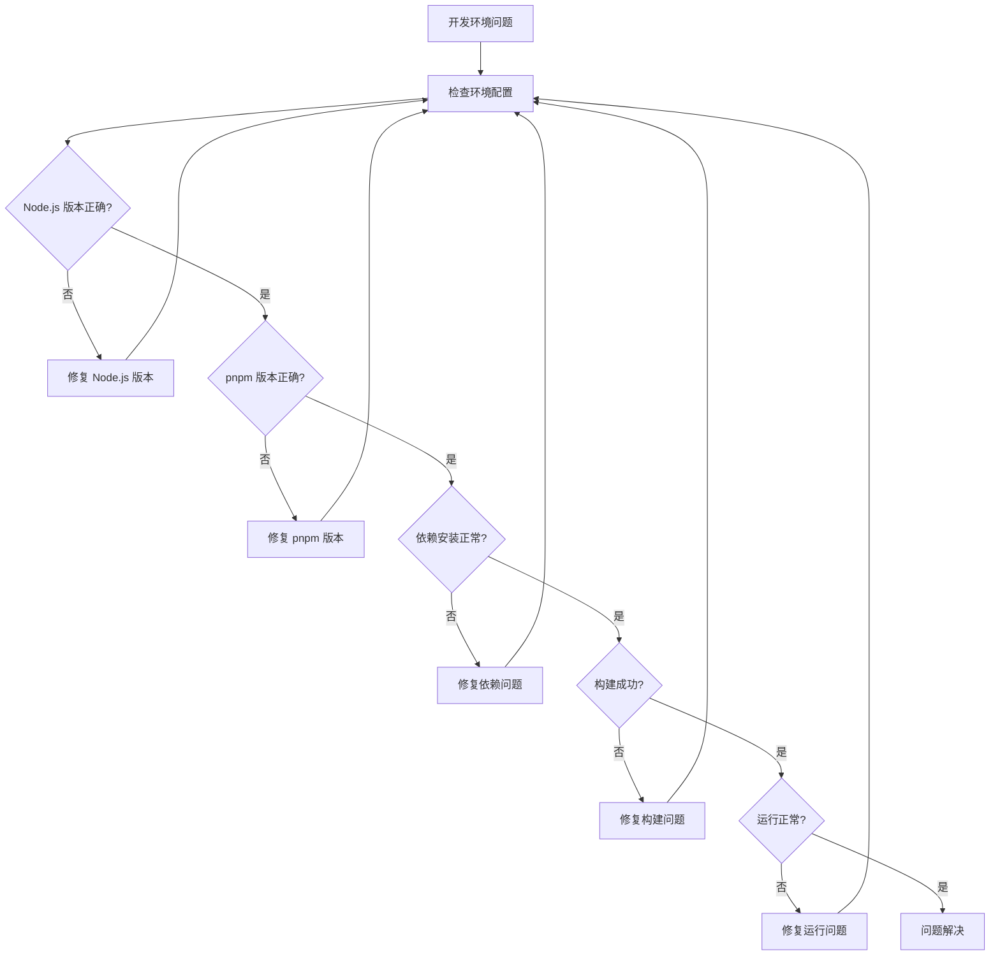

# 开发环境设置

<cite>
**本文档引用的文件**
- [package.json](file://package.json)
- [pnpm-workspace.yaml](file://pnpm-workspace.yaml)
- [tsconfig.json](file://tsconfig.json)
- [README.md](file://README.md)
- [apps/electron/package.json](file://apps/electron/package.json)
- [ui/package.json](file://ui/package.json)
- [apps/android/build.gradle.kts](file://apps/android/build.gradle.kts)
- [apps/ios/project.yml](file://apps/ios/project.yml)
- [.github/workflows/ci.yml](file://.github/workflows/ci.yml)
- [scripts/run-node.mjs](file://scripts/run-node.mjs)
</cite>

## 目录

1. [简介](#简介)
2. [系统要求与前置依赖](#系统要求与前置依赖)
3. [Node.js 版本要求](#nodejs-版本要求)
4. [pnpm 包管理器配置](#pnpm-包管理器配置)
5. [TypeScript 编译设置](#typescript-编译设置)
6. [工作区结构](#工作区结构)
7. [开发工具链配置](#开发工具链配置)
8. [IDE 推荐设置](#ide-推荐设置)
9. [调试环境准备](#调试环境准备)
10. [完整环境搭建步骤](#完整环境搭建步骤)
11. [跨平台开发注意事项](#跨平台开发注意事项)
12. [常见环境问题解决方案](#常见环境问题解决方案)
13. [架构概览](#架构概览)
14. [依赖关系分析](#依赖关系分析)
15. [性能考虑](#性能考虑)
16. [故障排除指南](#故障排除指南)
17. [结论](#结论)

## 简介

OpenClaw 是一个运行在本地设备上的个人 AI 助手，支持多渠道消息集成（WhatsApp、Telegram、Slack、Discord、Google Chat、Signal、iMessage、BlueBubbles、IRC、Microsoft Teams、Matrix、Feishu、LINE、Mattermost、Nextcloud Talk、Nostr、Synology Chat、Tlon、Twitch、Zalo、Zalo Personal、WebChat）。该项目采用现代化的全栈技术栈，包含 Node.js 后端、TypeScript 类型系统、pnpm 工作区管理、Electron 桌面客户端、React 控制界面以及 iOS/Android 移动应用。

## 系统要求与前置依赖

### 最低系统要求

- **操作系统**: macOS 10.15+、Windows 10+、Linux Ubuntu 20.04+
- **内存**: 至少 8GB RAM（建议 16GB+）
- **存储**: 至少 20GB 可用空间
- **网络**: 稳定的互联网连接用于依赖下载和模型服务访问

### 必需的前置依赖

- **Node.js**: 版本 ≥ 22.12.0（严格要求）
- **包管理器**: pnpm 10.23.0 或更高版本
- **构建工具**:
  - Xcode 16.0+（macOS 开发）
  - Android Studio + SDK（Android 开发）
  - Electron 开发环境（桌面应用）

**章节来源**

- [package.json:424-427](file://package.json#L424-L427)
- [README.md:52](file://README.md#L52)
- [README.md:94](file://README.md#L94)

## Node.js 版本要求

### 版本约束

项目对 Node.js 版本有严格的限制：

```json
"engines": {
  "node": ">=22.12.0"
}
```

### 版本兼容性

- **当前推荐版本**: Node.js 22.12.0 或更高
- **最低兼容版本**: 22.12.0
- **包管理器版本**: pnpm@10.23.0

### 版本检测脚本

项目提供了自动化的版本检查机制，通过 `scripts/run-node.mjs` 实现：



**图表来源**

- [scripts/run-node.mjs:130-170](file://scripts/run-node.mjs#L130-L170)

**章节来源**

- [package.json:424-427](file://package.json#L424-L427)
- [scripts/run-node.mjs:130-170](file://scripts/run-node.mjs#L130-L170)

## pnpm 包管理器配置

### 工作区配置

项目使用 pnpm 工作区进行多包管理：

```yaml
packages:
  - .
  - ui
  - apps/electron
  - packages/*
  - extensions/*
```

### 仅构建依赖

针对需要原生编译的包，项目明确指定仅构建依赖：

```yaml
onlyBuiltDependencies:
  - "@lydell/node-pty"
  - "@matrix-org/matrix-sdk-crypto-nodejs"
  - "@napi-rs/canvas"
  - "@tloncorp/api"
  - "@whiskeysockets/baileys"
  - authenticate-pam
  - esbuild
  - node-llama-cpp
  - protobufjs
  - sharp
```

### 依赖覆盖策略

项目使用 `overrides` 字段统一管理冲突的依赖版本：

```json
"overrides": {
  "hono": "4.12.7",
  "@hono/node-server": "1.19.10",
  "fast-xml-parser": "5.3.8",
  "request": "npm:@cypress/request@3.0.10",
  "request-promise": "npm:@cypress/request-promise@5.0.0"
}
```

### 包扩展配置

特定包的额外依赖配置：

```json
"packageExtensions": {
  "@mariozechner/pi-coding-agent": {
    "dependencies": {
      "strip-ansi": "^7.2.0"
    }
  }
}
```

**章节来源**

- [pnpm-workspace.yaml:1-19](file://pnpm-workspace.yaml#L1-L19)
- [package.json:428-465](file://package.json#L428-L465)

## TypeScript 编译设置

### 编译选项

项目采用严格的 TypeScript 配置：

```json
{
  "compilerOptions": {
    "allowImportingTsExtensions": true,
    "allowSyntheticDefaultImports": true,
    "declaration": true,
    "esModuleInterop": true,
    "experimentalDecorators": true,
    "forceConsistentCasingInFileNames": true,
    "lib": ["DOM", "DOM.Iterable", "ES2023", "ScriptHost"],
    "module": "NodeNext",
    "moduleResolution": "NodeNext",
    "noEmit": true,
    "noEmitOnError": true,
    "outDir": "dist",
    "resolveJsonModule": true,
    "skipLibCheck": true,
    "strict": true,
    "target": "es2023",
    "useDefineForClassFields": false,
    "paths": {
      "openclaw/plugin-sdk": ["./src/plugin-sdk/index.ts"],
      "openclaw/plugin-sdk/*": ["./src/plugin-sdk/*.ts"],
      "openclaw/plugin-sdk/account-id": ["./src/plugin-sdk/account-id.ts"]
    }
  },
  "include": ["src/**/*", "ui/**/*", "extensions/**/*"],
  "exclude": ["node_modules", "dist"]
}
```

### 路径映射

项目定义了专门的模块路径映射，便于插件开发：

- `openclaw/plugin-sdk` → `src/plugin-sdk/index.ts`
- 支持通配符匹配 `openclaw/plugin-sdk/*`
- 特定模块别名如 `account-id`

### 构建配置

TypeScript 构建通过 `tsdown` 工具执行，支持热重载和增量编译。

**章节来源**

- [tsconfig.json:1-29](file://tsconfig.json#L1-L29)

## 工作区结构

### 核心目录组织

```
openclaw/
├── src/                    # 主要源代码
├── apps/                   # 平台应用
│   ├── electron/          # Electron 桌面客户端
│   ├── android/           # Android 应用
│   ├── ios/               # iOS 应用
│   └── macos/             # macOS 应用
├── ui/                     # React 控制界面
├── extensions/             # 插件扩展
├── packages/               # 内部包
├── scripts/                # 开发脚本
└── docs/                   # 文档资源
```

### 包管理策略

- **根包**: 主要应用逻辑和 CLI 工具
- **UI 包**: 独立的 React 控制界面
- **应用包**: 平台特定的应用实现
- **扩展包**: 可插拔的功能模块

**章节来源**

- [pnpm-workspace.yaml:1-6](file://pnpm-workspace.yaml#L1-L6)

## 开发工具链配置

### 构建工具链

项目采用现代化的工具链组合：



### 开发脚本

项目提供了丰富的开发脚本：

- **构建**: `pnpm build` - 完整构建流程
- **开发**: `pnpm dev` - TypeScript 直接运行
- **热重载**: `pnpm gateway:watch` - 自动重启
- **测试**: `pnpm test` - 并行测试执行
- **格式化**: `pnpm format` - 代码格式化
- **类型检查**: `pnpm check` - 全面质量检查

**图表来源**

- [package.json:217-341](file://package.json#L217-L341)

**章节来源**

- [package.json:217-341](file://package.json#L217-L341)

## IDE 推荐设置

### VS Code 配置

推荐的 VS Code 设置：

```json
{
  "typescript.preferences.importModuleSpecifier": "relative",
  "typescript.preferences.importModuleSpecifierEnding": "js",
  "typescript.preferences.jsxAttributeCompletionStyle": "auto",
  "typescript.preferences.quotePreference": "double",
  "typescript.preferences.useAliasesForRenames": true,
  "typescript.preferences.insertSpaceAfterOpeningAndBeforeClosingEmptyBrackets": false,
  "typescript.preferences.insertSpaceAfterOpeningAndBeforeClosingTemplateExpression": true,
  "typescript.preferences.insertSpaceAfterTypeAssertion": false,
  "typescript.preferences.preferTypeOfToExpr": true,
  "typescript.preferences.removeComments": false,
  "typescript.preferences.semicolons": "insert",
  "typescript.preferences.simpleEnumCase": "lower",
  "typescript.preferences.spaceInOptionalType": true,
  "typescript.preferences.wrapComments": false,
  "typescript.preferences.indentSwitchCase": true,
  "typescript.preferences.inlineCallArguments": false,
  "typescript.preferences.maxItemsToShow": 100,
  "typescript.preferences.qualifyModule": false,
  "typescript.preferences.useAliasForRenames": true,
  "typescript.preferences.useAliasForRenames": true
}
```

### 插件推荐

- **ESLint**: TypeScript 代码质量检查
- **Prettier**: 代码格式化
- **EditorConfig**: 统一编码规范
- **TypeScript Importer**: 自动导入管理
- **Path Intellisense**: 路径智能补全

### 调试配置

VS Code 提供了完整的调试配置，支持断点调试、条件断点和变量监视。

**章节来源**

- [package.json:217-341](file://package.json#L217-L341)

## 调试环境准备

### 开发模式启动

项目提供了多种调试模式：



### 热重载机制

项目实现了智能的热重载机制：

1. **文件监控**: 监控 `src` 目录变化
2. **增量构建**: 仅重新编译变更文件
3. **自动重启**: 应用程序自动重启
4. **状态保持**: 保持运行时状态

### 调试工具

- **Node.js 调试器**: 支持断点和变量检查
- **浏览器调试**: 前端界面调试
- **日志系统**: 结构化日志输出
- **性能分析**: 内置性能监控

**图表来源**

- [scripts/run-node.mjs:210-254](file://scripts/run-node.mjs#L210-L254)

**章节来源**

- [scripts/run-node.mjs:210-254](file://scripts/run-node.mjs#L210-L254)

## 完整环境搭建步骤

### 步骤 1: 系统准备

1. **安装 Node.js 22.12.0+**

   ```bash
   # 检查版本
   node --version

   # 如果版本过低，使用 nvm 安装
   nvm install 22.12.0
   nvm use 22.12.0
   ```

2. **安装 pnpm 10.23.0+**

   ```bash
   # 检查版本
   pnpm --version

   # 安装或升级
   npm install -g pnpm@10.23.0
   ```

### 步骤 2: 代码克隆与安装

```bash
# 克隆仓库
git clone https://github.com/openclaw/openclaw.git
cd openclaw

# 安装依赖
pnpm install

# 构建 UI 依赖（首次运行时自动安装）
pnpm ui:build
```

### 步骤 3: 环境验证

```bash
# 验证 Node.js 版本
node --version

# 验证 pnpm 版本
pnpm --version

# 运行基本测试
pnpm test:fast

# 构建项目
pnpm build
```

### 步骤 4: 开发服务器启动

```bash
# 启动开发服务器
pnpm dev

# 或启动网关服务
pnpm gateway:dev

# 或启动热重载模式
pnpm gateway:watch
```

### 步骤 5: 平台特定配置

根据目标平台进行额外配置：

**macOS 开发**:

```bash
# 安装 Xcode 命令行工具
xcode-select --install

# 安装 SwiftLint 和 SwiftFormat
brew install swiftlint swiftformat
```

**Android 开发**:

```bash
# 安装 Android Studio
# 配置 ANDROID_HOME 环境变量
# 安装必要的 SDK 和工具
```

**Electron 开发**:

```bash
# 安装 Electron 开发依赖
pnpm --filter openclaw-electron install

# 启动 Electron 开发
pnpm --filter openclaw-electron dev
```

**章节来源**

- [README.md:96-111](file://README.md#L96-L111)
- [package.json:217-341](file://package.json#L217-L341)

## 跨平台开发注意事项

### 平台差异

项目支持多个平台，每个平台都有特定的要求：



### 原生依赖处理

项目中包含多个需要原生编译的依赖：

| 依赖名称                | 用途          | 平台要求    |
| ----------------------- | ------------- | ----------- |
| @napi-rs/canvas         | 图像处理      | 所有平台    |
| node-llama-cpp          | 本地模型推理  | 所有平台    |
| @whiskeysockets/baileys | WhatsApp 连接 | 所有平台    |
| authenticate-pam        | 认证服务      | Linux/macOS |

### 条件编译

项目使用 `onlyBuiltDependencies` 配置来优化构建过程：

```yaml
onlyBuiltDependencies:
  - "@lydell/node-pty"
  - "@matrix-org/matrix-sdk-crypto-nodejs"
  - "@napi-rs/canvas"
  - "@tloncorp/api"
  - "@whiskeysockets/baileys"
  - authenticate-pam
  - esbuild
  - node-llama-cpp
  - protobufjs
  - sharp
```

**图表来源**

- [pnpm-workspace.yaml:8-19](file://pnpm-workspace.yaml#L8-L19)

**章节来源**

- [pnpm-workspace.yaml:8-19](file://pnpm-workspace.yaml#L8-L19)
- [package.json:445-457](file://package.json#L445-L457)

## 常见环境问题解决方案

### Node.js 版本不兼容

**问题**: Node.js 版本低于 22.12.0
**解决方案**:

```bash
# 使用 nvm 管理 Node.js 版本
nvm install 22.12.0
nvm use 22.12.0
nvm alias default 22.12.0
```

### pnpm 安装失败

**问题**: pnpm 安装过程中出现权限错误
**解决方案**:

```bash
# 清理缓存
pnpm store prune

# 重新安装
npm install -g pnpm@10.23.0

# 检查权限
sudo chown -R $(whoami) ~/.pnpm
```

### 原生依赖编译失败

**问题**: @napi-rs/canvas 等原生依赖编译失败
**解决方案**:

```bash
# 清理 node_modules
rm -rf node_modules
rm -rf apps/*/node_modules

# 清理 pnpm store
pnpm store prune

# 重新安装
pnpm install --frozen-lockfile

# 检查 Python 环境
python3 --version
```

### TypeScript 类型错误

**问题**: 编译时报类型错误
**解决方案**:

```bash
# 清理构建缓存
rm -rf dist
rm -rf ui/dist

# 重新编译
pnpm build

# 检查 tsconfig 配置
pnpm tsc --noEmit
```

### 端口占用问题

**问题**: 开发服务器端口被占用
**解决方案**:

```bash
# 查找占用端口的进程
lsof -i :18789

# 终止相关进程
kill -9 <PID>

# 或修改端口配置
export OPENCLAW_GATEWAY_PORT=18790
```

### 依赖版本冲突

**问题**: 不同包对同一依赖的不同版本要求
**解决方案**:

```bash
# 使用 overrides 解决冲突
pnpm add hono@4.12.7 --save-dev

# 或清理锁定文件重新安装
rm pnpm-lock.yaml
pnpm install
```

**章节来源**

- [scripts/run-node.mjs:130-170](file://scripts/run-node.mjs#L130-L170)
- [package.json:428-465](file://package.json#L428-L465)

## 架构概览

### 整体架构



### 数据流架构



**图表来源**

- [package.json:342-397](file://package.json#L342-L397)

**章节来源**

- [package.json:342-397](file://package.json#L342-L397)

## 依赖关系分析

### 核心依赖矩阵

```mermaid
graph LR
subgraph "运行时依赖"
Node[Node.js 22.12.0+]
Express[Express 5.2.1]
Hono[Hono 4.12.7]
WebSocket[WebSocket]
SQLite[SQLite 3]
end
subgraph "开发依赖"
TS[TypeScript 5.9.3]
Vitest[Vitest 4.0.18]
Vite[Vite 7.3.1]
ESLint[ESLint]
Prettier[Prettier]
end
subgraph "平台特定"
Electron[Electron 31.7.7]
Android[Android SDK]
iOS[iOS SDK]
Canvas[@napi-rs/canvas]
end
Node --> Express
Express --> Hono
Hono --> WebSocket
SQLite --> Node
TS --> Node
Vitest --> Node
Vite --> Node
Electron --> Node
Android --> Node
iOS --> Node
Canvas --> Node
```

### 依赖版本管理

项目使用多种策略管理依赖版本：

1. **直接依赖**: 明确声明的核心功能依赖
2. **开发依赖**: 构建和开发工具
3. **对等依赖**: 运行时可选的高性能替代方案
4. **覆盖依赖**: 解决版本冲突的强制策略

**图表来源**

- [package.json:342-419](file://package.json#L342-L419)

**章节来源**

- [package.json:342-419](file://package.json#L342-L419)

## 性能考虑

### 构建性能优化

项目采用了多项性能优化措施：

1. **增量构建**: 仅重新编译变更的文件
2. **并行处理**: 多个任务同时执行
3. **缓存策略**: 智能缓存减少重复工作
4. **原生依赖预编译**: 减少编译时间

### 运行时性能

- **内存管理**: 使用现代 JavaScript 引擎的垃圾回收机制
- **并发处理**: 支持多线程和异步操作
- **资源限制**: 合理的内存和 CPU 使用限制
- **性能监控**: 内置性能指标收集

### 开发体验优化

- **热重载**: 实时代码更新
- **快速启动**: 最小化启动延迟
- **智能提示**: 完整的 TypeScript 支持
- **调试工具**: 丰富的调试功能

## 故障排除指南

### 常见问题诊断



### 日志分析

项目提供了详细的日志系统，帮助诊断问题：

1. **构建日志**: 显示构建过程中的详细信息
2. **运行时日志**: 记录应用程序运行状态
3. **错误日志**: 捕获异常和错误信息
4. **性能日志**: 监控系统性能指标

### 社区支持

- **GitHub Issues**: 报告 bug 和请求功能
- **Discord 服务器**: 实时技术支持
- **文档**: 详细的使用指南和 API 文档
- **示例代码**: 完整的使用示例

**章节来源**

- [scripts/run-node.mjs:172-177](file://scripts/run-node.mjs#L172-L177)

## 结论

OpenClaw 项目提供了完整的开发环境设置方案，涵盖了从基础环境配置到高级调试技巧的各个方面。通过遵循本文档的指导，开发者可以快速搭建起稳定高效的开发环境，并充分利用项目提供的现代化工具链和架构设计。

关键要点总结：

- **严格的版本要求**确保了环境的一致性和稳定性
- **pnpm 工作区**提供了强大的多包管理能力
- **TypeScript 配置**保证了代码质量和开发体验
- **跨平台支持**满足了不同平台的开发需求
- **完善的调试工具**提高了开发效率和问题定位能力

建议开发者在开始项目开发前，仔细阅读并实践本文档中的所有步骤，以确保获得最佳的开发体验。
