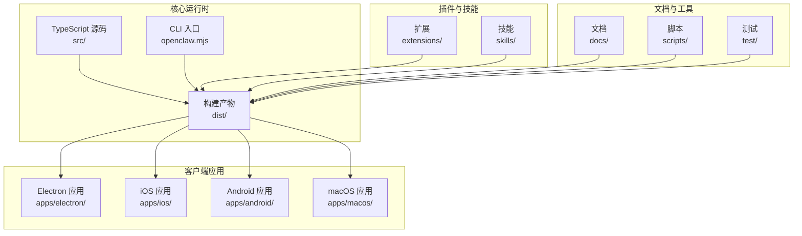
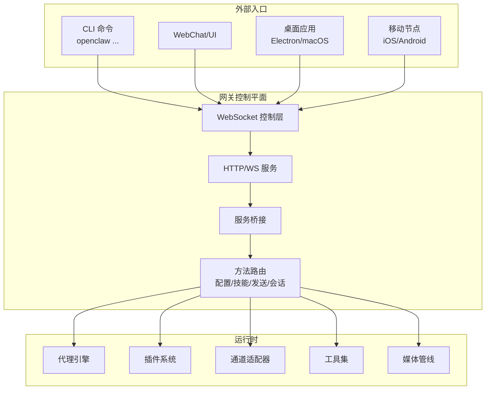
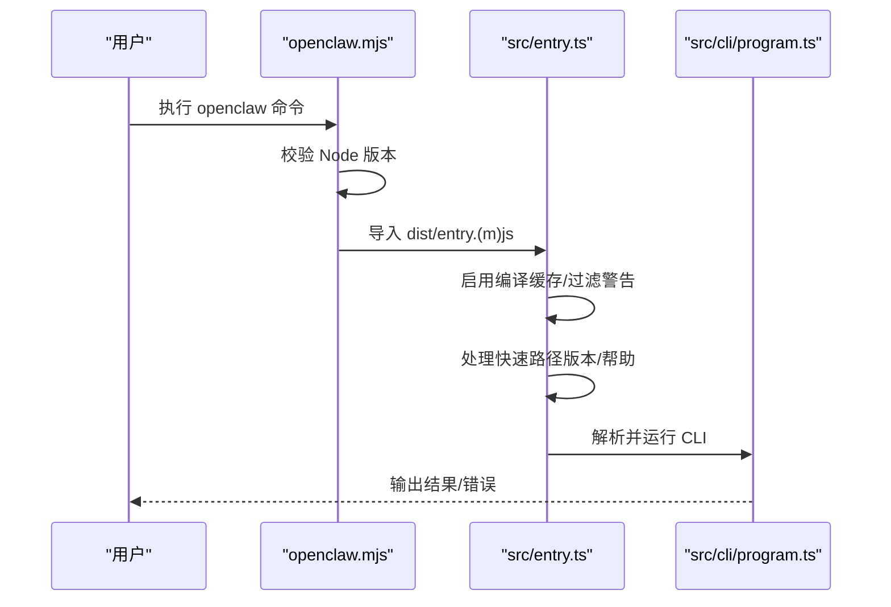
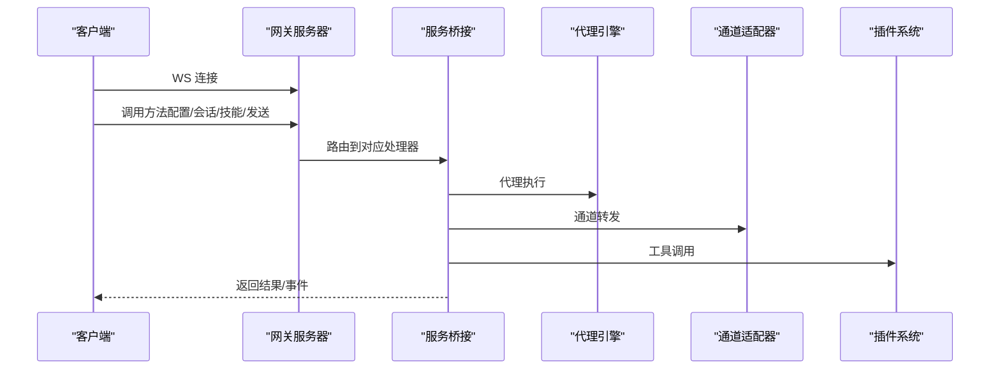
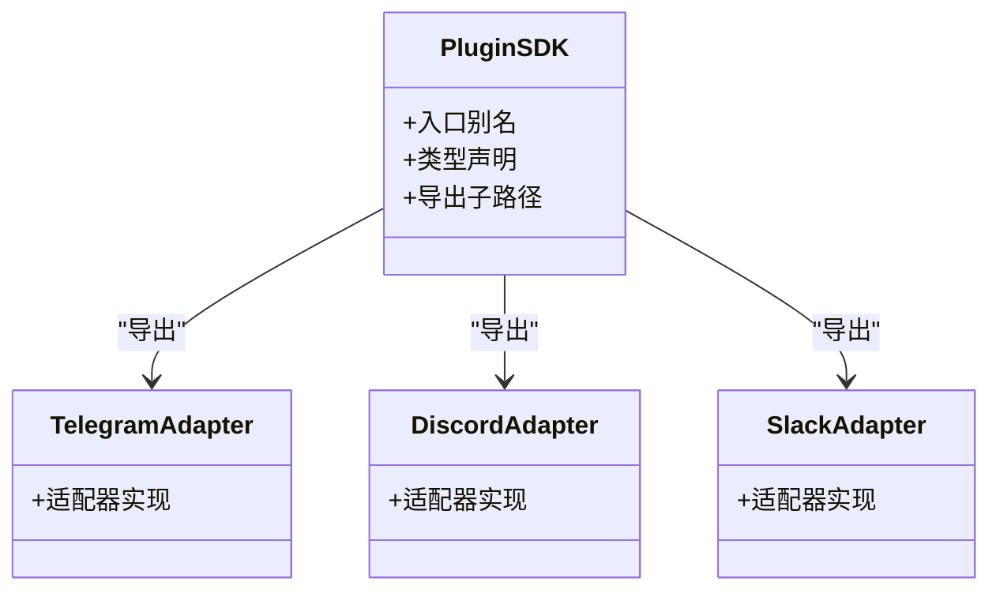
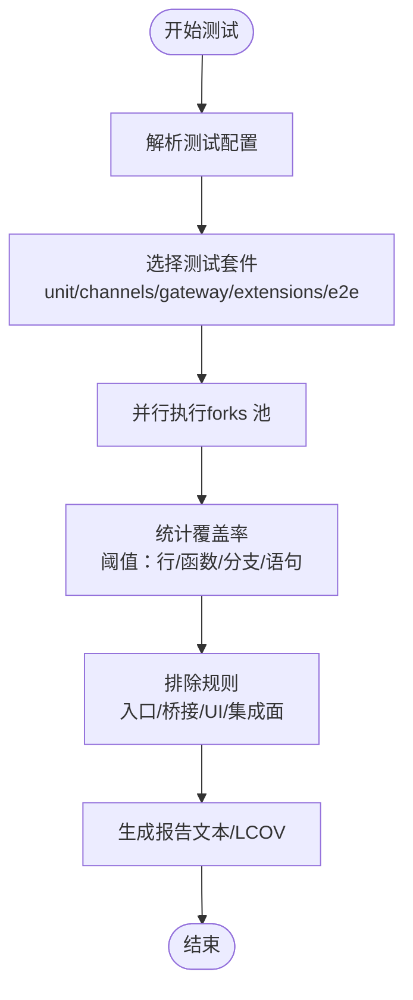
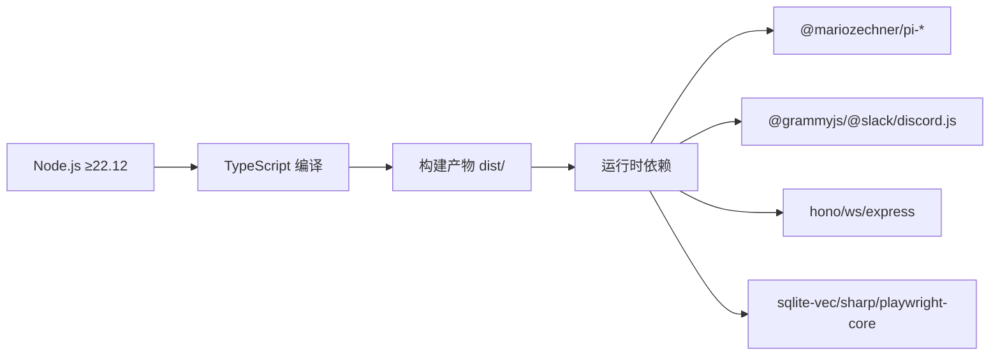

# 开发者指南

<cite>
**本文档引用的文件**
- [README.md](file://README.md)
- [CONTRIBUTING.md](file://CONTRIBUTING.md)
- [VISION.md](file://VISION.md)
- [Dockerfile](file://Dockerfile)
- [package.json](file://package.json)
- [tsconfig.json](file://tsconfig.json)
- [vitest.config.ts](file://vitest.config.ts)
- [src/index.ts](file://src/index.ts)
- [src/entry.ts](file://src/entry.ts)
- [openclaw.mjs](file://openclaw.mjs)
- [Swabble/Package.swift](file://Swabble/Package.swift)
- [apps/android/build.gradle.kts](file://apps/android/build.gradle.kts)
- [apps/ios/project.yml](file://apps/ios/project.yml)
- [apps/macos/Package.swift](file://apps/macos/Package.swift)
- [apps/shared/OpenClawKit/Package.swift](file://apps/shared/OpenClawKit/Package.swift)
- [apps/electron/package.json](file://apps/electron/package.json)
- [ui/package.json](file://ui/package.json)
- [.swiftlint.yml](file://.swiftlint.yml)
- [.swiftformat](file://.swiftformat)
- [.markdownlint-cli2.jsonc](file://.markdownlint-cli2.jsonc)
- [.oxlintrc.json](file://.oxlintrc.json)
- [.oxfmtrc.jsonc](file://.oxfmtrc.jsonc)
- [.pre-commit-config.yaml](file://.pre-commit-config.yaml)
- [.gitignore](file://.gitignore)
- [SECURITY.md](file://SECURITY.md)
</cite>

## 目录

1. [简介](#简介)
2. [项目结构](#项目结构)
3. [核心组件](#核心组件)
4. [架构总览](#架构总览)
5. [详细组件分析](#详细组件分析)
6. [依赖关系分析](#依赖关系分析)
7. [性能考虑](#性能考虑)
8. [故障排除指南](#故障排除指南)
9. [结论](#结论)
10. [附录](#附录)

## 简介

OpenClaw 是一个在用户设备上运行的个人 AI 助手，支持多通道消息集成（如 WhatsApp、Telegram、Slack、Discord、Google Chat、Signal、iMessage、BlueBubbles、IRC、Microsoft Teams、Matrix、Feishu、LINE、Mattermost、Nextcloud Talk、Nostr、Synology Chat、Tlon、Twitch、Zalo、Zalo Personal、WebChat），并可在 macOS/iOS/Android 上进行语音唤醒与实时画布交互。其核心是“网关”（Gateway）控制平面，负责会话、通道、工具与事件的统一管理，并通过 WebSocket 提供控制接口。

本开发者指南面向希望参与贡献、扩展或部署 OpenClaw 的工程师，覆盖开发环境搭建、代码结构、架构设计、编码规范、API 参考、测试策略、文档标准、调试与性能分析、代码审查与版本管理等全流程内容。

**章节来源**

- [README.md:1-560](file://README.md#L1-L560)
- [VISION.md:1-111](file://VISION.md#L1-L111)

## 项目结构

仓库采用多平台、多语言混合架构：

- 核心运行时与业务逻辑：TypeScript（Node.js）
- 客户端应用：Electron（桌面）、iOS、Android、macOS 应用
- 插件生态：以 npm 包形式分发，本地开发可直接加载
- 文档与脚本：Markdown 文档、构建与发布脚本、CI/CD 工作流
- Swift 组件：Swabble（语音相关）、部分 iOS/macOS 工程

**图表来源**

- [package.json:1-467](file://package.json#L1-L467)
- [Dockerfile:1-231](file://Dockerfile#L1-L231)

**章节来源**

- [package.json:1-467](file://package.json#L1-L467)
- [Dockerfile:1-231](file://Dockerfile#L1-L231)

## 核心组件

- CLI 与入口
  - openclaw.mjs：Node 版本校验与引导加载
  - src/entry.ts：启动参数解析、环境标准化、实验性警告抑制、快速路径处理
  - src/index.ts：导出公共 API，安装未捕获异常处理器，解析命令行
- 网关与协议
  - src/gateway/：WebSocket 控制平面、服务器桥接、方法路由、配置与技能管理
  - 协议生成：scripts/protocol-gen.ts 与 scripts/protocol-gen-swift.ts
- 通道与渠道
  - src/channels/、src/telegram/、src/discord/、src/slack/、src/imessage/、src/whatsapp/ 等
- 插件 SDK
  - src/plugin-sdk/：插件开发接口与各平台适配器
- 自动回复与模板
  - src/auto-reply/：自动回复规则与模板系统
- 媒体与理解
  - src/media/、src/media-understanding/：图片/音频/视频处理与转录钩子
- 进程与节点
  - src/process/、src/node-host/：进程桥接、节点能力调用
- 配置与会话
  - src/config/、src/sessions/：配置加载、会话存储与键派生
- 安全与权限
  - src/security/、SECURITY.md：安全策略与漏洞上报
- UI 与控制台
  - ui/：Vite 构建的前端；src/tui/：文本界面
- 测试与覆盖率
  - vitest.config.ts：测试配置、覆盖率阈值与排除规则

**章节来源**

- [src/index.ts:1-94](file://src/index.ts#L1-L94)
- [src/entry.ts:1-195](file://src/entry.ts#L1-L195)
- [openclaw.mjs:1-90](file://openclaw.mjs#L1-L90)
- [vitest.config.ts:1-203](file://vitest.config.ts#L1-L203)

## 架构总览

OpenClaw 的核心是“网关”（Gateway）控制平面，通过 WebSocket 接收来自 CLI、WebChat、桌面应用与移动节点的请求，协调代理（Agent）、工具（Tool）、通道（Channel）与事件（Event）。插件生态通过 npm 分发并在本地开发时可直接加载。

**图表来源**

- [README.md:185-238](file://README.md#L185-L238)
- [src/gateway/server.ts](file://src/gateway/server.ts)
- [src/plugin-sdk/index.ts](file://src/plugin-sdk/index.ts)

**章节来源**

- [README.md:185-238](file://README.md#L185-L238)

## 详细组件分析

### CLI 启动链路

从 openclaw.mjs 到 src/entry.ts 再到 CLI 主程序，形成一条稳定的启动链路，包含版本校验、编译缓存启用、警告过滤与快速帮助/版本输出。

**图表来源**

- [openclaw.mjs:1-90](file://openclaw.mjs#L1-L90)
- [src/entry.ts:1-195](file://src/entry.ts#L1-L195)
- [src/index.ts:1-94](file://src/index.ts#L1-L94)

**章节来源**

- [openclaw.mjs:1-90](file://openclaw.mjs#L1-L90)
- [src/entry.ts:1-195](file://src/entry.ts#L1-L195)
- [src/index.ts:1-94](file://src/index.ts#L1-L94)

### 网关 WebSocket 控制平面

网关通过单一 WS 控制平面连接所有客户端与工具，提供配置、会话、技能、发送、通话、网页等方法。协议定义由脚本生成，确保 TypeScript 与 Swift 两端一致。

**图表来源**

- [src/gateway/server.ts](file://src/gateway/server.ts)
- [src/gateway/server-methods/config.ts](file://src/gateway/server-methods/config.ts)
- [src/gateway/server-methods/skills.ts](file://src/gateway/server-methods/skills.ts)
- [src/gateway/server-methods/send.ts](file://src/gateway/server-methods/send.ts)
- [scripts/protocol-gen.ts:1-200](file://scripts/protocol-gen.ts#L1-L200)
- [scripts/protocol-gen-swift.ts:1-200](file://scripts/protocol-gen-swift.ts#L1-L200)

**章节来源**

- [src/gateway/server.ts](file://src/gateway/server.ts)
- [scripts/protocol-gen.ts:1-200](file://scripts/protocol-gen.ts#L1-L200)
- [scripts/protocol-gen-swift.ts:1-200](file://scripts/protocol-gen-swift.ts#L1-L200)

### 插件 SDK 与平台适配

插件 SDK 提供统一的插件开发接口，按平台拆分子路径（如 telegram、discord、slack 等），便于扩展与维护。

**图表来源**

- [vitest.config.ts:11-55](file://vitest.config.ts#L11-L55)
- [package.json:37-216](file://package.json#L37-L216)

**章节来源**

- [vitest.config.ts:11-55](file://vitest.config.ts#L11-L55)
- [package.json:37-216](file://package.json#L37-L216)

### 测试策略与覆盖率

测试采用 Vitest 并行执行，区分单元、通道、网关、扩展、E2E 等配置。覆盖率阈值与排除规则明确，确保核心逻辑受控。

**图表来源**

- [vitest.config.ts:71-203](file://vitest.config.ts#L71-L203)

**章节来源**

- [vitest.config.ts:71-203](file://vitest.config.ts#L71-L203)

## 依赖关系分析

- 运行时与构建
  - Node.js ≥ 22.12（openclaw.mjs 校验）
  - TypeScript 严格模式、装饰器兼容配置（tsconfig.json）
  - pnpm 工作区与仅构建依赖（package.json overrides/onlyBuiltDependencies）
- 关键依赖
  - @mariozechner/pi-\*：代理内核与 TUI
  - @grammyjs/\*、@slack/bolt、discord.js：通道适配
  - hono、ws、express：HTTP/WS 服务
  - sqlite-vec、sharp、playwright-core：媒体与向量检索
- 平台依赖
  - iOS/macOS：Swift 工程与 SwiftLint/Format
  - Android：Gradle 构建
  - Electron：独立打包与渲染器构建

**图表来源**

- [openclaw.mjs:5-36](file://openclaw.mjs#L5-L36)
- [tsconfig.json:1-29](file://tsconfig.json#L1-L29)
- [package.json:342-467](file://package.json#L342-L467)

**章节来源**

- [openclaw.mjs:5-36](file://openclaw.mjs#L5-L36)
- [tsconfig.json:1-29](file://tsconfig.json#L1-L29)
- [package.json:342-467](file://package.json#L342-L467)

## 性能考虑

- 启动与编译
  - 启用 Node 编译缓存（openclaw.mjs 与 src/entry.ts）
  - 使用 forks 池并行测试（vitest.config.ts）
- 资源与内存
  - Docker 多阶段构建，生产镜像精简（Dockerfile）
  - UI 构建强制 pnpm 以降低跨架构失败风险
- 媒体与向量
  - sqlite-vec 用于向量检索；sharp 优化图像处理
- 端口与网络
  - 网关默认绑定 loopback，容器健康检查端点 /healthz /readyz

**章节来源**

- [openclaw.mjs:38-45](file://openclaw.mjs#L38-L45)
- [src/entry.ts:48-54](file://src/entry.ts#L48-L54)
- [vitest.config.ts:79-80](file://vitest.config.ts#L79-L80)
- [Dockerfile:88-91](file://Dockerfile#L88-L91)
- [Dockerfile:224-229](file://Dockerfile#L224-L229)

## 故障排除指南

- 端口占用
  - 网关启动前检查端口可用性，必要时描述端口占用者（src/infra/ports.js）
- 权限与安全
  - macOS 节点权限需遵循 TCC；提升权限需显式允许（README.md）
  - 安全策略与漏洞上报流程（SECURITY.md）
- 渠道连接问题
  - 使用 doctor 命令诊断配置与连接状态（README.md）
- 测试与 CI
  - 并行测试失败排查：查看 CI workers 数量与超时设置（vitest.config.ts）

**章节来源**

- [README.md:442-449](file://README.md#L442-L449)
- [SECURITY.md](file://SECURITY.md)
- [src/infra/ports.js](file://src/infra/ports.js)
- [vitest.config.ts:71-80](file://vitest.config.ts#L71-L80)

## 结论

OpenClaw 以“网关控制平面”为核心，结合多平台客户端与丰富的插件生态，提供了强大的本地化、隐私友好的个人 AI 助手解决方案。开发者可通过本文档快速掌握开发环境、代码结构、架构设计与测试策略，并按照贡献流程与安全规范开展高质量的协作。

[无需章节来源：总结性内容]

## 附录

### 开发环境设置

- 运行时要求
  - Node.js ≥ 22.12（openclaw.mjs 校验）
  - pnpm ≥ 10.23（package.json）
- 依赖安装
  - pnpm install
  - UI 依赖首次构建时自动安装（package.json scripts）
- 构建与运行
  - pnpm build 生成 dist/
  - pnpm gateway:watch 开发监听
  - pnpm openclaw onboard 初始化网关守护进程

**章节来源**

- [openclaw.mjs:5-36](file://openclaw.mjs#L5-L36)
- [package.json:217-341](file://package.json#L217-L341)

### 贡献流程

- 讨论与 PR
  - 新功能先发起 GitHub Discussion 或 Discord 讨论
  - PR 需本地测试、CI 通过、保持聚焦（CONTRIBUTING.md）
- 代码质量
  - TypeScript 严格模式（tsconfig.json）
  - SwiftLint/Format（.swiftlint.yml、.swiftformat）
  - MarkdownLint（.markdownlint-cli2.jsonc）
  - 代码格式化与检查（oxlint/oxfmt）
- 提交前检查
  - pnpm check：格式化检查、lint、重复代码检测、链接审计
  - pnpm test：并行单元测试
  - pnpm build：构建产物

**章节来源**

- [CONTRIBUTING.md:79-106](file://CONTRIBUTING.md#L79-L106)
- [tsconfig.json:1-29](file://tsconfig.json#L1-29)
- [.swiftlint.yml](file://.swiftlint.yml)
- [.swiftformat](file://.swiftformat)
- [.markdownlint-cli2.jsonc](file://.markdownlint-cli2.jsonc)
- [.oxlintrc.json](file://.oxlintrc.json)
- [.oxfmtrc.jsonc](file://.oxfmtrc.jsonc)
- [package.json:231-258](file://package.json#L231-L258)

### API 参考

- CLI 入口
  - openclaw.mjs：版本校验与引导
  - src/entry.ts：启动参数、环境、快速路径
  - src/index.ts：命令解析与全局错误处理
- 网关方法
  - 配置、技能、发送、会话、通话、网页等（src/gateway/server-methods/\*）
- 协议生成
  - scripts/protocol-gen.ts 与 scripts/protocol-gen-swift.ts

**章节来源**

- [openclaw.mjs:1-90](file://openclaw.mjs#L1-L90)
- [src/entry.ts:1-195](file://src/entry.ts#L1-L195)
- [src/index.ts:1-94](file://src/index.ts#L1-L94)
- [src/gateway/server-methods/config.ts](file://src/gateway/server-methods/config.ts)
- [src/gateway/server-methods/skills.ts](file://src/gateway/server-methods/skills.ts)
- [src/gateway/server-methods/send.ts](file://src/gateway/server-methods/send.ts)
- [scripts/protocol-gen.ts:1-200](file://scripts/protocol-gen.ts#L1-L200)
- [scripts/protocol-gen-swift.ts:1-200](file://scripts/protocol-gen-swift.ts#L1-L200)

### 测试策略

- 测试套件
  - 单元：vitest.unit.config.ts
  - 通道：vitest.channels.config.ts
  - 网关：vitest.gateway.config.ts
  - 扩展：vitest.extensions.config.ts
  - E2E：vitest.e2e.config.ts
  - 实时/性能：vitest.live.config.ts
- 覆盖率
  - 行/函数/分支/语句阈值 70%/70%/55%/70%
  - 排除入口、桥接、UI、集成面等

**章节来源**

- [vitest.config.ts:71-203](file://vitest.config.ts#L71-L203)

### 文档标准

- Markdown 规范
  - markdownlint-cli2（.markdownlint-cli2.jsonc）
  - 文档拼写检查与链接审计（package.json scripts）
- 国际化
  - docs/.i18n/ 下的术语表与翻译资源

**章节来源**

- [.markdownlint-cli2.jsonc](file://.markdownlint-cli2.jsonc)
- [package.json:244-250](file://package.json#L244-L250)

### 开发工具配置

- TypeScript
  - 严格模式、装饰器兼容、NodeNext 模块解析（tsconfig.json）
- Swift
  - SwiftLint 与 SwiftFormat（.swiftlint.yml、.swiftformat）
- 前端 UI
  - ui/package.json：Vite 构建与测试
- Electron
  - apps/electron/package.json：渲染器构建与打包

**章节来源**

- [tsconfig.json:1-29](file://tsconfig.json#L1-L29)
- [.swiftlint.yml](file://.swiftlint.yml)
- [.swiftformat](file://.swiftformat)
- [ui/package.json](file://ui/package.json)
- [apps/electron/package.json](file://apps/electron/package.json)

### 调试技巧

- 启动参数
  - --no-color：禁用颜色输出
  - CLI Profile：parseCliProfileArgs（src/entry.ts）
- 日志与错误
  - 全局未捕获异常处理器（src/index.ts）
  - 控制台结构化日志（src/logging.ts）
- 端口与守护
  - 端口占用检查与描述（src/infra/ports.js）
  - 守护进程安装（README.md）

**章节来源**

- [src/entry.ts:60-63](file://src/entry.ts#L60-L63)
- [src/index.ts:80-93](file://src/index.ts#L80-L93)
- [src/logging.ts](file://src/logging.ts)
- [src/infra/ports.js](file://src/infra/ports.js)
- [README.md:50-111](file://README.md#L50-L111)

### 性能分析方法

- 性能预算与热点
  - pnpm test:perf:budget 与 pnpm test:perf:hotspots（package.json）
- 并行测试
  - forks 池与 CPU 核数自适应（vitest.config.ts）
- 构建缓存
  - Node 编译缓存与 pnpm 缓存（Dockerfile、openclaw.mjs）

**章节来源**

- [package.json:297-327](file://package.json#L297-L327)
- [vitest.config.ts:79-80](file://vitest.config.ts#L79-L80)
- [openclaw.mjs:38-45](file://openclaw.mjs#L38-L45)
- [Dockerfile:58-59](file://Dockerfile#L58-L59)

### 代码审查与版本管理

- 代码审查
  - 作者拥有审查对话所有权（CONTRIBUTING.md）
  - AI 辅助 PR 需标注并本地 Codex review（CONTRIBUTING.md）
- 版本与发布
  - 发布检查：scripts/release-check.ts
  - NPM 发布检查：scripts/openclaw-npm-release-check.ts
  - Docker 镜像健康检查：/healthz /readyz（Dockerfile）
- 安全
  - 漏洞上报与策略（SECURITY.md）

**章节来源**

- [CONTRIBUTING.md:96-137](file://CONTRIBUTING.md#L96-L137)
- [scripts/release-check.ts](file://scripts/release-check.ts)
- [scripts/openclaw-npm-release-check.ts](file://scripts/openclaw-npm-release-check.ts)
- [Dockerfile:224-229](file://Dockerfile#L224-L229)
- [SECURITY.md](file://SECURITY.md)
