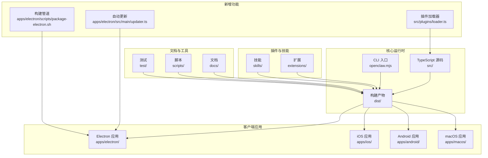
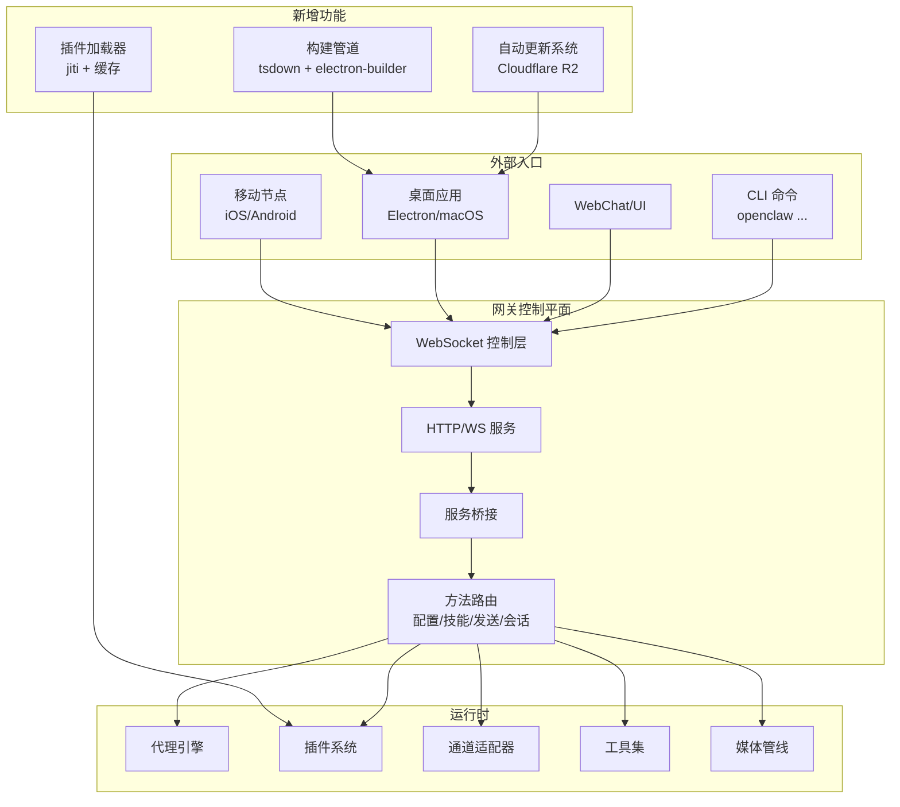
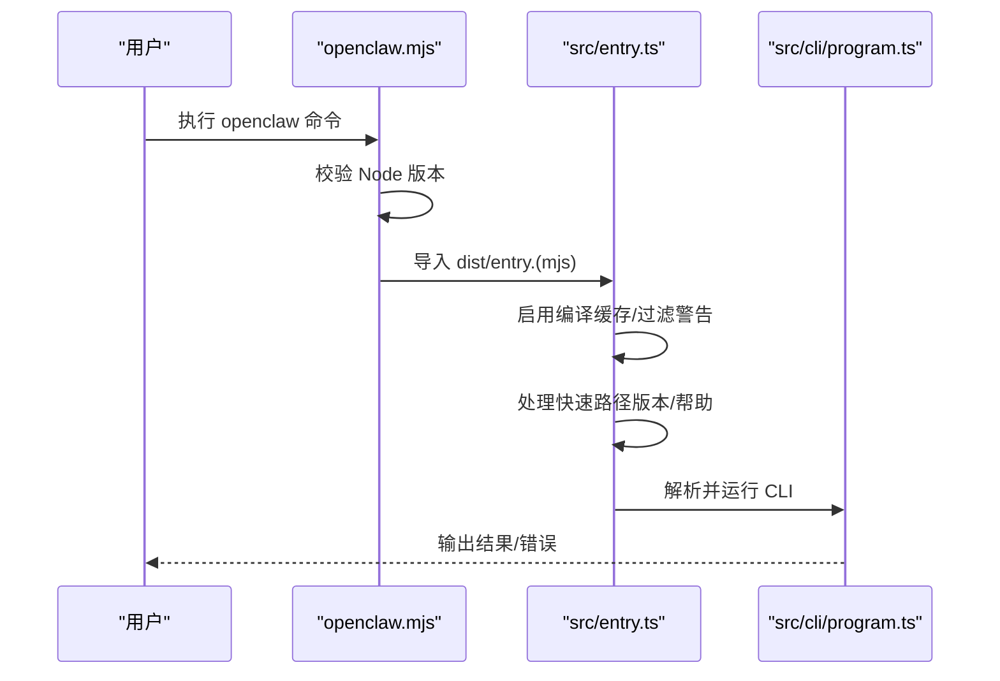
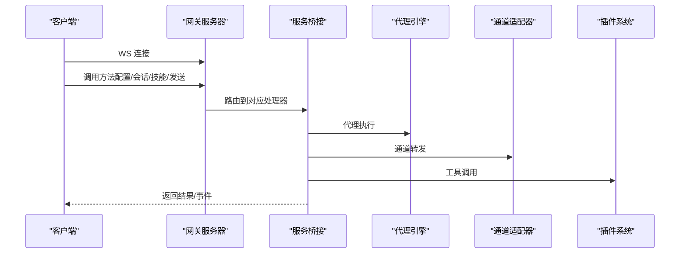
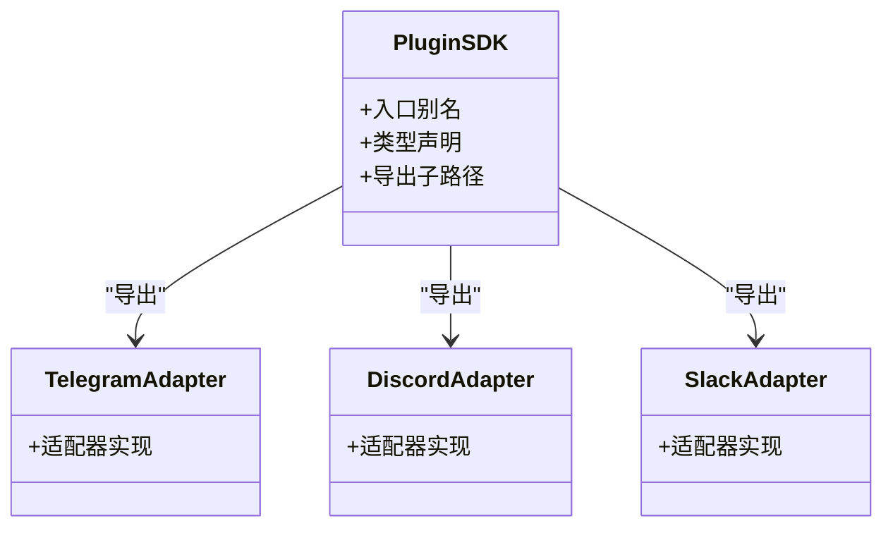
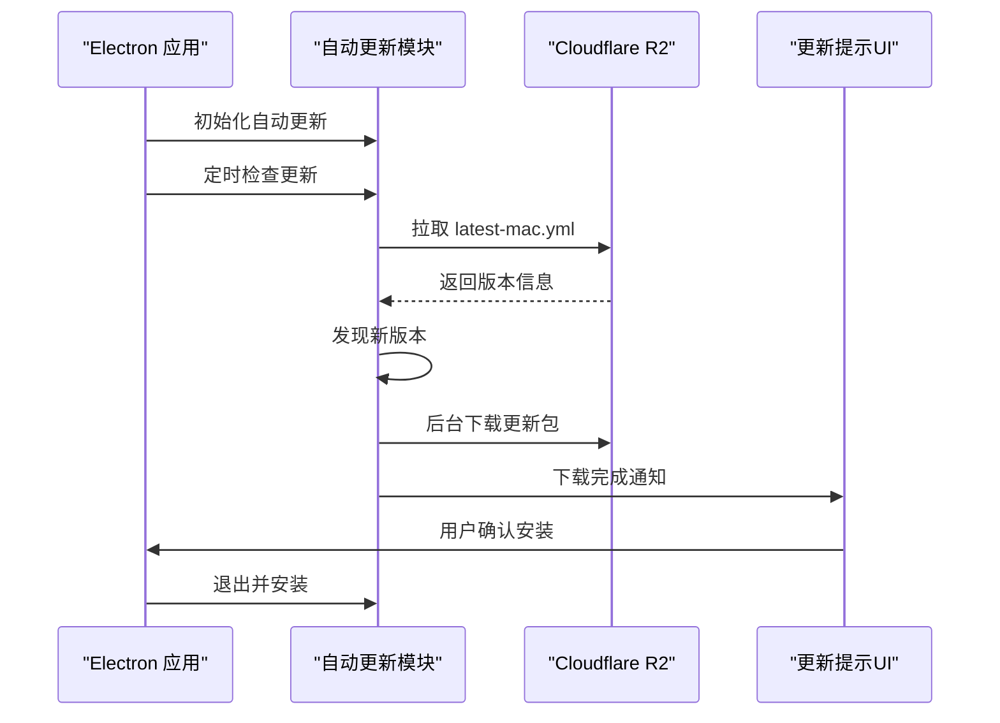
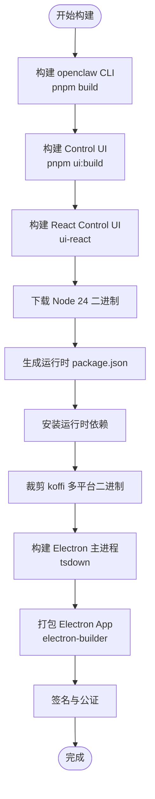
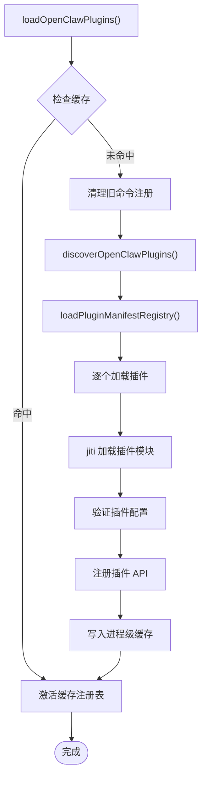
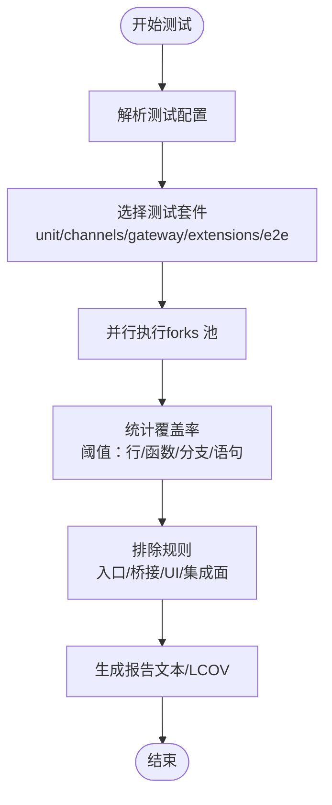
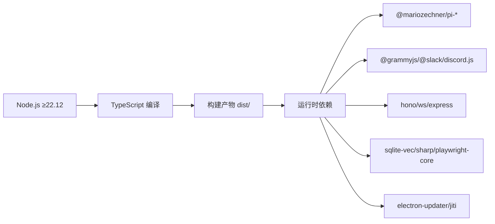

# 开发者指南

<cite>
**本文档引用的文件**
- [README.md](file://README.md)
- [CONTRIBUTING.md](file://CONTRIBUTING.md)
- [VISION.md](file://VISION.md)
- [Dockerfile](file://Dockerfile)
- [package.json](file://package.json)
- [tsconfig.json](file://tsconfig.json)
- [vitest.config.ts](file://vitest.config.ts)
- [src/index.ts](file://src/index.ts)
- [src/entry.ts](file://src/entry.ts)
- [openclaw.mjs](file://openclaw.mjs)
- [Swabble/Package.swift](file://Swabble/Package.swift)
- [apps/android/build.gradle.kts](file://apps/android/build.gradle.kts)
- [apps/ios/project.yml](file://apps/ios/project.yml)
- [apps/macos/Package.swift](file://apps/macos/Package.swift)
- [apps/shared/OpenClawKit/Package.swift](file://apps/shared/OpenClawKit/Package.swift)
- [apps/electron/package.json](file://apps/electron/package.json)
- [ui/package.json](file://ui/package.json)
- [apps/electron/docs/auto-update.md](file://apps/electron/docs/auto-update.md)
- [apps/electron/docs/build-pipeline.md](file://apps/electron/docs/build-pipeline.md)
- [apps/electron/docs/plugin-loader-internals.md](file://apps/electron/docs/plugin-loader-internals.md)
- [docs/cli/update.md](file://docs/cli/update.md)
- [docs/install/updating.md](file://docs/install/updating.md)
- [src/plugins/loader.ts](file://src/plugins/loader.ts)
- [src/plugins/discovery.ts](file://src/plugins/discovery.ts)
- [src/plugins/manifest-registry.ts](file://src/plugins/manifest-registry.ts)
- [apps/electron/scripts/package-electron.sh](file://apps/electron/scripts/package-electron.sh)
- [apps/electron/src/main/updater.ts](file://apps/electron/src/main/updater.ts)
- [apps/electron/src/main/index.ts](file://apps/electron/src/main/index.ts)
- [apps/electron/electron-builder.yml](file://apps/electron/electron-builder.yml)
- [scripts/release-check.ts](file://scripts/release-check.ts)
- [.swiftlint.yml](file://.swiftlint.yml)
- [.swiftformat](file://.swiftformat)
- [.markdownlint-cli2.jsonc](file://.markdownlint-cli2.jsonc)
- [.oxlintrc.json](file://.oxlintrc.json)
- [.oxfmtrc.jsonc](file://.oxfmtrc.jsonc)
- [.pre-commit-config.yaml](file://.pre-commit-config.yaml)
- [.gitignore](file://.gitignore)
- [SECURITY.md](file://SECURITY.md)
</cite>

## 更新摘要
**变更内容**
- 新增自动更新机制章节，涵盖 Electron 客户端的自动更新实现
- 新增构建管道章节，详细说明从源码到安装包的完整构建流程
- 新增插件加载器内部机制章节，深入解析插件系统的加载原理
- 更新 CLI 更新命令文档，包含核心自动更新功能
- 新增发布检查工具，确保构建产物完整性

## 目录
1. [简介](#简介)
2. [项目结构](#项目结构)
3. [核心组件](#核心组件)
4. [架构总览](#架构总览)
5. [详细组件分析](#详细组件分析)
6. [依赖关系分析](#依赖关系分析)
7. [性能考虑](#性能考虑)
8. [故障排除指南](#故障排除指南)
9. [结论](#结论)
10. [附录](#附录)

## 简介
OpenClaw 是一个在用户设备上运行的个人 AI 助手，支持多通道消息集成（如 WhatsApp、Telegram、Slack、Discord、Google Chat、Signal、iMessage、BlueBubbles、IRC、Microsoft Teams、Matrix、Feishu、LINE、Mattermost、Nextcloud Talk、Nostr、Synology Chat、Tlon、Twitch、Zalo、Zalo Personal、WebChat），并可在 macOS/iOS/Android 上进行语音唤醒与实时画布交互。其核心是"网关"（Gateway）控制平面，负责会话、通道、工具与事件的统一管理，并通过 WebSocket 提供控制接口。

本开发者指南面向希望参与贡献、扩展或部署 OpenClaw 的工程师，覆盖开发环境搭建、代码结构、架构设计、编码规范、API 参考、测试策略、文档标准、调试与性能分析、代码审查与版本管理等全流程内容。**新增**自动更新机制、构建管道和插件加载器内部机制等开发者文档，为新功能提供技术参考。

**章节来源**
- [README.md:1-560](file://README.md#L1-L560)
- [VISION.md:1-111](file://VISION.md#L1-L111)

## 项目结构
仓库采用多平台、多语言混合架构：
- 核心运行时与业务逻辑：TypeScript（Node.js）
- 客户端应用：Electron（桌面）、iOS、Android、macOS 应用
- 插件生态：以 npm 包形式分发，本地开发可直接加载
- 文档与脚本：Markdown 文档、构建与发布脚本、CI/CD 工作流
- Swift 组件：Swabble（语音相关）、部分 iOS/macOS 工程

```mermaid
graph TB
subgraph "核心运行时"
TS["TypeScript 源码<br/>src/"]
DIST["构建产物<br/>dist/"]
BIN["CLI 入口<br/>openclaw.mjs"]
end
subgraph "客户端应用"
ELEC["Electron 应用<br/>apps/electron/"]
IOS["iOS 应用<br/>apps/ios/"]
ANDR["Android 应用<br/>apps/android/"]
MAC["macOS 应用<br/>apps/macos/"]
end
subgraph "插件与技能"
EXT["扩展<br/>extensions/"]
SKL["技能<br/>skills/"]
end
subgraph "文档与工具"
DOCS["文档<br/>docs/"]
SCRIPTS["脚本<br/>scripts/"]
TESTS["测试<br/>test/"]
end
subgraph "新增功能"
AUTO["自动更新<br/>apps/electron/src/main/updater.ts"]
BUILD["构建管道<br/>apps/electron/scripts/package-electron.sh"]
PLUGIN["插件加载器<br/>src/plugins/loader.ts"]
end
TS --> DIST
BIN --> DIST
DIST --> ELEC
DIST --> IOS
DIST --> ANDR
DIST --> MAC
EXT --> DIST
SKL --> DIST
DOCS --> DIST
SCRIPTS --> DIST
TESTS --> DIST
AUTO --> ELEC
BUILD --> ELEC
PLUGIN --> TS
```

**图表来源**
- [package.json:1-467](file://package.json#L1-L467)
- [Dockerfile:1-231](file://Dockerfile#L1-L231)
- [apps/electron/docs/auto-update.md:1-253](file://apps/electron/docs/auto-update.md#L1-L253)
- [apps/electron/docs/build-pipeline.md:1-148](file://apps/electron/docs/build-pipeline.md#L1-L148)
- [apps/electron/docs/plugin-loader-internals.md:1-205](file://apps/electron/docs/plugin-loader-internals.md#L1-L205)

**章节来源**
- [package.json:1-467](file://package.json#L1-L467)
- [Dockerfile:1-231](file://Dockerfile#L1-L231)

## 核心组件
- CLI 与入口
  - openclaw.mjs：Node 版本校验与引导加载
  - src/entry.ts：启动参数解析、环境标准化、实验性警告抑制、快速路径处理
  - src/index.ts：导出公共 API，安装未捕获异常处理器，解析命令行
- 网关与协议
  - src/gateway/：WebSocket 控制平面、服务器桥接、方法路由、配置与技能管理
  - 协议生成：scripts/protocol-gen.ts 与 scripts/protocol-gen-swift.ts
- 通道与渠道
  - src/channels/、src/telegram/、src/discord/、src/slack/、src/imessage/、src/whatsapp/ 等
- 插件 SDK
  - src/plugin-sdk/：插件开发接口与各平台适配器
- 自动回复与模板
  - src/auto-reply/：自动回复规则与模板系统
- 媒体与理解
  - src/media/、src/media-understanding/：图片/音频/视频处理与转录钩子
- 进程与节点
  - src/process/、src/node-host/：进程桥接、节点能力调用
- 配置与会话
  - src/config/、src/sessions/：配置加载、会话存储与键派生
- 安全与权限
  - src/security/、SECURITY.md：安全策略与漏洞上报
- UI 与控制台
  - ui/：Vite 构建的前端；src/tui/：文本界面
- 测试与覆盖率
  - vitest.config.ts：测试配置、覆盖率阈值与排除规则
- **新增**自动更新机制
  - apps/electron/src/main/updater.ts：Electron 自动更新封装
  - apps/electron/src/main/index.ts：更新模块集成与定时检查
  - apps/electron/electron-builder.yml：更新服务器配置
- **新增**构建管道
  - apps/electron/scripts/package-electron.sh：完整的打包脚本
  - apps/electron/docs/build-pipeline.md：构建流程详解
- **新增**插件加载器
  - src/plugins/loader.ts：插件发现、加载、注册主入口
  - src/plugins/discovery.ts：插件发现与安全检查
  - src/plugins/manifest-registry.ts：插件清单注册与缓存

**章节来源**
- [src/index.ts:1-94](file://src/index.ts#L1-L94)
- [src/entry.ts:1-195](file://src/entry.ts#L1-L195)
- [openclaw.mjs:1-90](file://openclaw.mjs#L1-L90)
- [vitest.config.ts:1-203](file://vitest.config.ts#L1-L203)
- [apps/electron/src/main/updater.ts:1-97](file://apps/electron/src/main/updater.ts#L1-L97)
- [apps/electron/src/main/index.ts:1-524](file://apps/electron/src/main/index.ts#L1-L524)
- [apps/electron/electron-builder.yml:1-290](file://apps/electron/electron-builder.yml#L1-L290)
- [apps/electron/scripts/package-electron.sh:1-207](file://apps/electron/scripts/package-electron.sh#L1-L207)
- [src/plugins/loader.ts:1-855](file://src/plugins/loader.ts#L1-L855)
- [src/plugins/discovery.ts:1-712](file://src/plugins/discovery.ts#L1-L712)
- [src/plugins/manifest-registry.ts:1-262](file://src/plugins/manifest-registry.ts#L1-L262)

## 架构总览
OpenClaw 的核心是"网关"（Gateway）控制平面，通过 WebSocket 接收来自 CLI、WebChat、桌面应用与移动节点的请求，协调代理（Agent）、工具（Tool）、通道（Channel）与事件（Event）。插件生态通过 npm 分发并在本地开发时可直接加载。**新增**的自动更新机制为 Electron 客户端提供无缝更新体验，构建管道确保从源码到安装包的完整质量控制。

```mermaid
graph TB
subgraph "外部入口"
CLI["CLI 命令<br/>openclaw ..."]
WEB["WebChat/UI"]
DESK["桌面应用<br/>Electron/macOS"]
MOBILE["移动节点<br/>iOS/Android"]
end
subgraph "网关控制平面"
GW_WS["WebSocket 控制层"]
GW_SERVER["HTTP/WS 服务"]
GW_BRIDGE["服务桥接"]
GW_METHODS["方法路由<br/>配置/技能/发送/会话"]
end
subgraph "运行时"
AGENTS["代理引擎"]
PLUGINS["插件系统"]
CHANNELS["通道适配器"]
TOOLS["工具集"]
MEDIA["媒体管线"]
end
subgraph "新增功能"
AUTO["自动更新系统<br/>Cloudflare R2"]
BUILD["构建管道<br/>tsdown + electron-builder"]
PLUGIN["插件加载器<br/>jiti + 缓存"]
end
CLI --> GW_WS
WEB --> GW_WS
DESK --> GW_WS
MOBILE --> GW_WS
GW_WS --> GW_SERVER
GW_SERVER --> GW_BRIDGE
GW_BRIDGE --> GW_METHODS
GW_METHODS --> AGENTS
GW_METHODS --> PLUGINS
GW_METHODS --> CHANNELS
GW_METHODS --> TOOLS
GW_METHODS --> MEDIA
AUTO --> DESK
BUILD --> DESK
PLUGIN --> PLUGINS
```

**图表来源**
- [README.md:185-238](file://README.md#L185-L238)
- [src/gateway/server.ts](file://src/gateway/server.ts)
- [src/plugin-sdk/index.ts](file://src/plugin-sdk/index.ts)
- [apps/electron/docs/auto-update.md:7-37](file://apps/electron/docs/auto-update.md#L7-L37)
- [apps/electron/docs/build-pipeline.md:7-25](file://apps/electron/docs/build-pipeline.md#L7-L25)
- [apps/electron/docs/plugin-loader-internals.md:20-40](file://apps/electron/docs/plugin-loader-internals.md#L20-L40)

**章节来源**
- [README.md:185-238](file://README.md#L185-L238)

## 详细组件分析

### CLI 启动链路
从 openclaw.mjs 到 src/entry.ts 再到 CLI 主程序，形成一条稳定的启动链路，包含版本校验、编译缓存启用、警告过滤与快速帮助/版本输出。

```mermaid
sequenceDiagram
participant U as "用户"
participant WR as "openclaw.mjs"
participant EN as "src/entry.ts"
participant CL as "src/cli/program.ts"
U->>WR : 执行 openclaw 命令
WR->>WR : 校验 Node 版本
WR->>EN : 导入 dist/entry.(mjs)
EN->>EN : 启用编译缓存/过滤警告
EN->>EN : 处理快速路径版本/帮助
EN->>CL : 解析并运行 CLI
CL-->>U : 输出结果/错误
```

**图表来源**
- [openclaw.mjs:1-90](file://openclaw.mjs#L1-L90)
- [src/entry.ts:1-195](file://src/entry.ts#L1-L195)
- [src/index.ts:1-94](file://src/index.ts#L1-L94)

**章节来源**
- [openclaw.mjs:1-90](file://openclaw.mjs#L1-L90)
- [src/entry.ts:1-195](file://src/entry.ts#L1-L195)
- [src/index.ts:1-94](file://src/index.ts#L1-L94)

### 网关 WebSocket 控制平面
网关通过单一 WS 控制平面连接所有客户端与工具，提供配置、会话、技能、发送、通话、网页等方法。协议定义由脚本生成，确保 TypeScript 与 Swift 两端一致。

```mermaid
sequenceDiagram
participant C as "客户端"
participant GW as "网关服务器"
participant BR as "服务桥接"
participant AG as "代理引擎"
participant CH as "通道适配器"
participant PL as "插件系统"
C->>GW : WS 连接
C->>GW : 调用方法配置/会话/技能/发送
GW->>BR : 路由到对应处理器
BR->>AG : 代理执行
BR->>CH : 通道转发
BR->>PL : 工具调用
BR-->>C : 返回结果/事件
```

**图表来源**
- [src/gateway/server.ts](file://src/gateway/server.ts)
- [src/gateway/server-methods/config.ts](file://src/gateway/server-methods/config.ts)
- [src/gateway/server-methods/skills.ts](file://src/gateway/server-methods/skills.ts)
- [src/gateway/server-methods/send.ts](file://src/gateway/server-methods/send.ts)
- [scripts/protocol-gen.ts:1-200](file://scripts/protocol-gen.ts#L1-L200)
- [scripts/protocol-gen-swift.ts:1-200](file://scripts/protocol-gen-swift.ts#L1-L200)

**章节来源**
- [src/gateway/server.ts](file://src/gateway/server.ts)
- [scripts/protocol-gen.ts:1-200](file://scripts/protocol-gen.ts#L1-L200)
- [scripts/protocol-gen-swift.ts:1-200](file://scripts/protocol-gen-swift.ts#L1-L200)

### 插件 SDK 与平台适配
插件 SDK 提供统一的插件开发接口，按平台拆分子路径（如 telegram、discord、slack 等），便于扩展与维护。

```mermaid
classDiagram
class PluginSDK {
+入口别名
+类型声明
+导出子路径
}
class TelegramAdapter {
+适配器实现
}
class DiscordAdapter {
+适配器实现
}
class SlackAdapter {
+适配器实现
}
PluginSDK --> TelegramAdapter : "导出"
PluginSDK --> DiscordAdapter : "导出"
PluginSDK --> SlackAdapter : "导出"
```

**图表来源**
- [vitest.config.ts:11-55](file://vitest.config.ts#L11-L55)
- [package.json:37-216](file://package.json#L37-L216)

**章节来源**
- [vitest.config.ts:11-55](file://vitest.config.ts#L11-L55)
- [package.json:37-216](file://package.json#L37-L216)

### 自动更新机制
**新增** Electron 客户端提供自动更新功能，通过 Cloudflare R2 存储更新包，实现无缝版本升级。

```mermaid
sequenceDiagram
participant APP as "Electron 应用"
participant UPD as "自动更新模块"
participant R2 as "Cloudflare R2"
participant UI as "更新提示UI"
APP->>UPD : 初始化自动更新
APP->>UPD : 定时检查更新
UPD->>R2 : 拉取 latest-mac.yml
R2-->>UPD : 返回版本信息
UPD->>UPD : 发现新版本
UPD->>R2 : 后台下载更新包
UPD->>UI : 下载完成通知
UI->>APP : 用户确认安装
APP->>UPD : 退出并安装
```

**图表来源**
- [apps/electron/src/main/updater.ts:1-97](file://apps/electron/src/main/updater.ts#L1-L97)
- [apps/electron/src/main/index.ts:503-515](file://apps/electron/src/main/index.ts#L503-L515)
- [apps/electron/electron-builder.yml:211-218](file://apps/electron/electron-builder.yml#L211-L218)

**章节来源**
- [apps/electron/src/main/updater.ts:1-97](file://apps/electron/src/main/updater.ts#L1-L97)
- [apps/electron/src/main/index.ts:503-515](file://apps/electron/src/main/index.ts#L503-L515)
- [apps/electron/electron-builder.yml:211-218](file://apps/electron/electron-builder.yml#L211-L218)

### 构建管道
**新增**完整的构建管道从源码到安装包，确保 Electron 客户端的质量和一致性。

```mermaid
flowchart TD
Start(["开始构建"]) --> BuildCLI["构建 openclaw CLI<br/>pnpm build"]
BuildCLI --> BuildUI["构建 Control UI<br/>pnpm ui:build"]
BuildUI --> BuildUIReact["构建 React Control UI<br/>ui-react"]
BuildUIReact --> DownloadNode["下载 Node 24 二进制"]
DownloadNode --> GenRuntime["生成运行时 package.json"]
GenRuntime --> InstallDeps["安装运行时依赖"]
InstallDeps --> PruneDeps["裁剪 koffi 多平台二进制"]
PruneDeps --> BuildMain["构建 Electron 主进程<br/>tsdown"]
BuildMain --> PackageApp["打包 Electron App<br/>electron-builder"]
PackageApp --> SignNotarize["签名与公证"]
SignNotarize --> End(["完成"])
```

**图表来源**
- [apps/electron/scripts/package-electron.sh:58-204](file://apps/electron/scripts/package-electron.sh#L58-L204)
- [apps/electron/docs/build-pipeline.md:29-117](file://apps/electron/docs/build-pipeline.md#L29-L117)

**章节来源**
- [apps/electron/scripts/package-electron.sh:1-207](file://apps/electron/scripts/package-electron.sh#L1-L207)
- [apps/electron/docs/build-pipeline.md:1-148](file://apps/electron/docs/build-pipeline.md#L1-L148)

### 插件加载器内部机制
**新增**深入解析插件系统的加载原理，包括发现、缓存、别名解析等核心机制。

```mermaid
flowchart TD
LoadPlugins["loadOpenClawPlugins()"] --> CacheCheck{"检查缓存"}
CacheCheck --> |命中| Activate["激活缓存注册表"]
CacheCheck --> |未命中| ClearCmds["清理旧命令注册"]
ClearCmds --> Discover["discoverOpenClawPlugins()"]
Discover --> Manifest["loadPluginManifestRegistry()"]
Manifest --> LoadEach["逐个加载插件"]
LoadEach --> JitiLoad["jiti 加载插件模块"]
JitiLoad --> ValidateCfg["验证插件配置"]
ValidateCfg --> Register["注册插件 API"]
Register --> CacheWrite["写入进程级缓存"]
CacheWrite --> Activate
Activate --> Done(["完成"])
```

**图表来源**
- [src/plugins/loader.ts:465-800](file://src/plugins/loader.ts#L465-L800)
- [src/plugins/discovery.ts:618-711](file://src/plugins/discovery.ts#L618-L711)
- [src/plugins/manifest-registry.ts:135-261](file://src/plugins/manifest-registry.ts#L135-L261)

**章节来源**
- [src/plugins/loader.ts:1-855](file://src/plugins/loader.ts#L1-L855)
- [src/plugins/discovery.ts:1-712](file://src/plugins/discovery.ts#L1-L712)
- [src/plugins/manifest-registry.ts:1-262](file://src/plugins/manifest-registry.ts#L1-L262)

### 测试策略与覆盖率
测试采用 Vitest 并行执行，区分单元、通道、网关、扩展、E2E 等配置。覆盖率阈值与排除规则明确，确保核心逻辑受控。

```mermaid
flowchart TD
Start(["开始测试"]) --> Parse["解析测试配置"]
Parse --> Select["选择测试套件<br/>unit/channels/gateway/extensions/e2e"]
Select --> Parallel["并行执行forks 池"]
Parallel --> Coverage["统计覆盖率<br/>阈值：行/函数/分支/语句"]
Coverage --> Exclude["排除规则<br/>入口/桥接/UI/集成面"]
Exclude --> Report["生成报告文本/LCOV"]
Report --> End(["结束"])
```

**图表来源**
- [vitest.config.ts:71-203](file://vitest.config.ts#L71-L203)

**章节来源**
- [vitest.config.ts:71-203](file://vitest.config.ts#L71-L203)

## 依赖关系分析
- 运行时与构建
  - Node.js ≥ 22.12（openclaw.mjs 校验）
  - TypeScript 严格模式、装饰器兼容配置（tsconfig.json）
  - pnpm 工作区与仅构建依赖（package.json overrides/onlyBuiltDependencies）
- 关键依赖
  - @mariozechner/pi-*：代理内核与 TUI
  - @grammyjs/*、@slack/bolt、discord.js：通道适配
  - hono、ws、express：HTTP/WS 服务
  - sqlite-vec、sharp、playwright-core：媒体与向量检索
  - **新增** electron-updater：Electron 自动更新
  - **新增** jiti：插件模块动态加载
- 平台依赖
  - iOS/macOS：Swift 工程与 SwiftLint/Format
  - Android：Gradle 构建
  - Electron：独立打包与渲染器构建，Cloudflare R2 存储更新包

```mermaid
graph LR
Node["Node.js ≥22.12"] --> TS["TypeScript 编译"]
TS --> Dist["构建产物 dist/"]
Dist --> Runtime["运行时依赖"]
Runtime --> PI["@mariozechner/pi-*"]
Runtime --> Channels["@grammyjs/@slack/discord.js"]
Runtime --> HTTP["hono/ws/express"]
Runtime --> Media["sqlite-vec/sharp/playwright-core"]
Runtime --> Electron["electron-updater/jiti"]
```

**图表来源**
- [openclaw.mjs:5-36](file://openclaw.mjs#L5-L36)
- [tsconfig.json:1-29](file://tsconfig.json#L1-L29)
- [package.json:342-467](file://package.json#L342-L467)

**章节来源**
- [openclaw.mjs:5-36](file://openclaw.mjs#L5-L36)
- [tsconfig.json:1-29](file://tsconfig.json#L1-L29)
- [package.json:342-467](file://package.json#L342-L467)

## 性能考虑
- 启动与编译
  - 启用 Node 编译缓存（openclaw.mjs 与 src/entry.ts）
  - 使用 forks 池并行测试（vitest.config.ts）
- 资源与内存
  - Docker 多阶段构建，生产镜像精简（Dockerfile）
  - UI 构建强制 pnpm 以降低跨架构失败风险
- 媒体与向量
  - sqlite-vec 用于向量检索；sharp 优化图像处理
- 端口与网络
  - 网关默认绑定 loopback，容器健康检查端点 /healthz /readyz
- **新增**自动更新性能
  - Electron 自动更新采用手动下载策略，避免非预期带宽消耗
  - 定时检查间隔 4 小时，减少网络开销
- **新增**构建性能
  - 进程级插件加载缓存，避免重复加载
  - 插件发现与清单注册缓存机制
  - 运行时依赖裁剪，减少安装包体积

**章节来源**
- [openclaw.mjs:38-45](file://openclaw.mjs#L38-L45)
- [src/entry.ts:48-54](file://src/entry.ts#L48-L54)
- [vitest.config.ts:79-80](file://vitest.config.ts#L79-L80)
- [Dockerfile:88-91](file://Dockerfile#L88-L91)
- [Dockerfile:224-229](file://Dockerfile#L224-L229)
- [apps/electron/src/main/updater.ts:31-36](file://apps/electron/src/main/updater.ts#L31-L36)
- [apps/electron/src/main/index.ts:512-514](file://apps/electron/src/main/index.ts#L512-L514)
- [src/plugins/loader.ts:47-59](file://src/plugins/loader.ts#L47-L59)
- [apps/electron/scripts/package-electron.sh:118-163](file://apps/electron/scripts/package-electron.sh#L118-L163)

## 故障排除指南
- 端口占用
  - 网关启动前检查端口可用性，必要时描述端口占用者（src/infra/ports.js）
- 权限与安全
  - macOS 节点权限需遵循 TCC；提升权限需显式允许（README.md）
  - 安全策略与漏洞上报流程（SECURITY.md）
- 渠道连接问题
  - 使用 doctor 命令诊断配置与连接状态（README.md）
- 测试与 CI
  - 并行测试失败排查：查看 CI workers 数量与超时设置（vitest.config.ts）
- **新增**自动更新问题
  - 检查 Cloudflare R2 存储桶访问权限和自定义域名配置
  - 验证 latest-mac.yml 文件可公网访问
  - 开发模式下自动更新功能会被跳过
- **新增**构建问题
  - 检查 Node 24 二进制下载是否成功
  - 验证运行时依赖安装和裁剪过程
  - 确认 electron-builder 配置正确
- **新增**插件加载问题
  - 检查插件缓存是否需要清理
  - 验证插件别名映射是否正确
  - 确认插件配置 schema 有效

**章节来源**
- [README.md:442-449](file://README.md#L442-L449)
- [SECURITY.md](file://SECURITY.md)
- [src/infra/ports.js](file://src/infra/ports.js)
- [vitest.config.ts:71-80](file://vitest.config.ts#L71-L80)
- [apps/electron/docs/auto-update.md:218-246](file://apps/electron/docs/auto-update.md#L218-L246)
- [apps/electron/scripts/package-electron.sh:192-204](file://apps/electron/scripts/package-electron.sh#L192-L204)
- [apps/electron/docs/plugin-loader-internals.md:65-97](file://apps/electron/docs/plugin-loader-internals.md#L65-L97)

## 结论
OpenClaw 以"网关控制平面"为核心，结合多平台客户端与丰富的插件生态，提供了强大的本地化、隐私友好的个人 AI 助手解决方案。**新增的自动更新机制**为 Electron 客户端提供无缝升级体验，**完整的构建管道**确保从源码到安装包的质量控制，**深入的插件加载器内部机制**为插件系统的稳定运行提供保障。开发者可通过本文档快速掌握开发环境、代码结构、架构设计与测试策略，并按照贡献流程与安全规范开展高质量的协作。

## 附录

### 开发环境设置
- 运行时要求
  - Node.js ≥ 22.12（openclaw.mjs 校验）
  - pnpm ≥ 10.23（package.json）
- 依赖安装
  - pnpm install
  - UI 依赖首次构建时自动安装（package.json scripts）
- 构建与运行
  - pnpm build 生成 dist/
  - pnpm gateway:watch 开发监听
  - pnpm openclaw onboard 初始化网关守护进程
- **新增** Electron 开发环境
  - 安装 Electron 依赖：pnpm --filter bossim-electron install
  - 开发模式启动：pnpm --filter bossim-electron dev

**章节来源**
- [openclaw.mjs:5-36](file://openclaw.mjs#L5-L36)
- [package.json:217-341](file://package.json#L217-L341)

### 贡献流程
- 讨论与 PR
  - 新功能先发起 GitHub Discussion 或 Discord 讨论
  - PR 需本地测试、CI 通过、保持聚焦（CONTRIBUTING.md）
- 代码质量
  - TypeScript 严格模式（tsconfig.json）
  - SwiftLint/Format（.swiftlint.yml、.swiftformat）
  - MarkdownLint（.markdownlint-cli2.jsonc）
  - 代码格式化与检查（oxlint/oxfmt）
- 提交前检查
  - pnpm check：格式化检查、lint、重复代码检测、链接审计
  - pnpm test：并行单元测试
  - pnpm build：构建产物
  - **新增** pnpm release-check：发布检查，验证构建完整性

**章节来源**
- [CONTRIBUTING.md:79-106](file://CONTRIBUTING.md#L79-L106)
- [tsconfig.json:1-29](file://tsconfig.json#L1-29)
- [.swiftlint.yml](file://.swiftlint.yml)
- [.swiftformat](file://.swiftformat)
- [.markdownlint-cli2.jsonc](file://.markdownlint-cli2.jsonc)
- [.oxlintrc.json](file://.oxlintrc.json)
- [.oxfmtrc.jsonc](file://.oxfmtrc.jsonc)
- [package.json:231-258](file://package.json#L231-L258)
- [scripts/release-check.ts:407-446](file://scripts/release-check.ts#L407-L446)

### API 参考
- CLI 入口
  - openclaw.mjs：版本校验与引导
  - src/entry.ts：启动参数、环境、快速路径
  - src/index.ts：命令解析与全局错误处理
- 网关方法
  - 配置、技能、发送、会话、通话、网页等（src/gateway/server-methods/*）
- 协议生成
  - scripts/protocol-gen.ts 与 scripts/protocol-gen-swift.ts
- **新增** CLI 更新命令
  - docs/cli/update.md：openclaw update 命令参考
  - docs/install/updating.md：更新与回滚指南
- **新增** 插件加载 API
  - src/plugins/loader.ts：插件加载主入口
  - src/plugins/discovery.ts：插件发现与安全检查
  - src/plugins/manifest-registry.ts：插件清单注册

**章节来源**
- [openclaw.mjs:1-90](file://openclaw.mjs#L1-L90)
- [src/entry.ts:1-195](file://src/entry.ts#L1-L195)
- [src/index.ts:1-94](file://src/index.ts#L1-L94)
- [src/gateway/server-methods/config.ts](file://src/gateway/server-methods/config.ts)
- [src/gateway/server-methods/skills.ts](file://src/gateway/server-methods/skills.ts)
- [src/gateway/server-methods/send.ts](file://src/gateway/server-methods/send.ts)
- [scripts/protocol-gen.ts:1-200](file://scripts/protocol-gen.ts#L1-L200)
- [scripts/protocol-gen-swift.ts:1-200](file://scripts/protocol-gen-swift.ts#L1-L200)
- [docs/cli/update.md:1-103](file://docs/cli/update.md#L1-L103)
- [docs/install/updating.md:1-258](file://docs/install/updating.md#L1-L258)
- [src/plugins/loader.ts:1-855](file://src/plugins/loader.ts#L1-L855)
- [src/plugins/discovery.ts:1-712](file://src/plugins/discovery.ts#L1-L712)
- [src/plugins/manifest-registry.ts:1-262](file://src/plugins/manifest-registry.ts#L1-L262)

### 测试策略
- 测试套件
  - 单元：vitest.unit.config.ts
  - 通道：vitest.channels.config.ts
  - 网关：vitest.gateway.config.ts
  - 扩展：vitest.extensions.config.ts
  - E2E：vitest.e2e.config.ts
  - 实时/性能：vitest.live.config.ts
- 覆盖率
  - 行/函数/分支/语句阈值 70%/70%/55%/70%
  - 排除入口、桥接、UI、集成面等
- **新增**发布检查
  - scripts/release-check.ts：验证构建产物完整性
  - 检查插件 SDK 导出完整性
  - 验证 npm 包内容和 Sparkle 版本

**章节来源**
- [vitest.config.ts:71-203](file://vitest.config.ts#L71-L203)
- [scripts/release-check.ts:1-451](file://scripts/release-check.ts#L1-L451)

### 文档标准
- Markdown 规范
  - markdownlint-cli2（.markdownlint-cli2.jsonc）
  - 文档拼写检查与链接审计（package.json scripts）
- 国际化
  - docs/.i18n/ 下的术语表与翻译资源
- **新增**技术文档
  - apps/electron/docs/auto-update.md：自动更新机制
  - apps/electron/docs/build-pipeline.md：构建管道详解
  - apps/electron/docs/plugin-loader-internals.md：插件加载器内部机制

**章节来源**
- [.markdownlint-cli2.jsonc](file://.markdownlint-cli2.jsonc)
- [package.json:244-250](file://package.json#L244-L250)
- [apps/electron/docs/auto-update.md:1-253](file://apps/electron/docs/auto-update.md#L1-L253)
- [apps/electron/docs/build-pipeline.md:1-148](file://apps/electron/docs/build-pipeline.md#L1-L148)
- [apps/electron/docs/plugin-loader-internals.md:1-205](file://apps/electron/docs/plugin-loader-internals.md#L1-L205)

### 开发工具配置
- TypeScript
  - 严格模式、装饰器兼容、NodeNext 模块解析（tsconfig.json）
- Swift
  - SwiftLint 与 SwiftFormat（.swiftlint.yml、.swiftformat）
- 前端 UI
  - ui/package.json：Vite 构建与测试
- Electron
  - apps/electron/package.json：渲染器构建与打包
  - **新增** apps/electron/electron-builder.yml：自动更新配置
- **新增** 插件开发工具
  - jiti：插件模块动态加载
  - tsdown：插件 SDK 构建

**章节来源**
- [tsconfig.json:1-29](file://tsconfig.json#L1-L29)
- [.swiftlint.yml](file://.swiftlint.yml)
- [.swiftformat](file://.swiftformat)
- [ui/package.json](file://ui/package.json)
- [apps/electron/package.json](file://apps/electron/package.json)
- [apps/electron/electron-builder.yml:1-290](file://apps/electron/electron-builder.yml#L1-L290)

### 调试技巧
- 启动参数
  - --no-color：禁用颜色输出
  - CLI Profile：parseCliProfileArgs（src/entry.ts）
- 日志与错误
  - 全局未捕获异常处理器（src/index.ts）
  - 控制台结构化日志（src/logging.ts）
- 端口与守护
  - 端口占用检查与描述（src/infra/ports.js）
  - 守护进程安装（README.md）
- **新增**自动更新调试
  - 检查更新服务器连接状态
  - 查看自动更新日志（~/.openclaw/electron-main.log）
  - 验证 Cloudflare R2 访问权限
- **新增**插件加载调试
  - 清理插件缓存：registryCache.clear()
  - 检查插件别名映射
  - 验证插件配置 schema

**章节来源**
- [src/entry.ts:60-63](file://src/entry.ts#L60-L63)
- [src/index.ts:80-93](file://src/index.ts#L80-L93)
- [src/logging.ts](file://src/logging.ts)
- [src/infra/ports.js](file://src/infra/ports.js)
- [README.md:50-111](file://README.md#L50-L111)
- [apps/electron/docs/auto-update.md:237-246](file://apps/electron/docs/auto-update.md#L237-L246)
- [apps/electron/docs/plugin-loader-internals.md:44-61](file://apps/electron/docs/plugin-loader-internals.md#L44-L61)

### 性能分析方法
- 性能预算与热点
  - pnpm test:perf:budget 与 pnpm test:perf:hotspots（package.json）
- 并行测试
  - forks 池与 CPU 核数自适应（vitest.config.ts）
- 构建缓存
  - Node 编译缓存与 pnpm 缓存（Dockerfile、openclaw.mjs）
  - **新增**插件加载缓存：registryCache 进程级缓存
  - **新增**构建缓存：插件发现与清单注册缓存
- **新增**自动更新性能监控
  - 下载进度日志记录
  - 定时检查间隔配置
  - 带宽使用控制

**章节来源**
- [package.json:297-327](file://package.json#L297-L327)
- [vitest.config.ts:79-80](file://vitest.config.ts#L79-L80)
- [openclaw.mjs:38-45](file://openclaw.mjs#L38-L45)
- [Dockerfile:58-59](file://Dockerfile#L58-L59)
- [src/plugins/loader.ts:47-59](file://src/plugins/loader.ts#L47-L59)
- [apps/electron/src/main/updater.ts:54-60](file://apps/electron/src/main/updater.ts#L54-L60)

### 代码审查与版本管理
- 代码审查
  - 作者拥有审查对话所有权（CONTRIBUTING.md）
  - AI 辅助 PR 需标注并本地 Codex review（CONTRIBUTING.md）
- 版本与发布
  - 发布检查：scripts/release-check.ts
  - NPM 发布检查：scripts/openclaw-npm-release-check.ts
  - Docker 镜像健康检查：/healthz /readyz（Dockerfile）
  - **新增** Electron 自动更新：Cloudflare R2 存储更新包
- 安全
  - 漏洞上报与策略（SECURITY.md）
- **新增**插件版本管理
  - 插件版本同步检查
  - 插件 SDK 导出完整性验证
  - bundled extension 依赖镜像检查

**章节来源**
- [CONTRIBUTING.md:96-137](file://CONTRIBUTING.md#L96-L137)
- [scripts/release-check.ts:1-451](file://scripts/release-check.ts#L1-L451)
- [scripts/openclaw-npm-release-check.ts](file://scripts/openclaw-npm-release-check.ts)
- [Dockerfile:224-229](file://Dockerfile#L224-L229)
- [SECURITY.md](file://SECURITY.md)
- [docs/install/updating.md:74-112](file://docs/install/updating.md#L74-L112)