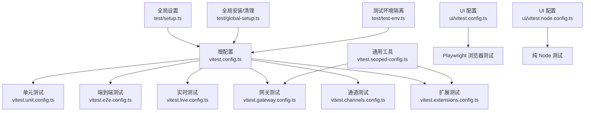
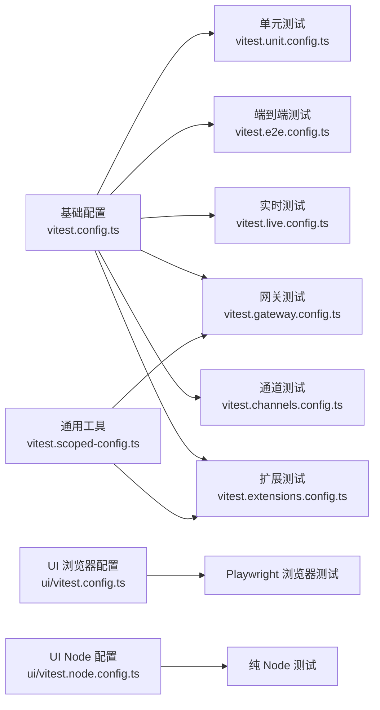
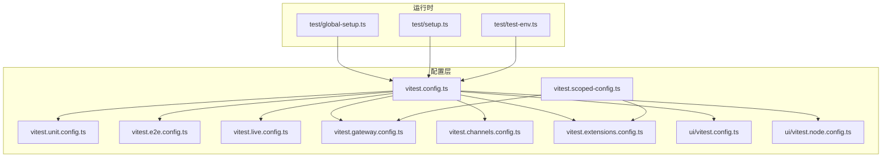

# 测试架构

<cite>
**本文引用的文件**
- [vitest.config.ts](file://vitest.config.ts)
- [vitest.unit.config.ts](file://vitest.unit.config.ts)
- [vitest.e2e.config.ts](file://vitest.e2e.config.ts)
- [vitest.live.config.ts](file://vitest.live.config.ts)
- [vitest.gateway.config.ts](file://vitest.gateway.config.ts)
- [vitest.channels.config.ts](file://vitest.channels.config.ts)
- [vitest.extensions.config.ts](file://vitest.extensions.config.ts)
- [vitest.scoped-config.ts](file://vitest.scoped-config.ts)
- [test/setup.ts](file://test/setup.ts)
- [test/global-setup.ts](file://test/global-setup.ts)
- [test/test-env.ts](file://test/test-env.ts)
- [ui/vitest.config.ts](file://ui/vitest.config.ts)
- [ui/vitest.node.config.ts](file://ui/vitest.node.config.ts)
</cite>

## 目录

1. [引言](#引言)
2. [项目结构](#项目结构)
3. [核心组件](#核心组件)
4. [架构总览](#架构总览)
5. [详细组件分析](#详细组件分析)
6. [依赖关系分析](#依赖关系分析)
7. [性能考量](#性能考量)
8. [故障排查指南](#故障排查指南)
9. [结论](#结论)
10. [附录](#附录)

## 引言

本文件系统性梳理 OpenClaw 的测试架构与 Vitest 配置体系，覆盖单元测试、端到端测试（E2E）、网关测试、通道测试、扩展测试、实时测试以及 UI 浏览器测试等场景。重点说明测试环境隔离策略、并行执行与资源调度、覆盖率计算范围与阈值、全局设置与环境变量、Mock 与桩模块的最佳实践，并提供可复用的自定义配置指南与性能优化建议。

## 项目结构

仓库采用多配置分层设计：根级统一基础配置，按功能域拆分专用配置；同时为 UI 提供独立的浏览器与 Node 场景配置。测试入口与运行策略由各配置文件精确控制，确保不同测试类型在隔离环境中高效执行。

图表来源

- [vitest.config.ts:57-202](file://vitest.config.ts#L57-L202)
- [vitest.unit.config.ts:11-30](file://vitest.unit.config.ts#L11-L30)
- [vitest.e2e.config.ts:20-32](file://vitest.e2e.config.ts#L20-L32)
- [vitest.live.config.ts:8-16](file://vitest.live.config.ts#L8-L16)
- [vitest.gateway.config.ts:1-3](file://vitest.gateway.config.ts#L1-L3)
- [vitest.channels.config.ts:7-20](file://vitest.channels.config.ts#L7-L20)
- [vitest.extensions.config.ts:1-3](file://vitest.extensions.config.ts#L1-L3)
- [vitest.scoped-config.ts:4-17](file://vitest.scoped-config.ts#L4-L17)
- [ui/vitest.config.ts:4-15](file://ui/vitest.config.ts#L4-L15)
- [ui/vitest.node.config.ts:4-10](file://ui/vitest.node.config.ts#L4-L10)
- [test/setup.ts:1-201](file://test/setup.ts#L1-L201)
- [test/global-setup.ts:1-7](file://test/global-setup.ts#L1-L7)
- [test/test-env.ts:54-147](file://test/test-env.ts#L54-L147)

章节来源

- [vitest.config.ts:57-202](file://vitest.config.ts#L57-L202)
- [vitest.unit.config.ts:11-30](file://vitest.unit.config.ts#L11-L30)
- [vitest.e2e.config.ts:20-32](file://vitest.e2e.config.ts#L20-L32)
- [vitest.live.config.ts:8-16](file://vitest.live.config.ts#L8-L16)
- [vitest.gateway.config.ts:1-3](file://vitest.gateway.config.ts#L1-L3)
- [vitest.channels.config.ts:7-20](file://vitest.channels.config.ts#L7-L20)
- [vitest.extensions.config.ts:1-3](file://vitest.extensions.config.ts#L1-L3)
- [vitest.scoped-config.ts:4-17](file://vitest.scoped-config.ts#L4-L17)
- [ui/vitest.config.ts:4-15](file://ui/vitest.config.ts#L4-L15)
- [ui/vitest.node.config.ts:4-10](file://ui/vitest.node.config.ts#L4-L10)
- [test/setup.ts:1-201](file://test/setup.ts#L1-L201)
- [test/global-setup.ts:1-7](file://test/global-setup.ts#L1-L7)
- [test/test-env.ts:54-147](file://test/test-env.ts#L54-L147)

## 核心组件

- 基础配置（根）：集中定义别名映射、超时、池类型、并发、包含/排除模式、覆盖率策略与阈值、全局设置文件等。
- 功能域配置：基于基础配置派生，通过 include/exclude 精准限定测试范围，避免无关模块参与特定测试域。
- UI 配置：分别为浏览器（Playwright）与 Node 场景提供独立配置，避免不必要的浏览器依赖。
- 全局设置与环境隔离：在 setup 中安装警告过滤、插件注册桩、时钟恢复；在 test-env 中隔离 HOME/XDG 路径、端口、令牌等环境变量，支持“真实环境”模式用于实时测试。

章节来源

- [vitest.config.ts:57-202](file://vitest.config.ts#L57-L202)
- [vitest.scoped-config.ts:4-17](file://vitest.scoped-config.ts#L4-L17)
- [test/setup.ts:1-201](file://test/setup.ts#L1-L201)
- [test/test-env.ts:54-147](file://test/test-env.ts#L54-L147)
- [ui/vitest.config.ts:4-15](file://ui/vitest.config.ts#L4-L15)
- [ui/vitest.node.config.ts:4-10](file://ui/vitest.node.config.ts#L4-L10)

## 架构总览

下图展示测试配置的继承与覆盖关系，以及关键运行参数如何影响测试域的行为。

图表来源

- [vitest.config.ts:57-202](file://vitest.config.ts#L57-L202)
- [vitest.unit.config.ts:11-30](file://vitest.unit.config.ts#L11-L30)
- [vitest.e2e.config.ts:20-32](file://vitest.e2e.config.ts#L20-L32)
- [vitest.live.config.ts:8-16](file://vitest.live.config.ts#L8-L16)
- [vitest.gateway.config.ts:1-3](file://vitest.gateway.config.ts#L1-L3)
- [vitest.channels.config.ts:7-20](file://vitest.channels.config.ts#L7-L20)
- [vitest.extensions.config.ts:1-3](file://vitest.extensions.config.ts#L1-L3)
- [vitest.scoped-config.ts:4-17](file://vitest.scoped-config.ts#L4-L17)
- [ui/vitest.config.ts:4-15](file://ui/vitest.config.ts#L4-L15)
- [ui/vitest.node.config.ts:4-10](file://ui/vitest.node.config.ts#L4-L10)

## 详细组件分析

### 基础配置（根）

- 别名解析：为插件 SDK 子路径建立精确别名，保证测试中对内部模块的导入行为与生产一致。
- 执行与隔离：
  - 池类型：默认使用进程池，确保跨文件环境隔离，避免 vmForks 下的环境泄漏。
  - 超时：测试与钩子分别设定合理上限，Windows 平台额外放宽钩子超时。
  - 反stub：开启 unstubEnvs/unstubGlobals，防止跨文件污染。
  - 并发：本地根据 CPU 数量动态分配 workers，CI 在 Windows 上限制为 2，在其他平台为 3。
- 包含/排除：统一扫描 src、extensions、test 与 UI 视图中的测试文件，同时排除 macOS 应用、dist、vendor、以及所有 \*.live.test.ts 文件。
- 覆盖率：
  - 提供者：v8。
  - 报告器：文本与 LCOV。
  - 范围：仅统计实际被测试套件覆盖的源码，锚定仓库根 src/，避免嵌套包（extensions、apps、ui、test）计入。
  - 阈值：行、函数、分支、语句均设为较高门槛，鼓励高质量测试。
  - 排除清单：大量集成/交互面模块、入口与桥接文件、部分 agent 与 gateway server 方法、进程桥接、TUI/Wizard、以及若干难以单元测试的模块。

章节来源

- [vitest.config.ts:57-202](file://vitest.config.ts#L57-L202)

### 单元测试配置（vitest.unit.config.ts）

- 继承基础配置，移除扩展测试范围，聚焦核心业务逻辑与工具模块。
- 排除范围：进一步剔除 gateway、web、browser、line、agents、auto-reply、commands 等集成面，确保单元测试纯粹。

章节来源

- [vitest.unit.config.ts:11-30](file://vitest.unit.config.ts#L11-L30)

### 端到端测试配置（vitest.e2e.config.ts）

- 继承基础配置，强制使用进程池以避免 vmForks 的状态泄漏。
- 并发：默认按 CPU 的 25% 计算 workers，CI 下最小为 1，最大为 2；可通过环境变量覆盖。
- 输出：可通过环境变量控制静默级别。
- 包含/排除：仅匹配 \*.e2e.test.ts 文件，其余测试文件从基础排除列表中剔除。

章节来源

- [vitest.e2e.config.ts:20-32](file://vitest.e2e.config.ts#L20-L32)

### 实时测试配置（vitest.live.config.ts）

- 继承基础配置，限制并发为 1，确保实时测试的确定性。
- 包含范围：仅匹配 \*.live.test.ts 文件。

章节来源

- [vitest.live.config.ts:8-16](file://vitest.live.config.ts#L8-L16)

### 网关测试配置（vitest.gateway.config.ts）

- 使用通用工具创建作用域配置，仅包含 src/gateway 下的测试文件，排除其他模块。

章节来源

- [vitest.gateway.config.ts:1-3](file://vitest.gateway.config.ts#L1-L3)
- [vitest.scoped-config.ts:4-17](file://vitest.scoped-config.ts#L4-L17)

### 通道测试配置（vitest.channels.config.ts）

- 仅包含主流通道实现的测试，如 telegram、discord、web、browser、line。
- 排除 gateway 与扩展，避免交叉污染。

章节来源

- [vitest.channels.config.ts:7-20](file://vitest.channels.config.ts#L7-L20)

### 扩展测试配置（vitest.extensions.config.ts）

- 使用通用工具创建作用域配置，仅包含 extensions 下的测试文件。

章节来源

- [vitest.extensions.config.ts:1-3](file://vitest.extensions.config.ts#L1-L3)
- [vitest.scoped-config.ts:4-17](file://vitest.scoped-config.ts#L4-L17)

### UI 测试配置

- 浏览器测试（ui/vitest.config.ts）：
  - 启用浏览器环境，使用 Playwright 提供商，实例为 Chromium，headless 运行，禁用 UI。
  - 仅包含 src 下的测试文件。
- Node 专属测试（ui/vitest.node.config.ts）：
  - 仅包含 \*.node.test.ts 文件，明确区分纯逻辑测试与浏览器依赖测试。

章节来源

- [ui/vitest.config.ts:4-15](file://ui/vitest.config.ts#L4-L15)
- [ui/vitest.node.config.ts:4-10](file://ui/vitest.node.config.ts#L4-L10)

### 全局设置与环境隔离（test/setup.ts、test/test-env.ts、test/global-setup.ts）

- 安装与清理：
  - 在全局安装阶段设置测试标志与缓存参数，提升插件清单发现性能。
  - 在全局安装阶段安装进程警告过滤器，减少噪音。
  - 在全局安装阶段创建默认插件注册表并注入，每个测试文件结束后恢复默认注册表，避免跨文件污染。
  - 在 afterEach 中确保 fake timers 被重置，避免跨文件计时器泄漏。
- 环境隔离：
  - 将 HOME、XDG*\*、OPENCLAW*\* 等路径与令牌变量隔离至临时目录，避免污染真实用户状态。
  - 支持“真实环境”模式（LIVE=1 或相关开关），此时加载用户 profile 环境变量，便于实时测试。
  - 清理阶段恢复原始环境变量与删除临时目录。

章节来源

- [test/setup.ts:1-201](file://test/setup.ts#L1-L201)
- [test/test-env.ts:54-147](file://test/test-env.ts#L54-L147)
- [test/global-setup.ts:1-7](file://test/global-setup.ts#L1-L7)

## 依赖关系分析

- 继承关系：各功能域配置均以基础配置为基底，通过 include/exclude 聚焦目标域，减少无关模块参与，降低耦合度。
- 工具复用：通用工具提供 createScopedVitestConfig，统一生成作用域配置，避免重复样板。
- 运行时依赖：UI 浏览器测试依赖 Playwright，Node 专属测试不依赖浏览器，降低资源消耗。
- 环境依赖：全局设置与环境隔离确保测试在稳定、可重复的环境中运行，避免外部因素干扰。

图表来源

- [vitest.config.ts:57-202](file://vitest.config.ts#L57-L202)
- [vitest.unit.config.ts:11-30](file://vitest.unit.config.ts#L11-L30)
- [vitest.e2e.config.ts:20-32](file://vitest.e2e.config.ts#L20-L32)
- [vitest.live.config.ts:8-16](file://vitest.live.config.ts#L8-L16)
- [vitest.gateway.config.ts:1-3](file://vitest.gateway.config.ts#L1-L3)
- [vitest.channels.config.ts:7-20](file://vitest.channels.config.ts#L7-L20)
- [vitest.extensions.config.ts:1-3](file://vitest.extensions.config.ts#L1-L3)
- [vitest.scoped-config.ts:4-17](file://vitest.scoped-config.ts#L4-L17)
- [ui/vitest.config.ts:4-15](file://ui/vitest.config.ts#L4-L15)
- [ui/vitest.node.config.ts:4-10](file://ui/vitest.node.config.ts#L4-L10)
- [test/global-setup.ts:1-7](file://test/global-setup.ts#L1-L7)
- [test/setup.ts:1-201](file://test/setup.ts#L1-L201)
- [test/test-env.ts:54-147](file://test/test-env.ts#L54-L147)

章节来源

- [vitest.config.ts:57-202](file://vitest.config.ts#L57-L202)
- [vitest.scoped-config.ts:4-17](file://vitest.scoped-config.ts#L4-L17)
- [test/setup.ts:1-201](file://test/setup.ts#L1-L201)
- [test/test-env.ts:54-147](file://test/test-env.ts#L54-L147)
- [ui/vitest.config.ts:4-15](file://ui/vitest.config.ts#L4-L15)
- [ui/vitest.node.config.ts:4-10](file://ui/vitest.node.config.ts#L4-L10)

## 性能考量

- 并发与资源：
  - 基础配置按 CPU 数量动态分配 workers，CI 下 Windows 限制为 2，其他平台为 3，兼顾稳定性与速度。
  - E2E 默认保守并发，按 CPU 的 25% 计算，可通过环境变量覆盖，适合需要稳定性的集成场景。
  - 实时测试强制单工，避免并发竞争。
- 超时与稳定性：
  - 测试与钩子超时针对不同平台与场景设定，Windows 钩子超时更高，避免误判。
  - 开启 unstubEnvs/unstubGlobals，减少跨文件状态泄漏导致的不稳定。
- 覆盖率与范围：
  - 仅统计实际被测试覆盖的源码，排除大量集成/交互面模块，避免覆盖率被“大而全”的表面数据稀释。
  - 阈值较高，鼓励更全面的单元测试。
- 环境与启动：
  - 全局设置中提升监听器预算，减少事件系统警告噪声。
  - 插件清单缓存参数在测试中启用，减少重复扫描开销。

章节来源

- [vitest.config.ts:71-202](file://vitest.config.ts#L71-L202)
- [vitest.e2e.config.ts:6-14](file://vitest.e2e.config.ts#L6-L14)
- [vitest.live.config.ts:12-12](file://vitest.live.config.ts#L12-L12)
- [test/setup.ts:10-19](file://test/setup.ts#L10-L19)

## 故障排查指南

- 环境变量泄漏：
  - 症状：跨文件测试结果异常、Mock 失效。
  - 处理：确认已启用 unstubEnvs/unstubGlobals；在实时/浏览器测试中优先使用进程池；检查是否在测试中手动修改了全局环境。
- 并发导致的竞争：
  - 症状：E2E 或实时测试偶发失败。
  - 处理：E2E 使用进程池且限制并发；实时测试固定为单工；必要时通过环境变量调整并发数。
- 插件注册污染：
  - 症状：通道或网关测试间互相影响。
  - 处理：确保在 beforeEach/beforeAll 中正确设置默认插件注册表；在 afterEach 恢复默认；避免直接修改全局注册表。
- 路径与令牌泄露：
  - 症状：测试访问真实配置或外部令牌。
  - 处理：确认隔离环境已生效；若需真实环境，请显式启用 LIVE 模式；检查临时 HOME 与 XDG 目录是否被正确清理。
- UI 浏览器测试失败：
  - 症状：浏览器无法启动或页面加载异常。
  - 处理：确认 Playwright 提供商可用；检查 Chromium 实例配置与 headless 设置；必要时在本地启用 UI 调试。

章节来源

- [test/setup.ts:188-201](file://test/setup.ts#L188-L201)
- [test/test-env.ts:94-147](file://test/test-env.ts#L94-L147)
- [vitest.e2e.config.ts:24-26](file://vitest.e2e.config.ts#L24-L26)
- [vitest.live.config.ts:12-12](file://vitest.live.config.ts#L12-L12)
- [ui/vitest.config.ts:7-13](file://ui/vitest.config.ts#L7-L13)

## 结论

该测试架构通过“根配置 + 功能域配置 + 通用工具 + 全局设置”的分层设计，实现了高内聚、低耦合的测试运行体系。基础配置统一了执行策略与覆盖率标准，功能域配置精准限定范围，全局设置与环境隔离保障了稳定性与可重复性。配合合理的并发与超时策略，既能满足快速反馈，也能保证集成与实时场景的可靠性。

## 附录

### 自定义配置指南

- 新增测试域：
  - 若需新增一个测试域，建议复用通用工具创建作用域配置，仅修改 include/exclude，保持与基础配置一致的执行策略。
  - 示例参考：[vitest.scoped-config.ts:4-17](file://vitest.scoped-config.ts#L4-L17)、[vitest.gateway.config.ts:1-3](file://vitest.gateway.config.ts#L1-L3)、[vitest.extensions.config.ts:1-3](file://vitest.extensions.config.ts#L1-L3)。
- 调整并发与超时：
  - 基础配置中已内置平台差异与 CI 适配；如需微调，可在对应域配置中覆盖 maxWorkers、pool、testTimeout 等参数。
  - 参考：[vitest.config.ts:71-81](file://vitest.config.ts#L71-L81)、[vitest.e2e.config.ts:6-14](file://vitest.e2e.config.ts#L6-L14)、[vitest.live.config.ts:12-12](file://vitest.live.config.ts#L12-L12)。
- 覆盖率策略：
  - 如需扩大或收紧覆盖率统计范围，可在基础配置的 include/exclude 中调整；注意保持与集成/交互面测试分离。
  - 参考：[vitest.config.ts:101-199](file://vitest.config.ts#L101-L199)。
- 环境隔离：
  - 若需在新场景中引入真实环境变量，请在全局安装阶段显式启用 LIVE 模式，并确保在清理阶段恢复环境。
  - 参考：[test/global-setup.ts:1-7](file://test/global-setup.ts#L1-L7)、[test/test-env.ts:55-65](file://test/test-env.ts#L55-L65)。

### 最佳实践

- 使用进程池（尤其 E2E 与实时测试）避免 vmForks 的状态泄漏。
- 在 setup 中统一安装警告过滤、插件注册桩与时钟恢复，减少跨文件污染。
- 严格区分单元/集成/实时/UI 测试域，避免相互干扰。
- 通过环境变量灵活控制并发与输出级别，平衡速度与可观测性。
- 保持覆盖率阈值与统计范围稳定，避免被“大而全”的表面数据稀释。
