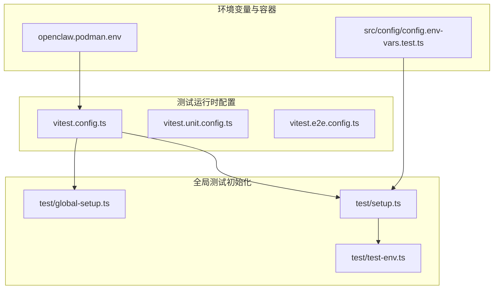
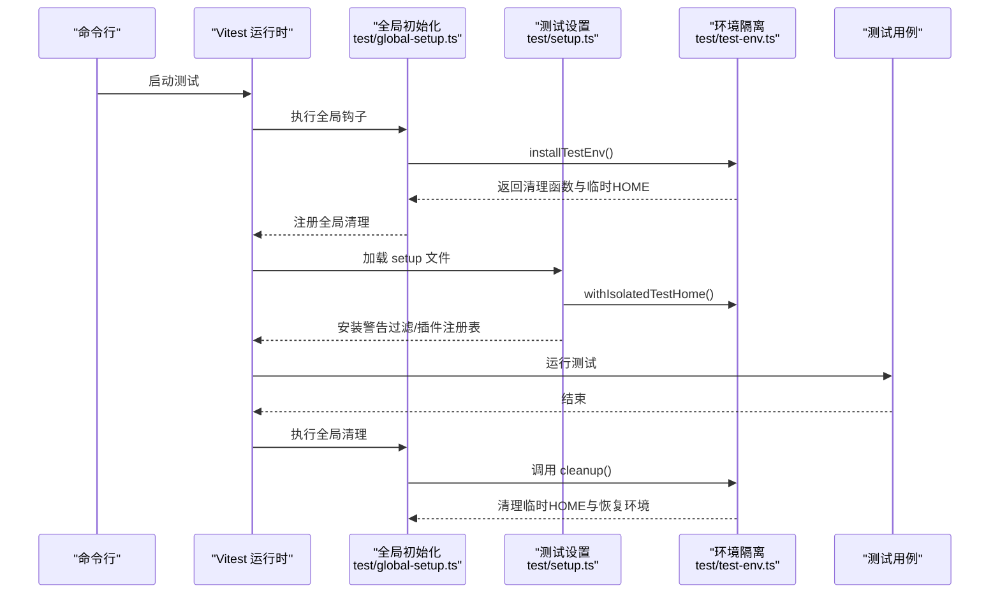
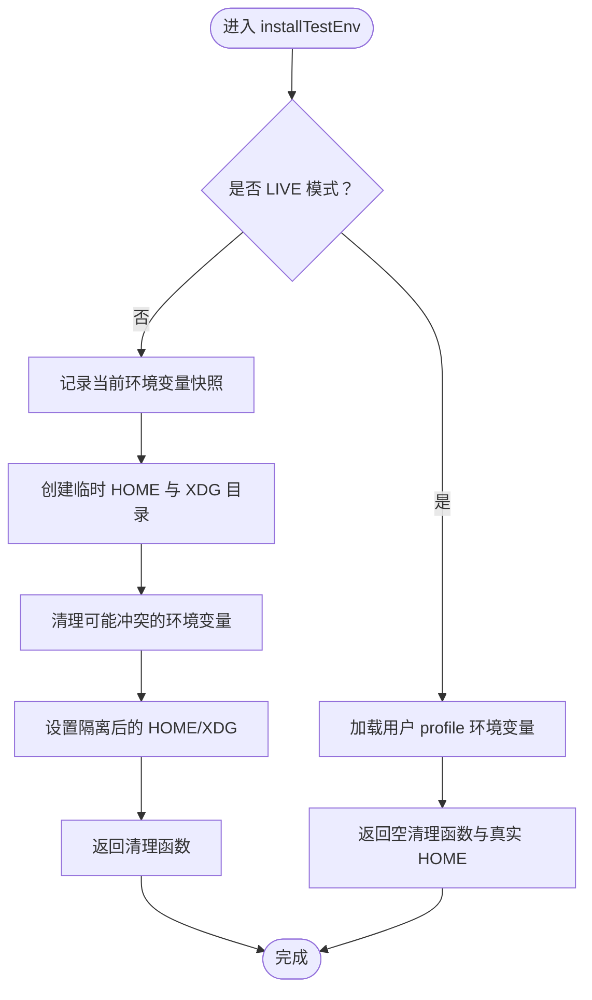
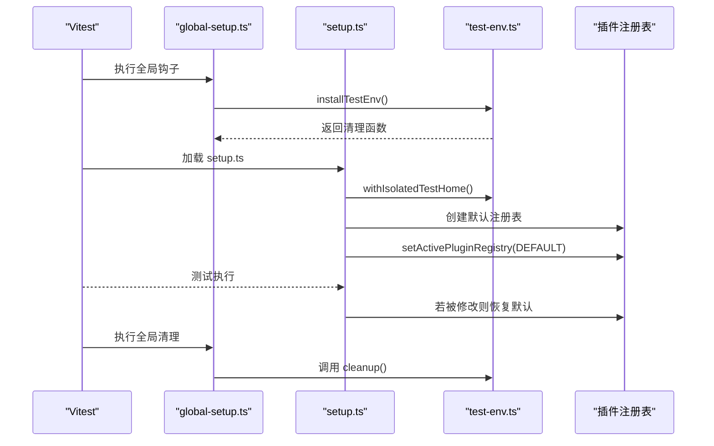
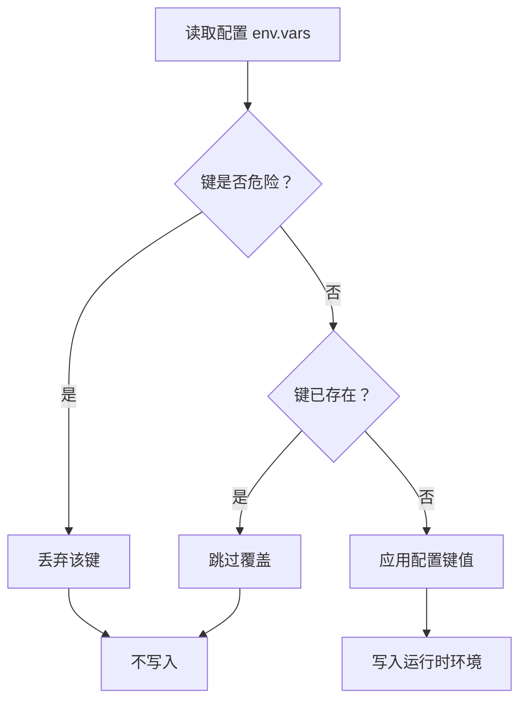
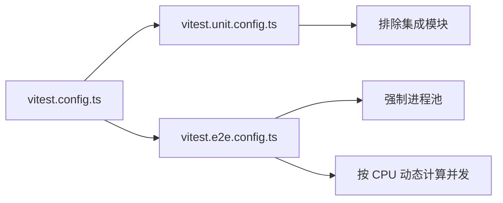
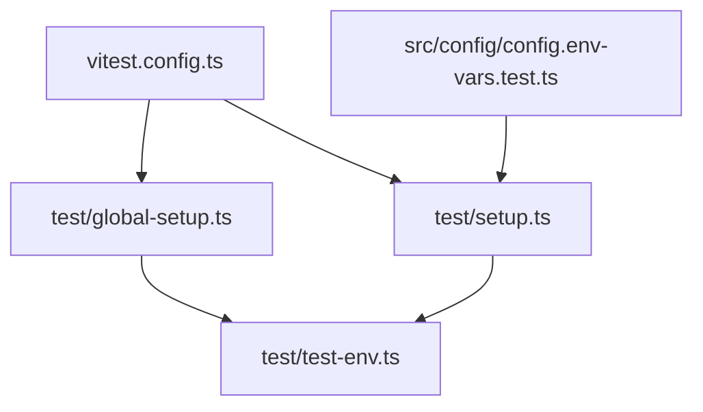

# 测试环境配置

<cite>
**本文档引用的文件**
- [test/global-setup.ts](file://test/global-setup.ts)
- [test/test-env.ts](file://test/test-env.ts)
- [test/setup.ts](file://test/setup.ts)
- [vitest.config.ts](file://vitest.config.ts)
- [vitest.unit.config.ts](file://vitest.unit.config.ts)
- [vitest.e2e.config.ts](file://vitest.e2e.config.ts)
- [openclaw.podman.env](file://openclaw.podman.env)
- [src/config/config.env-vars.test.ts](file://src/config/config.env-vars.test.ts)
</cite>

## 目录

1. [简介](#简介)
2. [项目结构](#项目结构)
3. [核心组件](#核心组件)
4. [架构总览](#架构总览)
5. [详细组件分析](#详细组件分析)
6. [依赖关系分析](#依赖关系分析)
7. [性能考量](#性能考量)
8. [故障排查指南](#故障排查指南)
9. [结论](#结论)
10. [附录](#附录)

## 简介

本文件系统性阐述本仓库的测试环境配置与管理，覆盖以下主题：

- 测试环境变量的设置与隔离策略（含数据库连接、API 密钥、第三方服务）
- 全局测试设置的初始化流程与测试夹具生命周期管理
- 测试数据库的准备、清理与回滚策略建议
- 不同测试场景下的环境配置模板与最佳实践
- 测试隔离、并发测试与资源竞争的解决方案

## 项目结构

测试相关的核心文件分布于以下位置：

- 测试运行时配置：vitest.\*.config.ts
- 全局测试初始化：test/global-setup.ts、test/setup.ts
- 测试环境隔离与恢复：test/test-env.ts
- 环境变量加载与替换：src/config/config.env-vars.test.ts
- 容器化测试环境示例：openclaw.podman.env

**图表来源**

- [vitest.config.ts:1-203](file://vitest.config.ts#L1-L203)
- [vitest.unit.config.ts:1-31](file://vitest.unit.config.ts#L1-L31)
- [vitest.e2e.config.ts:1-33](file://vitest.e2e.config.ts#L1-L33)
- [test/global-setup.ts:1-7](file://test/global-setup.ts#L1-L7)
- [test/setup.ts:1-201](file://test/setup.ts#L1-L201)
- [test/test-env.ts:1-148](file://test/test-env.ts#L1-L148)
- [src/config/config.env-vars.test.ts:1-134](file://src/config/config.env-vars.test.ts#L1-L134)
- [openclaw.podman.env:1-25](file://openclaw.podman.env#L1-L25)

**章节来源**

- [vitest.config.ts:1-203](file://vitest.config.ts#L1-L203)
- [test/global-setup.ts:1-7](file://test/global-setup.ts#L1-L7)
- [test/setup.ts:1-201](file://test/setup.ts#L1-L201)
- [test/test-env.ts:1-148](file://test/test-env.ts#L1-L148)
- [src/config/config.env-vars.test.ts:1-134](file://src/config/config.env-vars.test.ts#L1-L134)
- [openclaw.podman.env:1-25](file://openclaw.podman.env#L1-L25)

## 核心组件

- 测试环境隔离与恢复：通过临时 HOME 与 XDG 目录隔离真实用户状态；在 LIVE 模式下可加载用户配置以支持真实第三方服务联调。
- 全局初始化：Vitest 在启动时执行全局 setup 文件，安装警告过滤、插件运行时注册表、以及统一的通道发送桩。
- 并发与隔离：通过进程池与 vmForks 的 unstub 能力，避免跨文件污染；E2E 使用进程池确保确定性。
- 环境变量加载与替换：支持从配置中注入安全的环境变量，从用户状态目录加载 .env，并进行变量替换。

**章节来源**

- [test/test-env.ts:54-148](file://test/test-env.ts#L54-L148)
- [test/setup.ts:28-201](file://test/setup.ts#L28-L201)
- [vitest.config.ts:71-100](file://vitest.config.ts#L71-L100)
- [src/config/config.env-vars.test.ts:14-134](file://src/config/config.env-vars.test.ts#L14-L134)

## 架构总览

测试环境配置的总体流程如下：

**图表来源**

- [test/global-setup.ts:3-6](file://test/global-setup.ts#L3-L6)
- [test/test-env.ts:54-148](file://test/test-env.ts#L54-L148)
- [test/setup.ts:28-44](file://test/setup.ts#L28-L44)

## 详细组件分析

### 组件一：测试环境隔离与恢复（test/test-env.ts）

- 目标
  - 隔离测试 HOME 与 XDG 目录，避免污染真实用户状态
  - 在 LIVE 模式下加载用户配置，支持真实第三方服务联调
  - 提供可逆的环境恢复机制
- 关键行为
  - 临时目录生成与清理
  - 环境变量快照与恢复
  - LIVE 模式下从用户 shell profile 注入环境变量
- 复杂度
  - 时间复杂度：O(k)，k 为需要恢复的环境变量数量
  - 空间复杂度：O(k)

**图表来源**

- [test/test-env.ts:54-148](file://test/test-env.ts#L54-L148)

**章节来源**

- [test/test-env.ts:54-148](file://test/test-env.ts#L54-L148)

### 组件二：全局测试初始化（test/global-setup.ts 与 test/setup.ts）

- 目标
  - 在所有测试前安装警告过滤与插件运行时
  - 建立统一的通道发送桩，屏蔽真实网络请求
  - 确保每个测试文件的插件注册表一致性
- 关键行为
  - 全局钩子注册与清理
  - 插件注册表的默认值与恢复
  - 虚拟时钟的统一复位
- 生命周期
  - beforeAll：激活默认插件注册表
  - afterEach：若注册表被修改则恢复默认
  - afterAll：清理测试环境

**图表来源**

- [test/global-setup.ts:3-6](file://test/global-setup.ts#L3-L6)
- [test/setup.ts:28-201](file://test/setup.ts#L28-L201)
- [test/test-env.ts:54-148](file://test/test-env.ts#L54-L148)

**章节来源**

- [test/global-setup.ts:1-7](file://test/global-setup.ts#L1-L7)
- [test/setup.ts:28-201](file://test/setup.ts#L28-L201)

### 组件三：环境变量加载与替换（src/config/config.env-vars.test.ts）

- 目标
  - 安全地从配置注入环境变量，避免危险键
  - 支持从用户状态目录加载 .env 并进行变量替换
- 关键行为
  - 仅在缺失时应用配置中的环境变量
  - 过滤危险键（如 SHELL、HOME、ZDOTDIR 等）
  - 支持重复加载与替换逻辑

**图表来源**

- [src/config/config.env-vars.test.ts:14-82](file://src/config/config.env-vars.test.ts#L14-L82)

**章节来源**

- [src/config/config.env-vars.test.ts:14-134](file://src/config/config.env-vars.test.ts#L14-L134)

### 组件四：Vitest 运行时配置（vitest.config.ts 及其派生配置）

- 目标
  - 统一测试超时、池类型、并发数与覆盖率范围
  - 为插件 SDK 提供别名解析
  - 区分单元测试与端到端测试的隔离策略
- 关键行为
  - 单元测试：排除大量集成模块，聚焦核心逻辑
  - 端到端测试：使用进程池，限制并发，提升稳定性
  - CI/本地差异化并发策略

**图表来源**

- [vitest.config.ts:57-203](file://vitest.config.ts#L57-L203)
- [vitest.unit.config.ts:11-31](file://vitest.unit.config.ts#L11-L31)
- [vitest.e2e.config.ts:20-33](file://vitest.e2e.config.ts#L20-L33)

**章节来源**

- [vitest.config.ts:57-203](file://vitest.config.ts#L57-L203)
- [vitest.unit.config.ts:1-31](file://vitest.unit.config.ts#L1-L31)
- [vitest.e2e.config.ts:1-33](file://vitest.e2e.config.ts#L1-L33)

### 组件五：容器化测试环境模板（openclaw.podman.env）

- 目标
  - 提供 Podman 启动时的网关认证令牌与可选的 LLM 提供商密钥
  - 映射主机端口以便本地调试
- 使用建议
  - 将示例文件复制为本地配置文件并设置令牌
  - 在容器启动脚本中注入环境变量

**章节来源**

- [openclaw.podman.env:1-25](file://openclaw.podman.env#L1-L25)

## 依赖关系分析

- test/global-setup.ts 依赖 test/test-env.ts 提供的隔离与清理能力
- test/setup.ts 依赖 test/test-env.ts 进行 HOME 隔离，并在 beforeAll/afterEach 中管理插件注册表
- vitest.config.ts 指定 setup 文件路径，从而串联全局初始化链路
- src/config/config.env-vars.test.ts 展示了环境变量加载与替换的最佳实践，可作为测试中注入密钥的参考

**图表来源**

- [test/global-setup.ts:1-7](file://test/global-setup.ts#L1-L7)
- [test/test-env.ts:1-148](file://test/test-env.ts#L1-L148)
- [test/setup.ts:1-201](file://test/setup.ts#L1-L201)
- [vitest.config.ts:71-90](file://vitest.config.ts#L71-L90)
- [src/config/config.env-vars.test.ts:1-134](file://src/config/config.env-vars.test.ts#L1-L134)

**章节来源**

- [test/global-setup.ts:1-7](file://test/global-setup.ts#L1-L7)
- [test/setup.ts:1-201](file://test/setup.ts#L1-L201)
- [vitest.config.ts:71-90](file://vitest.config.ts#L71-L90)
- [src/config/config.env-vars.test.ts:1-134](file://src/config/config.env-vars.test.ts#L1-L134)

## 性能考量

- 并发与隔离
  - 单元测试使用进程池与严格的 include/exclude，减少不必要的模块加载
  - E2E 强制进程池，避免 vmForks 的上下文共享导致的状态泄漏
- 资源上限
  - 通过最大工作进程数与超时时间控制资源占用
- 缓存与监听器预算
  - 设置插件清单缓存与进程监听器上限，降低 CI 环境噪音与开销

**章节来源**

- [vitest.config.ts:71-100](file://vitest.config.ts#L71-L100)
- [vitest.e2e.config.ts:20-33](file://vitest.e2e.config.ts#L20-L33)
- [test/setup.ts:9-20](file://test/setup.ts#L9-L20)

## 故障排查指南

- 环境变量泄漏
  - 症状：跨文件或跨测试污染
  - 解决：启用 unstubEnvs/unstubGlobals，确保在 vmForks 下也能正确恢复
- 虚拟时钟泄漏
  - 症状：定时器影响后续测试
  - 解决：afterEach 中统一复位虚拟时钟
- 插件注册表异常
  - 症状：测试间状态不一致
  - 解决：beforeAll 激活默认注册表，afterEach 恢复
- LIVE 模式下密钥未生效
  - 症状：真实第三方服务调用失败
  - 解决：确认 LIVE 相关环境变量已设置，且 profile 已正确加载

**章节来源**

- [vitest.config.ts:74-78](file://vitest.config.ts#L74-L78)
- [test/setup.ts:192-200](file://test/setup.ts#L192-L200)
- [test/test-env.ts:54-65](file://test/test-env.ts#L54-L65)

## 结论

本项目的测试环境配置通过“隔离 HOME/XDG、统一插件注册表、严格的 unstub 策略与明确的生命周期管理”，实现了高可靠、可扩展的测试运行时。结合容器化模板与安全的环境变量注入策略，能够在保证隔离的同时满足真实服务联调需求。

## 附录

### A. 数据库连接与测试数据库策略

- 建议
  - 使用独立的测试数据库实例或内存数据库（如 SQLite 内存模式）以实现快速回滚与隔离
  - 在测试开始时创建最小化 schema，结束时删除或回滚事务
  - 对于持久化存储，优先使用临时目录与隔离 HOME，避免污染真实数据
- 回滚策略
  - 单元测试：每个用例结束后回滚事务
  - 集成/端到端测试：在 afterEach 中重置 schema 或重建数据库

### B. API 密钥与第三方服务配置

- 注入方式
  - 通过 test/test-env.ts 的隔离环境与 LIVE 模式加载用户配置
  - 使用 src/config/config.env-vars.test.ts 的安全注入流程，避免危险键
- 最佳实践
  - 优先使用测试专用密钥或模拟服务
  - 在非 LIVE 模式下显式清理敏感变量，防止泄露

### C. 测试夹具生命周期管理

- 生命周期
  - 全局：安装隔离环境与清理钩子
  - 套件：beforeAll 激活默认插件注册表，afterEach 恢复
  - 用例：使用虚拟时钟与 unstub 能力
- 并发与隔离
  - 单元测试：进程池 + 严格 include/exclude
  - 端到端测试：进程池 + 低并发 + 显式日志开关

### D. 不同测试场景的环境配置模板

- 单元测试
  - 使用 vitest.unit.config.ts 的 include/exclude 规则
  - 禁用集成模块，聚焦核心逻辑
- 端到端测试
  - 使用 vitest.e2e.config.ts 的进程池与并发控制
  - 通过 OPENCLAW_E2E_WORKERS 调整并发
- 容器化测试
  - 使用 openclaw.podman.env 设置网关令牌与可选提供商密钥
  - 通过脚本注入环境变量并映射主机端口

**章节来源**

- [vitest.unit.config.ts:6-31](file://vitest.unit.config.ts#L6-L31)
- [vitest.e2e.config.ts:6-33](file://vitest.e2e.config.ts#L6-L33)
- [openclaw.podman.env:1-25](file://openclaw.podman.env#L1-L25)
