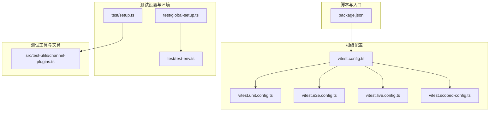
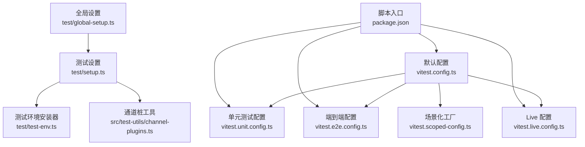
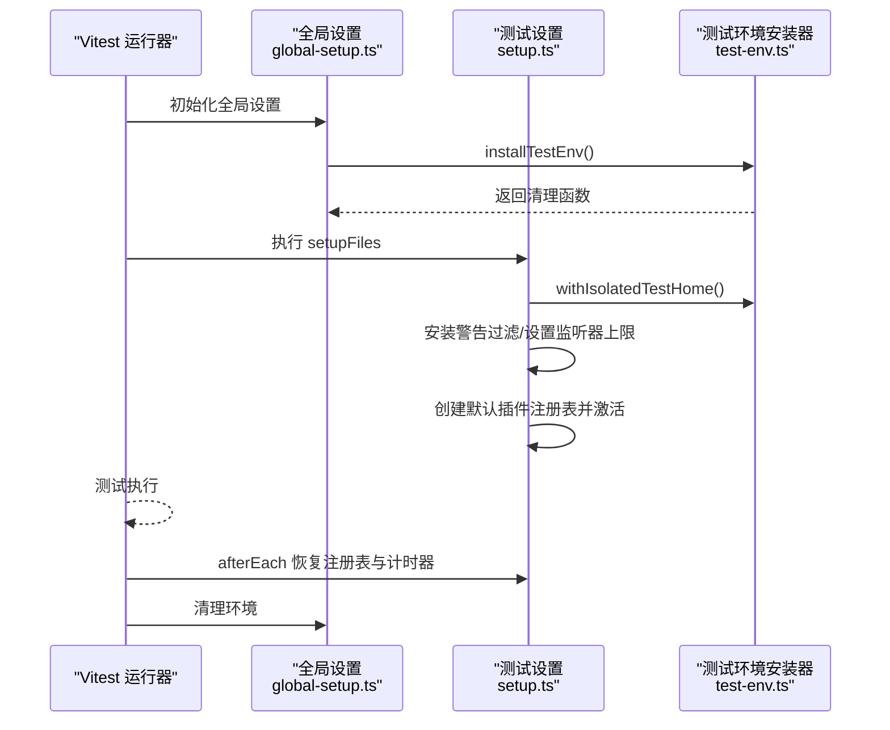
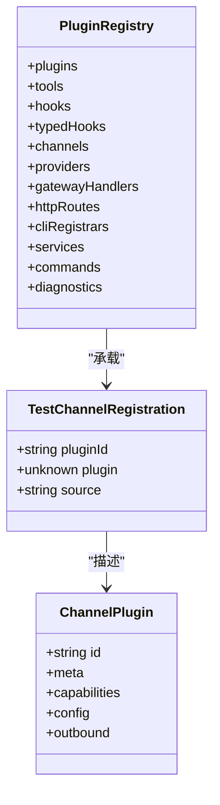
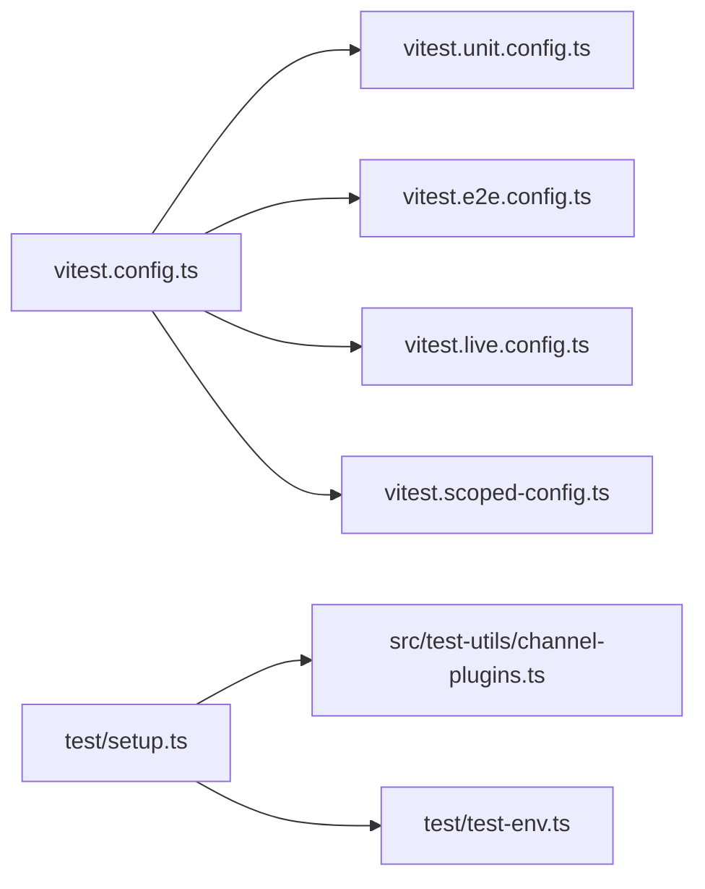

# 测试策略

<cite>
**本文引用的文件**
- [vitest.config.ts](file://vitest.config.ts)
- [vitest.unit.config.ts](file://vitest.unit.config.ts)
- [vitest.e2e.config.ts](file://vitest.e2e.config.ts)
- [vitest.live.config.ts](file://vitest.live.config.ts)
- [vitest.scoped-config.ts](file://vitest.scoped-config.ts)
- [setup.ts](file://test/setup.ts)
- [global-setup.ts](file://test/global-setup.ts)
- [test-env.ts](file://test/test-env.ts)
- [channel-plugins.ts](file://src/test-utils/channel-plugins.ts)
- [package.json](file://package.json)
- [package.json](file://apps/electron/package.json)
- [package.json](file://ui/package.json)
</cite>

## 目录

1. [引言](#引言)
2. [项目结构](#项目结构)
3. [核心组件](#核心组件)
4. [架构总览](#架构总览)
5. [详细组件分析](#详细组件分析)
6. [依赖分析](#依赖分析)
7. [性能考虑](#性能考虑)
8. [故障排查指南](#故障排查指南)
9. [结论](#结论)
10. [附录](#附录)

## 引言

本文件系统化阐述本仓库的测试策略与实施方法，覆盖测试架构、测试类型（单元、集成、端到端）、测试工具链（Vitest 及其多配置）、测试辅助工具与 fixtures 使用、Mock 策略、断言最佳实践、覆盖率要求、性能测试与回归测试流程，以及测试环境搭建与持续集成中的测试执行。

## 项目结构

本项目采用多包工作区与多平台应用并存的结构，测试体系围绕 Vitest 组织，通过多份配置文件实现不同场景的测试运行与隔离。测试相关的关键目录与文件如下：

- 根级 Vitest 配置：统一的默认配置与阈值、覆盖率排除规则、include/exclude 模式、池与并发策略等。
- 场景化配置：单元测试、端到端测试、Live 测试、扩展测试、网关测试、频道测试等专用配置。
- 测试设置与环境：全局 setup、进程隔离的测试环境安装器、插件注册表与通道桩工具。
- 测试工具与夹具：通道插件桩工厂、测试注册表构建器等。

**图表来源**

- [vitest.config.ts:1-203](file://vitest.config.ts#L1-L203)
- [vitest.unit.config.ts:1-31](file://vitest.unit.config.ts#L1-L31)
- [vitest.e2e.config.ts:1-33](file://vitest.e2e.config.ts#L1-L33)
- [vitest.live.config.ts:1-17](file://vitest.live.config.ts#L1-L17)
- [vitest.scoped-config.ts:1-18](file://vitest.scoped-config.ts#L1-L18)
- [global-setup.ts:1-7](file://test/global-setup.ts#L1-L7)
- [setup.ts:1-201](file://test/setup.ts#L1-L201)
- [test-env.ts:1-148](file://test/test-env.ts#L1-L148)
- [channel-plugins.ts:1-105](file://src/test-utils/channel-plugins.ts#L1-L105)
- [package.json:317-341](file://package.json#L317-L341)

**章节来源**

- [vitest.config.ts:1-203](file://vitest.config.ts#L1-L203)
- [package.json:317-341](file://package.json#L317-L341)

## 核心组件

- 默认 Vitest 配置：定义测试超时、钩子超时、环境/全局解桩策略、进程池与并发、包含/排除模式、覆盖率提供者与阈值、覆盖率锚定路径与排除列表。
- 单元测试配置：在默认配置基础上，过滤掉扩展与部分集成模块，聚焦纯逻辑与小范围功能。
- 端到端测试配置：强制使用进程池以避免 VM 上下文泄漏；按 CPU 数量动态计算默认并发；支持显式并发参数与静默/详细输出控制。
- Live 测试配置：单线程运行，仅匹配 live 测试文件，用于真实环境验证。
- 场景化配置工厂：提供 createScopedVitestConfig，便于按需 include/exclude 运行特定子集。
- 全局设置与测试环境：安装测试环境（隔离 HOME/XDG 路径、清理敏感变量、临时目录），在 beforeAll 中激活默认插件注册表，在 afterEach 中恢复注册表与计时器。
- 插件与通道桩工具：提供创建测试用插件、通道适配器、默认注册表的工厂函数，便于快速构造测试夹具。

**章节来源**

- [vitest.config.ts:57-202](file://vitest.config.ts#L57-L202)
- [vitest.unit.config.ts:1-31](file://vitest.unit.config.ts#L1-L31)
- [vitest.e2e.config.ts:1-33](file://vitest.e2e.config.ts#L1-L33)
- [vitest.live.config.ts:1-17](file://vitest.live.config.ts#L1-L17)
- [vitest.scoped-config.ts:1-18](file://vitest.scoped-config.ts#L1-L18)
- [setup.ts:1-201](file://test/setup.ts#L1-L201)
- [test-env.ts:54-148](file://test/test-env.ts#L54-L148)
- [channel-plugins.ts:1-105](file://src/test-utils/channel-plugins.ts#L1-L105)

## 架构总览

测试架构围绕“默认配置 + 场景化配置 + 设置与环境 + 工具与夹具”的分层设计展开。默认配置提供通用能力与约束，场景化配置细化运行边界与并发策略，设置与环境确保跨文件/进程隔离与可重复性，工具与夹具提升测试可维护性与可读性。

**图表来源**

- [vitest.config.ts:57-202](file://vitest.config.ts#L57-L202)
- [vitest.unit.config.ts:1-31](file://vitest.unit.config.ts#L1-L31)
- [vitest.e2e.config.ts:1-33](file://vitest.e2e.config.ts#L1-L33)
- [vitest.live.config.ts:1-17](file://vitest.live.config.ts#L1-L17)
- [vitest.scoped-config.ts:1-18](file://vitest.scoped-config.ts#L1-L18)
- [global-setup.ts:1-7](file://test/global-setup.ts#L1-L7)
- [setup.ts:1-201](file://test/setup.ts#L1-L201)
- [test-env.ts:54-148](file://test/test-env.ts#L54-L148)
- [channel-plugins.ts:1-105](file://src/test-utils/channel-plugins.ts#L1-L105)
- [package.json:317-341](file://package.json#L317-L341)

## 详细组件分析

### 默认 Vitest 配置（根级）

- 关键点
  - 测试超时与钩子超时：针对 Windows 做了额外放宽。
  - 环境与全局解桩：启用 unstubEnvs/unstubGlobals，避免 vmForks 下的跨文件污染。
  - 并发策略：本地基于 CPU 数量动态取值，CI 下固定为 2/3（Windows）。
  - 包含/排除：覆盖 src、extensions、test、UI 视图控制器与页面的测试文件。
  - 覆盖率：v8 提供者，生成文本与 LCOV；仅统计实际被测试套件执行的源码；对入口、CLI、网关、频道等大面集成模块进行排除，以保证阈值稳定。
- 影响范围
  - 所有场景化配置均继承该默认配置，形成一致的运行基线。

**章节来源**

- [vitest.config.ts:71-202](file://vitest.config.ts#L71-L202)

### 单元测试配置

- 关键点
  - 在默认 include 基础上，移除扩展测试路径，聚焦核心逻辑与小模块。
  - 排除网关、Telegram、Discord、Web、Browser、Line、Agents、Auto-Reply、Commands 等集成面，降低耦合与外部依赖。
- 适用场景
  - 快速反馈、高频迭代、低外部依赖的纯逻辑单元测试。

**章节来源**

- [vitest.unit.config.ts:6-30](file://vitest.unit.config.ts#L6-L30)

### 端到端测试配置

- 关键点
  - 强制使用进程池（forks），避免 VM 复用导致的状态泄漏。
  - 默认并发按 CPU 的 1/4 计算，CI 下限制在 1-2；可通过环境变量覆盖。
  - 支持静默/详细输出，便于 CI 日志控制。
  - 仅包含 e2e 测试文件，排除非 e2e 文件，确保运行确定性。
- 适用场景
  - 需要真实进程隔离与真实网络/文件系统交互的集成与端到端场景。

**章节来源**

- [vitest.e2e.config.ts:22-32](file://vitest.e2e.config.ts#L22-L32)

### Live 测试配置

- 关键点
  - 单线程运行，仅匹配 live 测试文件。
  - 适合需要真实用户环境与密钥的验证场景。
- 适用场景
  - 真实网关、真实渠道令牌等 live 验证。

**章节来源**

- [vitest.live.config.ts:8-16](file://vitest.live.config.ts#L8-L16)

### 场景化配置工厂

- 关键点
  - 提供 createScopedVitestConfig，允许按需传入 include/exclude，快速生成定制化配置。
- 适用场景
  - 针对特定子模块或特定测试集合的快速运行与调试。

**章节来源**

- [vitest.scoped-config.ts:4-17](file://vitest.scoped-config.ts#L4-L17)

### 测试设置与环境

- 全局设置
  - 安装测试环境并在退出时清理，确保进程级生命周期可控。
- 测试设置
  - 安装警告过滤、隔离 HOME/XDG、设置最大监听器数、安装默认插件注册表、在 afterEach 中恢复注册表与计时器。
  - 对特定 OAuth 模块进行 mock，避免真实调用。
- 测试环境安装器
  - Live 模式加载用户环境变量；非 Live 模式创建临时 HOME，并重置/删除敏感环境变量，确保测试隔离。
  - 在 Windows 下设置状态目录，使认证/配置路径与真实一致。

**图表来源**

- [global-setup.ts:1-7](file://test/global-setup.ts#L1-L7)
- [setup.ts:1-201](file://test/setup.ts#L1-L201)
- [test-env.ts:54-148](file://test/test-env.ts#L54-L148)

**章节来源**

- [global-setup.ts:1-7](file://test/global-setup.ts#L1-L7)
- [setup.ts:1-201](file://test/setup.ts#L1-L201)
- [test-env.ts:54-148](file://test/test-env.ts#L54-L148)

### 插件与通道桩工具

- 功能
  - 创建测试用插件注册表（空实现，仅承载通道信息）。
  - 构造通道插件基础对象（含 meta、capabilities、config）。
  - 构造带出站适配器的插件。
  - 构造 Microsoft Teams 插件基座与完整插件。
- 价值
  - 以最小成本构造稳定的测试夹具，屏蔽真实渠道依赖。

**图表来源**

- [channel-plugins.ts:9-28](file://src/test-utils/channel-plugins.ts#L9-L28)

**章节来源**

- [channel-plugins.ts:1-105](file://src/test-utils/channel-plugins.ts#L1-L105)

### 测试脚本与执行入口

- package.json 中的脚本
  - test: 并行执行多类测试任务。
  - test:fast/test:coverage/test:sectriage 等场景化脚本。
  - test:e2e/test:live/test:gateway/test:channels 等专用场景。
  - test:docker:\* 系列脚本，配合 Docker/Playwright 进行端到端验证。
  - test:perf:budget/test:perf:hotspots 性能预算与热点分析。
- 应用与 UI 层
  - Electron 与 UI 子包各自维护独立的 package.json 与测试脚本，遵循各自构建与测试流程。

**章节来源**

- [package.json:317-341](file://package.json#L317-L341)

## 依赖分析

- 配置继承关系
  - 单元、端到端、Live、场景化配置均继承自默认配置，共享统一的运行基线。
- 运行时依赖
  - 测试设置依赖通道插件类型与插件运行时，确保在测试中可以构造与替换插件注册表。
  - 覆盖率与报告依赖 v8 提供者与 LCOV 文本输出。
- 脚本依赖
  - 各场景脚本通过 Vitest CLI 与对应配置文件协作，形成清晰的职责边界。

**图表来源**

- [vitest.config.ts:57-202](file://vitest.config.ts#L57-L202)
- [vitest.unit.config.ts:1-31](file://vitest.unit.config.ts#L1-L31)
- [vitest.e2e.config.ts:1-33](file://vitest.e2e.config.ts#L1-L33)
- [vitest.live.config.ts:1-17](file://vitest.live.config.ts#L1-L17)
- [vitest.scoped-config.ts:1-18](file://vitest.scoped-config.ts#L1-L18)
- [setup.ts:1-201](file://test/setup.ts#L1-L201)
- [test-env.ts:54-148](file://test/test-env.ts#L54-L148)
- [channel-plugins.ts:1-105](file://src/test-utils/channel-plugins.ts#L1-L105)

**章节来源**

- [vitest.config.ts:57-202](file://vitest.config.ts#L57-L202)
- [setup.ts:1-201](file://test/setup.ts#L1-L201)

## 性能考虑

- 并发与池策略
  - 默认池为 fork，端到端强制 fork 以避免状态泄漏。
  - 本地并发按 CPU 数量动态取值，CI 下限制在 2/3（Windows）。
  - 端到端默认并发按 CPU 的 1/4 计算，可通过环境变量覆盖。
- 超时与稳定性
  - 测试与钩子超时针对 Windows 做了额外放宽，减少平台差异带来的失败。
- 覆盖率锚定
  - 覆盖率仅统计被测试套件实际执行的源码，避免因嵌套 src 导致的误计数。
- 性能测试
  - 提供 test:perf:budget 与 test:perf:hotspots 脚本，用于预算与热点分析。

**章节来源**

- [vitest.config.ts:71-80](file://vitest.config.ts#L71-L80)
- [vitest.e2e.config.ts:6-14](file://vitest.e2e.config.ts#L6-L14)
- [package.json:325-326](file://package.json#L325-L326)

## 故障排查指南

- 环境变量泄漏
  - 非 Live 模式会清理 TELEGRAM/DISCORD/SLACK/GITHUB 等敏感变量，确保测试隔离。
  - Windows 下优先使用默认状态目录，避免路径不一致导致的认证问题。
- 注册表污染
  - 默认注册表不可变；若测试中替换，会在 afterEach 恢复，避免跨文件污染。
- 计时器泄漏
  - 若存在伪造计时器，afterEach 会自动恢复，避免跨文件计时器泄漏。
- 端到端不稳定
  - 端到端强制 fork 池，建议在 CI 中适当降低并发或开启详细日志以定位问题。
- 覆盖率异常
  - 覆盖率锚定在 src/，并排除入口与 CLI 等集成面，确保阈值稳定。

**章节来源**

- [test-env.ts:67-121](file://test/test-env.ts#L67-L121)
- [setup.ts:188-200](file://test/setup.ts#L188-L200)
- [vitest.config.ts:101-115](file://vitest.config.ts#L101-L115)

## 结论

本测试策略以“默认配置 + 场景化配置 + 设置与环境 + 工具与夹具”为核心，通过严格的隔离、可控的并发与明确的覆盖率锚定，实现了从单元到端到端的全栈测试覆盖。结合脚本化的执行入口与性能分析工具，能够高效支撑持续集成与回归测试流程。

## 附录

### 测试类型与组织方式

- 单元测试
  - 范围：核心逻辑与小模块，排除集成面。
  - 配置：vitest.unit.config.ts。
- 集成测试
  - 范围：跨模块协作、通道适配器、网关方法等。
  - 配置：默认配置或场景化配置。
- 端到端测试
  - 范围：真实进程、真实网络与文件系统交互。
  - 配置：vitest.e2e.config.ts。
- Live 测试
  - 范围：真实用户环境与密钥验证。
  - 配置：vitest.live.config.ts。

**章节来源**

- [vitest.unit.config.ts:6-30](file://vitest.unit.config.ts#L6-L30)
- [vitest.e2e.config.ts:22-32](file://vitest.e2e.config.ts#L22-L32)
- [vitest.live.config.ts:8-16](file://vitest.live.config.ts#L8-L16)

### Vitest 配置要点

- 默认配置
  - 测试/钩子超时、池与并发、包含/排除、覆盖率提供者与阈值、覆盖率锚定与排除。
- 场景化配置
  - 单元：排除扩展与集成面。
  - 端到端：强制 fork、动态并发、仅包含 e2e。
  - Live：单线程、仅匹配 live。
  - 场景化工厂：按需 include/exclude。
- 设置与环境
  - 全局设置、测试设置、测试环境安装器。

**章节来源**

- [vitest.config.ts:71-202](file://vitest.config.ts#L71-L202)
- [vitest.unit.config.ts:6-30](file://vitest.unit.config.ts#L6-L30)
- [vitest.e2e.config.ts:22-32](file://vitest.e2e.config.ts#L22-L32)
- [vitest.live.config.ts:8-16](file://vitest.live.config.ts#L8-L16)
- [vitest.scoped-config.ts:4-17](file://vitest.scoped-config.ts#L4-L17)
- [global-setup.ts:1-7](file://test/global-setup.ts#L1-L7)
- [setup.ts:1-201](file://test/setup.ts#L1-L201)
- [test-env.ts:54-148](file://test/test-env.ts#L54-L148)

### 测试辅助工具与夹具

- 插件与通道桩
  - createTestRegistry、createChannelTestPluginBase、createMSTeamsTestPlugin、createOutboundTestPlugin。
- 使用建议
  - 优先使用工厂函数构造稳定夹具，减少重复样板代码。
  - 在测试中替换默认注册表时，确保在 afterEach 恢复。

**章节来源**

- [channel-plugins.ts:15-105](file://src/test-utils/channel-plugins.ts#L15-L105)
- [setup.ts:137-182](file://test/setup.ts#L137-L182)

### Mock 策略与断言最佳实践

- Mock 策略
  - 在测试设置中对第三方 OAuth 模块进行 mock，避免真实调用。
  - 使用 vi.stubEnv/vi.useRealTimers 等 API 控制环境与计时器，避免泄漏。
- 断言最佳实践
  - 针对异步发送（如 sendText/sendMedia）进行结果断言，关注 messageId 与 channel 字段。
  - 对插件配置解析（listAccountIds/resolveAccount/isConfigured）进行断言，确保配置路径正确。
  - 对注册表变更进行断言，确保默认注册表在 afterEach 恢复。

**章节来源**

- [setup.ts:3-7](file://test/setup.ts#L3-L7)
- [setup.ts:65-88](file://test/setup.ts#L65-L88)
- [setup.ts:109-133](file://test/setup.ts#L109-L133)

### 覆盖率要求与报告

- 覆盖率提供者：v8。
- 报告格式：文本与 LCOV。
- 阈值：行/函数/分支/语句 70%/70%/55%/70%。
- 锚定与排除：仅统计 src/ 内容，排除入口、CLI、网关、频道等集成面，以及难以单元测试的模块。

**章节来源**

- [vitest.config.ts:101-115](file://vitest.config.ts#L101-L115)
- [vitest.config.ts:116-199](file://vitest.config.ts#L116-L199)

### 性能测试与回归测试流程

- 性能测试
  - test:perf:budget：预算检查。
  - test:perf:hotspots：热点分析。
- 回归测试流程
  - 通过 test:sectriage 与 test:all 脚本组合，覆盖多场景回归。
  - 端到端通过 test:e2e 与 docker 系列脚本保障跨平台一致性。

**章节来源**

- [package.json:325-326](file://package.json#L325-L326)
- [package.json:300-301](file://package.json#L300-L301)
- [package.json:305-313](file://package.json#L305-L313)

### 测试环境搭建与持续集成

- 环境搭建
  - 使用 test-env 安装隔离环境，Live 模式加载用户环境变量。
  - 在 Windows 下确保状态目录与真实路径一致。
- 持续集成
  - CI 下默认并发较低，端到端支持通过环境变量调整并发。
  - 通过脚本 test:docker:\* 与 e2e 脚本在容器内完成端到端验证。

**章节来源**

- [test-env.ts:54-148](file://test/test-env.ts#L54-L148)
- [vitest.e2e.config.ts:6-14](file://vitest.e2e.config.ts#L6-L14)
- [package.json:305-313](file://package.json#L305-L313)
