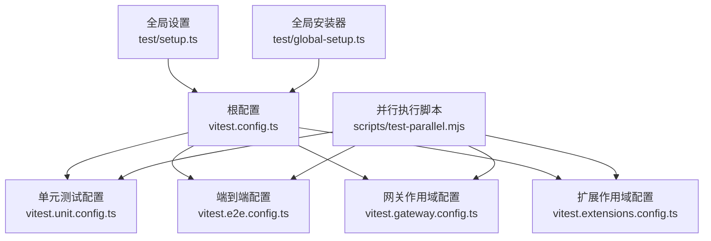
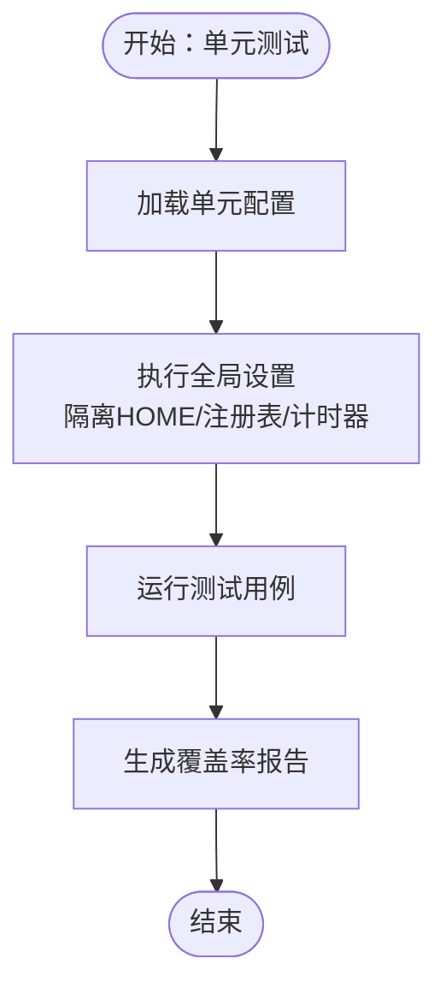
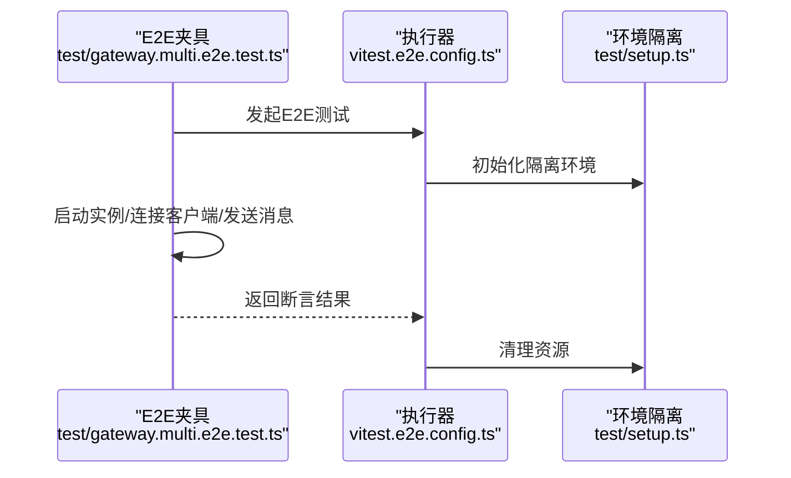
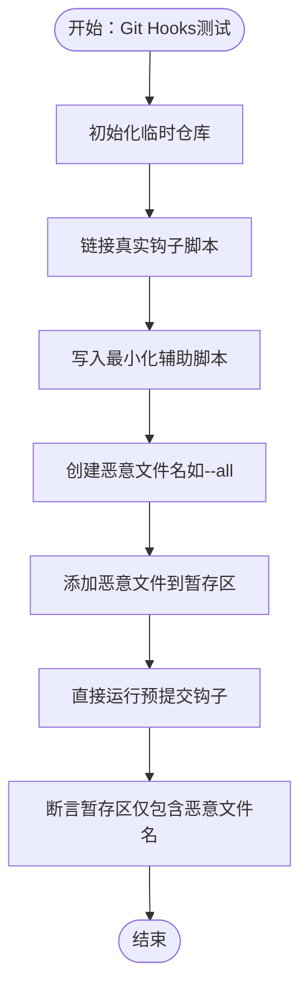
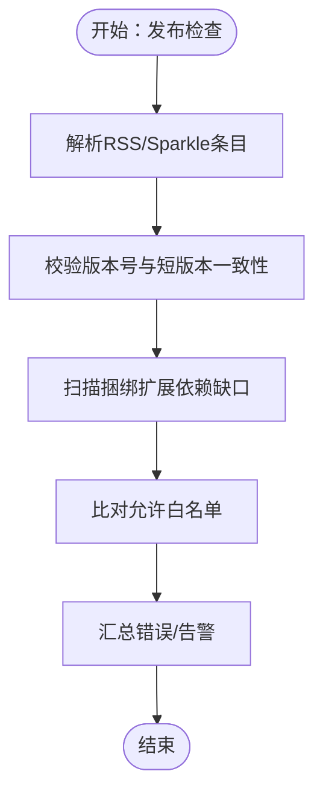
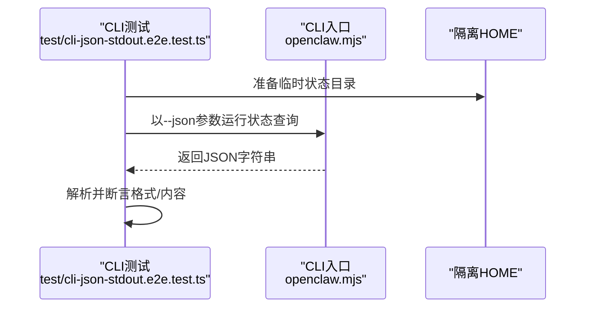
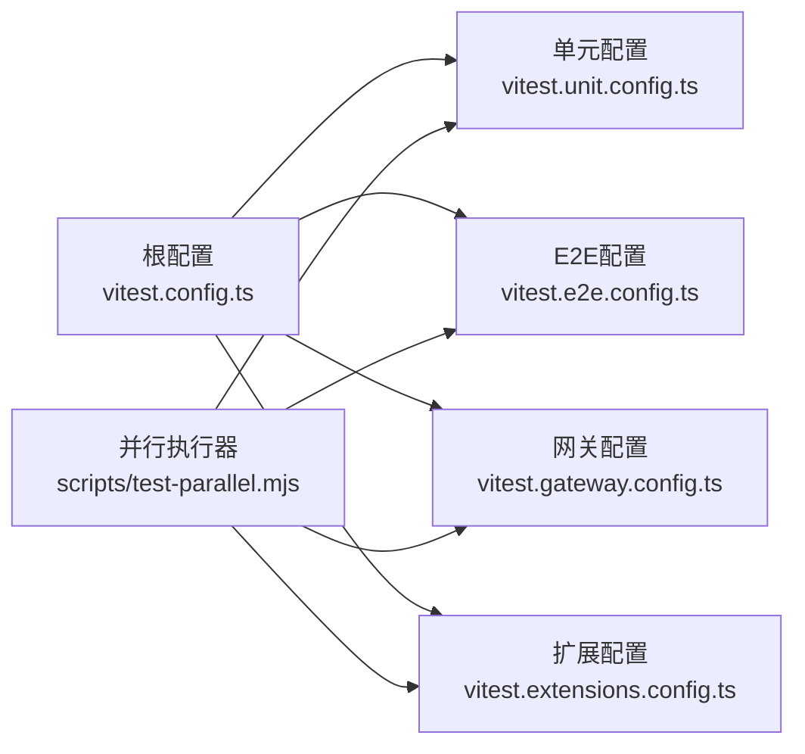

# 测试类型与策略

<cite>
**本文引用的文件**
- [vitest.config.ts](file://vitest.config.ts)
- [vitest.unit.config.ts](file://vitest.unit.config.ts)
- [vitest.e2e.config.ts](file://vitest.e2e.config.ts)
- [vitest.gateway.config.ts](file://vitest.gateway.config.ts)
- [vitest.extensions.config.ts](file://vitest.extensions.config.ts)
- [vitest.scoped-config.ts](file://vitest.scoped-config.ts)
- [test/setup.ts](file://test/setup.ts)
- [test/global-setup.ts](file://test/global-setup.ts)
- [package.json](file://package.json)
- [test/git-hooks-pre-commit.test.ts](file://test/git-hooks-pre-commit.test.ts)
- [test/release-check.test.ts](file://test/release-check.test.ts)
- [test/cli-json-stdout.e2e.test.ts](file://test/cli-json-stdout.e2e.test.ts)
- [test/gateway.multi.e2e.test.ts](file://test/gateway.multi.e2e.test.ts)
- [scripts/test-parallel.mjs](file://scripts/test-parallel.mjs)
</cite>

## 目录

1. [引言](#引言)
2. [项目结构](#项目结构)
3. [核心组件](#核心组件)
4. [架构总览](#架构总览)
5. [详细组件分析](#详细组件分析)
6. [依赖分析](#依赖分析)
7. [性能考量](#性能考量)
8. [故障排查指南](#故障排查指南)
9. [结论](#结论)
10. [附录](#附录)

## 引言

本文件系统化阐述本仓库的测试类型与策略，覆盖单元测试、集成测试、端到端测试（E2E）与性能测试的适用场景与边界；解释 Git hooks 测试、发布检查测试与 CLI 测试的特殊考虑；梳理测试脚本组织方式与执行策略；明确测试环境搭建、全局设置与测试生命周期管理；并总结测试编写规范、断言策略与错误处理最佳实践。

## 项目结构

测试体系围绕 Vitest 配置分层组织，并通过统一的并行执行脚本协调多套配置与运行参数：

- 根级 Vitest 配置定义通用行为、覆盖率阈值与排除范围
- 单元测试专用配置过滤掉大面集成模块
- 端到端测试配置强调进程隔离与可选并发控制
- 网关与扩展测试使用作用域化配置快速聚焦子域
- 执行入口由统一的并行脚本调度，支持分片、工作线程数与运行档位控制



**图示来源**

- [vitest.config.ts:57-202](file://vitest.config.ts#L57-L202)
- [vitest.unit.config.ts:11-30](file://vitest.unit.config.ts#L11-L30)
- [vitest.e2e.config.ts:20-32](file://vitest.e2e.config.ts#L20-L32)
- [vitest.gateway.config.ts:1-4](file://vitest.gateway.config.ts#L1-L4)
- [vitest.extensions.config.ts:1-4](file://vitest.extensions.config.ts#L1-L4)
- [vitest.scoped-config.ts:4-17](file://vitest.scoped-config.ts#L4-L17)
- [test/setup.ts:1-201](file://test/setup.ts#L1-L201)
- [test/global-setup.ts:1-7](file://test/global-setup.ts#L1-L7)
- [scripts/test-parallel.mjs:129-199](file://scripts/test-parallel.mjs#L129-L199)

**章节来源**

- [vitest.config.ts:57-202](file://vitest.config.ts#L57-L202)
- [vitest.unit.config.ts:11-30](file://vitest.unit.config.ts#L11-L30)
- [vitest.e2e.config.ts:20-32](file://vitest.e2e.config.ts#L20-L32)
- [vitest.gateway.config.ts:1-4](file://vitest.gateway.config.ts#L1-L4)
- [vitest.extensions.config.ts:1-4](file://vitest.extensions.config.ts#L1-L4)
- [vitest.scoped-config.ts:4-17](file://vitest.scoped-config.ts#L4-L17)
- [test/setup.ts:1-201](file://test/setup.ts#L1-L201)
- [test/global-setup.ts:1-7](file://test/global-setup.ts#L1-L7)
- [scripts/test-parallel.mjs:129-199](file://scripts/test-parallel.mjs#L129-L199)

## 核心组件

- 根级 Vitest 配置：统一超时、钩子超时、环境/全局解桩策略、进程池与并发、包含/排除模式、覆盖率锚点与阈值、别名映射（插件 SDK 子路径）
- 单元测试配置：在根配置基础上进一步排除网关、主要通道、浏览器与 UI 等集成面
- 端到端配置：强调进程隔离（forks）、默认串行或按 CPU 比例限制并发、静默级别可控
- 作用域化配置：通过工具函数生成仅包含特定 glob 的配置，便于快速聚焦
- 全局设置：安装进程警告过滤、隔离测试 HOME、注册默认插件注册表、统一清理与计时器复位
- 并行执行脚本：按档位与主机资源动态分配工作线程、支持分片、串并行混合、内存与负载感知

**章节来源**

- [vitest.config.ts:57-202](file://vitest.config.ts#L57-L202)
- [vitest.unit.config.ts:11-30](file://vitest.unit.config.ts#L11-L30)
- [vitest.e2e.config.ts:20-32](file://vitest.e2e.config.ts#L20-L32)
- [vitest.scoped-config.ts:4-17](file://vitest.scoped-config.ts#L4-L17)
- [test/setup.ts:1-201](file://test/setup.ts#L1-L201)
- [scripts/test-parallel.mjs:129-199](file://scripts/test-parallel.mjs#L129-L199)

## 架构总览

下图展示测试执行的总体流程：命令行脚本调用并行执行器，后者根据配置选择具体 Vitest 运行器，加载全局设置，最终产出测试结果与覆盖率报告。

```mermaid
sequenceDiagram
participant Dev as "开发者/CI"
participant Pkg as "包脚本<br/>package.json"
participant Par as "并行执行器<br/>test-parallel.mjs"
participant VTU as "单元配置<br/>vitest.unit.config.ts"
participant VTE as "E2E配置<br/>vitest.e2e.config.ts"
participant VTG as "网关配置<br/>vitest.gateway.config.ts"
participant VTX as "扩展配置<br/>vitest.extensions.config.ts"
participant GS as "全局设置<br/>test/setup.ts"
Dev->>Pkg : 执行测试脚本
Pkg->>Par : 调用并行执行器
Par->>VTU : 运行单元测试
Par->>VTE : 运行E2E测试
Par->>VTG : 运行网关测试
Par->>VTX : 运行扩展测试
VTU->>GS : 加载全局设置
VTE->>GS : 加载全局设置
VTG->>GS : 加载全局设置
VTX->>GS : 加载全局设置
GS-->>VTU : 初始化环境/注册表
GS-->>VTE : 初始化环境/注册表
GS-->>VTG : 初始化环境/注册表
GS-->>VTX : 初始化环境/注册表
```

**图示来源**

- [package.json:300-330](file://package.json#L300-L330)
- [scripts/test-parallel.mjs:129-199](file://scripts/test-parallel.mjs#L129-L199)
- [vitest.unit.config.ts:11-30](file://vitest.unit.config.ts#L11-L30)
- [vitest.e2e.config.ts:20-32](file://vitest.e2e.config.ts#L20-L32)
- [vitest.gateway.config.ts:1-4](file://vitest.gateway.config.ts#L1-L4)
- [vitest.extensions.config.ts:1-4](file://vitest.extensions.config.ts#L1-L4)
- [test/setup.ts:1-201](file://test/setup.ts#L1-L201)

## 详细组件分析

### 单元测试（Unit Test）

- 适用场景：验证纯函数、工具方法、小规模模块逻辑，避免外部依赖与副作用
- 配置要点：排除大面集成模块（如网关、主要通道、浏览器与 UI），聚焦核心源码
- 生命周期：通过全局设置安装警告过滤、隔离 HOME、注册默认插件注册表，确保跨文件隔离
- 断言策略：优先断言输入输出确定性、边界条件与异常路径；对异步逻辑使用超时与重试策略
- 错误处理：避免在单元测试中引入真实网络/磁盘 IO；必要时使用最小化桩



**图示来源**

- [vitest.unit.config.ts:11-30](file://vitest.unit.config.ts#L11-L30)
- [test/setup.ts:188-201](file://test/setup.ts#L188-L201)

**章节来源**

- [vitest.unit.config.ts:11-30](file://vitest.unit.config.ts#L11-L30)
- [test/setup.ts:188-201](file://test/setup.ts#L188-L201)

### 集成测试（Integration Test）

- 适用场景：验证模块间协作、数据流与接口契约，但不涉及真实外部服务
- 配置要点：根配置已将大量集成面排除在单元之外，集成测试通常以更宽泛的包含规则运行
- 生命周期：与单元测试一致，使用相同的全局设置保障隔离
- 断言策略：关注跨模块交互、状态一致性与错误传播；对共享资源使用互斥与重试
- 错误处理：对不可控因素（如网络抖动）采用指数退避与超时控制

**章节来源**

- [vitest.config.ts:81-100](file://vitest.config.ts#L81-L100)
- [test/setup.ts:188-201](file://test/setup.ts#L188-L201)

### 端到端测试（E2E）

- 适用场景：模拟真实用户路径，验证完整业务闭环，常涉及真实服务或容器化环境
- 配置要点：强制进程隔离（forks），默认串行或按 CPU 比例限制并发，支持静默级别控制
- 生命周期：通过全局设置初始化隔离环境，测试结束后清理
- 断言策略：基于真实请求/响应、事件流与最终态；对长耗时操作设置合理超时
- 错误处理：捕获并记录系统日志、网络状态与服务健康检查



**图示来源**

- [test/gateway.multi.e2e.test.ts:18-125](file://test/gateway.multi.e2e.test.ts#L18-L125)
- [vitest.e2e.config.ts:20-32](file://vitest.e2e.config.ts#L20-L32)
- [test/setup.ts:1-201](file://test/setup.ts#L1-L201)

**章节来源**

- [test/gateway.multi.e2e.test.ts:18-125](file://test/gateway.multi.e2e.test.ts#L18-L125)
- [vitest.e2e.config.ts:20-32](file://vitest.e2e.config.ts#L20-L32)
- [test/setup.ts:1-201](file://test/setup.ts#L1-L201)

### 性能测试（Performance Test）

- 适用场景：评估启动时间、吞吐量、内存占用与热点路径
- 组织方式：通过独立脚本与配置运行基准测试，结合火焰图与指标采集
- 断言策略：设定预算阈值与回归基线，对异常波动进行告警
- 错误处理：隔离干扰因素，重复多次取统计值，剔除异常样本

**章节来源**

- [package.json:325-326](file://package.json#L325-L326)
- [scripts/test-parallel.mjs:326-345](file://scripts/test-parallel.mjs#L326-L345)

### Git Hooks 测试

- 特殊考虑：需要在临时仓库中安装真实钩子脚本，验证对恶意输入的安全处理（如将“--all”作为文件名被正确处理）
- 断言策略：检查暂存区内容是否符合预期，确保不会误触发全量添加
- 错误处理：通过最小化辅助脚本与符号链接实现真实钩子行为的可测性



**图示来源**

- [test/git-hooks-pre-commit.test.ts:21-68](file://test/git-hooks-pre-commit.test.ts#L21-L68)

**章节来源**

- [test/git-hooks-pre-commit.test.ts:21-68](file://test/git-hooks-pre-commit.test.ts#L21-L68)

### 发布检查测试（Release Check）

- 特殊考虑：校验应用更新清单（appcast）版本号与 Sparkle 规范一致性，检查捆绑扩展与根依赖镜像差异
- 断言策略：对允许的差异列表进行白名单比对，标记未允许的新缺口或过期白名单项
- 错误处理：对 XML 结构与字段进行严格解析，失败时返回明确错误信息



**图示来源**

- [test/release-check.test.ts:12-152](file://test/release-check.test.ts#L12-L152)

**章节来源**

- [test/release-check.test.ts:12-152](file://test/release-check.test.ts#L12-L152)

### CLI 测试（CLI JSON 输出契约）

- 特殊考虑：验证 CLI 在历史遗留配置下的 JSON 输出稳定性，确保解析器健壮性
- 断言策略：在隔离 HOME 下运行 CLI，断言标准输出为合法 JSON，且不含诊断警告片段
- 错误处理：清理环境变量，避免污染测试上下文



**图示来源**

- [test/cli-json-stdout.e2e.test.ts:7-44](file://test/cli-json-stdout.e2e.test.ts#L7-L44)

**章节来源**

- [test/cli-json-stdout.e2e.test.ts:7-44](file://test/cli-json-stdout.e2e.test.ts#L7-L44)

## 依赖分析

- 配置继承关系：单元/E2E/作用域配置均基于根配置，通过浅拷贝合并 test 字段，确保一致性
- 执行耦合度：并行执行器按配置拆分任务，降低跨任务干扰；同时支持串行运行以满足敏感场景
- 外部依赖：测试脚本依赖 Node 进程池、平台特性与 CI 环境变量，需在不同平台上验证行为



**图示来源**

- [vitest.config.ts:57-202](file://vitest.config.ts#L57-L202)
- [vitest.unit.config.ts:11-30](file://vitest.unit.config.ts#L11-L30)
- [vitest.e2e.config.ts:20-32](file://vitest.e2e.config.ts#L20-L32)
- [vitest.gateway.config.ts:1-4](file://vitest.gateway.config.ts#L1-L4)
- [vitest.extensions.config.ts:1-4](file://vitest.extensions.config.ts#L1-L4)
- [scripts/test-parallel.mjs:129-199](file://scripts/test-parallel.mjs#L129-L199)

**章节来源**

- [vitest.config.ts:57-202](file://vitest.config.ts#L57-L202)
- [vitest.unit.config.ts:11-30](file://vitest.unit.config.ts#L11-L30)
- [vitest.e2e.config.ts:20-32](file://vitest.e2e.config.ts#L20-L32)
- [vitest.gateway.config.ts:1-4](file://vitest.gateway.config.ts#L1-L4)
- [vitest.extensions.config.ts:1-4](file://vitest.extensions.config.ts#L1-L4)
- [scripts/test-parallel.mjs:129-199](file://scripts/test-parallel.mjs#L129-L199)

## 性能考量

- 并发与隔离：在支持 vmForks 的环境下优先使用 vmForks 提升导入/转换类测试速度；在 Windows CI 或低内存主机上回退至 forks 保证稳定性
- 负载感知：本地运行时根据 CPU 负载比例动态调整工作线程，避免极端负载导致的不稳定
- 分片与档位：支持 low/normal/max/serial 四档运行，CI 默认串行或低负载，本地高内存主机可提升并行度
- 内存保护：CI 场景可设置最大老生代内存，防止大规模测试导致 OOM

**章节来源**

- [scripts/test-parallel.mjs:112-115](file://scripts/test-parallel.mjs#L112-L115)
- [scripts/test-parallel.mjs:249-255](file://scripts/test-parallel.mjs#L249-L255)
- [scripts/test-parallel.mjs:256-300](file://scripts/test-parallel.mjs#L256-L300)
- [scripts/test-parallel.mjs:334-345](file://scripts/test-parallel.mjs#L334-L345)

## 故障排查指南

- 跨文件泄漏：启用 unstubEnvs/unstubGlobals，避免 vmForks 下环境/全局泄漏
- 计时器泄漏：在 afterEach 中确保恢复真实计时器
- 插件注册表：默认注册表不可变，若测试覆盖替换需在 afterEach 恢复
- Windows CI 特性：必要时开启危险忽略未捕获错误标志，减少平台差异噪音
- 日志与静默：通过环境变量控制 E2E 静默级别，便于定位问题

**章节来源**

- [vitest.config.ts:74-79](file://vitest.config.ts#L74-L79)
- [test/setup.ts:192-200](file://test/setup.ts#L192-L200)
- [scripts/test-parallel.mjs:226-229](file://scripts/test-parallel.mjs#L226-L229)

## 结论

本仓库通过分层配置与并行执行器实现了高效、稳定且可扩展的测试体系：单元测试聚焦纯逻辑与小模块，集成测试覆盖模块协作，E2E 测试验证真实业务闭环，性能测试保障关键指标。针对 Git hooks、发布检查与 CLI 的专项测试确保了安全、合规与兼容性。配合严格的生命周期管理与错误处理策略，整体测试质量与可维护性得到显著提升。

## 附录

- 常用脚本与配置
  - 单元测试：通过单元配置运行，适合快速反馈
  - E2E 测试：通过 E2E 配置运行，支持并发与静默
  - 网关/扩展测试：通过作用域配置快速聚焦
  - 并行执行：根据档位与资源自动分配工作线程，支持分片与串并行混合

**章节来源**

- [package.json:300-330](file://package.json#L300-L330)
- [vitest.unit.config.ts:11-30](file://vitest.unit.config.ts#L11-L30)
- [vitest.e2e.config.ts:20-32](file://vitest.e2e.config.ts#L20-L32)
- [vitest.gateway.config.ts:1-4](file://vitest.gateway.config.ts#L1-L4)
- [vitest.extensions.config.ts:1-4](file://vitest.extensions.config.ts#L1-L4)
- [scripts/test-parallel.mjs:129-199](file://scripts/test-parallel.mjs#L129-L199)
