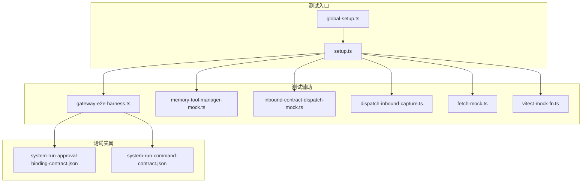
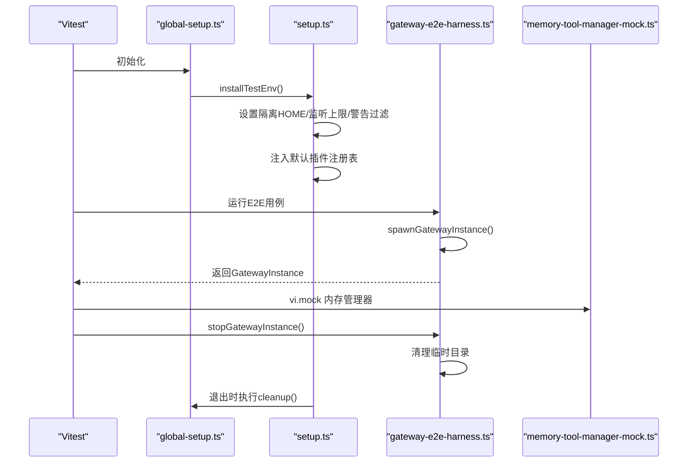
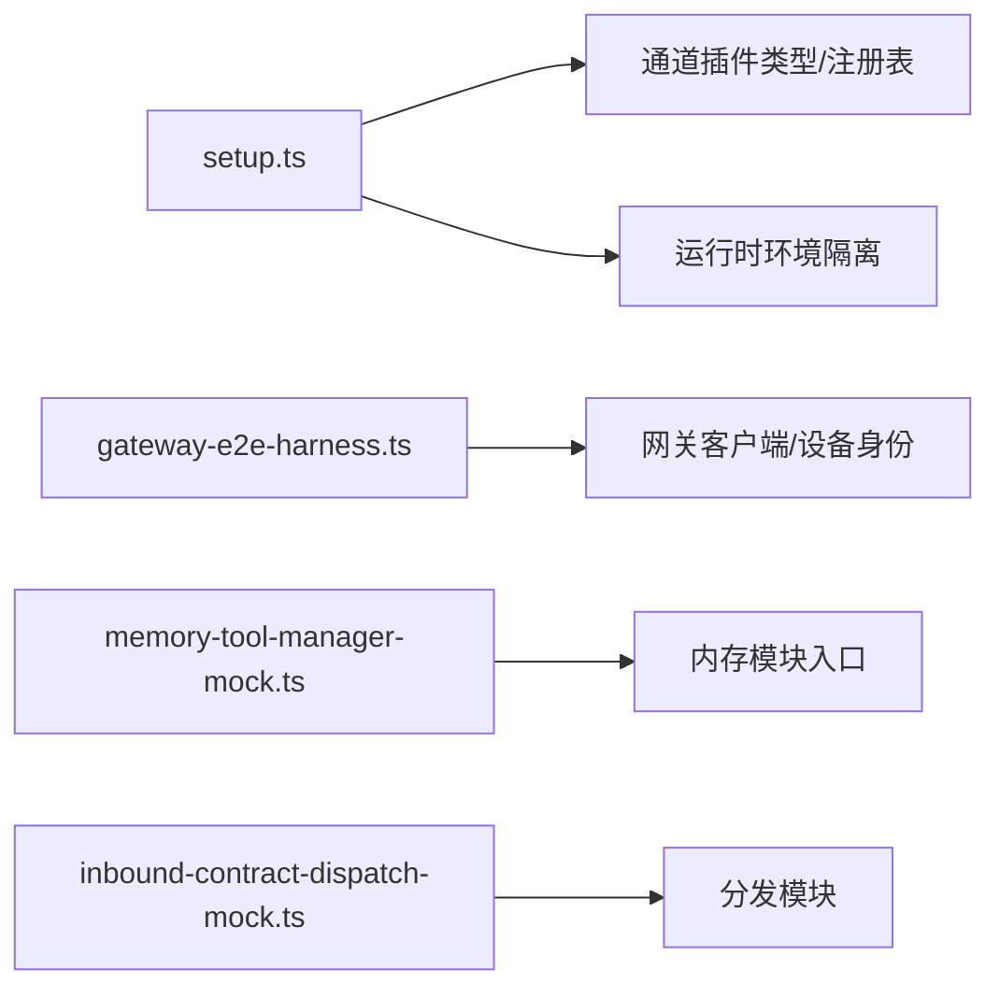
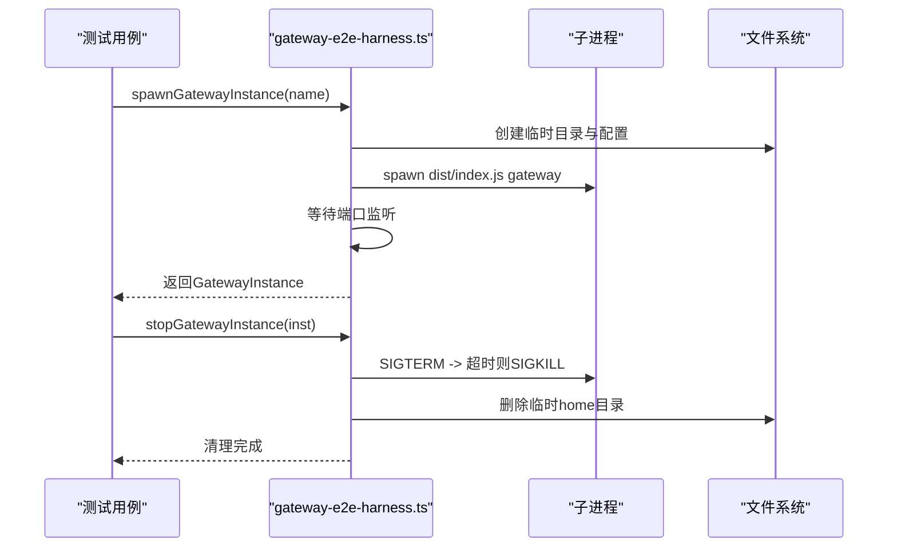
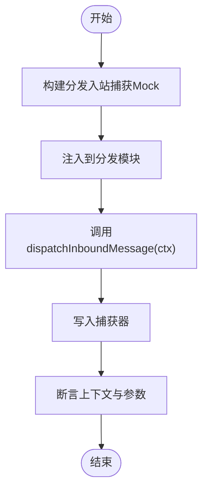

# 测试辅助工具

<cite>
**本文引用的文件**
- [global-setup.ts](file://test/global-setup.ts)
- [setup.ts](file://test/setup.ts)
- [gateway-e2e-harness.ts](file://test/helpers/gateway-e2e-harness.ts)
- [memory-tool-manager-mock.ts](file://test/helpers/memory-tool-manager-mock.ts)
- [inbound-contract-dispatch-mock.ts](file://test/helpers/inbound-contract-dispatch-mock.ts)
- [dispatch-inbound-capture.ts](file://test/helpers/dispatch-inbound-capture.ts)
- [system-run-approval-binding-contract.json](file://test/fixtures/system-run-approval-binding-contract.json)
- [system-run-command-contract.json](file://test/fixtures/system-run-command-contract.json)
- [fetch-mock.ts](file://src/test-utils/fetch-mock.ts)
- [vitest-mock-fn.ts](file://src/test-utils/vitest-mock-fn.ts)
</cite>

## 目录

1. [简介](#简介)
2. [项目结构](#项目结构)
3. [核心组件](#核心组件)
4. [架构总览](#架构总览)
5. [详细组件分析](#详细组件分析)
6. [依赖关系分析](#依赖关系分析)
7. [性能考量](#性能考量)
8. [故障排查指南](#故障排查指南)
9. [结论](#结论)
10. [附录](#附录)

## 简介

本文件系统性梳理了 OpenClaw 项目的测试辅助工具体系，覆盖测试夹具（fixtures）、辅助函数与 Mock 对象的组织与使用方式。重点包括：

- 测试夹具的类型与用途：系统调用审批绑定契约、命令显示契约等
- 辅助函数能力：网关 E2E 夹具、入站消息捕获、内存工具管理器 Mock 等
- Mock 策略与最佳实践：集中式 Mock 类型定义、预连接增强的 fetch 包装
- 测试环境清理与资源管理：全局与会话级清理流程

## 项目结构

测试相关代码主要分布在以下位置：

- test/global-setup.ts：Vitest 全局初始化与清理
- test/setup.ts：全局测试配置、插件注册表、出站适配桩、进程警告过滤等
- test/helpers/\*：通用测试辅助函数与 Mock
- test/fixtures/\*：结构化测试夹具（JSON 契约）
- src/test-utils/\*：跨模块可复用的测试工具与类型

图表来源

- [global-setup.ts:1-7](file://test/global-setup.ts#L1-L7)
- [setup.ts:1-201](file://test/setup.ts#L1-L201)
- [gateway-e2e-harness.ts:1-383](file://test/helpers/gateway-e2e-harness.ts#L1-L383)
- [memory-tool-manager-mock.ts:1-66](file://test/helpers/memory-tool-manager-mock.ts#L1-L66)
- [inbound-contract-dispatch-mock.ts:1-10](file://test/helpers/inbound-contract-dispatch-mock.ts#L1-L10)
- [dispatch-inbound-capture.ts:1-19](file://test/helpers/dispatch-inbound-capture.ts#L1-L19)
- [system-run-approval-binding-contract.json:1-116](file://test/fixtures/system-run-approval-binding-contract.json#L1-L116)
- [system-run-command-contract.json:1-85](file://test/fixtures/system-run-command-contract.json#L1-L85)
- [fetch-mock.ts:1-23](file://src/test-utils/fetch-mock.ts#L1-L23)
- [vitest-mock-fn.ts:1-7](file://src/test-utils/vitest-mock-fn.ts#L1-L7)

章节来源

- [global-setup.ts:1-7](file://test/global-setup.ts#L1-L7)
- [setup.ts:1-201](file://test/setup.ts#L1-L201)

## 核心组件

- 全局初始化与清理
  - 在 Vitest 启动时安装隔离的测试环境，并在退出时执行清理，确保 HOME/state 隔离与进程监听上限设置。
- 插件注册表与出站适配桩
  - 构建默认通道插件注册表并注入到运行时；为各通道提供统一的出站发送桩，支持直接或网关模式。
- 网关 E2E 夹具
  - 提供启动/停止网关实例、设备身份加载、节点连接、状态等待、聊天事件等待等能力。
- 内存工具管理器 Mock
  - 通过 vi.mock 拦截内存搜索与读取，提供可配置的后端、搜索实现与文件读取实现，以及重置函数。
- 入站消息捕获与分发 Mock
  - 捕获入站上下文并拦截分发逻辑，便于断言消息处理路径与参数。
- 结构化测试夹具
  - 系统调用审批绑定契约与命令显示契约 JSON，用于验证命令解析与审批一致性。
- 跨模块测试工具
  - 预连接增强的 fetch 包装与集中式 Vitest Mock 类型，提升测试可维护性。

章节来源

- [setup.ts:188-201](file://test/setup.ts#L188-L201)
- [setup.ts:137-186](file://test/setup.ts#L137-L186)
- [gateway-e2e-harness.ts:104-191](file://test/helpers/gateway-e2e-harness.ts#L104-L191)
- [memory-tool-manager-mock.ts:36-66](file://test/helpers/memory-tool-manager-mock.ts#L36-L66)
- [inbound-contract-dispatch-mock.ts:1-10](file://test/helpers/inbound-contract-dispatch-mock.ts#L1-L10)
- [system-run-approval-binding-contract.json:1-116](file://test/fixtures/system-run-approval-binding-contract.json#L1-L116)
- [system-run-command-contract.json:1-85](file://test/fixtures/system-run-command-contract.json#L1-L85)
- [fetch-mock.ts:14-23](file://src/test-utils/fetch-mock.ts#L14-L23)
- [vitest-mock-fn.ts:1-7](file://src/test-utils/vitest-mock-fn.ts#L1-L7)

## 架构总览

下图展示了测试生命周期中的关键交互：全局初始化负责环境准备与清理；测试配置负责插件注册表与桩；E2E 夹具负责网关生命周期管理；Mock 与夹具共同支撑断言与行为控制。

图表来源

- [global-setup.ts:1-7](file://test/global-setup.ts#L1-L7)
- [setup.ts:188-201](file://test/setup.ts#L188-L201)
- [gateway-e2e-harness.ts:104-191](file://test/helpers/gateway-e2e-harness.ts#L104-L191)
- [memory-tool-manager-mock.ts:36-38](file://test/helpers/memory-tool-manager-mock.ts#L36-L38)

## 详细组件分析

### 测试夹具（Fixtures）组织与用途

- 系统调用审批绑定契约
  - 用于验证命令 argv、工作目录、会话键与环境变量的绑定一致性，涵盖键顺序变化、不匹配与未绑定覆盖等场景。
- 系统调用命令显示契约
  - 用于验证直接 argv、shell 包装器与 env 包装器在显示命令生成与 rawCommand 一致性方面的规则。
- 插件安装与钩子安装夹具
  - 位于 test/fixtures/ 下，包含系统运行审批相关契约文件，用于验证审批流程与命令解析。

章节来源

- [system-run-approval-binding-contract.json:1-116](file://test/fixtures/system-run-approval-binding-contract.json#L1-L116)
- [system-run-command-contract.json:1-85](file://test/fixtures/system-run-command-contract.json#L1-L85)

### 测试辅助函数与工具

- 网关 E2E 夹具
  - 功能要点：获取空闲端口、写入最小化配置、启动网关子进程、等待端口就绪、捕获输出、连接节点、等待节点状态、等待聊天最终事件、停止网关并清理临时目录。
  - 关键流程见后续“序列图”。
- 入站消息捕获
  - 通过构建分发入站捕获 Mock，将入站上下文写入外部存储，便于断言消息处理链路。
- 内存工具管理器 Mock
  - 通过 vi.mock 替换 getMemorySearchManager，暴露 search、readFile、status、sync、probeVectorAvailability、close 等方法的 vi.fn 实现，支持动态替换后端与实现，并提供重置函数。

章节来源

- [gateway-e2e-harness.ts:47-102](file://test/helpers/gateway-e2e-harness.ts#L47-L102)
- [gateway-e2e-harness.ts:104-191](file://test/helpers/gateway-e2e-harness.ts#L104-L191)
- [gateway-e2e-harness.ts:265-362](file://test/helpers/gateway-e2e-harness.ts#L265-L362)
- [dispatch-inbound-capture.ts:1-19](file://test/helpers/dispatch-inbound-capture.ts#L1-L19)
- [memory-tool-manager-mock.ts:15-38](file://test/helpers/memory-tool-manager-mock.ts#L15-L38)

### Mock 对象与策略

- 入站分发 Mock
  - 通过拦截分发模块，将入站上下文写入捕获器，便于断言处理参数与路径。
- 集中式 Vitest Mock 类型
  - 定义明确的 MockFn 类型别名，避免 vi.fn 推断导致的类型错误，提升可维护性。
- 预连接增强的 fetch 包装
  - 为 fetch 或任意对象添加 preconnect 能力，便于测试网络连接策略与 DNS/TCP/HTTP 预热。

章节来源

- [inbound-contract-dispatch-mock.ts:1-10](file://test/helpers/inbound-contract-dispatch-mock.ts#L1-L10)
- [vitest-mock-fn.ts:1-7](file://src/test-utils/vitest-mock-fn.ts#L1-L7)
- [fetch-mock.ts:14-23](file://src/test-utils/fetch-mock.ts#L14-L23)

### 测试环境清理与资源管理

- 全局清理
  - 在 Vitest 退出时调用 cleanup，确保临时目录与状态被回收。
- 网关实例清理
  - 停止网关进程（先 SIGTERM，超时则 SIGKILL），随后递归删除临时 home 目录，避免残留文件影响后续测试。

章节来源

- [global-setup.ts:1-7](file://test/global-setup.ts#L1-L7)
- [gateway-e2e-harness.ts:193-218](file://test/helpers/gateway-e2e-harness.ts#L193-L218)

## 依赖关系分析

- 组件耦合
  - setup.ts 依赖通道插件类型与运行时注册表，负责构建默认注册表并注入。
  - gateway-e2e-harness.ts 依赖网关客户端与设备身份模块，负责生命周期管理。
  - memory-tool-manager-mock.ts 依赖内存模块入口，通过 vi.mock 进行替换。
- 外部依赖
  - 使用 Node 内置模块（child_process、fs、http、net、os、path）进行进程与文件操作。
  - 使用 Vitest 的 vi.mock 与 vi.fn 进行 Mock。

图表来源

- [setup.ts:21-42](file://test/setup.ts#L21-L42)
- [gateway-e2e-harness.ts:8-13](file://test/helpers/gateway-e2e-harness.ts#L8-L13)
- [memory-tool-manager-mock.ts:36-38](file://test/helpers/memory-tool-manager-mock.ts#L36-L38)
- [inbound-contract-dispatch-mock.ts:7-9](file://test/helpers/inbound-contract-dispatch-mock.ts#L7-L9)

## 性能考量

- 进程监听上限
  - 在测试进程中提高最大监听器数量，降低因并发 fork 导致的噪音与开销。
- 插件清单缓存
  - 设置插件清单缓存时间，减少跨套件/工作进程的重复文件系统发现。
- 虚拟时钟
  - 在 afterEach 中恢复真实时钟，避免跨文件/工作进程泄漏假时钟。

章节来源

- [setup.ts:11-19](file://test/setup.ts#L11-L19)
- [setup.ts:188-200](file://test/setup.ts#L188-L200)

## 故障排查指南

- 网关启动失败
  - 现象：子进程提前退出或超时未监听端口。
  - 排查：检查 stdout/stderr 输出，确认配置路径与 HOME 环境变量是否正确；确认最小化网关模式与跳过无关服务的环境变量。
- 节点状态不满足
  - 现象：等待 node.list 返回的节点未同时满足 connected 与 paired。
  - 排查：延长等待超时或检查节点连接流程；确认设备身份文件存在且可读。
- 内存工具 Mock 未生效
  - 现象：测试仍调用真实内存管理器。
  - 排查：确认 vi.mock 已在 import 之前执行；检查模块路径是否与实际一致；必要时调用重置函数以清除旧状态。
- 入站消息未被捕获
  - 现象：断言上下文为空。
  - 排查：确认已通过拦截器注入捕获器；检查分发函数签名与返回值结构是否匹配。

章节来源

- [gateway-e2e-harness.ts:65-102](file://test/helpers/gateway-e2e-harness.ts#L65-L102)
- [gateway-e2e-harness.ts:339-362](file://test/helpers/gateway-e2e-harness.ts#L339-L362)
- [memory-tool-manager-mock.ts:36-66](file://test/helpers/memory-tool-manager-mock.ts#L36-L66)
- [inbound-contract-dispatch-mock.ts:1-10](file://test/helpers/inbound-contract-dispatch-mock.ts#L1-L10)

## 结论

本测试辅助工具体系通过结构化的夹具、可复用的辅助函数与严格的 Mock 策略，实现了对系统调用审批、网关 E2E 场景与内存工具行为的可控测试。配合全局与会话级清理机制，保证了测试稳定性与可重复性。建议在新增测试时优先复用现有夹具与工具，遵循集中式 Mock 类型与预连接增强的 fetch 包装规范，以提升可维护性与一致性。

## 附录

### 网关 E2E 生命周期序列图

图表来源

- [gateway-e2e-harness.ts:104-191](file://test/helpers/gateway-e2e-harness.ts#L104-L191)
- [gateway-e2e-harness.ts:193-218](file://test/helpers/gateway-e2e-harness.ts#L193-L218)

### 入站消息捕获流程图

图表来源

- [dispatch-inbound-capture.ts:3-18](file://test/helpers/dispatch-inbound-capture.ts#L3-L18)
- [inbound-contract-dispatch-mock.ts:1-10](file://test/helpers/inbound-contract-dispatch-mock.ts#L1-L10)
