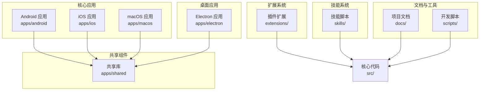
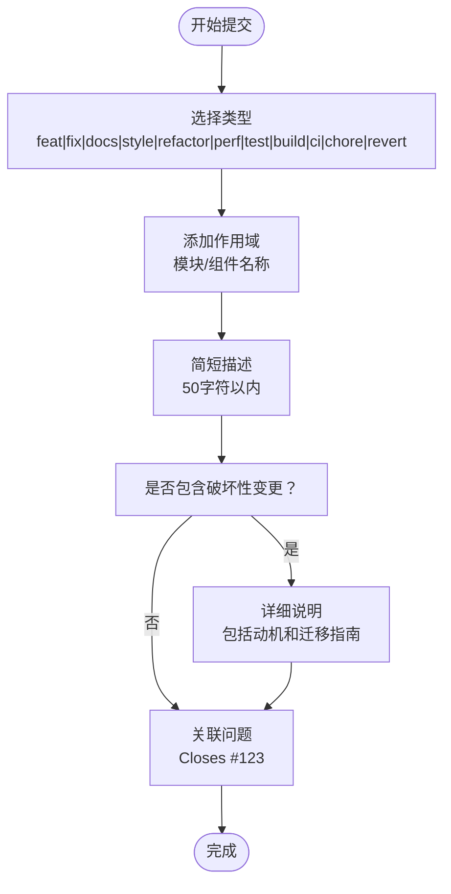
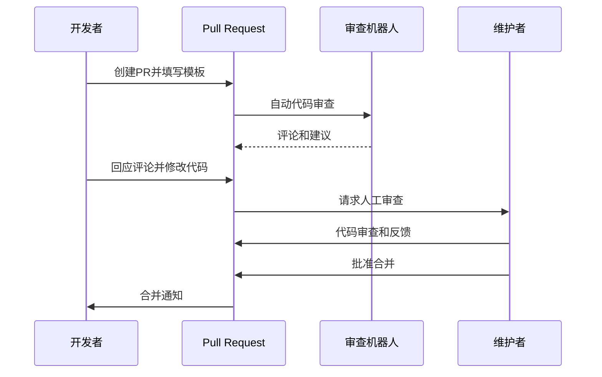
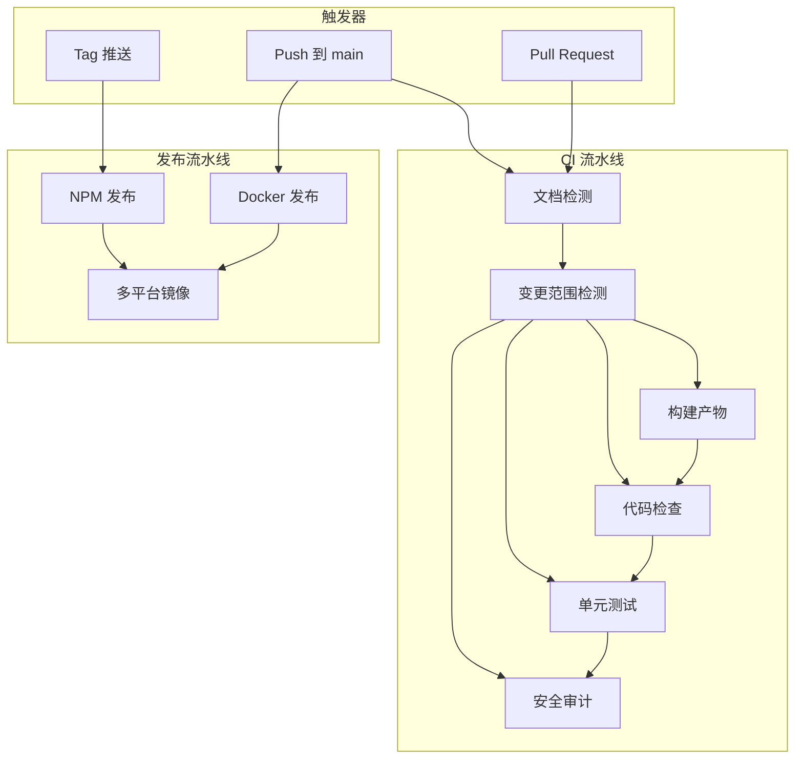
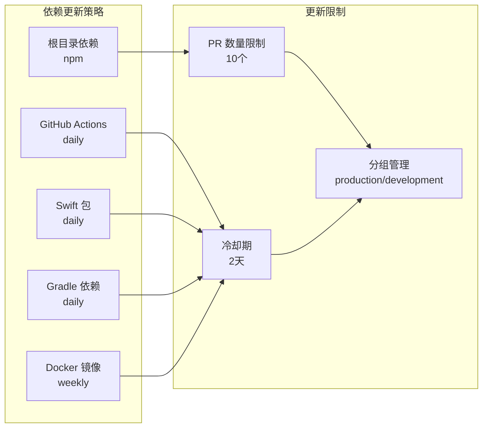
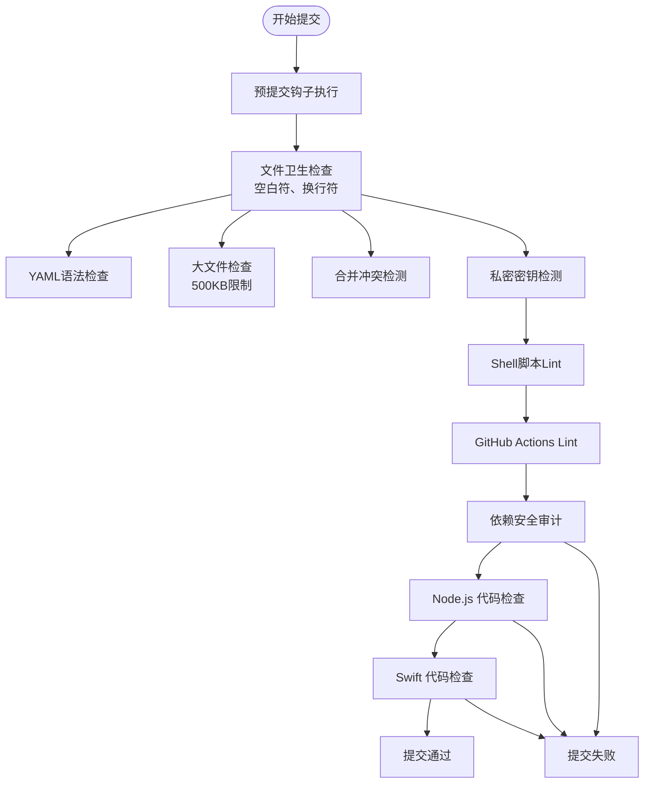
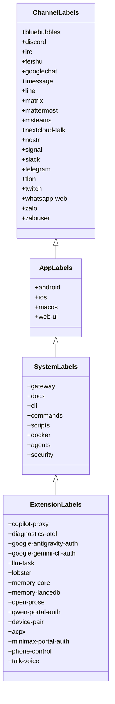
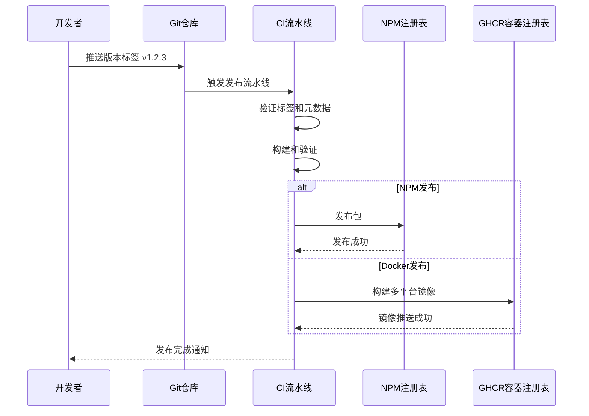
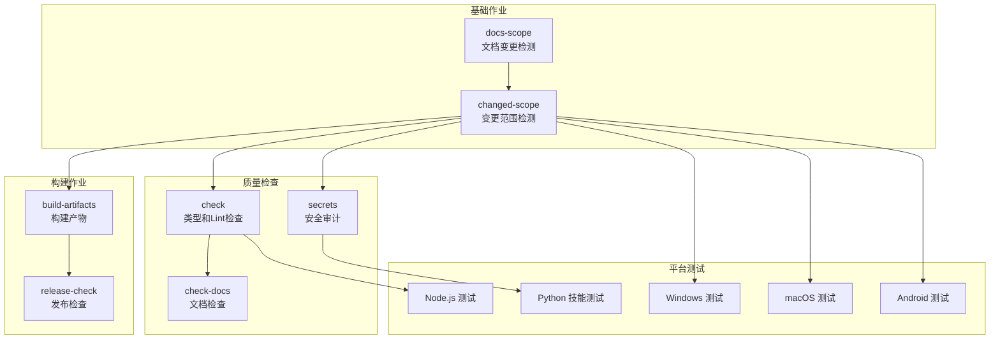
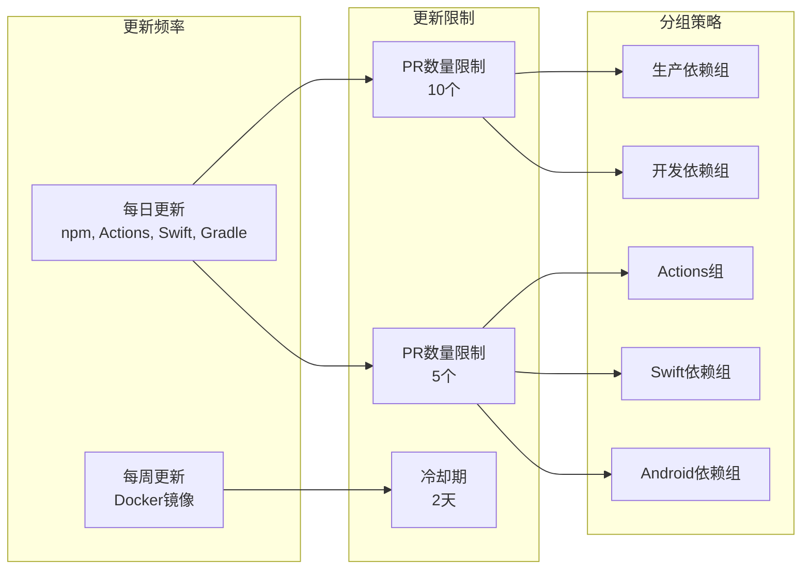

# Git工作流程规范

<cite>
**本文档引用的文件**
- [CONTRIBUTING.md](file://CONTRIBUTING.md)
- [.github/pull_request_template.md](file://.github/pull_request_template.md)
- [.github/workflows/ci.yml](file://.github/workflows/ci.yml)
- [.github/workflows/openclaw-npm-release.yml](file://.github/workflows/openclaw-npm-release.yml)
- [.github/workflows/docker-release.yml](file://.github/workflows/docker-release.yml)
- [.github/dependabot.yml](file://.github/dependabot.yml)
- [.github/labeler.yml](file://.github/labeler.yml)
- [.github/actionlint.yaml](file://.github/actionlint.yaml)
- [.pre-commit-config.yaml](file://.pre-commit-config.yaml)
</cite>

## 目录

1. [简介](#简介)
2. [项目结构](#项目结构)
3. [核心组件](#核心组件)
4. [架构概览](#架构概览)
5. [详细组件分析](#详细组件分析)
6. [依赖关系分析](#依赖关系分析)
7. [性能考虑](#性能考虑)
8. [故障排除指南](#故障排除指南)
9. [结论](#结论)

## 简介

本文件定义了OpenClaw项目的Git工作流程规范，涵盖版本控制流程、分支管理策略、提交规范、代码审查流程以及发布流程。该规范旨在确保团队协作的一致性、代码质量的稳定性以及发布过程的可追溯性。

## 项目结构

OpenClaw采用多平台、多模块的大型Monorepo结构，包含以下关键目录：

- 核心应用：apps/android（Android）、apps/ios（iOS）、apps/macos（macOS）
- 桌面应用：apps/electron（Electron）
- 共享库：apps/shared（共享组件）
- 扩展系统：extensions/（插件扩展）
- 技能系统：skills/（技能脚本）
- 文档：docs/（项目文档）
- 脚本与工具：scripts/（开发与部署脚本）

**图表来源**

- [项目结构](file://.)

## 核心组件

### 分支管理策略

项目采用Git Flow变体的分支策略：

1. **主分支（main）**
   - 代表稳定发布的代码
   - 所有PR必须合并到main进行测试和验证
   - 通过CI流水线进行全面测试

2. **功能分支（feature/\*）**
   - 用于新功能开发
   - 命名格式：`feature/模块/主题`
   - 示例：`feature/gateway/authentication`

3. **修复分支（fix/\*）**
   - 用于bug修复
   - 命名格式：`fix/模块/问题描述`
   - 示例：`fix/telegram/message-handling`

4. **发布分支（release/\*）**
   - 用于准备发布版本
   - 命名格式：`release/vX.Y.Z`
   - 示例：`release/v1.2.3`

5. **热修复分支（hotfix/\*）**
   - 用于紧急修复生产问题
   - 命名格式：`hotfix/问题描述`
   - 示例：`hotfix/security-patch`

### 提交规范

遵循Conventional Commits规范：

**图表来源**

- [CONTRIBUTING.md:85-94](file://CONTRIBUTING.md#L85-L94)

### 代码审查流程

**图表来源**

- [CONTRIBUTING.md:96-106](file://CONTRIBUTING.md#L96-L106)
- [.github/pull_request_template.md:1-116](file://.github/pull_request_template.md#L1-L116)

**章节来源**

- [CONTRIBUTING.md:85-106](file://CONTRIBUTING.md#L85-L106)
- [.github/pull_request_template.md:1-116](file://.github/pull_request_template.md#L1-L116)

## 架构概览

### CI/CD流水线架构

**图表来源**

- [.github/workflows/ci.yml:1-737](file://.github/workflows/ci.yml#L1-L737)
- [.github/workflows/openclaw-npm-release.yml:1-80](file://.github/workflows/openclaw-npm-release.yml#L1-L80)
- [.github/workflows/docker-release.yml:1-309](file://.github/workflows/docker-release.yml#L1-L309)

### 依赖管理架构

**图表来源**

- [.github/dependabot.yml:1-128](file://.github/dependabot.yml#L1-L128)

## 详细组件分析

### 代码预提交检查

**图表来源**

- [.pre-commit-config.yaml:1-158](file://.pre-commit-config.yaml#L1-L158)

### 自动标签系统

**图表来源**

- [.github/labeler.yml:1-259](file://.github/labeler.yml#L1-L259)

**章节来源**

- [.pre-commit-config.yaml:1-158](file://.pre-commit-config.yaml#L1-L158)
- [.github/labeler.yml:1-259](file://.github/labeler.yml#L1-L259)

### 发布流程

**图表来源**

- [.github/workflows/openclaw-npm-release.yml:1-80](file://.github/workflows/openclaw-npm-release.yml#L1-L80)
- [.github/workflows/docker-release.yml:1-309](file://.github/workflows/docker-release.yml#L1-L309)

**章节来源**

- [.github/workflows/openclaw-npm-release.yml:1-80](file://.github/workflows/openclaw-npm-release.yml#L1-L80)
- [.github/workflows/docker-release.yml:1-309](file://.github/workflows/docker-release.yml#L1-L309)

## 依赖关系分析

### CI作业依赖图

**图表来源**

- [.github/workflows/ci.yml:1-737](file://.github/workflows/ci.yml#L1-L737)

### 依赖更新策略

**图表来源**

- [.github/dependabot.yml:1-128](file://.github/dependabot.yml#L1-L128)

**章节来源**

- [.github/workflows/ci.yml:1-737](file://.github/workflows/ci.yml#L1-L737)
- [.github/dependabot.yml:1-128](file://.github/dependabot.yml#L1-L128)

## 性能考虑

### CI流水线优化策略

1. **并发控制**
   - 使用concurrency分组避免重复运行
   - PR事件自动取消进行中的工作流
   - 文档变更时跳过重型作业

2. **缓存策略**
   - Node.js依赖缓存
   - Swift包管理器缓存
   - pnpm存储缓存
   - 预提交钩子缓存

3. **资源分配**
   - 不同平台使用专用runner
   - Windows测试分片执行
   - macOS作业合并以提高效率

### 代码质量保证

1. **静态分析**
   - TypeScript类型检查
   - oxlint代码质量检查
   - SwiftLint代码风格检查
   - ShellCheck脚本检查

2. **安全审计**
   - 私密密钥检测
   - 依赖漏洞扫描
   - GitHub Actions安全审计
   - Docker镜像安全检查

## 故障排除指南

### 常见问题及解决方案

1. **CI流水线失败**
   - 检查变更范围检测逻辑
   - 验证文档变更检测
   - 确认依赖更新是否导致兼容性问题

2. **预提交钩子失败**
   - 运行本地预提交检查
   - 检查文件格式和语法
   - 验证私密信息未被提交

3. **发布流程问题**
   - 确认版本标签格式正确
   - 检查包版本唯一性
   - 验证发布权限配置

4. **依赖更新冲突**
   - 查看Dependabot PR状态
   - 检查更新限制和冷却期
   - 验证分组策略配置

**章节来源**

- [CONTRIBUTING.md:169-194](file://CONTRIBUTING.md#L169-L194)
- [.pre-commit-config.yaml:1-158](file://.pre-commit-config.yaml#L1-L158)

## 结论

OpenClaw项目的Git工作流程规范建立了完整的版本控制、代码审查和发布体系。通过标准化的分支策略、严格的代码质量检查和自动化的CI/CD流程，确保了项目的稳定性和可维护性。建议团队成员严格遵守这些规范，以维护项目的长期健康发展。
