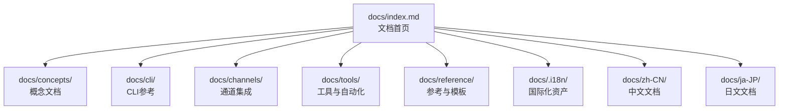
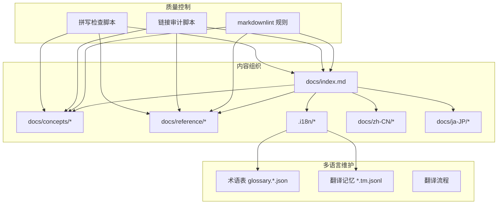
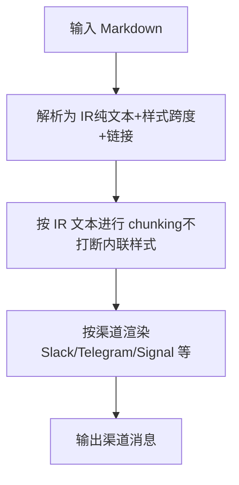
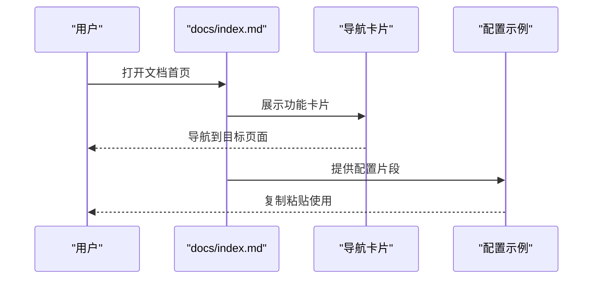
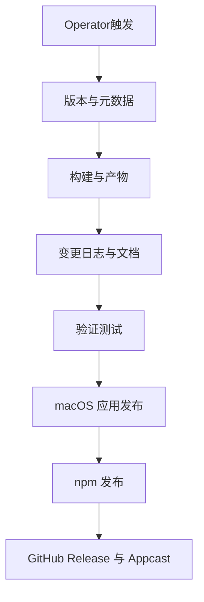
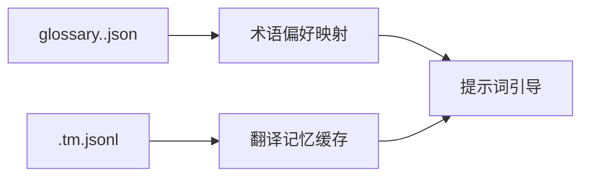
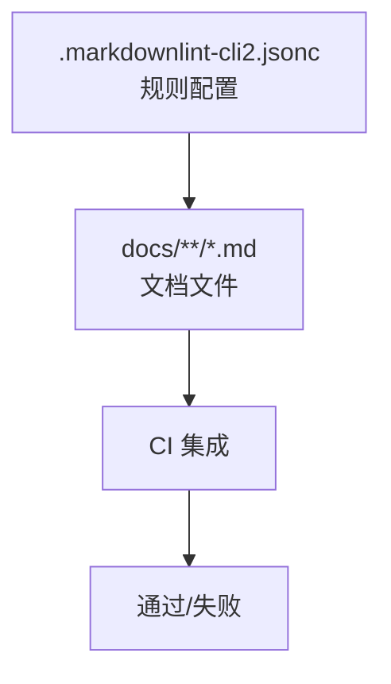

# Markdown文档规范

<cite>
**本文档引用的文件**
- [.markdownlint-cli2.jsonc](file://.markdownlint-cli2.jsonc)
- [README.md](file://README.md)
- [docs/index.md](file://docs/index.md)
- [docs/concepts/markdown-formatting.md](file://docs/concepts/markdown-formatting.md)
- [docs/reference/AGENTS.default.md](file://docs/reference/AGENTS.default.md)
- [docs/reference/RELEASING.md](file://docs/reference/RELEASING.md)
- [docs/.i18n/README.md](file://docs/.i18n/README.md)
- [CONTRIBUTING.md](file://CONTRIBUTING.md)
</cite>

## 目录

1. [引言](#引言)
2. [项目结构](#项目结构)
3. [核心组件](#核心组件)
4. [架构总览](#架构总览)
5. [详细组件分析](#详细组件分析)
6. [依赖分析](#依赖分析)
7. [性能考虑](#性能考虑)
8. [故障排查指南](#故障排查指南)
9. [结论](#结论)
10. [附录](#附录)

## 引言

本规范旨在为OpenClaw项目建立统一、可维护且高质量的Markdown文档标准，覆盖格式约定、标题层级、内容组织、语法检查、链接与图片处理、代码块格式化、API文档编写、示例与表格使用、多语言文档维护与翻译、以及文档版本管理等关键方面。通过遵循本规范，确保文档在不同平台与渠道中保持一致的阅读体验与质量。

## 项目结构

OpenClaw的文档主要位于docs目录下，采用按主题与功能域分层的组织方式：

- docs/index.md：文档首页与导航入口
- docs/concepts/：概念性文档（如Markdown格式化）
- docs/cli/、docs/channels/、docs/tools/ 等：功能域文档
- docs/reference/：参考类文档（如默认AGENTS、发布清单）
- docs/.i18n/：国际化资产与术语表
- docs/zh-CN/、docs/ja-JP/：多语言文档目录

**图表来源**

- [docs/index.md:1-193](file://docs/index.md#L1-L193)

**章节来源**

- [docs/index.md:1-193](file://docs/index.md#L1-L193)

## 核心组件

本节从文档标准角度拆解项目中的关键组件与职责边界，帮助读者快速定位所需信息。

- 文档首页与导航：docs/index.md承担入口与导航职责，提供卡片式导航、Mermaid流程图、步骤说明与配置示例。
- 概念性文档：docs/concepts/markdown-formatting.md定义Markdown格式化管道、IR中间表示、跨渠道渲染策略与chunking规则。
- 参考文档：docs/reference/AGENTS.default.md提供默认工作空间模板与技能清单；docs/reference/RELEASING.md提供发布检查清单与版本管理规范。
- 国际化资产：docs/.i18n/README.md说明术语表与翻译记忆的结构与用途。
- 质量保障：.markdownlint-cli2.jsonc定义全局Markdown语法检查规则与忽略范围。

**章节来源**

- [docs/index.md:1-193](file://docs/index.md#L1-L193)
- [docs/concepts/markdown-formatting.md:1-131](file://docs/concepts/markdown-formatting.md#L1-L131)
- [docs/reference/AGENTS.default.md:1-125](file://docs/reference/AGENTS.default.md#L1-L125)
- [docs/reference/RELEASING.md:1-152](file://docs/reference/RELEASING.md#L1-L152)
- [docs/.i18n/README.md:1-32](file://docs/.i18n/README.md#L1-L32)
- [.markdownlint-cli2.jsonc:1-53](file://.markdownlint-cli2.jsonc#L1-L53)

## 架构总览

OpenClaw文档体系由“内容组织—质量控制—多语言维护”三层构成，形成闭环的质量保障机制。

**图表来源**

- [.markdownlint-cli2.jsonc:1-53](file://.markdownlint-cli2.jsonc#L1-L53)
- [docs/index.md:1-193](file://docs/index.md#L1-L193)
- [docs/.i18n/README.md:1-32](file://docs/.i18n/README.md#L1-L32)

## 详细组件分析

### 组件A：Markdown格式化与IR中间表示

该组件负责将Markdown转换为IR（中间表示），再根据渠道特性进行渲染与chunking，确保跨渠道一致性与安全分割。

**图表来源**

- [docs/concepts/markdown-formatting.md:25-98](file://docs/concepts/markdown-formatting.md#L25-L98)

**章节来源**

- [docs/concepts/markdown-formatting.md:1-131](file://docs/concepts/markdown-formatting.md#L1-L131)

### 组件B：文档首页与导航

文档首页采用卡片式布局与步骤说明，提供快速入门路径与配置示例，并通过Mermaid展示系统架构。

**图表来源**

- [docs/index.md:32-172](file://docs/index.md#L32-L172)

**章节来源**

- [docs/index.md:1-193](file://docs/index.md#L1-L193)

### 组件C：默认工作空间与技能清单

默认工作空间模板提供标准化的个人助理设置，包括安全默认、会话启动、记忆系统与工具技能管理。

**图表来源**

- [docs/reference/AGENTS.default.md:11-125](file://docs/reference/AGENTS.default.md#L11-L125)

**章节来源**

- [docs/reference/AGENTS.default.md:1-125](file://docs/reference/AGENTS.default.md#L1-L125)

### 组件D：发布检查清单与版本管理

发布检查清单涵盖版本号策略、构建产物校验、变更日志与文档更新、验证测试、macOS应用发布与npm发布等环节。

**图表来源**

- [docs/reference/RELEASING.md:14-121](file://docs/reference/RELEASING.md#L14-L121)

**章节来源**

- [docs/reference/RELEASING.md:1-152](file://docs/reference/RELEASING.md#L1-L152)

### 组件E：国际化资产与术语表

国际化资产目录包含术语表与翻译记忆，用于指导模型翻译与缓存历史译文，保证术语一致性。

**图表来源**

- [docs/.i18n/README.md:7-32](file://docs/.i18n/README.md#L7-L32)

**章节来源**

- [docs/.i18n/README.md:1-32](file://docs/.i18n/README.md#L1-L32)

## 依赖分析

文档质量控制依赖于markdownlint规则集与相关脚本工具，形成自动化的质量门禁。

**图表来源**

- [.markdownlint-cli2.jsonc:1-53](file://.markdownlint-cli2.jsonc#L1-L53)

**章节来源**

- [.markdownlint-cli2.jsonc:1-53](file://.markdownlint-cli2.jsonc#L1-L53)

## 性能考虑

- 内容体积：避免在单篇文档中堆叠过多复杂图表与长列表，建议拆分为子文档并通过导航卡片聚合。
- 渲染性能：Mermaid图表仅在必要时使用，优先采用静态图片或简化流程图。
- 多语言维护：术语表与翻译记忆可显著降低重复翻译成本，提升维护效率。
- 质量检查：将markdownlint与链接/拼写检查纳入CI流水线，减少人工审查负担。

## 故障排查指南

- Markdown语法错误：依据markdownlint规则逐条修正，关注允许的HTML元素白名单与禁用规则。
- 链接失效：使用链接审计脚本扫描内部与外部链接，修复断链与死链。
- 拼写问题：运行拼写检查脚本，补充自定义词典以避免误报。
- 多语言一致性：核对术语表与翻译记忆，确保术语在不同语言版本中一致。

**章节来源**

- [.markdownlint-cli2.jsonc:1-53](file://.markdownlint-cli2.jsonc#L1-L53)
- [CONTRIBUTING.md:85-95](file://CONTRIBUTING.md#L85-L95)

## 结论

通过建立统一的Markdown文档规范，OpenClaw能够在多语言、多渠道与多功能域下保持文档的一致性与高质量。建议团队在日常协作中严格遵循本规范，并结合CI工具实现自动化质量门禁，持续优化文档的可读性与可维护性。

## 附录

### A. 标题层级规范

- 使用单一主标题（H1）作为文档标题，其余层级从H2开始递增。
- 合理使用H2-H4，避免过深的层级嵌套。
- 段落标题应简洁明确，避免冗长与模糊表述。

**章节来源**

- [docs/index.md:1-193](file://docs/index.md#L1-L193)
- [docs/concepts/markdown-formatting.md:1-131](file://docs/concepts/markdown-formatting.md#L1-L131)

### B. 内容组织原则

- 采用“总-分-总”结构，先概述后细节，最后总结与下一步。
- 使用卡片、步骤、列布局等组件增强可读性。
- 将复杂流程拆分为多个子文档，通过导航卡片串联。

**章节来源**

- [docs/index.md:32-172](file://docs/index.md#L32-L172)

### C. 链接规范

- 内部链接使用相对路径，避免硬编码绝对URL。
- 外部链接需校验有效性，避免使用短链。
- 图片与资源使用相对路径或CDN地址，确保离线可用性。

**章节来源**

- [docs/index.md:126-128](file://docs/index.md#L126-L128)

### D. 图片处理

- 图片尺寸适中，避免过大文件影响加载速度。
- 为图片添加alt文本，提升可访问性。
- 在暗黑模式下提供对应资源，使用CSS类切换。

**章节来源**

- [docs/index.md:10-23](file://docs/index.md#L10-L23)

### E. 代码块格式化

- 为代码块指定语言标签，便于高亮显示。
- 避免在代码块中出现敏感信息，必要时使用占位符。
- 对长代码段提供简要注释说明上下文。

**章节来源**

- [docs/reference/AGENTS.default.md:17-41](file://docs/reference/AGENTS.default.md#L17-L41)

### F. API文档编写标准

- 明确请求与响应结构，使用表格列出字段与类型。
- 提供完整的请求示例与期望响应示例。
- 标注必填字段与可选字段，说明默认值与取值范围。

**章节来源**

- [docs/concepts/markdown-formatting.md:75-84](file://docs/concepts/markdown-formatting.md#L75-L84)

### G. 示例代码格式

- 示例代码应最小可运行，避免无关依赖。
- 对关键步骤添加注释说明，便于读者理解。
- 提供多种场景的示例，覆盖常见使用路径。

**章节来源**

- [docs/reference/AGENTS.default.md:17-41](file://docs/reference/AGENTS.default.md#L17-L41)

### H. 表格使用规范

- 表格用于对比与罗列，避免在表格中嵌入复杂逻辑。
- 表头清晰，列宽适中，避免横向滚动。
- 对重要字段提供简要说明或标注来源。

**章节来源**

- [docs/reference/AGENTS.default.md:96-115](file://docs/reference/AGENTS.default.md#L96-L115)

### I. 多语言文档维护

- 术语表与翻译记忆作为翻译指导，避免歧义。
- 不同语言版本同步更新，保持内容一致性。
- 使用本地化目录（如docs/zh-CN/）存放特定语言文档。

**章节来源**

- [docs/.i18n/README.md:1-32](file://docs/.i18n/README.md#L1-L32)

### J. 翻译标准

- 术语表采用JSON格式，包含source/target字段与匹配规则。
- 翻译记忆以JSONL格式存储，键为工作流+模型+文本哈希。
- 翻译过程以提示词引导为主，避免强制重写。

**章节来源**

- [docs/.i18n/README.md:10-32](file://docs/.i18n/README.md#L10-L32)

### K. 文档版本管理

- 版本号采用日期型（YYYY.M.D），稳定版与预发布版区分明确。
- 发布前执行构建、测试与验证，确保产物正确性。
- GitHub Release包含完整变更日志与产物附件。

**章节来源**

- [docs/reference/RELEASING.md:22-121](file://docs/reference/RELEASING.md#L22-L121)
