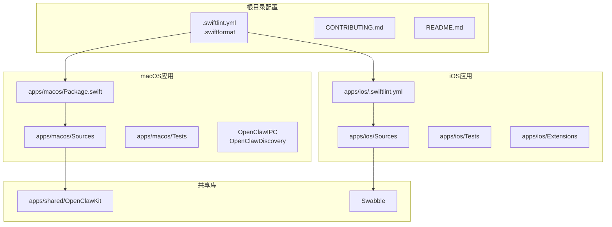
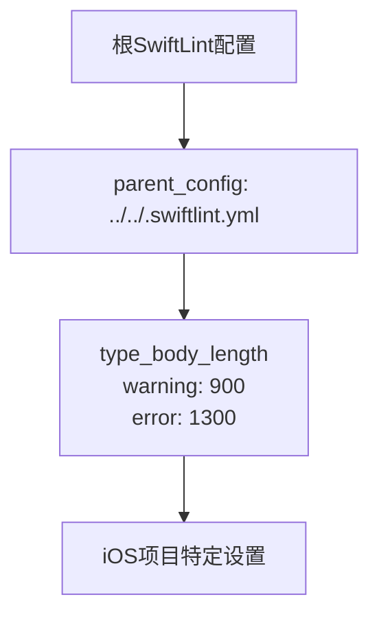
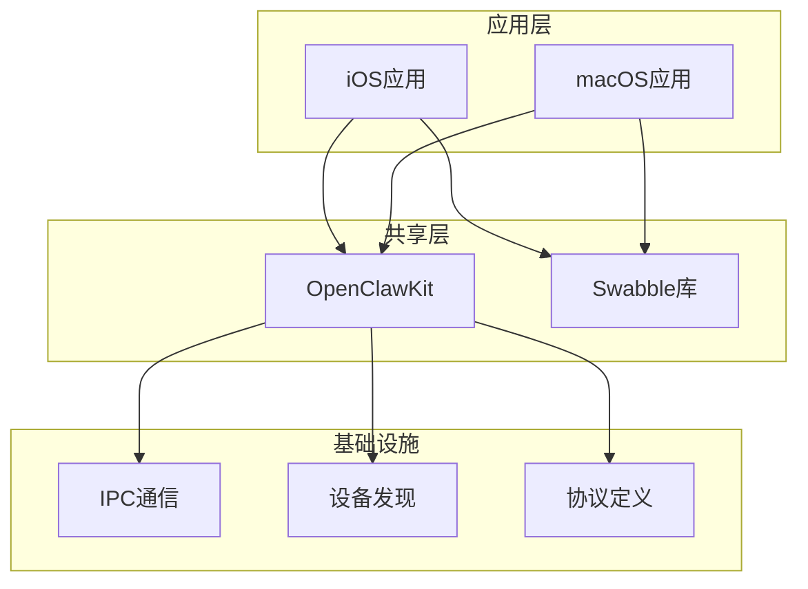
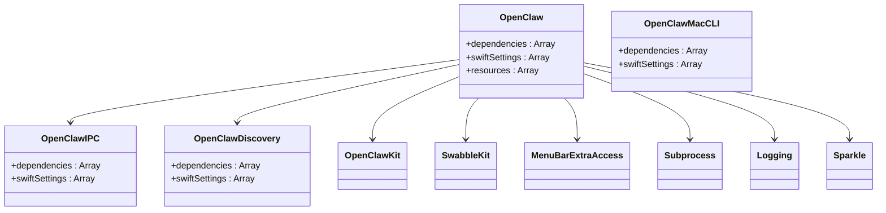
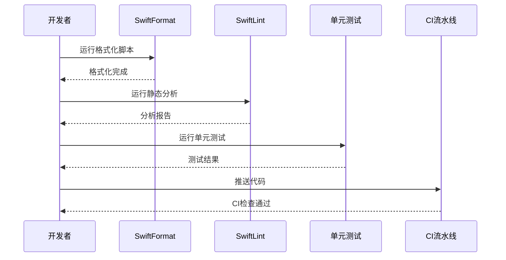
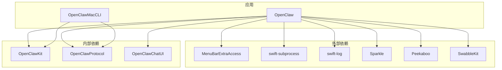
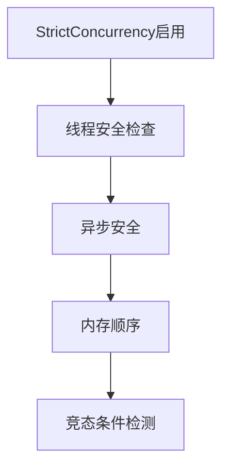
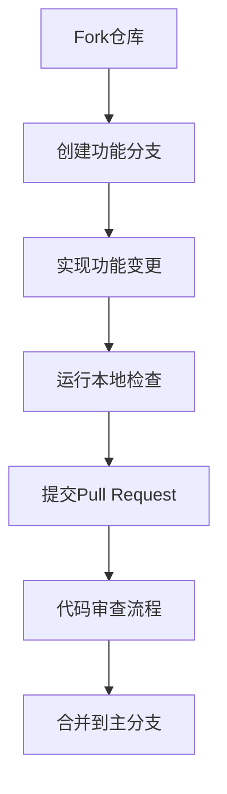

# Swift编码规范

<cite>
**本文档引用的文件**
- [.swiftlint.yml](file://.swiftlint.yml)
- [.swiftformat](file://.swiftformat)
- [apps/ios/.swiftlint.yml](file://apps/ios/.swiftlint.yml)
- [Swabble/.swiftlint.yml](file://Swabble/.swiftlint.yml)
- [Swabble/scripts/format.sh](file://Swabble/scripts/format.sh)
- [Swabble/scripts/lint.sh](file://Swabble/scripts/lint.sh)
- [apps/macos/Package.swift](file://apps/macos/Package.swift)
- [README.md](file://README.md)
- [CONTRIBUTING.md](file://CONTRIBUTING.md)
</cite>

## 目录

1. [简介](#简介)
2. [项目结构](#项目结构)
3. [核心组件](#核心组件)
4. [架构概览](#架构概览)
5. [详细组件分析](#详细组件分析)
6. [依赖关系分析](#依赖关系分析)
7. [性能考虑](#性能考虑)
8. [故障排除指南](#故障排除指南)
9. [结论](#结论)
10. [附录](#附录)

## 简介

OpenClaw是一个个人AI助手项目，支持在iOS和macOS平台上运行。本Swift编码规范旨在为iOS和macOS应用的Swift代码风格提供统一的指导原则，确保代码质量、可维护性和团队协作效率。

该项目采用现代化的Swift工具链，使用Swift 6.2版本，并集成了多种静态分析工具来保证代码质量。

## 项目结构

OpenClaw项目采用模块化的组织方式，主要包含以下Swift相关组件：

**图表来源**

- [apps/macos/Package.swift:1-93](file://apps/macos/Package.swift#L1-L93)
- [.swiftlint.yml:1-151](file://.swiftlint.yml#L1-L151)

**章节来源**

- [apps/macos/Package.swift:1-93](file://apps/macos/Package.swift#L1-L93)
- [README.md:1-560](file://README.md#L1-L560)

## 核心组件

### 静态分析配置

项目使用SwiftLint作为主要的静态分析工具，配置文件位于根目录的`.swiftlint.yml`中。

#### SwiftLint配置要点

| 规则类别   | 配置说明                         | 限制值               |
| ---------- | -------------------------------- | -------------------- |
| 函数体长度 | warning: 150行, error: 300行     | 控制单个函数的复杂度 |
| 参数数量   | warning: 7个, error: 10个        | 防止过度参数化       |
| 文件长度   | warning: 1500行, error: 2500行   | 保持文件可读性       |
| 圈复杂度   | warning: 20, error: 120          | 控制分支复杂度       |
| 元组大小   | warning: 4个元素, error: 5个元素 | 避免过大的元组       |

#### 分析器规则

项目启用了以下分析器规则来提高代码质量：

- `unused_declaration`: 检测未使用的声明
- `unused_import`: 检测未使用的导入语句

**章节来源**

- [.swiftlint.yml:25-151](file://.swiftlint.yml#L25-L151)

### 代码格式化配置

SwiftFormat用于自动格式化Swift代码，确保团队代码风格的一致性。

#### SwiftFormat配置要点

| 设置项       | 值                | 说明                    |
| ------------ | ----------------- | ----------------------- |
| Swift版本    | 6.2               | 使用最新的Swift语言特性 |
| 缩进         | 4空格             | 统一缩进风格            |
| 行宽         | 120字符           | 控制行长限制            |
| 自动self插入 | 启用              | 减少self冗余            |
| 导入分组     | testable-bottom   | 测试相关导入位置        |
| MARK注释     | "MARK: - %t + %p" | 标准化代码标记格式      |

**章节来源**

- [.swiftformat:1-52](file://.swiftformat#L1-L52)

### 平台特定配置

#### iOS平台配置

iOS项目继承自根配置，但针对iOS平台进行了特殊调整：

**图表来源**

- [apps/ios/.swiftlint.yml:1-10](file://apps/ios/.swiftlint.yml#L1-L10)

#### Swabble库配置

Swabble是语音处理相关的独立库，具有自己的SwiftLint配置：

| 规则类别 | 配置值                   |
| -------- | ------------------------ |
| 行长度   | warning: 140, error: 180 |
| 启用规则 | 17个优化规则             |
| 禁用规则 | 12个样式规则             |

**章节来源**

- [Swabble/.swiftlint.yml:1-44](file://Swabble/.swiftlint.yml#L1-L44)

## 架构概览

OpenClaw的Swift代码架构采用分层设计，确保iOS和macOS应用的代码复用和一致性。

**图表来源**

- [apps/macos/Package.swift:26-57](file://apps/macos/Package.swift#L26-L57)

### 依赖管理

项目使用Swift Package Manager进行依赖管理，所有目标都启用了严格的并发特性：

**图表来源**

- [apps/macos/Package.swift:42-78](file://apps/macos/Package.swift#L42-L78)

**章节来源**

- [apps/macos/Package.swift:17-25](file://apps/macos/Package.swift#L17-L25)

## 详细组件分析

### 代码质量控制流程

项目建立了完整的代码质量控制流程，包括自动化检查和手动审查。

**图表来源**

- [Swabble/scripts/format.sh:1-6](file://Swabble/scripts/format.sh#L1-L6)
- [Swabble/scripts/lint.sh:1-10](file://Swabble/scripts/lint.sh#L1-L10)

### iOS应用组件

iOS应用采用模块化架构，主要包含以下组件：

#### Activity Widget

- 提供系统级活动小部件功能
- 支持用户快速访问核心功能

#### Share Extension

- 实现系统分享扩展
- 允许从其他应用分享内容到OpenClaw

#### Watch App

- 为Apple Watch提供专用界面
- 支持简化操作和状态查看

#### 主应用

- 完整的功能实现
- 与macOS应用共享核心逻辑

**章节来源**

- [README.md:298-311](file://README.md#L298-L311)

### macOS应用组件

macOS应用采用菜单栏应用架构，提供轻量级的桌面体验。

#### OpenClaw主应用

- 菜单栏图标显示应用状态
- 提供完整的功能界面
- 支持远程网关控制

#### OpenClawMacCLI

- 命令行工具
- 支持自动化脚本
- 提供高级功能访问

#### OpenClawIPC库

- 进程间通信接口
- 支持安全的数据交换
- 实现类型安全的API

#### OpenClawDiscovery库

- 设备发现机制
- 支持Bonjour服务
- 实现网络设备扫描

**章节来源**

- [apps/macos/Package.swift:11-16](file://apps/macos/Package.swift#L11-L16)

## 依赖关系分析

项目采用清晰的依赖层次结构，确保模块间的松耦合和高内聚。

**图表来源**

- [apps/macos/Package.swift:44-56](file://apps/macos/Package.swift#L44-L56)

### 依赖版本管理

项目使用精确版本控制和语义化版本管理：

| 依赖包             | 版本控制方式 | 版本号 |
| ------------------ | ------------ | ------ |
| MenuBarExtraAccess | 精确版本     | 1.2.2  |
| swift-subprocess   | 最小版本     | 0.1.0  |
| swift-log          | 最小版本     | 1.8.0  |
| Sparkle            | 最小版本     | 2.8.1  |
| Peekaboo           | 分支版本     | main   |

**章节来源**

- [apps/macos/Package.swift:17-25](file://apps/macos/Package.swift#L17-L25)

## 性能考虑

### 内存管理

项目采用现代Swift内存管理模式，充分利用ARC（自动引用计数）机制：

- **弱引用**: 在委托和闭包中使用`weak self`避免循环引用
- **无主引用**: 在确定不会为nil的情况下使用`unowned self`
- **延迟加载**: 对昂贵对象使用懒加载初始化
- **集合优化**: 使用适当的集合类型和容量预分配

### 并发安全

所有目标都启用了严格并发特性：

**图表来源**

- [apps/macos/Package.swift:30-32](file://apps/macos/Package.swift#L30-L32)

### 性能监控

建议实施以下性能监控措施：

- **内存使用**: 定期监控应用内存占用
- **CPU使用率**: 监控主线程阻塞情况
- **网络请求**: 跟踪API调用性能
- **UI响应**: 监控界面流畅度

## 故障排除指南

### 常见问题解决

#### SwiftLint错误处理

当遇到SwiftLint违规时，应按照以下步骤处理：

1. **识别违规类型**: 查看具体的错误信息和行号
2. **理解规则含义**: 参考规则配置了解限制原因
3. **修改代码**: 按照最佳实践修改代码结构
4. **重新检查**: 运行SwiftLint确认问题已解决

#### 格式化冲突

当SwiftFormat和SwiftLint产生冲突时：

1. **优先级判断**: 根据配置文件中的优先级决定取舍
2. **手动调整**: 必要时手动调整代码格式
3. **配置优化**: 调整配置文件以减少冲突

**章节来源**

- [.swiftlint.yml:55-99](file://.swiftlint.yml#L55-L99)

### 贡献流程

项目建立了完善的贡献流程，确保代码质量和团队协作效率：

**图表来源**

- [CONTRIBUTING.md:85-106](file://CONTRIBUTING.md#L85-L106)

**章节来源**

- [CONTRIBUTING.md:79-106](file://CONTRIBUTING.md#L79-L106)

## 结论

OpenClaw项目的Swift编码规范体现了现代iOS和macOS应用开发的最佳实践。通过统一的静态分析配置、代码格式化标准和严格的依赖管理，项目确保了代码质量的一致性和可维护性。

关键优势包括：

- **标准化流程**: 从根配置到平台特定配置的完整覆盖
- **自动化工具**: SwiftFormat和SwiftLint的集成使用
- **模块化架构**: 清晰的依赖层次和功能分离
- **性能优化**: 严格并发特性和内存管理最佳实践

这些规范为团队协作提供了明确的指导，也为新成员快速融入项目奠定了基础。

## 附录

### 快速参考清单

#### 代码编写规范

- 使用4空格缩进
- 行长不超过120字符
- 函数体长度不超过150行
- 参数数量不超过7个
- 类型体长度不超过800行

#### 静态分析规则

- 启用未使用声明检测
- 启用未使用导入检测
- 圈复杂度不超过20
- 元组元素不超过4个

#### 平台特定要求

- iOS应用使用900行类型体限制
- macOS应用启用StrictConcurrency
- 所有目标使用Swift 6.2
