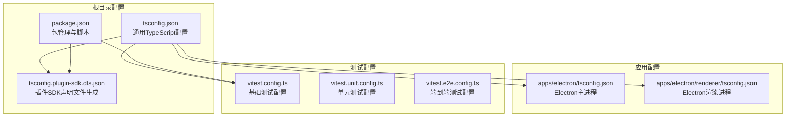
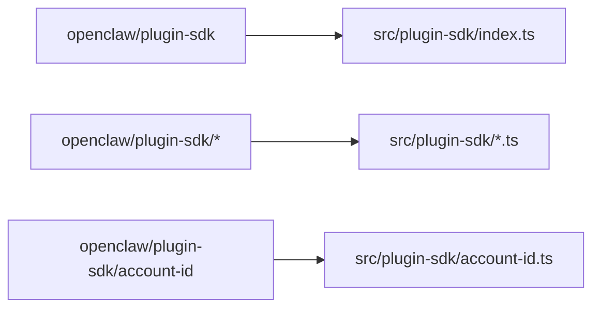
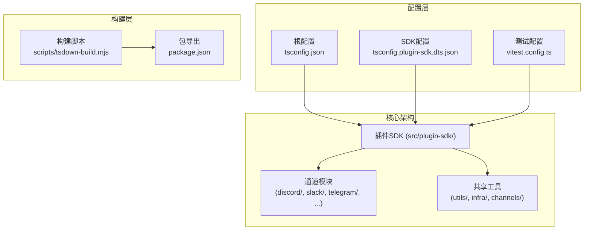
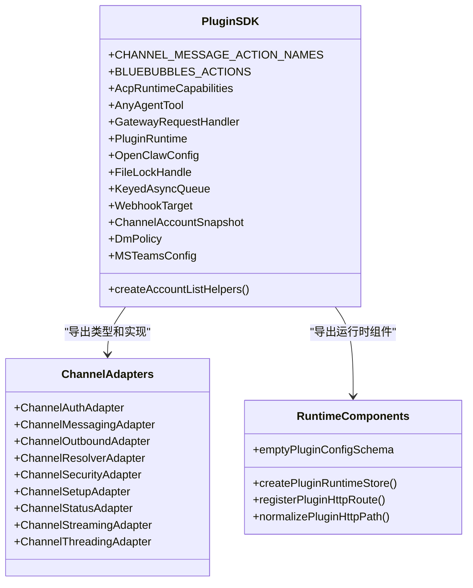
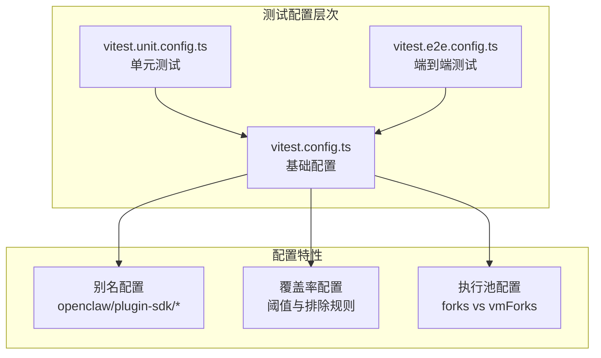
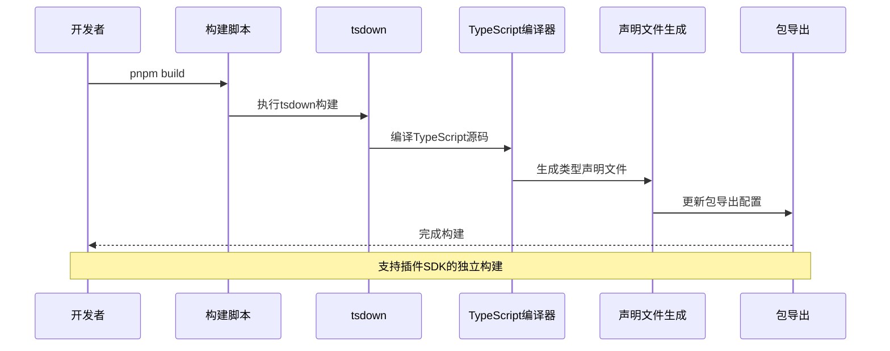
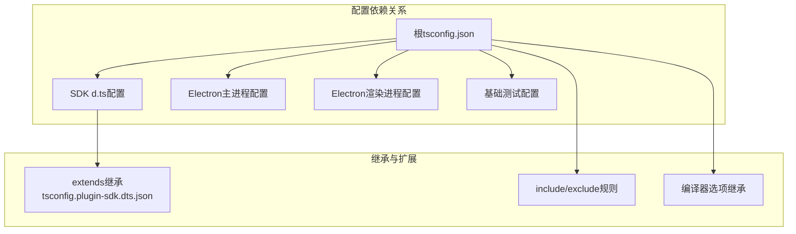

# TypeScript编码规范

<cite>
**本文档引用的文件**
- [tsconfig.json](file://tsconfig.json)
- [package.json](file://package.json)
- [tsconfig.plugin-sdk.dts.json](file://tsconfig.plugin-sdk.dts.json)
- [apps/electron/tsconfig.json](file://apps/electron/tsconfig.json)
- [apps/electron/renderer/tsconfig.json](file://apps/electron/renderer/tsconfig.json)
- [vitest.config.ts](file://vitest.config.ts)
- [vitest.unit.config.ts](file://vitest.unit.config.ts)
- [vitest.e2e.config.ts](file://vitest.e2e.config.ts)
- [src/plugin-sdk/index.ts](file://src/plugin-sdk/index.ts)
- [scripts/tsdown-build.mjs](file://scripts/tsdown-build.mjs)
</cite>

## 目录

1. [简介](#简介)
2. [项目结构](#项目结构)
3. [核心组件](#核心组件)
4. [架构概览](#架构概览)
5. [详细组件分析](#详细组件分析)
6. [依赖分析](#依赖分析)
7. [性能考虑](#性能考虑)
8. [故障排除指南](#故障排除指南)
9. [结论](#结论)

## 简介

本文件为OpenClaw项目的TypeScript编码规范文档，旨在为开发者提供统一的TypeScript配置、编译器设置和代码组织原则指导。OpenClaw是一个多渠道AI网关项目，采用Monorepo架构，包含多个应用和插件扩展。本文档重点覆盖以下方面：

- TypeScript配置选项与编译器设置
- 严格模式配置与模块解析策略
- 路径映射规则与模块导入导出约定
- 项目结构、类型定义规范与代码组织最佳实践
- 接口设计原则与错误处理模式
- 测试配置、构建流程与开发工具链使用

## 项目结构

OpenClaw采用Monorepo架构，TypeScript相关配置分布在根目录和各子项目中。主要配置文件包括：

- 根级TypeScript配置：用于主应用和插件SDK的通用配置
- 应用特定配置：如Electron主进程和渲染进程的独立配置
- 插件SDK专用配置：生成声明文件的专门配置
- 测试配置：基于Vitest的多环境测试配置

**图表来源**

- [tsconfig.json:1-29](file://tsconfig.json#L1-L29)
- [package.json:1-467](file://package.json#L1-L467)
- [tsconfig.plugin-sdk.dts.json:1-62](file://tsconfig.plugin-sdk.dts.json#L1-L62)
- [apps/electron/tsconfig.json:1-27](file://apps/electron/tsconfig.json#L1-L27)
- [apps/electron/renderer/tsconfig.json:1-26](file://apps/electron/renderer/tsconfig.json#L1-L26)

**章节来源**

- [tsconfig.json:1-29](file://tsconfig.json#L1-L29)
- [package.json:1-467](file://package.json#L1-L467)

## 核心组件

### 编译器配置选项

项目采用严格的TypeScript配置，确保代码质量和类型安全：

**严格模式配置**

- 启用完整严格模式 (`"strict": true`)
- 文件名大小写一致性检查 (`"forceConsistentCasingInFileNames": true`)
- 实验性装饰器支持 (`"experimentalDecorators": true`)

**目标与模块系统**

- 目标版本：ES2023 (`"target": "es2023"`)
- 模块系统：NodeNext (`"module": "NodeNext"`)
- 模块解析：NodeNext (`"moduleResolution": "NodeNext"`)

**输出与类型定义**

- 声明文件生成：启用 (`"declaration": true`)
- 输出目录：dist (`"outDir": "dist"`)
- JSON模块解析：启用 (`"resolveJsonModule": true`)

**路径映射规则**
项目定义了针对插件SDK的路径映射，简化模块导入：

**图表来源**

- [tsconfig.json:20-24](file://tsconfig.json#L20-L24)

**章节来源**

- [tsconfig.json:2-28](file://tsconfig.json#L2-L28)

### 构建与发布配置

**包导出配置**
项目通过package.json的exports字段提供多种导出格式：

- 类型定义导出：`"./plugin-sdk": {"types": "./dist/plugin-sdk/index.d.ts"}`
- 默认JavaScript导出：`"./plugin-sdk": {"default": "./dist/plugin-sdk/index.js"}`
- 子路径导出：支持各个插件通道的独立导出

**构建脚本**

- 主构建：`pnpm build` - 执行完整的构建流程
- 插件SDK声明文件：`pnpm build:plugin-sdk:dts` - 生成类型声明
- 严格烟雾测试：`pnpm build:strict-smoke` - 验证严格模式配置

**章节来源**

- [package.json:37-216](file://package.json#L37-L216)
- [package.json:226-229](file://package.json#L226-L229)

## 架构概览

OpenClaw的TypeScript架构围绕插件SDK中心化设计，通过路径映射和别名机制实现模块解耦。

**图表来源**

- [src/plugin-sdk/index.ts:1-826](file://src/plugin-sdk/index.ts#L1-L826)
- [tsconfig.json:20-24](file://tsconfig.json#L20-L24)
- [tsconfig.plugin-sdk.dts.json:13-59](file://tsconfig.plugin-sdk.dts.json#L13-L59)

## 详细组件分析

### 插件SDK模块系统

插件SDK是OpenClaw的核心抽象层，通过集中导出机制提供统一的API接口。

**图表来源**

- [src/plugin-sdk/index.ts:1-826](file://src/plugin-sdk/index.ts#L1-L826)

**模块导入导出约定**

项目遵循明确的导入导出约定：

1. **相对导入**：在内部模块间使用相对路径导入
2. **别名导入**：通过路径映射使用别名导入插件SDK
3. **类型导入**：仅在类型位置使用`import type`语法
4. **命名空间导出**：插件SDK采用统一的命名空间导出

**章节来源**

- [src/plugin-sdk/index.ts:1-826](file://src/plugin-sdk/index.ts#L1-L826)

### 测试配置体系

项目采用分层的测试配置体系，针对不同测试场景提供专门的配置。

**图表来源**

- [vitest.config.ts:57-202](file://vitest.config.ts#L57-L202)
- [vitest.unit.config.ts:1-31](file://vitest.unit.config.ts#L1-L31)
- [vitest.e2e.config.ts:1-33](file://vitest.e2e.config.ts#L1-L33)

**测试配置特点**

1. **别名解析**：支持插件SDK的别名导入
2. **覆盖率控制**：精细化的覆盖率阈值和排除规则
3. **执行隔离**：E2E测试使用进程隔离确保确定性
4. **环境适配**：根据CI/本地环境自动调整并发参数

**章节来源**

- [vitest.config.ts:57-202](file://vitest.config.ts#L57-L202)
- [vitest.unit.config.ts:11-30](file://vitest.unit.config.ts#L11-L30)
- [vitest.e2e.config.ts:20-32](file://vitest.e2e.config.ts#L20-L32)

### 构建流程与工具链

项目采用现代化的构建工具链，结合TypeScript和Vitest实现高效的开发体验。

**图表来源**

- [scripts/tsdown-build.mjs:1-20](file://scripts/tsdown-build.mjs#L1-L20)
- [package.json:226-229](file://package.json#L226-L229)

**构建流程特性**

1. **增量构建**：利用tsdown实现快速增量编译
2. **声明文件分离**：插件SDK声明文件独立生成
3. **自动化元数据**：自动生成构建信息和CLI元数据
4. **跨平台兼容**：支持Windows和Unix系统的构建差异

**章节来源**

- [scripts/tsdown-build.mjs:1-20](file://scripts/tsdown-build.mjs#L1-L20)
- [package.json:226-229](file://package.json#L226-L229)

## 依赖分析

TypeScript配置之间的依赖关系体现了项目的模块化设计理念。

**图表来源**

- [tsconfig.plugin-sdk.dts.json:2](file://tsconfig.plugin-sdk.dts.json#L2)
- [tsconfig.json:26-27](file://tsconfig.json#L26-L27)

**依赖关系特点**

1. **配置继承**：SDK声明文件配置继承根配置
2. **模块隔离**：应用配置与通用配置相互独立
3. **测试专用**：测试配置独立于生产配置
4. **路径映射**：统一的路径映射策略贯穿所有配置

**章节来源**

- [tsconfig.plugin-sdk.dts.json:1-62](file://tsconfig.plugin-sdk.dts.json#L1-L62)
- [tsconfig.json:1-29](file://tsconfig.json#L1-L29)

## 性能考虑

### 编译性能优化

1. **增量编译**：利用tsdown实现快速增量构建
2. **并行处理**：构建脚本支持并行执行多个任务
3. **缓存策略**：TypeScript构建信息文件缓存
4. **排除规则**：合理配置exclude避免不必要的文件扫描

### 运行时性能

1. **模块解析优化**：使用路径映射减少模块解析开销
2. **声明文件复用**：预生成的声明文件避免重复类型检查
3. **测试隔离**：进程隔离确保测试稳定性但增加启动开销
4. **覆盖率采样**：按需计算覆盖率减少内存占用

## 故障排除指南

### 常见配置问题

**路径映射不生效**

- 检查tsconfig.json中的paths配置
- 确认模块解析策略与路径映射匹配
- 验证导入语句是否使用正确的别名

**类型检查失败**

- 检查严格模式下的类型错误
- 确认声明文件生成是否正确
- 验证模块导出是否完整

**测试配置问题**

- 检查别名配置是否正确映射到源文件
- 确认覆盖率排除规则不会误排除测试代码
- 验证执行池配置适合测试类型

### 构建问题诊断

**构建失败排查**

1. 检查TypeScript版本兼容性
2. 验证构建脚本的依赖安装状态
3. 确认Node.js版本满足要求
4. 检查磁盘空间和权限问题

**性能问题排查**

1. 分析构建时间热点
2. 检查并行度配置
3. 验证缓存机制有效性
4. 评估模块依赖复杂度

**章节来源**

- [tsconfig.json:2-28](file://tsconfig.json#L2-L28)
- [vitest.config.ts:57-202](file://vitest.config.ts#L57-L202)

## 结论

OpenClaw项目的TypeScript编码规范体现了现代TypeScript项目的最佳实践：

1. **统一配置策略**：通过根配置和专用配置文件实现配置复用和隔离
2. **模块化设计**：插件SDK中心化设计支持灵活的模块组合
3. **严格类型安全**：完整的严格模式配置确保代码质量
4. **高效开发工具链**：现代化的构建和测试工具提升开发效率
5. **可维护性优先**：清晰的配置层次和约定便于长期维护

建议开发者在遵循现有规范的基础上，持续关注TypeScript新特性和工具链演进，适时更新配置以获得更好的开发体验和代码质量。
