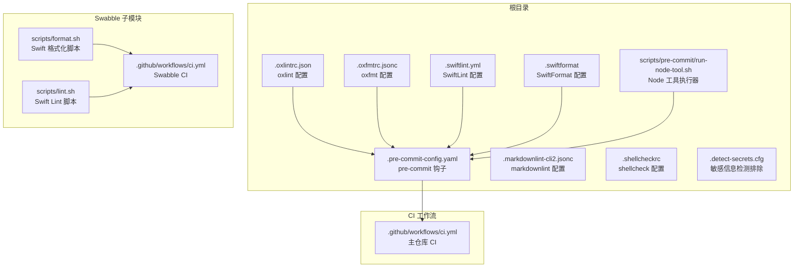
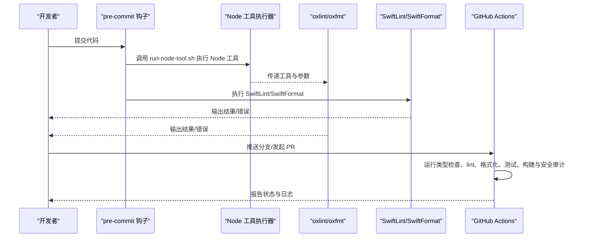
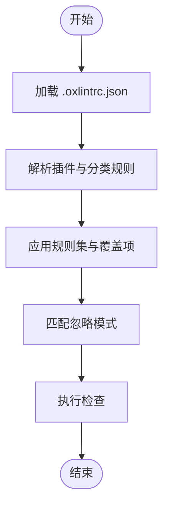
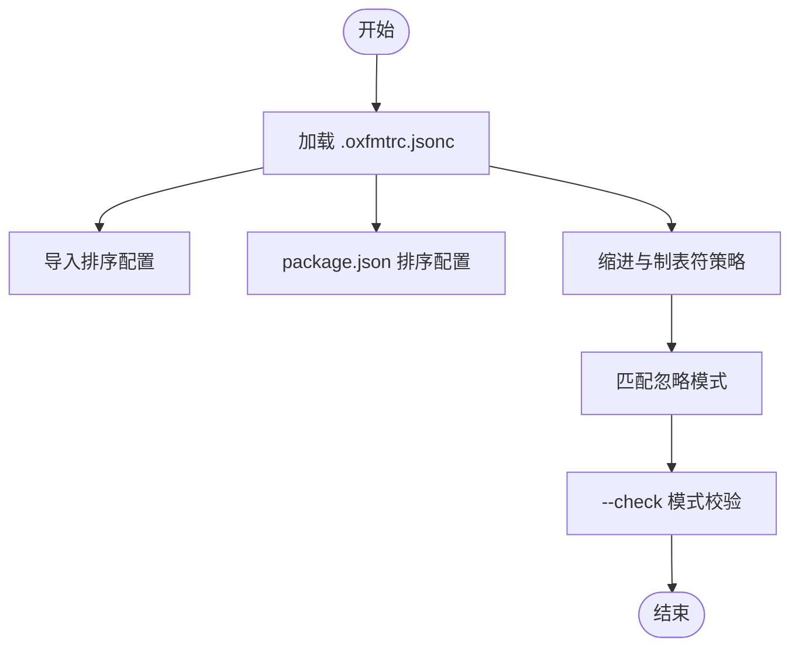
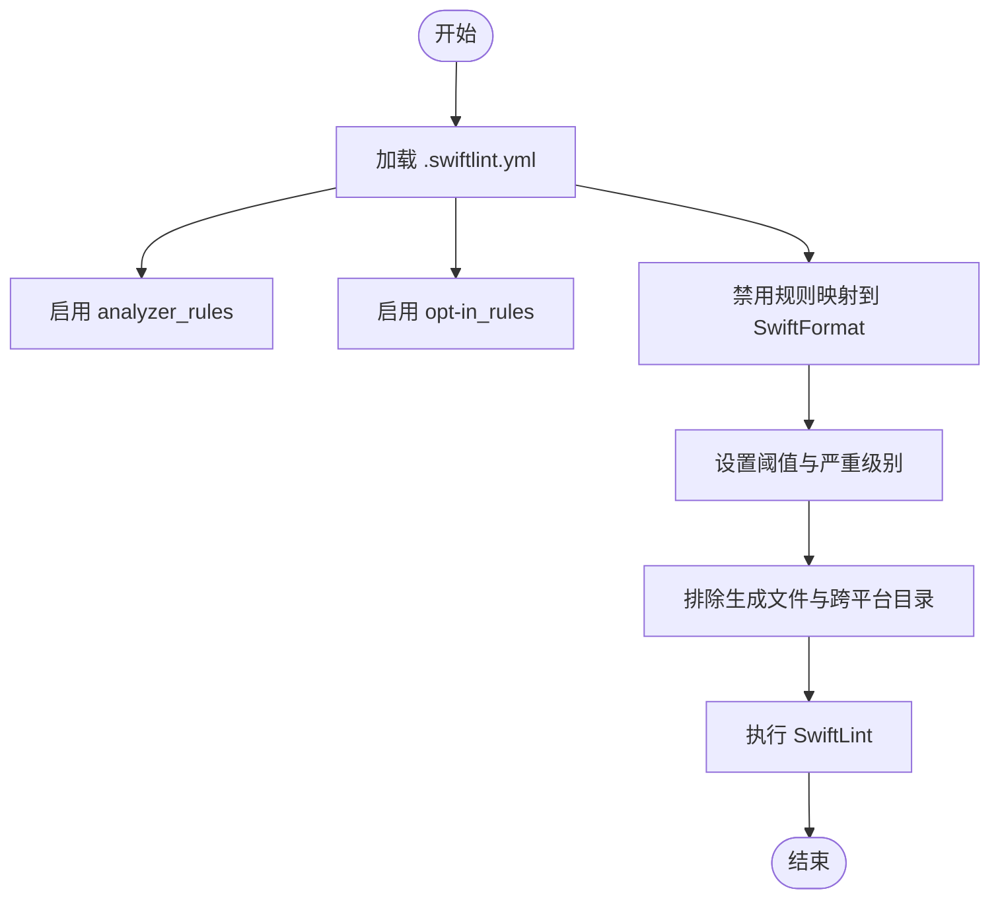
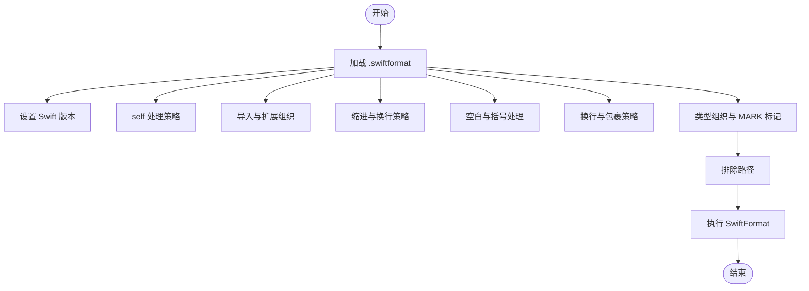
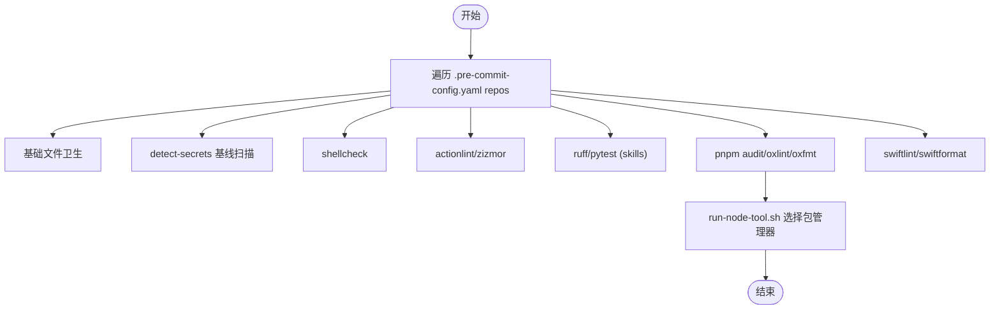
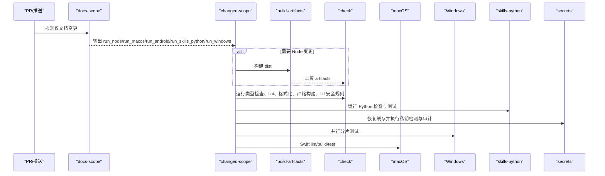
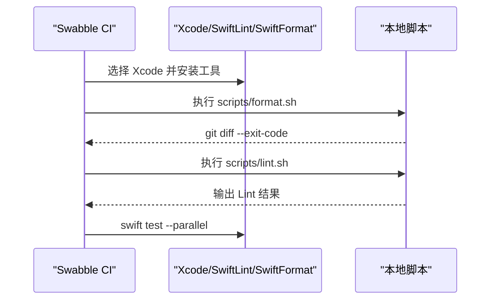
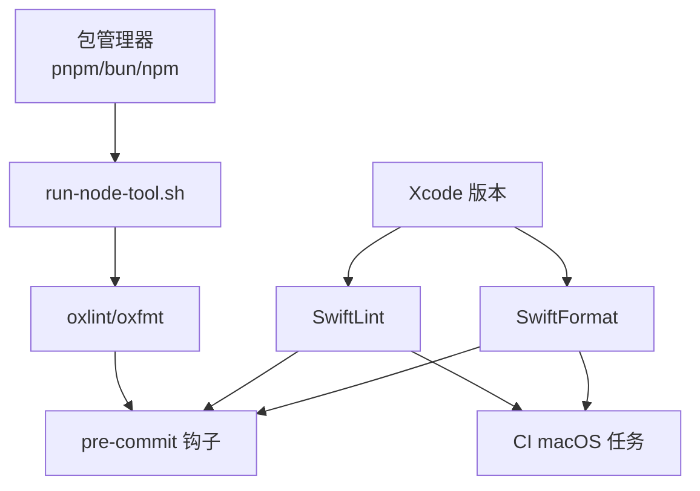

# 代码检查与格式化

<cite>
**本文档引用的文件**
- [.oxlintrc.json](file://.oxlintrc.json)
- [.oxfmtrc.jsonc](file://.oxfmtrc.jsonc)
- [.pre-commit-config.yaml](file://.pre-commit-config.yaml)
- [.markdownlint-cli2.jsonc](file://.markdownlint-cli2.jsonc)
- [.shellcheckrc](file://.shellcheckrc)
- [.swiftlint.yml](file://.swiftlint.yml)
- [.swiftformat](file://.swiftformat)
- [.detect-secrets.cfg](file://.detect-secrets.cfg)
- [scripts/pre-commit/run-node-tool.sh](file://scripts/pre-commit/run-node-tool.sh)
- [Swabble/scripts/format.sh](file://Swabble/scripts/format.sh)
- [Swabble/scripts/lint.sh](file://Swabble/scripts/lint.sh)
- [.github/workflows/ci.yml](file://.github/workflows/ci.yml)
- [Swabble/.github/workflows/ci.yml](file://Swabble/.github/workflows/ci.yml)
</cite>

## 目录

1. [简介](#简介)
2. [项目结构](#项目结构)
3. [核心组件](#核心组件)
4. [架构总览](#架构总览)
5. [详细组件分析](#详细组件分析)
6. [依赖关系分析](#依赖关系分析)
7. [性能考虑](#性能考虑)
8. [故障排除指南](#故障排除指南)
9. [结论](#结论)
10. [附录](#附录)

## 简介

本文件系统性梳理本仓库的代码检查与格式化体系，覆盖以下方面：

- 静态分析工具配置：oxlint（JavaScript/TypeScript）、SwiftLint（Swift）
- 自动格式化工具：oxfmt（JavaScript/TypeScript）、SwiftFormat（Swift）
- 文档与Shell脚本检查：markdownlint、shellcheck
- 预提交钩子：pre-commit 配置与本地执行脚本
- 持续集成中的质量门禁：GitHub Actions 工作流
- 团队协作规范：工具链选择、忽略模式、质量门限与缓存策略

## 项目结构

本仓库在根目录与子模块中分别配置了多套检查与格式化工具，形成“本地+CI”的双层质量保障。

图表来源

- [.pre-commit-config.yaml:1-158](file://.pre-commit-config.yaml#L1-L158)
- [.oxlintrc.json:1-40](file://.oxlintrc.json#L1-L40)
- [.oxfmtrc.jsonc:1-27](file://.oxfmtrc.jsonc#L1-L27)
- [.swiftlint.yml:1-151](file://.swiftlint.yml#L1-L151)
- [.swiftformat:1-52](file://.swiftformat#L1-L52)
- [scripts/pre-commit/run-node-tool.sh:1-32](file://scripts/pre-commit/run-node-tool.sh#L1-L32)
- [Swabble/scripts/format.sh:1-6](file://Swabble/scripts/format.sh#L1-L6)
- [Swabble/scripts/lint.sh:1-10](file://Swabble/scripts/lint.sh#L1-L10)
- [Swabble/.github/workflows/ci.yml:1-55](file://Swabble/.github/workflows/ci.yml#L1-L55)
- [.github/workflows/ci.yml:1-737](file://.github/workflows/ci.yml#L1-L737)

章节来源

- [.pre-commit-config.yaml:1-158](file://.pre-commit-config.yaml#L1-L158)
- [.github/workflows/ci.yml:1-737](file://.github/workflows/ci.yml#L1-L737)

## 核心组件

- JavaScript/TypeScript 静态分析与格式化
  - oxlint：启用插件与分类规则，关闭若干规则以平衡严格性与可用性；忽略模式覆盖文档、扩展、第三方等目录。
  - oxfmt：导入排序、package.json 排序、缩进宽度与制表符策略；忽略模式与 oxlint 基本一致。
- Swift 语言检查与格式化
  - SwiftLint：启用 analyzer_rules 与 opt-in 规则，大量禁用规则交由 SwiftFormat 处理；对函数体长度、参数数量、文件长度、圈复杂度等设置阈值。
  - SwiftFormat：统一缩进、换行、空格、组织结构等风格；明确排除生成文件与跨平台目录。
- 文档与脚本检查
  - markdownlint：限定检查范围为 docs 与 README，针对特定规则关闭或放宽，并允许部分 HTML 元素。
  - shellcheck：通过 .shellcheckrc 关闭常见误报，聚焦真实问题。
- 敏感信息检测
  - detect-secrets：集中配置排除模式，避免误报与噪音。
- 预提交钩子
  - pre-commit：集成文件卫生、私钥检测、Shell 检查、GitHub Actions 语法检查与安全审计、Python 检查与测试、npm 审计、oxlint/oxfmt、SwiftLint/SwiftFormat。
  - run-node-tool.sh：按 pnpm/bun/npm 的顺序选择包管理器执行 Node 工具，确保跨环境一致性。
- CI 质量门禁
  - 主仓库 CI：类型检查、lint 与格式化、严格构建、UI 安全规则、文档检查、Windows 并行分片测试、macOS Swift lint/build/test、Android 构建与单元测试。
  - Swabble 子模块 CI：独立的 Swift 格式化检查与 Lint 流程。

章节来源

- [.oxlintrc.json:1-40](file://.oxlintrc.json#L1-L40)
- [.oxfmtrc.jsonc:1-27](file://.oxfmtrc.jsonc#L1-L27)
- [.swiftlint.yml:1-151](file://.swiftlint.yml#L1-L151)
- [.swiftformat:1-52](file://.swiftformat#L1-L52)
- [.markdownlint-cli2.jsonc:1-53](file://.markdownlint-cli2.jsonc#L1-L53)
- [.shellcheckrc:1-26](file://.shellcheckrc#L1-L26)
- [.detect-secrets.cfg:1-46](file://.detect-secrets.cfg#L1-L46)
- [.pre-commit-config.yaml:1-158](file://.pre-commit-config.yaml#L1-L158)
- [scripts/pre-commit/run-node-tool.sh:1-32](file://scripts/pre-commit/run-node-tool.sh#L1-L32)
- [Swabble/.github/workflows/ci.yml:1-55](file://Swabble/.github/workflows/ci.yml#L1-L55)

## 架构总览

下图展示从本地到 CI 的检查与格式化流程：

图表来源

- [.pre-commit-config.yaml:107-158](file://.pre-commit-config.yaml#L107-L158)
- [scripts/pre-commit/run-node-tool.sh:14-28](file://scripts/pre-commit/run-node-tool.sh#L14-L28)
- [.github/workflows/ci.yml:189-215](file://.github/workflows/ci.yml#L189-L215)

## 详细组件分析

### oxlint 配置与规则

- 插件与分类
  - 启用 unicorn、typescript、oxc 插件，分类规则包括 correctness、perf、suspicious 统一为 error。
- 关键规则
  - 启用 TypeScript 明确类型相关规则，关闭若干循环、显式 any、unsafe 类型断言等规则以提升可维护性。
  - 关闭部分 ESLint 规则与 oxc 特定规则，平衡严格性与实际工程约束。
- 忽略模式
  - 排除 assets、dist、docs/\_layouts、extensions、node_modules、patches、技能脚本、Swabble、vendor 等目录与特定文件。

图表来源

- [.oxlintrc.json:1-40](file://.oxlintrc.json#L1-L40)

章节来源

- [.oxlintrc.json:1-40](file://.oxlintrc.json#L1-L40)

### oxfmt 格式化配置

- 导入排序与 package.json 排序
  - experimentalSortImports 与 experimentalSortPackageJson 开启，控制新行间隔与脚本字段排序。
- 缩进与制表符
  - tabWidth=2，useTabs=false，统一缩进策略。
- 忽略模式
  - 与 oxlint 基本一致，覆盖 apps、assets、dist、docs/\_layouts、node_modules、patches、Swabble、vendor 等。

图表来源

- [.oxfmtrc.jsonc:1-27](file://.oxfmtrc.jsonc#L1-L27)

章节来源

- [.oxfmtrc.jsonc:1-27](file://.oxfmtrc.jsonc#L1-L27)

### SwiftLint 配置与规则

- 分析与规则
  - analyzer_rules 启用未使用声明与导入检查；opt-in_rules 引入多项风格与可读性规则。
  - 大量禁用规则交由 SwiftFormat 处理，减少重复与冲突。
- 严重级别与阈值
  - force_cast、force_try 警告级别；对函数体长度、参数数量、文件长度、类型体长度、圈复杂度、元组大小、嵌套层级、行长等设置警告/错误阈值。
- 忽略路径
  - 排除构建产物、派生数据、资源、协议生成文件与跨平台目录。

图表来源

- [.swiftlint.yml:1-151](file://.swiftlint.yml#L1-L151)

章节来源

- [.swiftlint.yml:1-151](file://.swiftlint.yml#L1-L151)

### SwiftFormat 配置与规则

- 语言版本与 self 处理
  - Swift 6.2，self insert 与 selfrequired 控制 self 使用策略。
- 导入与扩展
  - importgrouping 将 testable 放到底部；extensionacl 限制扩展访问修饰。
- 缩进与换行
  - indent=4，maxwidth=120，linebreaks=lf，trimwhitespace=always。
- 组织结构
  - 按类型排序，扩展标记与 MARK 注释策略，structthreshold 与 enumthreshold=0。
- 忽略路径
  - 明确排除构建产物、派生数据、资源、协议生成文件与跨平台目录。

图表来源

- [.swiftformat:1-52](file://.swiftformat#L1-L52)

章节来源

- [.swiftformat:1-52](file://.swiftformat#L1-L52)

### 文档与脚本检查

- markdownlint
  - 仅检查 docs/**/\*.md、docs/**/\*.mdx、README.md；忽略 zh-CN、.i18n、模板等目录；放宽若干规则并允许特定 HTML 元素。
- shellcheck
  - 通过 .shellcheckrc 关闭常见误报，仅以 error 级别失败。

章节来源

- [.markdownlint-cli2.jsonc:1-53](file://.markdownlint-cli2.jsonc#L1-L53)
- [.shellcheckrc:1-26](file://.shellcheckrc#L1-L26)

### 敏感信息检测

- detect-secrets
  - 在 .detect-secrets.cfg 中集中配置文件与行级排除模式，避免误报与噪音，便于 baseline 对齐。

章节来源

- [.detect-secrets.cfg:1-46](file://.detect-secrets.cfg#L1-L46)

### 预提交钩子规则

- 基础文件卫生：尾随空白、文件末尾换行、YAML 检查、大文件检查、合并冲突检查、私钥检测。
- 秘密检测：与 CI 一致的 baseline 与排除规则。
- Shell 检查：shellcheck，仅以 error 级别失败。
- GitHub Actions 语法与安全：actionlint、zizmor，安全审计。
- Python 检查与测试：ruff、pytest，仅针对 skills 目录。
- Node 工具：pnpm audit、oxlint（type-aware）、oxfmt（--check），SwiftLint/SwiftFormat。
- Node 工具执行器：run-node-tool.sh 自动选择 pnpm/bun/npm/npx 执行工具。

图表来源

- [.pre-commit-config.yaml:1-158](file://.pre-commit-config.yaml#L1-L158)
- [scripts/pre-commit/run-node-tool.sh:1-32](file://scripts/pre-commit/run-node-tool.sh#L1-L32)

章节来源

- [.pre-commit-config.yaml:1-158](file://.pre-commit-config.yaml#L1-L158)
- [scripts/pre-commit/run-node-tool.sh:1-32](file://scripts/pre-commit/run-node-tool.sh#L1-L32)

### CI 质量门禁

- docs-scope：检测仅文档变更，跳过重型任务。
- changed-scope：根据变更范围决定是否运行 Node、macOS、Android、Windows、Skills Python。
- build-artifacts：Node 变更构建 dist 并上传。
- release-check：仅在推送主分支时验证发布内容。
- checks：类型检查、lint、格式化、严格构建烟检、UI 安全规则。
- check-docs：仅当文档变更时检查文档格式、lint 与死链。
- skills-python：安装 Python 工具，ruff 检查与 pytest 测试。
- secrets：恢复 pre-commit 缓存，安装 pre-commit，执行私钥检测、zizmor 审计、生产依赖审计。
- Windows：并行分片测试，限制并发与内存，分片索引与数量矩阵。
- macOS：TS 测试后执行 Swift lint/build/test，缓存 SwiftPM。
- iOS：当前禁用，保留未来启用路径。

图表来源

- [.github/workflows/ci.yml:12-737](file://.github/workflows/ci.yml#L12-L737)

章节来源

- [.github/workflows/ci.yml:12-737](file://.github/workflows/ci.yml#L12-L737)

### Swabble 子模块检查流程

- 独立 CI：选择 Xcode 版本，安装 SwiftLint/SwiftFormat，执行格式化检查（git diff --exit-code）与 Lint，最后运行测试。
- 本地脚本：format.sh 与 lint.sh 分别调用 SwiftFormat 与 SwiftLint，支持自定义配置。

图表来源

- [Swabble/.github/workflows/ci.yml:1-55](file://Swabble/.github/workflows/ci.yml#L1-L55)
- [Swabble/scripts/format.sh:1-6](file://Swabble/scripts/format.sh#L1-L6)
- [Swabble/scripts/lint.sh:1-10](file://Swabble/scripts/lint.sh#L1-L10)

章节来源

- [Swabble/.github/workflows/ci.yml:1-55](file://Swabble/.github/workflows/ci.yml#L1-L55)
- [Swabble/scripts/format.sh:1-6](file://Swabble/scripts/format.sh#L1-L6)
- [Swabble/scripts/lint.sh:1-10](file://Swabble/scripts/lint.sh#L1-L10)

## 依赖关系分析

- 工具链耦合
  - Node 工具（oxlint/oxfmt）通过 run-node-tool.sh 与包管理器解耦，提升跨环境兼容性。
  - SwiftLint/SwiftFormat 与 Xcode 版本强关联，CI 中固定 Xcode 版本并缓存 SwiftPM。
- 忽略模式一致性
  - oxlint/oxfmt 与 SwiftLint/SwiftFormat 的忽略模式基本一致，减少重复检查与误报。
- CI 与本地一致性
  - pre-commit 钩子与 CI 工作流采用相同命令与工具，保证本地与远端行为一致。

图表来源

- [scripts/pre-commit/run-node-tool.sh:14-28](file://scripts/pre-commit/run-node-tool.sh#L14-L28)
- [.pre-commit-config.yaml:127-158](file://.pre-commit-config.yaml#L127-L158)
- [.github/workflows/ci.yml:485-530](file://.github/workflows/ci.yml#L485-L530)

章节来源

- [scripts/pre-commit/run-node-tool.sh:14-28](file://scripts/pre-commit/run-node-tool.sh#L14-L28)
- [.pre-commit-config.yaml:127-158](file://.pre-commit-config.yaml#L127-L158)
- [.github/workflows/ci.yml:485-530](file://.github/workflows/ci.yml#L485-L530)

## 性能考虑

- 并行与分片
  - Windows 测试采用分片矩阵，限制并发与内存，避免 OOM 与资源争用。
- 缓存策略
  - CI 中缓存 SwiftPM、pnpm store、pre-commit 缓存，显著缩短执行时间。
- 忽略模式
  - 大量忽略模式减少不必要的检查范围，降低整体耗时。
- 工具选择
  - SwiftFormat 与 SwiftLint 的分工明确，避免重复格式化与规则冲突。

## 故障排除指南

- Node 工具执行失败
  - 确认已安装 pnpm/bun/npm 或 npx，run-node-tool.sh 会按顺序尝试。
  - 若本地成功但 CI 失败，检查 CI 中 Node 环境与包管理器版本。
- SwiftLint/SwiftFormat 报错
  - 确认 Xcode 版本与工具链安装，CI 中固定 Xcode 版本并缓存 SwiftPM。
  - 检查忽略路径是否覆盖到目标文件。
- pre-commit 钩子超时或失败
  - 检查 .pre-commit-config.yaml 中的钩子参数与排除规则。
  - 清理缓存后重试：删除 ~/.cache/pre-commit 并重新安装 pre-commit。
- 敏感信息误报
  - 在 .detect-secrets.cfg 中添加相应排除模式，保持与 baseline 一致。

章节来源

- [scripts/pre-commit/run-node-tool.sh:14-32](file://scripts/pre-commit/run-node-tool.sh#L14-L32)
- [.pre-commit-config.yaml:24-76](file://.pre-commit-config.yaml#L24-L76)
- [.github/workflows/ci.yml:485-530](file://.github/workflows/ci.yml#L485-L530)

## 结论

本仓库建立了完善的代码检查与格式化体系，通过本地 pre-commit 钩子与 CI 工作流实现“双保险”。oxlint/oxfmt 与 SwiftLint/SwiftFormat 的组合既保证了代码质量，又兼顾了工程可维护性。建议团队遵循现有忽略模式与质量门禁，持续优化规则与缓存策略，以获得更佳的开发体验与交付质量。

## 附录

- 团队协作规范建议
  - 提交前先运行本地钩子，确保通过所有检查。
  - 修改规则或忽略模式时，同步更新 CI 与本地脚本。
  - 新增或调整工具时，评估对性能与缓存的影响。
- 常用命令参考
  - 本地：pre-commit run --all-files
  - Node 工具：scripts/pre-commit/run-node-tool.sh <tool> [args...]
  - Swift：scripts/format.sh、scripts/lint.sh（Swabble）
