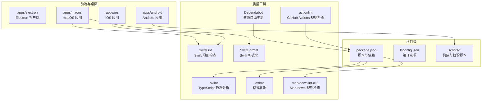
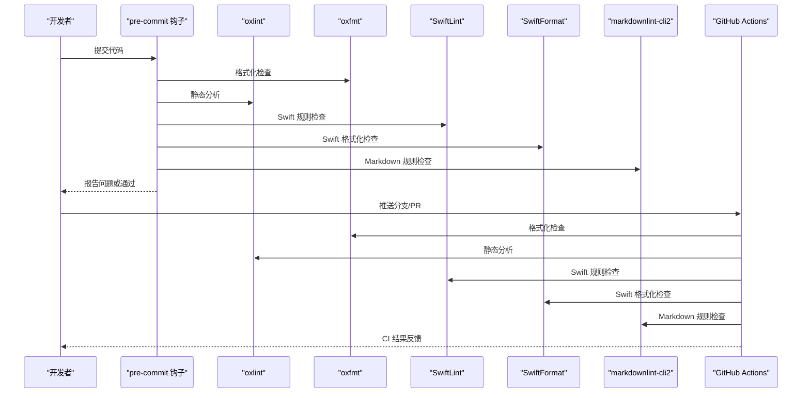
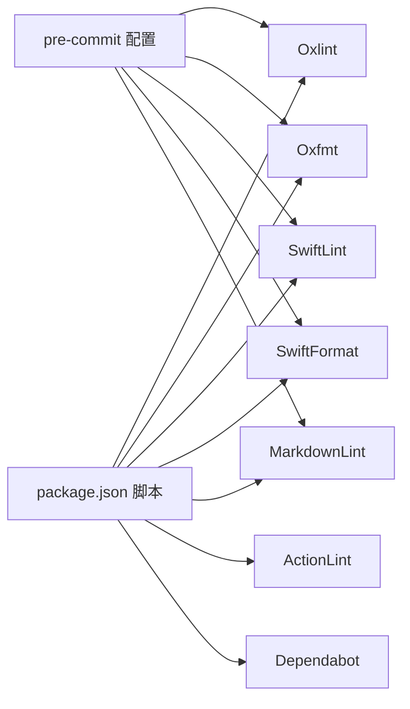

# 编码规范

<cite>
**本文引用的文件**
- [.pre-commit-config.yaml](file://.pre-commit-config.yaml)
- [.oxlintrc.json](file://.oxlintrc.json)
- [.oxfmtrc.jsonc](file://.oxfmtrc.jsonc)
- [.swiftlint.yml](file://.swiftlint.yml)
- [.swiftformat](file://.swiftformat)
- [.markdownlint-cli2.jsonc](file://.markdownlint-cli2.jsonc)
- [.github/actionlint.yaml](file://.github/actionlint.yaml)
- [.github/dependabot.yml](file://.github/dependabot.yml)
- [.github/labeler.yml](file://.github/labeler.yml)
- [.github/pull_request_template.md](file://.github/pull_request_template.md)
- [package.json](file://package.json)
- [tsconfig.json](file://tsconfig.json)
- [CONTRIBUTING.md](file://CONTRIBUTING.md)
- [README.md](file://README.md)
- [apps/android/style.md](file://apps/android/style.md)
</cite>

## 目录

1. [简介](#简介)
2. [项目结构](#项目结构)
3. [核心组件](#核心组件)
4. [架构总览](#架构总览)
5. [详细组件分析](#详细组件分析)
6. [依赖分析](#依赖分析)
7. [性能考虑](#性能考虑)
8. [故障排查指南](#故障排查指南)
9. [结论](#结论)
10. [附录](#附录)

## 简介

本文件系统性梳理本仓库的编码规范与质量保障体系，覆盖以下方面：

- 代码风格与格式化：TypeScript、Swift、Markdown 的统一风格与自动化工具链
- 静态分析与质量检查：oxlint、SwiftLint、markdownlint 等规则与执行策略
- 命名约定与注释规范：跨语言一致性与可读性要求
- Git 提交与分支管理：提交模板、标签规则与依赖更新策略
- 文档编写标准：Markdown 格式、允许的 HTML 元素与排版约束

本规范既面向核心贡献者，也兼顾新成员快速上手。

## 项目结构

本仓库采用多平台、多语言混合工程组织方式：

- 核心 TypeScript 应用位于根目录与 src、extensions、scripts 等子目录
- 客户端应用包括 macOS/iOS/Android 模块，分别有独立的构建与质量配置
- 文档与规范通过 Markdown 存放于 docs 及各子目录
- 质量保障通过脚本与配置文件集中管理，确保在本地与 CI 中一致执行

图表来源

- [package.json:1-467](file://package.json#L1-L467)
- [.swiftlint.yml:1-151](file://.swiftlint.yml#L1-L151)
- [.swiftformat:1-52](file://.swiftformat#L1-L52)
- [.markdownlint-cli2.jsonc:1-53](file://.markdownlint-cli2.jsonc#L1-L53)
- [.github/actionlint.yaml:1-24](file://.github/actionlint.yaml#L1-L24)
- [.github/dependabot.yml:1-128](file://.github/dependabot.yml#L1-L128)

章节来源

- [package.json:1-467](file://package.json#L1-L467)
- [tsconfig.json:1-29](file://tsconfig.json#L1-L29)

## 核心组件

本节聚焦各类语言与工具的规范要点与配置映射关系。

- TypeScript 编码规范与质量
  - 编译与类型严格性：启用严格模式、模块解析 NodeNext、目标 ES2023
  - 静态分析：oxlint，按类别分类错误等级，禁用若干规则以平衡性能与可用性
  - 格式化：oxfmt，支持导入排序与 package.json 字段排序，统一缩进与换行
  - 文档检查：markdownlint-cli2，限定检查范围与忽略路径，放宽部分行宽与标题规则
  - 脚本集成：通过 package.json 统一入口，实现“格式化/检查/测试”一体化

- Swift 代码风格与质量
  - 规则检查：SwiftLint，覆盖声明未使用、函数长度、参数数量、文件长度、嵌套深度、行宽等
  - 格式化：SwiftFormat，统一缩进、最大行长、空格与括号风格，并排除生成文件与第三方目录
  - 生成文件：协议与安全策略生成文件单独排除，避免误报与格式化冲突

- Markdown 格式要求
  - 仅允许白名单内的 HTML 元素，如 Note、Tip、Card、Tabs、CodeGroup、Callout 等
  - 放宽 MD013（行宽）、MD025（标题）、MD029（有序列表样式）等规则
  - 忽略 zh-CN、i18n 与模板目录，减少噪音

- Git 工作流与提交规范
  - 提交模板：提供结构化 PR 模板，强制描述问题、变更范围、影响面与验证步骤
  - 依赖更新：Dependabot 分生态自动更新，设置分组与冷却期，限制 PR 数量
  - 标签与分支：遵循语义化版本与渠道发布策略（stable/beta/dev），配合 npm dist-tags 使用

章节来源

- [package.json:217-467](file://package.json#L217-L467)
- [.oxlintrc.json:1-40](file://.oxlintrc.json#L1-L40)
- [.oxfmtrc.jsonc:1-27](file://.oxfmtrc.jsonc#L1-L27)
- [.swiftlint.yml:1-151](file://.swiftlint.yml#L1-L151)
- [.swiftformat:1-52](file://.swiftformat#L1-L52)
- [.markdownlint-cli2.jsonc:1-53](file://.markdownlint-cli2.jsonc#L1-L53)
- [.github/pull_request_template.md:1-116](file://.github/pull_request_template.md#L1-L116)
- [.github/dependabot.yml:1-128](file://.github/dependabot.yml#L1-L128)
- [README.md:83-90](file://README.md#L83-L90)

## 架构总览

下图展示本地与 CI 的质量控制流程：pre-commit 钩子在本地拦截问题；CI 复用相同规则，保证一致性。

图表来源

- [.pre-commit-config.yaml:1-158](file://.pre-commit-config.yaml#L1-L158)
- [package.json:252-284](file://package.json#L252-L284)
- [.markdownlint-cli2.jsonc:1-53](file://.markdownlint-cli2.jsonc#L1-L53)
- [.swiftlint.yml:1-151](file://.swiftlint.yml#L1-L151)
- [.swiftformat:1-52](file://.swiftformat#L1-L52)

## 详细组件分析

### TypeScript 编码规范

- 语言与编译
  - 目标：ES2023；模块：NodeNext；严格模式开启；允许导入 .ts 扩展名
  - 路径别名：为插件 SDK 提供 openclaw/plugin-sdk 系列别名
- 静态分析规则
  - 分类：correctness/error、perf/error、suspicious/error
  - 关键规则：禁止 any 类型、关闭若干循环与 map/spread 相关规则
- 格式化策略
  - 导入排序：实验性开关，关闭时按默认行为处理
  - package.json 排序：脚本字段排序
  - 缩进：2 空格；禁用制表符；忽略特定目录
- 文档检查
  - 仅检查 docs 与根 README；忽略 zh-CN、i18n 与模板
  - 白名单允许元素：Note、Tip、Card、Tabs、CodeGroup、Callout 等
- 脚本命令
  - format/lint：统一入口，支持修复与检查
  - check：聚合多项检查（含 Swift 主机策略生成、文档、链接等）

章节来源

- [tsconfig.json:1-29](file://tsconfig.json#L1-L29)
- [.oxlintrc.json:1-40](file://.oxlintrc.json#L1-L40)
- [.oxfmtrc.jsonc:1-27](file://.oxfmtrc.jsonc#L1-L27)
- [.markdownlint-cli2.jsonc:1-53](file://.markdownlint-cli2.jsonc#L1-L53)
- [package.json:252-284](file://package.json#L252-L284)

### Swift 代码风格与质量

- 规则检查（SwiftLint）
  - analyzer_rules：未使用声明与导入
  - opt_in_rules：数组初始化、闭包间距、首元素匹配等
  - disabled_rules：大量风格类规则关闭，由 SwiftFormat 负责格式化
  - 重点指标：函数体长度、参数数、文件长度、类型体长度、环复杂度、元组大小、嵌套层级、行长
- 格式化（SwiftFormat）
  - Swift 版本：6.2
  - 缩进：4 空格；最大行长 120；尾随逗号、空行与括号风格
  - 自动标记：扩展与类型 MARK 注释
  - 排除：构建产物、第三方与生成文件

章节来源

- [.swiftlint.yml:1-151](file://.swiftlint.yml#L1-L151)
- [.swiftformat:1-52](file://.swiftformat#L1-L52)

### Markdown 格式要求

- 检查范围：docs/**/\*.md、docs/**/\*.mdx、README.md
- 忽略路径：zh-CN、i18n、模板目录
- 允许元素：Note、Info、Tip、Warning、Card、CardGroup、Columns、Steps、Step、Tabs、Tab、Accordion、AccordionGroup、CodeGroup、Frame、Callout、ParamField、ResponseField、RequestExample、ResponseExample、img、a、br、details、summary、p、strong、picture、source、Tooltip、Check
- 放宽规则：MD013、MD025、MD029、MD033（允许白名单元素）、MD036、MD040、MD041、MD046

章节来源

- [.markdownlint-cli2.jsonc:1-53](file://.markdownlint-cli2.jsonc#L1-L53)

### Git 提交规范与分支命名

- 提交模板
  - 强制填写问题摘要、变更类型、作用域、关联问题、用户可见变更、安全影响、复现步骤、证据、人工验证、兼容性迁移、故障恢复、风险与缓解
- 分支命名
  - 建议采用功能/修复/文档/安全等前缀加简要描述，保持清晰与可追踪
- 标签与版本
  - 发布通道：stable（最新）、beta（预发布）、dev（主干快照）
  - npm dist-tags 对应：latest、beta、dev
- 依赖更新
  - Dependabot：按生态自动更新，设置分组（生产/开发、actions/swift/android/docker）、冷却期与 PR 上限

章节来源

- [.github/pull_request_template.md:1-116](file://.github/pull_request_template.md#L1-L116)
- [.github/dependabot.yml:1-128](file://.github/dependabot.yml#L1-L128)
- [README.md:83-90](file://README.md#L83-L90)

### Android UI 风格指南（补充）

- 设计方向：简洁、高可读性、明确主操作、渐进披露高级控件、早期验证与清晰失败
- 颜色与字体：提供设计令牌与推荐字号，避免超细字重与随机颜色
- 布局与间距：尊重安全区域、使用分隔与间距建立层次、优先垂直节奏
- 按钮与动作：主次动作区分、图标按钮尺寸与可读性、返回按钮形状
- 表单与输入：显式标签、简短帮助文案、内联错误、高级字段显式展开
- 可访问性：最小触摸目标、避免仅靠颜色表达状态、保留高对比度文本
- 架构规则：UI 状态集中在 ViewModel，Compose 参数入、回调出，副作用显式化

章节来源

- [apps/android/style.md:1-114](file://apps/android/style.md#L1-L114)

## 依赖分析

质量工具与脚本的依赖关系如下：

图表来源

- [package.json:217-467](file://package.json#L217-L467)
- [.pre-commit-config.yaml:1-158](file://.pre-commit-config.yaml#L1-L158)

章节来源

- [package.json:217-467](file://package.json#L217-L467)
- [.pre-commit-config.yaml:1-158](file://.pre-commit-config.yaml#L1-L158)

## 性能考虑

- 静态分析性能
  - oxlint 分类规则（correctness/perf/suspicious）按错误级别执行，建议在本地与 CI 中保持一致
  - SwiftLint 与 SwiftFormat 在大型工程中可能较慢，建议仅对变更文件运行或在 CI 中缓存结果
- 格式化性能
  - oxfmt 与 SwiftFormat 在大文件上耗时较长，建议结合 pre-commit 的增量检查与 CI 的并行任务
- 文档检查
  - markdownlint-cli2 仅针对必要文件集，忽略 i18n 与模板，降低开销

## 故障排查指南

- 常见问题与定位
  - TypeScript 类型错误：优先查看 oxlint 输出，结合 tsconfig 严格模式定位
  - 格式化冲突：先运行 oxfmt --write，再执行 oxlint --fix
  - Swift 规则违规：根据 SwiftLint 报错调整函数体长度、参数数量、嵌套层级或行长
  - Markdown 格式问题：核对允许元素清单与行宽规则，必要时使用 --fix
- 本地与 CI 不一致
  - 确认 pre-commit 钩子已安装且生效
  - 对比 .pre-commit-config.yaml 与 CI 中的工具版本与参数
- 依赖更新风暴
  - 通过 Dependabot 分组与冷却期控制 PR 数量，避免一次性引入过多变更

章节来源

- [.pre-commit-config.yaml:1-158](file://.pre-commit-config.yaml#L1-L158)
- [.oxlintrc.json:1-40](file://.oxlintrc.json#L1-L40)
- [.swiftlint.yml:1-151](file://.swiftlint.yml#L1-L151)
- [.markdownlint-cli2.jsonc:1-53](file://.markdownlint-cli2.jsonc#L1-L53)

## 结论

本仓库通过统一的工具链与规则配置，实现了 TypeScript、Swift、Markdown 的跨语言一致性与高质量交付。建议贡献者：

- 在本地安装 pre-commit 并使用 package.json 脚本进行格式化与检查
- 遵循 PR 模板与依赖更新策略，确保变更可控与可追溯
- 遇到规则冲突时，优先参考本规范与工具配置，必要时在团队内讨论调整

## 附录

- 命名约定与注释规范（通用）
  - 文件与目录：使用小写与连字符，避免缩写
  - 类型与接口：使用名词短语，首字母大写；避免无意义后缀
  - 函数与方法：动词短语，清晰表达意图；参数命名具体
  - 常量：全大写与下划线，仅用于稳定值
  - 注释：优先解释“为什么”而非“是什么”，复杂逻辑附带说明
- 文档编写标准
  - 使用白名单允许的 HTML 元素，避免自定义样式
  - 标题层级清晰，段落简洁，列表项对齐
  - 图片与链接指向稳定资源，必要时添加替代文本
