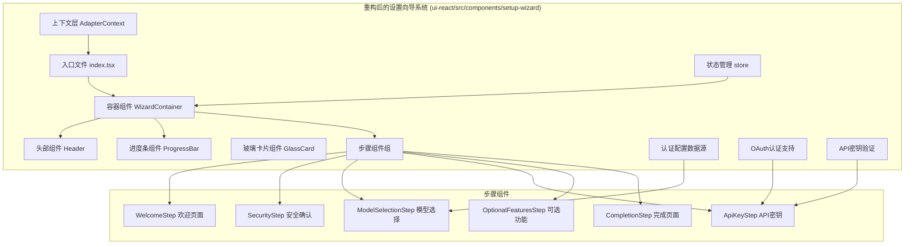
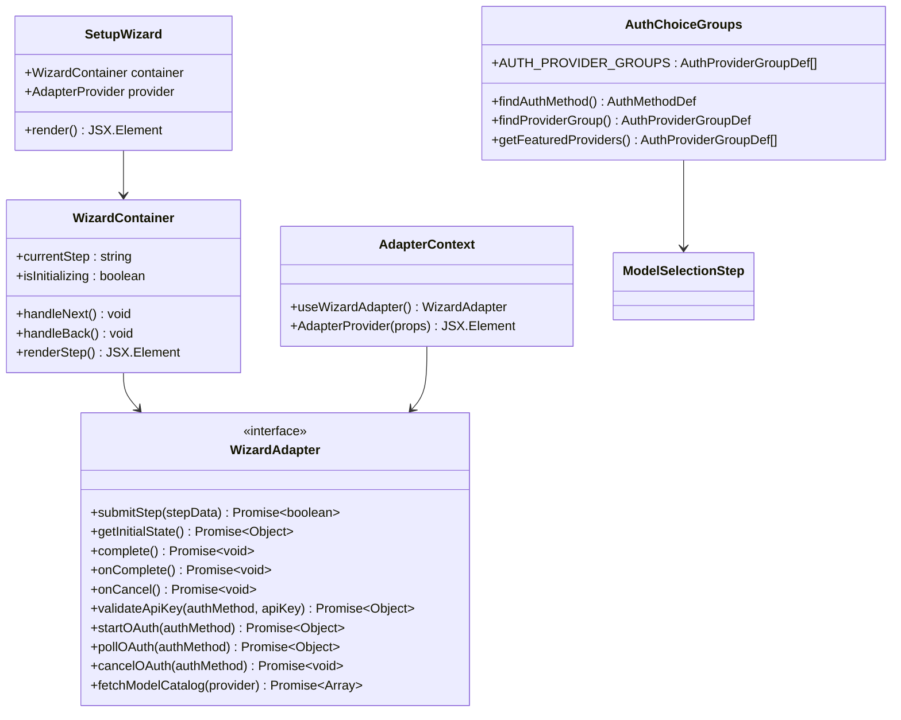
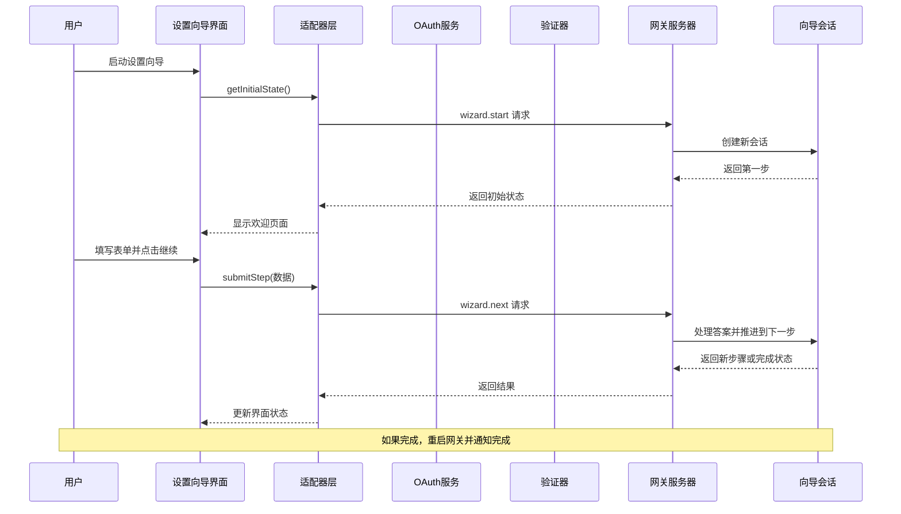
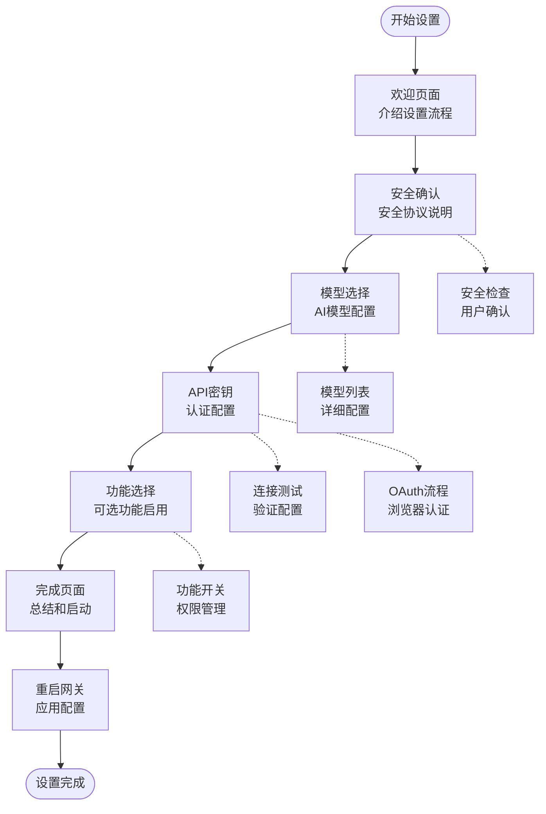
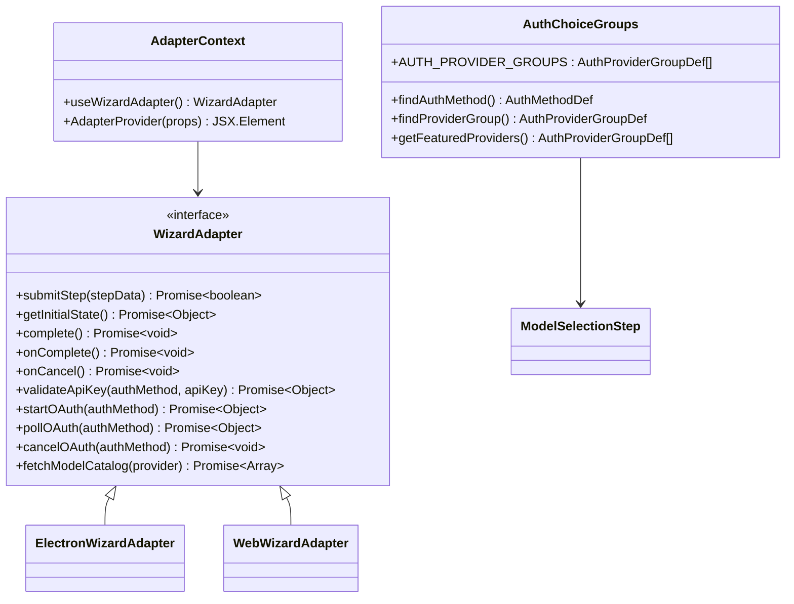
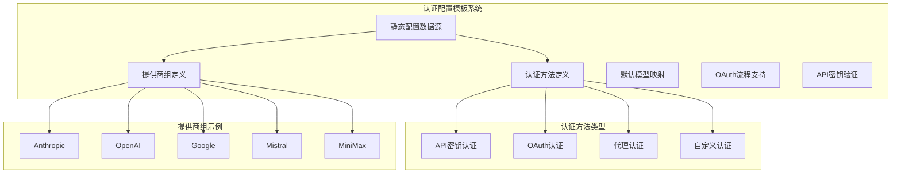
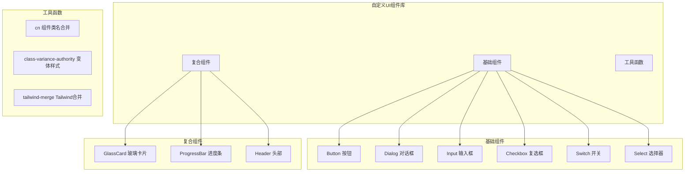
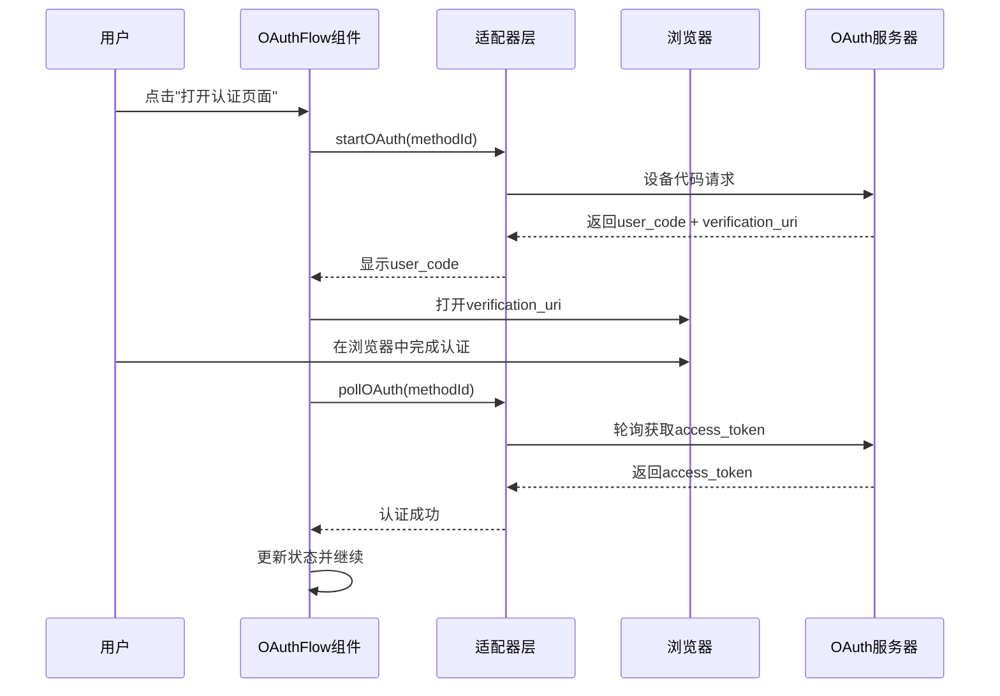
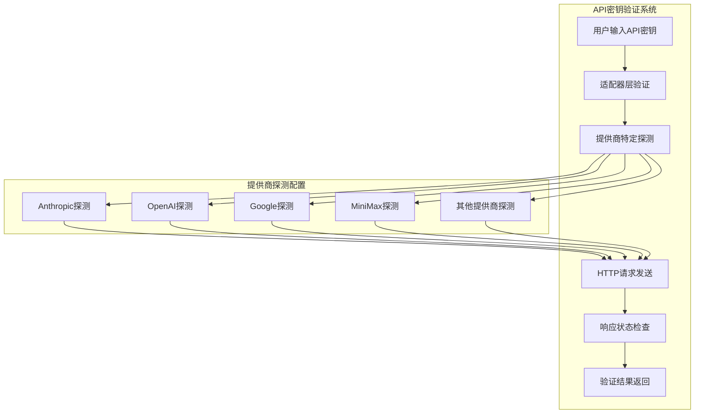
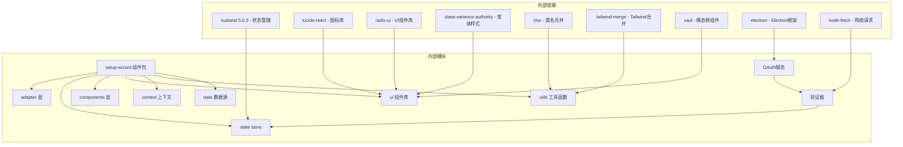

# 设置向导系统

<cite>
**本文档引用的文件**
- [ui-react/src/components/setup-wizard/index.tsx](file://ui-react/src/components/setup-wizard/index.tsx)
- [ui-react/src/components/setup-wizard/WizardContainer.tsx](file://ui-react/src/components/setup-wizard/WizardContainer.tsx)
- [ui-react/src/components/setup-wizard/Header.tsx](file://ui-react/src/components/setup-wizard/Header.tsx)
- [ui-react/src/components/setup-wizard/ProgressBar.tsx](file://ui-react/src/components/setup-wizard/ProgressBar.tsx)
- [ui-react/src/components/setup-wizard/GlassCard.tsx](file://ui-react/src/components/setup-wizard/GlassCard.tsx)
- [ui-react/src/components/setup-wizard/steps/WelcomeStep.tsx](file://ui-react/src/components/setup-wizard/steps/WelcomeStep.tsx)
- [ui-react/src/components/setup-wizard/steps/CompletionStep.tsx](file://ui-react/src/components/setup-wizard/steps/CompletionStep.tsx)
- [ui-react/src/components/setup-wizard/steps/SecurityStep.tsx](file://ui-react/src/components/setup-wizard/steps/SecurityStep.tsx)
- [ui-react/src/components/setup-wizard/steps/ModelSelectionStep.tsx](file://ui-react/src/components/setup-wizard/steps/ModelSelectionStep.tsx)
- [ui-react/src/components/setup-wizard/steps/ApiKeyStep.tsx](file://ui-react/src/components/setup-wizard/steps/ApiKeyStep.tsx)
- [ui-react/src/components/setup-wizard/steps/OptionalFeaturesStep.tsx](file://ui-react/src/components/setup-wizard/steps/OptionalFeaturesStep.tsx)
- [ui-react/src/context/AdapterContext.tsx](file://ui-react/src/context/AdapterContext.tsx)
- [ui-react/src/store/setup-wizard.store.ts](file://ui-react/src/store/setup-wizard.store.ts)
- [ui-react/src/data/auth-choice-groups.ts](file://ui-react/src/data/auth-choice-groups.ts)
- [ui-react/src/types/adapter.ts](file://ui-react/src/types/adapter.ts)
- [apps/electron/src/main/onboarding-oauth.ts](file://apps/electron/src/main/onboarding-oauth.ts)
- [apps/electron/src/main/onboarding-validate.ts](file://apps/electron/src/main/onboarding-validate.ts)
</cite>

## 更新摘要
**所做更改**
- 新增OAuth认证支持，包括设备代码流和简单URL打开流
- 实现API密钥验证功能，支持600+种AI模型提供商
- 改进向导流程，集成OAuth和API密钥验证
- 增强状态管理，支持OAuth刷新令牌和过期时间
- 优化适配器模式，新增validateApiKey、startOAuth、pollOAuth等方法

## 目录
1. [简介](#简介)
2. [项目结构](#项目结构)
3. [核心组件](#核心组件)
4. [架构概览](#架构概览)
5. [详细组件分析](#详细组件分析)
6. [OAuth认证系统](#oauth认证系统)
7. [API密钥验证系统](#api密钥验证系统)
8. [依赖关系分析](#依赖关系分析)
9. [性能考虑](#性能考虑)
10. [故障排除指南](#故障排除指南)
11. [结论](#结论)

## 简介

设置向导系统是 OpenClaw 项目中的一个关键组件，为用户提供了一个直观、用户友好的配置界面，帮助他们快速设置和配置 AI 助手的各项功能。该系统已完全重构为ui-react/src/components/setup-wizard/结构，采用现代化的 React 技术栈构建，支持多种平台（Electron 和 Web），并通过适配器模式实现了平台无关的设计。

**更新** 系统现已采用Radix UI组件库替代原有的shadcn/ui，并使用Zustand 5.0.3进行状态管理，提供了更强大和灵活的状态管理能力。同时引入了全新的provider注册系统和认证配置模板，支持超过600种AI模型提供商的认证配置。新增的OAuth认证支持和API密钥验证功能进一步增强了系统的安全性和易用性。

系统的核心目标是简化复杂的配置过程，让用户能够在几分钟内完成从模型选择到功能启用的完整设置流程。通过精心设计的步骤化界面和智能的状态管理，用户可以获得流畅且可靠的设置体验。

## 项目结构

设置向导系统现已完全重构为ui-react/src/components/setup-wizard/结构，采用模块化设计：

**图表来源**
- [ui-react/src/components/setup-wizard/index.tsx:1-31](file://ui-react/src/components/setup-wizard/index.tsx#L1-L31)
- [ui-react/src/components/setup-wizard/WizardContainer.tsx:1-119](file://ui-react/src/components/setup-wizard/WizardContainer.tsx#L1-L119)

**章节来源**
- [ui-react/src/components/setup-wizard/index.tsx:1-31](file://ui-react/src/components/setup-wizard/index.tsx#L1-L31)
- [ui-react/src/components/setup-wizard/WizardContainer.tsx:1-119](file://ui-react/src/components/setup-wizard/WizardContainer.tsx#L1-L119)

## 核心组件

设置向导系统包含以下核心组件，现已完全重构为模块化结构：

### 主要组件层次结构

**图表来源**
- [ui-react/src/components/setup-wizard/index.tsx:6-31](file://ui-react/src/components/setup-wizard/index.tsx#L6-L31)
- [ui-react/src/context/AdapterContext.tsx:19-37](file://ui-react/src/context/AdapterContext.tsx#L19-L37)
- [ui-react/src/data/auth-choice-groups.ts:40-654](file://ui-react/src/data/auth-choice-groups.ts#L40-L654)

### 状态管理系统

系统使用 Zustand 5.0.3 作为状态管理解决方案，提供持久化的状态存储和响应式更新机制：

**章节来源**
- [ui-react/src/store/setup-wizard.store.ts:1-129](file://ui-react/src/store/setup-wizard.store.ts#L1-L129)

## 架构概览

设置向导系统采用分层架构设计，确保了良好的可维护性和扩展性：

**图表来源**
- [ui-react/src/components/setup-wizard/steps/CompletionStep.tsx:26-46](file://ui-react/src/components/setup-wizard/steps/CompletionStep.tsx#L26-L46)

## 详细组件分析

### 步骤化界面设计

设置向导采用六步流程设计，每一步都有明确的目标和功能：

#### 步骤流程图

**图表来源**
- [ui-react/src/components/setup-wizard/WizardContainer.tsx:15-22](file://ui-react/src/components/setup-wizard/WizardContainer.tsx#L15-L22)

#### 欢迎页面组件

欢迎页面作为设置流程的起点，提供了清晰的流程概述和功能介绍：

**章节来源**
- [ui-react/src/components/setup-wizard/steps/WelcomeStep.tsx:1-87](file://ui-react/src/components/setup-wizard/steps/WelcomeStep.tsx#L1-L87)

#### 完成页面组件

完成页面展示了最终的配置摘要，并提供了启动聊天和查看教程的选项：

**章节来源**
- [ui-react/src/components/setup-wizard/steps/CompletionStep.tsx:1-170](file://ui-react/src/components/setup-wizard/steps/CompletionStep.tsx#L1-L170)

#### 安全确认组件

安全确认步骤强调了 OpenClaw 的安全重要性，并要求用户确认理解相关安全协议：

**章节来源**
- [ui-react/src/components/setup-wizard/steps/SecurityStep.tsx:1-106](file://ui-react/src/components/setup-wizard/steps/SecurityStep.tsx#L1-L106)

#### 模型选择组件

模型选择组件提供了多种 AI 模型供用户选择，包括推荐模型和更多选项：

**章节来源**
- [ui-react/src/components/setup-wizard/steps/ModelSelectionStep.tsx:1-398](file://ui-react/src/components/setup-wizard/steps/ModelSelectionStep.tsx#L1-L398)

#### API密钥配置组件

API密钥配置组件支持多种提供商的密钥输入，并提供了连接测试功能：

**更新** 新增了完整的OAuth认证支持和API密钥验证功能

**章节来源**
- [ui-react/src/components/setup-wizard/steps/ApiKeyStep.tsx:1-443](file://ui-react/src/components/setup-wizard/steps/ApiKeyStep.tsx#L1-L443)

#### 可选功能组件

可选功能组件允许用户根据需要启用额外的功能，如消息传递、浏览器访问和文件管理：

**章节来源**
- [ui-react/src/components/setup-wizard/steps/OptionalFeaturesStep.tsx:1-119](file://ui-react/src/components/setup-wizard/steps/OptionalFeaturesStep.tsx#L1-L119)

### 适配器模式实现

系统采用适配器模式来支持不同的平台通信方式，现已完全重构：

#### 适配器架构图

**图表来源**
- [ui-react/src/types/adapter.ts:15-102](file://ui-react/src/types/adapter.ts#L15-L102)
- [ui-react/src/context/AdapterContext.tsx:19-37](file://ui-react/src/context/AdapterContext.tsx#L19-L37)
- [ui-react/src/data/auth-choice-groups.ts:40-654](file://ui-react/src/data/auth-choice-groups.ts#L40-L654)

**章节来源**
- [ui-react/src/context/AdapterContext.tsx:1-37](file://ui-react/src/context/AdapterContext.tsx#L1-L37)
- [ui-react/src/types/adapter.ts:1-102](file://ui-react/src/types/adapter.ts#L1-L102)

### 认证配置模板系统

系统引入了全新的认证配置模板系统，支持600+种AI模型提供商：

#### 认证配置架构

**图表来源**
- [ui-react/src/data/auth-choice-groups.ts:14-38](file://ui-react/src/data/auth-choice-groups.ts#L14-L38)
- [ui-react/src/data/auth-choice-groups.ts:40-112](file://ui-react/src/data/auth-choice-groups.ts#L40-L112)

**章节来源**
- [ui-react/src/data/auth-choice-groups.ts:1-654](file://ui-react/src/data/auth-choice-groups.ts#L1-L654)

### 自定义UI组件库

系统采用自定义的Radix UI组件库实现，而非原有的shadcn/ui：

#### UI组件架构

**图表来源**
- [ui-react/src/components/setup-wizard/GlassCard.tsx:8-24](file://ui-react/src/components/setup-wizard/GlassCard.tsx#L8-L24)
- [ui-react/src/components/setup-wizard/ProgressBar.tsx:6-32](file://ui-react/src/components/setup-wizard/ProgressBar.tsx#L6-L32)

**章节来源**
- [ui-react/src/components/setup-wizard/GlassCard.tsx:1-24](file://ui-react/src/components/setup-wizard/GlassCard.tsx#L1-L24)
- [ui-react/src/components/setup-wizard/ProgressBar.tsx:1-32](file://ui-react/src/components/setup-wizard/ProgressBar.tsx#L1-L32)

### 状态管理优化

系统使用Zustand 5.0.3进行状态管理，提供了更好的性能和开发体验：

**章节来源**
- [ui-react/src/store/setup-wizard.store.ts:1-129](file://ui-react/src/store/setup-wizard.store.ts#L1-L129)

## OAuth认证系统

**新增** 系统现在支持完整的OAuth认证流程，包括设备代码流和简单URL打开流。

### OAuth认证架构

**图表来源**
- [ui-react/src/components/setup-wizard/steps/ApiKeyStep.tsx:18-222](file://ui-react/src/components/setup-wizard/steps/ApiKeyStep.tsx#L18-L222)

### OAuth流程类型

系统支持两种OAuth流程类型：

#### 设备代码流（Device Code Flow）
- **适用提供商**: MiniMax（全球版和中国版）
- **特点**: 支持PKCE（Proof Key for Code Exchange）安全机制
- **流程**: 用户在浏览器中输入user_code进行认证
- **轮询间隔**: 默认2秒轮询一次

#### 简单URL打开流
- **适用提供商**: OpenAI Codex、Google Gemini CLI、Qwen门户、GitHub Copilot等
- **特点**: 直接打开提供商的认证页面
- **流程**: 用户完成浏览器认证后，系统从auth-profiles.json读取令牌
- **超时控制**: 5分钟超时限制

**章节来源**
- [apps/electron/src/main/onboarding-oauth.ts:104-258](file://apps/electron/src/main/onboarding-oauth.ts#L104-L258)
- [apps/electron/src/main/onboarding-oauth.ts:262-291](file://apps/electron/src/main/onboarding-oauth.ts#L262-L291)
- [apps/electron/src/main/onboarding-oauth.ts:293-334](file://apps/electron/src/main/onboarding-oauth.ts#L293-L334)

### OAuth状态管理

OAuth认证过程中，系统使用Zustand状态管理来跟踪认证状态：

#### OAuth阶段状态
- `idle`: 空闲状态，等待用户操作
- `opening`: 正在打开浏览器
- `polling`: 轮询认证状态
- `success`: 认证成功
- `error`: 认证失败

#### OAuth会话管理
- **活跃会话**: 使用Map存储当前活跃的OAuth会话
- **会话清理**: 自动清理超时的会话
- **状态持久化**: 会话状态在应用重启后自动清理

**章节来源**
- [ui-react/src/components/setup-wizard/steps/ApiKeyStep.tsx:16-41](file://ui-react/src/components/setup-wizard/steps/ApiKeyStep.tsx#L16-L41)
- [apps/electron/src/main/onboarding-oauth.ts:73-73](file://apps/electron/src/main/onboarding-oauth.ts#L73-L73)

## API密钥验证系统

**新增** 系统现在支持对600+种AI模型提供商的API密钥进行实时验证。

### API密钥验证架构

**图表来源**
- [apps/electron/src/main/onboarding-validate.ts:146-213](file://apps/electron/src/main/onboarding-validate.ts#L146-L213)

### 验证流程

API密钥验证采用最小化HTTP请求策略，确保验证过程既准确又高效：

#### 验证步骤
1. **输入格式检查**: 确保API密钥非空且去除空白字符
2. **提供商映射**: 将authMethod映射到对应的提供商标识
3. **探测配置**: 获取提供商特定的HTTP探测配置
4. **HTTP请求**: 发送最小化的探测请求
5. **状态码分析**: 根据HTTP状态码判断密钥有效性
6. **结果反馈**: 返回验证结果给UI层

#### 探测配置策略

| 提供商 | 探测URL | HTTP方法 | 关键头 | 状态码含义 |
|--------|---------|----------|--------|------------|
| Anthropic | `/v1/messages` | POST | `x-api-key` | 200/400有效, 401/403无效 |
| OpenAI | `/models` | GET | `Authorization: Bearer` | 200有效, 401/403无效 |
| Google | `/v1beta/models` | GET | `X-goog-api-key` | 200有效, 400/401/403无效 |
| MiniMax | `/v1/messages` | POST | `x-api-key` | 200/400有效, 401/403无效 |

**章节来源**
- [apps/electron/src/main/onboarding-validate.ts:146-213](file://apps/electron/src/main/onboarding-validate.ts#L146-L213)
- [apps/electron/src/main/onboarding-validate.ts:103-142](file://apps/electron/src/main/onboarding-validate.ts#L103-L142)

### 验证超时和错误处理

系统实现了完善的超时控制和错误处理机制：

#### 超时控制
- **探测超时**: 10秒超时限制
- **网络超时**: 防止长时间阻塞UI
- **会话超时**: OAuth会话5分钟超时

#### 错误分类
- **网络错误**: 网络连接问题
- **认证失败**: 401/403状态码
- **超时错误**: 探测超时
- **未知错误**: 其他异常情况

**章节来源**
- [apps/electron/src/main/onboarding-validate.ts:170-213](file://apps/electron/src/main/onboarding-validate.ts#L170-L213)

## 依赖关系分析

设置向导系统的依赖关系体现了清晰的关注点分离和模块化设计：

**图表来源**
- [ui-react/src/store/setup-wizard.store.ts:1-3](file://ui-react/src/store/setup-wizard.store.ts#L1-L3)
- [ui-react/src/components/setup-wizard/index.tsx:1-31](file://ui-react/src/components/setup-wizard/index.tsx#L1-L31)

### 核心依赖特性

1. **状态管理**: 使用 Zustand 5.0.3 实现轻量级但功能强大的状态管理
2. **UI组件**: 基于 Radix UI 构建的自定义组件库
3. **适配器模式**: 支持多平台通信的灵活架构
4. **类型安全**: 完整的 TypeScript 类型定义确保开发安全性
5. **认证配置**: 静态认证配置数据源支持600+提供商
6. **持久化存储**: Zustand middleware提供本地存储功能
7. **OAuth支持**: Electron平台原生OAuth支持
8. **API验证**: 轻量级API密钥验证服务

**章节来源**
- [ui-react/src/store/setup-wizard.store.ts:95-129](file://ui-react/src/store/setup-wizard.store.ts#L95-L129)

## 性能考虑

设置向导系统在设计时充分考虑了性能优化：

### 状态管理优化
- 使用持久化存储避免重复配置
- 响应式更新减少不必要的重渲染
- 智能缓存策略提升用户体验

### 组件优化
- 自定义UI组件库减少包体积
- Radix UI提供高性能的无障碍组件
- 按需导入避免不必要的代码加载

### 网络通信优化
- 适配器模式减少网络请求次数
- OAuth轮询间隔优化为2秒
- API密钥验证采用最小化请求
- 超时控制防止界面卡顿

### 用户体验优化
- 渐进式加载避免首屏延迟
- 平滑的过渡动画提升交互质量
- 错误恢复机制增强可靠性
- OAuth流程支持手动继续

## 故障排除指南

### 常见问题及解决方案

#### 初始化失败
**症状**: 设置向导无法启动或显示初始化错误
**可能原因**:
- 适配器未正确配置
- 网关服务不可用
- 网络连接问题

**解决步骤**:
1. 检查适配器配置是否正确
2. 验证网关服务状态
3. 确认网络连接稳定
4. 查看浏览器控制台错误信息

#### OAuth认证失败
**症状**: OAuth认证流程中断或超时
**可能原因**:
- 浏览器无法打开认证页面
- 网络连接不稳定
- OAuth会话超时
- 提供商API限制

**解决步骤**:
1. 检查系统浏览器设置
2. 验证网络连接状态
3. 重新启动认证流程
4. 查看OAuth服务日志
5. 检查提供商API状态

#### API密钥验证失败
**症状**: API密钥验证总是失败或超时
**可能原因**:
- 密钥格式不正确
- 网络连接问题
- 提供商API限制
- 探测配置不匹配

**解决步骤**:
1. 检查密钥格式和长度
2. 验证网络连接状态
3. 确认提供商API可用性
4. 查看验证器日志
5. 尝试其他提供商

#### 提交步骤失败
**症状**: 点击"继续"按钮无响应或出现错误
**可能原因**:
- API请求超时
- 服务器端验证失败
- 状态同步问题

**解决步骤**:
1. 检查网络连接状态
2. 验证输入数据格式
3. 查看服务器日志
4. 重新加载页面重试

#### 适配器集成问题
**症状**: 适配器无法正常工作
**可能原因**:
- Electron IPC 桥接问题
- Web API 端点配置错误
- 权限不足

**解决步骤**:
1. 验证适配器配置参数
2. 检查跨域设置
3. 确认权限配置
4. 查看适配器日志

#### 状态管理问题
**症状**: 状态不更新或重置
**可能原因**:
- Zustand store 配置错误
- 持久化存储问题
- 状态更新函数错误

**解决步骤**:
1. 检查 store 配置和初始化
2. 验证持久化存储设置
3. 确认状态更新函数正确性
4. 查看控制台错误信息

#### 认证配置问题
**症状**: 认证提供商无法找到或配置错误
**可能原因**:
- 认证配置数据源过期
- 提供商ID不匹配
- 方法ID配置错误

**解决步骤**:
1. 检查认证配置数据源完整性
2. 验证提供商ID和方法ID
3. 确认默认模型映射正确
4. 查看控制台认证错误信息

**章节来源**
- [ui-react/src/components/setup-wizard/WizardContainer.tsx:24-73](file://ui-react/src/components/setup-wizard/WizardContainer.tsx#L24-L73)
- [ui-react/src/context/AdapterContext.tsx:21-26](file://ui-react/src/context/AdapterContext.tsx#L21-L26)

## 结论

设置向导系统展现了现代前端开发的最佳实践，通过精心设计的架构和组件化结构，为用户提供了流畅、可靠的配置体验。系统的主要优势包括：

### 核心优势
1. **模块化设计**: 重构后的ui-react/src/components/setup-wizard/结构提供了更好的组织性
2. **平台无关性**: 通过适配器模式支持多种部署环境
3. **认证配置丰富**: 支持600+种AI模型提供商的认证配置
4. **用户体验**: 步骤化的界面设计降低了学习成本
5. **技术先进性**: 采用最新的 React 和 TypeScript 技术栈
6. **性能优化**: 自定义UI组件库和Zustand状态管理提供最佳性能
7. **安全增强**: OAuth认证和API密钥验证双重安全保障
8. **扩展性强**: 模块化架构支持未来功能扩展

### 技术亮点
- **状态管理**: 基于 Zustand 5.0.3 的轻量级解决方案
- **类型安全**: 完整的 TypeScript 支持
- **UI一致性**: 基于 Radix UI 的统一设计语言
- **认证系统**: 静态配置数据源支持丰富的提供商
- **OAuth支持**: 原生Electron OAuth支持
- **API验证**: 轻量级验证服务确保密钥有效性
- **错误处理**: 健壮的错误处理和恢复机制
- **持久化存储**: 智能状态管理确保用户体验

### 发展前景
设置向导系统为 OpenClaw 项目奠定了坚实的基础，其模块化和可扩展的架构设计使其能够适应未来的需求变化和技术演进。通过持续的优化和改进，该系统将继续为用户提供卓越的配置体验。

**更新** 重构后的ui-react/src/components/setup-wizard/结构为未来的功能扩展和维护提供了更好的基础，Radix UI组件库的选择确保了组件的高性能和可访问性，而Zustand 5.0.3的状态管理则提供了更强大的状态处理能力。全新的OAuth认证支持和API密钥验证系统进一步增强了系统的安全性、易用性和可扩展性，为用户提供了更丰富的AI模型选择和配置选项。这些改进使得设置向导系统能够更好地服务于OpenClaw生态系统的各种应用场景。