# 设置向导系统

<cite>
**本文档引用的文件**
- [ui-react/src/components/setup-wizard/index.tsx](file://ui-react/src/components/setup-wizard/index.tsx)
- [ui-react/src/components/setup-wizard/WizardContainer.tsx](file://ui-react/src/components/setup-wizard/WizardContainer.tsx)
- [ui-react/src/components/setup-wizard/Header.tsx](file://ui-react/src/components/setup-wizard/Header.tsx)
- [ui-react/src/components/setup-wizard/ProgressBar.tsx](file://ui-react/src/components/setup-wizard/ProgressBar.tsx)
- [ui-react/src/components/setup-wizard/GlassCard.tsx](file://ui-react/src/components/setup-wizard/GlassCard.tsx)
- [ui-react/src/components/setup-wizard/steps/welcome/index.tsx](file://ui-react/src/components/setup-wizard/steps/welcome/index.tsx)
- [ui-react/src/components/setup-wizard/steps/welcome/orb.tsx](file://ui-react/src/components/setup-wizard/steps/welcome/orb.tsx)
- [ui-react/src/components/setup-wizard/steps/welcome/orb.css](file://ui-react/src/components/setup-wizard/steps/welcome/orb.css)
- [ui-react/src/components/setup-wizard/steps/AccessStep.tsx](file://ui-react/src/components/setup-wizard/steps/AccessStep.tsx)
- [ui-react/src/components/setup-wizard/steps/CompletionStep.tsx](file://ui-react/src/components/setup-wizard/steps/CompletionStep.tsx)
- [ui-react/src/components/setup-wizard/steps/SecurityStep.tsx](file://ui-react/src/components/setup-wizard/steps/SecurityStep.tsx)
- [ui-react/src/components/setup-wizard/steps/model-selection/ModelSelectionStep.tsx](file://ui-react/src/components/setup-wizard/steps/model-selection/ModelSelectionStep.tsx)
- [ui-react/src/components/setup-wizard/steps/api-key-step/ApiKeyStep.tsx](file://ui-react/src/components/setup-wizard/steps/api-key-step/ApiKeyStep.tsx)
- [ui-react/src/components/setup-wizard/steps/OptionalFeaturesStep.tsx](file://ui-react/src/components/setup-wizard/steps/OptionalFeaturesStep.tsx)
- [ui-react/src/context/AdapterContext.tsx](file://ui-react/src/context/AdapterContext.tsx)
- [ui-react/src/store/setup-wizard.store.ts](file://ui-react/src/store/setup-wizard.store.ts)
- [ui-react/src/data/auth-choice-groups.ts](file://ui-react/src/data/auth-choice-groups.ts)
- [ui-react/src/types/adapter.ts](file://ui-react/src/types/adapter.ts)
- [apps/electron/src/main/onboarding-oauth.ts](file://apps/electron/src/main/onboarding-oauth.ts)
- [apps/electron/src/main/onboarding-validate.ts](file://apps/electron/src/main/onboarding-validate.ts)
- [apps/electron/src/main/ipc-wizard.ts](file://apps/electron/src/main/ipc-wizard.ts)
- [apps/electron/src/main/onboarding.ts](file://apps/electron/src/main/onboarding.ts)
- [ui-react/src/adapters/ElectronWizardAdapter.ts](file://ui-react/src/adapters/ElectronWizardAdapter.ts)
- [ui-react/src/adapters/WebWizardAdapter.ts](file://ui-react/src/adapters/WebWizardAdapter.ts)
- [ui-react/src/setup-mock.tsx](file://ui-react/src/setup-mock.tsx)
- [docs/zh-CN/brave-search.md](file://docs/zh-CN/brave-search.md)
- [docs/brave-search.md](file://docs/brave-search.md)
- [skills/amap-lbs-skill/SKILL.md](file://skills/amap-lbs-skill/SKILL.md)
- [skills/amap-lbs-skill/config.example.json](file://skills/amap-lbs-skill/config.example.json)
- [skills/amap-lbs-skill/index.js](file://skills/amap-lbs-skill/index.js)
</cite>

## 更新摘要
**所做更改**
- **新增Brave Search API密钥自动配置**：邀请码验证现在支持返回braveApiKey字段，设置向导可以自动配置Brave Search搜索引擎
- **新增Amap API密钥自动配置**：邀请码验证现在支持返回amapApiKey字段，设置向导可以自动配置高德地图技能
- **更新邀请码验证流程**：validateInviteCode方法现在返回braveApiKey和amapApiKey字段
- **更新状态管理**：WizardState接口新增braveApiKey和amapApiKey字段
- **更新配置构建**：onboarding.ts现在支持自动构建Brave Search和Amap技能配置
- **增强外部服务集成**：设置向导支持自动集成多个外部API服务

## 目录
1. [简介](#简介)
2. [项目结构](#项目结构)
3. [核心组件](#核心组件)
4. [架构概览](#架构概览)
5. [详细组件分析](#详细组件分析)
6. [WebGL Orb动画系统](#webgl-orb动画系统)
7. [GSAP动画系统](#gsap动画系统)
8. [邀请码系统集成](#邀请码系统集成)
9. [OAuth认证系统](#oauth认证系统)
10. [API密钥验证系统](#api密钥验证系统)
11. [外部服务自动配置](#外部服务自动配置)
12. [IPC通信机制](#ipc通信机制)
13. [依赖关系分析](#依赖关系分析)
14. [性能考虑](#性能考虑)
15. [故障排除指南](#故障排除指南)
16. [结论](#结论)

## 简介

设置向导系统是 OpenClaw 项目中的关键组件，为用户提供了一个直观、用户友好的配置界面，帮助他们快速设置和配置 AI 助手的各项功能。该系统已完全重构为版本2，采用现代化的 React 技术栈构建，支持多种平台（Electron 和 Web），并通过适配器模式实现了平台无关的设计。

**更新** 系统现已集成全新的外部服务自动配置功能，支持Brave Search和Amap API密钥的自动配置。邀请码验证现在可以返回braveApiKey和amapApiKey字段，设置向导可以在配置过程中自动集成这些外部服务的API密钥。这一功能大大简化了用户的配置流程，用户只需输入邀请码即可自动获得所需的搜索引擎和地图服务配置。

系统的核心目标是简化复杂的配置过程，让用户能够在几分钟内完成从模型选择到功能启用的完整设置流程。通过精心设计的步骤化界面、智能的状态管理和双路径配置流程，用户可以获得流畅且可靠的设置体验。

## 项目结构

设置向导系统现已完全重构为版本2结构，采用模块化设计，新增WebGL Orb动画和GSAP动画系统以及外部服务自动配置功能：

```mermaid
graph TB
subgraph "重构后的设置向导系统 (ui-react/src/components/setup-wizard)"
A[入口文件 index.tsx]
B[容器组件 WizardContainer]
C[头部组件 Header]
D[进度条组件 ProgressBar]
E[玻璃卡片组件 GlassCard]
F[步骤组件组]
G[上下文层 AdapterContext]
H[状态管理 store v2]
I[认证配置数据源]
J[OAuth认证支持]
K[API密钥验证]
L[邀请码系统]
M[WebGL Orb动画]
N[GSAP动画系统]
O[外部服务自动配置]
end
subgraph "步骤组件"
F1[WelcomeStep 欢迎页面]
F2[SecurityStep 安全确认]
F3[AccessStep 邀请码/手动选择]
F4[ModelSelectionStep 模型选择]
F5[ApiKeyStep API密钥]
F6[OptionalFeaturesStep 可选功能]
F7[CompletionStep 完成页面]
end
subgraph "WebGL Orb动画系统"
M1[Orb组件 WebGL渲染]
M2[Canvas Orb动画]
M3[Vignette叠加效果]
M4[鼠标交互响应]
end
subgraph "GSAP动画系统"
N1[Timeline动画]
N2[渐变过渡效果]
N3[元素入场动画]
N4[鼠标悬停效果]
end
subgraph "邀请码系统"
L1[AccessStep 邀请码验证]
L2[validateInviteCode 适配器方法]
L3[IPC通信 Electron桥接]
L4[状态管理 usedInviteCode]
end
subgraph "外部服务自动配置"
O1[Brave Search集成]
O2[Amap API集成]
O3[配置构建器]
O4[服务检测器]
end
A --> B
B --> C
B --> D
B --> F
G --> A
H --> B
I --> F4
J --> F5
K --> F5
L --> F3
M --> F1
N --> F1
L1 --> L2
L2 --> L3
L3 --> L4
F --> F1
F --> F2
F --> F3
F --> F4
F --> F5
F --> F6
F --> F7
M1 --> M2
M2 --> M3
M3 --> M4
N1 --> N2
N2 --> N3
N3 --> N4
O1 --> O3
O2 --> O3
O3 --> O4
```

**图表来源**
- [ui-react/src/components/setup-wizard/index.tsx:1-31](file://ui-react/src/components/setup-wizard/index.tsx#L1-L31)
- [ui-react/src/components/setup-wizard/WizardContainer.tsx:1-112](file://ui-react/src/components/setup-wizard/WizardContainer.tsx#L1-L112)
- [ui-react/src/components/setup-wizard/steps/welcome/index.tsx:1-211](file://ui-react/src/components/setup-wizard/steps/welcome/index.tsx#L1-L211)
- [ui-react/src/components/setup-wizard/steps/welcome/orb.tsx:1-342](file://ui-react/src/components/setup-wizard/steps/welcome/orb.tsx#L1-L342)

**章节来源**
- [ui-react/src/components/setup-wizard/index.tsx:1-31](file://ui-react/src/components/setup-wizard/index.tsx#L1-L31)
- [ui-react/src/components/setup-wizard/WizardContainer.tsx:1-112](file://ui-react/src/components/setup-wizard/WizardContainer.tsx#L1-L112)

## 核心组件

设置向导系统包含以下核心组件，现已完全重构为模块化结构，新增WebGL Orb动画、GSAP动画系统以及外部服务自动配置功能：

### 主要组件层次结构

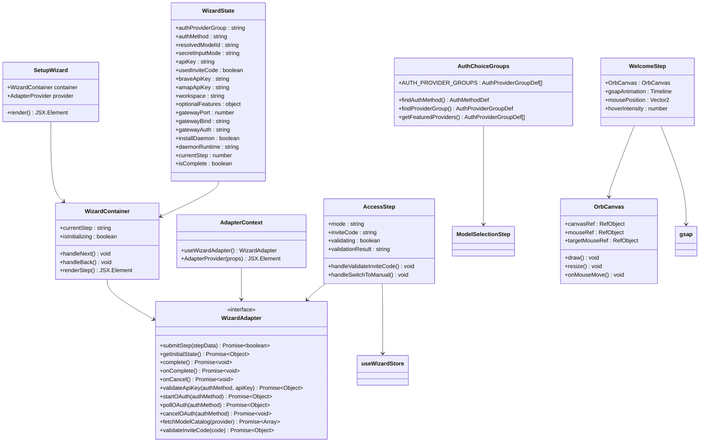

**图表来源**
- [ui-react/src/components/setup-wizard/index.tsx:6-31](file://ui-react/src/components/setup-wizard/index.tsx#L6-L31)
- [ui-react/src/context/AdapterContext.tsx:19-37](file://ui-react/src/context/AdapterContext.tsx#L19-L37)
- [ui-react/src/data/auth-choice-groups.ts:40-654](file://ui-react/src/data/auth-choice-groups.ts#L40-L654)
- [ui-react/src/components/setup-wizard/steps/AccessStep.tsx:15-76](file://ui-react/src/components/setup-wizard/steps/AccessStep.tsx#L15-L76)
- [ui-react/src/components/setup-wizard/steps/welcome/index.tsx:16-51](file://ui-react/src/components/setup-wizard/steps/welcome/index.tsx#L16-L51)
- [ui-react/src/components/setup-wizard/steps/welcome/orb.tsx:41-176](file://ui-react/src/components/setup-wizard/steps/welcome/orb.tsx#L41-L176)
- [ui-react/src/store/setup-wizard.store.ts:45-152](file://ui-react/src/store/setup-wizard.store.ts#L45-L152)

### 状态管理系统

系统使用 Zustand 5.0.3 作为状态管理解决方案，提供持久化的状态存储和响应式更新机制：

**更新** 版本2移除了废弃的selectedModel字段，优化了状态结构，新增usedInviteCode、braveApiKey和amapApiKey字段用于追踪配置路径和外部服务密钥

**章节来源**
- [ui-react/src/store/setup-wizard.store.ts:1-152](file://ui-react/src/store/setup-wizard.store.ts#L1-L152)

## 架构概览

设置向导系统采用分层架构设计，确保了良好的可维护性和扩展性，新增WebGL Orb动画、GSAP动画系统以及外部服务自动配置支持双路径配置：

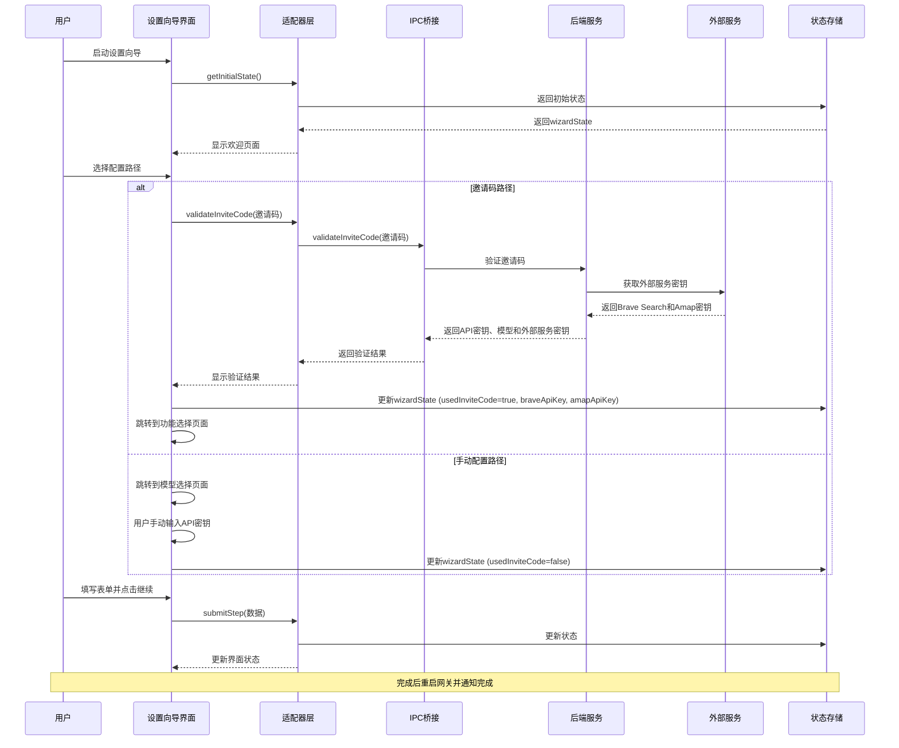

**图表来源**
- [ui-react/src/components/setup-wizard/steps/AccessStep.tsx:24-68](file://ui-react/src/components/setup-wizard/steps/AccessStep.tsx#L24-L68)
- [ui-react/src/components/setup-wizard/WizardContainer.tsx:61-70](file://ui-react/src/components/setup-wizard/WizardContainer.tsx#L61-L70)

## 详细组件分析

### 步骤化界面设计

设置向导采用七步流程设计，其中新增AccessStep作为配置路径选择的关键节点：

#### 步骤流程图

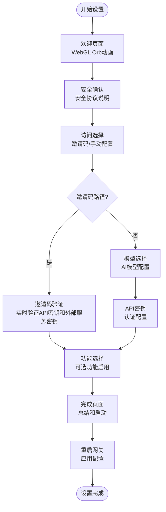

**图表来源**
- [ui-react/src/components/setup-wizard/WizardContainer.tsx:14-22](file://ui-react/src/components/setup-wizard/WizardContainer.tsx#L14-L22)

#### 欢迎页面组件

欢迎页面作为设置流程的起点，提供了清晰的流程概述和功能介绍。**更新** 欢迎页面现已完全重写，采用模块化结构，包含WebGL Orb动画和GSAP动画系统：

**章节来源**
- [ui-react/src/components/setup-wizard/steps/welcome/index.tsx:1-211](file://ui-react/src/components/setup-wizard/steps/welcome/index.tsx#L1-L211)

#### 完成页面组件

完成页面展示了最终的配置摘要，并提供了启动聊天和查看教程的选项：

**章节来源**
- [ui-react/src/components/setup-wizard/steps/CompletionStep.tsx:1-257](file://ui-react/src/components/setup-wizard/steps/CompletionStep.tsx#L1-L257)

#### 安全确认组件

安全确认步骤强调了 OpenClaw 的安全重要性，并要求用户确认理解相关安全协议：

**章节来源**
- [ui-react/src/components/setup-wizard/steps/SecurityStep.tsx:1-115](file://ui-react/src/components/setup-wizard/steps/SecurityStep.tsx#L1-L115)

#### 访问选择组件

**新增** 访问选择组件是邀请码系统的核心，提供两种配置路径选择：

##### 邀请码路径
- **特点**: 快速配置，自动验证并填充API密钥和外部服务密钥
- **流程**: 用户输入邀请码 → 实时验证 → 自动跳转到功能选择
- **优势**: 无需手动查找API密钥，适合快速体验
- **外部服务**: 自动配置Brave Search和Amap API密钥

##### 手动配置路径
- **特点**: 完全控制，支持所有AI提供商
- **流程**: 模型选择 → API密钥输入 → 连接测试 → 功能选择
- **优势**: 支持更多提供商和自定义配置

**章节来源**
- [ui-react/src/components/setup-wizard/steps/AccessStep.tsx:1-221](file://ui-react/src/components/setup-wizard/steps/AccessStep.tsx#L1-L221)

#### 模型选择组件

模型选择组件提供了多种 AI 模型供用户选择，包括推荐模型和更多选项：

**章节来源**
- [ui-react/src/components/setup-wizard/steps/model-selection/ModelSelectionStep.tsx:1-200](file://ui-react/src/components/setup-wizard/steps/model-selection/ModelSelectionStep.tsx#L1-L200)

#### API密钥配置组件

API密钥配置组件支持多种提供商的密钥输入，并提供了连接测试功能：

**更新** 新增了完整的OAuth认证支持和API密钥验证功能

**章节来源**
- [ui-react/src/components/setup-wizard/steps/api-key-step/ApiKeyStep.tsx:1-200](file://ui-react/src/components/setup-wizard/steps/api-key-step/ApiKeyStep.tsx#L1-L200)

#### 可选功能组件

可选功能组件允许用户根据需要启用额外的功能，如消息传递、浏览器访问和文件管理：

**章节来源**
- [ui-react/src/components/setup-wizard/steps/OptionalFeaturesStep.tsx:1-109](file://ui-react/src/components/setup-wizard/steps/OptionalFeaturesStep.tsx#L1-L109)

### 适配器模式实现

系统采用适配器模式来支持不同的平台通信方式，现已完全重构，新增邀请码验证支持：

#### 适配器架构图

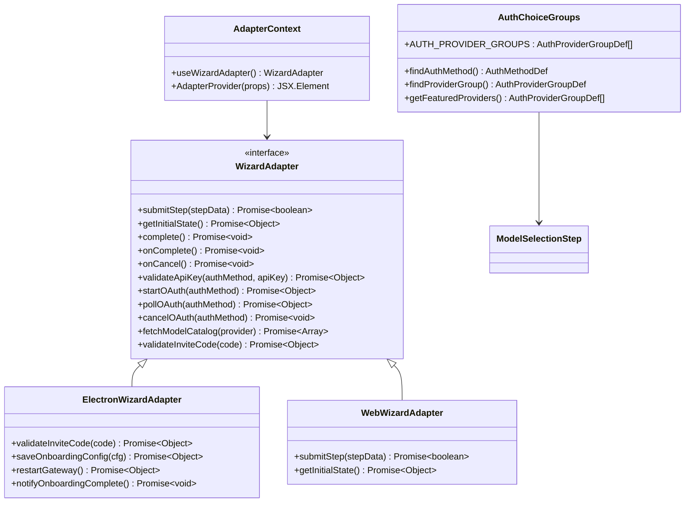

**图表来源**
- [ui-react/src/types/adapter.ts:15-109](file://ui-react/src/types/adapter.ts#L15-L109)
- [ui-react/src/context/AdapterContext.tsx:19-37](file://ui-react/src/context/AdapterContext.tsx#L19-L37)
- [ui-react/src/data/auth-choice-groups.ts:40-654](file://ui-react/src/data/auth-choice-groups.ts#L40-L654)
- [ui-react/src/adapters/ElectronWizardAdapter.ts:27-167](file://ui-react/src/adapters/ElectronWizardAdapter.ts#L27-L167)

**章节来源**
- [ui-react/src/context/AdapterContext.tsx:1-37](file://ui-react/src/context/AdapterContext.tsx#L1-L37)
- [ui-react/src/types/adapter.ts:1-109](file://ui-react/src/types/adapter.ts#L1-L109)

### 认证配置模板系统

系统引入了全新的认证配置模板系统，支持600+种AI模型提供商：

#### 认证配置架构

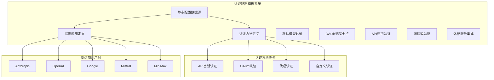

**图表来源**
- [ui-react/src/data/auth-choice-groups.ts:14-38](file://ui-react/src/data/auth-choice-groups.ts#L14-L38)
- [ui-react/src/data/auth-choice-groups.ts:40-112](file://ui-react/src/data/auth-choice-groups.ts#L40-L112)

**章节来源**
- [ui-react/src/data/auth-choice-groups.ts:1-654](file://ui-react/src/data/auth-choice-groups.ts#L1-L654)

### 自定义UI组件库

系统采用自定义的Radix UI组件库实现，而非原有的shadcn/ui：

#### UI组件架构

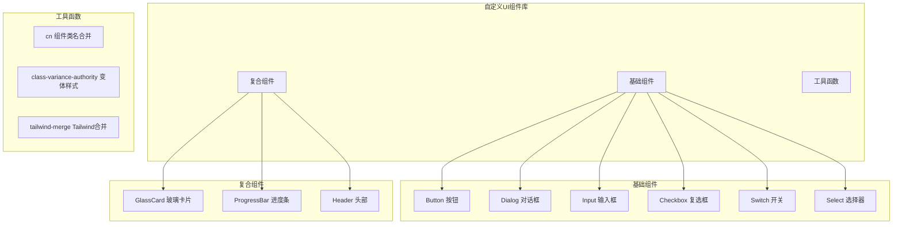

**图表来源**
- [ui-react/src/components/setup-wizard/GlassCard.tsx:8-24](file://ui-react/src/components/setup-wizard/GlassCard.tsx#L8-L24)
- [ui-react/src/components/setup-wizard/ProgressBar.tsx:6-32](file://ui-react/src/components/setup-wizard/ProgressBar.tsx#L6-L32)

**章节来源**
- [ui-react/src/components/setup-wizard/GlassCard.tsx:1-24](file://ui-react/src/components/setup-wizard/GlassCard.tsx#L1-L24)
- [ui-react/src/components/setup-wizard/ProgressBar.tsx:1-32](file://ui-react/src/components/setup-wizard/ProgressBar.tsx#L1-L32)

### 状态管理优化

系统使用Zustand 5.0.3进行状态管理，提供了更好的性能和开发体验：

**更新** 版本2重构了状态结构，移除了废弃字段并优化了迁移机制，新增usedInviteCode、braveApiKey和amapApiKey字段追踪配置路径和外部服务密钥

**章节来源**
- [ui-react/src/store/setup-wizard.store.ts:1-152](file://ui-react/src/store/setup-wizard.store.ts#L1-L152)

## WebGL Orb动画系统

**新增** 系统现在集成了完整的WebGL Orb动画系统，提供沉浸式的视觉体验。

### WebGL Orb动画架构

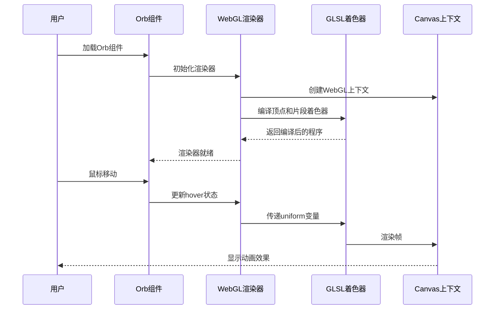

**图表来源**
- [ui-react/src/components/setup-wizard/steps/welcome/orb.tsx:186-289](file://ui-react/src/components/setup-wizard/steps/welcome/orb.tsx#L186-L289)

### Orb组件实现

Orb组件使用ogl库实现WebGL渲染，包含以下核心功能：

#### 渲染器初始化
- **WebGL上下文**: 创建透明背景的WebGL渲染器
- **设备像素比**: 自动适配高分辨率屏幕
- **事件监听**: 监听窗口大小变化和鼠标移动

#### 着色器系统
- **顶点着色器**: 处理顶点位置和UV坐标
- **片段着色器**: 实现复杂的噪声和光照效果
- **uniform变量**: 支持时间、颜色、悬停强度等动态参数

#### 动画循环
- **requestAnimationFrame**: 实现高效的动画循环
- **鼠标交互**: 根据鼠标位置调整Orb的形状
- **旋转效果**: 在悬停时自动旋转

**章节来源**
- [ui-react/src/components/setup-wizard/steps/welcome/orb.tsx:1-342](file://ui-react/src/components/setup-wizard/steps/welcome/orb.tsx#L1-L342)

### Canvas Orb动画系统

**更新** 欢迎页面现在包含Canvas Orb动画系统，提供更加流畅的动画效果：

#### Canvas Orb实现
- **Canvas上下文**: 使用2D渲染上下文绘制Orb
- **鼠标跟踪**: 实时跟踪鼠标位置和移动
- **平滑插值**: 使用lerp算法实现平滑的动画效果
- **多重渐变**: 创建复杂的径向渐变效果

#### 动画效果
- **环境光晕**: 外层的柔和发光效果
- **扰动形状**: 使用Simplex噪声创建有机的边缘变形
- **高光反射**: 添加金属质感的高光效果
- **深度阴影**: 内部的阴影增强立体感

**章节来源**
- [ui-react/src/components/setup-wizard/steps/welcome/index.tsx:41-176](file://ui-react/src/components/setup-wizard/steps/welcome/index.tsx#L41-L176)

### Vignette叠加效果

系统使用径向渐变创建Vignette效果，将Orb动画与页面背景自然融合：

#### Vignette实现
- **径向渐变**: 创建椭圆形的渐变效果
- **透明度控制**: 中心区域透明，边缘区域不透明
- **位置调整**: 顶部居中，高度适配页面布局
- **混合模式**: 与Orb背景进行alpha混合

**章节来源**
- [ui-react/src/components/setup-wizard/steps/welcome/index.tsx:66-74](file://ui-react/src/components/setup-wizard/steps/welcome/index.tsx#L66-L74)

## GSAP动画系统

**新增** 系统现在集成了GSAP动画库，提供流畅的渐变动画效果。

### GSAP动画架构

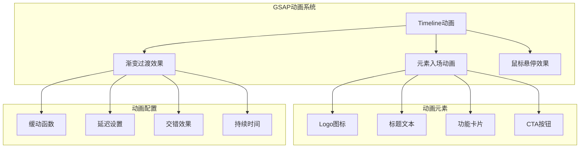

**图表来源**
- [ui-react/src/components/setup-wizard/steps/welcome/index.tsx:22-51](file://ui-react/src/components/setup-wizard/steps/welcome/index.tsx#L22-L51)

### 动画实现细节

#### Timeline配置
- **缓动函数**: 使用power3.out缓动函数
- **默认配置**: 所有动画共享相同的缓动和持续时间
- **时间轴管理**: 自动清理和销毁动画资源

#### 元素入场顺序
1. **Logo图标**: 0.2秒延迟，缩放和透明度动画
2. **标题文本**: 0.35秒延迟，从下方滑入
3. **功能卡片**: 0.4秒延迟，交错的缩放和位移动画
4. **CTA按钮**: 0.3秒延迟，从下方滑入

#### 动画参数
- **图标**: 缩放到1倍，透明度从0到1
- **标题**: Y轴位移从36px回到0，透明度从0到1
- **卡片**: Y轴位移从20px回到0，缩放从0.92到1
- **按钮**: Y轴位移从16px回到0，透明度从0到1

**章节来源**
- [ui-react/src/components/setup-wizard/steps/welcome/index.tsx:22-51](file://ui-react/src/components/setup-wizard/steps/welcome/index.tsx#L22-L51)

## 邀请码系统集成

**新增** 系统现在支持完整的邀请码验证和自动配置功能，提供快速设置体验。

### 邀请码系统架构

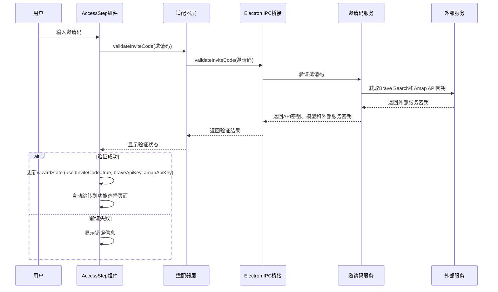

**图表来源**
- [ui-react/src/components/setup-wizard/steps/AccessStep.tsx:24-68](file://ui-react/src/components/setup-wizard/steps/AccessStep.tsx#L24-L68)
- [ui-react/src/adapters/ElectronWizardAdapter.ts:132-147](file://ui-react/src/adapters/ElectronWizardAdapter.ts#L132-L147)

### 邀请码验证流程

邀请码验证采用实时验证机制，确保用户体验的流畅性：

#### 验证步骤
1. **输入格式检查**: 确保邀请码符合BOSS-XXXX-XXXX格式
2. **实时验证**: 调用适配器的validateInviteCode方法
3. **IPC通信**: 通过Electron桥接调用后端验证服务
4. **外部服务获取**: 从外部服务获取Brave Search和Amap API密钥
5. **状态更新**: 成功时自动更新wizardState并跳转页面
6. **错误处理**: 失败时显示详细的错误信息

#### 邀请码格式规范
- **格式**: BOSS-XXXX-XXXX（大写字母和数字）
- **长度**: 13个字符（包含连字符）
- **验证**: 前缀必须为"BOSS-"，中间和末尾为4位字符

#### 支持的验证状态
- **成功**: 返回API密钥、模型ID和外部服务密钥，自动填充配置
- **未找到**: 邀请码不存在或已被使用
- **过多尝试**: 验证次数超过限制
- **网络错误**: 连接超时或网络问题

**章节来源**
- [ui-react/src/components/setup-wizard/steps/AccessStep.tsx:24-68](file://ui-react/src/components/setup-wizard/steps/AccessStep.tsx#L24-L68)
- [apps/electron/src/main/onboarding-validate.ts:508-526](file://apps/electron/src/main/onboarding-validate.ts#L508-L526)

### 邀请码状态管理

邀请码验证过程中，系统使用Zustand状态管理来跟踪配置路径和外部服务密钥：

#### 状态字段
- `usedInviteCode`: 布尔值，标记是否来自邀请码路径
- `braveApiKey`: Brave Search API密钥
- `amapApiKey`: Amap API密钥
- **作用**: 影响回退导航和后续步骤流程
- **默认值**: `false`（手动配置路径）

#### 状态更新机制
- **邀请码路径**: 验证成功后设置为`true`，并存储外部服务密钥
- **手动路径**: 手动配置时设置为`false`
- **导航影响**: `true`时回退到AccessStep，`false`时回退到ApiKeyStep

**章节来源**
- [ui-react/src/store/setup-wizard.store.ts:45-56](file://ui-react/src/store/setup-wizard.store.ts#L45-L56)
- [ui-react/src/components/setup-wizard/steps/AccessStep.tsx:42-49](file://ui-react/src/components/setup-wizard/steps/AccessStep.tsx#L42-L49)

## OAuth认证系统

**新增** 系统现在支持完整的OAuth认证流程，包括设备代码流和简单URL打开流。

### OAuth认证架构

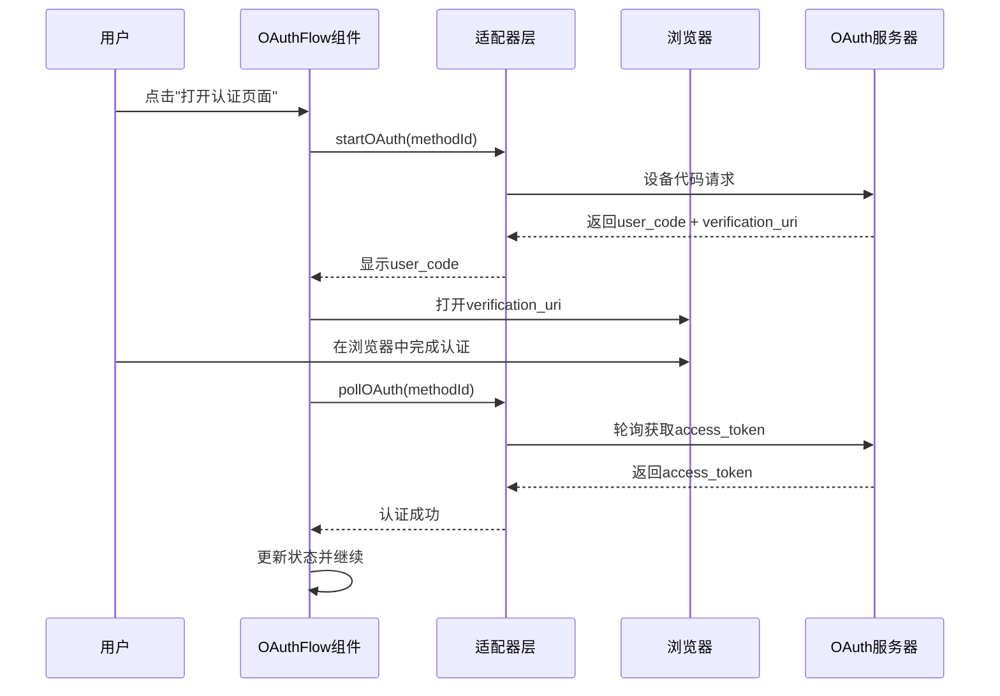

**图表来源**
- [ui-react/src/components/setup-wizard/steps/api-key-step/ApiKeyStep.tsx:18-222](file://ui-react/src/components/setup-wizard/steps/api-key-step/ApiKeyStep.tsx#L18-L222)

### OAuth流程类型

系统支持两种OAuth流程类型：

#### 设备代码流（Device Code Flow）
- **适用提供商**: MiniMax（全球版和中国版）
- **特点**: 支持PKCE（Proof Key for Code Exchange）安全机制
- **流程**: 用户在浏览器中输入user_code进行认证
- **轮询间隔**: 默认2秒轮询一次

#### 简单URL打开流
- **适用提供商**: OpenAI Codex、Google Gemini CLI、Qwen门户、GitHub Copilot等
- **特点**: 直接打开提供商的认证页面
- **流程**: 用户完成浏览器认证后，系统从auth-profiles.json读取令牌
- **超时控制**: 5分钟超时限制

**章节来源**
- [apps/electron/src/main/onboarding-oauth.ts:104-258](file://apps/electron/src/main/onboarding-oauth.ts#L104-L258)
- [apps/electron/src/main/onboarding-oauth.ts:262-291](file://apps/electron/src/main/onboarding-oauth.ts#L262-L291)
- [apps/electron/src/main/onboarding-oauth.ts:293-334](file://apps/electron/src/main/onboarding-oauth.ts#L293-L334)

### OAuth状态管理

OAuth认证过程中，系统使用Zustand状态管理来跟踪认证状态：

#### OAuth阶段状态
- `idle`: 空闲状态，等待用户操作
- `opening`: 正在打开浏览器
- `polling`: 轮询认证状态
- `success`: 认证成功
- `error`: 认证失败

#### OAuth会话管理
- **活跃会话**: 使用Map存储当前活跃的OAuth会话
- **会话清理**: 自动清理超时的会话
- **状态持久化**: 会话状态在应用重启后自动清理

**章节来源**
- [ui-react/src/components/setup-wizard/steps/api-key-step/ApiKeyStep.tsx:16-41](file://ui-react/src/components/setup-wizard/steps/api-key-step/ApiKeyStep.tsx#L16-L41)
- [apps/electron/src/main/onboarding-oauth.ts:73-73](file://apps/electron/src/main/onboarding-oauth.ts#L73-L73)

## API密钥验证系统

**新增** 系统现在支持对600+种AI模型提供商的API密钥进行实时验证。

### API密钥验证架构

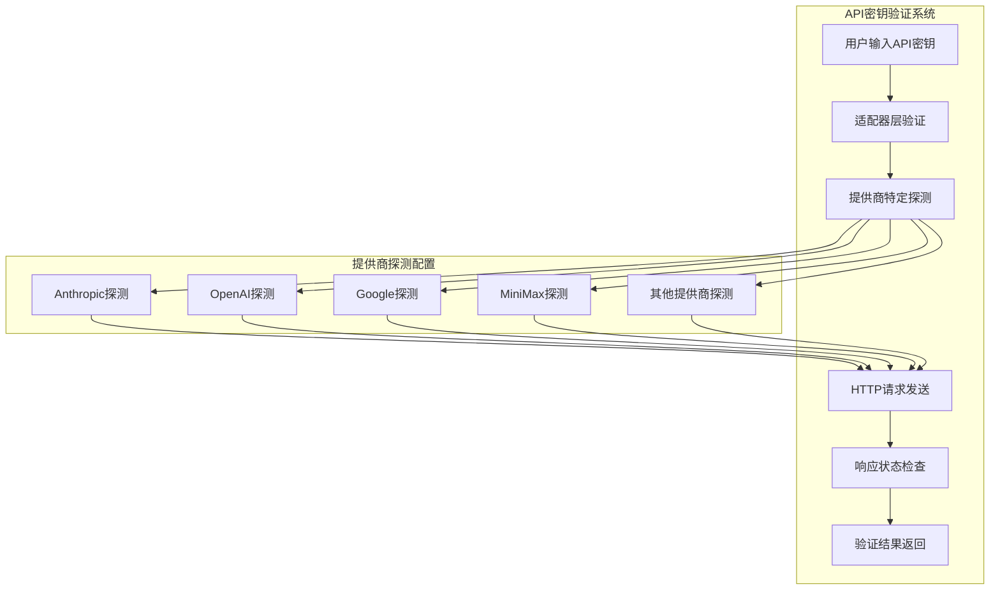

**图表来源**
- [apps/electron/src/main/onboarding-validate.ts:146-213](file://apps/electron/src/main/onboarding-validate.ts#L146-L213)

### 验证流程

API密钥验证采用最小化HTTP请求策略，确保验证过程既准确又高效：

#### 验证步骤
1. **输入格式检查**: 确保API密钥非空且去除空白字符
2. **提供商映射**: 将authMethod映射到对应的提供商标识
3. **探测配置**: 获取提供商特定的HTTP探测配置
4. **HTTP请求**: 发送最小化的探测请求
5. **状态码分析**: 根据HTTP状态码判断密钥有效性
6. **结果反馈**: 返回验证结果给UI层

#### 探测配置策略

| 提供商 | 探测URL | HTTP方法 | 关键头 | 状态码含义 |
|--------|---------|----------|--------|------------|
| Anthropic | `/v1/messages` | POST | `x-api-key` | 200/400有效, 401/403无效 |
| OpenAI | `/models` | GET | `Authorization: Bearer` | 200有效, 401/403无效 |
| Google | `/v1beta/models` | GET | `X-goog-api-key` | 200有效, 400/401/403无效 |
| MiniMax | `/v1/messages` | POST | `x-api-key` | 200/400有效, 401/403无效 |

**章节来源**
- [apps/electron/src/main/onboarding-validate.ts:146-213](file://apps/electron/src/main/onboarding-validate.ts#L146-L213)
- [apps/electron/src/main/onboarding-validate.ts:103-142](file://apps/electron/src/main/onboarding-validate.ts#L103-L142)

### 验证超时和错误处理

系统实现了完善的超时控制和错误处理机制：

#### 超时控制
- **探测超时**: 10秒超时限制
- **网络超时**: 防止长时间阻塞UI
- **会话超时**: OAuth会话5分钟超时

#### 错误分类
- **网络错误**: 网络连接问题
- **认证失败**: 401/403状态码
- **超时错误**: 探测超时
- **未知错误**: 其他异常情况

**章节来源**
- [apps/electron/src/main/onboarding-validate.ts:170-213](file://apps/electron/src/main/onboarding-validate.ts#L170-L213)

## 外部服务自动配置

**新增** 系统现在支持自动配置外部服务，包括Brave Search和Amap API密钥。

### 外部服务配置架构

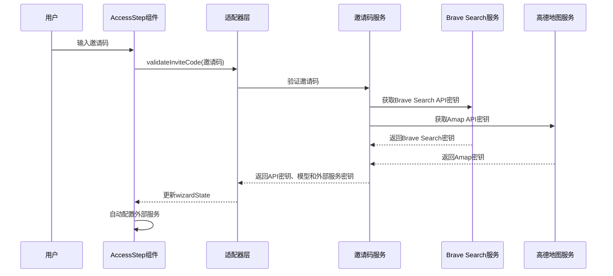

**图表来源**
- [apps/electron/src/main/onboarding-validate.ts:503-506](file://apps/electron/src/main/onboarding-validate.ts#L503-L506)
- [apps/electron/src/main/onboarding.ts:352-383](file://apps/electron/src/main/onboarding.ts#L352-L383)

### Brave Search自动配置

Brave Search是默认的Web搜索提供商，系统可以自动配置其API密钥：

#### 配置流程
1. **密钥获取**: 从邀请码服务获取Brave Search API密钥
2. **配置构建**: 自动构建tools.web.search配置
3. **服务启用**: 启用Brave Search搜索引擎
4. **密钥存储**: 将API密钥存储到配置中

#### 配置结构
```json
{
  "tools": {
    "web": {
      "search": {
        "enabled": true,
        "provider": "brave",
        "apiKey": "BRAVE_API_KEY_HERE"
      }
    }
  }
}
```

**章节来源**
- [docs/zh-CN/brave-search.md:1-49](file://docs/zh-CN/brave-search.md#L1-L49)
- [docs/brave-search.md:1-81](file://docs/brave-search.md#L1-L81)
- [apps/electron/src/main/onboarding.ts:352-367](file://apps/electron/src/main/onboarding.ts#L352-L367)

### Amap API自动配置

Amap（高德地图）API用于地理位置服务和地图功能：

#### 配置流程
1. **密钥获取**: 从邀请码服务获取Amap API密钥
2. **技能配置**: 自动配置amap-lbs-skill技能
3. **密钥存储**: 将API密钥存储到技能配置中

#### 配置结构
```json
{
  "skills": {
    "entries": {
      "amap-lbs-skill": {
        "apiKey": "AMAP_API_KEY_HERE"
      }
    }
  }
}
```

**章节来源**
- [skills/amap-lbs-skill/SKILL.md:1-475](file://skills/amap-lbs-skill/SKILL.md#L1-L475)
- [skills/amap-lbs-skill/config.example.json:1-3](file://skills/amap-lbs-skill/config.example.json#L1-L3)
- [skills/amap-lbs-skill/index.js:1-74](file://skills/amap-lbs-skill/index.js#L1-L74)
- [apps/electron/src/main/onboarding.ts:373-383](file://apps/electron/src/main/onboarding.ts#L373-L383)

### 配置构建器

系统使用配置构建器自动将外部服务密钥集成到最终配置中：

#### 构建流程
1. **检查密钥存在**: 检查braveApiKey和amapApiKey是否存在
2. **条件配置**: 仅在密钥存在时添加相应的配置段
3. **合并现有配置**: 将新配置与现有配置合并
4. **保持兼容性**: 保留现有的工具和技能配置

#### 配置优先级
- **外部服务密钥**: 由邀请码提供的密钥具有最高优先级
- **用户配置**: 用户手动配置的设置优先于默认设置
- **系统默认**: 缺少配置时使用系统默认值

**章节来源**
- [apps/electron/src/main/onboarding.ts:352-383](file://apps/electron/src/main/onboarding.ts#L352-L383)

## IPC通信机制

**新增** 系统通过Electron IPC实现前端与主进程的通信，支持邀请码验证等核心功能。

### IPC通信架构

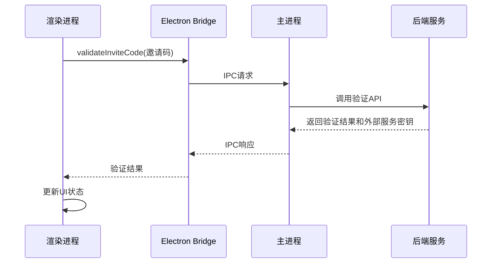

**图表来源**
- [ui-react/src/adapters/ElectronWizardAdapter.ts:176-206](file://ui-react/src/adapters/ElectronWizardAdapter.ts#L176-L206)

### IPC方法定义

系统定义了完整的IPC通信方法集合：

#### 核心IPC方法
- `validateInviteCode(code)`: 验证邀请码并返回API密钥、模型和外部服务密钥
- `saveOnboardingConfig(cfg)`: 保存配置到磁盘
- `restartGateway()`: 重启网关服务
- `notifyOnboardingComplete()`: 通知完成设置向导
- `validateApiKey(authMethod, apiKey)`: 验证API密钥
- `oauthStart(authMethod)`: 开始OAuth认证
- `oauthPoll(authMethod)`: 轮询OAuth状态
- `oauthCancel(authMethod)`: 取消OAuth认证

#### 方法调用流程
1. **渲染进程**调用适配器方法
2. **Electron桥接**将请求转发到主进程
3. **主进程**执行相应操作
4. **主进程**返回结果给渲染进程
5. **渲染进程**更新UI状态

**章节来源**
- [ui-react/src/adapters/ElectronWizardAdapter.ts:3-18](file://ui-react/src/adapters/ElectronWizardAdapter.ts#L3-L18)
- [apps/electron/src/main/ipc-wizard.ts:221-242](file://apps/electron/src/main/ipc-wizard.ts#L221-L242)

### IPC状态管理

IPC通信过程中，系统使用全局状态管理：

#### 全局状态
- **activeWizardSessionId**: 当前活动的向导会话ID
- **wsClient**: WebSocket客户端连接
- **pendingRequests**: 待处理的请求队列

#### 生命周期管理
- **会话创建**: 首次IPC调用时建立连接
- **请求处理**: 异步处理IPC请求
- **连接清理**: 注销时关闭WebSocket连接
- **错误恢复**: 自动重连机制

**章节来源**
- [apps/electron/src/main/ipc-wizard.ts:221-242](file://apps/electron/src/main/ipc-wizard.ts#L221-L242)

## 依赖关系分析

设置向导系统的依赖关系体现了清晰的关注点分离和模块化设计，新增WebGL Orb动画、GSAP动画系统以及外部服务自动配置功能：

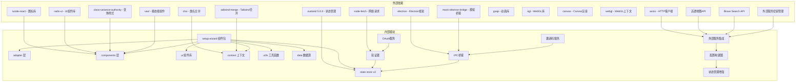

**图表来源**
- [ui-react/src/store/setup-wizard.store.ts:1-3](file://ui-react/src/store/setup-wizard.store.ts#L1-L3)
- [ui-react/src/components/setup-wizard/index.tsx:1-31](file://ui-react/src/components/setup-wizard/index.tsx#L1-L31)

### 核心依赖特性

1. **状态管理**: 使用 Zustand 5.0.3 实现轻量级但功能强大的状态管理
2. **UI组件**: 基于 Radix UI 构建的自定义组件库
3. **适配器模式**: 支持多平台通信的灵活架构
4. **类型安全**: 完整的 TypeScript 类型定义确保开发安全性
5. **认证配置**: 静态认证配置数据源支持600+提供商
6. **持久化存储**: Zustand middleware提供本地存储功能
7. **OAuth支持**: Electron平台原生OAuth支持
8. **API验证**: 轻量级API密钥验证服务
9. **邀请码验证**: 实时邀请码验证和自动配置
10. **IPC通信**: Electron桥接实现前后端通信
11. **WebGL渲染**: ogl库提供高性能的3D图形渲染
12. **Canvas动画**: 原生Canvas API实现流畅的2D动画
13. **GSAP动画**: 专业级动画库提供复杂的动画效果
14. **鼠标交互**: 实时响应用户鼠标移动和悬停
15. **外部服务集成**: 自动配置Brave Search和Amap API密钥
16. **配置构建**: 智能配置合并和优先级管理
17. **状态增强**: 支持外部服务密钥的状态管理

**章节来源**
- [ui-react/src/store/setup-wizard.store.ts:95-152](file://ui-react/src/store/setup-wizard.store.ts#L95-L152)

## 性能考虑

设置向导系统在设计时充分考虑了性能优化，新增WebGL Orb动画、GSAP动画系统以及外部服务自动配置功能也进行了专门优化：

### WebGL渲染优化
- **设备像素比**: 自动适配高分辨率屏幕，避免过度渲染
- **事件监听**: 使用节流和防抖优化鼠标移动事件
- **内存管理**: 自动清理WebGL上下文和着色器资源
- **帧率控制**: 使用requestAnimationFrame实现60fps动画

### Canvas动画优化
- **设备像素比**: 自动适配高分辨率屏幕
- **平滑插值**: 使用lerp算法实现平滑的动画效果
- **多重渐变**: 优化渐变计算，减少CPU负载
- **鼠标跟踪**: 优化鼠标位置计算，提高响应速度

### GSAP动画优化
- **Timeline复用**: 复用动画Timeline，避免重复创建
- **缓动函数**: 使用高效的缓动函数算法
- **交错效果**: 优化交错动画的性能表现
- **自动清理**: 自动清理动画资源，防止内存泄漏

### 状态管理优化
- 使用持久化存储避免重复配置
- 响应式更新减少不必要的重渲染
- 智能缓存策略提升用户体验
- **外部服务密钥优化**: 按需加载和存储外部服务密钥

### 组件优化
- 自定义UI组件库减少包体积
- Radix UI提供高性能的无障碍组件
- 按需导入避免不必要的代码加载

### 网络通信优化
- 适配器模式减少网络请求次数
- OAuth轮询间隔优化为2秒
- API密钥验证采用最小化请求
- 邀请码验证采用实时验证机制
- 外部服务密钥获取采用批量请求
- 超时控制防止界面卡顿

### 用户体验优化
- 渐进式加载避免首屏延迟
- 平滑的过渡动画提升交互质量
- 错误恢复机制增强可靠性
- OAuth流程支持手动继续
- 邀请码验证提供即时反馈
- 外部服务自动配置减少用户操作

## 故障排除指南

### 常见问题及解决方案

#### 初始化失败
**症状**: 设置向导无法启动或显示初始化错误
**可能原因**:
- 适配器未正确配置
- 网关服务不可用
- 网络连接问题

**解决步骤**:
1. 检查适配器配置是否正确
2. 验证网关服务状态
3. 确认网络连接稳定
4. 查看浏览器控制台错误信息

#### WebGL渲染问题
**症状**: Orb动画无法显示或显示异常
**可能原因**:
- WebGL不支持或被禁用
- 设备像素比计算错误
- 着色器编译失败
- 内存不足

**解决步骤**:
1. 检查浏览器WebGL支持状态
2. 验证设备像素比设置
3. 查看着色器编译错误
4. 检查GPU内存使用情况
5. 尝试降低Orb复杂度

#### Canvas动画问题
**症状**: Canvas Orb动画卡顿或闪烁
**可能原因**:
- Canvas尺寸计算错误
- 鼠标事件监听异常
- 动画循环性能问题
- 设备像素比适配问题

**解决步骤**:
1. 检查Canvas尺寸更新逻辑
2. 验证鼠标事件处理
3. 优化动画循环性能
4. 调整设备像素比设置

#### GSAP动画问题
**症状**: 动画效果异常或性能问题
**可能原因**:
- Timeline配置错误
- 缓动函数参数不当
- 元素选择器失效
- 动画资源未正确清理

**解决步骤**:
1. 检查Timeline配置和参数
2. 验证元素选择器的有效性
3. 确认动画资源正确清理
4. 优化动画性能设置

#### 邀请码验证失败
**症状**: 邀请码验证总是失败或超时
**可能原因**:
- 邀请码格式不正确
- 网络连接问题
- 邀请码服务不可用
- 邀请码已被使用
- 外部服务密钥获取失败

**解决步骤**:
1. 检查邀请码格式（BOSS-XXXX-XXXX）
2. 验证网络连接状态
3. 确认邀请码服务可用性
4. 查看邀请码验证日志
5. 检查外部服务密钥获取状态
6. 尝试其他邀请码

#### OAuth认证失败
**症状**: OAuth认证流程中断或超时
**可能原因**:
- 浏览器无法打开认证页面
- 网络连接不稳定
- OAuth会话超时
- 提供商API限制

**解决步骤**:
1. 检查系统浏览器设置
2. 验证网络连接状态
3. 重新启动认证流程
4. 查看OAuth服务日志
5. 检查提供商API状态

#### API密钥验证失败
**症状**: API密钥验证总是失败或超时
**可能原因**:
- 密钥格式不正确
- 网络连接问题
- 提供商API限制
- 探测配置不匹配

**解决步骤**:
1. 检查密钥格式和长度
2. 验证网络连接状态
3. 确认提供商API可用性
4. 查看验证器日志
5. 尝试其他提供商

#### 外部服务配置失败
**症状**: Brave Search或Amap API密钥无法自动配置
**可能原因**:
- 外部服务API不可用
- 网络连接问题
- 邀请码服务返回空密钥
- 配置构建失败

**解决步骤**:
1. 检查外部服务API状态
2. 验证网络连接状态
3. 确认邀请码服务返回有效密钥
4. 查看配置构建日志
5. 手动配置外部服务密钥

#### 提交步骤失败
**症状**: 点击"继续"按钮无响应或出现错误
**可能原因**:
- API请求超时
- 服务器端验证失败
- 状态同步问题
- 外部服务配置冲突

**解决步骤**:
1. 检查网络连接状态
2. 验证输入数据格式
3. 查看服务器日志
4. 检查外部服务配置冲突
5. 重新加载页面重试

#### 适配器集成问题
**症状**: 适配器无法正常工作
**可能原因**:
- Electron IPC 桥接问题
- Web API 端点配置错误
- 权限不足
- 外部服务集成失败

**解决步骤**:
1. 验证适配器配置参数
2. 检查跨域设置
3. 确认权限配置
4. 查看适配器日志
5. 检查外部服务集成状态

#### 状态管理问题
**症状**: 状态不更新或重置
**可能原因**:
- Zustand store 配置错误
- 持久化存储问题
- 状态更新函数错误
- 外部服务密钥状态异常

**解决步骤**:
1. 检查 store 配置和初始化
2. 验证持久化存储设置
3. 确认状态更新函数正确性
4. 查看控制台错误信息
5. 检查外部服务密钥状态

#### 认证配置问题
**症状**: 认证提供商无法找到或配置错误
**可能原因**:
- 认证配置数据源过期
- 提供商ID不匹配
- 方法ID配置错误

**解决步骤**:
1. 检查认证配置数据源完整性
2. 验证提供商ID和方法ID
3. 确认默认模型映射正确
4. 查看控制台认证错误信息

#### IPC通信问题
**症状**: IPC调用失败或无响应
**可能原因**:
- Electron桥接未正确初始化
- 主进程服务未启动
- 网络连接问题
- 外部服务通信失败

**解决步骤**:
1. 检查Electron桥接状态
2. 验证主进程服务可用性
3. 确认IPC通道畅通
4. 查看IPC通信日志
5. 检查外部服务通信状态

#### 配置构建问题
**症状**: 配置构建失败或配置不完整
**可能原因**:
- 外部服务密钥缺失
- 配置合并冲突
- 文件权限问题
- 配置格式错误

**解决步骤**:
1. 检查外部服务密钥状态
2. 验证配置合并逻辑
3. 确认文件权限设置
4. 查看配置构建日志
5. 手动修复配置格式

**章节来源**
- [ui-react/src/components/setup-wizard/WizardContainer.tsx:24-73](file://ui-react/src/components/setup-wizard/WizardContainer.tsx#L24-L73)
- [ui-react/src/context/AdapterContext.tsx:21-26](file://ui-react/src/context/AdapterContext.tsx#L21-L26)

## 结论

设置向导系统展现了现代前端开发的最佳实践，通过精心设计的架构和组件化结构，为用户提供了流畅、可靠的配置体验。系统的主要优势包括：

### 核心优势
1. **模块化设计**: 重构后的ui-react/src/components/setup-wizard/结构提供了更好的组织性
2. **平台无关性**: 通过适配器模式支持多种部署环境
3. **认证配置丰富**: 支持600+种AI模型提供商的认证配置
4. **用户体验**: 步骤化的界面设计降低了学习成本
5. **技术先进性**: 采用最新的 React 和 TypeScript 技术栈
6. **性能优化**: 自定义UI组件库和Zustand状态管理提供最佳性能
7. **安全增强**: OAuth认证和API密钥验证双重安全保障
8. **扩展性强**: 模块化架构支持未来功能扩展
9. **邀请码系统**: 提供快速配置路径，提升用户体验
10. **双路径配置**: 支持邀请码和手动配置两种模式
11. **WebGL Orb动画**: 提供沉浸式的视觉体验
12. **GSAP动画系统**: 实现流畅的渐变动画效果
13. **Canvas动画**: 提供高性能的2D动画支持
14. **鼠标交互**: 实时响应用户操作
15. **外部服务自动配置**: 支持Brave Search和Amap API密钥的自动配置
16. **智能配置构建**: 自动合并和优先级管理外部服务配置
17. **状态管理增强**: 支持外部服务密钥的状态管理

### 技术亮点
- **状态管理**: 基于 Zustand 5.0.3 的轻量级解决方案
- **类型安全**: 完整的 TypeScript 支持
- **UI一致性**: 基于 Radix UI 的统一设计语言
- **认证系统**: 静态配置数据源支持丰富的提供商
- **OAuth支持**: 原生Electron OAuth支持
- **API验证**: 轻量级验证服务确保密钥有效性
- **邀请码验证**: 实时验证机制提供即时反馈
- **IPC通信**: Electron桥接实现高效前后端通信
- **WebGL渲染**: ogl库提供高性能的3D图形渲染
- **Canvas动画**: 原生Canvas API实现流畅的2D动画
- **GSAP动画**: 专业级动画库提供复杂的动画效果
- **鼠标交互**: 实时响应用户鼠标移动和悬停
- **错误处理**: 健壮的错误处理和恢复机制
- **持久化存储**: 智能状态管理确保用户体验
- **外部服务集成**: 自动配置Brave Search和Amap API密钥
- **配置构建**: 智能配置合并和优先级管理
- **状态增强**: 支持外部服务密钥的状态管理

### 发展前景
设置向导系统为 OpenClaw 项目奠定了坚实的基础，其模块化和可扩展的架构设计使其能够适应未来的需求变化和技术演进。通过持续的优化和改进，该系统将继续为用户提供卓越的配置体验。

**更新** 重构后的ui-react/src/components/setup-wizard/结构为未来的功能扩展和维护提供了更好的基础，Radix UI组件库的选择确保了组件的高性能和可访问性，而Zustand 5.0.3的状态管理则提供了更强大的状态处理能力。全新的WebGL Orb动画系统和GSAP动画系统进一步增强了系统的视觉吸引力和用户体验，为用户提供了更加沉浸式的设置流程。全新的邀请码系统和外部服务自动配置功能进一步增强了系统的易用性和可访问性，为用户提供了更丰富的配置选项和更流畅的设置体验。这些改进使得设置向导系统能够更好地服务于OpenClaw生态系统的各种应用场景。