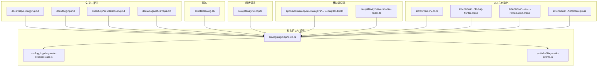
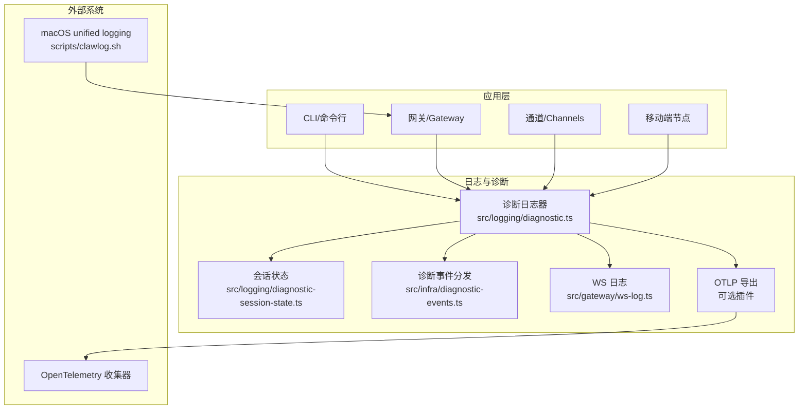
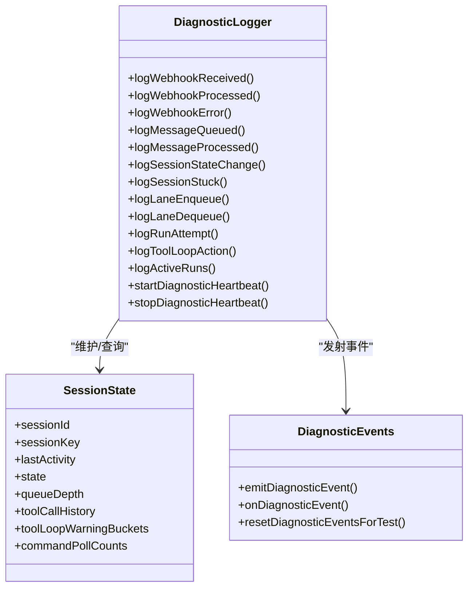
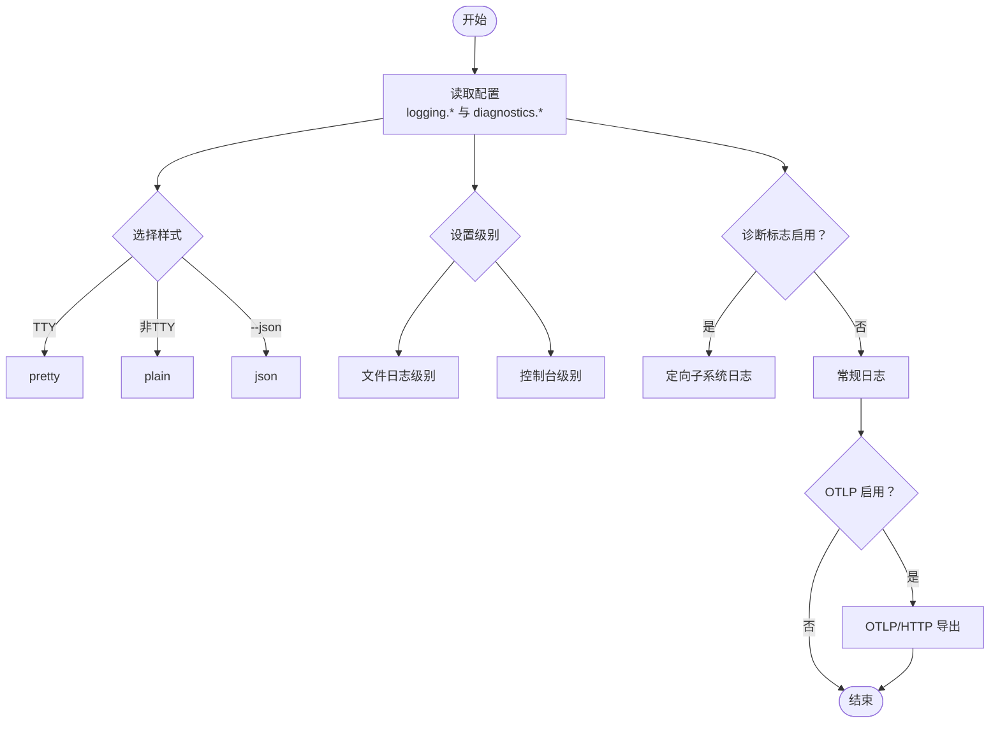
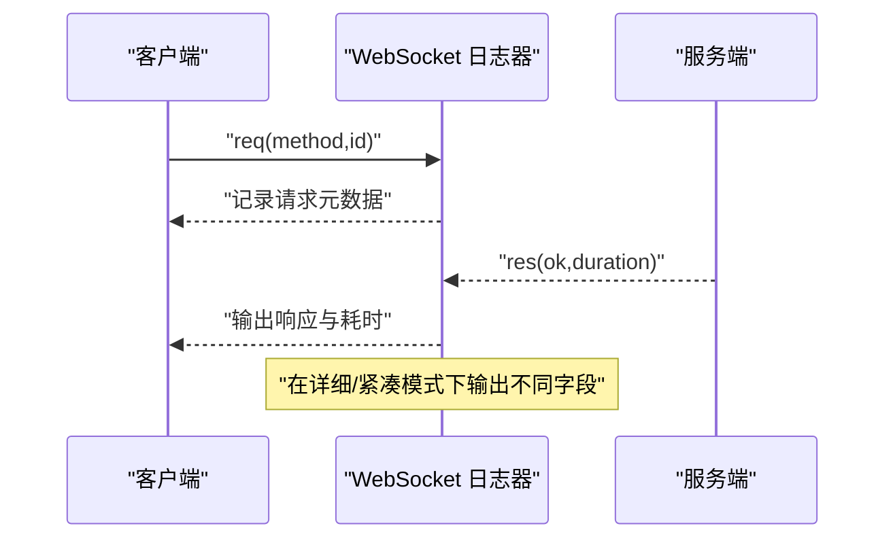
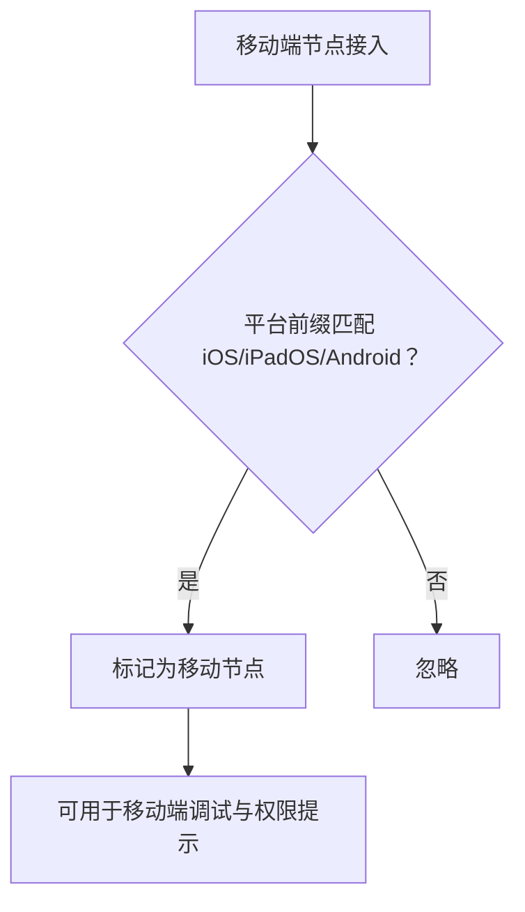
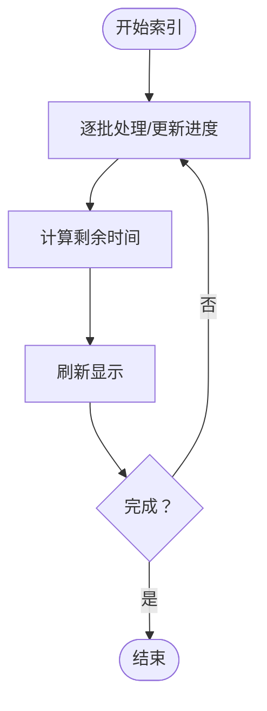
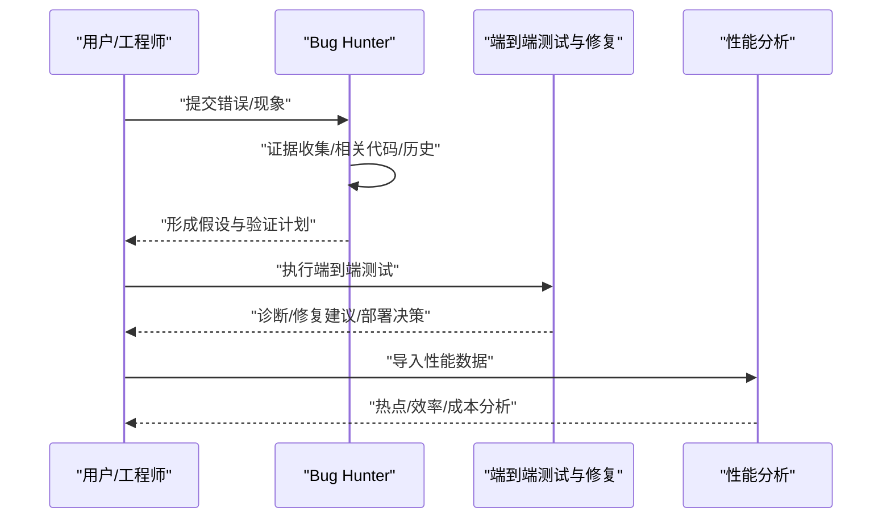
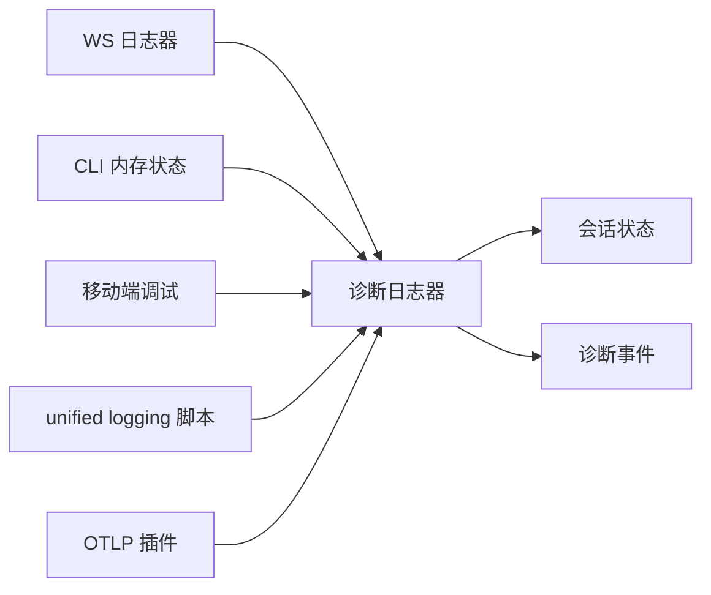

# 调试工具

<cite>
**本文引用的文件**
- [docs/help/debugging.md](file://docs/help/debugging.md)
- [docs/logging.md](file://docs/logging.md)
- [docs/help/troubleshooting.md](file://docs/help/troubleshooting.md)
- [docs/diagnostics/flags.md](file://docs/diagnostics/flags.md)
- [scripts/clawlog.sh](file://scripts/clawlog.sh)
- [src/logging/diagnostic.ts](file://src/logging/diagnostic.ts)
- [src/logging/diagnostic-session-state.ts](file://src/logging/diagnostic-session-state.ts)
- [src/infra/diagnostic-events.ts](file://src/infra/diagnostic-events.ts)
- [src/gateway/ws-log.ts](file://src/gateway/ws-log.ts)
- [src/gateway/server-mobile-nodes.ts](file://src/gateway/server-mobile-nodes.ts)
- [apps/android/app/src/main/java/ai/openclaw/app/node/DebugHandler.kt](file://apps/android/app/src/main/java/ai/openclaw/app/node/DebugHandler.kt)
- [src/cli/memory-cli.ts](file://src/cli/memory-cli.ts)
- [extensions/open-prose/skills/prose/examples/36-bug-hunter.prose](file://extensions/open-prose/skills/prose/examples/36-bug-hunter.prose)
- [extensions/open-prose/skills/prose/examples/45-run-endpoint-ux-test-with-remediation.prose](file://extensions/open-prose/skills/prose/examples/45-run-endpoint-ux-test-with-remediation.prose)
- [extensions/open-prose/skills/prose/lib/profiler.prose](file://extensions/open-prose/skills/prose/lib/profiler.prose)
</cite>

## 目录

1. [简介](#简介)
2. [项目结构](#项目结构)
3. [核心组件](#核心组件)
4. [架构总览](#架构总览)
5. [详细组件分析](#详细组件分析)
6. [依赖关系分析](#依赖关系分析)
7. [性能考量](#性能考量)
8. [故障排除指南](#故障排除指南)
9. [结论](#结论)
10. [附录](#附录)

## 简介

本指南聚焦于 OpenClaw 的调试工具与日志体系，覆盖以下主题：

- 日志系统：日志级别、输出格式、过滤规则与导出（含 OTLP）。
- 故障排除：症状导向的诊断流程、常见错误定位与修复建议。
- 网络调试：WebSocket 请求/响应跟踪、连接状态与性能指标。
- 性能分析与内存监控：会话状态追踪、队列深度、运行时进度与 ETA。
- 移动端调试：Android 日志采集与移动端节点检测。
- 远程调试与生产环境调试：macOS unified logging、OTLP 导出、诊断标志。
- 自动化诊断与辅助工具：Prose 技能与性能分析流程。

## 项目结构

围绕调试与日志的关键目录与文件：

- 文档与用户指引：docs 下的调试、日志、故障排除、诊断标志等文档。
- 脚本：scripts/clawlog.sh 提供 macOS unified logging 的便捷查看与导出。
- 核心日志与诊断：src/logging/\* 提供诊断事件、会话状态与心跳；src/infra/diagnostic-events.ts 提供全局诊断事件分发。
- 网络调试：src/gateway/ws-log.ts 提供 WebSocket 流量日志与优化策略。
- 移动端调试：apps/android/app/src/main/java/ai/openclaw/app/node/DebugHandler.kt 提供 Android 日志采集；src/gateway/server-mobile-nodes.ts 检测移动端节点。
- CLI 内存状态：src/cli/memory-cli.ts 展示内存索引进度与 ETA。
- 自动化诊断：extensions/open-prose/skills/prose/examples/\*.prose 提供 Bug Hunter 与端到端 UX 测试流程；lib/profiler.prose 提供性能分析模板。

图表来源

- [docs/help/debugging.md:1-163](file://docs/help/debugging.md#L1-L163)
- [docs/logging.md:1-353](file://docs/logging.md#L1-L353)
- [docs/help/troubleshooting.md:1-299](file://docs/help/troubleshooting.md#L1-L299)
- [docs/diagnostics/flags.md:1-92](file://docs/diagnostics/flags.md#L1-L92)
- [scripts/clawlog.sh:1-322](file://scripts/clawlog.sh#L1-L322)
- [src/logging/diagnostic.ts:1-434](file://src/logging/diagnostic.ts#L1-L434)
- [src/logging/diagnostic-session-state.ts:1-113](file://src/logging/diagnostic-session-state.ts#L1-L113)
- [src/infra/diagnostic-events.ts:171-242](file://src/infra/diagnostic-events.ts#L171-L242)
- [src/gateway/ws-log.ts:47-438](file://src/gateway/ws-log.ts#L47-L438)
- [apps/android/app/src/main/java/ai/openclaw/app/node/DebugHandler.kt:72-95](file://apps/android/app/src/main/java/ai/openclaw/app/node/DebugHandler.kt#L72-L95)
- [src/gateway/server-mobile-nodes.ts:1-14](file://src/gateway/server-mobile-nodes.ts#L1-L14)
- [src/cli/memory-cli.ts:657-686](file://src/cli/memory-cli.ts#L657-L686)
- [extensions/open-prose/skills/prose/examples/36-bug-hunter.prose:1-184](file://extensions/open-prose/skills/prose/examples/36-bug-hunter.prose#L1-L184)
- [extensions/open-prose/skills/prose/examples/45-run-endpoint-ux-test-with-remediation.prose:114-624](file://extensions/open-prose/skills/prose/examples/45-run-endpoint-ux-test-with-remediation.prose#L114-L624)
- [extensions/open-prose/skills/prose/lib/profiler.prose:317-357](file://extensions/open-prose/skills/prose/lib/profiler.prose#L317-L357)

章节来源

- [docs/help/debugging.md:1-163](file://docs/help/debugging.md#L1-L163)
- [docs/logging.md:1-353](file://docs/logging.md#L1-L353)
- [docs/help/troubleshooting.md:1-299](file://docs/help/troubleshooting.md#L1-L299)
- [docs/diagnostics/flags.md:1-92](file://docs/diagnostics/flags.md#L1-L92)
- [scripts/clawlog.sh:1-322](file://scripts/clawlog.sh#L1-L322)
- [src/logging/diagnostic.ts:1-434](file://src/logging/diagnostic.ts#L1-L434)
- [src/logging/diagnostic-session-state.ts:1-113](file://src/logging/diagnostic-session-state.ts#L1-L113)
- [src/infra/diagnostic-events.ts:171-242](file://src/infra/diagnostic-events.ts#L171-L242)
- [src/gateway/ws-log.ts:47-438](file://src/gateway/ws-log.ts#L47-L438)
- [apps/android/app/src/main/java/ai/openclaw/app/node/DebugHandler.kt:72-95](file://apps/android/app/src/main/java/ai/openclaw/app/node/DebugHandler.kt#L72-L95)
- [src/gateway/server-mobile-nodes.ts:1-14](file://src/gateway/server-mobile-nodes.ts#L1-L14)
- [src/cli/memory-cli.ts:657-686](file://src/cli/memory-cli.ts#L657-L686)
- [extensions/open-prose/skills/prose/examples/36-bug-hunter.prose:1-184](file://extensions/open-prose/skills/prose/examples/36-bug-hunter.prose#L1-L184)
- [extensions/open-prose/skills/prose/examples/45-run-endpoint-ux-test-with-remediation.prose:114-624](file://extensions/open-prose/skills/prose/examples/45-run-endpoint-ux-test-with-remediation.prose#L114-L624)
- [extensions/open-prose/skills/prose/lib/profiler.prose:317-357](file://extensions/open-prose/skills/prose/lib/profiler.prose#L317-L357)

## 核心组件

- 诊断日志与事件
  - 诊断子系统日志器与事件发射器，支持模型用量、消息流、队列与会话状态等事件。
  - 会话状态管理：记录 sessionId/sessionKey、状态（idle/processing/waiting）、队列深度、最后活动时间等，并定期清理。
  - 全局诊断事件分发：带序列号、时间戳与递归保护，监听器失败不影响主流程。
- 日志配置与导出
  - 文件日志（JSONL）与控制台输出；支持级别、样式、敏感信息脱敏与正则模式。
  - 诊断标志（flags）用于定向开启特定子系统的调试日志，不提升全局级别。
  - 可选 OTLP/HTTP 导出至任意兼容收集器，支持 traces/metrics/logs 与采样/刷新间隔。
- 网络调试
  - WebSocket 流量日志：按方向、类型（req/res/event）与连接/请求 ID 输出，支持紧凑/优化模式与耗时统计。
- 移动端调试
  - Android：通过 logcat 快速抓取当前进程日志并写入缓存文件，便于上传或分析。
  - 移动节点检测：识别 iOS/iPadOS/Android 平台的已连接节点。
- CLI 与自动化
  - 内存状态 CLI：展示索引进度、耗时与 ETA。
  - Prose 技能：Bug Hunter 自动化证据收集与诊断；端到端 UX 测试与修复流程；性能分析模板。

章节来源

- [src/logging/diagnostic.ts:1-434](file://src/logging/diagnostic.ts#L1-L434)
- [src/logging/diagnostic-session-state.ts:1-113](file://src/logging/diagnostic-session-state.ts#L1-L113)
- [src/infra/diagnostic-events.ts:171-242](file://src/infra/diagnostic-events.ts#L171-L242)
- [src/gateway/ws-log.ts:47-438](file://src/gateway/ws-log.ts#L47-L438)
- [apps/android/app/src/main/java/ai/openclaw/app/node/DebugHandler.kt:72-95](file://apps/android/app/src/main/java/ai/openclaw/app/node/DebugHandler.kt#L72-L95)
- [src/gateway/server-mobile-nodes.ts:1-14](file://src/gateway/server-mobile-nodes.ts#L1-L14)
- [src/cli/memory-cli.ts:657-686](file://src/cli/memory-cli.ts#L657-L686)
- [extensions/open-prose/skills/prose/examples/36-bug-hunter.prose:1-184](file://extensions/open-prose/skills/prose/examples/36-bug-hunter.prose#L1-L184)
- [extensions/open-prose/skills/prose/examples/45-run-endpoint-ux-test-with-remediation.prose:114-624](file://extensions/open-prose/skills/prose/examples/45-run-endpoint-ux-test-with-remediation.prose#L114-L624)
- [extensions/open-prose/skills/prose/lib/profiler.prose:317-357](file://extensions/open-prose/skills/prose/lib/profiler.prose#L317-L357)

## 架构总览

下图展示了日志与诊断在系统中的位置与交互：

图表来源

- [src/logging/diagnostic.ts:1-434](file://src/logging/diagnostic.ts#L1-L434)
- [src/logging/diagnostic-session-state.ts:1-113](file://src/logging/diagnostic-session-state.ts#L1-L113)
- [src/infra/diagnostic-events.ts:171-242](file://src/infra/diagnostic-events.ts#L171-L242)
- [src/gateway/ws-log.ts:47-438](file://src/gateway/ws-log.ts#L47-L438)
- [scripts/clawlog.sh:1-322](file://scripts/clawlog.sh#L1-L322)

## 详细组件分析

### 组件一：诊断日志与事件系统

- 功能要点
  - 事件类型覆盖模型用量、webhook 接收/处理/错误、消息排队/处理、队列车道、会话状态与卡滞、运行尝试、工具循环检测等。
  - 会话状态持久化与修剪：基于 TTL 与最大条目数的淘汰策略，避免内存膨胀。
  - 全局事件分发：带序列号与时间戳，递归深度保护，监听器异常不影响主流程。
- 关键接口
  - 事件发射：emitDiagnosticEvent
  - 会话状态：getDiagnosticSessionState、pruneDiagnosticSessionStates
  - 心跳与卡滞告警：startDiagnosticHeartbeat、logSessionStuck
- 复杂度与性能
  - 会话状态 Map 查询/插入为 O(1)，修剪按时间窗口与大小阈值触发，摊销成本低。
  - 心跳定时器周期性扫描并发出聚合事件，避免高频日志风暴。

图表来源

- [src/logging/diagnostic.ts:1-434](file://src/logging/diagnostic.ts#L1-L434)
- [src/logging/diagnostic-session-state.ts:1-113](file://src/logging/diagnostic-session-state.ts#L1-L113)
- [src/infra/diagnostic-events.ts:171-242](file://src/infra/diagnostic-events.ts#L171-L242)

章节来源

- [src/logging/diagnostic.ts:1-434](file://src/logging/diagnostic.ts#L1-L434)
- [src/logging/diagnostic-session-state.ts:1-113](file://src/logging/diagnostic-session-state.ts#L1-L113)
- [src/infra/diagnostic-events.ts:171-242](file://src/infra/diagnostic-events.ts#L171-L242)

### 组件二：日志系统与配置

- 日志位置与读取
  - 文件日志：默认滚动文件，CLI 与控制 UI 均可实时跟踪。
  - 控制台输出：TTY 自适应，支持 pretty/compact/json 三种样式。
- 配置项
  - logging.level：文件日志级别；logging.consoleLevel：控制台级别。
  - logging.consoleStyle：pretty/compact/json。
  - logging.redactSensitive：脱敏范围；logging.redactPatterns：自定义正则。
- 诊断标志
  - diagnostics.flags：启用子系统特定调试日志，支持通配符；可通过环境变量临时覆盖。
- OTLP 导出
  - diagnostics.otel.\*：端点、协议、服务名、开关 traces/metrics/logs、采样率、刷新间隔。
  - 导出遵循 file 日志级别，控制台脱敏不应用于 OTLP。

图表来源

- [docs/logging.md:100-353](file://docs/logging.md#L100-L353)
- [docs/diagnostics/flags.md:13-92](file://docs/diagnostics/flags.md#L13-L92)

章节来源

- [docs/logging.md:100-353](file://docs/logging.md#L100-L353)
- [docs/diagnostics/flags.md:13-92](file://docs/diagnostics/flags.md#L13-L92)

### 组件三：网络调试（WebSocket）

- 功能要点
  - 按方向（in/out）与类型（req/res/event）输出，支持状态标记与耗时计算。
  - 三种日志风格：自动/紧凑/详细；详细模式包含连接 ID、请求 ID 等元数据。
  - 优化策略：限制在飞请求数量上限，避免内存增长。
- 使用场景
  - 定位握手失败、超时、断开原因、UI 侧连接状态异常等问题。

图表来源

- [src/gateway/ws-log.ts:256-438](file://src/gateway/ws-log.ts#L256-L438)

章节来源

- [src/gateway/ws-log.ts:47-438](file://src/gateway/ws-log.ts#L47-L438)

### 组件四：移动端调试与节点检测

- Android 日志采集
  - 在 DEBUG 构建中可用，抓取当前进程最近若干条日志并写入缓存文件，便于后续上传或分析。
- 移动节点检测
  - 通过平台前缀判断是否为 iOS/iPadOS/Android，用于网关侧识别移动端连接。

图表来源

- [apps/android/app/src/main/java/ai/openclaw/app/node/DebugHandler.kt:72-95](file://apps/android/app/src/main/java/ai/openclaw/app/node/DebugHandler.kt#L72-L95)
- [src/gateway/server-mobile-nodes.ts:1-14](file://src/gateway/server-mobile-nodes.ts#L1-L14)

章节来源

- [apps/android/app/src/main/java/ai/openclaw/app/node/DebugHandler.kt:72-95](file://apps/android/app/src/main/java/ai/openclaw/app/node/DebugHandler.kt#L72-L95)
- [src/gateway/server-mobile-nodes.ts:1-14](file://src/gateway/server-mobile-nodes.ts#L1-L14)

### 组件五：CLI 内存状态与进度

- 功能要点
  - 展示内存索引进度、耗时与 ETA，帮助定位内存插件性能瓶颈与卡顿。

图表来源

- [src/cli/memory-cli.ts:657-686](file://src/cli/memory-cli.ts#L657-L686)

章节来源

- [src/cli/memory-cli.ts:657-686](file://src/cli/memory-cli.ts#L657-L686)

### 组件六：自动化诊断与性能分析

- Bug Hunter：系统化收集证据、形成假设、验证修复，最小改动修复。
- 端到端 UX 测试与修复：多视角并行分析（代码、日志、上下文），统一合成诊断，支持快速修复与部署回滚。
- 性能分析模板：提供成本/时间/效率/缓存热点等维度的分析框架。

图表来源

- [extensions/open-prose/skills/prose/examples/36-bug-hunter.prose:1-184](file://extensions/open-prose/skills/prose/examples/36-bug-hunter.prose#L1-L184)
- [extensions/open-prose/skills/prose/examples/45-run-endpoint-ux-test-with-remediation.prose:114-624](file://extensions/open-prose/skills/prose/examples/45-run-endpoint-ux-test-with-remediation.prose#L114-L624)
- [extensions/open-prose/skills/prose/lib/profiler.prose:317-357](file://extensions/open-prose/skills/prose/lib/profiler.prose#L317-L357)

章节来源

- [extensions/open-prose/skills/prose/examples/36-bug-hunter.prose:1-184](file://extensions/open-prose/skills/prose/examples/36-bug-hunter.prose#L1-L184)
- [extensions/open-prose/skills/prose/examples/45-run-endpoint-ux-test-with-remediation.prose:114-624](file://extensions/open-prose/skills/prose/examples/45-run-endpoint-ux-test-with-remediation.prose#L114-L624)
- [extensions/open-prose/skills/prose/lib/profiler.prose:317-357](file://extensions/open-prose/skills/prose/lib/profiler.prose#L317-L357)

## 依赖关系分析

- 组件耦合
  - 诊断日志器依赖会话状态与事件分发；事件分发对监听器隔离，降低耦合风险。
  - WebSocket 日志器仅依赖子系统日志开关与控制台样式，与业务逻辑解耦。
- 外部依赖
  - macOS unified logging：通过脚本访问系统日志，需 sudo 权限。
  - OTLP 收集器：可选导出，不改变本地日志行为。

图表来源

- [src/logging/diagnostic.ts:1-434](file://src/logging/diagnostic.ts#L1-L434)
- [src/logging/diagnostic-session-state.ts:1-113](file://src/logging/diagnostic-session-state.ts#L1-L113)
- [src/infra/diagnostic-events.ts:171-242](file://src/infra/diagnostic-events.ts#L171-L242)
- [src/gateway/ws-log.ts:47-438](file://src/gateway/ws-log.ts#L47-L438)
- [src/cli/memory-cli.ts:657-686](file://src/cli/memory-cli.ts#L657-L686)
- [apps/android/app/src/main/java/ai/openclaw/app/node/DebugHandler.kt:72-95](file://apps/android/app/src/main/java/ai/openclaw/app/node/DebugHandler.kt#L72-L95)
- [scripts/clawlog.sh:1-322](file://scripts/clawlog.sh#L1-L322)

章节来源

- [src/logging/diagnostic.ts:1-434](file://src/logging/diagnostic.ts#L1-L434)
- [src/logging/diagnostic-session-state.ts:1-113](file://src/logging/diagnostic-session-state.ts#L1-L113)
- [src/infra/diagnostic-events.ts:171-242](file://src/infra/diagnostic-events.ts#L171-L242)
- [src/gateway/ws-log.ts:47-438](file://src/gateway/ws-log.ts#L47-L438)
- [src/cli/memory-cli.ts:657-686](file://src/cli/memory-cli.ts#L657-L686)
- [apps/android/app/src/main/java/ai/openclaw/app/node/DebugHandler.kt:72-95](file://apps/android/app/src/main/java/ai/openclaw/app/node/DebugHandler.kt#L72-L95)
- [scripts/clawlog.sh:1-322](file://scripts/clawlog.sh#L1-L322)

## 性能考量

- 诊断日志器
  - 事件发射与会话状态更新为常数时间操作；心跳定时器每 30 秒一次，开销极低。
  - 会话状态修剪按大小与时间阈值触发，避免无限增长。
- WebSocket 日志器
  - 优化模式限制在飞请求数量，防止内存膨胀；紧凑模式减少冗余字段输出。
- OTLP 导出
  - 通过采样率与刷新间隔控制导出压力；高吞吐环境建议在收集器侧进行采样/过滤。

[本节为通用指导，无需列出具体文件来源]

## 故障排除指南

- 快速三分钟检查清单
  - openclaw status、openclaw status --all、openclaw gateway probe、openclaw gateway status、openclaw doctor、openclaw channels status --probe、openclaw logs --follow。
- 常见问题与定位
  - 无回复：检查通道连接、配对状态、提及/白名单策略；关注日志中的“drop guild message”“pairing request”“blocked/allowlist”等信号。
  - 控制 UI 无法连接：关注设备身份、令牌重试与授权模式；排查 UI 目标 URL/端口可达性。
  - 网关启动失败：检查 gateway.mode 是否为 local、绑定地址是否为 loopback、端口占用情况。
  - 通道已连但消息不流动：关注提及要求、未批准的 DM、权限/作用域缺失导致的 401/403。
  - Cron/心跳未触发：检查调度器状态、静默时段、主车道繁忙导致的延迟。
  - 节点工具失败（相机/屏幕执行）：确认前台状态、系统权限、执行审批与允许列表。
  - 浏览器工具失败：检查本地浏览器启动、可执行路径、扩展附加状态与 attach-only 配置。
- 诊断标志与 OTLP
  - 使用 diagnostics.flags 精准捕获子系统日志，避免提升全局级别；结合 OTLP 导出到收集器进行集中分析。
- macOS 日志采集
  - 使用 scripts/clawlog.sh 快速查看/导出系统日志，必要时配置免密 sudo 以绕过隐私遮蔽。

章节来源

- [docs/help/troubleshooting.md:1-299](file://docs/help/troubleshooting.md#L1-L299)
- [docs/diagnostics/flags.md:13-92](file://docs/diagnostics/flags.md#L13-L92)
- [scripts/clawlog.sh:1-322](file://scripts/clawlog.sh#L1-L322)

## 结论

本指南提供了从日志配置、网络调试、移动端调试到自动化诊断与性能分析的完整调试路径。通过合理使用诊断标志、OTLP 导出与统一日志脚本，可在开发与生产环境中高效定位问题并持续优化系统表现。

[本节为总结性内容，无需列出具体文件来源]

## 附录

- 调试脚本与工具
  - macOS unified logging：scripts/clawlog.sh，支持分类过滤、错误筛选、文本/JSON 输出与导出。
- 常用命令参考
  - 打开调试覆盖：/debug（需启用 commands.debug）。
  - 开发模式：gateway --dev 与 OPENCLAW_PROFILE=dev。
  - 原始流日志：--raw-stream/--raw-stream-path 或环境变量。
  - 诊断标志：diagnostics.flags 与 OPENCLAW_DIAGNOSTICS。
  - OTLP 导出：diagnostics.otel.\* 与环境变量覆盖。

章节来源

- [docs/help/debugging.md:15-163](file://docs/help/debugging.md#L15-L163)
- [docs/logging.md:100-353](file://docs/logging.md#L100-L353)
- [scripts/clawlog.sh:1-322](file://scripts/clawlog.sh#L1-L322)
