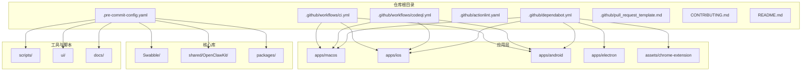
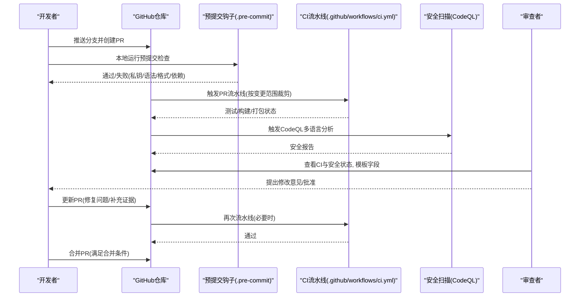
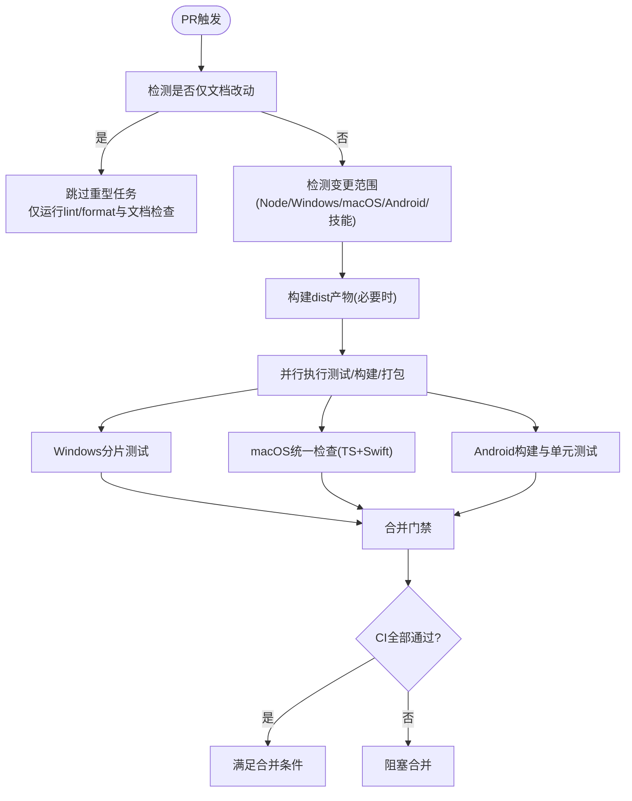
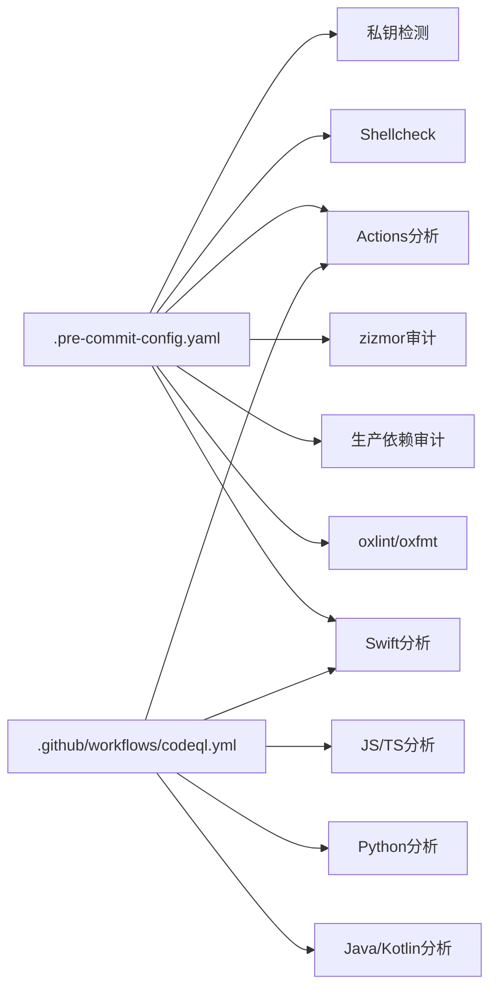
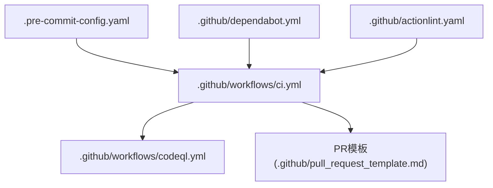

# Pull Request流程

<cite>
**本文档引用的文件**
- [.github/pull_request_template.md](file://.github/pull_request_template.md)
- [CONTRIBUTING.md](file://CONTRIBUTING.md)
- [README.md](file://README.md)
- [.github/workflows/ci.yml](file://.github/workflows/ci.yml)
- [.github/workflows/codeql.yml](file://.github/workflows/codeql.yml)
- [.github/dependabot.yml](file://.github/dependabot.yml)
- [.github/actionlint.yaml](file://.github/actionlint.yaml)
- [.pre-commit-config.yaml](file://.pre-commit-config.yaml)
- [Swabble/scripts/format.sh](file://Swabble/scripts/format.sh)
- [Swabble/scripts/lint.sh](file://Swabble/scripts/lint.sh)
</cite>

## 目录

1. [简介](#简介)
2. [项目结构](#项目结构)
3. [核心组件](#核心组件)
4. [架构总览](#架构总览)
5. [详细组件分析](#详细组件分析)
6. [依赖关系分析](#依赖关系分析)
7. [性能考量](#性能考量)
8. [故障排查指南](#故障排查指南)
9. [结论](#结论)
10. [附录](#附录)

## 简介

本指南面向OpenCLAW项目的贡献者，系统化阐述从准备到合并的完整Pull Request（PR）流程。内容覆盖PR创建前的本地测试与代码检查、CI验证策略、PR模板使用、分支命名与提交信息规范、审查流程、更新策略与冲突解决、合并条件以及质量检查清单与常见问题处理。

## 项目结构

OpenCLAW采用多语言混合工程：前端与核心逻辑以TypeScript/JavaScript为主，Swift用于macOS/iOS应用，Python用于技能脚本，Gradle用于Android，同时通过GitHub Actions实现跨平台CI与安全扫描。

图表来源

- [.github/workflows/ci.yml](file://.github/workflows/ci.yml)
- [.github/workflows/codeql.yml](file://.github/workflows/codeql.yml)
- [.github/dependabot.yml](file://.github/dependabot.yml)
- [.pre-commit-config.yaml](file://.pre-commit-config.yaml)

章节来源

- [README.md:1-560](file://README.md#L1-L560)

## 核心组件

- PR模板：强制填写问题背景、变更类型、影响范围、用户可见行为变化、安全影响、复现与验证、证据、人工验证、兼容性迁移、失败恢复、风险与缓解等字段，确保审查效率与可追溯性。
- 贡献指南：明确PR前置要求（本地测试、CI通过、聚焦单一主题、截图要求、AI辅助PR标注）、审查对话责任归属、控制UI装饰器约束等。
- CI流水线：按PR变更范围智能跳过无关任务，构建产物共享，多语言/多平台并行校验，Windows分片测试，macOS统一合并检查，Android构建与单元测试。
- 安全扫描：CodeQL多语言分析（JS/TS、Actions、Python、Java/Kotlin、Swift），结合本地与CI预提交钩子（私钥检测、Shellcheck、actionlint、zizmor审计、依赖审计）。
- 自动化依赖更新：Dependabot按生态分组与冷却期自动发起PR，限制并发数量，避免过度打断。

章节来源

- [.github/pull_request_template.md:1-116](file://.github/pull_request_template.md#L1-L116)
- [CONTRIBUTING.md:85-136](file://CONTRIBUTING.md#L85-L136)
- [.github/workflows/ci.yml:1-737](file://.github/workflows/ci.yml#L1-L737)
- [.github/workflows/codeql.yml:1-135](file://.github/workflows/codeql.yml#L1-L135)
- [.github/dependabot.yml:1-128](file://.github/dependabot.yml#L1-L128)
- [.pre-commit-config.yaml:1-158](file://.pre-commit-config.yaml#L1-L158)

## 架构总览

下图展示PR从创建到合并的关键路径：本地预检（pre-commit）→ 推送触发CI（按变更范围裁剪）→ 安全扫描（CodeQL/预提交）→ 审查与更新（模板驱动）→ 合并条件（CI通过+审查同意+无冲突）。

图表来源

- [.pre-commit-config.yaml:1-158](file://.pre-commit-config.yaml#L1-L158)
- [.github/workflows/ci.yml:1-737](file://.github/workflows/ci.yml#L1-L737)
- [.github/workflows/codeql.yml:1-135](file://.github/workflows/codeql.yml#L1-L135)
- [.github/pull_request_template.md:1-116](file://.github/pull_request_template.md#L1-L116)

## 详细组件分析

### PR模板使用指南

- 必填区域：摘要、变更类型（Bug修复/特性/重构/文档/安全加固/运维/杂项）、影响范围（网关/技能/认证/存储/集成/API/合约/UI/开发体验/CI/CD）、关联问题/PR、用户可见行为变化、安全影响、环境与步骤、期望/实际结果、证据、人工验证、兼容性与迁移、失败恢复、风险与缓解。
- 使用建议：
  - 在“摘要”中用要点说明问题、原因、变更与边界。
  - 变更类型与影响范围勾选尽量精确，便于CI按范围裁剪。
  - “证据”至少附带失败到通过的测试/日志或截图/录屏。
  - “人工验证”需列出作者已验证场景、边界用例及未验证项。
  - “审查对话”确保作者负责解决机器人/人工评论，仅保留需要维护者判断的问题。

章节来源

- [.github/pull_request_template.md:1-116](file://.github/pull_request_template.md#L1-L116)

### 分支命名规范与提交信息格式

- 分支命名：建议采用“类型/主题/简述”的层级形式，例如feature/add-swagger、fix/auth-token、docs/update-readme、chore/deps-update。
- 提交信息：遵循“类型: 主题”，正文说明动机与影响，引用Issue编号。示例：
  - feat(auth): 添加双因素认证支持
  - fix(gateway): 修复WebSocket连接断开重连
  - docs(readme): 更新安装与开发环境说明
  - chore(deps): 升级依赖版本
- 配套工具：
  - Swift格式化与检查脚本：[Swabble/scripts/format.sh](file://Swabble/scripts/format.sh)、[Swabble/scripts/lint.sh](file://Swabble/scripts/lint.sh)
  - 预提交配置：统一执行私钥检测、Shellcheck、actionlint、zizmor、依赖审计、oxlint/oxfmt、swiftlint/swiftformat等。

章节来源

- [CONTRIBUTING.md:85-136](file://CONTRIBUTING.md#L85-L136)
- [Swabble/scripts/format.sh:1-6](file://Swabble/scripts/format.sh#L1-L6)
- [Swabble/scripts/lint.sh:1-10](file://Swabble/scripts/lint.sh#L1-L10)
- [.pre-commit-config.yaml:1-158](file://.pre-commit-config.yaml#L1-L158)

### PR审查流程

- 审查对话责任：作者需处理所有由机器人/工具生成的评论，直至完全解决；仅在需要维护者/人工判断时保留未决讨论。
- AI辅助PR：若使用AI生成/辅助，请在标题或描述中标注，并提供测试程度说明、提示词或会话记录，确保可追溯。
- 截图要求：涉及UI/视觉变更时，必须提供变更前后截图。
- Codex审查：鼓励在本地运行Codex审查并处理发现后再请求审查。

章节来源

- [CONTRIBUTING.md:96-136](file://CONTRIBUTING.md#L96-L136)

### CI验证策略

- 文档变更快速通道：仅当仅文档改动时跳过重型任务，但仍需运行lint/format与文档检查。
- 变更范围检测：根据diff自动识别Node/Windows/macOS/Android/技能Python等受影响区域，PR可跳过无关任务。
- 并行与分片：
  - Node/TS测试与扩展测试并行执行。
  - Windows测试按分片并行，限制worker数与内存。
  - macOS统一合并检查（TS测试、Swift lint/build/test）。
  - Android构建与单元测试矩阵。
- 构建产物复用：Node相关构建产物上传供下游任务复用，缩短整体耗时。
- 并发控制：同一PR在不同工作流间设置互斥组，避免资源竞争。

图表来源

- [.github/workflows/ci.yml:13-215](file://.github/workflows/ci.yml#L13-L215)

章节来源

- [.github/workflows/ci.yml:1-737](file://.github/workflows/ci.yml#L1-L737)

### 安全扫描与合规

- CodeQL多语言分析：针对JavaScript/TypeScript、GitHub Actions、Python、Java/Kotlin、Swift分别初始化与构建，再进行分析。
- 预提交安全：私钥检测、Shell脚本与GitHub Actions lint、zizmor工作流安全审计、生产依赖审计、oxlint/oxfmt、swiftlint/swiftformat。
- 依赖更新：Dependabot按生态与分组自动发起PR，设置冷却期与并发上限，减少噪音。

图表来源

- [.pre-commit-config.yaml:1-158](file://.pre-commit-config.yaml#L1-L158)
- [.github/workflows/codeql.yml:1-135](file://.github/workflows/codeql.yml#L1-L135)

章节来源

- [.github/workflows/codeql.yml:1-135](file://.github/workflows/codeql.yml#L1-L135)
- [.pre-commit-config.yaml:1-158](file://.pre-commit-config.yaml#L1-L158)
- [.github/actionlint.yaml:1-24](file://.github/actionlint.yaml#L1-L24)
- [.github/dependabot.yml:1-128](file://.github/dependabot.yml#L1-L128)

### PR更新策略与冲突解决

- 更新策略：
  - 优先在本地完成预检（pre-commit、本地测试、格式化），减少CI失败成本。
  - 修改后重新推送，保持提交历史整洁；必要时使用变基更新PR基线。
- 冲突解决：
  - 当上游main有新提交导致冲突时，先在本地将main rebase到你的分支，解决冲突后force push。
  - 若多人协作，建议使用squash合并以简化历史。
- 合并条件：
  - CI流水线全部通过（含按范围裁剪后的任务）。
  - 安全扫描无高危/严重风险。
  - 审查者批准，且作者已解决所有机器人/人工评论。
  - PR模板关键字段填写完整（尤其是证据、人工验证、兼容性迁移、失败恢复、风险与缓解）。

章节来源

- [CONTRIBUTING.md:85-136](file://CONTRIBUTING.md#L85-L136)
- [.github/workflows/ci.yml:1-737](file://.github/workflows/ci.yml#L1-L737)
- [.github/pull_request_template.md:1-116](file://.github/pull_request_template.md#L1-L116)

## 依赖关系分析

- 预提交钩子与CI一致性：预提交执行的规则与CI一致，降低“本地通过、CI失败”的概率。
- Dependabot与CI：自动化依赖更新PR在CI中得到验证，减少引入不兼容升级的风险。
- 工作流互斥：同一PR在不同工作流间设置并发组，避免资源争用。

图表来源

- [.pre-commit-config.yaml:1-158](file://.pre-commit-config.yaml#L1-L158)
- [.github/workflows/ci.yml:1-737](file://.github/workflows/ci.yml#L1-L737)
- [.github/workflows/codeql.yml:1-135](file://.github/workflows/codeql.yml#L1-L135)
- [.github/dependabot.yml:1-128](file://.github/dependabot.yml#L1-L128)
- [.github/actionlint.yaml:1-24](file://.github/actionlint.yaml#L1-L24)
- [.github/pull_request_template.md:1-116](file://.github/pull_request_template.md#L1-L116)

章节来源

- [.pre-commit-config.yaml:1-158](file://.pre-commit-config.yaml#L1-L158)
- [.github/workflows/ci.yml:1-737](file://.github/workflows/ci.yml#L1-L737)
- [.github/dependabot.yml:1-128](file://.github/dependabot.yml#L1-L128)
- [.github/actionlint.yaml:1-24](file://.github/actionlint.yaml#L1-L24)

## 性能考量

- CI范围裁剪：仅对受变更影响的区域运行重型任务，显著缩短PR反馈周期。
- 构建产物复用：Node构建产物在后续任务中复用，避免重复编译。
- Windows分片：将测试拆分为多个分片并行执行，同时限制worker数与内存，提升稳定性。
- 预提交缓存：SwiftPM缓存、pnpm store缓存、actions/cache等减少重复安装与编译时间。

章节来源

- [.github/workflows/ci.yml:13-215](file://.github/workflows/ci.yml#L13-L215)
- [.pre-commit-config.yaml:1-158](file://.pre-commit-config.yaml#L1-L158)

## 故障排查指南

- CI失败
  - 检查“变更范围”矩阵是否正确识别，必要时在PR中补充说明影响范围。
  - 关注Windows分片超时与内存不足，适当减少并发或增大内存。
  - macOS统一检查失败时，优先修复Swift lint/build/test问题。
- 安全扫描告警
  - CodeQL报告需逐条确认，高/严重风险必须修复。
  - 预提交zizmor与actionlint告警需修正工作流安全问题。
- 预提交失败
  - 私钥检测：移除或加密敏感信息，更新基线。
  - Shellcheck：修正脚本语法与潜在问题。
  - swiftlint/swiftformat：按配置修复格式与风格问题。
  - 依赖审计：升级至安全版本或调整锁定文件。
- Dependabot噪音
  - 合理设置冷却期与分组，避免频繁PR打断。
  - 对重大升级采用手动审阅与测试。

章节来源

- [.github/workflows/ci.yml:1-737](file://.github/workflows/ci.yml#L1-L737)
- [.github/workflows/codeql.yml:1-135](file://.github/workflows/codeql.yml#L1-L135)
- [.pre-commit-config.yaml:1-158](file://.pre-commit-config.yaml#L1-L158)
- [.github/dependabot.yml:1-128](file://.github/dependabot.yml#L1-L128)

## 结论

通过严格遵循PR模板、在本地完成全面预检、利用CI范围裁剪与并行加速、配合CodeQL与预提交安全扫描、以及清晰的审查与更新流程，可以显著提升PR质量与合并效率。请始终确保模板关键字段完整、证据充分、兼容性与风险可控，并在审查者批准后方可合并。

## 附录

### PR质量检查清单

- [ ] 本地测试：通过构建、类型检查、lint/format、单元测试与端到端测试
- [ ] CI状态：所有按范围裁剪后的任务均通过
- [ ] 安全扫描：无高/严重风险，预提交与CodeQL均通过
- [ ] 模板填写：摘要、变更类型、影响范围、用户可见变化、安全影响、复现步骤、证据、人工验证、兼容性迁移、失败恢复、风险与缓解完整
- [ ] 截图：UI/视觉变更提供变更前后截图
- [ ] 审查对话：作者已解决所有机器人/工具评论，仅保留需要维护者判断的问题
- [ ] 合并条件：CI通过+审查批准+无冲突+模板完整

### 常见问题与解决方案

- 问：为什么我的PR被跳过了重型任务？
  - 答：仅文档改动时会跳过Node/Windows/macOS/Android/技能Python等任务，但仍需运行lint/format与文档检查。
- 问：Windows测试不稳定怎么办？
  - 答：关注分片超时与内存限制，减少并发或增大内存；必要时在PR中说明环境差异。
- 问：Swift lint/build/test失败如何处理？
  - 答：按swiftlint/swiftformat配置修复格式与风格问题，必要时清理缓存后重试。
- 问：依赖更新PR太多如何应对？
  - 答：合理设置Dependabot冷却期与分组，重大升级采用手动审阅与测试。
