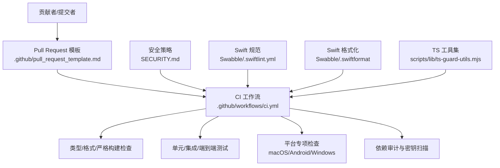
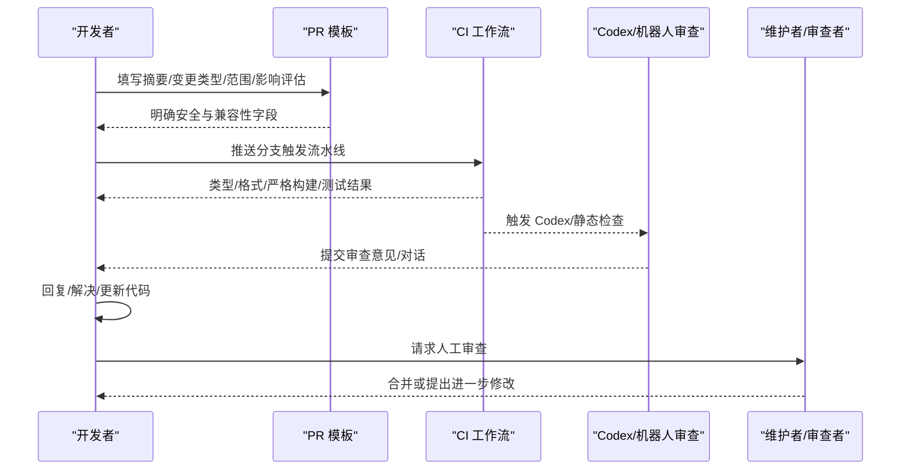
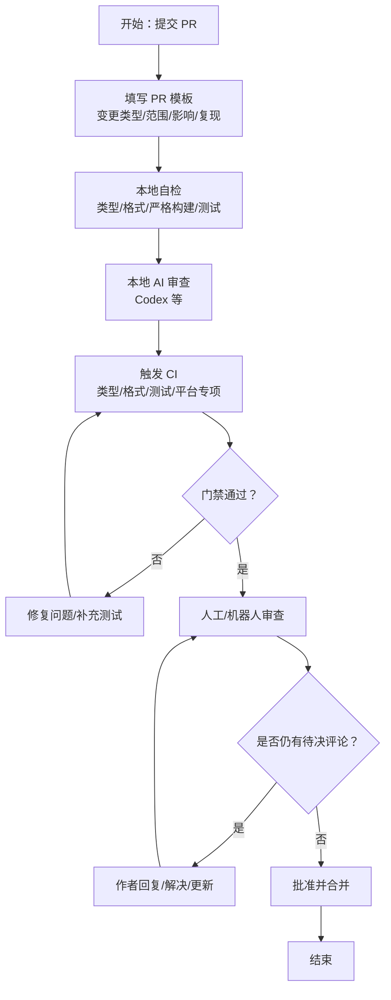
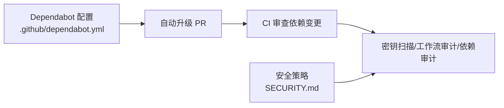
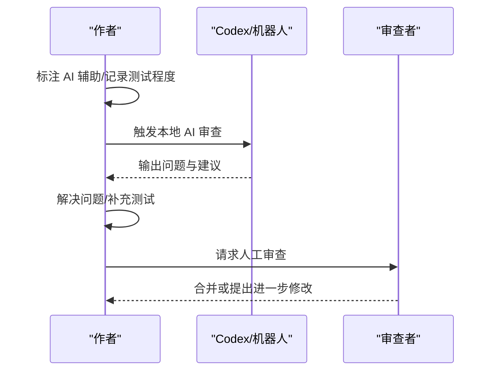

# 代码审查标准

<cite>
**本文引用的文件**
- [CONTRIBUTING.md](file://CONTRIBUTING.md)
- [.github/pull_request_template.md](file://.github/pull_request_template.md)
- [.github/workflows/ci.yml](file://.github/workflows/ci.yml)
- [.github/dependabot.yml](file://.github/dependabot.yml)
- [SECURITY.md](file://SECURITY.md)
- [docs/security/README.md](file://docs/security/README.md)
- [Swabble/.swiftlint.yml](file://Swabble/.swiftlint.yml)
- [Swabble/.swiftformat](file://Swabble/.swiftformat)
- [scripts/lib/ts-guard-utils.mjs](file://scripts/lib/ts-guard-utils.mjs)
- [.pi/prompts/reviewpr.md](file://.pi/prompts/reviewpr.md)
- [extensions/open-prose/skills/prose/examples/03-code-review.prose](file://extensions/open-prose/skills/prose/examples/03-code-review.prose)
</cite>

## 目录

1. 引言
2. 项目结构
3. 核心组件
4. 架构总览
5. 详细组件分析
6. 依赖关系分析
7. 性能考量
8. 故障排查指南
9. 结论
10. 附录

## 引言

本指南面向所有贡献者与维护者，系统化定义代码审查的标准与流程，覆盖审查职责、代码质量与安全基线、性能关注点、审查对话处理、AI辅助代码的特殊要求，以及效率提升技巧与常见问题识别。目标是统一评审口径、降低回归风险、加速交付并保障整体安全与可维护性。

## 项目结构

OpenClaw 是一个多语言、多平台的工程，包含 Node.js/TypeScript 前后端、Swift/macOS 应用、Android 应用、Electron 桌面应用、大量插件与技能脚本，以及完善的 CI/CD 流水线与安全策略。审查范围应覆盖：

- 核心网关与 CLI（Node/TypeScript）
- 平台客户端（iOS/macOS/Android/Electron）
- 插件与技能生态（Python/Shell/JS）
- 文档与配置（工作流、依赖更新、安全策略）

图表来源

- [.github/workflows/ci.yml:1-737](file://.github/workflows/ci.yml#L1-L737)
- [SECURITY.md:1-288](file://SECURITY.md#L1-L288)
- [Swabble/.swiftlint.yml:1-44](file://Swabble/.swiftlint.yml#L1-L44)
- [Swabble/.swiftformat:1-9](file://Swabble/.swiftformat#L1-L9)
- [scripts/lib/ts-guard-utils.mjs:1-158](file://scripts/lib/ts-guard-utils.mjs#L1-L158)

章节来源

- [.github/workflows/ci.yml:1-737](file://.github/workflows/ci.yml#L1-L737)
- [SECURITY.md:1-288](file://SECURITY.md#L1-L288)

## 核心组件

- 质量门禁：类型检查、格式化、严格构建烟测、UI 安全规则（禁止原始 window.open）、文档检查
- 平台专项：macOS Swift lint/build/test；Android Gradle 构建与单元测试；Windows 分片并行测试
- 依赖与安全：Dependabot 自动升级、密钥扫描、工作流审计、生产依赖审计
- 审查模板与流程：PR 模板强制填写范围、影响评估、复现步骤、兼容性与回滚预案
- AI 辅助：明确标注、本地 Codex 审查、Bot 审查对话自闭环

章节来源

- [.github/workflows/ci.yml:139-235](file://.github/workflows/ci.yml#L139-L235)
- [.github/workflows/ci.yml:458-530](file://.github/workflows/ci.yml#L458-L530)
- [.github/workflows/ci.yml:691-736](file://.github/workflows/ci.yml#L691-L736)
- [.github/dependabot.yml:1-128](file://.github/dependabot.yml#L1-L128)
- [.github/pull_request_template.md:1-116](file://.github/pull_request_template.md#L1-L116)
- [CONTRIBUTING.md:85-106](file://CONTRIBUTING.md#L85-L106)

## 架构总览

审查流程由“提交者自检 + CI 自动门禁 + 人工/机器人审查 + 安全与合规”构成，贯穿 PR 生命周期。

图表来源

- [.github/pull_request_template.md:1-116](file://.github/pull_request_template.md#L1-L116)
- [.github/workflows/ci.yml:139-235](file://.github/workflows/ci.yml#L139-L235)
- [CONTRIBUTING.md:85-106](file://CONTRIBUTING.md#L85-L106)

## 详细组件分析

### 1) 审查职责与要求

- 提交者责任
  - 本地测试与构建通过（类型检查、格式化、严格构建烟测）
  - 运行本地 AI 审查（如 Codex），并将发现的问题在请求审查前解决或解释
  - 在 PR 模板中完整填写变更范围、用户可见变化、安全影响、兼容性与回滚预案
  - 对审查对话进行闭环：解决或回复 Bot 的评论，仅保留需要人工判断的问题
- 审查者责任
  - 关注安全边界与信任模型（参考安全策略），确保未引入越权、注入、暴露等风险
  - 关注性能与资源占用（阻塞操作、内存分配、并发与分片）
  - 关注可维护性（重复逻辑、命名清晰度、文档与注释）
  - 确认平台专项检查已通过（macOS Swift lint/build/test、Android 构建/测试、Windows 分片测试）
  - 对 AI 辅助代码进行额外验证：确认透明度标记、测试覆盖与可复现证据

章节来源

- [CONTRIBUTING.md:85-106](file://CONTRIBUTING.md#L85-L106)
- [.github/pull_request_template.md:1-116](file://.github/pull_request_template.md#L1-L116)
- [SECURITY.md:88-172](file://SECURITY.md#L88-L172)

### 2) 代码质量标准

- TypeScript/JavaScript
  - 类型检查与严格构建烟测必须通过
  - 格式化与风格检查（含 UI 外链安全规则）
  - 单元/集成/端到端测试覆盖
  - 使用工具集进行文件收集与违规检测（如测试文件识别、路径解析）
- Swift（macOS）
  - SwiftLint 规则启用，长度与风格约束
  - SwiftFormat 统一格式
  - Swift 构建与测试顺序执行，覆盖率门禁
- Android
  - Gradle 构建与单元测试
- 文档
  - 文档格式、链接与内容检查

章节来源

- [.github/workflows/ci.yml:189-235](file://.github/workflows/ci.yml#L189-L235)
- [.github/workflows/ci.yml:458-530](file://.github/workflows/ci.yml#L458-L530)
- [.github/workflows/ci.yml:691-736](file://.github/workflows/ci.yml#L691-L736)
- [Swabble/.swiftlint.yml:1-44](file://Swabble/.swiftlint.yml#L1-L44)
- [Swabble/.swiftformat:1-9](file://Swabble/.swiftformat#L1-L9)
- [scripts/lib/ts-guard-utils.mjs:1-158](file://scripts/lib/ts-guard-utils.mjs#L1-L158)

### 3) 性能考虑

- 阻塞与并发
  - 避免主线程阻塞操作；对 IO 密集任务使用异步与并发控制
  - Windows 测试采用分片并行，注意资源上限与稳定性
- 内存与资源
  - CI 中为 Node 测试设置合理的堆大小与并行度，避免 OOM
- 平台差异
  - macOS/Android/Windows 专项检查确保三端性能与稳定性

章节来源

- [.github/workflows/ci.yml:330-453](file://.github/workflows/ci.yml#L330-L453)
- [.github/workflows/ci.yml:458-530](file://.github/workflows/ci.yml#L458-L530)
- [.github/workflows/ci.yml:691-736](file://.github/workflows/ci.yml#L691-L736)

### 4) 安全检查

- 信任模型与边界
  - 明确“受信任操作员”模型，避免将会话标识视为授权边界
  - 插件与扩展属于可信计算基，需边界绕过才构成漏洞
- 部署与运行时
  - 网关控制 UI 仅限本地使用；远程访问建议隧道或尾网
  - Docker 运行建议只读文件系统与能力降级
- 审计与扫描
  - 生产依赖审计、工作流审计、密钥扫描（detect-secrets）
  - Node 版本需满足安全补丁要求

章节来源

- [SECURITY.md:88-172](file://SECURITY.md#L88-L172)
- [SECURITY.md:207-288](file://SECURITY.md#L207-L288)
- [.github/workflows/ci.yml:262-328](file://.github/workflows/ci.yml#L262-L328)

### 5) 审查对话处理

- 作者闭环
  - Bot 审查对话需由作者回复或解决；仅保留需要人工判断的问题
  - 若 Codex 未触发，仍需本地运行并按输出处理
- 人类审查
  - 审查者关注安全与架构一致性，必要时要求补充测试或文档
  - 对于 AI 辅助代码，要求提供测试覆盖与提示/会话日志以便复核

章节来源

- [CONTRIBUTING.md:96-106](file://CONTRIBUTING.md#L96-L106)

### 6) AI 辅助代码审查特殊要求

- 透明度
  - 在 PR 标题或描述中标注“AI 辅助”
  - 记录测试程度（未测试/轻量测试/充分测试）
  - 提供提示词或会话日志以供复核
- 可验证性
  - 作者需确认理解所生成代码
  - 本地运行 Codex 审查并解决相关问题后再请求人工审查
- 对话管理
  - AI 审查产生的对话由作者负责跟进与闭环

章节来源

- [CONTRIBUTING.md:123-137](file://CONTRIBUTING.md#L123-L137)

### 7) 审查流程图（从提交到合并）

图表来源

- [.github/pull_request_template.md:1-116](file://.github/pull_request_template.md#L1-L116)
- [.github/workflows/ci.yml:139-235](file://.github/workflows/ci.yml#L139-L235)
- [CONTRIBUTING.md:85-106](file://CONTRIBUTING.md#L85-L106)

## 依赖关系分析

- 依赖自动更新
  - Dependabot 按日调度，限制 PR 数量，分组管理生产/开发依赖
  - GitHub Actions、Swift、Gradle、Docker 均纳入自动升级范围
- 安全与合规
  - CI 中包含密钥扫描、工作流审计与生产依赖审计
  - 安全策略文档明确报告流程与范围

图表来源

- [.github/dependabot.yml:1-128](file://.github/dependabot.yml#L1-L128)
- [.github/workflows/ci.yml:262-328](file://.github/workflows/ci.yml#L262-L328)
- [SECURITY.md:1-288](file://SECURITY.md#L1-L288)

章节来源

- [.github/dependabot.yml:1-128](file://.github/dependabot.yml#L1-L128)
- [.github/workflows/ci.yml:262-328](file://.github/workflows/ci.yml#L262-L328)
- [SECURITY.md:1-288](file://SECURITY.md#L1-L288)

## 性能考量

- 测试并行与资源
  - Windows 测试采用分片并行，限制并发以保证稳定性
  - Node 测试设置堆大小与并行工作进程数，避免 OOM
- 平台专项
  - macOS Swift 构建与测试串行执行，减少资源竞争
  - Android Gradle 构建与单元测试独立矩阵

章节来源

- [.github/workflows/ci.yml:330-453](file://.github/workflows/ci.yml#L330-L453)
- [.github/workflows/ci.yml:458-530](file://.github/workflows/ci.yml#L458-L530)
- [.github/workflows/ci.yml:691-736](file://.github/workflows/ci.yml#L691-L736)

## 故障排查指南

- 常见失败场景
  - 类型/格式/严格构建失败：优先修复类型错误与风格问题
  - UI 安全规则失败：避免使用原始 window.open 等不安全调用
  - 测试 OOM 或不稳定：调整并行度与堆大小，或拆分测试用例
  - 平台专项失败：针对 macOS/Android/Windows 的工具链与版本进行适配
- 审查对话未被清理
  - 检查是否已在本地解决或回复 Bot 的评论
  - 若 Codex 未触发，需本地运行并按输出处理
- 安全相关拒绝
  - 若涉及越权、注入、暴露等风险，需在安全策略范围内进行边界绕过证明或重构

章节来源

- [.github/workflows/ci.yml:189-235](file://.github/workflows/ci.yml#L189-L235)
- [CONTRIBUTING.md:96-106](file://CONTRIBUTING.md#L96-L106)
- [SECURITY.md:88-172](file://SECURITY.md#L88-L172)

## 结论

本指南将质量门禁、安全基线、性能关注与审查流程标准化，结合 AI 辅助的透明度与可验证性要求，形成从提交到合并的闭环。遵循上述标准可显著提升交付质量与安全性，并降低回归风险。

## 附录

### A. 审查清单（摘要）

- 本地自检：类型/格式/严格构建/测试
- 安全影响：越权、注入、暴露、边界绕过
- 性能影响：阻塞、内存、并发与平台差异
- 平台专项：macOS Swift、Android、Windows
- 文档与模板：PR 模板字段齐全、复现与证据
- AI 透明度：标注、测试、提示/会话日志
- 审查对话：作者闭环、Bot 清理、仅留人工判断项

### B. 参考流程（AI 辅助代码审查）

图表来源

- [CONTRIBUTING.md:123-137](file://CONTRIBUTING.md#L123-L137)
- [.pi/prompts/reviewpr.md:131-135](file://.pi/prompts/reviewpr.md#L131-L135)
- [extensions/open-prose/skills/prose/examples/03-code-review.prose:1-17](file://extensions/open-prose/skills/prose/examples/03-code-review.prose#L1-L17)
