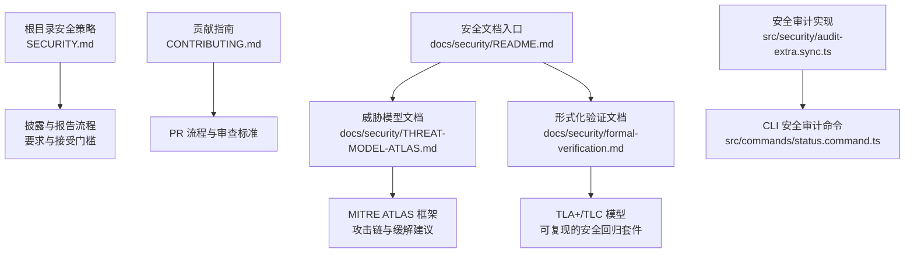
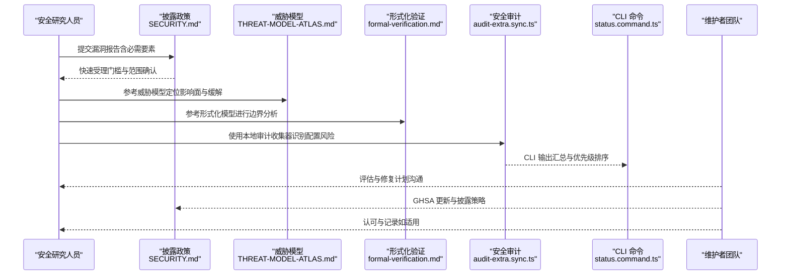
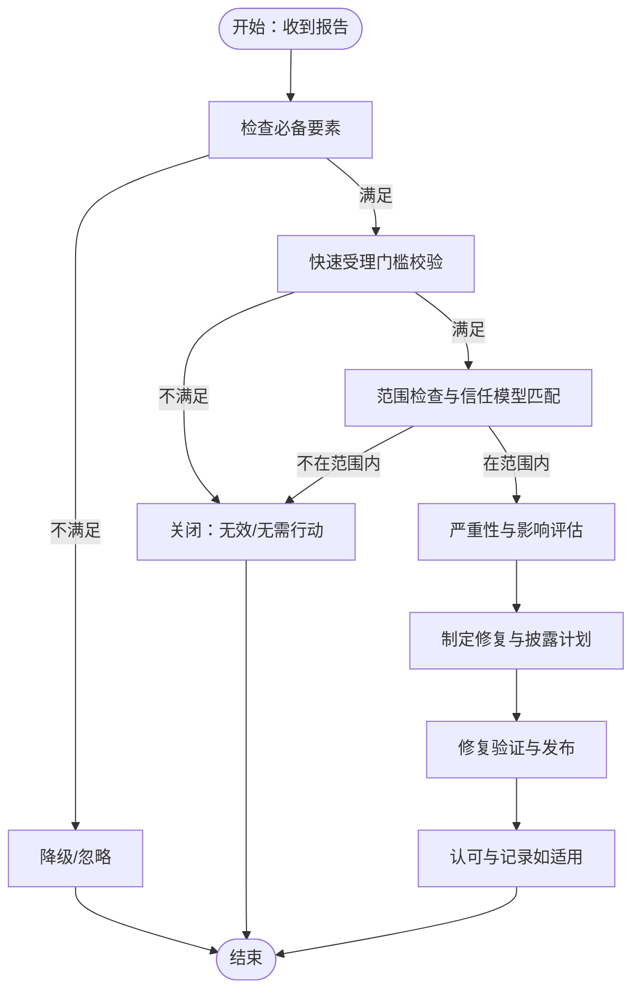
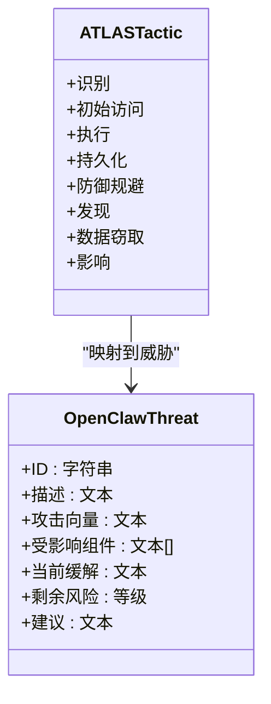
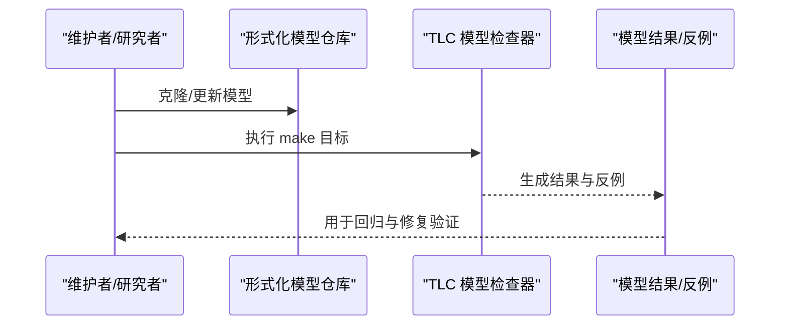
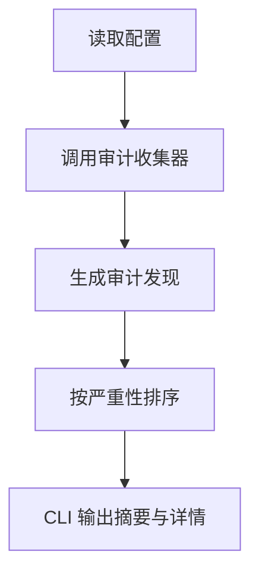
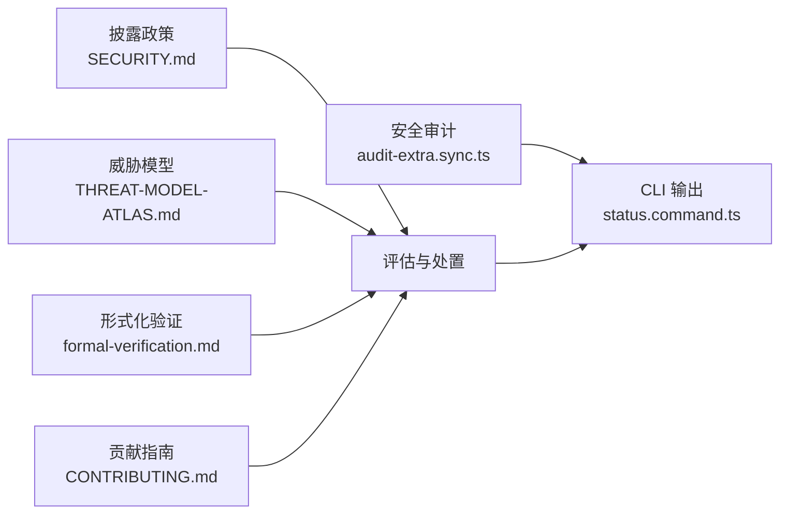

# 安全贡献

<cite>
**本文档引用的文件**
- [SECURITY.md](file://SECURITY.md)
- [CONTRIBUTING.md](file://CONTRIBUTING.md)
- [docs/security/README.md](file://docs/security/README.md)
- [docs/security/CONTRIBUTING-THREAT-MODEL.md](file://docs/security/CONTRIBUTING-THREAT-MODEL.md)
- [docs/security/THREAT-MODEL-ATLAS.md](file://docs/security/THREAT-MODEL-ATLAS.md)
- [docs/security/formal-verification.md](file://docs/security/formal-verification.md)
- [src/security/audit-extra.sync.ts](file://src/security/audit-extra.sync.ts)
- [src/commands/status.command.ts](file://src/commands/status.command.ts)
</cite>

## 目录

1. [简介](#简介)
2. [项目结构](#项目结构)
3. [核心组件](#核心组件)
4. [架构总览](#架构总览)
5. [详细组件分析](#详细组件分析)
6. [依赖关系分析](#依赖关系分析)
7. [性能考量](#性能考量)
8. [故障排查指南](#故障排查指南)
9. [结论](#结论)
10. [附录](#附录)

## 简介

本指南面向安全研究人员与贡献者，系统阐述 OpenClaw 的安全漏洞发现、报告、评估、处置与修复流程，覆盖漏洞分类、严重性评估、披露政策、负责任披露原则、奖励机制、安全测试方法、漏洞利用演示与修复验证流程，并说明安全贡献的认可方式与保密协议要求。同时，结合威胁模型与形式化验证，帮助理解系统的信任边界与关键风险路径。

## 项目结构

围绕“安全贡献”的文档与实现主要分布在以下区域：

- 安全政策与披露：根目录安全策略与披露政策
- 贡献指南：通用贡献流程与安全相关要求
- 威胁模型与形式化验证：系统级威胁建模与形式化安全模型
- 安全审计与 CLI：本地安全审计能力与命令行输出
- 文档站点：安全与信任页面、威胁模型文档入口

图表来源

- [SECURITY.md:1-288](file://SECURITY.md#L1-L288)
- [CONTRIBUTING.md:1-194](file://CONTRIBUTING.md#L1-L194)
- [docs/security/THREAT-MODEL-ATLAS.md:1-604](file://docs/security/THREAT-MODEL-ATLAS.md#L1-L604)
- [docs/security/formal-verification.md:1-168](file://docs/security/formal-verification.md#L1-L168)
- [src/security/audit-extra.sync.ts:1-200](file://src/security/audit-extra.sync.ts#L1-L200)
- [src/commands/status.command.ts:473-508](file://src/commands/status.command.ts#L473-L508)
- [docs/security/README.md:1-18](file://docs/security/README.md#L1-L18)

章节来源

- [SECURITY.md:1-288](file://SECURITY.md#L1-L288)
- [CONTRIBUTING.md:1-194](file://CONTRIBUTING.md#L1-L194)
- [docs/security/README.md:1-18](file://docs/security/README.md#L1-L18)

## 核心组件

- 披露与报告政策：定义漏洞报告渠道、必需信息、快速受理门槛、常见误报模式、重复报告处理、范围与信任模型、部署假设、Web 界面安全建议、运行时要求与安全扫描等。
- 贡献与协作：通用贡献流程、PR 标准、AI 协作标注、审查对话归属、维护者团队与联系方式。
- 威胁模型：基于 MITRE ATLAS 的系统级威胁建模，涵盖识别、攻击链、缓解与风险矩阵。
- 形式化验证：TLA+/TLC 可复现模型，覆盖网关暴露、节点执行管道、配对存储、入口门控、路由隔离等关键路径。
- 安全审计与 CLI：本地安全审计收集器与 CLI 输出，帮助识别配置风险与加固建议。

章节来源

- [SECURITY.md:1-288](file://SECURITY.md#L1-L288)
- [CONTRIBUTING.md:79-194](file://CONTRIBUTING.md#L79-L194)
- [docs/security/THREAT-MODEL-ATLAS.md:1-604](file://docs/security/THREAML.TA0005/3.2 执行 (AML.TA0005)
- [docs/security/formal-verification.md:1-168](file://docs/security/formal-verification.md#L1-L168)
- [src/security/audit-extra.sync.ts:1-200](file://src/security/audit-extra.sync.ts#L1-L200)
- [src/commands/status.command.ts:473-508](file://src/commands/status.command.ts#L473-L508)

## 架构总览

OpenClaw 的安全贡献体系由“披露—评估—处置—修复—验证—认可”闭环构成，贯穿威胁建模与形式化验证两条主线，辅以本地安全审计与 CLI 工具。

图表来源

- [SECURITY.md:33-86](file://SECURITY.md#L33-L86)
- [docs/security/THREAT-MODEL-ATLAS.md:485-527](file://docs/security/THREAT-MODEL-ATLAS.md#L485-L527)
- [docs/security/formal-verification.md:37-54](file://docs/security/formal-verification.md#L37-L54)
- [src/security/audit-extra.sync.ts:1-200](file://src/security/audit-extra.sync.ts#L1-L200)
- [src/commands/status.command.ts:473-508](file://src/commands/status.command.ts#L473-L508)

## 详细组件分析

### 组件一：漏洞报告与披露流程

- 报告渠道与路由：按组件归属选择对应仓库，不确定时发送邮件至安全邮箱，由团队路由。
- 必备要素：标题、严重性评估、影响、受影响组件、技术复现、已展示影响、环境、修复建议。
- 快速受理门槛：精确脆弱路径、版本/提交 SHA、可复现 PoC、与信任边界关联的影响、凭证归属证明、无多租户假设、范围说明、命令风险差异需提供边界绕过路径。
- 常见误报：仅提示注入、受信任操作员触发、显式受信任控制面、授权用户本地动作、仅显示插件安装后特权行为、多租户假设、启发式差异、需要受信任配置输入的 DoS、需要预置受信文件系统状态、替换已批准可执行路径、Microsoft Teams URL 控制等。
- 重复报告处理：搜索现有公告，报告中包含可能的 GHSA 编号，维护者可关闭低质量/晚到重复报告。
- 奖励机制：当前无预算的赏金计划，鼓励通过 PR 贡献修复。

图表来源

- [SECURITY.md:20-86](file://SECURITY.md#L20-L86)
- [SECURITY.md:48-132](file://SECURITY.md#L48-L132)
- [SECURITY.md:69-74](file://SECURITY.md#L69-L74)
- [SECURITY.md:79-82](file://SECURITY.md#L79-L82)

章节来源

- [SECURITY.md:20-86](file://SECURITY.md#L20-L86)
- [SECURITY.md:48-132](file://SECURITY.md#L48-L132)
- [SECURITY.md:69-74](file://SECURITY.md#L69-L74)
- [SECURITY.md:79-82](file://SECURITY.md#L79-L82)

### 组件二：漏洞分类与严重性评估

- 分类依据：MITRE ATLAS 战术（如侦察、初始访问、执行、持久化、防御规避、发现、数据窃取与影响）映射到 OpenClaw 具体威胁 ID。
- 严重性等级：关键、高、中、低，结合发生概率与影响进行风险矩阵评估。
- 关键路径攻击链：技能供应链数据窃取、提示注入到远程命令执行、间接注入经由抓取内容等。

图表来源

- [docs/security/THREAT-MODEL-ATLAS.md:138-527](file://docs/security/THREAT-MODEL-ATLAS.md#L138-L527)

章节来源

- [docs/security/THREAT-MODEL-ATLAS.md:138-527](file://docs/security/THREAT-MODEL-ATLAS.md#L138-L527)

### 组件三：威胁模型贡献与认可

- 贡献方式：新增威胁、建议缓解、提出攻击链、改进现有内容。
- MITRE ATLAS 与威胁 ID：按类别分配 T-EXEC-001 等编号，风险等级由维护者评估。
- 认可机制：威胁模型贡献者可在致谢、发行说明与安全名人堂中获得认可。

章节来源

- [docs/security/CONTRIBUTING-THREAT-MODEL.md:1-91](file://docs/security/CONTRIBUTING-THREAT-MODEL.md#L1-L91)

### 组件四：形式化验证与安全回归

- 目标：在明确假设下，用机器检查论证授权、会话隔离、工具门控与误配置安全。
- 方法：TLA+/TLC 模型检查，提供正向与负向模型（反例追踪），支持本地复现。
- 关键模型：网关暴露、节点执行管道、配对存储、入口门控、路由隔离、并发与幂等性等。

图表来源

- [docs/security/formal-verification.md:27-54](file://docs/security/formal-verification.md#L27-L54)
- [docs/security/formal-verification.md:56-168](file://docs/security/formal-verification.md#L56-L168)

章节来源

- [docs/security/formal-verification.md:1-168](file://docs/security/formal-verification.md#L1-L168)

### 组件五：安全审计与 CLI 输出

- 安全审计收集器：基于配置的安全属性分析，识别工具策略、沙箱、网关认证、浏览器配置、模型参数等潜在风险。
- CLI 命令：在状态命令中汇总并展示安全审计结果，按严重性排序，突出关键与警告项。

图表来源

- [src/security/audit-extra.sync.ts:1-200](file://src/security/audit-extra.sync.ts#L1-L200)
- [src/commands/status.command.ts:473-508](file://src/commands/status.command.ts#L473-L508)

章节来源

- [src/security/audit-extra.sync.ts:1-200](file://src/security/audit-extra.sync.ts#L1-L200)
- [src/commands/status.command.ts:473-508](file://src/commands/status.command.ts#L473-L508)

### 组件六：Web 界面与部署安全指引

- Web 界面仅限本地使用：推荐绑定回环地址，避免直接暴露公网；危险地禁用设备认证仅限本地断路场景。
- Docker 安全：非 root 用户运行、只读文件系统、丢弃多余能力。
- 运行时要求：Node.js 版本包含重要安全补丁，需确保版本满足要求。

章节来源

- [SECURITY.md:207-288](file://SECURITY.md#L207-L288)

### 组件七：安全测试方法与漏洞利用演示

- 安全扫描：CI/CD 中使用 detect-secrets 检测机密泄露，支持本地扫描与基线比对。
- 本地审计：通过安全审计收集器与 CLI 命令识别配置风险，形成修复清单。
- 演示与验证：结合威胁模型与形式化模型，针对关键路径构造 PoC 并验证修复效果。

章节来源

- [SECURITY.md:277-288](file://SECURITY.md#L277-L288)
- [docs/security/THREAT-MODEL-ATLAS.md:530-557](file://docs/security/THREAT-MODEL-ATLAS.md#L530-L557)
- [docs/security/formal-verification.md:37-54](file://docs/security/formal-verification.md#L37-L54)

### 组件八：修复验证与发布

- 修复验证：结合威胁模型与形式化模型，确保边界绕过被阻断、工具策略与沙箱生效、配置变更符合最小权限原则。
- 发布与披露：遵循披露政策，必要时通过 CLI 更新 GHSA，确保字段完整（含 CVSS）。

章节来源

- [SECURITY.md:84-86](file://SECURITY.md#L84-L86)
- [docs/security/THREAT-MODEL-ATLAS.md:530-557](file://docs/security/THREAT-MODEL-ATLAS.md#L530-L557)

### 组件九：安全贡献认可与保密协议

- 认可方式：威胁模型贡献者可在致谢、发行说明与安全名人堂中获得认可。
- 保密要求：报告应遵循负责任披露原则，避免在未修复前公开细节；涉及凭证的报告需证明归属与影响。

章节来源

- [docs/security/CONTRIBUTING-THREAT-MODEL.md:88-91](file://docs/security/CONTRIBUTING-THREAT-MODEL.md#L88-L91)
- [SECURITY.md:16-18](file://SECURITY.md#L16-L18)

## 依赖关系分析

- 政策与流程依赖：披露政策定义受理门槛与范围，直接影响后续评估与处置。
- 威胁模型与形式化验证：共同为漏洞评估与修复提供理论与实证支撑。
- 安全审计与 CLI：作为落地工具，将抽象的威胁与模型转化为可操作的风险清单。
- 贡献指南：规范 PR 与审查流程，保障修复质量与可追溯性。

图表来源

- [SECURITY.md:1-288](file://SECURITY.md#L1-L288)
- [docs/security/THREAT-MODEL-ATLAS.md:1-604](file://docs/security/THREAT-MODEL-ATLAS.md#L1-L604)
- [docs/security/formal-verification.md:1-168](file://docs/security/formal-verification.md#L1-L168)
- [src/security/audit-extra.sync.ts:1-200](file://src/security/audit-extra.sync.ts#L1-L200)
- [src/commands/status.command.ts:473-508](file://src/commands/status.command.ts#L473-L508)
- [CONTRIBUTING.md:79-194](file://CONTRIBUTING.md#L79-L194)

章节来源

- [SECURITY.md:1-288](file://SECURITY.md#L1-L288)
- [docs/security/THREAT-MODEL-ATLAS.md:1-604](file://docs/security/THREAT-MODEL-ATLAS.md#L1-L604)
- [docs/security/formal-verification.md:1-168](file://docs/security/formal-verification.md#L1-L168)
- [src/security/audit-extra.sync.ts:1-200](file://src/security/audit-extra.sync.ts#L1-L200)
- [src/commands/status.command.ts:473-508](file://src/commands/status.command.ts#L473-L508)
- [CONTRIBUTING.md:79-194](file://CONTRIBUTING.md#L79-L194)

## 性能考量

- 安全扫描与审计：detect-secrets 与本地安全审计均属于静态分析，建议在 CI 中分层执行，避免重复扫描。
- 形式化模型：TLC 模型检查受限于状态空间，建议优先覆盖高风险路径，逐步扩展模型规模。
- CLI 输出：仅输出关键与警告项，减少冗余信息，提升可读性。

## 故障排查指南

- 报告被降级/忽略：检查是否满足必备要素与快速受理门槛，补充技术复现、影响与修复建议。
- 常见误报：若仅展示启发式差异或受信任控制面行为，需提供边界绕过证据。
- 重复报告：在报告中包含可能的 GHSA 编号，便于维护者识别与合并。
- CLI 审计异常：核对配置项与工具策略，确保最小权限与严格沙箱设置。

章节来源

- [SECURITY.md:20-86](file://SECURITY.md#L20-L86)
- [SECURITY.md:48-132](file://SECURITY.md#L48-L132)
- [SECURITY.md:69-74](file://SECURITY.md#L69-L74)
- [src/commands/status.command.ts:473-508](file://src/commands/status.command.ts#L473-L508)

## 结论

OpenClaw 的安全贡献体系以披露政策为入口、威胁模型与形式化验证为支撑、安全审计与 CLI 为落点，配合贡献指南与认可机制，形成闭环。安全研究人员应遵循负责任披露原则，提供可复现的 PoC 与修复建议，共同提升系统安全性与韧性。

## 附录

- 安全文档入口与联系方式：参见安全文档入口页面与维护者联系方式。
- 威胁模型与形式化验证：参见威胁模型与形式化验证文档，获取最新版本与复现指南。

章节来源

- [docs/security/README.md:1-18](file://docs/security/README.md#L1-L18)
- [docs/security/THREAT-MODEL-ATLAS.md:1-604](file://docs/security/THREAT-MODEL-ATLAS.md#L1-L604)
- [docs/security/formal-verification.md:1-168](file://docs/security/formal-verification.md#L1-L168)
