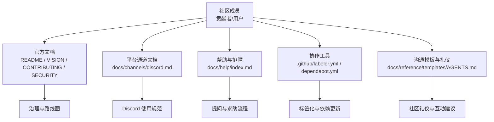
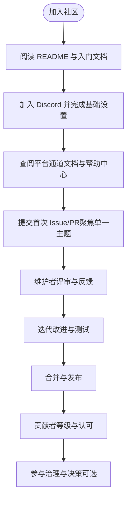
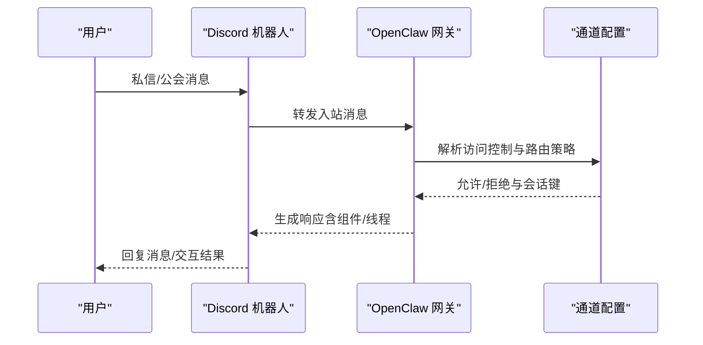
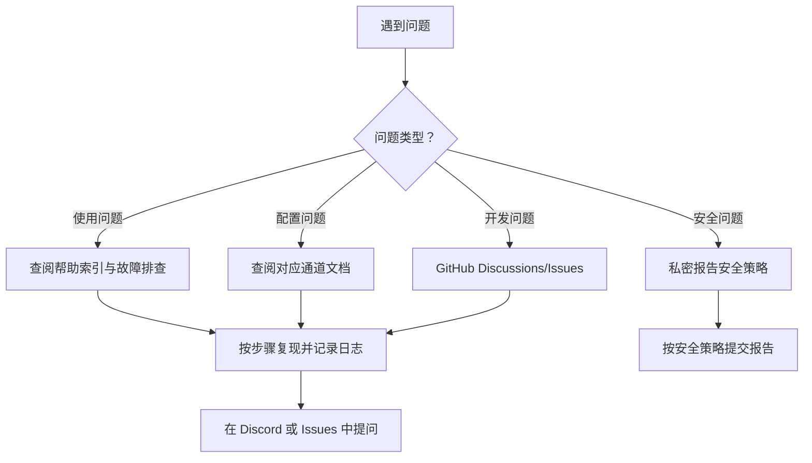
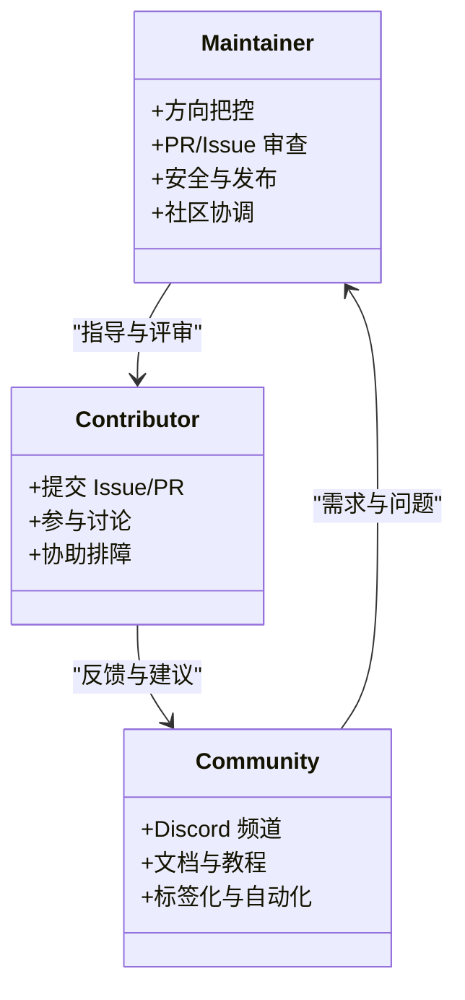

# 社区准则

<cite>
**本文引用的文件**
- [CONTRIBUTING.md](file://CONTRIBUTING.md)
- [README.md](file://README.md)
- [VISION.md](file://VISION.md)
- [SECURITY.md](file://SECURITY.md)
- [.github/labeler.yml](file://.github/labeler.yml)
- [.github/dependabot.yml](file://.github/dependabot.yml)
- [docs/channels/discord.md](file://docs/channels/discord.md)
- [docs/help/index.md](file://docs/help/index.md)
- [docs/reference/templates/AGENTS.md](file://docs/reference/templates/AGENTS.md)
- [docs/zh-CN/reference/templates/AGENTS.md](file://docs/zh-CN/reference/templates/AGENTS.md)
</cite>

## 目录

1. [引言](#引言)
2. [项目结构](#项目结构)
3. [核心组件](#核心组件)
4. [架构总览](#架构总览)
5. [详细组件分析](#详细组件分析)
6. [依赖分析](#依赖分析)
7. [性能考虑](#性能考虑)
8. [故障排查指南](#故障排查指南)
9. [结论](#结论)
10. [附录](#附录)

## 引言

本文件旨在为 OpenClaw 社区提供一套清晰、可执行的参与与沟通准则，覆盖 Discord 频道使用规范、提问技巧与求助流程；同时明确项目治理结构（维护者角色、决策流程）、贡献者等级与晋升路径、社区礼仪与冲突解决机制、包容性原则，以及面向新贡献者的入门指导、技能发展路径与长期参与激励机制。所有规则均以仓库现有文档与实践为基础提炼而成，确保与项目当前状态一致。

## 项目结构

OpenClaw 是一个由多语言、多平台组成的个人 AI 助手系统，围绕“网关（Gateway）+ 多通道（Channels）+ 技能（Skills）+ 应用（Apps）”构建。社区沟通与协作主要通过以下渠道与文档展开：

- 官方文档与指引：README、VISION、CONTRIBUTING、SECURITY、各子文档目录
- 平台通道文档：如 Discord 通道配置与行为说明
- 协作自动化：GitHub Labeler、Dependabot 等工作流
- 社区礼仪与沟通模板：参考 AGENTS 模板中的“像人类一样交流”建议

图表来源

- [README.md](file://README.md)
- [VISION.md](file://VISION.md)
- [CONTRIBUTING.md](file://CONTRIBUTING.md)
- [SECURITY.md](file://SECURITY.md)
- [docs/channels/discord.md](file://docs/channels/discord.md)
- [docs/help/index.md](file://docs/help/index.md)
- [.github/labeler.yml](file://.github/labeler.yml)
- [.github/dependabot.yml](file://.github/dependabot.yml)
- [docs/reference/templates/AGENTS.md](file://docs/reference/templates/AGENTS.md)

章节来源

- [README.md](file://README.md)
- [VISION.md](file://VISION.md)
- [CONTRIBUTING.md](file://CONTRIBUTING.md)
- [SECURITY.md](file://SECURITY.md)
- [docs/channels/discord.md](file://docs/channels/discord.md)
- [docs/help/index.md](file://docs/help/index.md)
- [.github/labeler.yml](file://.github/labeler.yml)
- [.github/dependabot.yml](file://.github/dependabot.yml)
- [docs/reference/templates/AGENTS.md](file://docs/reference/templates/AGENTS.md)

## 核心组件

- 维护者团队：由项目创始人与活跃维护者组成，负责方向把控、PR/Issue 审查、安全与发布等关键职责。
- 贡献者等级：通过持续高质量贡献逐步获得认可，可参与更广泛的评审与治理事务。
- 治理流程：重大变更通过讨论与共识形成，遵循“最小改动、聚焦主题”的 PR 规则。
- 安全与信任模型：采用“受信任操作员”模型，强调强默认安全与明确的边界控制。
- 社区沟通：以 Discord 为主要实时沟通渠道，辅以文档与自动化工具提升协作效率。

章节来源

- [CONTRIBUTING.md](file://CONTRIBUTING.md)
- [VISION.md](file://VISION.md)
- [SECURITY.md](file://SECURITY.md)

## 架构总览

下图展示社区参与与沟通的关键节点与交互关系，帮助新成员快速理解从“入门”到“深度参与”的路径。

图表来源

- [README.md](file://README.md)
- [docs/channels/discord.md](file://docs/channels/discord.md)
- [docs/help/index.md](file://docs/help/index.md)
- [CONTRIBUTING.md](file://CONTRIBUTING.md)

## 详细组件分析

### Discord 频道使用规范

- 入口与准备
  - 创建应用与机器人、启用特权意图、生成邀请链接、开启开发者模式收集 ID、允许服务器成员向机器人发送私信。
  - 在本地安全地设置机器人令牌，启动网关并进行配对。
- 访问控制与路由
  - DM 策略：默认配对模式；可配置允许列表或开放模式（需显式允许）。
  - 服务器策略：允许列表优先，支持按用户/角色白名单、提及要求、忽略其他提及等。
  - 群组 DM 默认忽略，可通过配置允许特定群组。
- 交互与组件
  - 支持交互式组件（按钮、选择器、模态表单），可限制使用范围与复用性。
  - Slash 命令默认仅对授权用户可见且可执行，命令权限与消息处理一致。
- 历史与线程
  - 支持历史上下文限制、线程绑定会话以便子代理与 ACP 工作空间稳定运行。
- 安全与信任
  - 严格遵循“受信任操作员”模型，任何潜在越权行为必须跨越认证/策略/沙箱边界。

图表来源

- [docs/channels/discord.md](file://docs/channels/discord.md)

章节来源

- [docs/channels/discord.md](file://docs/channels/discord.md)

### 提问技巧与求助流程

- 明确问题类型
  - “某功能为何不工作” → 查阅帮助索引与故障排查
  - “如何配置某通道” → 查阅对应通道文档
  - “如何开始贡献” → 参考贡献指南与入门文档
- 提问前的自检
  - 运行健康检查与日志查看
  - 确认环境与版本满足要求
  - 检查是否已存在类似问题
- 正确的求助渠道
  - Bug/功能请求 → GitHub Issues
  - 使用问题/配置问题 → Discord 频道
  - 安全问题 → 私密报告（见安全策略）

图表来源

- [docs/help/index.md](file://docs/help/index.md)
- [CONTRIBUTING.md](file://CONTRIBUTING.md)
- [SECURITY.md](file://SECURITY.md)

章节来源

- [docs/help/index.md](file://docs/help/index.md)
- [CONTRIBUTING.md](file://CONTRIBUTING.md)
- [SECURITY.md](file://SECURITY.md)

### 项目治理结构与决策流程

- 维护者角色
  - 项目负责人与各子系统维护者（Discord、Telegram、iOS/Android、安全等）
  - 职责：方向把控、PR/Issue 审查、安全与发布、社区协调
- 决策流程
  - 重大变更先在 GitHub Discussions 讨论，形成共识后再实施
  - PR 遵循“一次一议题、聚焦主题、测试完备”的原则
- 贡献者等级与晋升
  - 通过持续高质量贡献逐步获得认可，可参与更广泛的评审与治理事务
  - 维护者团队扩大需谨慎评估，强调责任与一致性参与

图表来源

- [CONTRIBUTING.md](file://CONTRIBUTING.md)
- [.github/labeler.yml](file://.github/labeler.yml)
- [.github/dependabot.yml](file://.github/dependabot.yml)

章节来源

- [CONTRIBUTING.md](file://CONTRIBUTING.md)
- [.github/labeler.yml](file://.github/labeler.yml)
- [.github/dependabot.yml](file://.github/dependabot.yml)

### 社区礼仪、冲突解决与包容性

- 社区礼仪
  - 像人类一样交流：少即是多、避免连续轰炸、合理使用表情回应
  - 尊重他人时间与注意力，避免无关打扰
- 冲突解决
  - 优先私下沟通；若无法解决，上升至维护者协调
  - 以事实与数据为导向，避免人身攻击
- 包容性
  - 鼓励多元背景与观点，尊重不同文化与表达习惯
  - 为新手提供耐心与引导，营造友好环境

章节来源

- [docs/reference/templates/AGENTS.md](file://docs/reference/templates/AGENTS.md)
- [docs/zh-CN/reference/templates/AGENTS.md](file://docs/zh-CN/reference/templates/AGENTS.md)

### 新贡献者入门与技能发展路径

- 入门路径
  - 阅读 README 与入门文档，完成环境准备与首次运行
  - 从“good first issue”开始，聚焦单一主题，逐步熟悉代码与流程
- 技能发展
  - 从文档与示例入手，逐步扩展到插件、技能与平台适配
  - 参与跨模块协作，积累多通道与多平台经验
- 长期参与激励
  - 贡献者等级与公开认可
  - 参与治理与决策（可选），推动项目发展方向

章节来源

- [README.md](file://README.md)
- [CONTRIBUTING.md](file://CONTRIBUTING.md)

## 依赖分析

- 标签化与分类
  - 通过 GitHub Labeler 自动为 PR/Issue 打标签，便于分发与追踪
- 依赖更新与安全
  - 通过 Dependabot 定期扫描与更新依赖，降低供应链风险
- 文档与协作
  - 文档作为知识库，帮助贡献者与用户自助解决问题

图表来源

- [.github/labeler.yml](file://.github/labeler.yml)
- [.github/dependabot.yml](file://.github/dependabot.yml)

章节来源

- [.github/labeler.yml](file://.github/labeler.yml)
- [.github/dependabot.yml](file://.github/dependabot.yml)

## 性能考虑

- 保持 PR 的粒度与范围可控，避免大而无当的改动
- 在本地充分测试，减少 CI 与评审成本
- 合理使用交互式组件与线程绑定，避免不必要的资源消耗

## 故障排查指南

- 快速定位
  - 从帮助索引开始，按类别查找常见问题与修复步骤
  - 查看日志与网关诊断工具，确认环境与配置
- 安全问题
  - 遵循安全策略，私密报告漏洞并提供完整复现步骤
- 通道问题
  - 参考对应通道文档，核对令牌、权限与策略配置

章节来源

- [docs/help/index.md](file://docs/help/index.md)
- [SECURITY.md](file://SECURITY.md)
- [docs/channels/discord.md](file://docs/channels/discord.md)

## 结论

本准则以现有文档与实践为基础，明确了社区参与与沟通的规范与流程。通过清晰的 Discord 使用规范、提问技巧与求助路径、透明的治理结构与晋升通道、以及礼仪与包容性原则，OpenClaw 希望构建一个高效、友好、可持续发展的开源社区生态。

## 附录

- 关键链接
  - 项目愿景与路线图：[VISION.md](file://VISION.md)
  - 贡献指南与维护者列表：[CONTRIBUTING.md](file://CONTRIBUTING.md)
  - 安全策略与漏洞报告：[SECURITY.md](file://SECURITY.md)
  - Discord 通道配置与行为：[docs/channels/discord.md](file://docs/channels/discord.md)
  - 帮助与故障排查：[docs/help/index.md](file://docs/help/index.md)
  - 社区礼仪与沟通模板：[docs/reference/templates/AGENTS.md](file://docs/reference/templates/AGENTS.md)、[docs/zh-CN/reference/templates/AGENTS.md](file://docs/zh-CN/reference/templates/AGENTS.md)
