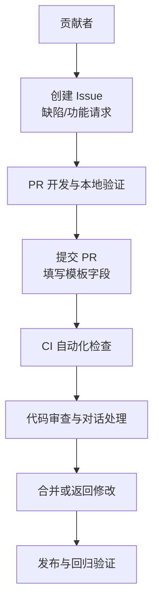
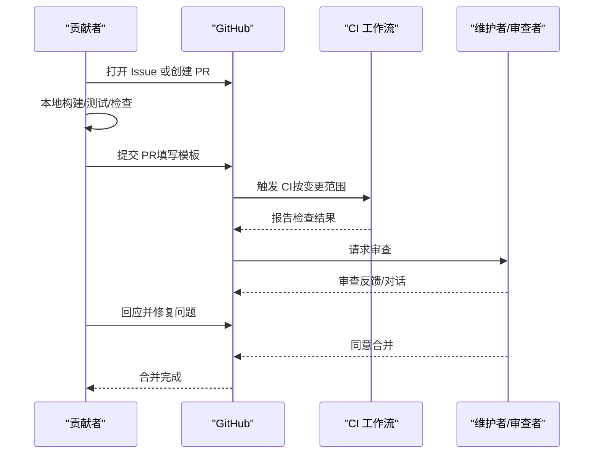
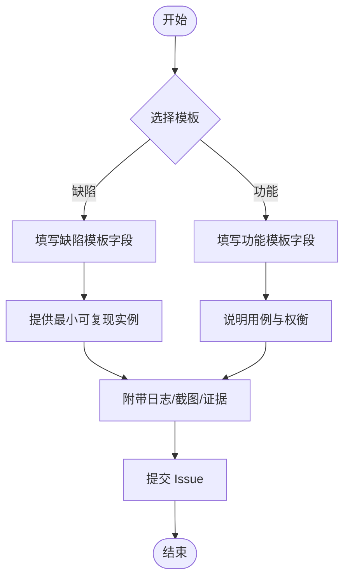
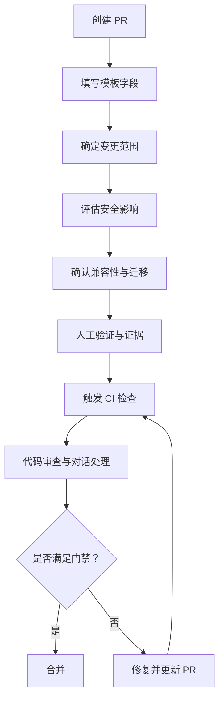
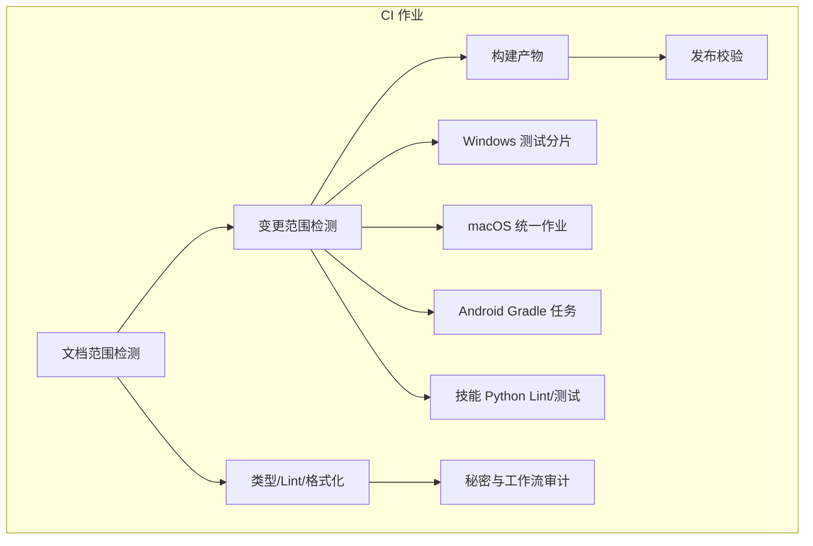
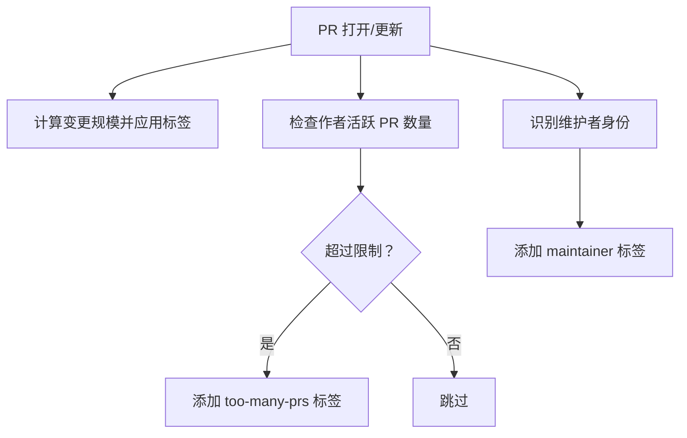

# 贡献流程

<cite>
**本文档引用的文件**
- [CONTRIBUTING.md](file://CONTRIBUTING.md)
- [.github/pull_request_template.md](file://.github/pull_request_template.md)
- [.github/ISSUE_TEMPLATE/bug_report.yml](file://.github/ISSUE_TEMPLATE/bug_report.yml)
- [.github/ISSUE_TEMPLATE/feature_request.yml](file://.github/ISSUE_TEMPLATE/feature_request.yml)
- [.github/ISSUE_TEMPLATE/config.yml](file://.github/ISSUE_TEMPLATE/config.yml)
- [.github/workflows/ci.yml](file://.github/workflows/ci.yml)
- [.github/workflows/labeler.yml](file://.github/workflows/labeler.yml)
- [.github/workflows/stale.yml](file://.github/workflows/stale.yml)
- [.github/dependabot.yml](file://.github/dependabot.yml)
</cite>

## 目录

1. [简介](#简介)
2. [项目结构与贡献入口](#项目结构与贡献入口)
3. [核心流程概览](#核心流程概览)
4. [Issue 创建规范](#issue-创建规范)
5. [Pull Request 流程](#pull-request-流程)
6. [代码审查与对话管理](#代码审查与对话管理)
7. [分支管理策略](#分支管理策略)
8. [提交信息与变更范围检测](#提交信息与变更范围检测)
9. [CI/CD 流程](#cicd-流程)
10. [依赖自动更新（Dependabot）](#依赖自动更新dependabot)
11. [标签与维护策略](#标签与维护策略)
12. [代码质量与测试标准](#代码质量与测试标准)
13. [文档更新规范](#文档更新规范)
14. [社区参与与沟通渠道](#社区参与与沟通渠道)
15. [常见贡献场景与最佳实践](#常见贡献场景与最佳实践)
16. [故障排查与常见问题](#故障排查与常见问题)
17. [结论](#结论)

## 简介

本指南面向所有希望为 OpenClaw 做出贡献的开发者，覆盖从问题报告到 Pull Request 合并的完整流程。内容包括 Issue 规范、PR 模板使用、代码审查标准、提交信息格式、分支管理策略、CI/CD 流程、代码质量与测试覆盖率、文档更新规范、社区参与方式、维护者职责以及常见场景的最佳实践。

## 项目结构与贡献入口

- 贡献总则与维护者信息：参见贡献指南文件。
- Issue 模板：提供缺陷报告与功能请求的标准字段，确保可复现性与证据齐全。
- PR 模板：强制填写变更类型、影响范围、安全影响、验证步骤等关键信息。
- CI 工作流：自动化构建、测试、检查与发布校验，支持按变更范围跳过不必要任务。
- 标签与维护策略：通过标签器自动标注 PR 规模、维护者身份与活跃度限制，提升治理效率。
- 依赖自动更新：配置 Dependabot 对多生态依赖进行每日或每周更新，降低维护成本。
- 陈旧清理：定期标记与关闭长期无人跟进的问题与 PR，保持仓库健康。

## 核心流程概览

- 问题报告：优先使用 Issue 模板，提供最小可复现实例、环境信息与证据。
- 功能讨论：新特性或架构变更建议先在 Discussions 或 Discord 讨论，避免无方向开发。
- 本地验证：遵循贡献指南中的本地测试与检查步骤。
- 提交 PR：严格按 PR 模板填写，确保安全影响、兼容性与回滚方案明确。
- CI 检查：根据变更范围自动选择运行矩阵，失败需修复后再申请审查。
- 审查与对话：作者负责解决机器人审查对话，必要时请求维护者介入。
- 合并：满足质量门禁后由维护者合并，随后进入发布流程。

## Issue 创建规范

- 缺陷报告（Bug）：必须包含“问题类型”、“最小可复现步骤”、“期望行为”、“实际行为”、“版本/系统/安装方式/模型/路由链路/配置位置/日志截图证据/影响与严重性/附加信息”等字段。
- 功能请求（Feature）：必须包含“摘要/问题陈述/解决方案/替代方案/影响/证据/附加信息”等字段。
- 配置：禁止空白 Issue；提供 Discord 支持入口与帮助频道链接。

**章节来源**

- [.github/ISSUE_TEMPLATE/bug_report.yml:1-138](file://.github/ISSUE_TEMPLATE/bug_report.yml#L1-L138)
- [.github/ISSUE_TEMPLATE/feature_request.yml:1-71](file://.github/ISSUE_TEMPLATE/feature_request.yml#L1-L71)
- [.github/ISSUE_TEMPLATE/config.yml:1-9](file://.github/ISSUE_TEMPLATE/config.yml#L1-L9)

## Pull Request 流程

- 必填字段：变更类型、作用域、关联 Issue/PR、用户可见变更、安全影响、环境与步骤、证据、人工验证、兼容性与迁移、故障恢复、风险与缓解。
- 安全影响：任何新增权限、密钥/令牌处理变更、网络调用、命令执行面、数据访问范围变更均需明确风险与缓解。
- 兼容性：必须声明向后兼容性、配置/环境变更与迁移步骤。
- 故障恢复：提供快速禁用/回退方法、需要恢复的文件/配置与已知症状。
- 风险与缓解：列出真实风险及对应缓解措施。

**章节来源**

- [.github/pull_request_template.md:1-116](file://.github/pull_request_template.md#L1-L116)

## 代码审查与对话管理

- 审查对话归属：作者负责解决机器人审查对话，仅保留需要维护者判断的问题。
- AI 协作：AI 辅助 PR 需在标题或描述中标注，并提供测试程度、提示词或会话记录、确认理解代码、本地 Codex 审查输出与对话处理。
- 统一标准：无论人类还是 AI 生成的 PR，均需遵循相同审查与对话管理规则。

**章节来源**

- [CONTRIBUTING.md:96-137](file://CONTRIBUTING.md#L96-L137)

## 分支管理策略

- 主分支保护：CI 在 PR 中运行，按变更范围选择性跳过不相关任务，减少资源消耗。
- 变更范围检测：通过脚本检测 Node/Windows/macOS/Android/技能 Python 等范围，仅运行相关任务。
- 文档变更优化：仅当文档发生变更时运行文档检查，避免重复执行重型任务。

**章节来源**

- [.github/workflows/ci.yml:13-78](file://.github/workflows/ci.yml#L13-L78)

## 提交信息与变更范围检测

- 变更范围检测脚本：基于 PR 基底 SHA 与 HEAD 差异计算受影响区域，决定是否运行 Node、Windows、macOS、Android、技能 Python 等任务。
- 文档范围检测：识别仅文档改动，跳过重型检查与构建，提高效率。

**章节来源**

- [.github/workflows/ci.yml:34-78](file://.github/workflows/ci.yml#L34-L78)

## CI/CD 流程

- 触发条件：Push 到 main 与 Pull Request。
- 并发控制：同一工作流/PR 的并发组内可取消进行中的任务。
- 文档范围检测与变更范围检测：前置作业，决定后续任务是否执行。
- 构建产物：Node 相关变更构建一次并上传供下游复用。
- 类型检查、Lint、格式化：统一执行，失败即阻断。
- Windows 测试分片：按矩阵分片并行，限制并发以稳定运行。
- macOS 统一作业：TS 测试、Swift Lint/Build/Test 顺序执行，避免队列饥饿。
- Android：Gradle 任务矩阵，单元测试与打包分别执行。
- 技能 Python：独立 Python 环境，Ruff Lint 与 PyTest。
- 秘密与工作流审计：Pre-commit 检测私钥、Zizmor 审计工作流变更、生产依赖审计。
- 发布校验：仅在 main 推送时执行，校验发布包内容。

**章节来源**

- [.github/workflows/ci.yml:1-737](file://.github/workflows/ci.yml#L1-L737)

## 依赖自动更新（Dependabot）

- 生态配置：npm、GitHub Actions、Swift（macOS 应用、共享库、Swabble）、Gradle（Android）、Docker 基础镜像。
- 更新频率：npm/Actions/Docker 每日，Swift/Android 每日，冷却期默认 2 天。
- 分组策略：生产/开发依赖分组，Actions/swift/android/docker 模式分组。
- PR 数限制：每类生态最多打开的 PR 数限制，避免过多并行更新造成冲突。

**章节来源**

- [.github/dependabot.yml:1-128](file://.github/dependabot.yml#L1-L128)

## 标签与维护策略

- 标签器：自动为 PR 添加规模标签（XS/S/M/L/XL），基于变更行数阈值动态调整。
- 维护者/可信贡献者：根据组织团队成员身份自动添加“维护者”标签；其他可信标签当前禁用。
- 活跃 PR 限制：作者超过一定数量的活跃 PR 时添加“too-many-prs”标签，避免过度分散维护精力；拥有特定权限的作者不受此限制。
- 陈旧清理：定期标记与关闭长期无人跟进的问题与 PR；关闭后一段时间未活动的已关闭 Issue 将被锁定，防止噪音。

**章节来源**

- [.github/workflows/labeler.yml:1-715](file://.github/workflows/labeler.yml#L1-L715)
- [.github/workflows/stale.yml:1-215](file://.github/workflows/stale.yml#L1-L215)

## 代码质量与测试标准

- 本地测试：遵循贡献指南中的构建、检查与测试命令。
- CI 质量门禁：类型检查、Linter、格式化、严格构建烟检、UI 安全策略检查、文档检查（如涉及）、Windows/macOS/Android/技能 Python 等任务。
- 覆盖率门槛：iOS 任务包含覆盖率门限（示例目标线覆盖率），确保关键路径得到测试。
- 证据与人工验证：PR 模板要求提供失败到通过的测试/日志、截图/录制、性能数据等证据，并明确人工验证场景与未验证项。

**章节来源**

- [CONTRIBUTING.md:85-95](file://CONTRIBUTING.md#L85-L95)
- [.github/workflows/ci.yml:139-215](file://.github/workflows/ci.yml#L139-L215)
- [.github/workflows/ci.yml:656-690](file://.github/workflows/ci.yml#L656-L690)
- [.github/pull_request_template.md:73-89](file://.github/pull_request_template.md#L73-L89)

## 文档更新规范

- 文档范围检测：仅当文档发生变更时运行文档检查（格式、Linter、死链）。
- 文档检查：统一执行文档质量门禁，失败即阻断。
- 控制 UI 装饰器：前端使用传统装饰器风格，避免在未升级构建工具链前切换标准装饰器。

**章节来源**

- [.github/workflows/ci.yml:216-235](file://.github/workflows/ci.yml#L216-L235)
- [CONTRIBUTING.md:108-122](file://CONTRIBUTING.md#L108-L122)

## 社区参与与沟通渠道

- 快速通道：GitHub、愿景文档、Discord、X/Twitter。
- 新特性/架构变更：先发起 Discussions 或在 Discord 讨论，再行开发。
- 问题与帮助：通过 Discord #help 或 #users-helping-users 获取帮助。
- 维护者团队：列出各子系统负责人及其职责领域，欢迎积极贡献者申请加入维护者团队。

**章节来源**

- [CONTRIBUTING.md:5-78](file://CONTRIBUTING.md#L5-L78)

## 常见贡献场景与最佳实践

- 小修小补：直接开 PR，确保本地测试与 CI 通过，描述“做了什么/为什么做”，附前后截图（UI/视觉变更）。
- 新功能/架构：先在 Discussions 或 Discord 讨论，形成共识后再实现；PR 中明确用户可见变更、兼容性与迁移。
- AI 协作：在标题或描述中标注 AI 辅助，提供测试程度、提示词/会话记录、确认理解代码、本地 Codex 审查输出与对话处理。
- 复杂变更：拆分为多个 PR，每个 PR 专注单一主题，避免混杂无关改动。
- 交互与反馈：及时响应审查意见，解决机器人对话，必要时请求维护者介入。

**章节来源**

- [CONTRIBUTING.md:79-106](file://CONTRIBUTING.md#L79-L106)
- [.github/pull_request_template.md:1-116](file://.github/pull_request_template.md#L1-L116)

## 故障排查与常见问题

- CI 失败：检查变更范围检测与文档范围检测逻辑，确认是否误判导致跳过了必要任务；查看具体作业日志定位问题。
- Windows 测试不稳定：关注分片与内存设置，必要时减少并发或增加资源。
- macOS 构建失败：检查 Xcode 版本与缓存，重试构建与测试任务。
- Android 构建失败：确认 SDK/NDK/构建工具版本与许可证状态。
- iOS 任务忽略：当前 CI 中 iOS 任务为禁用状态，如需启用请在维护者指导下调整。
- 陈旧 PR/Issue：若长时间无人跟进，可能被标记为陈旧或关闭；可在 Discord #pr-thunderdome-dangerzone 寻求帮助。

**章节来源**

- [.github/workflows/ci.yml:531-533](file://.github/workflows/ci.yml#L531-L533)
- [.github/workflows/stale.yml:1-215](file://.github/workflows/stale.yml#L1-L215)

## 结论

通过标准化的 Issue 与 PR 模板、严格的 CI 质量门禁、自动化的标签与维护策略，以及清晰的沟通渠道，OpenClaw 希望为贡献者提供高效、透明且可持续的协作体验。请始终遵循“先沟通、后实现”的原则，确保每次贡献都能快速落地并长期维护。
