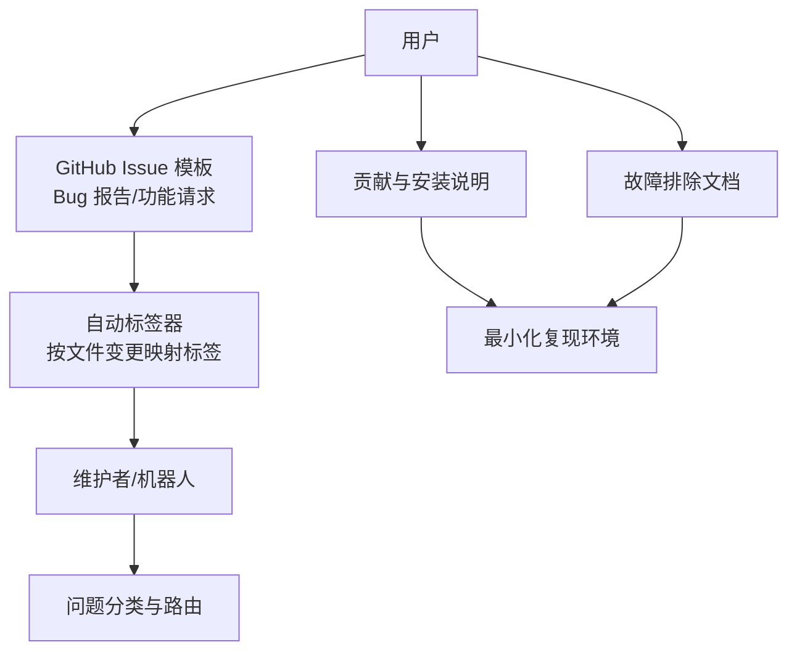
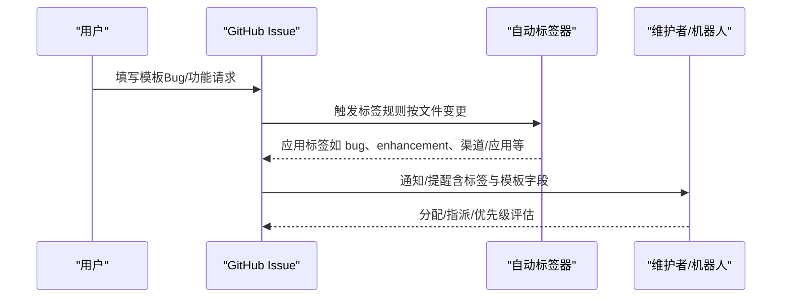
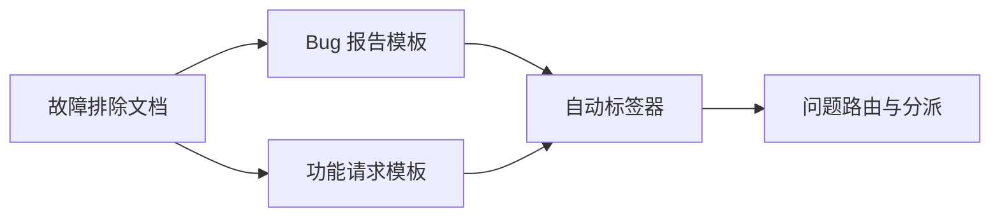

# 问题报告

<cite>
**本文引用的文件**
- [bug_report.yml](file://.github/ISSUE_TEMPLATE/bug_report.yml)
- [feature_request.yml](file://.github/ISSUE_TEMPLATE/feature_request.yml)
- [config.yml](file://.github/ISSUE_TEMPLATE/config.yml)
- [labeler.yml](file://.github/labeler.yml)
- [CONTRIBUTING.md](file://CONTRIBUTING.md)
- [README.md](file://README.md)
- [troubleshooting.md](file://docs/help/troubleshooting.md)
- [node-issue.md](file://docs/debug/node-issue.md)
- [pull_request_template.md](file://.github/pull_request_template.md)
</cite>

## 目录

1. [简介](#简介)
2. [项目结构](#项目结构)
3. [核心组件](#核心组件)
4. [架构总览](#架构总览)
5. [详细组件分析](#详细组件分析)
6. [依赖分析](#依赖分析)
7. [性能考虑](#性能考虑)
8. [故障排除指南](#故障排除指南)
9. [结论](#结论)
10. [附录](#附录)

## 简介

本指南面向所有希望为 OpenClaw 贡献高质量问题报告（Bug 报告与功能请求）的用户。文档基于仓库内现有的 GitHub Issue 模板、标签策略与社区贡献流程，系统阐述了如何正确填写 Issue、如何选择合适的模板、如何描述问题、如何标注标签与优先级，以及在不同场景下的最佳实践与检查清单。

## 项目结构

OpenClaw 的问题报告体系由以下部分组成：

- GitHub Issue 模板：用于 Bug 报告与功能请求的标准表单，确保收集关键信息。
- 标签策略：通过自动标签器与维护者手动管理，实现问题分类与路由。
- 贡献与安装说明：帮助用户准备复现环境与最小化复现路径。
- 故障排除文档：提供症状导向的诊断流程，便于在提交 Issue 前先行自检。

图表来源

- [.github/ISSUE_TEMPLATE/bug_report.yml:1-138](file://.github/ISSUE_TEMPLATE/bug_report.yml#L1-L138)
- [.github/ISSUE_TEMPLATE/feature_request.yml:1-71](file://.github/ISSUE_TEMPLATE/feature_request.yml#L1-L71)
- [.github/labeler.yml:1-259](file://.github/labeler.yml#L1-L259)
- [CONTRIBUTING.md:79-95](file://CONTRIBUTING.md#L79-L95)

章节来源

- [.github/ISSUE_TEMPLATE/bug_report.yml:1-138](file://.github/ISSUE_TEMPLATE/bug_report.yml#L1-L138)
- [.github/ISSUE_TEMPLATE/feature_request.yml:1-71](file://.github/ISSUE_TEMPLATE/feature_request.yml#L1-L71)
- [.github/ISSUE_TEMPLATE/config.yml:1-9](file://.github/ISSUE_TEMPLATE/config.yml#L1-L9)
- [.github/labeler.yml:1-259](file://.github/labeler.yml#L1-L259)
- [CONTRIBUTING.md:79-95](file://CONTRIBUTING.md#L79-L95)

## 核心组件

- Bug 报告模板：强制性字段包括“问题类型”、“摘要”、“复现步骤”、“期望行为”、“实际行为”、“版本/操作系统/安装方式/模型/提供商链路”等，确保可复现与可定位。
- 功能请求模板：要求明确“摘要、问题背景、解决方案、替代方案、影响、证据”等，帮助维护者评估需求价值与实现成本。
- 自动标签器：根据文件变更路径自动打上“渠道/应用/子系统/安全/脚本”等标签，辅助快速分派。
- 贡献与安装说明：提供本地运行、测试与最小化复现的指导，减少无效 Issue。
- 故障排除文档：症状导向的诊断流程图与命令清单，建议在提交前先执行。

章节来源

- [.github/ISSUE_TEMPLATE/bug_report.yml:11-21](file://.github/ISSUE_TEMPLATE/bug_report.yml#L11-L21)
- [.github/ISSUE_TEMPLATE/feature_request.yml:1-71](file://.github/ISSUE_TEMPLATE/feature_request.yml#L1-L71)
- [.github/labeler.yml:1-259](file://.github/labeler.yml#L1-L259)
- [CONTRIBUTING.md:85-95](file://CONTRIBUTING.md#L85-L95)
- [docs/help/troubleshooting.md:13-25](file://docs/help/troubleshooting.md#L13-L25)

## 架构总览

下图展示了从用户提交 Issue 到问题被分类与路由的关键流程，包括模板约束、自动标签与人工干预：

图表来源

- [.github/ISSUE_TEMPLATE/bug_report.yml:4-5](file://.github/ISSUE_TEMPLATE/bug_report.yml#L4-L5)
- [.github/ISSUE_TEMPLATE/feature_request.yml:4-5](file://.github/ISSUE_TEMPLATE/feature_request.yml#L4-L5)
- [.github/labeler.yml:1-259](file://.github/labeler.yml#L1-L259)

## 详细组件分析

### Bug 报告模板

- 必填字段与用途
  - 问题类型：区分回归、崩溃、行为异常三类，便于快速归档与处理。
  - 摘要：一句话说明问题核心，便于检索与初筛。
  - 复现步骤：最短且可重复的路径，避免模糊描述。
  - 期望行为/实际行为：对比明确，便于验证修复。
  - 版本/操作系统/安装方式：定位环境因素。
  - 模型/提供商链路：说明生效的模型与路由链，便于定位服务端或代理问题。
  - 配置位置/附加设置：帮助复现实验性配置。
  - 日志/截图/证据：必须提供可验证的证据。
  - 影响与严重性：说明受影响范围、频率与后果，辅助优先级评估。
  - 其他信息：如回归场景中的“最后已知良好版本/首次出现版本”。

- 最佳实践
  - 使用最小化配置与最小化复现路径，避免无关噪声。
  - 提供可重放的命令与日志片段，必要时附带截图或录屏。
  - 明确“期望 vs 实际”，避免主观臆测。

章节来源

- [.github/ISSUE_TEMPLATE/bug_report.yml:11-21](file://.github/ISSUE_TEMPLATE/bug_report.yml#L11-L21)
- [.github/ISSUE_TEMPLATE/bug_report.yml:22-56](file://.github/ISSUE_TEMPLATE/bug_report.yml#L22-L56)
- [.github/ISSUE_TEMPLATE/bug_report.yml:57-94](file://.github/ISSUE_TEMPLATE/bug_report.yml#L57-L94)
- [.github/ISSUE_TEMPLATE/bug_report.yml:111-137](file://.github/ISSUE_TEMPLATE/bug_report.yml#L111-L137)

### 功能请求模板

- 必填字段与用途
  - 摘要：一句话描述能力诉求。
  - 问题背景：当前痛点与不足，说明为何现有方案不满足。
  - 解决方案：具体的行为/API/UX 设计，越细越好。
  - 替代方案：列出权衡与放弃的原因。
  - 影响：受众、严重程度、发生频率与实际后果。
  - 证据/示例：竞品、截图、配置样例、指标等。
  - 其他信息：兼容性约束、实现限制等。

- 最佳实践
  - 将“痛点”与“收益”量化，便于评估投入产出。
  - 给出可落地的实现方案与兼容性策略。
  - 提供参考案例或数据支撑，降低沟通成本。

章节来源

- [.github/ISSUE_TEMPLATE/feature_request.yml:11-18](file://.github/ISSUE_TEMPLATE/feature_request.yml#L11-L18)
- [.github/ISSUE_TEMPLATE/feature_request.yml:19-34](file://.github/ISSUE_TEMPLATE/feature_request.yml#L19-L34)
- [.github/ISSUE_TEMPLATE/feature_request.yml:35-58](file://.github/ISSUE_TEMPLATE/feature_request.yml#L35-L58)
- [.github/ISSUE_TEMPLATE/feature_request.yml:59-70](file://.github/ISSUE_TEMPLATE/feature_request.yml#L59-L70)

### 问题分类与标签使用规范

- 自动标签（按文件变更）
  - 渠道类：bluebubbles、discord、irc、feishu、googlechat、imessage、line、matrix、mattermost、msteams、nextcloud-talk、nostr、signal、slack、telegram、tlon、twitch、whatsapp-web、zalo、zalouser。
  - 应用类：android、ios、macos、web-ui。
  - 子系统类：gateway、docs、cli、commands、scripts、docker、agents、security。
  - 扩展类：copilot-proxy、diagnostics-otel、google-antigravity-auth、google-gemini-cli-auth、llm-task、lobster、memory-core、memory-lancedb、open-prose、qwen-portal-auth、device-pair、acpx、minimax-portal-auth、phone-control、talk-voice。
- 手动标签
  - bug/enhancement（模板默认）
  - 优先级：p0/p1/p2/p3（如存在）
  - 平台/浏览器/Node 版本等环境标签（如需要）

- 标签分配流程
  - 自动标签器根据文件匹配规则自动打标。
  - 维护者可在 Issue 创建后补充/调整标签，确保路由准确。

章节来源

- [.github/labeler.yml:1-259](file://.github/labeler.yml#L1-L259)

### 优先级评估与分配流程

- 优先级维度（建议）
  - 影响面：是否影响多用户/多渠道/关键路径。
  - 严重性：崩溃/阻断工作流/数据风险/安全漏洞。
  - 可复现性：是否稳定复现，是否可最小化复现。
  - 紧迫度：是否影响发布/上线/关键业务。
- 分配流程
  - 模板收集到足够信息后，维护者进行初步评估与标签补充。
  - 对于高优先级问题，可能直接进入紧急处理通道。

章节来源

- [.github/ISSUE_TEMPLATE/bug_report.yml:117-131](file://.github/ISSUE_TEMPLATE/bug_report.yml#L117-L131)
- [.github/ISSUE_TEMPLATE/feature_request.yml:42-56](file://.github/ISSUE_TEMPLATE/feature_request.yml#L42-L56)

### 提交前检查清单

- 环境信息
  - OpenClaw 版本、操作系统、安装方式（npm/pnpm/docker/桌面应用等）。
  - 模型与提供商链路（含代理/网关/路由）。
- 复现条件
  - 是否可最小化复现？是否在不同环境/版本中可复现？
  - 是否与特定配置/权限/网络有关？
- 证据材料
  - 日志片段（含时间戳）、截图、录屏、配置文件片段（已脱敏）。
- 文档与流程
  - 是否已参考故障排除文档并执行了诊断命令？

章节来源

- [.github/ISSUE_TEMPLATE/bug_report.yml:57-94](file://.github/ISSUE_TEMPLATE/bug_report.yml#L57-L94)
- [docs/help/troubleshooting.md:13-25](file://docs/help/troubleshooting.md#L13-L25)

## 依赖分析

- 模板对标签系统的依赖
  - Bug/功能请求模板的必填字段与标签策略相辅相成：模板字段帮助收集信息，标签系统帮助分类与路由。
- 故障排除文档对模板的依赖
  - 在提交 Issue 前，建议先执行故障排除文档中的命令与流程，以减少无效 Issue 数量。

图表来源

- [.github/ISSUE_TEMPLATE/bug_report.yml:1-138](file://.github/ISSUE_TEMPLATE/bug_report.yml#L1-L138)
- [.github/ISSUE_TEMPLATE/feature_request.yml:1-71](file://.github/ISSUE_TEMPLATE/feature_request.yml#L1-L71)
- [.github/labeler.yml:1-259](file://.github/labeler.yml#L1-L259)
- [docs/help/troubleshooting.md:13-25](file://docs/help/troubleshooting.md#L13-L25)

章节来源

- [.github/ISSUE_TEMPLATE/bug_report.yml:1-138](file://.github/ISSUE_TEMPLATE/bug_report.yml#L1-L138)
- [.github/ISSUE_TEMPLATE/feature_request.yml:1-71](file://.github/ISSUE_TEMPLATE/feature_request.yml#L1-L71)
- [.github/labeler.yml:1-259](file://.github/labeler.yml#L1-L259)
- [docs/help/troubleshooting.md:13-25](file://docs/help/troubleshooting.md#L13-L25)

## 性能考虑

- 减少无效 Issue 的开销
  - 通过模板与故障排除流程，引导用户提供最小化复现与充分证据，降低维护者排查成本。
- 标签自动化
  - 自动标签器可减少人工分派时间，提升问题流转效率。
- 证据与日志
  - 提供可重放的日志与截图，有助于快速定位问题根因，缩短修复周期。

## 故障排除指南

- 症状导向诊断
  - 使用故障排除文档中的“60 秒检查清单”与“决策树”，快速定位问题类别（无回复、控制面板连接失败、网关未启动、通道连通但消息不流动、定时任务未触发、节点工具失败、浏览器工具失败）。
- 常见问题与提示
  - Node + tsx 的 \_\_name 异常：在 Node 25 环境下使用 tsx 可能出现函数名保留相关的加载错误，建议使用 Bun 或编译后运行。
- 提交前自检
  - 在提交 Issue 前，先执行 openclaw status、gateway probe/status、doctor、channels status 等命令，并附上日志输出。

章节来源

- [docs/help/troubleshooting.md:13-25](file://docs/help/troubleshooting.md#L13-L25)
- [docs/help/troubleshooting.md:68-88](file://docs/help/troubleshooting.md#L68-L88)
- [docs/help/troubleshooting.md:90-298](file://docs/help/troubleshooting.md#L90-L298)
- [docs/debug/node-issue.md:13-36](file://docs/debug/node-issue.md#L13-L36)
- [docs/debug/node-issue.md:61-73](file://docs/debug/node-issue.md#L61-L73)

## 结论

通过遵循本指南，贡献者可以高效地提交高质量的问题报告：使用正确的模板、提供可复现的最小化步骤、附带充分证据、明确影响与严重性，并配合自动标签与故障排除流程，显著提升问题处理效率与质量。维护团队也能据此更精准地进行优先级评估与分配。

## 附录

### 常见问题类型模板与检查清单

- Bug 报告模板要点
  - 问题类型：回归/崩溃/行为异常
  - 复现步骤：最短且可重复
  - 期望 vs 实际：清晰对比
  - 环境信息：版本/OS/安装方式/模型/提供商链路
  - 证据：日志/截图/录屏
  - 影响：受众/严重性/频率/后果

- 功能请求模板要点
  - 摘要：一句话能力描述
  - 问题背景：痛点与现状不足
  - 解决方案：具体设计与边界
  - 替代方案：权衡与放弃原因
  - 影响：受众/严重性/频率/后果
  - 证据：竞品/截图/配置样例
  - 兼容性：向后兼容与迁移策略

- 提交前检查清单
  - 已执行故障排除命令并记录结果
  - 已提供最小化复现步骤
  - 已附带日志/截图/录屏
  - 已确认环境信息完整
  - 已阅读贡献与安装说明并按要求准备

章节来源

- [.github/ISSUE_TEMPLATE/bug_report.yml:11-21](file://.github/ISSUE_TEMPLATE/bug_report.yml#L11-L21)
- [.github/ISSUE_TEMPLATE/bug_report.yml:22-56](file://.github/ISSUE_TEMPLATE/bug_report.yml#L22-L56)
- [.github/ISSUE_TEMPLATE/bug_report.yml:57-94](file://.github/ISSUE_TEMPLATE/bug_report.yml#L57-L94)
- [.github/ISSUE_TEMPLATE/bug_report.yml:111-137](file://.github/ISSUE_TEMPLATE/bug_report.yml#L111-L137)
- [.github/ISSUE_TEMPLATE/feature_request.yml:11-18](file://.github/ISSUE_TEMPLATE/feature_request.yml#L11-L18)
- [.github/ISSUE_TEMPLATE/feature_request.yml:19-34](file://.github/ISSUE_TEMPLATE/feature_request.yml#L19-L34)
- [.github/ISSUE_TEMPLATE/feature_request.yml:42-58](file://.github/ISSUE_TEMPLATE/feature_request.yml#L42-L58)
- [docs/help/troubleshooting.md:13-25](file://docs/help/troubleshooting.md#L13-L25)
