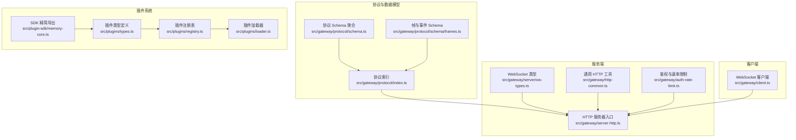
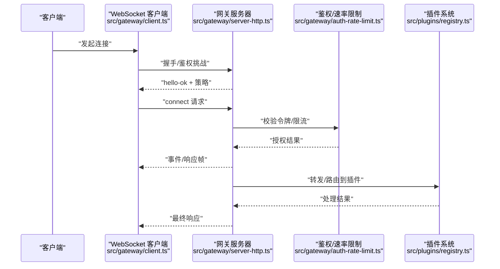
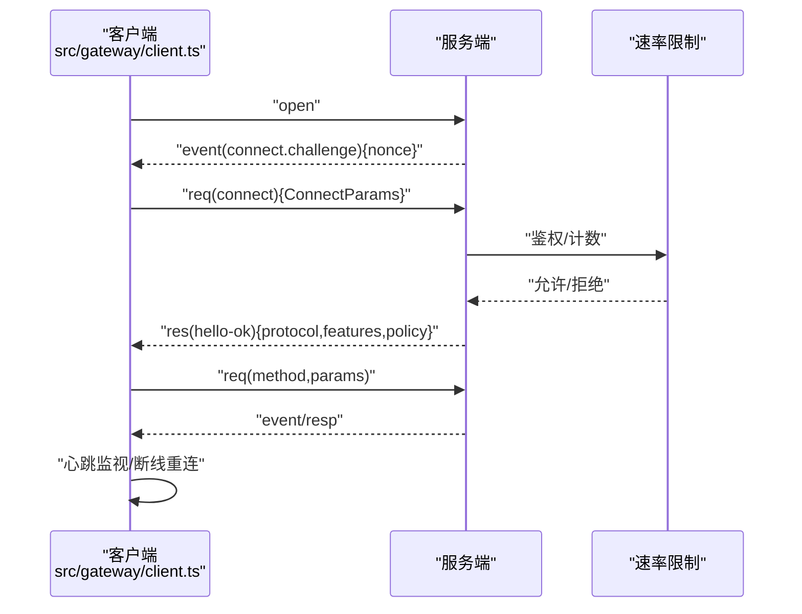
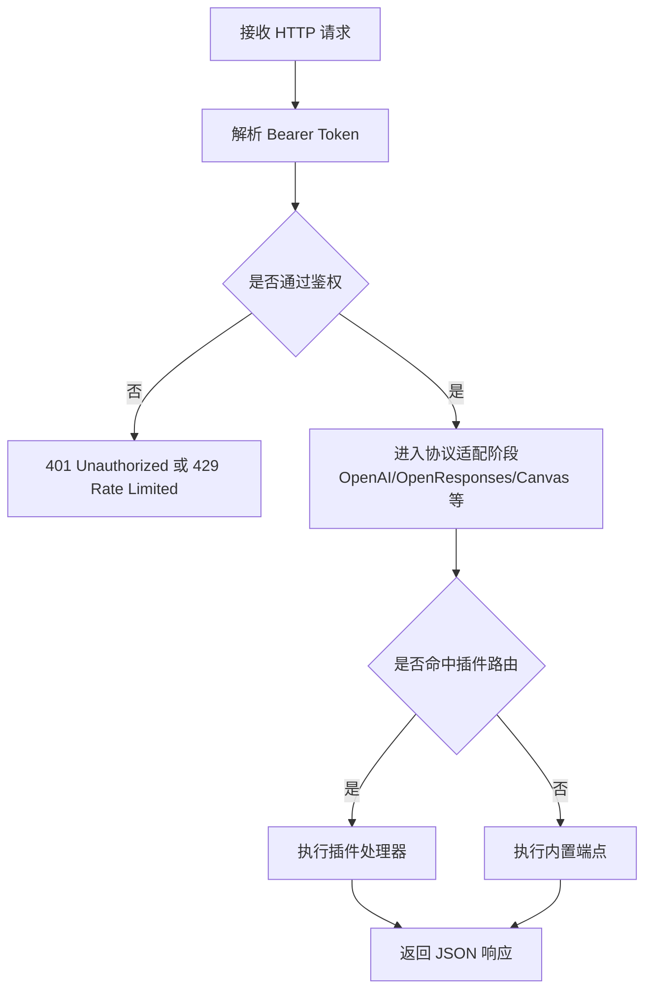
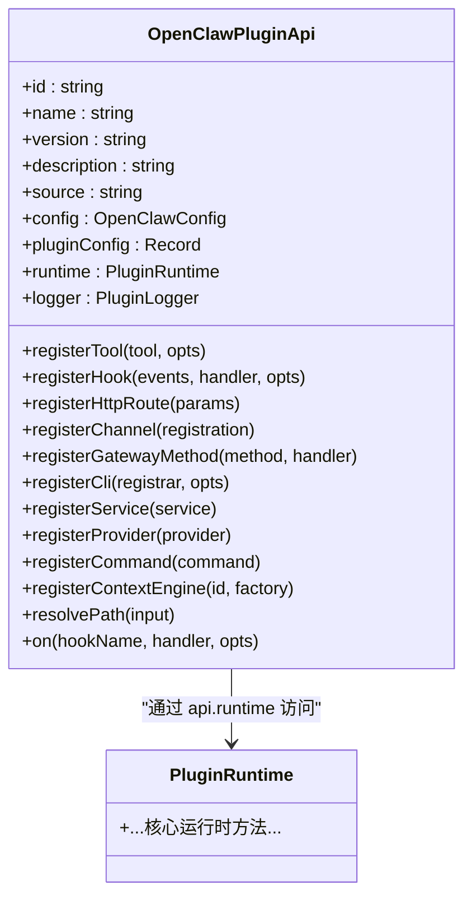
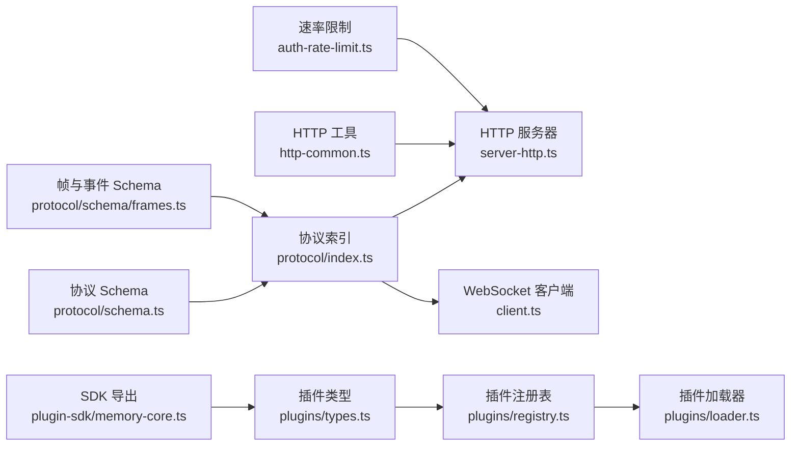

# API参考

<cite>
**本文引用的文件**
- [src/gateway/protocol/index.ts](file://src/gateway/protocol/index.ts)
- [src/gateway/protocol/schema.ts](file://src/gateway/protocol/schema.ts)
- [src/gateway/protocol/schema/frames.ts](file://src/gateway/protocol/schema/frames.ts)
- [src/gateway/server/ws-types.ts](file://src/gateway/server/ws-types.ts)
- [src/gateway/client.ts](file://src/gateway/client.ts)
- [src/gateway/server-http.ts](file://src/gateway/server-http.ts)
- [src/gateway/http-common.ts](file://src/gateway/http-common.ts)
- [src/gateway/auth-rate-limit.ts](file://src/gateway/auth-rate-limit.ts)
- [src/plugins/types.ts](file://src/plugins/types.ts)
- [src/plugins/registry.ts](file://src/plugins/registry.ts)
- [src/plugin-sdk/memory-core.ts](file://src/plugin-sdk/memory-core.ts)
- [docs/zh-CN/gateway/openresponses-http-api.md](file://docs/zh-CN/gateway/openresponses-http-api.md)
- [apps/macos/Tests/OpenClawIPCTests/GatewayWebSocketTestSupport.swift](file://apps/macos/Tests/OpenClawIPCTests/GatewayWebSocketTestSupport.swift)
- [apps/shared/OpenClawKit/Tests/OpenClawKitTests/GatewayNodeSessionTests.swift](file://apps/shared/OpenClawKit/Tests/OpenClawKitTests/GatewayNodeSessionTests.swift)
- [src/agents/openai-ws-connection.test.ts](file://src/agents/openai-ws-connection.test.ts)
- [src/context-engine/init.ts](file://src/context-engine/init.ts)
- [docs/refactor/plugin-sdk.md](file://docs/refactor/plugin-sdk.md)
- [src/plugins/loader.ts](file://src/plugins/loader.ts)
</cite>

## 目录

1. [简介](#简介)
2. [项目结构](#项目结构)
3. [核心组件](#核心组件)
4. [架构总览](#架构总览)
5. [详细组件分析](#详细组件分析)
6. [依赖关系分析](#依赖关系分析)
7. [性能考量](#性能考量)
8. [故障排查指南](#故障排查指南)
9. [结论](#结论)
10. [附录](#附录)

## 简介

本文件为 OpenClaw 的全面 API 参考，覆盖以下方面：

- WebSocket API：连接流程、帧格式、事件类型、实时交互与重连/心跳机制
- HTTP REST API：端点组织、鉴权、请求/响应模式、速率限制
- CLI API：命令结构、参数与返回值说明（面向集成与自动化）
- 插件 API：接口定义、调用约定、注册与生命周期钩子、扩展机制
- 协议与安全：消息格式、错误码、安全注意事项与调试监控

## 项目结构

OpenClaw 的 API 能力由“网关协议”“服务端 HTTP 层”“客户端 WebSocket 客户端”“插件系统”等模块协同实现，并通过统一的协议 Schema 保障跨语言/平台一致性。

图表来源

- [src/gateway/protocol/index.ts:1-673](file://src/gateway/protocol/index.ts#L1-L673)
- [src/gateway/protocol/schema.ts:1-19](file://src/gateway/protocol/schema.ts#L1-L19)
- [src/gateway/protocol/schema/frames.ts:1-164](file://src/gateway/protocol/schema/frames.ts#L1-L164)
- [src/gateway/server/ws-types.ts:1-14](file://src/gateway/server/ws-types.ts#L1-L14)
- [src/gateway/server-http.ts:1-200](file://src/gateway/server-http.ts#L1-L200)
- [src/gateway/http-common.ts:36-71](file://src/gateway/http-common.ts#L36-L71)
- [src/gateway/auth-rate-limit.ts:25-57](file://src/gateway/auth-rate-limit.ts#L25-L57)
- [src/gateway/client.ts:1-674](file://src/gateway/client.ts#L1-L674)
- [src/plugins/types.ts:263-306](file://src/plugins/types.ts#L263-L306)
- [src/plugins/registry.ts:575-608](file://src/plugins/registry.ts#L575-L608)
- [src/plugins/loader.ts:256-507](file://src/plugins/loader.ts#L256-L507)
- [src/plugin-sdk/memory-core.ts:1-5](file://src/plugin-sdk/memory-core.ts#L1-L5)

章节来源

- [src/gateway/protocol/index.ts:1-673](file://src/gateway/protocol/index.ts#L1-L673)
- [src/gateway/server-http.ts:1-200](file://src/gateway/server-http.ts#L1-L200)

## 核心组件

- 协议与帧模型：定义了连接参数、握手响应、请求/响应帧、事件帧及错误结构，确保消息格式与校验一致。
- WebSocket 客户端：负责连接建立、鉴权挑战、事件/响应解析、序列号校验、心跳检测与断线重连。
- HTTP 服务器：聚合多条接入路径（如 OpenAI、OpenResponses、Canvas 等），统一鉴权与速率限制。
- 插件系统：提供工具、命令、HTTP 路由、通道、网关方法、服务、上下文引擎等注册能力，以及生命周期钩子。

章节来源

- [src/gateway/protocol/schema/frames.ts:20-164](file://src/gateway/protocol/schema/frames.ts#L20-L164)
- [src/gateway/client.ts:109-674](file://src/gateway/client.ts#L109-L674)
- [src/gateway/server-http.ts:655-700](file://src/gateway/server-http.ts#L655-L700)
- [src/plugins/types.ts:263-306](file://src/plugins/types.ts#L263-L306)

## 架构总览

下图展示从客户端到服务端的关键交互路径，包括 WebSocket 连接、HTTP 鉴权与速率限制、以及插件路由。

图表来源

- [src/gateway/client.ts:267-415](file://src/gateway/client.ts#L267-L415)
- [src/gateway/server-http.ts:655-700](file://src/gateway/server-http.ts#L655-L700)
- [src/gateway/auth-rate-limit.ts:25-57](file://src/gateway/auth-rate-limit.ts#L25-L57)
- [src/plugins/registry.ts:575-608](file://src/plugins/registry.ts#L575-L608)

## 详细组件分析

### WebSocket API

- 连接与握手
  - 客户端在打开连接后等待“connect.challenge”事件，其中包含一次性随机数（nonce）。收到后构造 ConnectParams 并发送“connect”，服务端返回“hello-ok”确认协议版本、特性、快照与策略。
  - 客户端对事件帧中的 seq 进行连续性校验；对“tick”事件更新最近心跳时间，启动心跳监视器，超时则主动关闭以避免静默停滞。

- 帧格式与校验
  - 请求帧：包含 type="req"、id、method、params
  - 响应帧：包含 type="res"、id、ok、payload 或 error
  - 事件帧：包含 type="event"、event、payload、可选 seq 与 stateVersion
  - 所有帧均通过 Ajv 校验，错误时抛出或触发回调。

- 事件类型
  - 包括但不限于“connect.challenge”“tick”“shutdown”等，用于握手、心跳与服务端状态通知。

- 实时交互与重连
  - 客户端维护 pending 请求映射，区分“最终响应”与中间“accepted”状态；对网络异常、TLS 指纹不匹配、鉴权失败等情况进行分类处理与退避重连。

- 错误处理与安全
  - 客户端对解析失败、缺失字段、非安全 URL（ws:// 非本地）进行保护；支持 TLS 指纹校验与设备签名认证。

图表来源

- [src/gateway/client.ts:497-554](file://src/gateway/client.ts#L497-L554)
- [src/gateway/protocol/schema/frames.ts:125-155](file://src/gateway/protocol/schema/frames.ts#L125-L155)
- [src/gateway/auth-rate-limit.ts:25-57](file://src/gateway/auth-rate-limit.ts#L25-L57)

章节来源

- [src/gateway/client.ts:109-674](file://src/gateway/client.ts#L109-L674)
- [src/gateway/protocol/schema/frames.ts:20-164](file://src/gateway/protocol/schema/frames.ts#L20-L164)
- [src/gateway/server/ws-types.ts:4-13](file://src/gateway/server/ws-types.ts#L4-L13)
- [apps/macos/Tests/OpenClawIPCTests/GatewayWebSocketTestSupport.swift:31-71](file://apps/macos/Tests/OpenClawIPCTests/GatewayWebSocketTestSupport.swift#L31-L71)
- [apps/shared/OpenClawKit/Tests/OpenClawKitTests/GatewayNodeSessionTests.swift:104-138](file://apps/shared/OpenClawKit/Tests/OpenClawKitTests/GatewayNodeSessionTests.swift#L104-L138)
- [src/agents/openai-ws-connection.test.ts:617-648](file://src/agents/openai-ws-connection.test.ts#L617-L648)

### HTTP REST API

- 端点组织与路由
  - 服务端按阶段链式处理请求，支持 OpenAI、OpenResponses、Canvas 等多协议适配，同时处理受保护的插件路由与 Canvas 授权。
  - 健康检查与就绪探针路径统一返回标准状态。

- 鉴权与速率限制
  - 统一通过 Bearer Token 鉴权；失败时根据速率限制策略返回 429 或 401，并设置 Retry-After 头。
  - 支持按作用域（共享密钥、设备令牌、钩子鉴权等）进行独立限流。

- 请求/响应模式
  - 成功返回 JSON；失败返回包含错误类型与消息的 JSON；方法不允许时返回 405 并设置 Allow 头。

图表来源

- [src/gateway/server-http.ts:655-700](file://src/gateway/server-http.ts#L655-L700)
- [src/gateway/http-common.ts:36-71](file://src/gateway/http-common.ts#L36-L71)
- [src/gateway/auth-rate-limit.ts:25-57](file://src/gateway/auth-rate-limit.ts#L25-L57)

章节来源

- [src/gateway/server-http.ts:184-200](file://src/gateway/server-http.ts#L184-L200)
- [src/gateway/http-common.ts:36-71](file://src/gateway/http-common.ts#L36-L71)
- [docs/zh-CN/gateway/openresponses-http-api.md:53-132](file://docs/zh-CN/gateway/openresponses-http-api.md#L53-L132)

### CLI API

- 命令结构与参数
  - CLI 子命令通过 Commander 注册，支持参数解析、工作区与日志上下文传递。
  - 插件可通过 registerCli 注册自定义命令，形成统一命令体系。
- 返回值与行为
  - 命令执行结果以结构化输出或状态码呈现；与网关交互时遵循统一的帧模型与错误语义。

章节来源

- [src/plugins/types.ts:221-228](file://src/plugins/types.ts#L221-L228)
- [src/plugins/registry.ts:596-601](file://src/plugins/registry.ts#L596-L601)

### 插件 API

- 接口定义与调用约定
  - OpenClawPluginApi 提供注册工具、命令、HTTP 路由、通道、网关方法、服务、提供者、上下文引擎等能力，并通过 runtime 访问核心行为。
  - 插件生命周期钩子覆盖模型解析、提示构建、消息收发、工具调用、会话管理、网关启停等关键节点。

- 扩展机制
  - 插件通过注册表集中管理，加载器惰性初始化运行时，避免不必要的依赖加载。
  - 插件 SDK 采用最小表面设计，运行时与 SDK 版本通过语义化版本控制并进行兼容性检查。

图表来源

- [src/plugins/types.ts:263-306](file://src/plugins/types.ts#L263-L306)
- [src/plugins/registry.ts:575-608](file://src/plugins/registry.ts#L575-L608)
- [src/plugin-sdk/memory-core.ts:1-5](file://src/plugin-sdk/memory-core.ts#L1-L5)

章节来源

- [src/plugins/types.ts:263-306](file://src/plugins/types.ts#L263-L306)
- [src/plugins/registry.ts:575-608](file://src/plugins/registry.ts#L575-L608)
- [src/plugins/loader.ts:256-507](file://src/plugins/loader.ts#L256-L507)
- [docs/refactor/plugin-sdk.md:147-192](file://docs/refactor/plugin-sdk.md#L147-L192)

## 依赖关系分析

图表来源

- [src/gateway/protocol/index.ts:1-673](file://src/gateway/protocol/index.ts#L1-L673)
- [src/gateway/protocol/schema.ts:1-19](file://src/gateway/protocol/schema.ts#L1-L19)
- [src/gateway/protocol/schema/frames.ts:1-164](file://src/gateway/protocol/schema/frames.ts#L1-L164)
- [src/gateway/server-http.ts:1-200](file://src/gateway/server-http.ts#L1-L200)
- [src/gateway/http-common.ts:36-71](file://src/gateway/http-common.ts#L36-L71)
- [src/gateway/auth-rate-limit.ts:25-57](file://src/gateway/auth-rate-limit.ts#L25-L57)
- [src/plugins/types.ts:263-306](file://src/plugins/types.ts#L263-L306)
- [src/plugins/registry.ts:575-608](file://src/plugins/registry.ts#L575-L608)
- [src/plugins/loader.ts:256-507](file://src/plugins/loader.ts#L256-L507)
- [src/plugin-sdk/memory-core.ts:1-5](file://src/plugin-sdk/memory-core.ts#L1-L5)

章节来源

- [src/gateway/protocol/index.ts:1-673](file://src/gateway/protocol/index.ts#L1-L673)
- [src/plugins/types.ts:263-306](file://src/plugins/types.ts#L263-L306)

## 性能考量

- WebSocket
  - 客户端对大响应（屏幕快照等）放宽 maxPayload；心跳间隔与最小监视间隔可调，避免空闲连接占用。
  - 断线重连指数退避，上限 30 秒，降低风暴效应。
- HTTP
  - 速率限制滑动窗口与锁定策略减少暴力尝试；鉴权失败计数与豁免策略（如本地回环）平衡安全与可用性。
- 插件
  - 加载器惰性初始化运行时，减少冷启动成本；插件间隔离与最小 SDK 表面降低耦合。

## 故障排查指南

- WebSocket 连接
  - 非安全 URL（ws:// 非本地）被阻断，需使用 wss:// 或经隧道；TLS 指纹不匹配导致握手失败；鉴权失败可能触发速率限制或设备令牌重试策略。
  - 心跳超时将主动关闭，检查网络质量与服务端负载。
- HTTP 鉴权
  - 401 未授权：缺少或错误的 Bearer Token；429 过多失败尝试：触发速率限制，等待 Retry-After。
- 插件
  - 注册期错误会记录诊断信息；过时 API 使用将被弃用提示，需按迁移计划升级。

章节来源

- [src/gateway/client.ts:144-168](file://src/gateway/client.ts#L144-L168)
- [src/gateway/http-common.ts:47-71](file://src/gateway/http-common.ts#L47-L71)
- [src/plugins/loader.ts:256-284](file://src/plugins/loader.ts#L256-L284)

## 结论

OpenClaw 的 API 以统一协议 Schema 为基础，结合严格的鉴权与速率限制策略，为 WebSocket 与 HTTP 提供一致、可扩展且安全的交互体验；插件系统通过最小运行时表面与生命周期钩子，实现强大的扩展能力与良好的性能表现。

## 附录

### 协议与消息格式速览

- 连接参数 ConnectParams：包含协议版本范围、客户端标识、权限、设备签名、认证信息等
- 握手响应 HelloOk：协议版本、特性列表、快照、策略（最大负载、缓冲字节、心跳间隔）
- 请求/响应帧：req/res，携带 id、method、params、ok、payload 或 error
- 事件帧：event，携带事件名、可选负载、序列号与状态版本

章节来源

- [src/gateway/protocol/schema/frames.ts:20-164](file://src/gateway/protocol/schema/frames.ts#L20-L164)

### 上下文引擎初始化

- 确保“legacy”上下文引擎始终可用，其他引擎通过插件注册。

章节来源

- [src/context-engine/init.ts:1-23](file://src/context-engine/init.ts#L1-L23)
