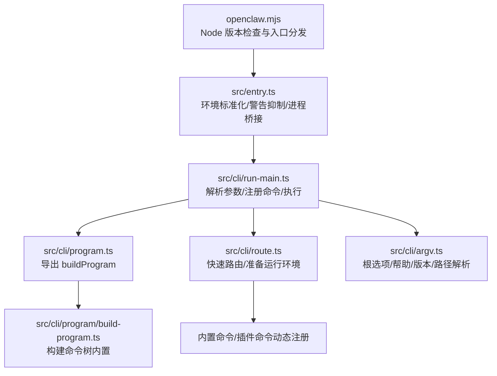
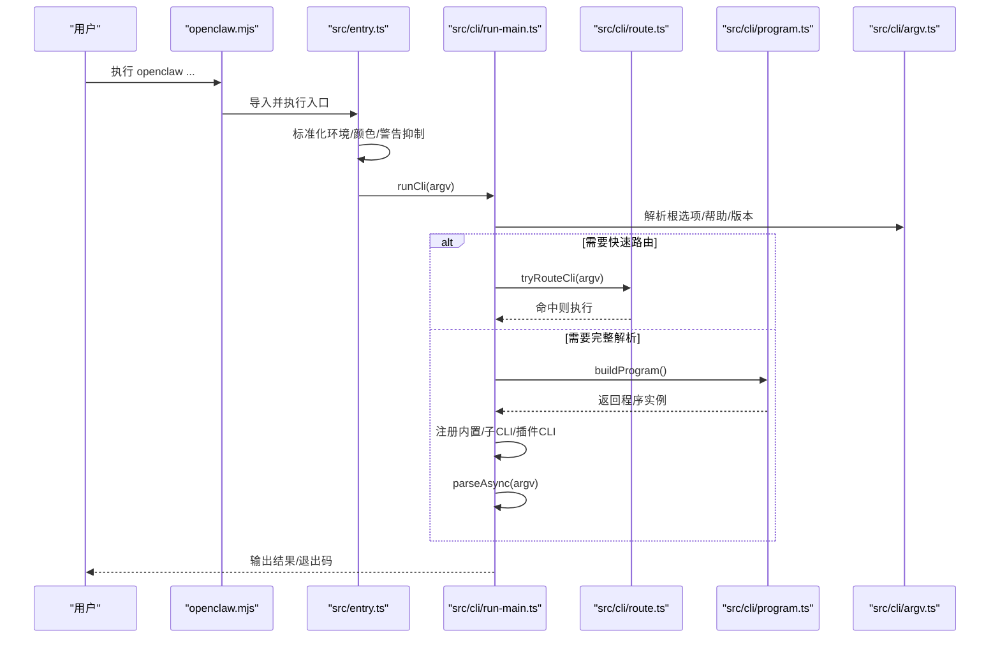
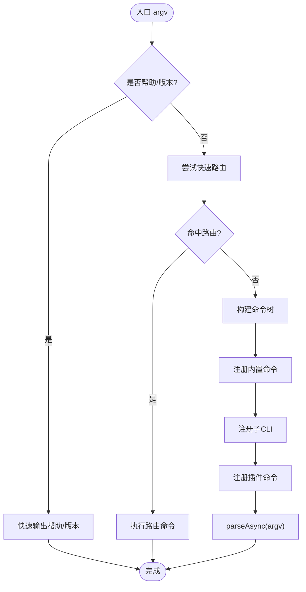
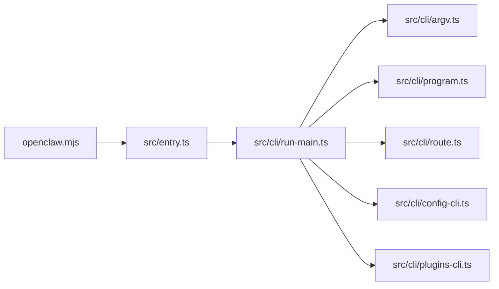

# CLI API

<cite>
**本文引用的文件**
- [openclaw.mjs](file://openclaw.mjs)
- [src/entry.ts](file://src/entry.ts)
- [src/cli/program.ts](file://src/cli/program.ts)
- [src/cli/run-main.ts](file://src/cli/run-main.ts)
- [src/cli/route.ts](file://src/cli/route.ts)
- [src/cli/argv.ts](file://src/cli/argv.ts)
- [docs/cli/index.md](file://docs/cli/index.md)
- [src/cli/config-cli.ts](file://src/cli/config-cli.ts)
- [src/cli/plugins-cli.ts](file://src/cli/plugins-cli.ts)
</cite>

## 目录

1. [简介](#简介)
2. [项目结构](#项目结构)
3. [核心组件](#核心组件)
4. [架构总览](#架构总览)
5. [详细组件分析](#详细组件分析)
6. [依赖分析](#依赖分析)
7. [性能考虑](#性能考虑)
8. [故障排查指南](#故障排查指南)
9. [结论](#结论)
10. [附录](#附录)

## 简介

本文件为 OpenClaw 的 CLI API 参考文档，覆盖主命令 openclaw 及其子命令的语法、选项与使用模式；涵盖配置管理、网关控制、会话管理、插件管理等常用工作流；说明全局选项、环境变量与配置文件优先级；提供输出格式、错误信息与调试选项；并给出批量操作、脚本集成与自动化任务的最佳实践。

## 项目结构

OpenClaw CLI 由“启动器”“入口”“程序构建器”“运行时路由/解析”“各子命令实现”组成，整体采用延迟注册与按需加载策略，支持内置命令与插件扩展命令共存。

图表来源

- [openclaw.mjs:1-90](file://openclaw.mjs#L1-L90)
- [src/entry.ts:1-195](file://src/entry.ts#L1-L195)
- [src/cli/run-main.ts:1-156](file://src/cli/run-main.ts#L1-L156)
- [src/cli/program.ts:1-3](file://src/cli/program.ts#L1-L3)
- [src/cli/route.ts:1-48](file://src/cli/route.ts#L1-L48)
- [src/cli/argv.ts:1-329](file://src/cli/argv.ts#L1-L329)

章节来源

- [openclaw.mjs:1-90](file://openclaw.mjs#L1-L90)
- [src/entry.ts:1-195](file://src/entry.ts#L1-L195)
- [src/cli/program.ts:1-3](file://src/cli/program.ts#L1-L3)
- [src/cli/run-main.ts:1-156](file://src/cli/run-main.ts#L1-L156)
- [src/cli/route.ts:1-48](file://src/cli/route.ts#L1-L48)
- [src/cli/argv.ts:1-329](file://src/cli/argv.ts#L1-L329)

## 核心组件

- 启动器 openclaw.mjs：校验 Node.js 最低版本、启用编译缓存、按需导入 dist/entry.(m)js 并兜底报错。
- 入口 src/entry.ts：设置执行标记、安装警告过滤、标准化环境、处理颜色禁用、实验性警告抑制与进程重生、帮助/版本快速路径、调用 run-main。
- 运行时 src/cli/run-main.ts：解析配置文件、确保 CLI 在 PATH 中、断言运行时、注册内置/子 CLI、注册插件 CLI、解析并执行命令。
- 路由 src/cli/route.ts：在非帮助/版本场景下尝试快速路由到已知命令，准备配置与插件加载。
- 参数解析 src/cli/argv.ts：识别根选项、帮助/版本、命令路径、位置参数、布尔/取值标志等。
- 文档索引 docs/cli/index.md：提供命令清单、全局选项、输出样式、安全与秘密、插件与内存等主题概览。

章节来源

- [openclaw.mjs:1-90](file://openclaw.mjs#L1-L90)
- [src/entry.ts:1-195](file://src/entry.ts#L1-L195)
- [src/cli/run-main.ts:1-156](file://src/cli/run-main.ts#L1-L156)
- [src/cli/route.ts:1-48](file://src/cli/route.ts#L1-L48)
- [src/cli/argv.ts:1-329](file://src/cli/argv.ts#L1-L329)
- [docs/cli/index.md:1-800](file://docs/cli/index.md#L1-L800)

## 架构总览

OpenClaw CLI 采用“延迟注册 + 快速路由”的设计：

- 非帮助/版本场景下，先尝试快速路由，命中后直接执行对应命令逻辑；
- 命令未命中或需要完整解析时，构建完整的命令树，注册内置与插件命令，再进行解析与执行；
- 全局选项（如 --dev、--profile、--no-color、--json、--update、-V/--version/-v）在早期阶段即被识别与应用。

图表来源

- [openclaw.mjs:1-90](file://openclaw.mjs#L1-L90)
- [src/entry.ts:1-195](file://src/entry.ts#L1-L195)
- [src/cli/run-main.ts:1-156](file://src/cli/run-main.ts#L1-L156)
- [src/cli/route.ts:1-48](file://src/cli/route.ts#L1-L48)
- [src/cli/program.ts:1-3](file://src/cli/program.ts#L1-L3)
- [src/cli/argv.ts:1-329](file://src/cli/argv.ts#L1-L329)

## 详细组件分析

### 主命令 openclaw 与全局选项

- 语法：openclaw [全局选项] <命令> [命令选项与参数]
- 全局选项（来自文档索引与 argv 解析）：
  - --dev：隔离状态至 ~/.openclaw-dev，切换默认端口
  - --profile <name>：隔离状态至 ~/.openclaw-<name>
  - --no-color：禁用 ANSI 颜色
  - --update：等价于 openclaw update（仅源码安装）
  - -V, --version, -v：打印版本并退出
- 输出样式：
  - TTY 渲染彩色与进度指示；--json/--plain 禁用样式以适配机器可读输出；NO_COLOR=1 同样生效；长任务显示进度条（支持 OSC 9）。
- 颜色调色板（lobster）：用于标题、强调、成功、警告、错误、辅助文本等。

章节来源

- [docs/cli/index.md:62-92](file://docs/cli/index.md#L62-L92)
- [src/cli/argv.ts:12-106](file://src/cli/argv.ts#L12-L106)

### 配置管理命令：config

- 子命令：
  - config get <path> [--json]
  - config set <path> <value> [--strict-json|--json]
  - config unset <path>
  - config file
  - config validate [--json]
- 行为要点：
  - 支持点号/方括号路径；对数组使用数字索引；自动红化敏感值。
  - set 时写入 resolved 配置（避免运行时默认回退污染磁盘配置）。
  - validate 支持 JSON 输出，失败时给出修复建议。
- 示例（来自文档索引）：
  - openclaw config get models.providers.openai.apiKey
  - openclaw config set models.defaultModelId "gpt-4o"
  - openclaw config validate --json

章节来源

- [src/cli/config-cli.ts:279-393](file://src/cli/config-cli.ts#L279-L393)
- [docs/cli/index.md:387-400](file://docs/cli/index.md#L387-L400)

### 插件管理命令：plugins

- 子命令：
  - plugins list [--json] [--enabled] [--verbose]
  - plugins info <id> [--json]
  - plugins install <path-or-spec> [-l|--link] [--pin]
  - plugins enable <id>
  - plugins disable <id>
  - plugins uninstall <id> [--keep-files|--keep-config] [--force] [--dry-run]
  - plugins update [<id>|--all] [--dry-run]
  - plugins doctor
- 行为要点：
  - 支持本地路径、归档包、npm 规范安装；--link 用于链接本地路径；--pin 记录精确版本。
  - 安装后自动记录安装记录、应用独占槽位选择、提示重启网关生效。
  - doctor 输出插件加载问题与诊断信息。
- 示例（来自文档索引）：
  - openclaw plugins list --json
  - openclaw plugins install ./my-plugin --pin
  - openclaw plugins doctor

章节来源

- [src/cli/plugins-cli.ts:364-800](file://src/cli/plugins-cli.ts#L364-L800)
- [docs/cli/index.md:281-292](file://docs/cli/index.md#L281-L292)

### 网关控制命令：gateway

- 子命令（来自文档索引）：
  - gateway status
  - gateway install|uninstall|start|stop|restart
  - gateway call
  - gateway health
  - gateway probe
  - gateway discover
  - gateway install
  - gateway uninstall
  - gateway start
  - gateway stop
  - gateway restart
  - gateway run
- 常用选项（来自文档索引）：
  - --port, --bind, --token, --auth, --password, --password-file, --tailscale, --allow-unconfigured, --dev, --reset, --force, --verbose, --claude-cli-logs, --ws-log, --raw-stream, --raw-stream-path
- 注意事项：
  - status 支持 --no-probe、--deep、--json；在 Linux systemd 下会检查 Environment/EnvironmentFile。
  - install 默认 Node 运行时，不推荐 bun（存在兼容性问题）。

章节来源

- [docs/cli/index.md:740-800](file://docs/cli/index.md#L740-L800)

### 会话管理命令：sessions

- 子命令：
  - sessions 列表存储的对话会话
- 选项：
  - --json, --verbose, --store <path>, --active <minutes>

章节来源

- [docs/cli/index.md:693-703](file://docs/cli/index.md#L693-L703)

### 系统与诊断命令：status、health、doctor

- status：显示连接会话健康与最近收件人；支持 --json、--all、--deep、--usage、--timeout、--verbose/--debug。
- health：从运行中的网关获取健康状态；支持 --json、--timeout、--verbose。
- doctor：健康检查与快速修复；支持 --no-workspace-suggestions、--yes、--non-interactive、--deep。

章节来源

- [docs/cli/index.md:648-700](file://docs/cli/index.md#L648-L700)

### 模型与记忆体命令：models、memory

- models：
  - list、status、set、set-image、aliases、fallbacks、image-fallbacks、scan、auth
- memory：
  - status、index、search "<query>" 或 --query "<query>"
- 使用建议：
  - memory search 支持语义检索；models auth 提供多种认证方式与顺序管理。

章节来源

- [docs/cli/index.md:176-186](file://docs/cli/index.md#L176-L186)
- [docs/cli/index.md:293-299](file://docs/cli/index.md#L293-L299)

### 浏览器与节点命令：browser、nodes、node

- browser：状态、启动/停止、重置配置、标签页、打开/聚焦/关闭、配置文件管理、截图/快照、导航、尺寸调整、交互操作（点击/输入/按键/悬停/拖拽/选择/上传/填充/对话框/等待/评估/控制台/PDF）、调试与日志。
- nodes：媒体节点能力（屏幕/摄像头/画布等）与运行。
- node：单节点生命周期（run/status/install/uninstall/start/stop/restart）。

章节来源

- [docs/cli/index.md:215-244](file://docs/cli/index.md#L215-L244)
- [docs/cli/index.md:201-211](file://docs/cli/index.md#L201-L211)

### 安全与秘密命令：security、secrets

- security audit [--deep] [--fix]：审计配置与本地状态，必要时收紧默认权限与修正权限。
- secrets reload/audit/configure/apply：重新解析密钥引用、扫描明文残留、交互式配置 Provider 映射与预检/应用。

章节来源

- [docs/cli/index.md:268-280](file://docs/cli/index.md#L268-L280)

### 自动化与钩子：hooks、webhooks、cron

- hooks：list/info/check/enable/disable/install/update
- webhooks gmail：setup（支持项目/主题/订阅/标签/推送令牌/绑定/端口/路径/包含正文/最大字节/续期分钟/Tailscale 等）与 run
- cron：status/list/add/edit/rm/enable/disable/runs/run

章节来源

- [docs/cli/index.md:245-264](file://docs/cli/index.md#L245-L264)

### 其他常用命令：setup、onboard、configure、backup、reset、uninstall、dashboard、system、devices、pairing、qr、skills、tui、docs、dns

- setup：初始化配置与工作区，支持向导与非交互模式。
- onboard：交互式引导设置网关、工作区与技能。
- configure：交互式配置模型/渠道/技能/网关。
- backup：create/verify
- reset：重置本地配置/状态（保留 CLI）
- uninstall：卸载网关服务与本地数据（CLI 保留）
- dashboard：可视化面板
- system：event/heartbeat/presence
- devices：设备配对与令牌轮换
- pairing：批准跨渠道的私信配对请求
- qr：二维码相关
- skills：list/info/check
- tui：文本界面
- docs：文档
- dns setup：广域发现 DNS 辅助

章节来源

- [docs/cli/index.md:13-61](file://docs/cli/index.md#L13-L61)
- [docs/cli/index.md:311-382](file://docs/cli/index.md#L311-L382)

### 命令解析与路由流程

图表来源

- [src/cli/route.ts:29-47](file://src/cli/route.ts#L29-L47)
- [src/cli/run-main.ts:114-147](file://src/cli/run-main.ts#L114-L147)
- [src/cli/argv.ts:12-106](file://src/cli/argv.ts#L12-L106)

## 依赖分析

- 组件耦合与职责：
  - openclaw.mjs 仅负责版本校验与入口分发，保持最小副作用。
  - src/entry.ts 负责环境与进程生命周期的前置处理。
  - src/cli/run-main.ts 是 CLI 执行中枢，协调注册与解析。
  - src/cli/route.ts 与 src/cli/argv.ts 提供快速路径与参数解析能力。
  - 内置命令与插件命令通过统一注册机制接入，避免强耦合。
- 外部依赖与集成点：
  - Commander 作为命令解析框架（通过 program.ts 导出）。
  - 插件系统通过插件注册与状态报告模块接入。
  - 环境变量与配置文件在运行前被标准化与加载。

图表来源

- [openclaw.mjs:1-90](file://openclaw.mjs#L1-L90)
- [src/entry.ts:1-195](file://src/entry.ts#L1-L195)
- [src/cli/run-main.ts:1-156](file://src/cli/run-main.ts#L1-L156)
- [src/cli/argv.ts:1-329](file://src/cli/argv.ts#L1-L329)
- [src/cli/program.ts:1-3](file://src/cli/program.ts#L1-L3)
- [src/cli/route.ts:1-48](file://src/cli/route.ts#L1-L48)
- [src/cli/config-cli.ts:1-477](file://src/cli/config-cli.ts#L1-L477)
- [src/cli/plugins-cli.ts:1-827](file://src/cli/plugins-cli.ts#L1-L827)

章节来源

- [src/cli/run-main.ts:114-147](file://src/cli/run-main.ts#L114-L147)
- [src/cli/config-cli.ts:1-477](file://src/cli/config-cli.ts#L1-L477)
- [src/cli/plugins-cli.ts:1-827](file://src/cli/plugins-cli.ts#L1-L827)

## 性能考虑

- 启动性能：
  - openclaw.mjs 与 src/entry.ts 尽量减少同步阻塞，启用编译缓存与警告抑制，缩短冷启动时间。
  - run-main.ts 采用延迟注册与按需解析，避免一次性加载全部命令树。
- I/O 与网络：
  - 网关相关命令（gateway、logs、status、health）涉及 RPC/WS 通信，建议配合 --timeout 控制超时。
  - 插件安装/更新可能触发外部包下载，建议在稳定网络环境下执行。
- 输出与日志：
  - TTY 下启用彩色与进度条；CI/管道中使用 --json/--plain 降低输出体积与渲染开销。

## 故障排查指南

- 常见问题与定位：
  - Node.js 版本不满足要求：openclaw.mjs 会在启动时检测并提示升级路径。
  - 配置无效：使用 config validate 或 doctor 获取详细错误与修复建议。
  - 插件加载失败：使用 plugins doctor 查看错误与诊断信息。
  - 网关状态异常：使用 gateway status --deep 或 health 获取更深入的探测结果。
- 错误输出与调试：
  - CLI 统一通过运行时输出错误信息；--verbose/--debug 提升日志级别；--json 便于机器解析。
  - 进程重生与警告抑制：若出现实验性警告干扰，可通过环境变量或启动参数规避。

章节来源

- [openclaw.mjs:21-34](file://openclaw.mjs#L21-L34)
- [src/cli/run-main.ts:109-112](file://src/cli/run-main.ts#L109-L112)
- [docs/cli/index.md:401-411](file://docs/cli/index.md#L401-L411)

## 结论

OpenClaw CLI 通过清晰的启动链路、延迟注册与快速路由机制，实现了高可扩展与易用的命令体系。结合丰富的内置命令与插件生态，能够覆盖从配置管理、网关控制到会话与插件管理的全场景需求。遵循本文档的选项与最佳实践，可在脚本与自动化任务中高效、稳定地使用 CLI。

## 附录

### 命令与选项速查（摘要）

- openclaw [--dev] [--profile <name>] [--no-color] [--update] [-V|--version|-v] <命令> [选项与参数]
- config：get/set/unset/file/validate
- plugins：list/info/install/enable/disable/uninstall/update/doctor
- gateway：status/install/uninstall/start/stop/restart/call/health/probe/discover/run
- sessions：列出会话
- status/health/doctor：系统诊断
- models/memory：模型与记忆体管理
- browser/nodes/node：浏览器与节点操作
- security/secrets：安全与密钥管理
- hooks/webhooks/cron：自动化与钩子
- 其他：setup/onboard/configure/backup/reset/uninstall/dashboard/system/devices/pairing/qr/skills/tui/docs/dns

章节来源

- [docs/cli/index.md:62-267](file://docs/cli/index.md#L62-L267)
