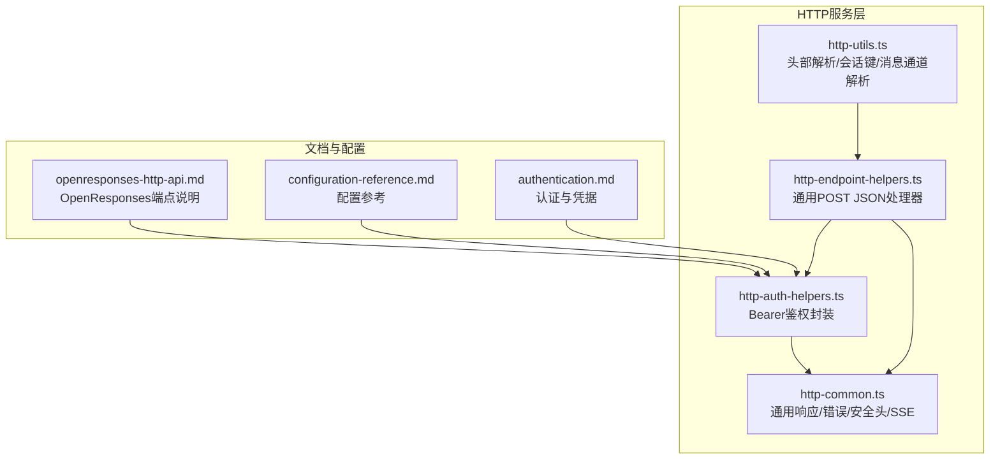
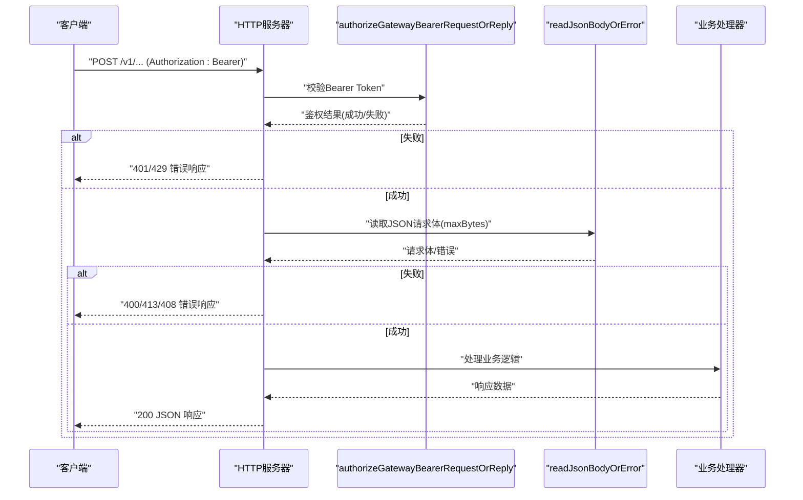
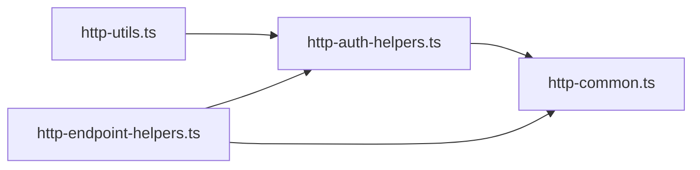

# HTTP REST API

<cite>
**本文引用的文件**
- [src/gateway/http-common.ts](file://src/gateway/http-common.ts)
- [src/gateway/http-auth-helpers.ts](file://src/gateway/http-auth-helpers.ts)
- [src/gateway/http-endpoint-helpers.ts](file://src/gateway/http-endpoint-helpers.ts)
- [src/gateway/http-utils.ts](file://src/gateway/http-utils.ts)
- [docs/gateway/openresponses-http-api.md](file://docs/gateway/openresponses-http-api.md)
- [docs/gateway/configuration-reference.md](file://docs/gateway/configuration-reference.md)
- [docs/gateway/authentication.md](file://docs/gateway/authentication.md)
</cite>

## 目录

1. [简介](#简介)
2. [项目结构](#项目结构)
3. [核心组件](#核心组件)
4. [架构总览](#架构总览)
5. [详细组件分析](#详细组件分析)
6. [依赖关系分析](#依赖关系分析)
7. [性能考量](#性能考量)
8. [故障排查指南](#故障排查指南)
9. [结论](#结论)
10. [附录](#附录)

## 简介

本文件面向OpenClaw的HTTP REST API，系统性梳理网关对外暴露的HTTP端点、认证方式、请求/响应格式、错误处理、速率限制、CORS与安全头策略，并提供curl示例与多语言客户端调用思路。OpenClaw的HTTP能力主要通过“网关”模块提供，支持以Bare Token进行鉴权，并可选启用OpenResponses兼容端点。

## 项目结构

与HTTP REST API相关的核心代码集中在src/gateway目录，文档在docs/gateway中提供了OpenResponses兼容端点与配置参考。下图展示与HTTP API直接相关的模块关系：

图表来源

- [src/gateway/http-common.ts:1-109](file://src/gateway/http-common.ts#L1-L109)
- [src/gateway/http-auth-helpers.ts:1-30](file://src/gateway/http-auth-helpers.ts#L1-L30)
- [src/gateway/http-endpoint-helpers.ts:1-48](file://src/gateway/http-endpoint-helpers.ts#L1-L48)
- [src/gateway/http-utils.ts:1-105](file://src/gateway/http-utils.ts#L1-L105)
- [docs/gateway/openresponses-http-api.md:1-31](file://docs/gateway/openresponses-http-api.md#L1-L31)
- [docs/gateway/configuration-reference.md:1-800](file://docs/gateway/configuration-reference.md#L1-L800)
- [docs/gateway/authentication.md:1-180](file://docs/gateway/authentication.md#L1-L180)

章节来源

- [src/gateway/http-common.ts:1-109](file://src/gateway/http-common.ts#L1-L109)
- [src/gateway/http-auth-helpers.ts:1-30](file://src/gateway/http-auth-helpers.ts#L1-L30)
- [src/gateway/http-endpoint-helpers.ts:1-48](file://src/gateway/http-endpoint-helpers.ts#L1-L48)
- [src/gateway/http-utils.ts:1-105](file://src/gateway/http-utils.ts#L1-L105)
- [docs/gateway/openresponses-http-api.md:1-31](file://docs/gateway/openresponses-http-api.md#L1-L31)
- [docs/gateway/configuration-reference.md:1-800](file://docs/gateway/configuration-reference.md#L1-L800)
- [docs/gateway/authentication.md:1-180](file://docs/gateway/authentication.md#L1-L180)

## 核心组件

- 鉴权辅助：从HTTP请求提取Bearer Token并委托到网关鉴权流程，失败时返回统一错误格式。
- 通用响应与错误：提供JSON/文本响应、400/401/405/413/408/429等标准错误格式，以及默认安全头设置。
- 通用POST JSON处理器：按路径匹配、方法校验、鉴权、读取JSON请求体，统一返回结果或错误。
- 请求上下文解析：从请求头解析代理ID、会话键、消息通道等上下文信息，便于路由与会话管理。

章节来源

- [src/gateway/http-auth-helpers.ts:1-30](file://src/gateway/http-auth-helpers.ts#L1-L30)
- [src/gateway/http-common.ts:1-109](file://src/gateway/http-common.ts#L1-L109)
- [src/gateway/http-endpoint-helpers.ts:1-48](file://src/gateway/http-endpoint-helpers.ts#L1-L48)
- [src/gateway/http-utils.ts:1-105](file://src/gateway/http-utils.ts#L1-L105)

## 架构总览

下图展示HTTP请求进入后，经由鉴权、请求体解析、业务处理到响应返回的整体流程：

图表来源

- [src/gateway/http-auth-helpers.ts:1-30](file://src/gateway/http-auth-helpers.ts#L1-L30)
- [src/gateway/http-common.ts:73-96](file://src/gateway/http-common.ts#L73-L96)
- [src/gateway/http-endpoint-helpers.ts:7-47](file://src/gateway/http-endpoint-helpers.ts#L7-L47)

## 详细组件分析

### 统一错误与响应工具

- 默认安全头：设置X-Content-Type-Options、Referrer-Policy、Permissions-Policy；可选设置HSTS。
- JSON/文本响应：统一分页/流式输出。
- 错误响应：
  - 400：无效请求（含错误类型字段）
  - 401：未授权（含错误类型字段）
  - 405：方法不允许（带Allow头）
  - 413：请求体过大
  - 408：请求体超时
  - 429：速率限制（可带Retry-After）

章节来源

- [src/gateway/http-common.ts:11-22](file://src/gateway/http-common.ts#L11-L22)
- [src/gateway/http-common.ts:24-34](file://src/gateway/http-common.ts#L24-L34)
- [src/gateway/http-common.ts:36-71](file://src/gateway/http-common.ts#L36-L71)
- [src/gateway/http-common.ts:73-96](file://src/gateway/http-common.ts#L73-L96)

### Bearer Token鉴权辅助

- 从Authorization头解析Bearer Token。
- 调用网关鉴权函数，支持可信代理与速率限制器传入。
- 鉴权失败时根据结果决定429或401。

章节来源

- [src/gateway/http-auth-helpers.ts:7-29](file://src/gateway/http-auth-helpers.ts#L7-L29)
- [src/gateway/http-utils.ts:17-24](file://src/gateway/http-utils.ts#L17-L24)

### 通用POST JSON处理器

- 路径匹配：仅处理指定pathname。
- 方法校验：仅接受POST，否则返回405。
- 鉴权：委托Bearer鉴权辅助。
- 请求体读取：最大字节数限制，错误映射为413/408/400。
- 返回：成功时返回{ body }，失败时返回undefined（已写响应）。

章节来源

- [src/gateway/http-endpoint-helpers.ts:7-47](file://src/gateway/http-endpoint-helpers.ts#L7-L47)

### 请求上下文解析

- 代理ID解析：优先从自定义头获取，其次从模型标识推断，最后回退到main。
- 会话键解析：支持显式头覆盖；否则基于用户与随机UUID生成主键并拼接代理ID。
- 消息通道解析：可选择是否启用消息通道头，否则使用默认通道。

章节来源

- [src/gateway/http-utils.ts:26-51](file://src/gateway/http-utils.ts#L26-L51)
- [src/gateway/http-utils.ts:66-80](file://src/gateway/http-utils.ts#L66-L80)
- [src/gateway/http-utils.ts:82-104](file://src/gateway/http-utils.ts#L82-L104)

### OpenResponses兼容端点

- 端点：POST /v1/responses
- 端口：与WebSocket同端口复用HTTP/WS
- 认证：Bearer Token（与网关auth配置一致）
- 行为：请求走与openclaw agent相同的执行路径，路由/权限/配置一致
- 注意：默认关闭，需在配置中启用

章节来源

- [docs/gateway/openresponses-http-api.md:1-31](file://docs/gateway/openresponses-http-api.md#L1-L31)

## 依赖关系分析

- http-endpoint-helpers.ts依赖http-auth-helpers.ts与http-common.ts，形成“路径匹配→方法校验→鉴权→读取请求体”的流水线。
- http-auth-helpers.ts依赖http-utils.ts解析Bearer Token，并调用网关鉴权函数。
- http-common.ts提供统一的安全头、错误与响应工具，被多个模块复用。
- http-utils.ts提供请求上下文解析，被业务处理器与端点助手共同使用。

图表来源

- [src/gateway/http-utils.ts:1-105](file://src/gateway/http-utils.ts#L1-L105)
- [src/gateway/http-auth-helpers.ts:1-30](file://src/gateway/http-auth-helpers.ts#L1-L30)
- [src/gateway/http-common.ts:1-109](file://src/gateway/http-common.ts#L1-L109)
- [src/gateway/http-endpoint-helpers.ts:1-48](file://src/gateway/http-endpoint-helpers.ts#L1-L48)

章节来源

- [src/gateway/http-utils.ts:1-105](file://src/gateway/http-utils.ts#L1-L105)
- [src/gateway/http-auth-helpers.ts:1-30](file://src/gateway/http-auth-helpers.ts#L1-L30)
- [src/gateway/http-common.ts:1-109](file://src/gateway/http-common.ts#L1-L109)
- [src/gateway/http-endpoint-helpers.ts:1-48](file://src/gateway/http-endpoint-helpers.ts#L1-L48)

## 性能考量

- 请求体大小限制：通过maxBodyBytes控制，避免过大负载导致内存压力。
- 速率限制：鉴权辅助支持传入AuthRateLimiter，鉴权失败可能触发429并返回Retry-After。
- 安全头：默认设置基础安全头，减少常见攻击面；HSTS可按需开启。
- SSE：提供SSE专用头部设置与done标记写入，便于长连接流式输出。

章节来源

- [src/gateway/http-endpoint-helpers.ts:10-17](file://src/gateway/http-endpoint-helpers.ts#L10-L17)
- [src/gateway/http-common.ts:47-57](file://src/gateway/http-common.ts#L47-L57)
- [src/gateway/http-common.ts:11-22](file://src/gateway/http-common.ts#L11-L22)
- [src/gateway/http-common.ts:102-108](file://src/gateway/http-common.ts#L102-L108)

## 故障排查指南

- 401 未授权
  - 检查Authorization头是否为Bearer Token且与网关配置一致。
  - 若配置为密码模式，确认密码正确。
- 429 速率限制
  - 观察Retry-After头，等待后再试。
  - 检查网关速率限制配置与可信代理设置。
- 400/405/413/408
  - 400：请求体非JSON或字段非法。
  - 405：方法不被允许（仅POST）。
  - 413：请求体超过maxBytes。
  - 408：请求体读取超时。
- OpenResponses端点不可用
  - 确认已在配置中启用该端点；检查端口与路径。

章节来源

- [src/gateway/http-common.ts:36-71](file://src/gateway/http-common.ts#L36-L71)
- [src/gateway/http-common.ts:73-96](file://src/gateway/http-common.ts#L73-L96)
- [docs/gateway/openresponses-http-api.md:1-31](file://docs/gateway/openresponses-http-api.md#L1-L31)

## 结论

OpenClaw的HTTP REST API以“Bearer Token + 可选速率限制”为核心鉴权方式，提供统一的错误与安全头策略，并通过通用POST JSON处理器简化端点开发。OpenResponses兼容端点作为可选扩展，满足与第三方客户端的对接需求。建议在生产环境启用速率限制与HSTS，并结合可信代理配置提升安全性。

## 附录

### 端点一览与规范

- 端点：POST /v1/responses
- 端口：与WebSocket同端口复用
- 认证：Authorization: Bearer <token>
- 请求体：JSON，受maxBodyBytes限制
- 响应：JSON；错误时返回400/401/405/413/408/429及统一错误结构
- 速率限制：可配置，失败时返回429并带Retry-After

章节来源

- [docs/gateway/openresponses-http-api.md:1-31](file://docs/gateway/openresponses-http-api.md#L1-L31)
- [src/gateway/http-endpoint-helpers.ts:7-47](file://src/gateway/http-endpoint-helpers.ts#L7-L47)
- [src/gateway/http-common.ts:36-71](file://src/gateway/http-common.ts#L36-L71)

### 认证方式与凭据

- Bearer Token：与网关auth配置一致（token/password模式）
- OAuth：见认证文档，适用于模型提供商订阅场景
- 凭据存储：建议使用守护进程环境变量或机密管理方案

章节来源

- [docs/gateway/authentication.md:1-180](file://docs/gateway/authentication.md#L1-L180)

### curl示例（占位）

- 发送JSON请求（请将<token>替换为实际令牌，将<host>与<port>替换为网关地址）
  - curl -X POST http://<host>:<port>/v1/responses -H "Authorization: Bearer <token>" -H "Content-Type: application/json" -d '{...}'
- 获取429重试时间
  - curl -i -X POST http://<host>:<port>/v1/responses -H "Authorization: Bearer <token>" -H "Content-Type: application/json" -d '{...}'

说明：以上为调用方式示例，请根据实际端口与路径调整。

### 多语言客户端调用要点（思路）

- Python/Node.js/Go等语言均可通过标准HTTP客户端发送POST请求，设置Authorization头与Content-Type为application/json，按maxBodyBytes限制构造请求体。
- 对于SSE场景，可使用对应平台的EventSource或流式读取库，遵循SSE头部与结束标记约定。
- 对于429错误，读取Retry-After头并进行指数退避重试。

### CORS与安全头

- CORS：默认未设置跨域头，如需跨域访问，请在反向代理层添加CORS头。
- 安全头：默认设置X-Content-Type-Options、Referrer-Policy、Permissions-Policy；可选设置HSTS。

章节来源

- [src/gateway/http-common.ts:11-22](file://src/gateway/http-common.ts#L11-L22)
- [src/gateway/http-common.ts:102-108](file://src/gateway/http-common.ts#L102-L108)
