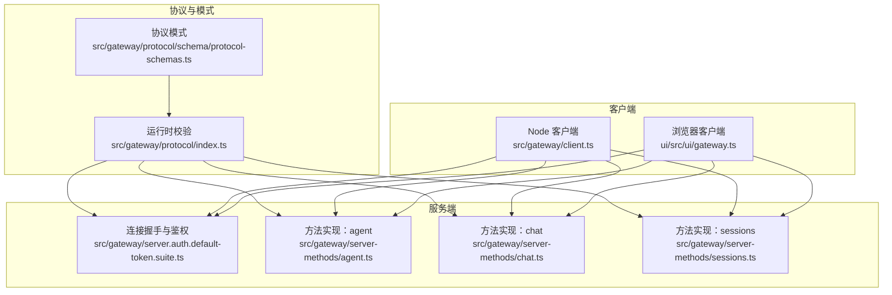
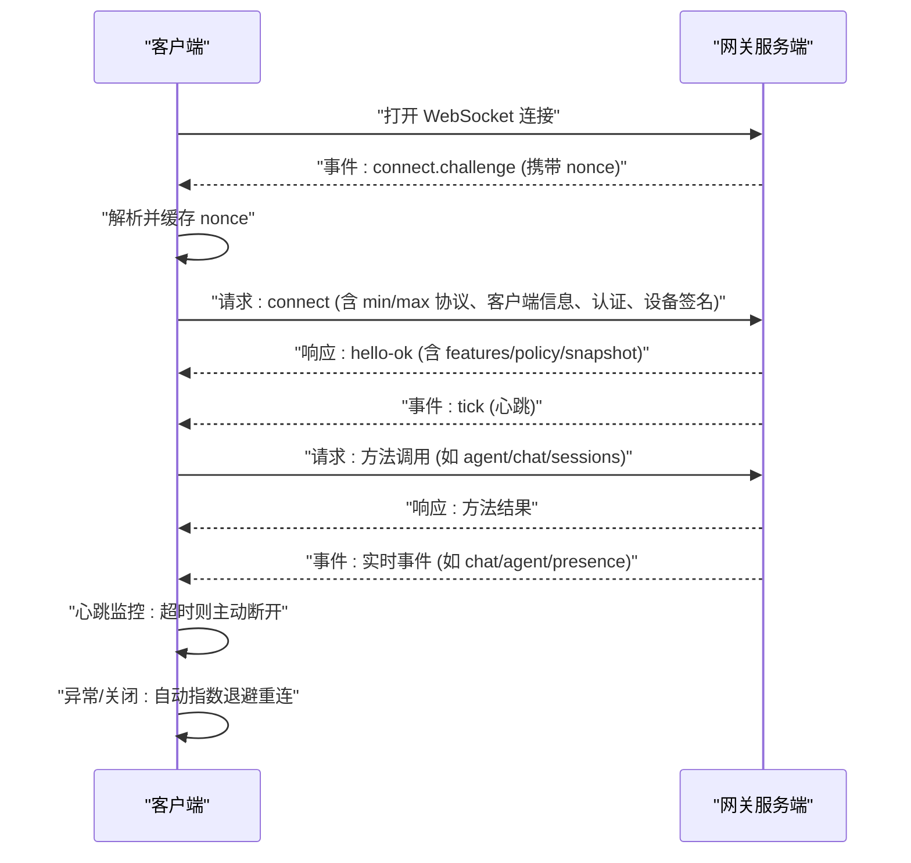
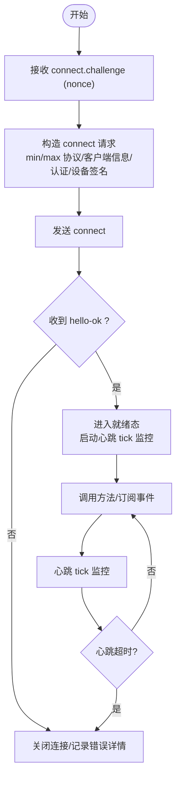
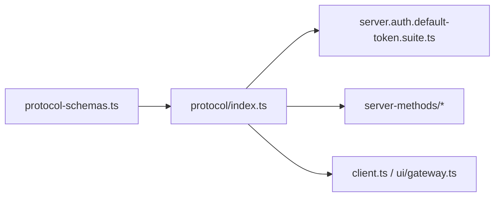

# WebSocket API

<cite>
**本文引用的文件**
- [src/gateway/client.ts](file://src/gateway/client.ts)
- [ui/src/ui/gateway.ts](file://ui/src/ui/gateway.ts)
- [src/gateway/server.auth.default-token.suite.ts](file://src/gateway/server.auth.default-token.suite.ts)
- [src/gateway/protocol/index.ts](file://src/gateway/protocol/index.ts)
- [src/gateway/protocol/schema/protocol-schemas.ts](file://src/gateway/protocol/schema/protocol-schemas.ts)
- [src/gateway/server-methods/agent.ts](file://src/gateway/server-methods/agent.ts)
- [src/gateway/server-methods/chat.ts](file://src/gateway/server-methods/chat.ts)
- [src/gateway/server-methods/sessions.ts](file://src/gateway/server-methods/sessions.ts)
- [docs/concepts/typebox.md](file://docs/concepts/typebox.md)
</cite>

## 目录

1. [简介](#简介)
2. [项目结构](#项目结构)
3. [核心组件](#核心组件)
4. [架构总览](#架构总览)
5. [详细组件分析](#详细组件分析)
6. [依赖关系分析](#依赖关系分析)
7. [性能考量](#性能考量)
8. [故障排查指南](#故障排查指南)
9. [结论](#结论)
10. [附录](#附录)

## 简介

本文件系统性阐述 OpenClaw 的 WebSocket API，覆盖连接建立、认证与设备令牌、心跳保活、消息格式规范、可用方法（agent、chat、sessions、nodes 等）以及实时交互模式（事件订阅、消息推送、状态同步）。同时提供连接错误处理、重连机制与超时管理的最佳实践，并给出客户端连接示例与常见用例。

## 项目结构

OpenClaw 的 WebSocket 协议由“TypeBox 模式 + 运行时校验 + 服务端方法实现”构成，客户端在 Node.js 与浏览器两端均有实现，分别对应后端守护进程与控制界面。

图表来源

- [src/gateway/protocol/schema/protocol-schemas.ts:162-299](file://src/gateway/protocol/schema/protocol-schemas.ts#L162-L299)
- [src/gateway/protocol/index.ts:460-564](file://src/gateway/protocol/index.ts#L460-L564)
- [src/gateway/server.auth.default-token.suite.ts:26-414](file://src/gateway/server.auth.default-token.suite.ts#L26-L414)
- [src/gateway/server-methods/agent.ts:149-784](file://src/gateway/server-methods/agent.ts#L149-L784)
- [src/gateway/server-methods/chat.ts:741-800](file://src/gateway/server-methods/chat.ts#L741-L800)
- [src/gateway/server-methods/sessions.ts:120-473](file://src/gateway/server-methods/sessions.ts#L120-L473)
- [src/gateway/client.ts:109-674](file://src/gateway/client.ts#L109-L674)
- [ui/src/ui/gateway.ts:139-470](file://ui/src/ui/gateway.ts#L139-L470)

章节来源

- [src/gateway/protocol/schema/protocol-schemas.ts:162-299](file://src/gateway/protocol/schema/protocol-schemas.ts#L162-L299)
- [src/gateway/protocol/index.ts:460-564](file://src/gateway/protocol/index.ts#L460-L564)
- [src/gateway/server.auth.default-token.suite.ts:26-414](file://src/gateway/server.auth.default-token.suite.ts#L26-L414)

## 核心组件

- 协议与模式
  - 使用 TypeBox 定义协议模式，统一生成 JSON Schema 并驱动运行时校验与跨语言代码生成。
  - 关键帧类型：请求帧、响应帧、事件帧；版本号固定为 3。
- 服务端
  - 握手与鉴权：要求首个帧必须是 connect 请求；支持共享令牌、设备令牌与设备签名三类认证路径。
  - 方法实现：agent、chat、sessions 等 RPC 方法均通过统一的请求/响应框架分发。
- 客户端
  - Node 客户端：负责与本地/远程网关建立连接、发送 connect、处理事件、心跳检测与自动重连。
  - 浏览器客户端：在安全上下文（HTTPS/localhost）下启用设备身份与设备令牌回退策略。

章节来源

- [src/gateway/protocol/schema/protocol-schemas.ts:301-301](file://src/gateway/protocol/schema/protocol-schemas.ts#L301-L301)
- [src/gateway/protocol/index.ts:561-561](file://src/gateway/protocol/index.ts#L561-L561)
- [src/gateway/server.auth.default-token.suite.ts:287-324](file://src/gateway/server.auth.default-token.suite.ts#L287-L324)
- [src/gateway/server-methods/agent.ts:149-784](file://src/gateway/server-methods/agent.ts#L149-L784)
- [src/gateway/server-methods/chat.ts:741-800](file://src/gateway/server-methods/chat.ts#L741-L800)
- [src/gateway/server-methods/sessions.ts:120-473](file://src/gateway/server-methods/sessions.ts#L120-L473)
- [src/gateway/client.ts:109-674](file://src/gateway/client.ts#L109-L674)
- [ui/src/ui/gateway.ts:139-470](file://ui/src/ui/gateway.ts#L139-L470)

## 架构总览

WebSocket 连接生命周期与交互流程如下：

图表来源

- [src/gateway/server.auth.default-token.suite.ts:287-324](file://src/gateway/server.auth.default-token.suite.ts#L287-L324)
- [src/gateway/client.ts:267-415](file://src/gateway/client.ts#L267-L415)
- [src/gateway/client.ts:596-618](file://src/gateway/client.ts#L596-L618)
- [src/gateway/client.ts:576-587](file://src/gateway/client.ts#L576-L587)

章节来源

- [src/gateway/server.auth.default-token.suite.ts:287-324](file://src/gateway/server.auth.default-token.suite.ts#L287-L324)
- [src/gateway/client.ts:267-415](file://src/gateway/client.ts#L267-L415)
- [src/gateway/client.ts:596-618](file://src/gateway/client.ts#L596-L618)
- [src/gateway/client.ts:576-587](file://src/gateway/client.ts#L576-L587)

## 详细组件分析

### 连接与认证

- 首帧约束
  - 必须先收到事件帧 "connect.challenge"，随后立即发送请求帧 "connect"，否则服务端会拒绝后续请求并可能关闭连接。
- 认证路径
  - 共享令牌/密码：适用于无需设备身份的场景。
  - 设备令牌：在受信任端点（本地或 wss+指纹匹配）可作为一次性回退使用。
  - 设备签名：在安全上下文（浏览器 HTTPS 或 Node 可用 crypto）下，使用设备公私钥对参数进行签名，提升安全性。
- 安全限制
  - 明文 ws:// 仅允许环回地址；远程连接需使用 wss://，或在受控网络中通过环境变量开启“断玻璃”模式（不推荐）。

图表来源

- [src/gateway/server.auth.default-token.suite.ts:287-324](file://src/gateway/server.auth.default-token.suite.ts#L287-L324)
- [src/gateway/client.ts:267-415](file://src/gateway/client.ts#L267-L415)
- [src/gateway/client.ts:596-618](file://src/gateway/client.ts#L596-L618)

章节来源

- [src/gateway/server.auth.default-token.suite.ts:287-324](file://src/gateway/server.auth.default-token.suite.ts#L287-L324)
- [src/gateway/server.auth.default-token.suite.ts:301-330](file://src/gateway/server.auth.default-token.suite.ts#L301-L330)
- [src/gateway/client.ts:134-196](file://src/gateway/client.ts#L134-L196)
- [src/gateway/client.ts:267-415](file://src/gateway/client.ts#L267-L415)
- [src/gateway/client.ts:596-618](file://src/gateway/client.ts#L596-L618)

### 心跳与保活

- 心跳事件
  - 服务端周期性下发 "tick" 事件；客户端记录最近一次 tick 时间戳。
- 超时判定
  - 若超过两倍心跳间隔未收到 "tick"，客户端主动关闭连接（应用自定义关闭码）。
- 心跳配置
  - 服务端可在 hello-ok 中返回心跳间隔策略；客户端据此调整最小监听间隔。

章节来源

- [src/gateway/client.ts:596-618](file://src/gateway/client.ts#L596-L618)
- [src/gateway/client.ts:384-389](file://src/gateway/client.ts#L384-L389)

### 消息格式规范

- 帧类型
  - 请求帧：type="req"，包含 id、method、params。
  - 响应帧：type="res"，包含 id、ok、payload 或 error。
  - 事件帧：type="event"，包含 event、payload、可选 seq、stateVersion。
- 版本与校验
  - 协议版本为 3；所有帧均通过 TypeBox 模式进行运行时校验。
- 错误结构
  - 响应错误包含 code、message、details 字段，便于客户端识别与恢复。

章节来源

- [docs/concepts/typebox.md:20-41](file://docs/concepts/typebox.md#L20-L41)
- [src/gateway/protocol/index.ts:561-561](file://src/gateway/protocol/index.ts#L561-L561)
- [src/gateway/protocol/index.ts:424-458](file://src/gateway/protocol/index.ts#L424-L458)

### 可用方法与参数说明

以下为常用方法清单与调用要点（参数与返回值以协议模式为准）：

- agent
  - agent：执行代理对话，支持消息、附件、通道、线程、超时、幂等键等参数。
  - agent.identity.get：查询代理身份信息。
  - agent.wait：等待代理运行结束，支持超时与终端快照。
- chat
  - chat.history：获取会话历史，支持截断与大小限制。
  - chat.send：发送消息到会话，支持外发路由、停用命令、输入净化等。
  - chat.abort：中止会话中的聊天运行。
- sessions
  - sessions.list：列出会话。
  - sessions.preview：预览多个会话的摘要。
  - sessions.resolve：解析会话键。
  - sessions.patch：修改会话条目。
  - sessions.reset：重置会话（新建/重置）。
  - sessions.delete：删除会话并可选归档转录。
  - sessions.get：获取会话消息。
  - sessions.compact：压缩会话转录文件。

章节来源

- [src/gateway/server-methods/agent.ts:149-784](file://src/gateway/server-methods/agent.ts#L149-L784)
- [src/gateway/server-methods/chat.ts:741-800](file://src/gateway/server-methods/chat.ts#L741-L800)
- [src/gateway/server-methods/sessions.ts:120-473](file://src/gateway/server-methods/sessions.ts#L120-L473)
- [src/gateway/protocol/index.ts:259-423](file://src/gateway/protocol/index.ts#L259-L423)

### 实时交互模式

- 事件订阅
  - 客户端在连接成功后即可订阅各类事件（如 chat、agent、presence、tick 等），事件帧包含 seq 与 stateVersion，用于顺序与状态同步。
- 消息推送
  - 服务端通过事件帧向客户端推送增量消息与最终态；客户端维护 lastSeq 与 lastTick，检测丢包与静默。
- 状态同步
  - hello-ok 中的 snapshot 与 policy 提供初始状态与策略；客户端据此初始化本地状态并调整心跳策略。

章节来源

- [src/gateway/client.ts:497-554](file://src/gateway/client.ts#L497-L554)
- [src/gateway/client.ts:384-389](file://src/gateway/client.ts#L384-L389)

### 连接错误处理、重连与超时

- 错误分类
  - 认证错误：令牌缺失/不匹配、速率限制、配对要求等，通常不自动重连，需人工干预。
  - 设备令牌不匹配：在受信端点可尝试一次性回退使用缓存设备令牌。
  - 握手超时：未在时限内完成 connect.challenge 到 connect 的转换。
- 重连策略
  - 指数退避（上限约 30 秒），关闭后清理 pending 请求并触发 onClose 回调。
- 超时管理
  - 握手挑战超时：connect.challenge 到 connect 的时限。
  - 心跳超时：超过两倍心跳间隔未收到 "tick"。

章节来源

- [src/gateway/client.ts:417-444](file://src/gateway/client.ts#L417-L444)
- [src/gateway/client.ts:556-574](file://src/gateway/client.ts#L556-L574)
- [src/gateway/client.ts:596-618](file://src/gateway/client.ts#L596-L618)
- [ui/src/ui/gateway.ts:57-79](file://ui/src/ui/gateway.ts#L57-L79)
- [ui/src/ui/gateway.ts:173-211](file://ui/src/ui/gateway.ts#L173-L211)

### 客户端连接示例与常见用例

- Node.js 客户端
  - 初始化 GatewayClient，设置 url、token/deviceToken/password、设备身份等，调用 start() 后等待 onHelloOk 回调。
  - 使用 request(method, params) 发送 RPC 请求，处理响应与事件回调。
- 浏览器客户端
  - 在安全上下文（HTTPS/localhost）下启用设备身份；若非安全上下文，回退至共享令牌。
  - 支持 onEvent 与 onClose 回调，自动处理重连与错误细节解析。

章节来源

- [src/gateway/client.ts:127-132](file://src/gateway/client.ts#L127-L132)
- [src/gateway/client.ts:134-251](file://src/gateway/client.ts#L134-L251)
- [ui/src/ui/gateway.ts:139-167](file://ui/src/ui/gateway.ts#L139-L167)
- [ui/src/ui/gateway.ts:220-387](file://ui/src/ui/gateway.ts#L220-L387)

## 依赖关系分析

- 协议层
  - protocol-schemas.ts 统一导出所有模式；index.ts 将模式编译为运行时校验函数。
- 服务端
  - server.auth.default-token.suite.ts 验证握手与认证行为；各方法文件按统一处理器接口实现。
- 客户端
  - Node 与浏览器客户端均依赖协议校验与错误细节解析，遵循相同的连接与重连逻辑。

图表来源

- [src/gateway/protocol/schema/protocol-schemas.ts:162-299](file://src/gateway/protocol/schema/protocol-schemas.ts#L162-L299)
- [src/gateway/protocol/index.ts:460-564](file://src/gateway/protocol/index.ts#L460-L564)
- [src/gateway/server.auth.default-token.suite.ts:26-414](file://src/gateway/server.auth.default-token.suite.ts#L26-L414)
- [src/gateway/server-methods/agent.ts:66-66](file://src/gateway/server-methods/agent.ts#L66-L66)
- [src/gateway/server-methods/chat.ts:68-68](file://src/gateway/server-methods/chat.ts#L68-L68)
- [src/gateway/server-methods/sessions.ts:46-46](file://src/gateway/server-methods/sessions.ts#L46-L46)
- [src/gateway/client.ts:1-41](file://src/gateway/client.ts#L1-L41)
- [ui/src/ui/gateway.ts:1-16](file://ui/src/ui/gateway.ts#L1-L16)

章节来源

- [src/gateway/protocol/schema/protocol-schemas.ts:162-299](file://src/gateway/protocol/schema/protocol-schemas.ts#L162-L299)
- [src/gateway/protocol/index.ts:460-564](file://src/gateway/protocol/index.ts#L460-L564)

## 性能考量

- 大消息与负载
  - 客户端允许较大的消息载荷（例如屏幕快照），但服务端对历史消息与单条消息大小有硬性上限与预算控制，避免内存压力。
- 心跳与带宽
  - 合理的心跳间隔可降低网络压力；客户端在最小间隔与服务端策略之间取较大者。
- 幂等与去重
  - 服务端对关键操作（如 agent）采用去重与快照机制，避免重复执行与响应风暴。

章节来源

- [src/gateway/client.ts:169-172](file://src/gateway/client.ts#L169-L172)
- [src/gateway/server-methods/chat.ts:458-478](file://src/gateway/server-methods/chat.ts#L458-L478)
- [src/gateway/server-methods/agent.ts:212-218](file://src/gateway/server-methods/agent.ts#L212-L218)

## 故障排查指南

- 常见错误与恢复建议
  - 认证失败：检查 token/password/deviceToken 是否正确；对于设备令牌不匹配，在受信端点可尝试一次性回退。
  - 握手超时：确认网络延迟与服务器负载；适当增加 connectDelayMs。
  - 心跳超时：检查网络稳定性与服务器健康；必要时缩短心跳间隔。
- 客户端诊断
  - 使用 onConnectError/onClose/onEvent 回调输出日志；利用错误详情 code 与 details 辅助定位。
  - 对于浏览器端，区分 isNonRecoverableAuthError 的错误类型决定是否自动重连。

章节来源

- [src/gateway/client.ts:417-444](file://src/gateway/client.ts#L417-L444)
- [src/gateway/client.ts:556-574](file://src/gateway/client.ts#L556-L574)
- [src/gateway/client.ts:596-618](file://src/gateway/client.ts#L596-L618)
- [ui/src/ui/gateway.ts:57-79](file://ui/src/ui/gateway.ts#L57-L79)
- [ui/src/ui/gateway.ts:173-211](file://ui/src/ui/gateway.ts#L173-L211)

## 结论

OpenClaw 的 WebSocket API 以 TypeBox 模式为核心，确保协议一致性与跨语言生成能力；通过 connect.challenge + connect 的握手流程与多级认证路径，兼顾易用性与安全性；心跳与重连机制保障长连接稳定；统一的请求/响应/事件模型使实时交互清晰可控。建议在生产环境中优先使用 wss:// 与设备签名认证，并结合错误详情与日志进行稳健的故障排查与自动化运维。

## 附录

- 协议版本：3
- 关键帧：req/res/event
- 常用方法：agent._、chat._、sessions.\*

章节来源

- [src/gateway/protocol/schema/protocol-schemas.ts:301-301](file://src/gateway/protocol/schema/protocol-schemas.ts#L301-L301)
- [docs/concepts/typebox.md:20-41](file://docs/concepts/typebox.md#L20-L41)
