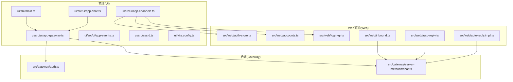
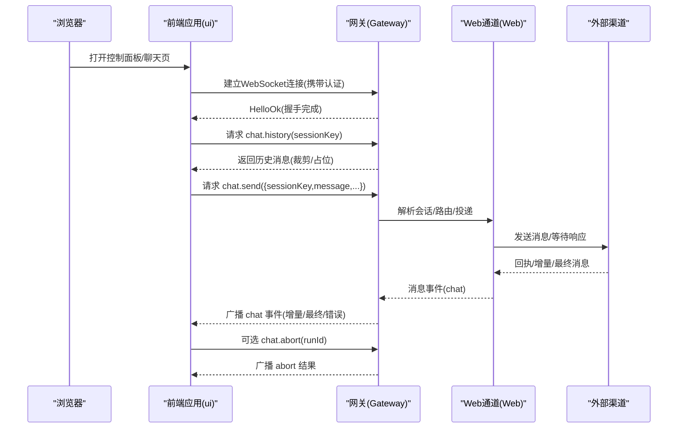
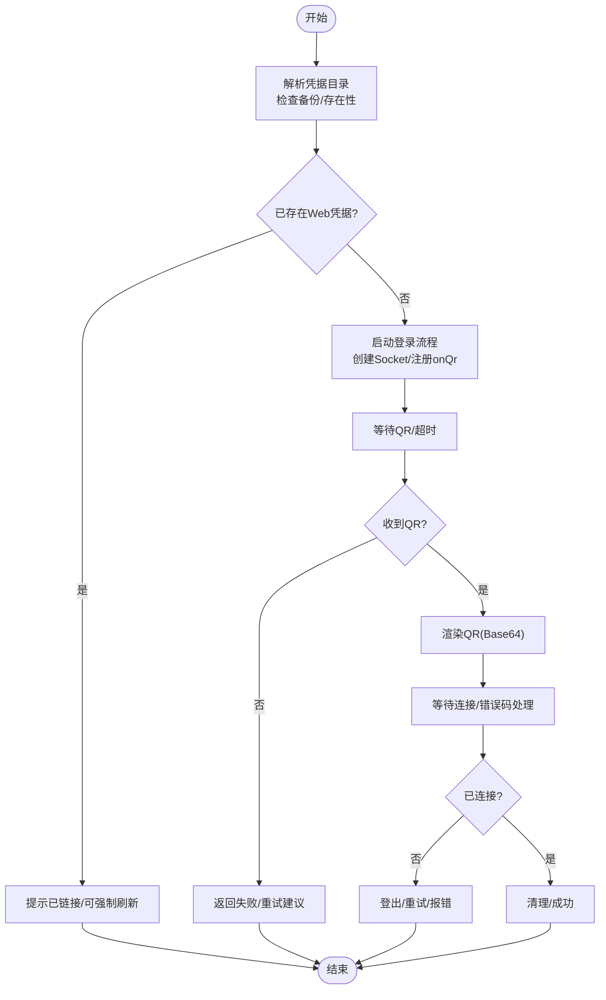
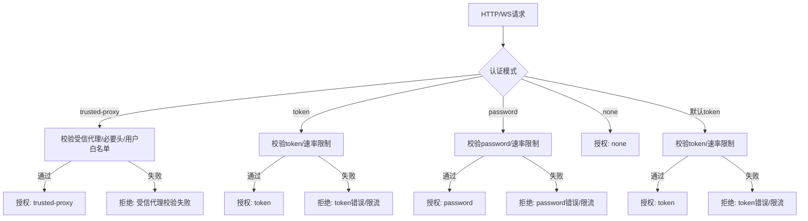
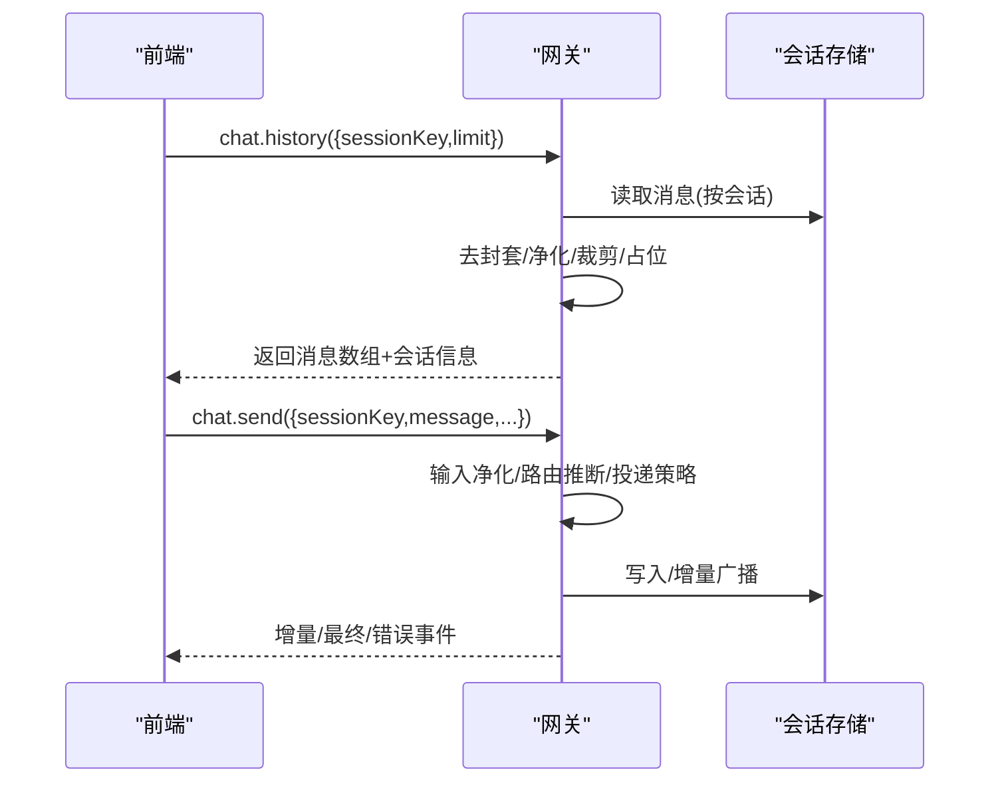
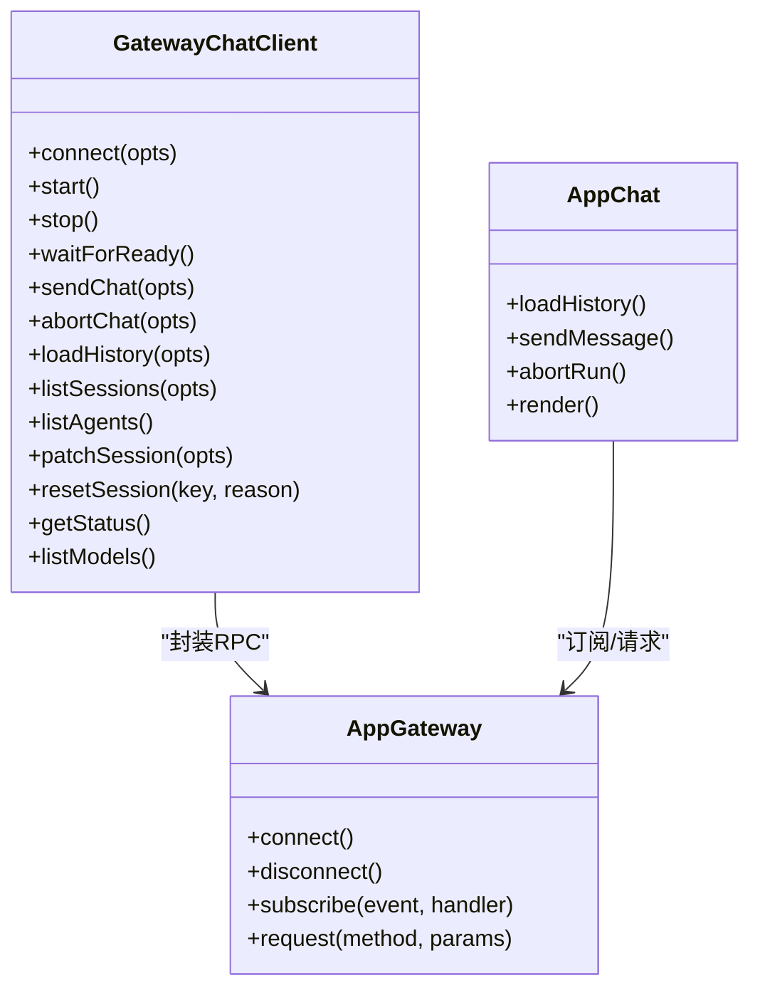
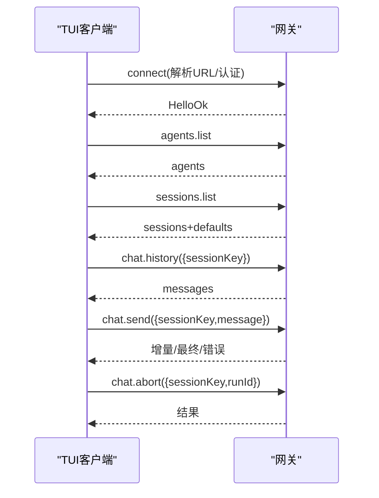
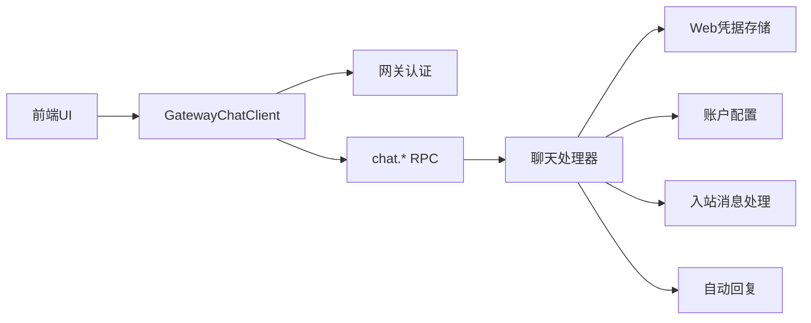

# Web界面API

<cite>
**本文引用的文件**
- [src/web/auth-store.ts](file://src/web/auth-store.ts)
- [src/web/accounts.ts](file://src/web/accounts.ts)
- [src/web/login-qr.ts](file://src/web/login-qr.ts)
- [src/web/inbound.ts](file://src/web/inbound.ts)
- [src/web/auto-reply.ts](file://src/web/auto-reply.ts)
- [src/web/auto-reply.impl.ts](file://src/web/auto-reply.impl.ts)
- [src/web/active-listener.ts](file://src/web/active-listener.ts)
- [src/gateway/auth.ts](file://src/gateway/auth.ts)
- [src/gateway/server-methods/chat.ts](file://src/gateway/server-methods/chat.ts)
- [src/tui/gateway-chat.ts](file://src/tui/gateway-chat.ts)
- [src/tui/tui-session-actions.ts](file://src/tui/tui-session-actions.ts)
- [ui/src/ui/app-gateway.ts](file://ui/src/ui/app-gateway.ts)
- [ui/src/ui/app-chat.ts](file://ui/src/ui/app-chat.ts)
- [ui/src/ui/app-channels.ts](file://ui/src/ui/app-channels.ts)
- [ui/src/ui/app-events.ts](file://ui/src/ui/app-events.ts)
- [ui/src/main.ts](file://ui/src/main.ts)
- [ui/src/css.d.ts](file://ui/src/css.d.ts)
- [ui/vite.config.ts](file://ui/vite.config.ts)
- [docs/web/webchat.md](file://docs/web/webchat.md)
- [docs/web/control-ui.md](file://docs/web/control-ui.md)
- [docs/web/tui.md](file://docs/web/tui.md)
</cite>

## 目录

1. [简介](#简介)
2. [项目结构](#项目结构)
3. [核心组件](#核心组件)
4. [架构总览](#架构总览)
5. [详细组件分析](#详细组件分析)
6. [依赖关系分析](#依赖关系分析)
7. [性能考量](#性能考量)
8. [故障排查指南](#故障排查指南)
9. [结论](#结论)
10. [附录](#附录)

## 简介

本文件系统性梳理 OpenClaw 的 Web 界面 API，覆盖以下方面：

- Web 控制面板与聊天界面的架构设计与前后端交互机制
- TUI（文本用户界面）的 API 接口与终端集成方式
- Web 聊天界面的实时通信协议与消息处理流程
- Web 组件的 API：会话管理、设置配置、状态监控
- 认证机制、会话管理与权限控制
- 响应式设计与移动端适配指南
- 自定义与扩展方法
- 安全与性能优化策略

## 项目结构

OpenClaw 的 Web 相关代码主要分布在如下位置：

- 后端网关与聊天处理：src/gateway/server-methods/chat.ts、src/gateway/auth.ts
- Web 通道与会话：src/web/auth-store.ts、src/web/accounts.ts、src/web/login-qr.ts、src/web/inbound.ts、src/web/auto-reply\*.ts
- 前端 UI：ui/src 下的入口、应用模块与样式
- 文档：docs/web/\*.md

**图表来源**

- [ui/src/main.ts:1-200](file://ui/src/main.ts#L1-L200)
- [ui/src/ui/app-gateway.ts:1-200](file://ui/src/ui/app-gateway.ts#L1-L200)
- [ui/src/ui/app-chat.ts:1-200](file://ui/src/ui/app-chat.ts#L1-L200)
- [ui/src/ui/app-channels.ts:1-200](file://ui/src/ui/app-channels.ts#L1-L200)
- [ui/src/ui/app-events.ts:1-200](file://ui/src/ui/app-events.ts#L1-L200)
- [src/gateway/auth.ts:1-200](file://src/gateway/auth.ts#L1-L200)
- [src/gateway/server-methods/chat.ts:1-200](file://src/gateway/server-methods/chat.ts#L1-L200)
- [src/web/auth-store.ts:1-200](file://src/web/auth-store.ts#L1-L200)
- [src/web/accounts.ts:1-200](file://src/web/accounts.ts#L1-L200)
- [src/web/login-qr.ts:1-200](file://src/web/login-qr.ts#L1-L200)
- [src/web/inbound.ts:1-200](file://src/web/inbound.ts#L1-L200)
- [src/web/auto-reply.ts:1-200](file://src/web/auto-reply.ts#L1-L200)
- [src/web/auto-reply.impl.ts:1-200](file://src/web/auto-reply.impl.ts#L1-L200)

**章节来源**

- [ui/src/main.ts:1-200](file://ui/src/main.ts#L1-L200)
- [ui/src/ui/app-gateway.ts:1-200](file://ui/src/ui/app-gateway.ts#L1-L200)
- [src/gateway/auth.ts:1-200](file://src/gateway/auth.ts#L1-L200)
- [src/gateway/server-methods/chat.ts:1-200](file://src/gateway/server-methods/chat.ts#L1-L200)

## 核心组件

- 认证与授权
  - 后端支持多种模式：无认证、令牌、密码、受信代理、Tailscale 头部认证；支持速率限制与本地直连判定。
  - 前端通过 GatewayClient 连接，携带 token/password 或利用受信代理/头部认证。
- Web 会话与通道
  - Web 渠道凭据存储与恢复、清理、自检；支持 WhatsApp Web 登录二维码生成与等待连接。
  - 账户解析与媒体限制、策略配置等。
- 聊天与历史
  - chat.history、chat.send、chat.abort 等 RPC；消息历史裁剪、超大消息占位、静默回复过滤。
- 前端应用
  - 应用入口、网关连接、聊天视图、频道管理、事件分发与渲染。

**章节来源**

- [src/gateway/auth.ts:1-200](file://src/gateway/auth.ts#L1-L200)
- [src/web/auth-store.ts:1-200](file://src/web/auth-store.ts#L1-L200)
- [src/web/accounts.ts:1-200](file://src/web/accounts.ts#L1-L200)
- [src/web/login-qr.ts:1-200](file://src/web/login-qr.ts#L1-L200)
- [src/gateway/server-methods/chat.ts:1-200](file://src/gateway/server-methods/chat.ts#L1-L200)
- [ui/src/ui/app-gateway.ts:1-200](file://ui/src/ui/app-gateway.ts#L1-L200)
- [ui/src/ui/app-chat.ts:1-200](file://ui/src/ui/app-chat.ts#L1-L200)

## 架构总览

Web 界面由“前端 UI + 网关后端 + Web 通道层”构成。前端通过 WebSocket 与网关建立长连接，使用统一的 RPC 协议进行聊天、会话查询与状态更新。Web 通道层负责与外部渠道（如 WhatsApp）的会话与凭据管理。

**图表来源**

- [src/gateway/server-methods/chat.ts:740-820](file://src/gateway/server-methods/chat.ts#L740-L820)
- [src/gateway/auth.ts:378-504](file://src/gateway/auth.ts#L378-L504)
- [ui/src/ui/app-gateway.ts:1-200](file://ui/src/ui/app-gateway.ts#L1-L200)
- [ui/src/ui/app-chat.ts:1-200](file://ui/src/ui/app-chat.ts#L1-L200)

## 详细组件分析

### Web 认证与会话管理

- 凭据与目录
  - Web 渠道凭据路径解析、备份恢复、存在性检查、清理与自检。
  - 默认凭据目录与账号解析，支持多账号与媒体限制。
- 登录二维码
  - 生成 QR、渲染 PNG Base64、等待连接、错误处理与重试。
- 会话生命周期
  - 会话键解析、默认账号、消息历史读取与裁剪、超大消息占位。

**图表来源**

- [src/web/auth-store.ts:82-150](file://src/web/auth-store.ts#L82-L150)
- [src/web/accounts.ts:116-167](file://src/web/accounts.ts#L116-L167)
- [src/web/login-qr.ts:108-214](file://src/web/login-qr.ts#L108-L214)
- [src/web/login-qr.ts:216-296](file://src/web/login-qr.ts#L216-L296)

**章节来源**

- [src/web/auth-store.ts:1-207](file://src/web/auth-store.ts#L1-L207)
- [src/web/accounts.ts:1-167](file://src/web/accounts.ts#L1-L167)
- [src/web/login-qr.ts:1-296](file://src/web/login-qr.ts#L1-L296)

### 网关认证与授权

- 支持模式
  - none/token/password/trusted-proxy，默认 token；允许 Tailscale 头部认证（WS 控制 UI 场景）。
- 授权流程
  - 受信代理校验、速率限制、Tailscale 身份核验、明文/令牌比对。
- 本地直连判定
  - 基于 Host/Forwarded/X-Real-IP 判断本地直连请求。

**图表来源**

- [src/gateway/auth.ts:217-504](file://src/gateway/auth.ts#L217-L504)

**章节来源**

- [src/gateway/auth.ts:1-504](file://src/gateway/auth.ts#L1-L504)

### 聊天与历史处理

- chat.history
  - 参数校验、会话加载、消息读取、去封套、裁剪、超大消息占位、最终预算约束。
- chat.send
  - 输入净化、会话路由推断、投递策略、增量/最终/错误广播。
- chat.abort
  - 部分输出持久化、运行中任务终止、结果回传。

**图表来源**

- [src/gateway/server-methods/chat.ts:740-820](file://src/gateway/server-methods/chat.ts#L740-L820)
- [src/gateway/server-methods/chat.ts:1-200](file://src/gateway/server-methods/chat.ts#L1-L200)

**章节来源**

- [src/gateway/server-methods/chat.ts:1-820](file://src/gateway/server-methods/chat.ts#L1-L820)

### 前端应用与实时通信

- 应用入口与模块
  - 入口文件初始化 UI；应用模块负责网关连接、聊天视图、频道管理、事件分发。
- 实时事件
  - chat 增量/最终/错误；工具事件；心跳/状态。
- 会话与模型
  - 会话列表、会话信息、模型选择、历史加载与渲染。

**图表来源**

- [src/tui/gateway-chat.ts:130-266](file://src/tui/gateway-chat.ts#L130-L266)
- [ui/src/ui/app-gateway.ts:1-200](file://ui/src/ui/app-gateway.ts#L1-L200)
- [ui/src/ui/app-chat.ts:1-200](file://ui/src/ui/app-chat.ts#L1-L200)

**章节来源**

- [src/tui/gateway-chat.ts:1-432](file://src/tui/gateway-chat.ts#L1-L432)
- [ui/src/ui/app-gateway.ts:1-200](file://ui/src/ui/app-gateway.ts#L1-L200)
- [ui/src/ui/app-chat.ts:1-200](file://ui/src/ui/app-chat.ts#L1-L200)

### TUI（文本用户界面）API 与终端集成

- 连接与认证
  - 从配置/环境变量解析网关 URL 与认证参数；支持远程模式与受信代理场景。
- 会话与聊天
  - sessions.list、agents.list、chat.history、chat.send、chat.abort、sessions.patch/reset、models.list。
- 会话动作
  - 加载历史、设置会话、中止运行、刷新会话信息、应用补丁结果。

**图表来源**

- [src/tui/gateway-chat.ts:187-266](file://src/tui/gateway-chat.ts#L187-L266)
- [src/tui/tui-session-actions.ts:279-352](file://src/tui/tui-session-actions.ts#L279-L352)

**章节来源**

- [src/tui/gateway-chat.ts:1-432](file://src/tui/gateway-chat.ts#L1-L432)
- [src/tui/tui-session-actions.ts:1-399](file://src/tui/tui-session-actions.ts#L1-L399)

### Web 聊天界面实时通信协议与消息处理

- 协议与事件
  - chat 增量/最终/错误；工具事件；心跳/状态。
- 消息处理
  - 历史加载与渲染；输入净化与路由推断；超大消息占位；静默回复过滤。
- 文档参考
  - Web 聊天与控制面板文档。

**章节来源**

- [src/gateway/server-methods/chat.ts:700-740](file://src/gateway/server-methods/chat.ts#L700-L740)
- [docs/web/webchat.md:1-200](file://docs/web/webchat.md#L1-L200)
- [docs/web/control-ui.md:1-200](file://docs/web/control-ui.md#L1-L200)

## 依赖关系分析

- 前端依赖后端网关提供的 RPC 接口；UI 通过 GatewayChatClient 封装请求与事件订阅。
- Web 通道层依赖后端聊天处理器；Web 通道层负责与外部渠道的会话与凭据管理。
- 认证层在 HTTP/WS 层统一生效，支持多种模式与速率限制。

**图表来源**

- [src/tui/gateway-chat.ts:130-266](file://src/tui/gateway-chat.ts#L130-L266)
- [src/gateway/auth.ts:1-200](file://src/gateway/auth.ts#L1-L200)
- [src/gateway/server-methods/chat.ts:1-200](file://src/gateway/server-methods/chat.ts#L1-L200)
- [src/web/auth-store.ts:1-200](file://src/web/auth-store.ts#L1-L200)
- [src/web/accounts.ts:1-200](file://src/web/accounts.ts#L1-L200)
- [src/web/inbound.ts:1-200](file://src/web/inbound.ts#L1-L200)
- [src/web/auto-reply.ts:1-200](file://src/web/auto-reply.ts#L1-L200)

**章节来源**

- [src/tui/gateway-chat.ts:1-432](file://src/tui/gateway-chat.ts#L1-L432)
- [src/gateway/auth.ts:1-504](file://src/gateway/auth.ts#L1-L504)
- [src/gateway/server-methods/chat.ts:1-820](file://src/gateway/server-methods/chat.ts#L1-L820)

## 性能考量

- 消息历史裁剪
  - 单条消息字节上限、历史总字节上限、最终预算约束，避免内存与带宽压力。
- 增量广播
  - chat 增量/最终/错误事件，减少一次性传输大数据。
- 会话与模型选择
  - 通过 sessions.list 与 models.list 获取当前上下文，避免重复计算。
- 速率限制
  - 认证失败与限流策略，保护后端资源。

**章节来源**

- [src/gateway/server-methods/chat.ts:458-478](file://src/gateway/server-methods/chat.ts#L458-L478)
- [src/gateway/auth.ts:415-431](file://src/gateway/auth.ts#L415-L431)

## 故障排查指南

- Web 登录
  - 检查凭据目录是否存在与可解析；若损坏，尝试从备份恢复；必要时清理凭据后重新登录。
  - 若长时间未扫描，QR 过期需重新生成。
- 连接与认证
  - 确认网关认证模式与凭据；受信代理需正确配置头与用户；Tailscale 头部认证仅在 WS 控制 UI 场景启用。
- 聊天异常
  - 观察 chat 事件是否正常广播；若出现错误，查看错误码与日志；必要时中止运行或重置会话。
- TUI 会话
  - 使用 sessions.list 与 agents.list 校验当前会话与模型；通过 patchSession 调整模型或提供者。

**章节来源**

- [src/web/auth-store.ts:51-102](file://src/web/auth-store.ts#L51-L102)
- [src/web/login-qr.ts:216-296](file://src/web/login-qr.ts#L216-L296)
- [src/gateway/auth.ts:378-504](file://src/gateway/auth.ts#L378-L504)
- [src/gateway/server-methods/chat.ts:722-740](file://src/gateway/server-methods/chat.ts#L722-L740)
- [src/tui/tui-session-actions.ts:249-256](file://src/tui/tui-session-actions.ts#L249-L256)

## 结论

OpenClaw 的 Web 界面以“前端 UI + 网关 RPC + Web 通道层”为核心架构，通过统一的聊天协议与事件机制实现跨渠道的实时通信。认证层支持多种模式并具备速率限制与本地直连判定，确保安全性与可用性。前端应用模块化清晰，便于扩展与维护。通过消息裁剪、增量广播与会话模型选择等策略，兼顾性能与用户体验。

## 附录

- 响应式设计与移动端适配
  - 前端样式与构建配置位于 ui/src 与 ui/vite.config.ts；建议基于现有样式体系扩展移动端布局与交互。
- 自定义与扩展
  - 新增渠道：在 Web 通道层实现凭据管理与会话逻辑，接入聊天处理器；在前端新增对应视图与事件处理。
  - 自定义 UI：在 ui/src 下新增模块，复用 GatewayChatClient 的 RPC 能力。
- 安全与合规
  - 强制使用受信代理或令牌/密码认证；严格限制速率；最小暴露原则；定期轮换密钥与清理过期凭据。

**章节来源**

- [ui/src/css.d.ts:1-200](file://ui/src/css.d.ts#L1-L200)
- [ui/vite.config.ts:1-200](file://ui/vite.config.ts#L1-L200)
- [docs/web/webchat.md:1-200](file://docs/web/webchat.md#L1-L200)
- [docs/web/control-ui.md:1-200](file://docs/web/control-ui.md#L1-L200)
- [docs/web/tui.md:1-200](file://docs/web/tui.md#L1-L200)
