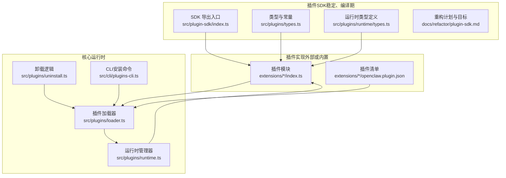
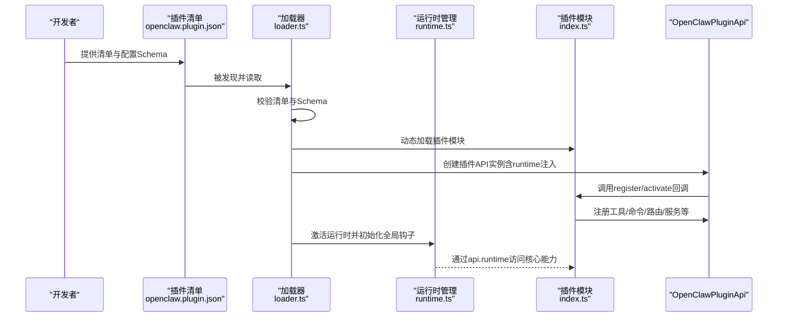
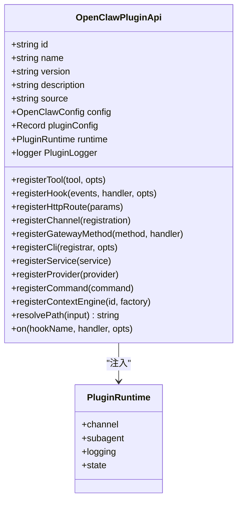
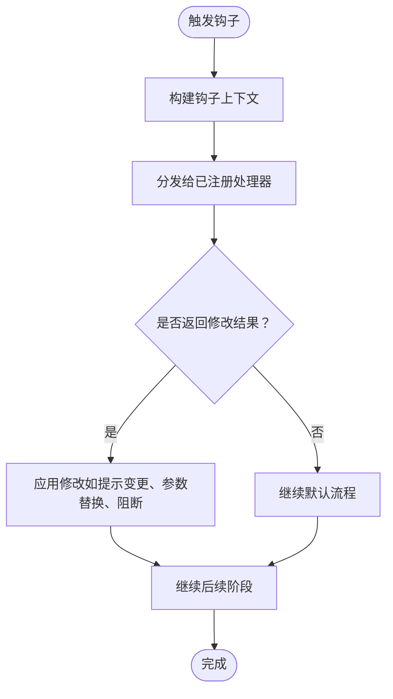
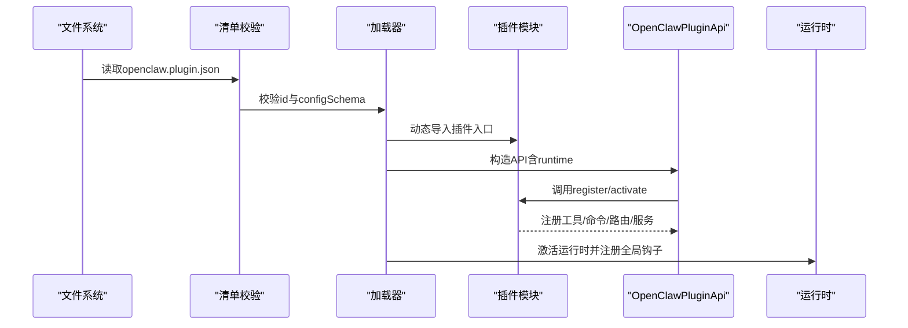
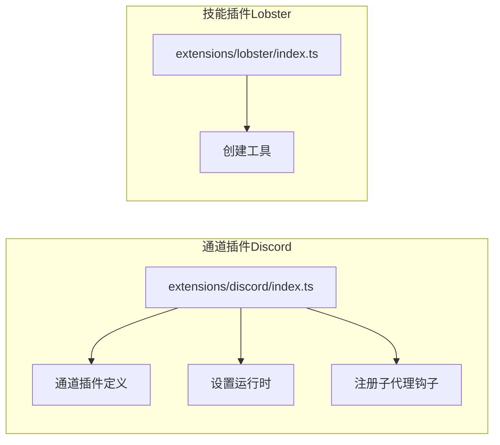
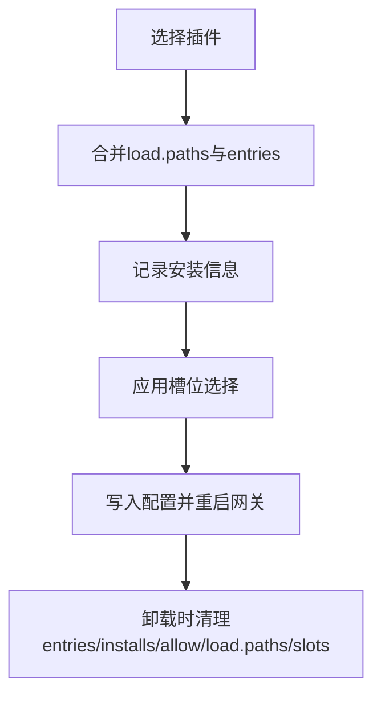
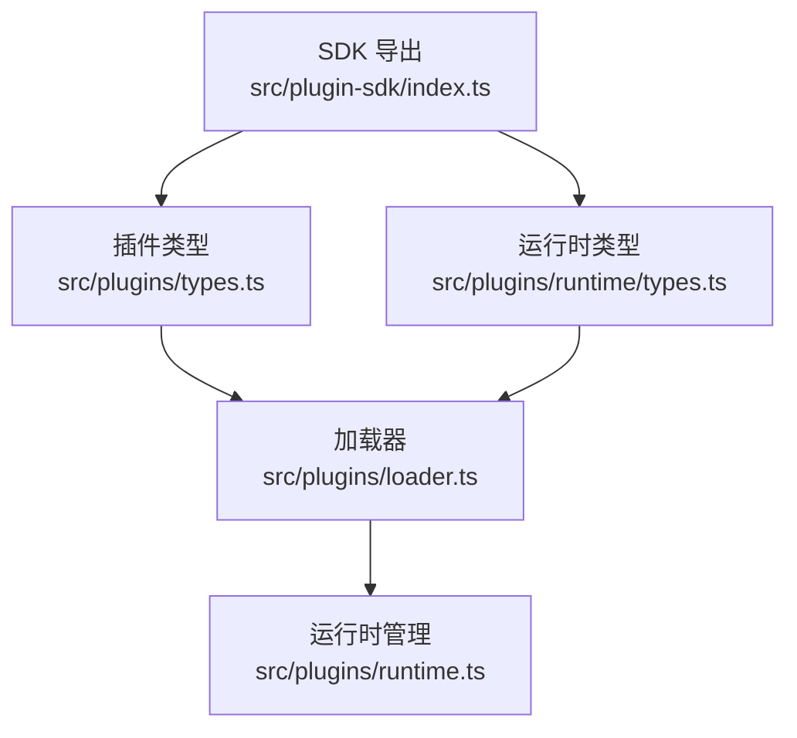

# 插件API

<cite>
**本文引用的文件**
- [index.ts](file://src/plugin-sdk/index.ts)
- [plugin-sdk.md](file://docs/refactor/plugin-sdk.md)
- [manifest.md](file://docs/plugins/manifest.md)
- [types.ts](file://src/plugins/types.ts)
- [runtime/types.ts](file://src/plugins/runtime/types.ts)
- [loader.ts](file://src/plugins/loader.ts)
- [runtime.ts](file://src/plugins/runtime.ts)
- [uninstall.ts](file://src/plugins/uninstall.ts)
- [plugins-cli.ts](file://src/cli/plugins-cli.ts)
- [discord/openclaw.plugin.json](file://extensions/discord/openclaw.plugin.json)
- [discord/index.ts](file://extensions/discord/index.ts)
- [lobster/openclaw.plugin.json](file://extensions/lobster/openclaw.plugin.json)
- [lobster/index.ts](file://extensions/lobster/index.ts)
</cite>

## 目录

1. [简介](#简介)
2. [项目结构](#项目结构)
3. [核心组件](#核心组件)
4. [架构总览](#架构总览)
5. [详细组件分析](#详细组件分析)
6. [依赖关系分析](#依赖关系分析)
7. [性能考量](#性能考量)
8. [故障排查指南](#故障排查指南)
9. [结论](#结论)
10. [附录](#附录)

## 简介

本文件面向OpenClaw插件开发者，系统性阐述插件API的设计理念、生命周期管理、扩展机制与运行时接口。内容覆盖：

- 插件SDK与运行时的职责划分与边界
- 生命周期（加载、注册、激活、服务启动）
- 配置验证与清单规范
- 事件系统与钩子机制
- 工具、命令、HTTP路由、网关方法、服务等扩展点
- 安全沙箱、权限控制与资源限制
- 打包、发布与版本管理
- 调试、测试与性能优化
- 插件与核心系统的交互与数据交换格式

## 项目结构

OpenClaw采用“插件SDK + 运行时”的双层架构：

- SDK层：稳定、可发布、无副作用，提供类型、配置Schema、工具与适配器等
- 运行时层：注入到插件中，提供对核心行为的访问与调用

图示来源

- [index.ts:1-826](file://src/plugin-sdk/index.ts#L1-L826)
- [plugin-sdk.md:1-215](file://docs/refactor/plugin-sdk.md#L1-L215)
- [types.ts:263-306](file://src/plugins/types.ts#L263-L306)
- [runtime/types.ts:51-64](file://src/plugins/runtime/types.ts#L51-L64)
- [loader.ts:412-828](file://src/plugins/loader.ts#L412-L828)
- [runtime.ts:1-49](file://src/plugins/runtime.ts#L1-L49)
- [uninstall.ts:65-156](file://src/plugins/uninstall.ts#L65-L156)
- [plugins-cli.ts:156-197](file://src/cli/plugins-cli.ts#L156-L197)

章节来源

- [index.ts:1-826](file://src/plugin-sdk/index.ts#L1-L826)
- [plugin-sdk.md:1-215](file://docs/refactor/plugin-sdk.md#L1-L215)

## 核心组件

- 插件SDK导出入口：统一暴露类型、工具函数、适配器与运行时接口，确保插件不直接导入核心源码
- 插件运行时接口：通过OpenClawPluginApi.runtime访问核心能力，如文本分块、回复派发、路由解析、媒体处理、提及匹配、群组策略、防抖、命令授权等
- 插件生命周期：发现与清单校验 → 加载与注册 → 激活与服务启动 → 卸载与清理
- 事件与钩子：围绕模型选择、提示构建、消息收发、工具调用、会话与子代理生命周期等提供丰富钩子
- 扩展点：工具、命令、HTTP路由、网关方法、服务、上下文引擎、提供商认证

章节来源

- [index.ts:1-826](file://src/plugin-sdk/index.ts#L1-L826)
- [types.ts:263-306](file://src/plugins/types.ts#L263-L306)
- [runtime/types.ts:51-64](file://src/plugins/runtime/types.ts#L51-L64)

## 架构总览

下图展示从插件清单到加载器、运行时注入与API使用的端到端流程。

图示来源

- [manifest.md:1-76](file://docs/plugins/manifest.md#L1-L76)
- [loader.ts:412-828](file://src/plugins/loader.ts#L412-L828)
- [runtime.ts:1-49](file://src/plugins/runtime.ts#L1-L49)
- [discord/index.ts:1-20](file://extensions/discord/index.ts#L1-L20)

章节来源

- [manifest.md:1-76](file://docs/plugins/manifest.md#L1-L76)
- [loader.ts:412-828](file://src/plugins/loader.ts#L412-L828)
- [runtime.ts:1-49](file://src/plugins/runtime.ts#L1-L49)

## 详细组件分析

### 组件A：插件SDK与运行时接口

- SDK职责：类型、配置Schema、工具与适配器、常量与帮助函数
- 运行时接口：文本分块、回复派发、路由解析、配对、媒体、提及、群组策略、防抖、命令授权；以及子代理运行与会话管理
- 设计原则：SDK稳定、运行时最小但完整，所有核心行为仅能通过runtime访问

图示来源

- [types.ts:263-306](file://src/plugins/types.ts#L263-L306)
- [runtime/types.ts:51-64](file://src/plugins/runtime/types.ts#L51-L64)

章节来源

- [index.ts:1-826](file://src/plugin-sdk/index.ts#L1-L826)
- [types.ts:263-306](file://src/plugins/types.ts#L263-L306)
- [runtime/types.ts:51-64](file://src/plugins/runtime/types.ts#L51-L64)

### 组件B：事件系统与钩子机制

- 钩子命名与覆盖范围：模型解析、提示构建、代理开始/结束、消息收发、工具调用前后、结果持久化、会话与子代理生命周期、网关启停等
- 钩子事件对象：携带上下文信息（如agentId、sessionId、runId、channelId等），支持修改提示、参数、消息内容或阻断执行
- 兼容性：保留“before_agent_start”作为兼容钩子，自动剥离非提示字段

图示来源

- [types.ts:321-377](file://src/plugins/types.ts#L321-L377)
- [types.ts:410-488](file://src/plugins/types.ts#L410-L488)

章节来源

- [types.ts:321-377](file://src/plugins/types.ts#L321-L377)
- [types.ts:410-488](file://src/plugins/types.ts#L410-L488)

### 组件C：插件注册流程与配置验证

- 清单要求：每个插件必须在根目录提供openclaw.plugin.json，包含id与configSchema；Schema在配置读写时严格校验
- 加载与激活：加载器按路径扫描、读取清单、校验Schema、动态加载模块、调用register/activate、注入runtime并初始化全局钩子
- 诊断与错误：对缺失导出、无效配置、未跟踪加载等情况记录诊断信息与警告

图示来源

- [manifest.md:1-76](file://docs/plugins/manifest.md#L1-L76)
- [loader.ts:412-828](file://src/plugins/loader.ts#L412-L828)

章节来源

- [manifest.md:1-76](file://docs/plugins/manifest.md#L1-L76)
- [loader.ts:412-828](file://src/plugins/loader.ts#L412-L828)

### 组件D：插件实现模式示例

- 通道插件（以Discord为例）：通过setDiscordRuntime注入运行时，注册通道插件与子代理钩子
- 技能插件（以Lobster为例）：使用工厂模式注册工具，结合sandboxed标志进行沙箱控制

图示来源

- [discord/index.ts:1-20](file://extensions/discord/index.ts#L1-L20)
- [lobster/index.ts:1-19](file://extensions/lobster/index.ts#L1-L19)

章节来源

- [discord/index.ts:1-20](file://extensions/discord/index.ts#L1-L20)
- [lobster/index.ts:1-19](file://extensions/lobster/index.ts#L1-L19)

### 组件E：安全沙箱、权限控制与资源限制

- 沙箱控制：工具工厂可通过ctx.sandboxed判断是否在受限环境中运行，必要时返回null避免危险操作
- 权限控制：命令授权、群组策略、允许列表与DM策略、提及门控等由SDK与运行时共同保障
- 资源限制：媒体大小限制、请求体大小限制、速率限制与异常追踪等

章节来源

- [lobster/index.ts:9-17](file://extensions/lobster/index.ts#L9-L17)
- [index.ts:500-520](file://src/plugin-sdk/index.ts#L500-L520)
- [index.ts:431-452](file://src/plugin-sdk/index.ts#L431-L452)

### 组件F：打包、发布与版本管理

- 版本与兼容：SDK语义化版本；运行时随核心版本更新；插件声明所需运行时范围
- 发布与安装：CLI提供安装内置插件与路径插件的能力，自动合并load.paths、entries并记录安装信息
- 卸载：从entries、installs、allow、load.paths与slots中清理插件引用，并重置专属槽位

图示来源

- [plugins-cli.ts:156-197](file://src/cli/plugins-cli.ts#L156-L197)
- [uninstall.ts:65-156](file://src/plugins/uninstall.ts#L65-L156)

章节来源

- [plugins-cli.ts:156-197](file://src/cli/plugins-cli.ts#L156-L197)
- [uninstall.ts:65-156](file://src/plugins/uninstall.ts#L65-L156)

## 依赖关系分析

- 插件SDK与运行时的耦合度低：插件仅依赖SDK导出的类型与工具，不直接导入src/\*\*核心代码
- 运行时通过全局状态管理器注入：运行时管理器维护活跃注册表与版本号，加载器激活后全局可用
- 插件间无直接依赖：通过钩子与共享运行时协作，避免循环依赖

图示来源

- [index.ts:1-826](file://src/plugin-sdk/index.ts#L1-L826)
- [types.ts:1-17](file://src/plugins/types.ts#L1-L17)
- [runtime/types.ts:1-6](file://src/plugins/runtime/types.ts#L1-L6)
- [loader.ts:1-49](file://src/plugins/loader.ts#L1-L49)
- [runtime.ts:1-49](file://src/plugins/runtime.ts#L1-L49)

章节来源

- [index.ts:1-826](file://src/plugin-sdk/index.ts#L1-L826)
- [types.ts:1-17](file://src/plugins/types.ts#L1-L17)
- [runtime/types.ts:1-6](file://src/plugins/runtime/types.ts#L1-L6)
- [loader.ts:1-49](file://src/plugins/loader.ts#L1-L49)
- [runtime.ts:1-49](file://src/plugins/runtime.ts#L1-L49)

## 性能考量

- 防抖与批处理：运行时提供入站消息防抖器，减少重复处理开销
- 媒体与网络：媒体下载与保存带缓冲与类型检查；网络请求带SSRF防护与HTTPS白名单策略
- 速率限制与异常追踪：Webhook请求体大小限制、固定窗口限流与异常计数器
- 子代理并发：子代理运行与等待支持超时控制，避免阻塞主流程

章节来源

- [runtime/types.ts:8-29](file://src/plugins/runtime/types.ts#L8-L29)
- [index.ts:440-452](file://src/plugin-sdk/index.ts#L440-L452)
- [index.ts:454-470](file://src/plugin-sdk/index.ts#L454-L470)

## 故障排查指南

- 清单与Schema错误：检查openclaw.plugin.json的必需字段与JSON Schema，确保Schema在配置读写时通过校验
- 加载失败：查看加载器日志中的诊断信息，关注“缺少register/activate导出”“配置无效”“未跟踪加载”等警告
- 卸载残留：确认entries、installs、allow、load.paths与slots被正确清理，内存槽位被重置
- 权限与策略：核对群组策略、允许列表与DM策略，确保sender授权与提及门控符合预期

章节来源

- [manifest.md:53-63](file://docs/plugins/manifest.md#L53-L63)
- [loader.ts:751-800](file://src/plugins/loader.ts#L751-L800)
- [uninstall.ts:65-156](file://src/plugins/uninstall.ts#L65-L156)

## 结论

OpenClaw插件API通过清晰的SDK与运行时分层，提供了稳定、可扩展且安全的插件生态。开发者可基于统一的API实现通道、技能与工具插件，借助丰富的钩子与运行时能力实现复杂业务逻辑，同时遵循严格的配置校验、权限控制与资源限制，确保系统稳定性与安全性。

## 附录

### A. 插件清单与配置Schema

- 必需字段：id、configSchema
- 可选字段：kind、channels、providers、skills、name、description、uiHints、version
- 校验规则：未知channels键与plugins引用必须可发现；禁用插件保留配置并告警

章节来源

- [manifest.md:18-76](file://docs/plugins/manifest.md#L18-L76)

### B. 插件实现要点

- 使用SDK导出的类型与工具，避免直接导入核心源码
- 在register/activate中完成工具、命令、HTTP路由、服务等注册
- 利用钩子在关键节点插入自定义逻辑，注意返回值与阻断行为
- 遵循沙箱与权限控制，谨慎处理敏感操作

章节来源

- [plugin-sdk.md:19-44](file://docs/refactor/plugin-sdk.md#L19-L44)
- [discord/index.ts:12-17](file://extensions/discord/index.ts#L12-L17)
- [lobster/index.ts:8-18](file://extensions/lobster/index.ts#L8-L18)
