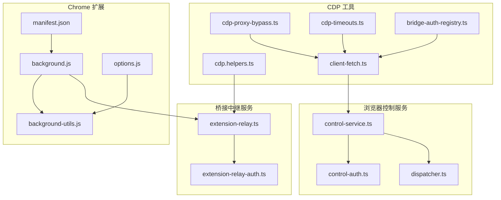
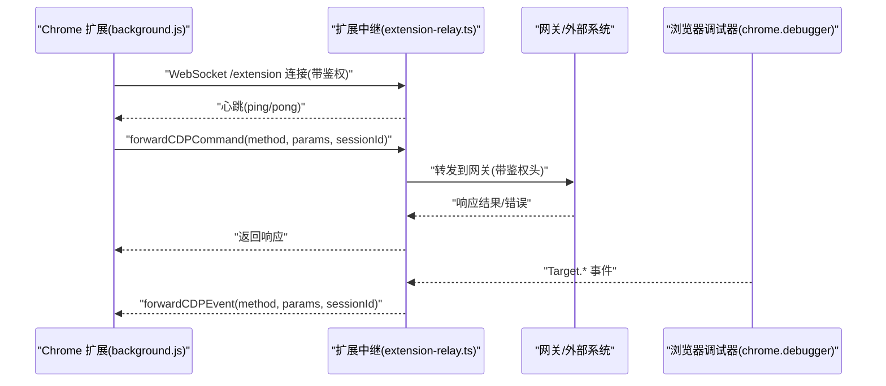
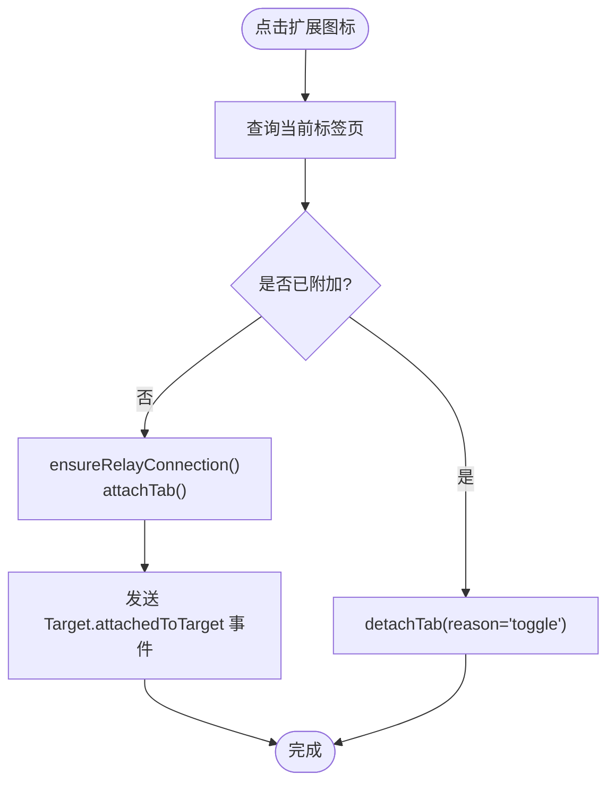
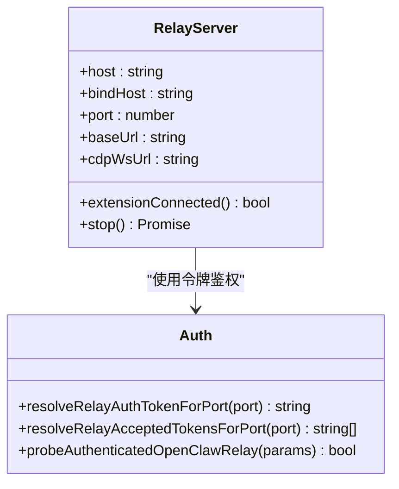
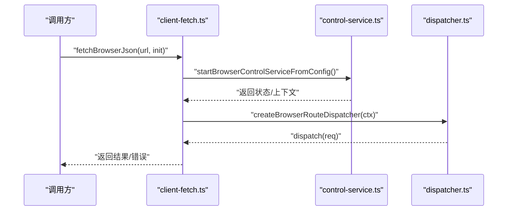
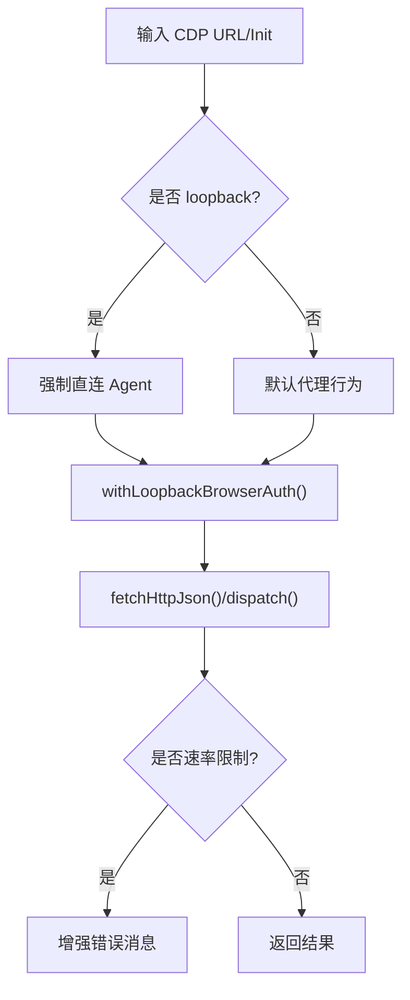
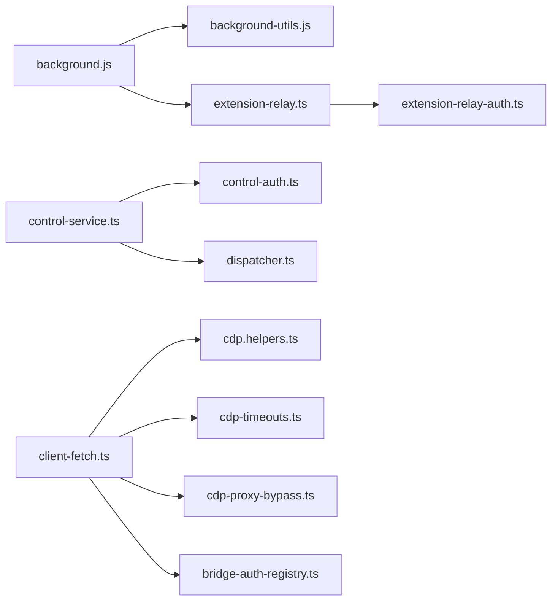

# 浏览器API

<cite>
**本文引用的文件**
- [manifest.json](file://assets/chrome-extension/manifest.json)
- [background.js](file://assets/chrome-extension/background.js)
- [background-utils.js](file://assets/chrome-extension/background-utils.js)
- [options.js](file://assets/chrome-extension/options.js)
- [extension-relay.ts](file://src/browser/extension-relay.ts)
- [extension-relay-auth.ts](file://src/browser/extension-relay-auth.ts)
- [cdp.helpers.ts](file://src/browser/cdp.helpers.ts)
- [cdp-proxy-bypass.ts](file://src/browser/cdp-proxy-bypass.ts)
- [cdp-timeouts.ts](file://src/browser/cdp-timeouts.ts)
- [client-fetch.ts](file://src/browser/client-fetch.ts)
- [dispatcher.ts](file://src/browser/routes/dispatcher.ts)
- [control-service.ts](file://src/browser/control-service.ts)
- [control-auth.ts](file://src/browser/control-auth.ts)
- [bridge-auth-registry.ts](file://src/browser/bridge-auth-registry.ts)
</cite>

## 目录

1. [简介](#简介)
2. [项目结构](#项目结构)
3. [核心组件](#核心组件)
4. [架构总览](#架构总览)
5. [详细组件分析](#详细组件分析)
6. [依赖关系分析](#依赖关系分析)
7. [性能考量](#性能考量)
8. [故障排查指南](#故障排查指南)
9. [结论](#结论)
10. [附录](#附录)

## 简介

本文件系统化阐述 OpenClaw 的浏览器 API 与桥接服务，覆盖以下主题：

- 浏览器桥接服务的架构与通信机制
- 浏览器客户端 API（页面操作、用户交互、数据获取）
- Chrome 扩展的 API 接口、权限声明与安全策略
- 浏览器内嵌 UI 组件的使用与自定义
- CDP（Chrome DevTools Protocol）集成方式与高级能力
- 浏览器会话管理、标签页操作与用户状态同步
- 跨浏览器兼容性与性能优化建议
- 安全限制与沙箱机制

## 项目结构

围绕浏览器 API 的关键目录与文件如下：

- Chrome 扩展：manifest、后台脚本、选项页与工具函数
- 桥接中继服务：扩展中继服务器、鉴权、CDP 命令路由与事件广播
- 浏览器控制服务：本地 HTTP 路由分发、鉴权与生命周期管理
- CDP 工具：URL 判定、代理绕过、超时配置、请求封装

**图表来源**

- [manifest.json:1-26](file://assets/chrome-extension/manifest.json#L1-L26)
- [background.js:1-1026](file://assets/chrome-extension/background.js#L1-L1026)
- [background-utils.js:1-65](file://assets/chrome-extension/background-utils.js#L1-L65)
- [options.js:1-75](file://assets/chrome-extension/options.js#L1-L75)
- [extension-relay.ts:1-1069](file://src/browser/extension-relay.ts#L1-L1069)
- [extension-relay-auth.ts:1-114](file://src/browser/extension-relay-auth.ts#L1-L114)
- [control-service.ts:1-66](file://src/browser/control-service.ts#L1-L66)
- [control-auth.ts:1-99](file://src/browser/control-auth.ts#L1-L99)
- [dispatcher.ts:1-134](file://src/browser/routes/dispatcher.ts#L1-L134)
- [cdp.helpers.ts:1-69](file://src/browser/cdp.helpers.ts#L1-L69)
- [cdp-proxy-bypass.ts:1-152](file://src/browser/cdp-proxy-bypass.ts#L1-L152)
- [cdp-timeouts.ts:1-55](file://src/browser/cdp-timeouts.ts#L1-L55)
- [client-fetch.ts:1-346](file://src/browser/client-fetch.ts#L1-L346)
- [bridge-auth-registry.ts:1-35](file://src/browser/bridge-auth-registry.ts#L1-L35)

**章节来源**

- [manifest.json:1-26](file://assets/chrome-extension/manifest.json#L1-L26)
- [background.js:1-1026](file://assets/chrome-extension/background.js#L1-L1026)
- [background-utils.js:1-65](file://assets/chrome-extension/background-utils.js#L1-L65)
- [options.js:1-75](file://assets/chrome-extension/options.js#L1-L75)
- [extension-relay.ts:1-1069](file://src/browser/extension-relay.ts#L1-L1069)
- [extension-relay-auth.ts:1-114](file://src/browser/extension-relay-auth.ts#L1-L114)
- [control-service.ts:1-66](file://src/browser/control-service.ts#L1-L66)
- [control-auth.ts:1-99](file://src/browser/control-auth.ts#L1-L99)
- [dispatcher.ts:1-134](file://src/browser/routes/dispatcher.ts#L1-L134)
- [cdp.helpers.ts:1-69](file://src/browser/cdp.helpers.ts#L1-L69)
- [cdp-proxy-bypass.ts:1-152](file://src/browser/cdp-proxy-bypass.ts#L1-L152)
- [cdp-timeouts.ts:1-55](file://src/browser/cdp-timeouts.ts#L1-L55)
- [client-fetch.ts:1-346](file://src/browser/client-fetch.ts#L1-L346)
- [bridge-auth-registry.ts:1-35](file://src/browser/bridge-auth-registry.ts#L1-L35)

## 核心组件

- Chrome 扩展桥接层
  - 权限与宿主权限：调试器、标签页、活动标签、存储、闹钟、导航
  - 后台逻辑：连接/断开中继、自动重连、挂起恢复、命令转发、事件广播
  - 选项页：端口与网关令牌设置、可达性检查
- 桥接中继服务
  - HTTP/WS 升级校验、鉴权头派生、目标会话映射、事件广播、命令路由
  - 对外暴露 /json/version、/json/list、/json/activate/:id、/json/close/:id
- 浏览器控制服务
  - 本地 HTTP 路由分发器、鉴权解析与生成、运行时生命周期
- CDP 工具集
  - WebSocket URL 判定、鉴权头合并、路径拼接
  - 代理绕过（localhost）、超时策略、fetch 封装与错误增强

**章节来源**

- [manifest.json:12-14](file://assets/chrome-extension/manifest.json#L12-L14)
- [background.js:166-227](file://assets/chrome-extension/background.js#L166-L227)
- [extension-relay.ts:225-261](file://src/browser/extension-relay.ts#L225-L261)
- [control-service.ts:23-53](file://src/browser/control-service.ts#L23-L53)
- [client-fetch.ts:235-341](file://src/browser/client-fetch.ts#L235-L341)
- [cdp.helpers.ts:16-69](file://src/browser/cdp.helpers.ts#L16-L69)

## 架构总览

OpenClaw 的浏览器桥接采用“扩展中继 + 控制服务”的双层架构：

- 扩展中继：在本地提供 HTTP/WS 端点，作为浏览器与网关之间的桥梁
- 控制服务：在本地提供 HTTP 路由，供工具链或上层调用执行页面操作
- CDP：通过扩展中继与浏览器调试器交互，实现标签页、会话与事件的统一管理

**图表来源**

- [background.js:485-493](file://assets/chrome-extension/background.js#L485-L493)
- [extension-relay.ts:349-362](file://src/browser/extension-relay.ts#L349-L362)
- [extension-relay-auth.ts:66-86](file://src/browser/extension-relay-auth.ts#L66-L86)

## 详细组件分析

### Chrome 扩展：桥接与会话管理

- 连接与重连
  - 预检本地中继可达性，建立 WebSocket /extension，处理握手挑战
  - 断线指数回退与可重试错误判定，支持短暂 MV3 Worker 重启后的恢复
- 会话与标签页
  - 通过 chrome.debugger.attach/Target.getTargetInfo 获取目标信息
  - 维护 tabs 映射、子会话与标签页的父子关系
  - 支持 Target.createTarget、Target.closeTarget、Target.activateTarget
- 事件与命令
  - 将 CDP 事件广播给中继；将中继命令转发给 chrome.debugger
  - 对 Runtime.enable 进行兼容性处理，避免冲突

**图表来源**

- [background.js:607-660](file://assets/chrome-extension/background.js#L607-L660)
- [background.js:510-551](file://assets/chrome-extension/background.js#L510-L551)

**章节来源**

- [background.js:166-227](file://assets/chrome-extension/background.js#L166-L227)
- [background.js:294-362](file://assets/chrome-extension/background.js#L294-L362)
- [background.js:510-551](file://assets/chrome-extension/background.js#L510-L551)
- [background.js:662-741](file://assets/chrome-extension/background.js#L662-L741)

### 扩展中继服务：鉴权、路由与广播

- 鉴权
  - 从环境/配置解析网关令牌，派生中继令牌；支持多令牌接受
  - HTTP /json/version、/json/list 与 WS /extension、/cdp 升级均需鉴权
- 路由
  - 处理 /json/activate/:id 与 /json/close/:id，转发至扩展执行
  - 内置 Target._、Browser._ 常用方法的本地实现与透传
- 广播
  - 将 CDP 事件广播给所有 CDP 客户端
  - 对扩展断线进行优雅清理与重连等待

**图表来源**

- [extension-relay.ts:114-122](file://src/browser/extension-relay.ts#L114-L122)
- [extension-relay-auth.ts:66-86](file://src/browser/extension-relay-auth.ts#L66-L86)

**章节来源**

- [extension-relay.ts:538-686](file://src/browser/extension-relay.ts#L538-L686)
- [extension-relay.ts:688-749](file://src/browser/extension-relay.ts#L688-L749)
- [extension-relay.ts:469-536](file://src/browser/extension-relay.ts#L469-L536)
- [extension-relay-auth.ts:66-86](file://src/browser/extension-relay-auth.ts#L66-L86)

### 浏览器控制服务：HTTP 路由与鉴权

- 启动与停止
  - 从配置解析浏览器控制开关与端口，确保鉴权可用，创建运行时状态
- 路由分发
  - 基于路径正则匹配注册路由，支持 GET/POST/DELETE
  - 提供参数解码与错误处理
- 认证
  - 解析网关鉴权（token/password），必要时自动生成启动鉴权并持久化

**图表来源**

- [client-fetch.ts:235-341](file://src/browser/client-fetch.ts#L235-L341)
- [control-service.ts:23-53](file://src/browser/control-service.ts#L23-L53)
- [dispatcher.ts:62-131](file://src/browser/routes/dispatcher.ts#L62-L131)

**章节来源**

- [control-service.ts:23-53](file://src/browser/control-service.ts#L23-L53)
- [dispatcher.ts:62-131](file://src/browser/routes/dispatcher.ts#L62-L131)
- [control-auth.ts:11-26](file://src/browser/control-auth.ts#L11-L26)

### CDP 工具集：代理绕过、超时与请求封装

- 代理绕过
  - 为 localhost/127.0.0.1 CDP 强制直连，避免代理干扰
- 超时策略
  - HTTP/WS/Profile 等多档超时，按配置与远端条件动态选择
- 请求封装
  - 自动注入 Authorization/x-openclaw-password，区分本地与远端错误提示
  - 对速率限制等进行语义化提示

**图表来源**

- [cdp-proxy-bypass.ts:24-36](file://src/browser/cdp-proxy-bypass.ts#L24-L36)
- [client-fetch.ts:39-99](file://src/browser/client-fetch.ts#L39-L99)
- [client-fetch.ts:214-233](file://src/browser/client-fetch.ts#L214-L233)

**章节来源**

- [cdp-proxy-bypass.ts:55-151](file://src/browser/cdp-proxy-bypass.ts#L55-L151)
- [cdp-timeouts.ts:28-54](file://src/browser/cdp-timeouts.ts#L28-L54)
- [client-fetch.ts:39-99](file://src/browser/client-fetch.ts#L39-L99)
- [client-fetch.ts:214-233](file://src/browser/client-fetch.ts#L214-L233)

## 依赖关系分析

- 扩展与中继
  - background.js 依赖 background-utils.js（端口/令牌派生、重连策略）
  - 中继服务依赖 extension-relay-auth.ts（令牌派生与校验）
- 控制服务与路由
  - control-service.ts 依赖 control-auth.ts（鉴权解析/生成）
  - dispatcher.ts 注册路由并分发请求
- CDP 与网络
  - client-fetch.ts 依赖 cdp.helpers.ts、cdp-timeouts.ts、cdp-proxy-bypass.ts
  - bridge-auth-registry.ts 用于动态端口的桥接鉴权

**图表来源**

- [background.js:1-10](file://assets/chrome-extension/background.js#L1-L10)
- [background-utils.js:31-40](file://assets/chrome-extension/background-utils.js#L31-L40)
- [extension-relay.ts:1-13](file://src/browser/extension-relay.ts#L1-L13)
- [extension-relay-auth.ts:1-12](file://src/browser/extension-relay-auth.ts#L1-L12)
- [control-service.ts:1-10](file://src/browser/control-service.ts#L1-L10)
- [control-auth.ts:1-9](file://src/browser/control-auth.ts#L1-L9)
- [dispatcher.ts:1-5](file://src/browser/routes/dispatcher.ts#L1-L5)
- [client-fetch.ts:1-11](file://src/browser/client-fetch.ts#L1-L11)
- [cdp.helpers.ts:1-9](file://src/browser/cdp.helpers.ts#L1-L9)
- [cdp-timeouts.ts:1-3](file://src/browser/cdp-timeouts.ts#L1-L3)
- [cdp-proxy-bypass.ts:1-14](file://src/browser/cdp-proxy-bypass.ts#L1-L14)
- [bridge-auth-registry.ts:1-8](file://src/browser/bridge-auth-registry.ts#L1-L8)

**章节来源**

- [background.js:1-10](file://assets/chrome-extension/background.js#L1-L10)
- [extension-relay.ts:1-13](file://src/browser/extension-relay.ts#L1-L13)
- [extension-relay-auth.ts:1-12](file://src/browser/extension-relay-auth.ts#L1-L12)
- [control-service.ts:1-10](file://src/browser/control-service.ts#L1-L10)
- [dispatcher.ts:1-5](file://src/browser/routes/dispatcher.ts#L1-L5)
- [client-fetch.ts:1-11](file://src/browser/client-fetch.ts#L1-L11)
- [cdp.helpers.ts:1-9](file://src/browser/cdp.helpers.ts#L1-L9)
- [cdp-proxy-bypass.ts:1-14](file://src/browser/cdp-proxy-bypass.ts#L1-L14)
- [bridge-auth-registry.ts:1-8](file://src/browser/bridge-auth-registry.ts#L1-L8)

## 性能考量

- 连接与重连
  - 使用指数回退与抖动，避免风暴式重试
  - 对短暂断线进行优雅恢复，减少用户感知
- 超时与并发
  - 为不同场景设置合理超时（HTTP/WS/Profile），避免阻塞
  - 对速率限制进行语义化提示，避免无效重试
- 代理与网络
  - 仅对 loopback CDP 强制直连，降低不必要的代理开销
  - 在动态端口桥接场景使用内存注册表缓存鉴权

**章节来源**

- [background-utils.js:1-12](file://assets/chrome-extension/background-utils.js#L1-L12)
- [cdp-timeouts.ts:28-54](file://src/browser/cdp-timeouts.ts#L28-L54)
- [cdp-proxy-bypass.ts:55-151](file://src/browser/cdp-proxy-bypass.ts#L55-L151)
- [client-fetch.ts:109-133](file://src/browser/client-fetch.ts#L109-L133)

## 故障排查指南

- 扩展未连接
  - 检查本地中继可达性与端口配置；确认网关令牌正确
  - 查看扩展徽章状态与错误提示，必要时打开帮助页
- 中继鉴权失败
  - 确认 /json/version 是否返回中继标识；核对鉴权头/查询参数
  - 若使用多令牌，确认接受列表包含当前令牌
- 会话丢失或事件缺失
  - 检查扩展断线清理定时器是否触发；确认 CDP 客户端是否在断线期间保持连接
  - 对 Target.\* 方法失败进行目标映射清理与事件广播
- 代理干扰
  - 确认 NO_PROXY 或直连 Agent 已生效；避免代理影响 loopback CDP

**章节来源**

- [options.js:26-49](file://assets/chrome-extension/options.js#L26-L49)
- [extension-relay-auth.ts:66-86](file://src/browser/extension-relay-auth.ts#L66-L86)
- [extension-relay.ts:293-315](file://src/browser/extension-relay.ts#L293-L315)
- [cdp-proxy-bypass.ts:55-151](file://src/browser/cdp-proxy-bypass.ts#L55-L151)

## 结论

OpenClaw 的浏览器 API 以“扩展中继 + 控制服务”为核心，结合 CDP 与本地 HTTP 路由，提供了稳定、可扩展且安全的浏览器控制能力。通过严格的鉴权、优雅的重连与事件广播、以及针对代理与超时的工程化处理，系统在复杂环境中仍能保持高可用与易用性。

## 附录

### Chrome 扩展 API 与权限

- 权限
  - 调试器：用于 attach/Target/Runtime 等调试能力
  - 标签页/活动标签：用于创建/激活/关闭标签页
  - 存储：持久化端口与令牌
  - 闹钟：重连调度
  - 导航：监听导航事件
- 宿主权限
  - 本地回环地址访问（127.0.0.1/localhost）

**章节来源**

- [manifest.json:12-14](file://assets/chrome-extension/manifest.json#L12-L14)

### 浏览器客户端 API（HTTP 路由）

- 路由注册与分发
  - 支持 GET/POST/DELETE，路径参数自动解码
  - 404/500 错误标准化
- 典型能力
  - 页面操作：通过扩展中继转发 Target.\* 命令
  - 数据获取：通过控制服务路由返回结构化结果
  - 用户交互：通过扩展徽章与标题反馈状态

**章节来源**

- [dispatcher.ts:62-131](file://src/browser/routes/dispatcher.ts#L62-L131)
- [client-fetch.ts:235-341](file://src/browser/client-fetch.ts#L235-L341)

### CDP 集成与高级功能

- WebSocket URL 判定与路径拼接
- 鉴权头合并（Authorization/x-openclaw-password）
- 代理绕过与超时策略
- 动态端口桥接鉴权注册

**章节来源**

- [cdp.helpers.ts:16-69](file://src/browser/cdp.helpers.ts#L16-L69)
- [cdp-proxy-bypass.ts:24-36](file://src/browser/cdp-proxy-bypass.ts#L24-L36)
- [cdp-timeouts.ts:1-55](file://src/browser/cdp-timeouts.ts#L1-L55)
- [bridge-auth-registry.ts:10-27](file://src/browser/bridge-auth-registry.ts#L10-L27)

### 会话管理与用户状态同步

- 会话映射
  - tabs、tabBySession、childSessionToTab 维护主/子会话关系
- 状态持久化
  - 使用 chrome.storage.session 持久化附加标签页，Worker 重启后快速恢复
- 事件同步
  - Target.\* 事件通过中继广播，保持多客户端一致

**章节来源**

- [background.js:28-40](file://assets/chrome-extension/background.js#L28-L40)
- [background.js:114-164](file://assets/chrome-extension/background.js#L114-L164)
- [extension-relay.ts:445-467](file://src/browser/extension-relay.ts#L445-L467)

### 跨浏览器兼容性与安全策略

- 跨浏览器
  - 通过 CDP 1.3 协议与通用 Target.\* 方法实现基础能力
  - 本地中继仅面向回环地址，避免跨主机风险
- 安全策略
  - 鉴权头仅在本地中继与控制服务之间传递
  - 严格校验 Origin，拒绝非扩展来源的升级
  - 对速率限制与不可达错误进行语义化提示，避免泄露细节

**章节来源**

- [extension-relay.ts:538-572](file://src/browser/extension-relay.ts#L538-L572)
- [extension-relay.ts:691-749](file://src/browser/extension-relay.ts#L691-L749)
- [client-fetch.ts:109-133](file://src/browser/client-fetch.ts#L109-L133)
