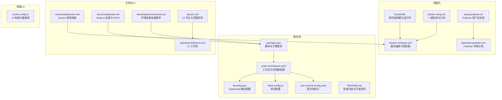
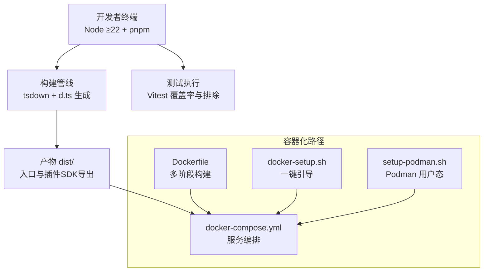
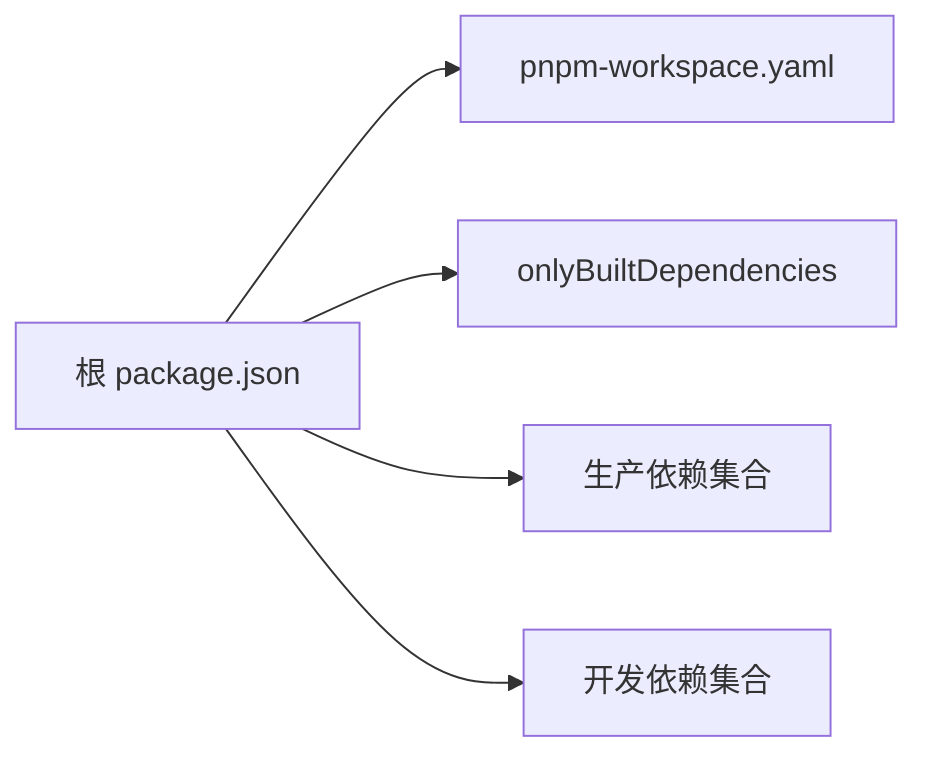

# 开发环境

<cite>
**本文引用的文件**
- [package.json](file://package.json)
- [pnpm-workspace.yaml](file://pnpm-workspace.yaml)
- [Dockerfile](file://Dockerfile)
- [docker-compose.yml](file://docker-compose.yml)
- [tsconfig.json](file://tsconfig.json)
- [vitest.config.ts](file://vitest.config.ts)
- [.pre-commit-config.yaml](file://.pre-commit-config.yaml)
- [README.md](file://README.md)
- [docs/install/docker.md](file://docs/install/docker.md)
- [docs/install/node.md](file://docs/install/node.md)
- [docs/help/environment.md](file://docs/help/environment.md)
- [docs/ci.md](file://docs/ci.md)
- [setup-podman.sh](file://setup-podman.sh)
- [docker-setup.sh](file://docker-setup.sh)
- [openclaw.podman.env](file://openclaw.podman.env)
- [ui/vite.config.ts](file://ui/vite.config.ts)
- [.github/workflows/ci.yml](file://.github/workflows/ci.yml)
</cite>

## 目录

1. [简介](#简介)
2. [项目结构](#项目结构)
3. [核心组件](#核心组件)
4. [架构总览](#架构总览)
5. [详细组件分析](#详细组件分析)
6. [依赖分析](#依赖分析)
7. [性能考虑](#性能考虑)
8. [故障排查指南](#故障排查指南)
9. [结论](#结论)
10. [附录](#附录)

## 简介

本指南面向在 OpenClaw 项目中进行本地与容器化开发的工程师，覆盖从 Node.js 版本要求、包管理器选择、构建工具配置，到 Docker/Podman 容器化环境、IDE 配置与调试、代码格式化与静态检查、CI/CD 流水线、自动化测试与部署、以及跨平台兼容性与环境变量管理等完整开发链路。目标是帮助你以最小成本完成环境搭建并高效迭代。

## 项目结构

OpenClaw 是一个多语言混合工程，包含 Node.js 后端、TypeScript 构建系统、Vitest 单元测试、UI 子项目（Vite）、Swift 原生应用（macOS/iOS）以及大量扩展与技能脚本。仓库采用 pnpm 工作区组织，支持多平台与多运行时（Node、Bun、Swift）协同开发。

图表来源

- [package.json:1-465](file://package.json#L1-L465)
- [pnpm-workspace.yaml:1-18](file://pnpm-workspace.yaml#L1-L18)
- [Dockerfile:1-231](file://Dockerfile#L1-L231)
- [docker-compose.yml:1-77](file://docker-compose.yml#L1-L77)
- [tsconfig.json:1-29](file://tsconfig.json#L1-L29)
- [vitest.config.ts:1-203](file://vitest.config.ts#L1-L203)
- [.pre-commit-config.yaml:1-158](file://.pre-commit-config.yaml#L1-L158)
- [docs/install/docker.md:1-844](file://docs/install/docker.md#L1-L844)
- [docs/install/node.md:1-139](file://docs/install/node.md#L1-L139)
- [docs/help/environment.md:1-141](file://docs/help/environment.md#L1-L141)
- [docs/ci.md:1-57](file://docs/ci.md#L1-L57)
- [ui/vite.config.ts:1-44](file://ui/vite.config.ts#L1-L44)
- [.github/workflows/ci.yml:1-737](file://.github/workflows/ci.yml#L1-L737)

章节来源

- [README.md:1-560](file://README.md#L1-L560)
- [package.json:1-465](file://package.json#L1-L465)
- [pnpm-workspace.yaml:1-18](file://pnpm-workspace.yaml#L1-L18)

## 核心组件

- Node.js 运行时与包管理：要求 Node ≥22；推荐使用 pnpm（工作区 + 仅构建依赖优化），可选 Bun 运行 TypeScript。
- TypeScript 构建与类型：tsconfig.json 指定 NodeNext 模块解析、严格模式与路径别名；配合 tsdown 构建与 d.ts 生成。
- 测试框架：Vitest 提供 fork 池、覆盖率阈值与排除策略，覆盖核心模块与 UI。
- 容器化：Docker 多阶段构建，提供默认安全非 root 用户运行；Compose 支持网关、CLI、可选沙箱与浏览器预装。
- 文档与 CI：CI 通过变更范围检测跳过无关任务；文档涵盖 Docker、Node、环境变量与 CI 流程。
- 前端 UI：Vite 构建控制面板，支持基路径与源码映射。

章节来源

- [package.json:422-426](file://package.json#L422-L426)
- [tsconfig.json:1-29](file://tsconfig.json#L1-L29)
- [vitest.config.ts:1-203](file://vitest.config.ts#L1-L203)
- [Dockerfile:1-231](file://Dockerfile#L1-L231)
- [docker-compose.yml:1-77](file://docker-compose.yml#L1-L77)
- [ui/vite.config.ts:1-44](file://ui/vite.config.ts#L1-L44)
- [docs/ci.md:1-57](file://docs/ci.md#L1-L57)

## 架构总览

下图展示本地开发与容器化开发两种路径的交互关系与关键组件。

图表来源

- [package.json:217-338](file://package.json#L217-L338)
- [Dockerfile:1-231](file://Dockerfile#L1-L231)
- [docker-compose.yml:1-77](file://docker-compose.yml#L1-L77)
- [docker-setup.sh:1-598](file://docker-setup.sh#L1-L598)
- [setup-podman.sh:1-313](file://setup-podman.sh#L1-L313)

## 详细组件分析

### Node.js 与包管理器

- 版本要求：Node ≥22；引擎字段与脚本均基于此版本设计。
- 包管理器：优先使用 pnpm（工作区 + 仅构建依赖），可选 Bun 运行 TypeScript 文件。
- 依赖锁定：pnpm-lock.yaml；工作区定义在 pnpm-workspace.yaml。
- 仅构建依赖：通过 onlyBuiltDependencies 降低安装体积与风险。

建议

- 使用版本管理器（fnm/nvm/mise）固定 Node 22 并初始化 shell。
- 在 CI 与本地统一 pnpm 版本，避免缓存不一致。

章节来源

- [package.json:422-426](file://package.json#L422-L426)
- [pnpm-workspace.yaml:1-18](file://pnpm-workspace.yaml#L1-L18)
- [docs/install/node.md:1-139](file://docs/install/node.md#L1-L139)

### TypeScript 与构建配置

- 模块解析：NodeNext；路径别名用于插件 SDK。
- 严格模式与目标：ES2023；声明输出；禁止 emit 错误。
- 插件 SDK 导出：通过 exports 字段为各渠道 SDK 提供入口与类型。

建议

- 保持 tsconfig 与 Vitest 别名一致，避免测试路径解析问题。
- 构建前先生成 d.ts，确保插件 SDK 类型可用。

章节来源

- [tsconfig.json:1-29](file://tsconfig.json#L1-L29)
- [package.json:37-216](file://package.json#L37-L216)

### 测试与覆盖率

- 测试池：fork 模式；Windows 下 hook 超时更长；按 CPU 数量动态 Worker 数。
- 排除策略：大模块与集成面通过 include/exclude 控制覆盖率锚点，避免过度排除。
- 覆盖率阈值：lines/functions/branches/statements 70%/70%/55%/70%。

建议

- 本地开发使用 vitest.watch 或 pnpm test:watch；CI 使用 --coverage。
- 对大模块采用 e2e/contract 测试补充验证。

章节来源

- [vitest.config.ts:1-203](file://vitest.config.ts#L1-L203)

### 容器化与编排

- Dockerfile：多阶段构建，分离扩展依赖提取层；默认运行 node:22-bookworm；非 root 用户；健康探针。
- docker-compose：网关与 CLI 服务；卷挂载配置目录与工作空间；可选 Docker socket 沙箱挂载。
- docker-setup.sh：一键构建/拉取镜像、引导向导、写入 .env、开启沙箱（可选）。
- setup-podman.sh：用户态 Podman 安装、镜像导入、启动脚本与可选 systemd Quadlet。
- openclaw.podman.env：Podman 环境示例（令牌、端口、绑定模式、可选模型密钥）。

建议

- 生产环境使用非 root 运行；如需沙箱，确保镜像包含 Docker CLI 或启用 OPENCLAW_INSTALL_DOCKER_CLI。
- 通过 OPENCLAW_EXTRA_MOUNTS 与 OPENCLAW_HOME_VOLUME 管理持久化与额外挂载。

章节来源

- [Dockerfile:1-231](file://Dockerfile#L1-L231)
- [docker-compose.yml:1-77](file://docker-compose.yml#L1-L77)
- [docker-setup.sh:1-598](file://docker-setup.sh#L1-L598)
- [setup-podman.sh:1-313](file://setup-podman.sh#L1-L313)
- [openclaw.podman.env:1-25](file://openclaw.podman.env#L1-L25)
- [docs/install/docker.md:1-844](file://docs/install/docker.md#L1-L844)

### IDE 配置与调试

- VS Code/JetBrains：建议启用 TypeScript 严格模式、ESLint/Oxlint、Prettier/oxfmt；对 Swift 使用 SwiftLint/SwiftFormat。
- 调试建议：使用 pnpm dev/gateway:dev/watch；或直接 node --inspect-brk 执行入口。
- UI 调试：Vite 服务器 host/port/strictPort；基路径通过 OPENCLAW_CONTROL_UI_BASE_PATH 控制。

章节来源

- [.pre-commit-config.yaml:1-158](file://.pre-commit-config.yaml#L1-L158)
- [ui/vite.config.ts:1-44](file://ui/vite.config.ts#L1-L44)

### 代码格式化与静态检查

- Node：oxlint（类型感知）+ oxfmt；Swift：swiftlint/swiftformat。
- Git Hooks：pre-commit 集成 YAML/Shell/Actions/Secret 检测与生产依赖审计。
- CI：与本地钩子一致，确保质量门禁。

章节来源

- [.pre-commit-config.yaml:1-158](file://.pre-commit-config.yaml#L1-L158)
- [docs/ci.md:1-57](file://docs/ci.md#L1-L57)

### CI/CD 流水线

- 作业概览：docs-scope、changed-scope、check、check-docs、build-artifacts、checks、checks-windows、macos、android。
- 跳过策略：根据变更范围检测跳过昂贵任务；Windows/macOS 专用作业。
- 本地等效：pnpm check/test/release:check 等价于 CI 步骤。

建议

- 本地先运行 pnpm check 与 pnpm test，减少 CI 失败重试。
- 变更范围检测逻辑位于 scripts/ci-changed-scope.mjs。

章节来源

- [.github/workflows/ci.yml:1-737](file://.github/workflows/ci.yml#L1-L737)
- [docs/ci.md:1-57](file://docs/ci.md#L1-L57)

### 环境变量与配置文件模板

- 加载顺序（高→低）：进程环境、当前目录 .env、全局 ~/.openclaw/.env、配置文件 env 块、登录壳导入（仅缺失键）。
- 关键变量：OPENCLAW_HOME/OPENCLAW_STATE_DIR/OPENCLAW_CONFIG_PATH、日志级别、主题、Shell 注入标记。
- 配置内变量替换：${VAR} 语法；SecretRef 与 ${ENV} 的区别见文档。

建议

- 将令牌与密钥放入 ~/.openclaw/.env；避免硬编码到仓库。
- 使用 config set 设置 gateway.mode 与 bind，确保 CLI 与容器网络互通。

章节来源

- [docs/help/environment.md:1-141](file://docs/help/environment.md#L1-L141)
- [docker-setup.sh:125-131](file://docker-setup.sh#L125-L131)

### 跨平台兼容性

- Node：统一 Node 22；Windows 专用作业与 worker 数限制。
- macOS：XcodeGen、SwiftLint/SwiftFormat；缓存 SwiftPM。
- Android：Gradle 8.11.1；JDK 17（CI）。
- Linux：Docker/Podman；权限与 UID/GID 注意事项。

章节来源

- [.github/workflows/ci.yml:330-453](file://.github/workflows/ci.yml#L330-L453)
- [docs/install/docker.md:392-404](file://docs/install/docker.md#L392-L404)

## 依赖分析

- Node 依赖：Express/Hono/Playwright/SQLite/Canvas 等；部分原生依赖通过 onlyBuiltDependencies 管控。
- 工作区：根工作区 + ui + packages/_ + extensions/_；仅构建依赖减少安装时间与内存占用。
- 仅构建依赖：@lydell/node-pty、@napi-rs/canvas、node-llama-cpp、sharp 等。

图表来源

- [package.json:426-463](file://package.json#L426-L463)
- [pnpm-workspace.yaml:1-18](file://pnpm-workspace.yaml#L1-L18)

章节来源

- [package.json:340-463](file://package.json#L340-L463)
- [pnpm-workspace.yaml:1-18](file://pnpm-workspace.yaml#L1-L18)

## 性能考虑

- 构建缓存：Dockerfile 层顺序优化；pnpm store 缓存；SwiftPM 缓存。
- 测试并发：按 CPU 数动态 Worker；Windows 限制以避免 OOM。
- UI 构建：Vite 默认 chunkSize 警告阈值调优；Sourcemap 仅在需要时启用。
- 容器镜像：Slim 基础镜像与按需安装 apt 包；预装浏览器减少首次启动等待。

章节来源

- [Dockerfile:40-90](file://Dockerfile#L40-L90)
- [vitest.config.ts:8-11](file://vitest.config.ts#L8-L11)
- [ui/vite.config.ts:30-36](file://ui/vite.config.ts#L30-L36)

## 故障排查指南

常见问题与定位思路

- 命令未找到（openclaw）：检查 npm prefix -g 与 PATH 初始化；Windows 需要系统 PATH 配置。
- 权限错误（npm install -g）：切换 prefix 到用户可写目录并追加到 PATH。
- Docker 权限（EACCES）：确保宿主机 bind 目录属主为 uid 1000；或使用 named volume。
- Windows OOM：调整 OPENCLAW_TEST_MAX_OLD_SPACE_SIZE_MB；限制并发。
- CI 跳过昂贵任务：确认变更范围检测是否命中 docs-only 或仅 native 变更。
- 环境变量未生效：核对加载顺序与 config env 块；必要时启用 shellEnv 导入。

章节来源

- [docs/install/node.md:89-139](file://docs/install/node.md#L89-L139)
- [docs/install/docker.md:392-404](file://docs/install/docker.md#L392-L404)
- [.github/workflows/ci.yml:12-78](file://.github/workflows/ci.yml#L12-L78)
- [docs/help/environment.md:14-22](file://docs/help/environment.md#L14-L22)

## 结论

通过统一 Node 22、pnpm 工作区与严格的 CI/CD 质量门禁，结合 Docker/Podman 的容器化与沙箱能力，OpenClaw 能在多平台提供一致且可复现的开发体验。建议在本地先完成 check/test，再进入容器验证，以缩短反馈周期并降低回归风险。

## 附录

### 快速开始清单

- 安装 Node 22（推荐 fnm）并初始化 shell。
- 安装 pnpm（或 Bun）；安装依赖后执行 pnpm build 与 pnpm ui:build。
- 本地开发：pnpm dev/gateway:dev/watch；容器化：./docker-setup.sh 或 setup-podman.sh。
- 调试：VS Code/IntelliJ 配置 TS/ESLint/Oxlint；UI 使用 Vite dev server。
- CI：本地等效命令 pnpm check/test/release:check。

章节来源

- [README.md:92-111](file://README.md#L92-L111)
- [docs/install/node.md:70-87](file://docs/install/node.md#L70-L87)
- [docs/install/docker.md:35-84](file://docs/install/docker.md#L35-L84)
